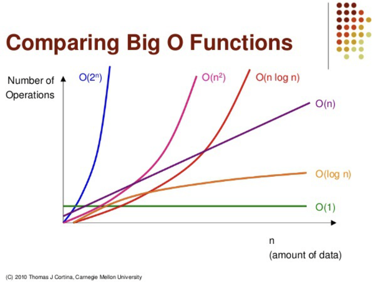

# Big-O notation (빅 오 표기법)

알고리즘의 효율성을 표기해주는 표기법이다.

- 알고리즘의 효율성
  - 데이터의 개수(n)가 주어졌을 때 기본연산의 횟수를 생각하면 편하다.

빅 오 표기법은 주로 시/공간 복잡도를 나타내는데 사용된다. 시간, 공간 복잡도를 나타내는 방법으로는 점근 표기법이 있다.

- 점근 표기법
  - 빅 오
    - 상한선 기준
  - 빅 오메가
    - 하한선 기준
  - 빅 세타
    - 하한선과 상한선의 사이를 기준

여기서 빅 오 표기법을 쓰는 이유는 알고리즘 복잡도의 상한선을 기준으로 잡아서 최악을 최대한 피하기 위함이다.

- 그렇다고 해서 상한선이 알고리즘 효율성의 최악의 경우는 아니다.

## 빅 오 표기법의 수학적 정의

>모든 0 < m <= n에 대해서 0 <= f(n) <= k*g(n)을 만족하는 두 양수 m과 k가 존재하면, f(n) = O(g(n)이다.

- 여기서 f(n)은 직접 만든 알고리즘의 시간 효율성이다.

예를 들어, $f(n) = n^2 + 2n + 3$, $g(n) = n^2$ 이라고 가정해보자.

$f(n) <= k *g(n)$ 을 나타내보면, $n^2 + 2n + 3 <= k* n^2$ 이 성립하는 것을 알 수 있다.

그러므로 위의 식이 성립하는 k값이 존재한다는 것이 증명된다.

- 직접 만든 알고리즘은 빅 오 표기법을 사용해서 $f(n)$ 을 $O(n^2)$ 으로 나타낼 수 있다.

## 빅 오 표기법의 특징

1. 상수가 곱해져 있는 항에서 상수를 무시할 수 있다.
   - ex) $O(2n) = O(n)$
2. 영향력이 적은 항은 무시할 수 있다.
   - ex) $O(n^2 + 2n + 4) = O(n^2)$

## 빅 오 표기법의 성능 비교

## 빅 오 표기법 예시

- 스택에서 push, pop
  - $O(1)$
- 이진 트리
  - $O(log n)$
- 반복문
  - $O(n)$
- quick sort, merge sort, heap sort
  - $O(nlogn)$
- 이중 반복문, insertion sort, bubble sort, selection sort
  - $O(n^2)$
- 피보나치 수열
  - $O(2^n)$