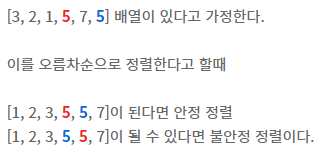

- [정렬 유형](#정렬-유형)
- [버블 정렬](#버블-정렬)
- [향상된 버블 정렬](#향상된-버블-정렬)
- [삽입 정렬](#삽입-정렬)
- [선택 정렬](#선택-정렬)
- [병합 정렬](#병합-정렬)
- [퀵 정렬](#퀵-정렬)
- [퀵 선택](#퀵-선택)
- [버킷 정렬](#버킷-정렬)
- [안정 정렬](#안정-정렬)
- [정렬 문제](#정렬-문제)
  - [0과 1 나누기](#0과-1-나누기)
  - [0, 1, 2 나누기](#0-1-2-나누기)

# 정렬 유형

- 내부 정렬
  - 모든 원소를 한 번에 메모리로 읽어 들여서 정렬을 수행
    - 선택 정렬
    - 삽입 정렬
    - 버블 정렬
    - 퀵 정렬
    - 병합 정렬
- 외부 정렬
  - 데이터 크기가 너무 커서 전체 데이터를 메모리에 읽어 들이는 것이 불가능할 때 데이터를 여러 덩어리로 나누어서 정렬
    - 병합 정렬

---

# 버블 정렬

- 가장 느린 정렬 알고리즘
- 작은 데이터에 적합

```c
void    BubbleSort(int arr[], int size)
{
    int i, j, temp;
    for (i = 0; i < (size - 1); i++)
        for (j = 0; j < size - 1 - i; j++)
            if (arr[j] > arr[j + 1])
            {
                temp = arr[j];
                arr[j] = arr[j + 1];
                arr[j + 1] = temp;
            }
}

#include <stdio.h>

int main(void)
{
    int arr[10] = {2, 1, 5, 4, 3, 7, 8, 9, 6, 0};
    BubbleSort(arr, 10);
    for (int i = 0; i < 10; i++)
        printf("%d ", arr[i]);
}
```

# 향상된 버블 정렬

이미 정렬이 완료된 배열을 굳이 다시 확인해 볼 필요가 없으므로 정렬을 중간에 멈추게 할 수 있다.

```c
void    BubbleSort2(int arr[], int size)
{
    int i, j, tmp, swapped = 1;
    for (i = 0; i < (size - 1) && swapped; i++)
    {
        swapped = 0;
        for (j = 0; j < size - 1 - i; j++)
        {
            if (arr[j] > arr[j + 1])
            {
                tmp = arr[j];
                arr[j] = arr[j + 1];
                arr[j + 1] = tmp;
                swapped = 1;
            }
        }
    }    
}

#include <stdio.h>

int main(void)
{
    int arr[10] = {3, 7, 5, 8, 2, 1, 0, 9, 4, 6};
    BubbleSort2(arr, 10);
    for (int i = 0; i < 10; i++)
        printf("%d ", arr[i]);
    printf("\n");
}
```

---

# 삽입 정렬

한 원소를 정해서 다른 원소와 비교하여 정렬한다.

```c
void    InsertionSort(int arr[], int size)
{
    int i, j, tmp;
    for (i = 1; i < size; i++)
    {
        tmp = arr[i];
        for (j = i; (j > 0) && (arr[j - 1] > tmp); j--)
            arr[j] = arr[j - 1];
        arr[j] = tmp;
    }
}

#include <stdio.h>

int main(void)
{
    int arr[10] = {0, 9, 8, 7, 6, 5, 4, 3, 2, 1};
    InsertionSort(arr, 10);
    for (int i = 0; i < 10; i++)
        printf("%d", arr[i]);
    printf("\n");
}
```

---

# 선택 정렬

선택 정렬은 정렬되지 않은 배열에서 가장 큰 값을 찾아 맨 뒤에 놓는다.

- (n - 1)번 반복

```c
void    SelectionSort(int arr[], int size)
{
    int i, j, max, tmp;
    for(i = 0; i < (size - 1); i++)
    {
        max = 0;
        for (j = 0; j <= size - 1 - i; j++)
            if (arr[j] > arr[max])
                max = j;
        tmp = arr[size - 1 - i];
        arr[size - 1 - i] = arr[max];
        arr[max] = tmp;
    }
}

#include <stdio.h>

int main(void)
{
    int arr[10] = {0, 9, 8, 7, 6, 5, 4, 3, 2, 1};
    SelectionSort(arr, 10);
    for (int i = 0; i < 10; i++)
        printf("%d", arr[i]);
    printf("\n");
}
```

물론 가장 작은 값을 찾아 맨 앞에 놓으면서 선택 정렬을 진행할 수 있다.

```c
void    SelectionSort2(int arr[], int size)
{
    int i, j, min, tmp;
    for (i = 0; i < size - 1; i++)
    {
        min = i;
        for (j = i + 1; j < size; j++)
            if (arr[j] < arr[min])
                min = j;
        tmp = arr[i];
        arr[i] = arr[min];
        arr[min] = tmp;
    }
}

#include <stdio.h>

int main(void)
{
    int arr[10] = {0, 9, 8, 7, 6, 5, 4, 3, 2, 1};
    SelectionSort2(arr, 10);
    for (int i = 0; i < 10; i++)
        printf("%d", arr[i]);
    printf("\n");
}
```

---

# 병합 정렬

병합 정렬은 각 단계에서 입력을 반으로 나눠 재귀 호출을 한다.

- 두 부분을 각각 재귀적으로 정렬한 후 마지막에 최종 정렬된 출력으로 결과를 병합한다.
- 배열에 원소가 두개씩만 존재할 때까지 재귀로 나눠준다.
- 다 나눴으면 오름차순이나 내림차순으로 정렬하면서 병합시켜준다.

큰 배열의 정렬에 사용하는 것은 비추, 연결 리스트를 정렬하는 데 가장 적합하다.

```c
#include <stdlib.h>

void    Merge(int *arr, int *temparr, int lowerIndex, int middleIndex, int upperIndex)
{
    int lowerStart = lowerIndex;
    int lowerStop = middleIndex;
    int upperStart = middleIndex + 1;
    int upperStop = upperIndex;
    int count = lowerIndex;
    while (lowerStart <= lowerStop && upperStart <= upperStop)
    {
        if (arr[lowerStart] < arr[upperStart])
            temparr[count++] = arr[lowerStart++];
        else
            temparr[count++] = arr[upperStart++];
    }
    while (lowerStart <= lowerStop)
        temparr[count++] = arr[lowerStart++];
    while (upperStart <= upperStop)
        temparr[count++] = arr[upperStart++];
    for (int i = lowerIndex; i <= upperIndex; i++)
        arr[i] = temparr[i];
}

void MergeSortUtil(int *arr, int *temparr, int lowerIndex, int upperIndex)
{
    if (lowerIndex >= upperIndex)
        return ;
    int middleIndex = (lowerIndex + upperIndex) / 2;
    MergeSortUtil(arr, temparr, lowerIndex, middleIndex);
    MergeSortUtil(arr, temparr, middleIndex + 1, upperIndex);
    Merge(arr, temparr, lowerIndex, middleIndex, upperIndex);
}

void    MergeSort(int *arr, int size)
{
    int *temparr = (int *)malloc(sizeof(int) * size);
    MergeSortUtil(arr, temparr, 0, size - 1);
}

#include <stdio.h>

int main(void)
{
    int arr[10] = {0, 9, 8, 7, 6, 5, 4, 3, 2, 1};
    MergeSort(arr, 10);
    for (int i = 0; i < 10; i++)
        printf("%d", arr[i]);
    printf("\n");
}
```

---

# 퀵 정렬

퀵 정렬은 재귀 알고리즘으로 각 단계에서 피벗(pivot)을 선택하여 피벗보다 작은 원소는 피벗의 왼쪽, 큰 원소는 오른쪽에 배치하여 그 부분 배열에서 또 피벗을 사용해 앞의 과정을 반복하여 정렬한다.

```c
void    QuickSortUtil(int arr[], int lower, int upper)
{
    int tmp;
    if (upper <= lower)
        return ;
    int pivot = arr[lower];
    int start = lower;
    int stop = upper;
    while (lower < upper)
    {
        while (arr[lower] <= pivot)
            lower++;
        while (arr[upper] > pivot)
            upper--;
        if (lower < upper)
        {
            tmp = arr[lower];
            arr[lower] = arr[upper];
            arr[upper] = tmp;
        }
    }
    
    tmp = arr[upper];
    arr[upper] = arr[start];
    arr[start] = tmp;
    QuickSortUtil(arr, start, upper - 1); //upper의 자리는 현재 pivot의 자리
    QuickSortUtil(arr, upper + 1, stop);
}

void    QuickSort(int arr[], int size)
{
    QuickSortUtil(arr, 0, size - 1);
}

#include <stdio.h>

int main(void)
{
    int arr[10] = {0, 9, 8, 7, 6, 5, 4, 3, 2, 1};
    QuickSort(arr, 10);
    for (int i = 0; i < 10; i++)
        printf("%d", arr[i]);
    printf("\n");
}
```

---

# 퀵 선택

퀵 선택은 정렬 알고리즘이 아니고, 정렬된 배열에서 k번째 위치에 있는 원소를 찾는 데 사용

```c
#include <stdio.h>

void    swap(int *arr, int a, int b)
{
    int tmp;
    tmp = arr[a];
    arr[a] = arr[b];
    arr[b] = tmp;
}

void    QuickSelectUtil(int arr[], int lower, int upper, int k)
{
    if (upper <= lower)
        return ;

    int pivot = arr[lower];
    int start = lower;
    int stop = upper;

    while (lower < upper)
    {
        while (lower < upper && arr[lower] <= pivot)
            lower++;
        while (lower <= upper && arr[upper] > pivot)
            upper--;
        if (lower < upper)
            swap(arr, upper, lower);
    }
    
    swap(arr, upper, start); //upper는 pivot의 위치

    if (k < upper)
        QuickSelectUtil(arr, start, upper - 1, k);
    if (k > upper)
        QuickSelectUtil(arr, upper + 1, stop, k);
}

int QuickSelect(int *a, int count, int index)
{
    QuickSelectUtil(a, 0, count - 1, index - 1);
    return (a[index - 1]);
}

int main(void)
{
    int arr[10] = {4, 5, 3, 7, 6, 1, 9, 2, 10, 8};
    printf("5번째 원소 : %d\n", QuickSelect(arr, sizeof(arr) / sizeof(int), 5));
}
```

---

# 버킷 정렬

가장 간단하고 효율적인 정렬 알고리즘

각 인덱스마다 카운트를 저장하는 카운트 배열을 만든다.

- 카운트 배열을 0으로 초기화시키고 입력 배열에 해당하는 인덱스를 증가시킨다.
- 카운트 배열에 저장된 데이터를 바탕으로 결과 배열을 구성한다.

```c
#include <stdio.h>
#include <stdlib.h>

void    BucketSort(int arr[], int size , int range)
{
    int i, j = 0;
    int *count = (int *)malloc(sizeof(int) * (range + 1));
    
    for (i = 0; i < range; i++)
        count[i] = 0;
    
    for (i = 0; i < size; i++)
        count[arr[i]]++;
    
    for (i = 0; i < range; i++)
        for (; count[i] > 0; count[i]--)
            arr[j++] = i;
    
    free(count);
}

int main(void)
{
    int arr[10] = {2, 6, 4, 1, 5, 8, 1, 4, 6, 1};
    BucketSort(arr, sizeof(arr) / sizeof(int), 10);
    for (int i = 0; i < 10; i++)
        printf("%d ", arr[i]);
    printf("\n");
}
```

---

# 안정 정렬

동일한 키의 두 원소가 정렬하기 전 순서대로 정렬 결과에 순서가 유지되는 것을 안정 정렬이라고 한다.

- 버블 정렬
- 삽입 정렬
- 퀵 정렬
- 선택 정렬




# 정렬 문제

## 0과 1 나누기

```c
#include <stdio.h>

void swap(int *arr, int a, int b)
{
    int tmp;

    tmp = arr[a];
    arr[a] = arr[b];
    arr[b] = tmp;
}

int Partition01(int *arr, int size)
{
    int zero = 0, one = size - 1, count = 0;

    while (zero < one && zero + 1 != one)
    {
        while (arr[zero] == 0 && zero < one)
            zero++;
        while (arr[one] == 1 && zero < one)
            one--;

        swap(arr, zero, one);
        count++;
    }
    return (count);
}

int main(void)
{
    int arr[] = {0, 1, 1, 0, 0, 1, 0, 1, 1, 0, 0, 1};
    int size = sizeof(arr) / sizeof(int);
    int count = Partition01(arr, size);

    for (int i = 0; i < size; i++)
        printf("%d ", arr[i]);
    printf("\n");
    printf("count = %d\n", count);
}
```

## 0, 1, 2 나누기

```c
#include <stdio.h>

void    swap(int *arr, int a, int b)
{
    int tmp;
    tmp = arr[a];
    arr[a] = arr[b];
    arr[b] = tmp;
}

void    Partition012(int *arr, int size)
{
    int end = size - 1, start = 0;

    for (int i = 0; i < size; i++)
    {
        if (arr[i] == 2)
        {
            swap(arr, i, end--);
            size--;
        }
    }

    while (start < end)
    {
        while (arr[start] == 0 && start < end)
            start++;
        while (arr[end] == 1 && start < end)
            end--;
        swap(arr, start, end);
    }
}

int main(void)
{
    int arr2[] = {0, 1, 1, 0, 1, 2, 1, 2, 0, 0, 0, 1};
    int size = sizeof(arr2) / sizeof(int);
    Partition012(arr2, size);
    for (int i = 0; i < size; i++)
        printf("%d ", arr2[i]);
    printf("\n");
}
```