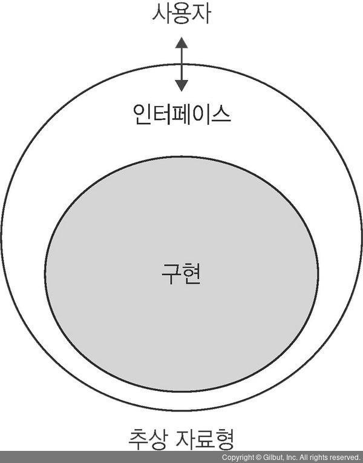
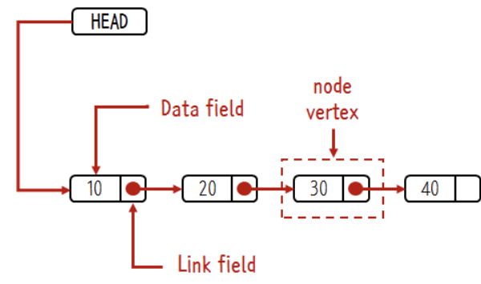

- [자료형 (Data Type)](#자료형-data-type)
- [추상화 (Abstraction)](#추상화-abstraction)
- [추상 자료형 (ADT, Abstraction Data Type)](#추상-자료형-adt-abstraction-data-type)
  - [추상 자료형의 예](#추상-자료형의-예)
- [자료 구조 (Data Structure)](#자료-구조-data-structure)
  - [분류](#분류)
- [배열 (Array)](#배열-array)
  - [배열의 장점](#배열의-장점)
  - [배열의 한계](#배열의-한계)
- [리스트 (list)](#리스트-list)
  - [리스트의 기능](#리스트의-기능)
- [연결 리스트 (Linked list)](#연결-리스트-linked-list)
  - [연결 리스트의 API](#연결-리스트의-api)

---

# 자료형 (Data Type)

저장되는 데이터의 종류에 따른 형태로, 저장되는 값의 종류와 범위에 따라 다르게 표현 된다.

---

# 추상화 (Abstraction)

**핵심 개념이나 기능을 간추려 내는 것**

- 크고 복잡한 상황을 더 잘 관리하도록 하는 것
- 자료구조에서 추상화는 세부 구현으로 부터 분리하여 개념을 일반화 시키는 것을 의미
  - 데이터 모델링
  - **무엇(what)** 인지는 정의하지만, **어떻게(how)** 구현할 것인지는 정의하지 않음

---

# 추상 자료형 (ADT, Abstraction Data Type)

세부 구현으로부터 분리해 **핵심 개념**이나 **기능**을 간추려 낸 자료형

- 구현 내용은 명시하지 않고 **인터페이스만 제공**
- 구현으로부터 분리하고 간다한 인터페이스만 제공
  - 추상화를 통해 **캡슐화 가능**
    - 캡슐화를 통해 정보 은닉 가능
- 결론적으로, 구현자와 사용자를 분리해준다.

## 추상 자료형의 예

- 리스트
- 스택
- 큐
- 맵

---

# 자료 구조 (Data Structure)

자료(Data)의 집합

- 자료에 대한 처리를 효율적으로 수행할 수 있도록 자료를 구분하여 표현한 것
- 목적
  - 자료를 효율적으로 저장 및 관리
    - 잘 선택된 자료구조는 실행시간을 단축시키거나 메모리를 절약

## 분류

선형 구조

- 배열
- 연결 리스트
- 스택
- 큐

비선형 구조

- 트리
- 그래프

---

# 배열 (Array)

같은 자료형의 다중 원소 집합

- 연관된 데이터를 하나의 변수에 그룹핑해서 관리한다.

## 배열의 장점

index를 통해서 빠르게 데이터를 가져올 수 있다.

- index를 이용한 조회
  - index의 값이 고정되어 있어야만 한다.

## 배열의 한계

배열의 크기보다 더 많은 양을 저장할 수 없다.

- 새로운 배열을 생성해줘야 한다.

배열의 요소를 삭제하면 중간의 빈 공간은 메꿔지지 않는다.

- 빈틈없이 연속적으로 위치하게 하는 스트럭처를 리스트(list)라고 한다.
  - 하지만 이 스트럭처는 빈 공간을 메꾸면서 index까지 바꿔버린다.
    - 예를 들어, index 3 자리를 메꾸기 위해 index 4부터 당겨버리면 모든 index들이 -1씩 영향을 받게 되는 것이다.

---

# 리스트 (list)

리스트는 배열이 가지고 있는 index라는 장점을버리고 대신 **빈틈없는 데이터의 적재**라는 장점을 취한 Data Structure다.

- 순서가 있는 element의 모임

## 리스트의 기능

- 빈 element는 불허
- 중복 데이터 허용
  - set과의 차이
- 처음, 끝, 중간에 element를 추가/삭제 가능

---

# 연결 리스트 (Linked list)

배열과는 다르게 노드들의 위치가 흩어져 있기 때문에 연결되어 있는 구조이다.

- 노드는 최소한 두 가지 정보를 갖고 있어야 한다.
  - 현재 노드의 값
  - 다음 노드의 주소

- Head
  - 첫번째 노드

연결 리스트는 원소에 직접 접근할 수 없기 때문에 조회에 있어서는 배열보다 속도가 많이 느리다. 하지만 저장할 원소의 개수를 미리 알지 못할 때 배열보다 유용하다.

## 연결 리스트의 API

- Insert(k)
  - 리스트의 맨 앞에 k를 추가
- Delete()
  - 리스트의 첫 번째 원소 삭제
- PrintList()
  - 리스트의 모든 원소를 표시
- Find(k)
  - 값이 k인 원소의 위치를 찾는다.
- FindKth(k)
  - k번째 위치의 원소를 찾는다.
- IsEmpty()
  - 원소가 없는 리스트인지 확인
