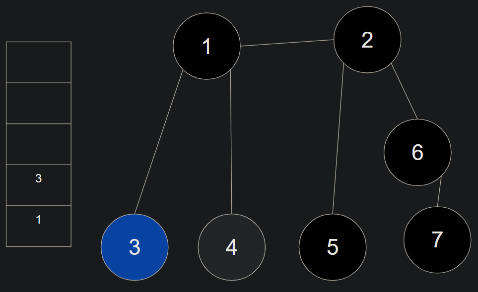

# DFS(Depth First Search)
깊이 우선 탐색
- 그래프에서 깊은 부분을 우선적으로 탐색하는 알고리즘

## 동작 방식
스택 자료구조 이용
- 탐색 시작 노드를 처음으로 스택에 삽입한다.
  - 방문처리
- 스택의 최상단 노드에 방문하지 않은 인접 노드가 있으면, 그 인접 노드를 스택에 넣고 방문 처리한다.
  - 방문하지 않은 인접 노드가 없으면 스택에서 최상단 노드를 꺼낸다.
- 위의 과정을 반복한다.

### 예시
노드 1을 시작 노드로 하여 DFS를 이용해 탐색한다.

(검정색으로 칠한 노드는 방문처리가 된 노드이고, 파란 노드는 현재 위치한 노드이다.)

1. 시작 노드(1)를 스택에 넣는다.
   - 인접한 노드 중(2, 3, 4)에서 스택에 없는 가장 작은 숫자의 노드(2)로 이동하고 스택에 넣는다.


---

2. 인접한 노드(2)로 이동했으면, 그 노드(2)를 스택에 넣는다.
   - 인접한 노드 중(1, 5, 6)에서 스택에 없는 가장 작은 숫자의 노드(5)로 이동한다.


---

3. 인접한 노드(5)로 이동했으면, 그 노드(5)를 스택에 넣는다.
   - 스택에 넣고 인접한 노드(2)를 찾는다.
   - 인접한 모든 노드(2)가 이미 스택에 들어가 있으면 최상단 노드(5)를 꺼낸다.
   - 최상단 노드(5)를 꺼낸 후에 스택에 남아있는 최상단 노드(2)로 이동한다.


---

4. 인접한 노드 중(1, 6)에서 스택에 없는 가장 작은 숫자의 노드(6)로 이동하고 스택에 넣는다.


---

5. 인접한 노드 중(2, 7)에서 스택에 없는 가장 작은 숫자의 노드(7)로 이동하고 스택에 넣는다.
   - 스택에 넣고 인접한 노드(6)를 찾는다.
   - 인접한 모든 노드(6)가 이미 스택에 들어가 있으면 최상단 노드(7)를 꺼낸다.
   - 최상단 노드(7)를 꺼낸 후에 스택에 남아있는 최상단 노드(6)로 이동한다.
   - 스택에 넣고 인접한 노드(2)를 찾는다.
   - 인접한 모든 노드(2)가 이미 스택에 들어가 있으면 최상단 노드(6)를 꺼낸다.
   - 최상단 노드(6)를 꺼낸 후에 스택에 남아있는 최상단 노드(2)로 이동한다.
   - 스택에 넣고 인접한 노드(1)를 찾는다.
   - 인접한 모든 노드(1)가 이미 스택에 들어가 있으면 최상단 노드(2)를 꺼낸다.
   - 최상단 노드(2)를 꺼낸 후에 스택에 남아있는 최상단 노드(1)로 이동한다.


---

6. 인접한 노드 중(3, 4)에서 스택에 없는 가장 작은 숫자의 노드(3)로 이동하고 스택에 넣는다.
   - 스택에 넣고 인접한 노드(1)를 찾는다.
   - 인접한 모든 노드(1)가 이미 스택에 들어가 있으면 최상단 노드(3)를 꺼낸다.
   - 최상단 노드(3)를 꺼낸 후에 스택에 남아있는 최상단 노드(1)로 이동한다.




---

7. 인접한 노드 중(4)에서 스택에 없는 가장 작은 숫자의 노드(4)로 이동하고 스택에 넣는다.
  - 스택에 넣고 인접한 노드(1)를 찾는다.
  - 인접한 모든 노드(1)가 이미 스택에 들어가 있으면 최상단 노드(4)를 꺼낸다.
  - 최상단 노드(4)를 꺼낸 후에 스택에 남아있는 최상단 노드(1)로 이동한다. 


---

8. 더 이상 이동할 노드가 없으면 스택을 비운다.


---

#### 예시 순서 결과

매 순간마다 스택의 최상단에 있는 숫자를 나타내는 것
- 중복은 순서로 치지 않는다.

```
1 -> 2 -> 5 -> 6 -> 7 -> 3 -> 4
```
- 소요시간
  - 데이터의 개수가 N개일 때, O(N)

## DFS 구현 (재귀함수)

```java
public class DFSRecur {
    //아직 방문하지 않은 노드들의 방문 상태를 false로 설정
    public static boolean [] visited = {false, false, false, false, false, false, false};

    public static int[][] graph = {
            {}, //0번 노드와 연결된 노드
            {2, 3, 4}, //1번 노드와 연결된 노드
            {1, 5, 6}, //2번 노드와 연결된 노드
            {1}, //3번 노드와 연결된 노드
            {1}, //4번 노드와 연결된 노드
            {2}, //5번 노드와 연결된 노드
            {2, 7}, //6번 노드와 연결된 노드
            {6} //7번 노드와 연결된 노드
    };

    public static void main(String[] args) {
        int start = 1; //시작 노드
        dfs(start); //시작 노드를 입력하고 dfs 시작
    }

    public static void dfs(int v) {
        visited[v] = true; //이동한 노드는 방문 상태를 true로 바꾼다.
        System.out.println(v + " -> ");

        for (int i : graph[v]) {
            if (visited[i] == false) { //방문 상태가 false인 노드들에서만 dfs를 다시 실행
                dfs(i);
            }
        }
    }
}
```


## DFS 구현 (Stack클래스)

```java
import java.util.Deque;
import java.util.LinkedList;

public class DFSStack {
    static void dfs(int[][] graph, int start, boolean[] visited) {
        visited[start] = true; //시작 노드의 방문 상태 true
        System.out.print(start + "  ");

        Deque<Integer> stack = new LinkedList<>(); //스택 생성
        stack.push(start); //시작 노드를 스택의 첫번째로 집어 넣음

        while (!stack.isEmpty()) { //스택이 비어있지 않다면 while문 수행
            int now = stack.peek(); //현재 스택 최상단에 있는 노드를 now

            boolean hasNearNode = false; //인접 노드가 없다고 초기화
            for (int i : graph[now]) {
                //인접한 노드를 방문하지 않았다면 스택에 넣고 방문처리
                if (!visited[i]) {
                    hasNearNode = true;
                    stack.push(i); //스택에 넣는다.
                    visited[i] = true; //방문 처리
                    System.out.print(i + "  ");
                    break;
                }//if
            }//for

            //인접한 노드를 모두 방문했다면 스택에서 해당 노드를 꺼낸다.
            if (hasNearNode == false) {
                stack.pop();
            }
        }//while
    }

    public static void main(String[] args) {
         int[][] graph = {
                {}, //0번 노드와 연결된 노드
                {2, 3, 4}, //1번 노드와 연결된 노드
                {1, 5, 6}, //2번 노드와 연결된 노드
                {1}, //3번 노드와 연결된 노드
                {1}, //4번 노드와 연결된 노드
                {2}, //5번 노드와 연결된 노드
                {2, 7}, //6번 노드와 연결된 노드
                {6} //7번 노드와 연결된 노드
        };
        boolean [] visited = {false, false, false, false, false, false, false, false};

        dfs(graph, 1, visited);
    }
}
```


