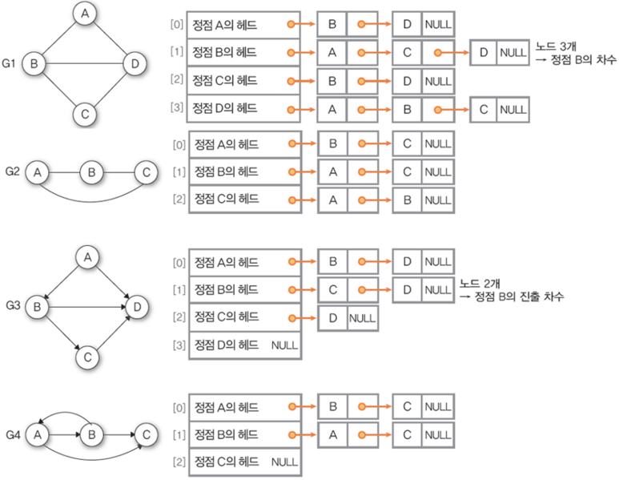

# **리스트로 구하는 법**

## 1. ArrayList 선언

```java
public class GraphList {
    private ArrayList<ArrayList<Integer>> listGraph;
}
```



위의 그림을 보면 각 정점들은 배열로되어있고, 그 정점이 리스트의 헤드가 되어있다. list하나의 각 요소마다 다른 list형태가 나타나게 만들어야 하는 것을 알 수 있다. 그래서 ArrayList의 제네릭 타입이
ArrayList인 것이다.

- 이렇게 만들어 주고 간단하게 ArrayList의 메서드를 사용해서 노드를 연결시켜주면 된다.

## 2. 정점들을 생성

```java
public void addVertex(int x){
    listGraph.add(new ArrayList<Integer>(x));
}
```
- 리스트의 헤드가 될 정점들을 생성한다.

## 3. 정점 x와 정점 y를 연결시켜주는 메서드

단방향
- 리스트 그래프는 각 정점을 헤드로 두는 리스트들로 배열된 형태이다. 
  - 따라서 x -> y를 연결하려면 x의 리스트를 가져온 후, y 값을 add하면 되는 것이다.

```java
public void addDirectedEdge(int x, int y) {
    listGraph.get(x).add(y);
}
```

양방향
- 단방향일 때와 같다.
- x->y의 단방향과 y->x의 단방향을 한번에 처리해주면 된다.

```java
public void addCompleteEdge(int x, int y) {
    listGraph.get(x).add(y);
    listGraph.get(y).add(x);
}
```

## 출력 메서드
```java
public void printGraph() {
    for (int i = 1; i < listGraph.size(); i++) {
        System.out.print("vertex " + i + " => ");
        for (int j = 0; j < listGraph.get(i).size(); j++) {
            System.out.print(" " + listGraph.get(i).get(j));
        }
        System.out.println();
    }
}
```


## 전체 코드

```java
import java.util.ArrayList;

public class GraphList {
  private ArrayList<ArrayList<Integer>> listGraph;

  public GraphList() {
    listGraph = new ArrayList<ArrayList<Integer>>();
  }

  public void addVertex(int x){
    listGraph.add(new ArrayList<Integer>(x));
  }

  public void addDirectedEdge(int x, int y){
    listGraph.get(x).add(y);
  }

  public void addCompleteEdge(int x, int y){
    listGraph.get(x).add(y);
    listGraph.get(y).add(x);
  }

  public void printGraph() {
    for(int i=1; i<listGraph.size(); i++) {
      System.out.print("vertex " + i + " => ");
      for(int j=0; j<listGraph.get(i).size(); j++) {
        System.out.print(" "+listGraph.get(i).get(j));
      }
      System.out.println();
    }
  }
}

```