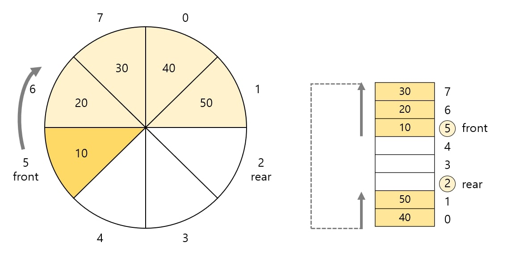

# 스택(Stack)

데이터를 일시적으로 저장하기 위한 자료구조

- LIFO
- push, pop

```java
void x(){}

        void y(){}

        void z(){
        x();
        y();
        }

        int main(){
        z();
        }
```

|      |      |      | pop(x) |      | pop(y) |      |
|:----:|:----:|:----:|:------:|:----:|:------:|:----:|
|      |      |  x   |        |  y   |        |      |
|      |  z   |  z   |   z    |  z   |   z    |      |
| main | main | main |  main  | main |  main  | main |

## 스택 만들기

[스택 만들기(IntStack.java)](IntStack.java)

### 제네릭 스택으로 변환

[제네릭 스택(GStack.java)](GStack.java)

---

# 큐(Queue)

데이터를 일시적으로 쌓아 놓은 자료구조

- FIFO
- enqueue, dequeue
- front(데이터를 꺼내는 쪽), rear(데이터를 넣는 쪽)

## 링 버퍼로 큐 만들기

링 버퍼

- 배열의 처음이 끝과 연결되었다고 보는 자료구조
- front
    - 맨 처음 요소의 인데그
- rear
    - 맨 끝 요소의 하나 뒤의 인덱스
- 배열처럼 빈 자리를 채우기 위해 앞으로 움직이지 않는다.
    - 링 버퍼는 배열처럼 앞으로 전체 배열을 움직이지 않고, front와 rear의 값만 바꿔주면 된다.



[링 버퍼로 큐 만들기(IntQueue.java)
)](IntQueue.java)

### 제네릭 큐로 변환

[제네릭 큐(GQueue.java)](GQueue.java)
