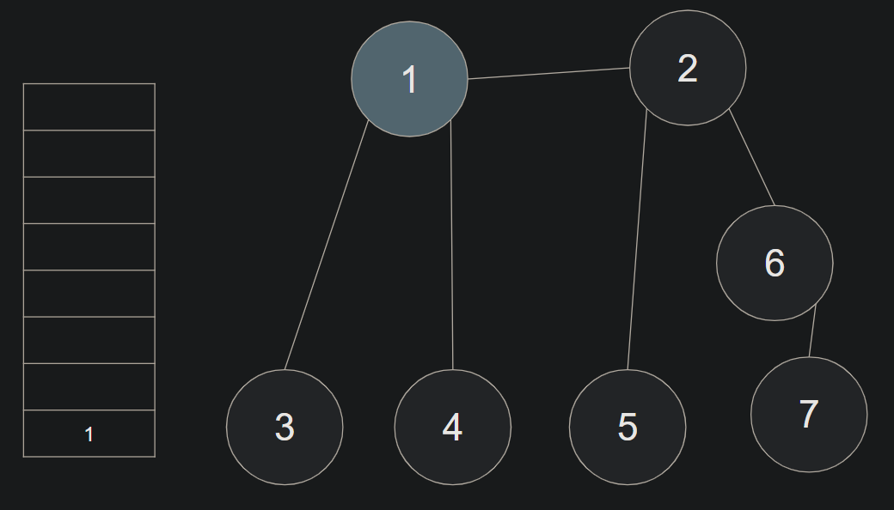

# BFS(Breadth First Search)
너비 우선 탐색
- 가까운 노드부터 탐색

## 동작 방식
큐 자료구조 이용하여, 인접한 노드를 반복적으로 큐에 넣도록 알고리즘을 작성
- 먼저 들어온 것이 먼저 나가며, 가까운 노드부터 탐색하게 된다.

1. 탐색 시작 노드를 큐에 삽입하고 방문 처리
2. 큐에서 노드를 꺼낸다
   - 해당 노드의 인접 노드 중에서 방문하지 않은 노드를 모두 큐에 삽입하고 방문 처리한다.
위의 두 단계를 반복한다.

### 예시
방문 처리된 노드는 밝은 회색으로, 큐에서 꺼내 현재 처리하는 노드는 하늘색으로 표시한다.

1. 시작 노드(1)를 방문 처리하면서 큐에 넣는다.



---

2. 큐에서 요소 하나(1)를 꺼내고, 인접한 노드들(2, 3, 4)을 작은 것부터 큐에 넣고 방문 처리를 한다.


---

3. 큐에서 요소 하나(2)를 꺼내고, 인접한 노드들(5, 6)을 작은 것부터 큐에 넣고 방문 처리한다.


---

4. 큐에서 요소 하나(3)를 꺼낸다.
   - 인접한 노드(1)가 모두 방문 처리 되었다면 큐의 다음 요소(4)를 꺼낸다.
   - 인접한 노드(1)가 모두 방문 처리 되었다면 큐의 다음 요소(5)를 꺼낸다.
   - 인접한 노드(2)가 모두 방문 처리 되었다면 큐의 다음 요소(6)를 꺼낸다.


---

5. 큐에서 요소 하나(6)를 꺼내고, 인접한 노드들(7)을 작은 것부터 큐에 넣고 방문 처리한다.


---

6. 큐에서 요소 하나(7)를 꺼낸다.
   - 모든 노드를 방문 처리 했다.


#### 예시 순서 결과

```
1 -> 2 -> 3 -> 4 -> 5 -> 6 -> 7
```
- 소요시간
   - 데이터의 개수가 N개일 때, O(N)
   - 일반적으로 수행시간은 DFS보다 좋다.

## BFS 구현

```java
import java.util.LinkedList;
import java.util.Queue;

public class BFSQueue {
    public static void main(String[] args) {
        int[][] graph = {
                {}, //0번 노드와 연결된 노드
                {2, 3, 4}, //1번 노드와 연결된 노드
                {1, 5, 6}, //2번 노드와 연결된 노드
                {1}, //3번 노드와 연결된 노드
                {1}, //4번 노드와 연결된 노드
                {2}, //5번 노드와 연결된 노드
                {2, 7}, //6번 노드와 연결된 노드
                {6} //7번 노드와 연결된 노드
        };
        boolean [] visited = {false, false, false, false, false, false, false, false};

        int start = 1; //시작 노드

        //큐 구현
        Queue<Integer> queue = new LinkedList<>();
        queue.offer(start);

        //현재 노드를 방문 처리
        visited[start] = true;

        //큐가 빌 때까지 반복
        while (!queue.isEmpty()) {
            //큐에서 요소 하나를 뽑아 출력
            int v = queue.poll();
            System.out.print(v + "  ");

            //인접한 노드 중 아직 방문하지 않은 원소들을 큐에 삽입
            for (int i : graph[v]) {
                if(visited[i] == false) {
                    queue.offer(i);
                    visited[i] = true;
                }
            }
        }
    }
}

```


