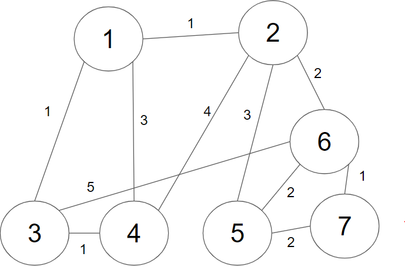
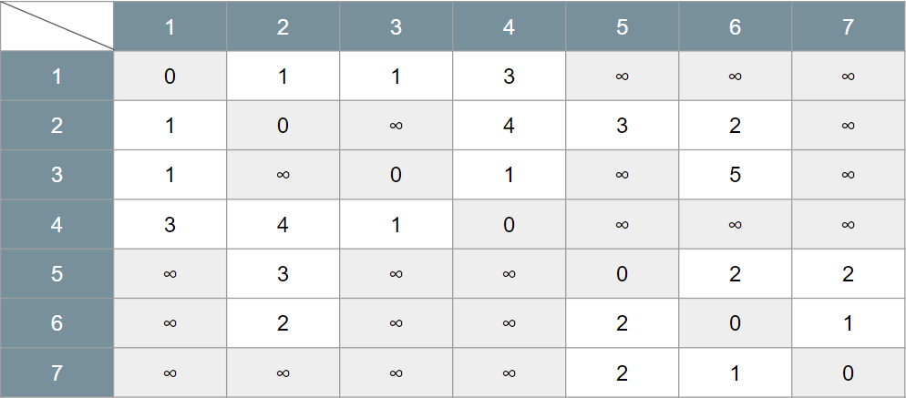
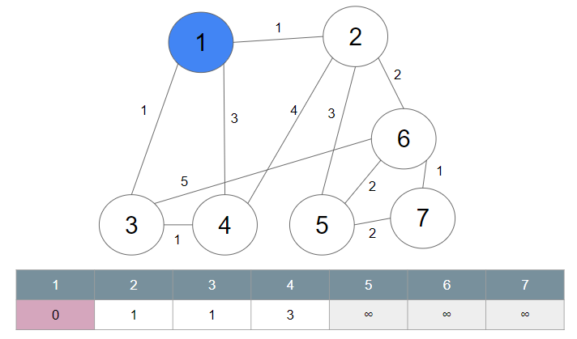
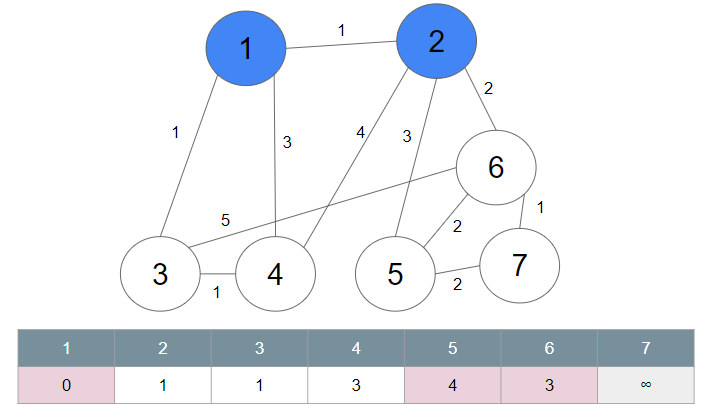
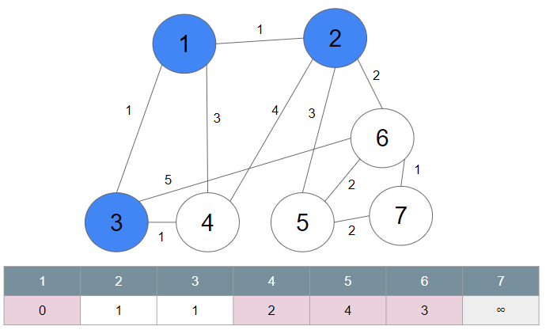
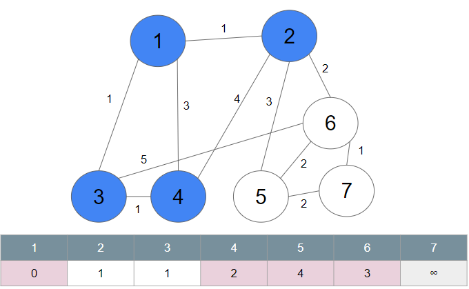
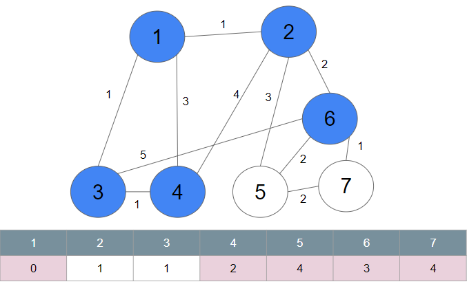
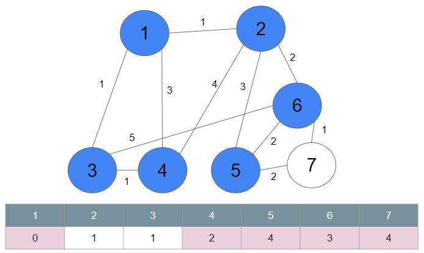
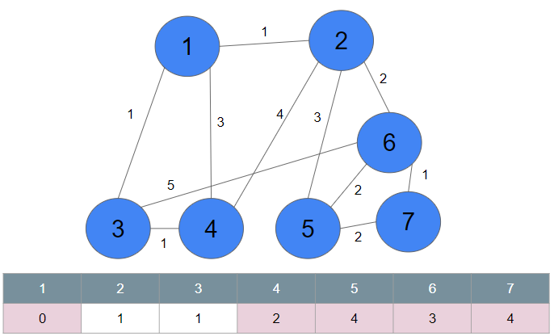

# 다익스트라

한 정점에서 다른 정점까지의 최단거리를 구하는 알고리즘

- 음의 가중치를 가진 간선은 포함할 수 없다.

# 작동 방식

1. 출발 노드 지정
2. 출발 노드를 기준으로 각 노드의 최소 비용 저장
3. 방문하지 않은 노드 중에서 가장 비용이 적은 노드를 선택
4. 가장 비용이 적은 노드에서 특정 노드로 가는 최단 거리가 생긴다면 최소 비용을 갱신
5. 3, 4 과정을 반복

## 예시

1. 그래프를 준비한다. 그래프는 이차원 배열 형태여야 한다.





- 가중치를 2차원 표로 나타냈다.

2. 시작노드를 1번 노드로 가정하고 시작한다.
    - 노드를 선택하면 그 노드와 연결된 간선의 가중치를 확인한다.
    - 시작 노드의 가중치 배열을 만든 뒤에 이 배열을 계속 갱신한다.
    - 아직 방문하지 않은 노드 중에서 가장 비용이 적은 노드로 이동한다.
        - 최소 가중치가 같다면 수가 작은 노드로 이동한다.



3. 이동한 노드에서 시작노드와 간선으로 연결되지 않았거나, 연결된 상태여도 이동하는 소비되는 가중치가 적은 경우, 시작 노드의 배열을 그에 맞게 갱신해준다.
   - 2번 노드를 거쳐 4번 노드로 가는 경우는 소비 가중치가 5이므로 원래의 값인 3보다 적으니 갱신하지 않는다.
   - 2번 노드를 거쳐 5번과 6번 노드로 가는 경우는 값이 무한이므로 갱신해준다.
     - 갱신하는 값은 시작노드에서 목표노드까지의 가중치 합으로 갱신한다.



4. 시작노드에서 방문하지 않은 가중치가 가장 적은 노드(3)로 이동한다.
   - 3번 노드를 거쳐서 이동해야 가중치의 합이 적은 노드들의 값을 갱신해준다.
     - 3번 노드를 거쳐 4번으로 이동하면 소비 가중치가 2이므로 원래의 가중치의 값을 갱신해준다.



5. 시작노드에서 방문하지 않은 노드 중 갱신된 가중치의 값이 가장 작은 노드(4)로 이동한다.
   - 4번 노드를 거쳐서 다른 인접 노드로 이동할 때의 가중치 합이 모두 갱신된 값보다 커서 갱신할 값이 없으므로 다른 노드로 이동한다.



6. 시작노드에서 방문하지 않은 노드 중 갱신된 가중치의 값이 가장 작은 노드(6)로 이동한다.
   - 6번과 간선으로 연결된 인접 노드로의 가중치를 더해서 기존의 값을 갱신한다.
     - 6번을 거쳐 7번으로 가는 가중치를 4로 갱신한다.




7. 남은 5번과 7번의 갱신된 가중치가 같으므로 노드의 번호가 작은 5번으로 이동해서 가중치를 확인한다.
   - 갱신할 값이 없으면 마지막 7번 노드로 이동한다.



8. 마지막으로 방문하지 않은 노드로 이동해 가중치를 계산해서 갱신할 값이 있으면 갱신해준다.
   - 최종 배열을 확인한다.



## 전체 코드
### 선형 탐색 방식으로 구현


```java
public class Dijkstra_Linear {
     static int num = 7;
     static int INF = 1000000;

     //노드의 방문 상태
     static boolean visited[] = new boolean[7];

     //계속 갱신될 최소 가중치 배열
     static int[] finalArray = new int[7];

     //전체 그래프 초기화
     static int arr[][] = {
             {0, 1, 1, 3, INF, INF, INF},
             {1, 0, INF, 4, 3, 2, INF},
             {1, INF, 0, 1, INF, 5, INF},
             {3, 4, 1, 0, INF, INF, INF},
             {INF, 3, INF, INF, 0, 2, 2},
             {INF, 2, INF, INF, 2, 0, 1},
             {INF, INF, INF, INF, 2, 1, 0}
     };

     public static void main(String[] args) {
          Dijkstra_Linear ds = new Dijkstra_Linear();

          //배열은 0부터 시작하므로 start값에 1이 아닌 0 대입
          ds.dijkstra(0);

          for (int i = 0; i < num; i++) {
               System.out.print(finalArray[i] + "  ");
          }

     }

     //최소 거리를 가지는 정점을 반환
     public int getSmallDis() {
          int min = INF;
          int idx = 0;

          for (int i = 0; i < num; i++) {
               if (finalArray[i] < min && !visited[i]) {
                    min = finalArray[i];
                    idx = i;
               }
          }

          return idx;
     }

     public void dijkstra(int start) {

          //시작할 때 start의 배열을 갱신배열에 넣어준다.
          for (int i = 0; i < num; i++) {
               finalArray[i] = arr[start][i];
               //[0, 1, 1, 3, INF, INF, INF]
          }

          visited[start] = true;

          //num-2인 이유
          //자기 자신의 경우를 제외하고 반복문을 돌리면 마지막 남은 노드는 이미 가중치가 모두 갱신된 상태이므로
          //이동을 해도 바꿀 가중치가 없기 때문에 자기자신의 경우와 마지막 노드의 경우를 빼준 것이다.
          for (int i = 0; i < num - 2; i++) {

               //현재 위치한 노드에서 가장 가중치가 작은 노드로 이동해야 한다.
               int current = getSmallDis();

               //가중치가 작은 노드로 이동했으므로 그 노드를 방문 처리리
               visited[i] = true;
               for (int j = 0; j < num; j++) {
                    //해당 노드의 인접 노드들을 확인한다.
                    if (!visited[j]) { //그 인접 노드가 방문하지 않은 상태라면
                         //현재 위치한 그 노드까지의 최소 비용에서 그 해당 노드에서 인접 노드까지의 거리가
                         //원래의 가중치 배열의 값보다 작다면 값을 갱신해준다.
                         if (finalArray[current] + arr[current][j] < finalArray[j]) {
                              finalArray[j] = finalArray[current] + arr[current][j];
                         }
                    }
               }
          }
     }
}
```

이 코드는 선형 탐색으로 찾기 때문에 시간 복잡도가 O(N^2)가 된다.

```java
for (int i = 0; i < num; i++) {
               if (finalArray[i] < min && !visited[i]) {
                    min = finalArray[i];
                    idx = i;
               }
          }
```
- 이 부분을 보면 방문 상태가 true여도 1번부터 끝까찌 모든 정점을 매번 탐색하므로 N의 시간복잡도가 발생한다.
- 정점이 많고 간선이 적을 때 비효율적이다.

## 우선 순위 큐 방식을 이용하여 구현
우선 순위 큐는 힙 정렬을 사용하기 때문에 log N의 시간복잡도로 매번 가장 작은 거리를 갖는 정점을 찾는다.
- 시간 복잡도가 O(N * log N)
- 정점에 비해 간선의 갯수가 많이 적어도 안정적으로 처리한다.

```java
import java.util.ArrayList;
import java.util.Arrays;
import java.util.PriorityQueue;
import java.util.Scanner;
import java.util.stream.IntStream;

public class Dijkstra_Q {
     /* 무한을 의미하는 값으로 10억을 설정 */
     public static final int INF = (int) 1e9;

     public static int n; // 노드의 개수(N)
     public static int m; // 간선의 개수(M)
     public static int start; // 시작 노드 번호(Start)

     /* 각 노드에 연결되어 있는 노드에 대한 정보를 담는 배열 */
     public static ArrayList<ArrayList<QueueNode>> graph = new ArrayList<ArrayList<QueueNode>>();

     /* 최단 거리 테이블 만들기 */
     public static int[] d = new int[100001];

     public static void main(String[] args) {
          input();

          /* 다익스트라 알고리즘을 수행 */
          dijkstra(start);

          /* 도달할 수 있는 경우 거리 출력 (1부터 시작했으므로 n + 1) */
          IntStream.range(0, n + 1).filter(i -> d[i] != INF).mapToObj(i -> d[i]).forEach(System.out::println);
     }

     private static void dijkstra(int start) {
          /* 우선순위 큐 선언 */
          PriorityQueue<QueueNode> pq = new PriorityQueue<>();

          /* 시작 노드로 가기 위한 최단 경로는 0으로 설정하여, 큐에 삽입 */
          pq.offer(new QueueNode(start, 0));
          d[start] = 0;

          /* 큐가 비어있지않을 때까지 반복 */
          while(!pq.isEmpty()) {
               /* 가장 최단 거리가 짧은 노드에 대한 정보 꺼내기 */
               QueueNode node = pq.poll();

               int dist = node.getDistance(); // 현재 노드까지의 비용
               int now = node.getIndex(); // 현재 노드 번호

               /* 현재 노드가 이미 처리된 적이 있는 노드라면 무시 */
               if (d[now] < dist) {
                    continue;
               }

               /* 현재 노드와 연결된 다른 인접한 노드들을 확인 */
               for (int i = 0; i < graph.get(now).size(); i++) {
                    /* 현재의 최단거리 + 현재의 연결된 노드의 비용 */
                    int cost = d[now] + graph.get(now).get(i).getDistance();

                    /* 현재 노드를 거쳐서 다른 노드로 이동하는 거리가 더 짧은 경우 */
                    if (cost < d[graph.get(now).get(i).getIndex()]) {
                         d[graph.get(now).get(i).getIndex()] = cost;
                         pq.offer(new QueueNode(graph.get(now).get(i).getIndex(), cost));
                    }
               }
          }
     }

     private static void input() {
          Scanner sc = new Scanner(System.in);

          n = sc.nextInt(); // 노드의 개수(N)
          m = sc.nextInt(); // 간선의 개수(M)
          start = sc.nextInt(); // 시작 노드 번호(Start)

          /* 그래프 초기화 */
          for (int i = 0; i <= n; i++) {
               graph.add(new ArrayList<QueueNode>());
          }

          /* 모든 간선 정보를 입력받기 */
          for (int i = 0; i < m; i++) {
               int a = sc.nextInt();
               int b = sc.nextInt();
               int c = sc.nextInt();

               /* a번 노드에서 b번 노드로 가는 비용이 c라는 의미 */
               graph.get(a).add(new QueueNode(b, c));
          }

          /* 최단 거리 테이블을 모두 무한으로 초기화 */
          Arrays.fill(d, INF);
     }
}

class QueueNode implements Comparable<QueueNode> {

     private int index;
     private int distance;

     public QueueNode(int index, int distance) {
          this.index = index;
          this.distance = distance;
     }

     public int getIndex() {
          return this.index;
     }

     public int getDistance() {
          return this.distance;
     }

     // 거리(비용)가 짧은 것이 높은 우선순위를 가지도록 설정
     @Override
     public int compareTo(QueueNode other) {
          if (this.distance < other.distance) {
               return -1;
          }
          return 1;
     }
}
```


