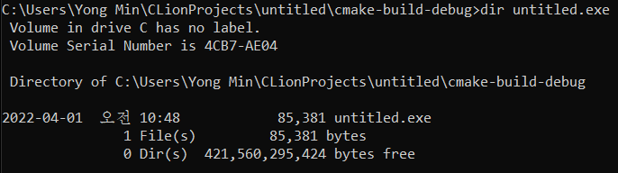

적절한 함수 포인터 변수의 선언

```c
int (*fptr)(int)
```
- 반환형은 int
- fptr은 포인터
- 매개변수 선언이 int 하나인 함수 포인터

```c
#include <stdio.h>

void SimpleAdder(int n1, int n2){
    printf("%d + %d = %d \n", n1, n2, n1 + n2);
}

void ShowString(char *str) {
    printf("%s \n", str);
}

int main() {
    char *str = "Function Pointer";
    int num1 = 10, num2 = 20;

    void (*fptr1)(int, int) = SimpleAdder;
    void (*fptr2)(char *) = ShowString;
    
    //함수 포인터 변수에 의한 호출
    fptr1(num1, num2);
    fptr2(str);
    
    return 0;
}

<console>
10 + 20 = 30
Function Pointer
```

```c
#include <stdio.h>

int WhoIsFirst(int age1, int age2, int(*cmp)(int n1, int n2)){
    return cmp(age1, age2);
}

int OlderFirst(int age1, int age2){
    if(age1 > age2){
        return age1;
    } else if (age1 < age2) {
        return age2;
    } else {
        return 0;
    }
}

int YoungerFirst(int age1, int age2){
    if(age1 < age2){
        return age1;
    } else if (age1 > age2) {
        return age2;
    } else {
        return 0;
    }
}

int main(void){
    int age1 = 20;
    int age2 = 30;
    int first;

    printf("입장순서 1 \n");
    first = WhoIsFirst(age1, age2, OlderFirst);
    printf("%d세와 %d세 중 %d세가 먼저 입장! \n", age1, age2, first);

    printf("입장순서 2 \n");
    first = WhoIsFirst(age1, age2, YoungerFirst);
    printf("%d세와 %d세 중 %d세가 먼저 입장! \n", age1, age2, first);

    return 0;
}

<console>
입장순서 1
20세와 30세 중 30세가 먼저 입장!
입장순서 2
20세와 30세 중 20세가 먼저 입장!
```

void형 포인터 변수
- `void * ptr;`
- 무엇이든 담을 수 있는 바구니
- 주소 값에만 의미를 두고, 포인터의 형은 나중에 결정한다는 의미

main함수로의 인자전달

```c
#include <stdio.h>

int main(int argc, char *argv[]) { //더블 포인터
    printf("전달된 문자열의 수: %d \n", argc);

    for (int i = 0; i < argc; i++) {
        printf("%d번째 문자열: %s \n", i + 1, argv[i]);
    }

    return 0;
}
```



