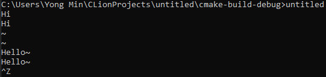

문자 출력 함수(putchar, fputc)

```c
#include <stdio.h>

int putchar(int c);
int fputc(int c, FILE * stream);
```
- 함수호출 성공 시 쓰여진 문자정보가, 실패 시 EOF 반환
- fputc 함수는 문자를 전송할 스트림을 두 번째 인자로 지정할 수 있다.

문자 입력 함수(getchar, fgetc)

```c
#include <stdio.h>

int getchar(void);
int fgetc(FILE * stream);
```
- 파일의 끝에 도달하거나 함수호출 실패 시 EOF 반환

```c
#include <stdio.h>

int main(void){
    int ch1, ch2;

    ch1 = getchar(); //문자 입력
    // ch2 = fgetc(stdin); //엔터 키 입력

    putchar(ch1); //문자 출력
    // fputc(ch2, stdout); //엔터 키 출력
    
    return 0;
}

<console>
p
p
```

문자 입출력에서의 EOF
- EOF
  - End Of File
  - 파일의 끝
  - fgetc 함수가 호출됐을 때 EOF가 반환되면
    - 파일의 끝에 도달해서 더 이상 읽을 내용이 없다는 뜻
  - fgetc, getchar의 EOF 반환 조건
    - 함수호출의 실패
    - Windows에서 CTRL + Z, Linux에서 CTRL + D 키가 입력될 경우

```c
#include <stdio.h>

int main(void){
    int ch;

    while(1){
        ch = getchar();
        if (ch == EOF) {
            break;
        }
        putchar(ch);
    }
    return 0;
}
```



반환형이 int이고, int형 변수에 문자를 담는 이유
- 반환하는 값 중 하나인 EOF는 -1이다.
- 반환형이 char형이고, 게다가 unsigned char형으로 처리하는 컴파일러에 의해 컴파일 되었다면, EOF가 엉뚱한 양의 정수로 형 변환되어버린다.
  - 이를 방지하기 위해 int형으로 반환하는 것이다.

printf, scanf말고 문자 단위 입출력 함수의 존재 이유
- 메모리 낭비가 심하고, 처리 속도가 느리다.

```c
#include <stdio.h>

int ConvCase(int ch){
    int diff = 'a' - 'A';
    if (ch >= 'A' && ch <= 'Z') {
        return ch + diff;
    } else if (ch >= 'a' && ch <= 'z') {
        return ch - diff;
    } else {
        return -1;
    }
}

int main(void){

    int ch;
    while(1){
        ch = getchar();
        ch = ConvCase(ch);

        if (ch == EOF) {
            break;
        }

        putchar(ch);
    }
    return 0;
}

<console>
fdasf
FDASF
```

문자열 단위 입출력 함수

문자열 출력함수: puts, fputs

```c
int puts(const char *s);
int fputs(const char *s, FILE *stream);
```
- 성공 시 음수가 아닌 값을, 실패 시 EOF 반환

```c
#include <stdio.h>

int main(void){
    char *str = "Simple String";

    printf("1. puts test \n");
    puts(str);
    puts("So Simple String");

    printf("2. fputs test \n");
    fputs(str, stdout);
    printf("\n");
    fputs("So Simple String", stdout);
    printf("\n");

    printf("3. end of main");

    return 0;
}

<console>
1. puts test
Simple String
So Simple String
2. fputs test
Simple String
So Simple String
3. end of main
```
- puts 함수가 호출되면 문자열 출력 후 자동으로 개행이 이뤄지지만, fputs 함수가 호출되면 문자열 출력 후 자동으로 개행이 이뤄지지 않는다.


문자열 입력 함수: gets, fgets

```c
#include <stdio.h>
char *gets(char *s);
char *fgets(car *s, int n, FILE *stream);
```
- 파일의 끝에 도달하거나 함수호출 실패 시 NULL 포인터 반환

```c
#include <stdio.h>

int main(void){
    char str[7];
    for (int i = 0; i < 3; i++) {
        fgets(str, sizeof(str), stdin);
        printf("Read %d: %s \n", i + 1, str);
    }
    return 0;
}

<console>
123456789
Read 1: 123456
Read 2: 789
----------------
I
Read 1: I

Love
Read 2: Love

You
Read 3: You
```
- 문자열의 길이가 배열의 길이를 넘어서 7보다 하나 작은 6까지가 Read 1로 출력되었다.
  - 문자열의 마지막은 항상 '\0'가 추가되기 때문에 size가 7이어도 6까지만 출력된 것이다.
- fgets는 \n을 만날 때까지 문자열을 읽어들이기 때문에 공백문자도 문자열의 일부로 읽어 들인다.
  - 엔터를 치면 \n을 입력하는 것과 같다.


표준 입출력 함수
- printf, scanf, fputc, fgetc와 같은 입출력 함수들을 표준 입출력 함수들이라고 한다.
- 이런 표준 입출력 함수를 통해서 데이터를 입출력 하는 경우, 해당 데이터들은 운영체제가 제공하는 '메모리 버퍼'를 중간에 통과하게 된다.
  - 메모리 버퍼
    - 임시로 데이터를 모아두는 공간
    - 버퍼에 모아서 한 번에 보내는 것이 효율적이다.

fflush
- 출력버퍼를 비운다.
- 출력버퍼에 저장된 데이터가 버퍼를 떠나서 목적지로 이동

```c
#include <stdio.h>
int fflush(FILE *stream);
```
-  함수호출 성공 O, 실패 시 EOF 반환

입력버퍼의 비워짐은 데이터의 소멸을 의미한다.


```c
#include <stdio.h>

int main(void){
    char perID[7];
    char name[10];

    fputs("주민번호 앞 6자리 입력: ", stdout);
    fgets(perID, sizeof(perID), stdin);

    fputs("이름 입력: ", stdout);
    fgets(name, sizeof(name), stdin);

    printf("주민번호: %s \n", perID);
    printf("이름: %s \n", name);

    return 0;
}

<console>
주민번호 앞 6자리 입력:989898
 이름 입력: 주민번호: 989898
이름:
```
- perID의 크기가 7이므로 6자리가 들어가고 추가로 \0이 입력되는데, 엔터를 치면서 \n이 추가된다. 그러므로 8자가 입력된다.
  - 총 6자를 입력해서 \0을 추가해주면, 엔터로 발생하는 \n은 다음 fgets에서 입력된 것으로 친다.
  - 그러므로 첫 fgets에서 나온 \n이 다음 fgets에 추가되면서 아무것도 입력하지 않았는데 엔터가 쳐진 것으로 간주되므로 프로그램이 바로 끝난 것이다.

```c
#include <stdio.h>

void ClearLineFromReadBuffer(void){
    while (getchar() != '\n');
}

int main(void){
    char perID[7];
    char name[10];

    fputs("주민번호 앞 6자리 입력:", stdout);
    fgets(perID, sizeof(perID), stdin);

    ClearLineFromReadBuffer(); //입력버퍼 비우기

    fputs("이름 입력:", stdout);
    fgets(name, sizeof(name), stdin);

    printf("주민번호: %s \n", perID);
    printf("이름: %s \n", name);

    return 0;
}

<console>
주민번호 앞 6자리 입력:951223
이름 입력:백용민
주민번호: 951223
이름:백용민
```
- ClearLineFromReadBuffer() 함수는 입력버퍼를 통째로 비우는 함수가 아니라, \n이 읽혀질 때까지 입력버퍼에 저장된 문자들을 지우는 함수이다.

문자열의 길이를 반환하는 함수: strlen

```c
#include <string.h>
size_t strlen(const char *s);
```
- 전달된 문자열의 길이를 반환하되, 널 문자는 길이에 포함되지 않는다.

```c
size_t len;
unsigned int len;
```
- 같다.


```c
#include <stdio.h>
#include <string.h>

void RemoveBSN(char str[]){
    int len = strlen(str);
    str[len - 1] = 0;
}

int main(void){
    char str[100];
    printf("문자열 입력 \n");
    fgets(str, sizeof(str), stdin);
    printf("길이: %d, 내용: %s \n", strlen(str), str);

    RemoveBSN(str);
    printf("길이: %d, 내용: %s \n", strlen(str), str);

    return 0;
}

<console>
문자열 입력
Good morning
길이: 13, 내용: Good morning

길이: 12, 내용: Good morning
```


문자열을 복사하는 함수들: strcpy, strncpy

```c
#include <string.h>
char *strcpy(char *dest, const char *src);
char *strncpy(char *dest, const char *src, size_t n);
```
- 복사된 문자열의 주소 값 반환
- strncpy
  - 저장된 문자열을 복사하되, 길이가 너무 길다면, 길이를 제한해서 복사한다.

```c
#include <stdio.h>
#include <string.h>

int main(void){
    char str1[20] = "1234567890";
    char str2[20];
    char str3[5];

    strcpy(str2, str1);
    puts(str2);

    strncpy(str3, str1, sizeof(str3));
    puts(str3);

    strncpy(str3, str1, sizeof(str3) - 1);
    str3[sizeof(str3) - 1] = 0;
    puts(str3);

    return 0;
}

<console>
1234567890
123451234567890
1234
```
- puts는 \0이 있는 곳까지 읽는다.
  - 그러므로 str3의 마지막 자리 전까지 복사하고, 마지막 자리에 0을 대입해준다.
  - 그래야 1234까지만 나온다. 아니면 끊기지 않아서 123451234567890이 나온다.
    - 즉, 다시 str1을 호출한다.

문자열을 덧붙이는 함수들: strcat, strncat

```c
#include <string.h>
char *strcat(char *dest, const char *src);
char *strncat(char *dest, const char *src, size_t n);
```
- 덧붙여진 문자열의 주소 값 반환
- 널 문자가 저장된 위치에서부터 덧붙인다.

```c
strncat(str1, str2, 8);
```
- str2의 문자열중 최대 8개를 str1의 뒤에 덧붙인다.


```c
#include <stdio.h>
#include <string.h>

int main(void){
    char str1[20] = "First~";
    char str2[20] = "Second";

    char str3[20] = "Simple num:";
    char str4[20] = "1234567890";

    strcat(str1, str2);
    puts(str1);

    strncat(str3, str4, 7); //널문자를 포함해서 8자가 덧붙여진다.
    puts(str3);
    
    return 0;
}

<console>
First~Second
Simple num:1234567
```

문자열을 비교하는 함수들: strcmp, strncmp

```c
#include <string.h>
int strcmp(const char *s1, const char *s2);
int strncmp(const char *s1, const char *s2, size_t n);
```
- 두 문자열의 내용이 같으면 0, 같지 않으면 0이 아닌 값 반환
- s1이 더 크면 0보다 큰 값 반환
- s2가 더 크면 0보다 작은 값 반환
- s1과 s1의 내용이 모두 같으면 0 반환


```c
#include <stdio.h>
#include <string.h>

int main(void){
    char str1[20];
    char str2[20];
    puts("문자열 입력1");
    fgets(str1, sizeof(str1), stdin);

    puts("문자열 입력2");
    fgets(str2, sizeof(str2), stdin);

    if (!(strcmp(str1, str2))) {
        puts("두 문자열은 동일합니다.");
    } else {
        puts("두 문자열은 동일하지 않습니다.");

        if (!strncmp(str1, str2, 3)) {
            puts("그러나 앞 세 글자는 동일합니다.");
        }
    }

    return 0;
}

<console>
문자열 입력1
abcde
문자열 입력2
abcdd
두 문자열은 동일하지 않습니다.
그러나 앞 세 글자는 동일합니다.
```

문자열로 표현된 정수나 실수의 값을 해당 정수나 실수의 데이터로 변환해야 하는 경우

```c
int atoi(const char *str);
문자열의 내용을 int형으로 변환

long atol(const char *str);
문자열의 내용을 long형으로 변환

double atof(const char *str);
문자열의 내용을 double형으로 변환
```

```c
#include <stdio.h>
#include <string.h>

int ConvToInt(char c){
    static int diff = 1 - '1';
    return c + diff;
}

int main(void){
    char str[50];
    puts("입력");
    fgets(str, sizeof(str), stdin);
    int len = strlen(str);

    int sum = 0;

    for (int i = 0; i < len; i++) {
        if (str[i] >= '0'  && str[i] <= '9') {
            sum += ConvToInt(str[i]);
        }
    }

    printf("%d", sum);

    return 0;
}

<console>
입력
123lkkkljk123
12
```

```c
#include <stdio.h>
#include <string.h>

int main(void){
    char str1[20];
    puts("str1 입력");
    fgets(str1, sizeof(str1), stdin);
    int len1 = strlen(str1);

    char str2[20];
    puts("str2 입력");
    fgets(str2, sizeof(str2), stdin);
    int len2 = strlen(str2);

    char str3[40];
    str1[len1 - 1] = 0;
    strcpy(str3, str1);

    strncat(str3, str2, sizeof(str2));

    puts(str3);


    return 0;
}

<console>
str1 입력
Simple
str2 입력
String
SimpleString
```

```c
#include <stdio.h>
#include <string.h>

int CompName(char *str1, char *str2) {
    for (int i = 0; i < strlen(str1); i++) {
        if (str1[i] != str2[i]) {
            return 0;
        }
        if (str1[i] == ' ') {
            return 1;
        }
    }
}

int CompAge(char *str1, char *str2) {

    if (str1[strlen(str1) - 1] != str2[strlen(str2) - 1]) {
        return 0;
    } else {
        if (str1[strlen(str1) - 2] == str2[strlen(str2) - 2]) {
            return 1;
        } else {
            return 0;
        }
    }
}


int main(void) {

    char str1[50];
    char str2[50];

    puts("첫 번째 사람의 이름과 나이를 공백을 사이에 두고 입력");
    fgets(str1, sizeof(str1), stdin);
    str1[strlen(str1) - 1] = 0;

    puts("두 번째 사람의 이름과 나이를 공백을 사이에 두고 입력");
    fgets(str2, sizeof(str2), stdin);
    str2[strlen(str2) - 1] = 0;


    if (CompName(str1, str2)) {
        puts("이름이 동일합니다.");
    } else {
        puts("이름이 동일하지 않습니다.");
    }

    if (CompAge(str1, str2)) {
        puts("나이가 동일합니다.");
    } else {
        puts("나이가 동일하지 않습니다.");
    }

    return 0;
}

<console>
첫 번째 사람의 이름과 나이를 공백을 사이에 두고 입력
james 14
두 번째 사람의 이름과 나이를 공백을 사이에 두고 입력
james 15
이름이 동일합니다.
나이가 동일하지 않습니다.
```

