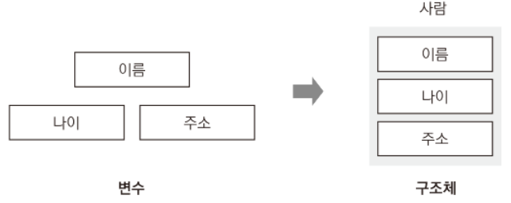
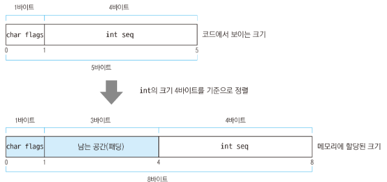
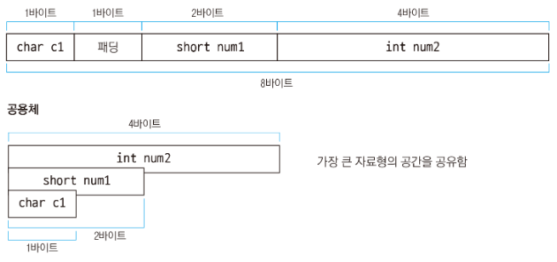
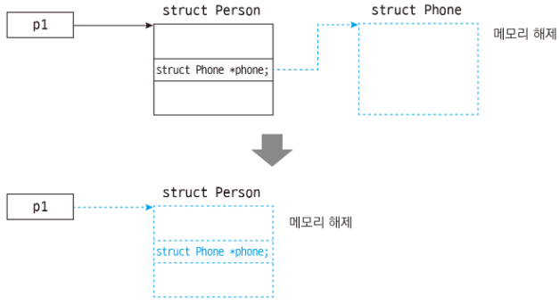
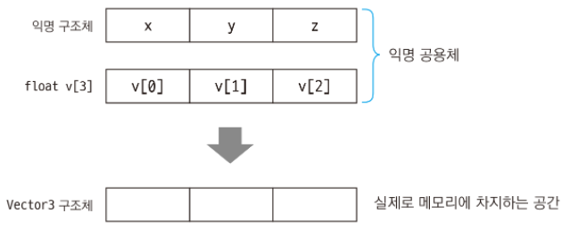
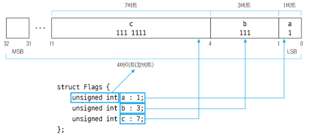
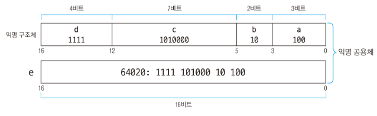

C 언어는 자료를 체계적으로 관리하기 위해 구조체라는 문법을 제공한다.
- 구조체는 관련 정보를 하나의 의미로 묶을 때 사용한다.




# 구조체를 만들고 사용하기

```c
struct 구조체이름 {
    자료형 멤버이름;
};
```
- 구조체는 정의만 해서는 사용할 수 가 없다.
  - 구조체도 변수로 선언해서 사용한다.
  - `struct 구조체이름 변수이름;`

```c
#define _CRT_SECURE_NO_WARNINGS    // strcpy 보안 경고로 인한 컴파일 에러 방지
#include <stdio.h>
#include <string.h>    // strcpy 함수가 선언된 헤더 파일

struct Person {   // 구조체 정의
    char name[20];        // 구조체 멤버 1
    int age;              // 구조체 멤버 2
    char address[100];    // 구조체 멤버 3
};

int main()
{
    struct Person p1;     // 구조체 변수 선언

    // 점으로 구조체 멤버에 접근하여 값 할당
    strcpy(p1.name, "홍길동");
    p1.age = 30;
    strcpy(p1.address, "서울시 용산구 한남동");

    // 점으로 구조체 멤버에 접근하여 값 출력
    printf("이름: %s\n", p1.name);       // 이름: 홍길동
    printf("나이: %d\n", p1.age);        // 나이: 30
    printf("주소: %s\n", p1.address);    // 주소: 서울시 용산구 한남동

    return 0;
}

<console>
이름: 홍길동
나이: 30
주소: 서울시 용산구 한남동
```

닫는 중괄호와 세미콜론 사이에 변수를 지정해주면 구조체를 정의하는 동시에 변수를 선언할 수 있다.

```c
struct 구조체이름 {
    자료형 멤버이름;
} 변수;
```

```c
#define _CRT_SECURE_NO_WARNINGS    // strcpy 보안 경고로 인한 컴파일 에러 방지
#include <stdio.h>
#include <string.h>    // strcpy 함수가 선언된 헤더 파일

struct Person {    // 구조체 정의
    char name[20];        // 구조체 멤버 1
    int age;              // 구조체 멤버 2
    char address[100];    // 구조체 멤버 3
} p1;               // 구조체를 정의하는 동시에 변수 p1 선언

int main()
{
    // 점으로 구조체 멤버에 접근하여 값 할당
    strcpy(p1.name, "홍길동");
    p1.age = 30;
    strcpy(p1.address, "서울시 용산구 한남동");

    // 점으로 구조체 멤버에 접근하여 값 출력
    printf("이름: %s\n", p1.name);       // 이름: 홍길동
    printf("나이: %d\n", p1.age);        // 나이: 30
    printf("주소: %s\n", p1.address);    // 주소: 서울시 용산구 한남동

    return 0;
}

<console>
이름: 홍길동
나이: 30
주소: 서울시 용산구 한남동
```

구조체 변수를 선언하는 동시에 초기화하기

```c
#include <stdio.h>

struct Person {
    char name[20];
    int age;
    char address[100];
};

int main()
{
    // name에는 "홍길동", age에는 30, address에는 "서울시 용산구 한남동"
    struct Person p1 = { .name = "홍길동", .age = 30, .address = "서울시 용산구 한남동" };

    printf("이름: %s\n", p1.name);       // 이름: 홍길동
    printf("나이: %d\n", p1.age);        // 나이: 30
    printf("주소: %s\n", p1.address);    // 주소: 서울시 용산구 한남동

    // name에는 "고길동", age에는 40, address에는 "서울시 서초구 반포동"
    struct Person p2 = { "고길동", 40, "서울시 서초구 반포동" };

    printf("이름: %s\n", p2.name);       // 이름: 고길동
    printf("나이: %d\n", p2.age);        // 나이: 40
    printf("주소: %s\n", p2.address);    // 주소: 서울시 서초구 반포동

    return 0;
}
```

# typedef로 struct 키워드 없이 구조체 선언하기

```c
typedef struct 구조체이름 {
    자료형 멤버이름;
} 구조체별칭;

typedef struct _Person {    // 구조체 이름은 _Person
    char name[20];             // 구조체 멤버 1
    int age;                   // 구조체 멤버 2
    char address[100];         // 구조체 멤버 3
} Person;                   // typedef를 사용하여 구조체 별칭을 Person으로 정의
```

```c
#define _CRT_SECURE_NO_WARNINGS    // strcpy 보안 경고로 인한 컴파일 에러 방지
#include <stdio.h>
#include <string.h>    // strcpy 함수가 선언된 헤더 파일

typedef struct _Person {   // 구조체 이름은 _Person
    char name[20];            // 구조체 멤버 1
    int age;                  // 구조체 멤버 2
    char address[100];        // 구조체 멤버 3
} Person;                  // typedef를 사용하여 구조체 별칭을 Person으로 정의

int main()
{
    Person p1;    // 구조체 별칭 Person으로 변수 선언

    // 점으로 구조체 멤버에 접근하여 값 할당
    strcpy(p1.name, "홍길동");
    p1.age = 30;
    strcpy(p1.address, "서울시 용산구 한남동");

    // 점으로 구조체 멤버에 접근하여 값 출력
    printf("이름: %s\n", p1.name);       // 이름: 홍길동
    printf("나이: %d\n", p1.age);        // 나이: 30
    printf("주소: %s\n", p1.address);    // 주소: 서울시 용산구 한남동

    return 0;
}

<console>
이름: 홍길동
나이: 30
주소: 서울시 용산구 한남동
```

## typedef 활용하기
typedef는 자료형의 별칭을 만드는 기능이다. 따라서 구조체뿐만 아니라 모든 자료형의 별칭을 만들 수 있다.
- `typedef 자료형 별칭`
- `typedef 자료형* 별칭`

```c
typedef int MYINT;      // int를 별칭 MYINT로 정의
typedef int* PMYINT;    // int 포인터를 별칭 PMYINT로 정의

MYINT num1;        // MYINT로 변수 선언
PMYINT numPtr1;    // PMYINT로 포인터 변수 선언

numPtr1 = &num1;   // 포인터에 변수의 주소 저장
                   // 사용 방법은 일반 변수, 포인터와 같음
```

# 익명 구조체

```c
typedef struct {
    자료형 멤버이름;
} 구조체별칭;
```

```c
#define _CRT_SECURE_NO_WARNINGS    // strcpy 보안 경고로 인한 컴파일 에러 방지
#include <stdio.h>
#include <string.h>    // strcpy 함수가 선언된 헤더 파일

typedef struct {   // 구조체 이름이 없는 익명 구조체
    char name[20];        // 구조체 멤버 1
    int age;              // 구조체 멤버 2
    char address[100];    // 구조체 멤버 3
} Person;          // typedef를 사용하여 구조체 별칭을 Person으로 정의

int main()
{
    Person p1;    // 구조체 별칭 Person으로 변수 선언

    // 점으로 구조체 멤버에 접근하여 값 할당
    strcpy(p1.name, "홍길동");
    p1.age = 30;
    strcpy(p1.address, "서울시 용산구 한남동");

    // 점으로 구조체 멤버에 접근하여 값 출력
    printf("이름: %s\n", p1.name);       // 이름: 홍길동
    printf("나이: %d\n", p1.age);        // 나이: 30
    printf("주소: %s\n", p1.address);    // 주소: 서울시 용산구 한남동

    return 0;
}
```
- 익명 구조체를 사용할 때는 구조체 별칭이 필수


# 구조체 포인터

```c
struct 구조체이름 *포인터이름 = malloc(sizeof(struct 구조체이름));
```
- 구조체 이름 앞에는 반드시 struct 키워드를 붙여야 한다.
- sizeof로 크기를 구할 때도 struct 키워드를 넣어줘야 한다.

```c
#define _CRT_SECURE_NO_WARNINGS    // strcpy 보안 경고로 인한 컴파일 에러 방지
#include <stdio.h>
#include <string.h>    // strcpy 함수가 선언된 헤더 파일
#include <stdlib.h>    // malloc, free 함수가 선언된 헤더 파일

struct Person {    // 구조체 정의
    char name[20];        // 구조체 멤버 1
    int age;              // 구조체 멤버 2
    char address[100];    // 구조체 멤버 3
};

int main()
{
    struct Person *p1 = malloc(sizeof(struct Person));    // 구조체 포인터 선언, 메모리 할당

    // 화살표 연산자로 구조체 멤버에 접근하여 값 할당
    strcpy(p1->name, "홍길동");
    p1->age = 30;
    strcpy(p1->address, "서울시 용산구 한남동");

    // 화살표 연산자로 구조체 멤버에 접근하여 값 출력
    printf("이름: %s\n", p1->name);       // 홍길동
    printf("나이: %d\n", p1->age);        // 30
    printf("주소: %s\n", p1->address);    // 서울시 용산구 한남동

    free(p1);    // 동적 메모리 해제

    return 0;
}
```
- 구조체 포인터의 멤버에 접근할 때는 ->를 사용한다.
- 구조체 포인터에서 .으로 멤버에 접근하는 방법은 따로 있다.

```c
p1->age;      // 화살표 연산자로 멤버에 접근
(*p1).age;    // 구조체 포인터를 역참조한 뒤 .으로 멤버에 접근
```
- (*p1).age와 같이 구조체 포인터를 역참조하면 pointer to struct Person에서 pointer to가 제거되서 struct Person이 된다.

# 구조체의 멤버가 포인터일 때 역참조하기

```c
*구조체변수.멤버
*구조체포인터->멤버
```

```c
#include <stdio.h>
#include <stdlib.h>

struct Data {
    char c1;
    int *numPtr;    // 포인터
};

int main()
{
    int num1 = 10;
    struct Data d1;    // 구조체 변수
    struct Data *d2 = malloc(sizeof(struct Data));    // 구조체 포인터에 메모리 할당

    d1.numPtr = &num1;
    d2->numPtr = &num1;

    printf("%d\n", *d1.numPtr);     // 10: 구조체의 멤버를 역참조
    printf("%d\n", *d2->numPtr);    // 10: 구조체 포인터의 멤버를 역참조

    d2->c1 = 'a';
    printf("%c\n", (*d2).c1);      //  a: 구조체 포인터를 역참조하여 c1에 접근
                                   // d2->c1과 같음
    printf("%d\n", *(*d2).numPtr); // 10: 구조체 포인터를 역참조하여 numPtr에 접근한 뒤 다시 역참조
                                   // *d2->numPtr과 같음

    free(d2);

    return 0;
}

<console>
10
10
a
10
```

# 구조체 포인터에 구조체 변수의 주소 할당하기

malloc 함수로 구조체 포인터에 동적 메모리를 할당하지 않고 구조체 변수에 &(주소 연산자)를 사용해도 된다.
- `구조체포인터 = &구조체변수;`

```c
#include <stdio.h>

struct Person {    // 구조체 정의
    char name[20];        // 구조체 멤버 1
    int age;              // 구조체 멤버 2
    char address[100];    // 구조체 멤버 3
};

int main()
{
    struct Person p1;      // 구조체 변수 선언
    struct Person *ptr;    // 구조체 포인터 선언

    ptr = &p1;    // p1의 메모리 주소를 구하여 ptr에 할당

    // 화살표 연산자로 구조체 멤버에 접근하여 값 할당
    ptr->age = 30;

    printf("나이: %d\n", p1.age);      // 나이: 30: 구조체 변수의 멤버 값 출력
    printf("나이: %d\n", ptr->age);    // 나이: 30: 구조체 포인터의 멤버 값 출력

    return 0;
}

<console>
나이: 30
나이: 30
```
- ptr에 p1의 메모리 주소를 할당했으므로 ptr의 멤버를 수정하면 결국 p1의 멤버도 바뀐다.


# 구조체 멤버 정렬 사용하기

## 구조체 크기

```c
sizeof(struct 구조체)
sizeof(구조체별칭)
sizeof(구조체변수)
sizeof 구조체변수
```

```c
#include <stdio.h>

struct PacketHeader {
    char flags;    // 1바이트
    int seq;       // 4바이트
};

int main()
{
    struct PacketHeader header;

    printf("%d\n", sizeof(header.flags));           // 1: char는 1바이트
    printf("%d\n", sizeof(header.seq));             // 4: int는 4바이트
    printf("%d\n", sizeof(header));                 // 8: 구조체 전체 크기는 8바이트
    printf("%d\n", sizeof(struct PacketHeader));    // 8: 구조체 이름으로 크기 구하기

    return 0;
}

<console>
1
4
8
8
```
- C 언어에서는 구조체를 정렬할 때 멤버 중에서 가장 큰 자료형의 크기의 배수로 정렬한다.
- 위의 코드에서 가장 큰 자료형은 int이므로 4바이트의 배수로 크기가 결정된다.
  - 1바이트, 4바이트이므로 5바이트 -> 8바이트가 되는 것
- 남는 공간을 패딩이라고 부른다.




구조체에서 멤버의 위치(offset)를 구할 때는 offsetof 매크로를 사용한다.(stddef.h)
- `offsetof(struct 구조체, 멤버)`
- `offsetof(구조체별칭, 멤버)`

```c
#include <stdio.h>
#include <stddef.h>   // offsetof 매크로가 정의된 헤더 파일

struct PacketHeader {
    char flags;    // 1바이트
    int seq;       // 4바이트
};

int main()
{
    printf("%d\n", offsetof(struct PacketHeader, flags));    // 0
    printf("%d\n", offsetof(struct PacketHeader, seq));      // 4

    return 0;
}

<console>
0
4
```
- 구조체는 큰 자료형의 크기에 따라서 정렬

# 구조체 정렬 크기 정렬하기
구조체 정렬을 피할 수 있다.

```c
#pragma pack(push, 정렬크기)
#pragma pack(pop)
```

```c
#include <stdio.h>

#pragma pack(push, 1)    // 1바이트 크기로 정렬
struct PacketHeader {
    char flags;    // 1바이트
    int seq;       // 4바이트
};
#pragma pack(pop)        // 정렬 설정을 이전 상태(기본값)로 되돌림

int main()
{
    struct PacketHeader header;

    printf("%d\n", sizeof(header.flags));    // 1: char는 1바이트
    printf("%d\n", sizeof(header.seq));      // 4: int는 4바이트
    printf("%d\n", sizeof(header));          // 5: 1바이트 단위로 정렬했으므로 
                                             // 구조체 전체 크기는 5바이트

    return 0;
}

<console>
1
4
5
```

# 구조체와 메모리

`memset(구조체포인터, 설정할 값, sizeof(struct 구조체));`
- 구조체 변수나 메모리의 내용을 한꺼번에 설정

```c
#include <stdio.h>
#include <string.h>    // memset 함수가 선언된 헤더 파일

struct Point2D {
    int x;
    int y;
};

int main()
{
    struct Point2D p1;

    memset(&p1, 0, sizeof(struct Point2D));    // p1을 구조체 크기만큼 0으로 설정

    printf("%d %d\n", p1.x, p1.y);    // 0 0: memset을 사용하여 0으로 설정했으므로
                                      // x, y 모두 0
 
    return 0;
}

<console>
0 0
```

```c
#include <stdio.h>
#include <stdlib.h>    // malloc, free 함수가 선언된 헤더 파일
#include <string.h>    // memset 함수가 선언된 헤더 파일

struct Point2D {
    int x;
    int y;
};

int main()
{
    struct Point2D *p1 = malloc(sizeof(struct Point2D));    // 구조체 크기만큼 메모리 할당

    memset(p1, 0, sizeof(struct Point2D));    // p1을 구조체 크기만큼 0으로 설정

    printf("%d %d\n", p1->x, p1->y);    // 0 0: memset을 사용하여 0으로 설정했으므로
                                        // x, y 모두 0

    free(p1);    // 동적 메모리 해제

    return 0;
}

<console>
0 0
```

## 구조체와 메모리 복사하기

`memcpy(목적지포인터, 원본포인터, 크기);`
- 목적지 포인터를 반환

```c
#include <stdio.h>
#include <string.h>    // memcpy 함수가 선언된 헤더 파일

struct Point2D {
    int x;
    int y;
};

int main()
{
    struct Point2D p1;
    struct Point2D p2;

    p1.x = 10;    // p1의 멤버에만 값 저장
    p1.y = 20;    // p1의 멤버에만 값 저장

    memcpy(&p2, &p1, sizeof(struct Point2D));    // Point2D 구조체 크기만큼 p1의 내용을 p2로 복사

    printf("%d %d\n", p2.x, p2.y);    // 10 20: p1의 내용을 p2로 복사했으므로 10 20

    return 0;
}

<console>
10 20
```

```c
#include <stdio.h>
#include <stdlib.h>    // malloc, free 함수가 선언된 헤더 파일
#include <string.h>    // memcpy 함수가 선언된 헤더 파일

struct Point2D {
    int x;
    int y;
};

int main()
{
    struct Point2D *p1 = malloc(sizeof(struct Point2D));
    struct Point2D *p2 = malloc(sizeof(struct Point2D));

    p1->x = 10;    // p1의 멤버에만 값 저장
    p1->y = 20;    // p1의 멤버에만 값 저장

    memcpy(p2, p1, sizeof(struct Point2D));    // Point2D 구조체 크기만큼 p1의 내용을 p2로 복사

    printf("%d %d\n", p2->x, p2->y);    // 10 20: p1의 내용을 p2로 복사했으므로 10 20

    free(p2);
    free(p1);

    return 0;
}

<console>
10 20
```

# 구조체 배열

```c
struct Point2D p[3000];    // 요소가 3,000개인 구조체 배열 선언
```

```c
#include <stdio.h>

struct Point2D {
    int x;
    int y;
};

int main()
{
    // 구조체 배열을 선언하면서 초기화
    struct Point2D p1[3] = { { .x = 10, .y = 20 }, { .x = 30, .y = 40 }, { .x = 50, .y = 60 } };

    printf("%d %d\n", p1[0].x, p1[0].y);    // 10 20
    printf("%d %d\n", p1[1].x, p1[1].y);    // 30 40
    printf("%d %d\n", p1[2].x, p1[2].y);    // 50 60

    // 구조체 배열을 선언하면서 초기화
    struct Point2D p2[3] = { { 10, 20 }, { 30, 40 }, { 50, 60 } };

    printf("%d %d\n", p2[0].x, p2[0].y);    // 10 20
    printf("%d %d\n", p2[1].x, p2[1].y);    // 30 40
    printf("%d %d\n", p2[2].x, p2[2].y);    // 50 60

    return 0;
}
```

# 구조체 포인터 배열 선언하기

```c
struct 구조체이름 *포인터이름[크기];
```

```c
#include <stdio.h>
#include <stdlib.h>    // malloc, free 함수가 선언된 헤더 파일

struct Point2D {
    int x;
    int y;
};

int main()
{
    struct Point2D *p[3];    // 크기가 3인 구조체 포인터 배열 선언

    // 구조체 포인터 배열 전체 크기에서 요소(구조체 포인터)의 크기로 나눠서 요소 개수를 구함
    for (int i = 0; i < sizeof(p) / sizeof(struct Point2D *); i++)    // 요소 개수만큼 반복
    {
        p[i] = malloc(sizeof(struct Point2D));    // 각 요소에 구조체 크기만큼 메모리 할당
    }

    p[0]->x = 10;    // 인덱스로 요소에 접근한 뒤 화살표 연산자로 멤버에 접근
    p[0]->y = 20;
    p[1]->x = 30;
    p[1]->y = 40;
    p[2]->x = 50;
    p[2]->y = 60;

    printf("%d %d\n", p[0]->x, p[0]->y);    // 10 20
    printf("%d %d\n", p[1]->x, p[1]->y);    // 30 40
    printf("%d %d\n", p[2]->x, p[2]->y);    // 50 60

    for (int i = 0; i < sizeof(p) / sizeof(struct Point2D *); i++)    // 요소 개수만큼 반복
    {
        free(p[i]);    // 각 요소의 동적 메모리 해제
    }

    return 0;
}

<console>
10 20
30 40
50 60
```

# 공용체

공용체는 구조체와 정의 방법이 같지만 멤버를 저장하는 방식이 다르다.
- 구조체는 멤버들이 각각 공간을 차지하지만 공요체는 모든 멤버가 공간을 공유한다.
- 멤버 중에서 가장 큰 자료형의 공간을 공유한다.



```c
union 공용체이름 {
    자료형 멤버이름;
};
```

```c
#define _CRT_SECURE_NO_WARNINGS    // strcpy 보안 경고로 인한 컴파일 에러 방지
#include <stdio.h>
#include <string.h>    // strcpy 함수가 선언된 헤더 파일

union Box {    // 공용체 정의
    short candy;     // 2바이트
    float snack;     // 4바이트
    char doll[8];    // 8바이트
};

int main()
{
    union Box b1;   // 공용체 변수 선언

    printf("%d\n", sizeof(b1));  // 8: 공용체의 전체 크기는 가장 큰 자료형의 크기

    strcpy(b1.doll, "bear");     // doll에 문자열 bear 복사

    printf("%d\n", b1.candy);    // 25954
    printf("%f\n", b1.snack);    // 4464428256607938511036928229376.000000
    printf("%s\n", b1.doll);     // bear

    return 0;
}
```
- 공용체는 보통 main 함수 바깥에 정의한다.
  - 만약 함수 안에서 공용체를 정의하면 해당 함수 안에서만 공용체를 사용할 수 있다.

공용체는 구조체와 달리 멤버 중에서 가장 큰 자료형의 공간을 공유한다.
- 어느 한 멤버에 값을 저장하면 나머지 멤버의 값은 사용할 수 없는 상태가 된다.
- 그래서 다음과 같이 공용체의 멤버는 한 번에 하나씩 쓰면 값을 정상적으로 사용할 수 있다.

```c
b1.candy = 10;
printf("%d\n", b1.candy);    // 10: 사용(출력)

b1.snack = 60000.0f;
printf("%f\n", b1.snack);    // 60000.00000000: 사용(출력)

strcpy(b1.doll, "bear");
printf("%s\n", b1.doll);     // bear: 사용(출력)
```

공용체는 여러 멤버에 동시에 접근하지 않는 경우 같은 메모리 레이아웃에 멤버를 모아둘 때 사용한다.

## 공용체와 엔디언

```c
#include <stdio.h>

union Data {    // 공용체 정의
    char c1;
    short num1;
    int num2;
};

int main()
{
    union Data d1;    // 공용체 변수 선언

    d1.num2 = 0x12345678;    // 리틀 엔디언에서는 메모리에 저장될 때 78 56 34 12로 저장됨

    printf("0x%x\n", d1.num2);    // 0x12345678: 4바이트 전체 값 출력
    printf("0x%x\n", d1.num1);    // 0x5678: 앞의 2바이트 값만 출력
    printf("0x%x\n", d1.c1);      // 0x78: 앞의 1바이트 값만 출력

    printf("%d\n", sizeof(d1));   // 4: 공용체의 전체 크기는 가장 큰 자료형의 크기

    return 0;
}

<console>
0x12345678
0x5678
0x78
4
```
- 공용체는 값을 저장하는 공간은 공유하지만 값을 가져올 때는 해당 자료형의 크기만큼 가져온다.


엔디언
- CPU는 엔디언이라는 방법으로 값을 메모리에 저장한다.
  - 리틀 엔디언
    - 1바이트씩 쪼개서 낮은 자릿수가 앞에 온다.
    - 그럼 d1.num1은 7856이 되어야하지만, 저장할 때 뒤집혀서 저장되었으므로 가져올 때는 다시 되돌려서 가져온다. 그래서 5678이 출력되는 것이다.


## 공용체 포인터를 선언하고 메모리 할당하기

```c
union 공용체이름 *포인터이름 = malloc(sizeof(union 공용체이름));
```

```c
#define _CRT_SECURE_NO_WARNINGS     // strcpy 보안 경고로 인한 컴파일 에러 방지
#include <stdio.h>
#include <stdlib.h>    // malloc, free 함수가 선언된 헤더 파일
#include <string.h>    // strcpy 함수가 선언된 헤더 파일

union Box {    // 공용체 정의
    short candy;
    float snack;
    char doll[8];
};

int main()
{
    union Box *b1 = malloc(sizeof(union Box));    // 공용체 포인터 선언, 메모리 할당

    printf("%d\n", sizeof(union Box));    // 8: 공용체의 전체 크기는 가장 큰 자료형의 크기

    strcpy(b1->doll, "bear");     // doll에 문자열 bear 복사

    printf("%d\n", b1->candy);    // 25954
    printf("%f\n", b1->snack);    // 4464428256607938511036928229376.000000
    printf("%s\n", b1->doll);     // bear

    free(b1);    // 동적 메모리 해제

    return 0;
}

<console>
8
25954
4464428256607938511036928229376.000000
bear
```


# 구조체 안에서 구조체 멤버 사용하기

```c
#include <stdio.h>

struct Phone {    // 휴대전화 구조체
    int areacode;                 // 국가번호
    unsigned long long number;    // 휴대전화 번호
};

struct Person {    // 사람 구조체
    char name[20];         // 이름
    int age;               // 나이
    struct Phone phone;    // 휴대전화. 구조체를 멤버로 가짐
};

int main()
{
    struct Person p1;

    p1.phone.areacode = 82;          // 변수.멤버.멤버 순으로 접근하여 값 할당
    p1.phone.number = 3045671234;    // 변수.멤버.멤버 순으로 접근하여 값 할당

    printf("%d %llu\n", p1.phone.areacode, p1.phone.number);    // 82 3045671234

    return 0;
}

<console>
82 3045671234
```

# 구조체 안의 구조체 멤버에 메모리 할당하기

```c
#include <stdio.h>
#include <stdlib.h>    // malloc, free 함수가 선언된 헤더 파일

struct Phone {    // 휴대전화 구조체
    int areacode;                 // 국가번호
    unsigned long long number;    // 휴대전화 번호
};

struct Person {    // 사람 구조체
    char name[20];         // 이름
    int age;               // 나이
    struct Phone phone;    // 휴대전화. 구조체를 멤버로 가짐
};

int main()
{
    struct Person *p1 = malloc(sizeof(struct Person));    // 사람 구조체 포인터에 메모리 할당

    p1->phone.areacode = 82;          // 포인터->멤버.멤버 순으로 접근하여 값 할당
    p1->phone.number = 3045671234;    // 포인터->멤버.멤버 순으로 접근하여 값 할당

    printf("%d %llu\n", p1->phone.areacode, p1->phone.number);    // 82 3045671234

    free(p1);    // 동적 메모리 해제

    return 0;
}

<console>
82 3045671234
```

```c
#include <stdio.h>
#include <stdlib.h>    // malloc, free 함수가 선언된 헤더 파일

struct Phone {    // 휴대전화 구조체
    int areacode;                 // 국가번호
    unsigned long long number;    // 휴대전화 번호
};

struct Person {    // 사람 구조체
    char name[20];          // 이름
    int age;                // 나이
    struct Phone *phone;    // 휴대전화. 구조체 포인터 선언
};

int main()
{
    struct Person *p1 = malloc(sizeof(struct Person));    // 바깥 구조체의 포인터에 메모리 할당
    p1->phone = malloc(sizeof(struct Phone));             // 멤버 포인터에 메모리 할당

    p1->phone->areacode = 82;          // 포인터->포인터->멤버 순으로 접근하여 값 할당
    p1->phone->number = 3045671234;    // 포인터->포인터->멤버 순으로 접근하여 값 할당

    printf("%d %llu\n", p1->phone->areacode, p1->phone->number);    // 82 3045671234

    free(p1->phone);    // 구조체 멤버의 메모리를 먼저 해제
    free(p1);           // 구조체 메모리 해제

    return 0;
}

<console>
82 3045671234
```
- 일단 바깥 구조체의 포인터에 메모리를 할당한 뒤 멤버로 있는 구조체 포인터에 메모리를 할당한다.
- 해제할 때는 구조체 멤버의 메모리를 먼저 해제해야 한다.




# 익명 구조체와 익명 공용체 활용하기

```c
#include <stdio.h>

struct Vector3 { // 3차원 벡터 좌표
    union {          // 익명 공용체
        struct {         // 익명 구조체
            float x;         // x 좌표
            float y;         // y 좌표
            float z;         // z 좌표
        };
        float v[3];      // 좌표를 배열로 저장
    };
};

int main()
{
    struct Vector3 pos;

    for (int i = 0; i < 3; i++)    // 3번 반복
    {
        pos.v[i] = 1.0f;           // v는 배열이므로 인덱스로 접근 할 수 있음
    }
 
    printf("%f %f %f\n", pos.x, pos.y, pos.z);    // 1.000000 1.000000 1.000000: x, y, z로 접근

    return 0;
}

<console>
1.000000 1.000000 1.000000
```
- xyz는 각각의 독립적인 공간에 저장하기 위해 구조체로 정의한다.
- pos.x처럼 멤버에 바로 접근하기 위해 익명 구조체로 정의한다.
- pos.v처럼 멤버에 바로 접근하기 위해 익명 공용체로 정의한다.
- 공용체로 묶어주면 x,y,z와 v[3]는 같은 공간을 공유한다.



익명 구조체와 익명 공용체를 사용하면 같은 값이지만 이름과 형태를 달리하여 접근할 수 있다.

# 구조체 비트 필드
CPU나 기타 칩의 플래그를 다루는 저수준 프로그래밍을 할 때 기본 자료형보다 더 작은 비트 단위로 값을 가져오거나 저장하는 경우가 많으므로 구조체 비트 필드가 유용하게 사용된다.

```c
#include <stdio.h>

struct Flags {
    unsigned int a : 1;     // a는 1비트 크기
    unsigned int b : 3;     // b는 3비트 크기
    unsigned int c : 7;     // c는 7비트 크기
};

int main()
{
    struct Flags f1;    // 구조체 변수 선언

    f1.a = 1;      //   1: 0000 0001, 비트 1개
    f1.b = 15;     //  15: 0000 1111, 비트 4개
    f1.c = 255;    // 255: 1111 1111, 비트 8개

    printf("%u\n", f1.a);    //   1:        1, 비트 1개만 저장됨
    printf("%u\n", f1.b);    //   7:      111, 비트 3개만 저장됨
    printf("%u\n", f1.c);    // 127: 111 1111, 비트 7개만 저장됨

    return 0;
}

<console>
1
7
127
```
- 비트 필드에는 지정한 비트 수만큼 저장되며 나머지 비트는 버려진다.
- 다음과 같이 비트 필드의 각 멤버는 최하위 비트(Least Significant Bit, LSB)부터 차례대로 배치된다.



# 비트 필드와 공용체를 함께 사용하기

```c
#include <stdio.h>

struct Flags {
    union {    // 익명 공용체
        struct {    // 익명 구조체
            unsigned short a : 3;    // a는 3비트 크기
            unsigned short b : 2;    // b는 2비트 크기
            unsigned short c : 7;    // c는 7비트 크기
            unsigned short d : 4;    // d는 4비트 크기
        };                           // 합계 16비트
        unsigned short e;    // 2바이트(16비트)
    };
};

int main()
{
    struct Flags f1 = { 0, };    // 모든 멤버를 0으로 초기화

    f1.a = 4;     //  4: 0000 0100
    f1.b = 2;     //  2: 0000 0010
    f1.c = 80;    // 80: 0101 0000
    f1.d = 15;    // 15: 0000 1111

    printf("%u\n", f1.e);    // 64020: 1111 1010000 10 100

    return 0;
}

<console>
64020
```

