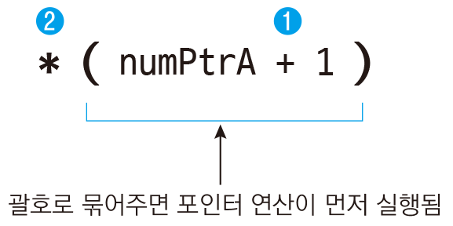

# 메모리 할당하기

`포인터 = malloc(크기);`
- 성공하면 메모리 주소를 반환, 실패하면 NULL을 반환

일반 변수의 메모리 주소를 할당한 것과 malloc 함수로 메모리를 할당한 것은 차이가 있다.
- 스택과 힙의 차이
  - 변수는 스택에 생성
    - 따로 메모리 해제를 하지 않아도 된다.
  - malloc 함수는 힙에 생성
    - 반드시 따로 메모리 해제를 해줘야 한다.

메모리 해제
- `free(포이니터);`


# 메모리에 값 저장하기

malloc 함수로 할당한 메모리에 값을 저장할 때는 `*numPtr = 10;` 처럼 포인터를 역참조한 뒤 값을 저장한다.
- 값을 출력할 때도 포인터를 역참조하여 값을 가져온다.


# 메모리에 내용을 한꺼번에 설정하기

memset 함수를 사용하면 메모리의 내용을 원하는 크기만큼 특정값으로 설정할 수 있다.(string.h)
- `memset(포인터, 설정할 값, 크기);`
- memset 함수는 주로 다음과 같이 설정할 값을 0으로 지정하여 메모리의 내용을 모두 0으로 만들 때 주로 사용한다.
- `memset(numPtr, 0, 8);`
  - numPtr이 가리키는 메모리를 8바이트만큼 0으로 설정
- memset 함수에 설정할 크기를 지정할 때 보통 숫자 대신 sizeof를 사용한다.
- memset 함수가 메모리를 초기화하는 단위
  - 1바이트

```c
long long *numPtr = malloc(sizeof(long long));

memset(numPtr, 0, sizeof(long long));   // numPtr이 가리키는 메모리를 long long 크기만큼 0으로 설정
```
- 여기서 메모리를 `sizeof(long long)`크기만큼 할당했으므로 설정할 크기도 `sizeof(long long)`과 같이 지정해야 하며 `sizeof(long long *)`과 같이 포인터의 크기를 지정하면 안된다.


# 널 포인터

```c
int *numPtr1 = NULL;    // 포인터에 NULL 저장

printf("%p\n", numPtr1);    // 00000000
```
- NULL이 들어있는 포인터를 널 포인터라고 하며 아무것도 가리키지 않는 상태를 뜻한다.
  - 역참조 불가
- 실무세엇는 NULL인지 확인한 뒤 NULL이면 메모리를 할당하는 패턴을 주로 사용한다.

```c
if (ptr == NULL)         // ptr이 널 포인터라면
{
    ptr = malloc(1024);   // 1024바이트만큼 메모리 할당
}
```

# 잘못된 포인터 사용
포인터에는 임의의 값을 할당하면 안된다. 반드시 이미 있는 변수의 메모리 주소를 구해서 할당하거나, malloc 함수로 메모리를 할당해야 한다.

```c
int *numPtr = 0x100;    // 잘못된 포인터 사용, 임의의 값을 할당하면 안 됨

int num1;
int *numPtr = &num1;    // 변수 num1의 메모리 주소를 포인터 변수에 저장

int *numPtr = malloc(sizeof(int));    // int의 크기만큼 동적 메모리 할당
```

# 포인터 연산

메모리 주소에 일정 숫자를 더하거나 빼면 메모리 주소가 증가, 감소한다.
- 포인터 연산을 하면 다른 메모리 주소에 접근할 수 있으며 주소를 손쉽게 옮겨 다니기 위해 사용된다.

```c
#include <stdio.h>

int main()
{
    int numArr[5] = { 11, 22, 33, 44, 55 };
    int *numPtrA;
    int *numPtrB;
    int *numPtrC;

    numPtrA = numArr;    // 배열 첫 번째 요소의 메모리 주소를 포인터에 저장

    numPtrB = numPtrA + 1;    // 포인터 연산
    numPtrC = numPtrA + 2;    // 포인터 연산
    
    printf("%p\n", numPtrA);    // 00A3FC00: 메모리 주소. 컴퓨터마다, 실행할 때마다 달라짐
    printf("%p\n", numPtrB);    // 00A3FC04: sizeof(int) * 1이므로 numPtrA에서 4가 증가함
    printf("%p\n", numPtrC);    // 00A3FC08: sizeof(int) * 2이므로 numPtrA에서 8이 증가함

    return 0;
}

<console>
00A3FC00 (메모리 주소. 컴퓨터마다, 실행할 때마다 달라짐)
00A3FC04
00A3FC08
```

```c
#include <stdio.h>

int main()
{
    int numArr[5] = { 11, 22, 33, 44, 55 };
    int *numPtrA;
    int *numPtrB;
    int *numPtrC;

    numPtrA = &numArr[2];    // 배열 세 번째 요소의 주소를 포인터에 저장

    numPtrB = numPtrA;
    numPtrC = numPtrA;

    numPtrB++;    // 포인터 연산
    numPtrC--;    // 포인터 연산

    printf("%d\n", *numPtrA);    // 00A3FC08: 메모리 주소. 컴퓨터마다, 실행할 때마다 달라짐
    printf("%d\n", *numPtrB);    // 00A3FC0C: sizeof(int) * 1이므로 numPtrA에서 4가 증가함
    printf("%d\n", *numPtrC);    // 00A3FC04: sizeof(int) * -1이므로 numPtrA에서 4가 감소함

    return 0;
}

<console>
33
44
22
```

```c
#include <stdio.h>

int main()
{
    int numArr[5] = { 11, 22, 33, 44, 55 };
    int *numPtrA;

    numPtrA = numArr;    // 배열 첫 번째 요소의 주소를 포인터에 저장

    printf("%d\n", *(numPtrA + 1));    // 22: numPtrA에서 순방향으로 4바이트만큼 떨어진
                                       // 메모리에 주소에 접근. numArr[1]과 같음

    printf("%d\n", *(numPtrA + 2));    // 33: numPtrA에서 순방향으로 8바이트만큼 떨어진
                                       // 메모리에 주소에 접근. numArr[2]와 같음

    return 0;
}

<console>
22
33
```



# void 포인터로 포인터 연산하기

```c
#include <stdio.h>
#include <stdlib.h>    // malloc, free 함수가 선언된 헤더 파일

int main()
{
    void *ptr = malloc(100);    // 100바이트만큼 메모리 할당

    printf("%p\n", ptr);
    printf("%p\n", ptr + 1);    // 컴파일 에러. void 포인터는 포인터 연산을 할 수 없음

    free(ptr);

    return 0;
}

<console>
void_pointer_add_error.c(8): error C2036: 'void *': 알 수 없는 크기입니다.
```
- void 포인터는 자료형의 크기가 정해져 있지 않기 때문에 +, -로 연산을 해도 얼마만큼 이동할지 알 수 없다.
- 연산을 하기 위해서는
  - `(자료형 *)void포인터 + 값`
  - `(자료형 *)void포인터 - 값`
  - `++(자료형 *)void포인터`
  - `--(자료형 *)void포인터`
  - `((자료형 *)void포인터)++`
  - `((자료형 *)void포인터)--`


```c
#include <stdio.h>
#include <stdlib.h>    // malloc, free 함수가 선언된 헤더 파일

int main()
{
    void *ptr = malloc(100);    // 100바이트만큼 메모리 할당

    printf("%p\n", ptr);               // 00FADD20: 메모리 주소. 컴퓨터마다, 실행할 때마다 달라짐
    printf("%p\n", (int *)ptr + 1);    // 00FADD24: 다른 포인터로 변환한 뒤 포인터 연산
    printf("%p\n", (int *)ptr - 1);    // 00FADD1C: 다른 포인터로 변환한 뒤 포인터 연산

    void *ptr2 = ptr;    // 메모리 주소를 변화시킬 때는 다른 포인터에 보관
    printf("%p\n", ++(int *)ptr2);     // 00FADD24: 다른 포인터로 변환한 뒤 포인터 연산
    printf("%p\n", --(int *)ptr2);     // 00FADD20: 다른 포인터로 변환한 뒤 포인터 연산

    printf("%p\n", ((int *)ptr2)++);   // 00FADD20: 다른 포인터로 변환한 뒤 포인터 연산
    printf("%p\n", ((int *)ptr2)--);   // 00FADD24: 다른 포인터로 변환한 뒤 포인터 연산

    free(ptr);

    return 0;
}

<console>
00FADD20
00FADD24
00FADD1C
00FADD24
00FADD20
00FADD20
00FADD24
```
- 동적 메모리를 할당받은 포인터를 ++, -- 연산자로 포인터 연산을 하게 되면 포인터에 저장된 메모리 주소 자체가 바뀌게 된다.
  - 이때 free 함수에서 메모리 주소가 바뀐 포인터로 메모리 해제를 하면 에러가 발생한다.
  - free 함수로 메모리 해제를 할 때는 반드시 처음에 메모리를 할당할 때 받은 주소(포인터)를 넣어줘야 한다.

역참조
- `*((자료형 *)void포인터 + 값)`
- `*((자료형 *)void포인터 - 값)`
- `*(++(자료형 *)void포인터)`
- `*(--(자료형 *)void포인터)`
- `*(((자료형 *)void포인터)++)`
- `*(((자료형 *)void포인터)--)`

```c
#include <stdio.h>

int main()
{
    int numArr[5] = { 11, 22, 33, 44, 55 };
    void *ptr = &numArr[2];    // 두 번째 요소의 메모리 주소

    printf("%d\n", *(int *)ptr);    // 33: 포인터 연산을 하지 않은 상태에서 역참조

    // void 포인터를 다른 포인터로 변환하여 포인터 연산을 한 뒤 역참조
    printf("%d\n", *((int *)ptr + 1));    // 44
    printf("%d\n", *((int *)ptr - 1));    // 22

    printf("%d\n", *(++(int *)ptr));      // 44
    printf("%d\n", *(--(int *)ptr));      // 33

    printf("%d\n", *(((int *)ptr)++));    // 33
    printf("%d\n", *(((int *)ptr)--));    // 44

    return 0;
}

<console>
33
44
22
44
33
33
44
```

# 구조체 포인터로 포인터 연산하기

`(포인터 + 값)->멤버`
`(포인터 - 값)->멤버`

```c
#include <stdio.h>

struct Data {
    int num1;
    int num2;
};

int main()
{
    struct Data d[3] = { { 10, 20 }, { 30, 40 }, { 50, 60 } };    // 구조체 배열 선언과 값 초기화
    struct Data *ptr;    // 구조체 포인터 선언

    ptr = d;    // 구조체 배열 첫 번째 요소의 메모리 주소를 포인터에 저장

    printf("%d %d\n", (ptr + 1)->num1, (ptr + 1)->num2);    // 30 40: 구조체 배열에서 멤버의 값 출력
                                                            // d[1].num1, d[1].num2와 같음

    printf("%d %d\n", (ptr + 2)->num1, (ptr + 2)->num2);    // 50 60: 구조체 배열에서 멤버의 값 출력
                                                            // d[2].num1, d[2].num2와 같음

    return 0;
}

<console>
30 40
50 60
```