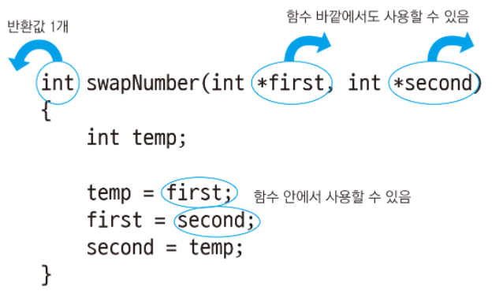

# 포인터 반환하기

```c
#include <stdio.h>

int *ten()    // int 포인터를 반환하는 ten 함수 정의
{
    int num1 = 10;   // num1은 함수 ten이 끝나면 사라짐

    return &num1;    // 함수에서 지역 변수의 주소를 반환하는 것은 잘못된 방법
} //        ↑ warning C4172: 지역 변수 또는 임시 변수의 주소를 반환하고 있습니다.

int main()
{
    int *numPtr;

    numPtr = ten();    // 함수를 호출하고 반환값을 numPtr에 저장

    printf("%d\n", *numPtr);    // 10: 값이 나오긴 하지만 이미 사라진 변수를 출력하고 있음

    return 0;
}

<console>
return_pointer_warning.c(7): warning C4172: 지역 변수 또는 임시 변수의 주소를 반환하고 있습니다.
```
- num1은 함수 ten 안에서만 사용할 수 있는 지역 변수이며 함수가 끝나면 사라진다.
  - 그러므로 사라지는 변수의 주소를 반환하는 것은 잘못된 것이다.
  - 포인터를 반환하려면 다음과 같이 malloc 함수로 메모리를 할당한 뒤 반환해야 한다.


```c
#include <stdio.h>
#include <stdlib.h>    // malloc, free 함수가 선언된 헤더 파일

int *ten()    // int 포인터를 반환하는 ten 함수 정의
{
    int *numPtr = malloc(sizeof(int));    // int 크기만큼 동적 메모리 할당

    *numPtr = 10;    // 역참조로 10 저장

    return numPtr;   // 포인터 반환. malloc으로 메모리를 할당하면 함수가 끝나도 사라지지 않음
}

int main()
{
    int* numPtr;

    numPtr = ten();    // 함수를 호출하고 반환값을 numPtr에 저장

    printf("%d\n", *numPtr);    // 10: 메모리를 해제하기 전까지 안전함

    free(numPtr);    // 다른 함수에서 할당한 메모리라도 반드시 해제해야 함

    return 0;
}

<console>
10
```


```c
#define _CRT_SECURE_NO_WARNINGS    // strcpy 보안 경고로 인한 컴파일 에러 방지
#include <stdio.h>
#include <stdlib.h>    // malloc, free 함수가 선언된 헤더 파일
#include <string.h>    // strcpy 함수가 선언된 헤더 파일

char *helloLiteral()       // char 포인터를 반환하는 helloLiteral 함수 정의
{
    char *s1 = "Hello, world!";

    return s1;    // 문자열 Hello, world!는 메모리에 저장되어 있으므로 사라지지 않음
                  // 문자열 포인터 리턴
}

char *helloDynamicMemory()    // char 포인터를 반환하는 helloDynamicMemory 함수 정의
{
    char *s1 = malloc(sizeof(char) * 20);    // char 20개 크기만큼 동적 메모리 할당

    strcpy(s1, "Hello, world!");    // Hello, world!를 s1에 복사

    return s1;   // 문자열 포인터 리턴
}

int main()
{
    char *s1;
    char *s2;

    s1 = helloLiteral();
    s2 = helloDynamicMemory();

    printf("%s\n", s1);    // Hello, world!
    printf("%s\n", s2);    // Hello, world!

    free(s2);    // 동적 메모리 해제

    return 0;
}

<console>
Hello, world!
Hello, world!
```

# void 포인터 반환하기

자료형에 상관없이 값을 꺼내올 수 있다.

```c
#define _CRT_SECURE_NO_WARNINGS    // strcpy 보안 경고로 인한 컴파일 에러 방지
#include <stdio.h>
#include <stdlib.h>    // malloc, free 함수가 선언된 헤더 파일
#include <string.h>    // strcpy 함수가 선언된 헤더 파일

void *allocMemory()    // void 포인터를 반환하는 allocMemory 함수 정의
{
    void *ptr = malloc(100);    // 100바이트만큼 동적 메모리 할당

    return ptr;    // void 포인터 반환
}

int main()
{
    char *s1 = allocMemory();       // void 포인터를 char 포인터에 넣어서 문자열처럼 사용
    strcpy(s1, "Hello, world!");    // s1에 Hello, world! 복사
    printf("%s\n", s1);             // Hello, world!
    free(s1);                       // 동적 메모리 해제

    int *numPtr1 = allocMemory();   // void 포인터를 int 포인터에 넣어서 정수 배열처럼 사용
    numPtr1[0] = 10;                // 첫 번째 요소에 10 저장
    numPtr1[1] = 20;                // 두 번째 요소에 20 저장
    printf("%d %d\n", numPtr1[0], numPtr1[1]); // 10 20
    free(numPtr1);                  // 동적 메모리 해제

    return 0;
}

<console>
Hello, world!
10 20
```
- void 포인터는 다양한 포인터로 자동 변환된다.

# 구조체와 구조체 포인터 반환하기

```c
#define _CRT_SECURE_NO_WARNINGS    // strcpy 보안 경고로 인한 컴파일 에러 방지
#include <stdio.h>
#include <string.h>    // strcpy 함수가 선언된 헤더 파일

struct Person {
    char name[20];
    int age;
    char address[100];
};

struct Person getPerson()    // Person 구조체를 반환하는 getPerson 함수 정의
{
    struct Person p;

    strcpy(p.name, "홍길동");
    p.age = 30;
    strcpy(p.address, "서울시 용산구 한남동");

    return p;    // 구조체 변수 반환
}

int main()
{
    struct Person p1;

    p1 = getPerson();    // 반환된 구조체 변수의 내용이 p1로 모두 복사됨

    // getPerson에서 저장한 값이 출력됨
    printf("이름: %s\n", p1.name);       // 홍길동
    printf("나이: %d\n", p1.age);        // 30
    printf("주소: %s\n", p1.address);    // 서울시 용산구 한남동

    return 0;
}

<console>
이름: 홍길동
나이: 30
주소: 서울시 용산구 한남동
```

```c
#define _CRT_SECURE_NO_WARNINGS    // strcpy 보안 경고로 인한 컴파일 에러 방지
#include <stdio.h>
#include <string.h>    // strcpy 함수가 선언된 헤더 파일
#include <stdlib.h>    // malloc, free 함수가 선언된 헤더 파일

struct Person {
    char name[20];
    int age;
    char address[100];
};

struct Person *allocPerson()    // Person 구조체 포인터를 반환하는 allocPerson 함수 정의
{
    struct Person *p = malloc(sizeof(struct Person));    // 구조체 포인터에 동적 메모리 할당;

    strcpy(p->name, "홍길동");
    p->age = 30;
    strcpy(p->address, "서울시 용산구 한남동");

    return p;    // 구조체 포인터 반환
}

int main()
{
    struct Person *p1;

    p1 = allocPerson();    // 포인터를 반환하여 p1에 메모리 주소 저장

    // allocPerson에서 저장한 값들이 출력됨
    printf("이름: %s\n", p1->name);       // 홍길동
    printf("나이: %d\n", p1->age);        // 30
    printf("주소: %s\n", p1->address);    // 서울시 용산구 한남동

    free(p1);    // 동적 메모리 해제

    return 0;
}

<console>
이름: 홍길동
나이: 30
주소: 서울시 용산구 한남동
```

## 구조체 별칭 사용하기

```c
typedef struct _Person {
    char name[20];
    int age;
    char address[100];
} Person, *PPerson;    // 구조체 별칭 Person, 구조체 포인터 별칭 PPerson

PPerson allocPerson()    // Person 구조체 포인터의 별칭을 반환값 자료형으로 지정
{
    PPerson p = malloc(sizeof(Person));    // 구조체 포인터에 동적 메모리 할당

    strcpy(p->name, "홍길동");
    p->age = 30;
    strcpy(p->address, "서울시 용산구 한남동");

    return p;    // 구조체 포인터 반환
}
```

## 공용체와 열거형 반환하기

```c
#include <stdio.h>

union Box {
    short candy;
    float snack;
    char doll[8];
};

enum BOX_TYPE {
    BOX_PAPER = 0,
    BOX_WOOD,
    BOX_PLASTIC
};

union Box getBox()    // Box 공용체를 반환하는 getBox 함수 정의
{
    union Box b;  // 공용체 변수 선언

    b.candy = 10;

    return b;     // 공용체 변수 반환
}

enum BOX_TYPE getBoxType()    // BOX_TYPE 열거형을 반환하는 getBoxType 함수 정의
{
    return BOX_WOOD;
}

int main()
{
    union Box box;
    enum BOX_TYPE boxType;

    box = getBox();         // 반환된 공용체 변수의 내용이 box로 모두 복사됨
    boxType = getBoxType();    // 반환된 열거형 값이 boxType에 저장됨

    printf("%d\n", box.candy);    // 10: getBox에서 저장한 값
    printf("%d\n", boxType);      //  1: getBoxType에서 반환한 BOX_WOOD

    return 0;
}
```

# 함수에서 포인터 매개변수 사용하기

c 언어에서 값을 여러 개 반환하는 함수를 만들 때는 주로 포인터 매개변수를 사용한다.



```c
#include <stdio.h>

void swapNumber(int first, int second)    // 반환값 없음, int형 매개변수 두 개 지정
{
    int temp;    // 임시 보관 변수

    temp = first;
    first = second;
    second = temp;
}

int main()
{
    int num1 = 10;
    int num2 = 20;

    swapNumber(num1, num2);    // 변수 num1과 num2를 넣어줌

    printf("%d %d\n", num1, num2);    // 10 20: swapNumber 함수와는 상관없이 
                                      // 처음 저장한 10과 20이 출력됨

    return 0;
}

<console>
10 20
```

```c
#include <stdio.h>

void swapNumber(int *first, int *second)    // 반환값 없음, int 포인터 매개변수 두 개 지정
{
    int temp;    // 임시 보관 변수

    // 역참조로 값을 가져오고, 값을 저장함
    temp = *first;
    *first = *second;
    *second = temp;
}

int main()
{
    int num1 = 10;
    int num2 = 20;

    swapNumber(&num1, &num2);        // &를 사용하여 num1과 num2의 메모리 주소를 넣어줌

    printf("%d %d\n", num1, num2);   // 20 10: swapNumber에 의해서 num1과 num2의 값이 서로 바뀜

    return 0;
}

<console>
20 10
```

# void 포인터 매개변수 사용하기

```c
#include <stdio.h>

enum TYPE {
    TYPE_CHAR,
    TYPE_INT,
    TYPE_FLOAT
};

void swapValue(void *ptr1, void *ptr2, enum TYPE t)    // 반환값 없음, void 포인터 매개변수 두 개와
{                                                      // 변수의 자료형을 알려줄 열거형을 받음
    switch (t)
    {
        case TYPE_CHAR:    // 문자면 char *로 변환한 뒤 역참조하여 값을 서로 바꿈
        {
            char temp;
            temp = *(char *)ptr1;
            *(char *)ptr1 = *(char *)ptr2;
            *(char *)ptr2 = temp;
            break;
        }
        case TYPE_INT:     // 정수면 int *로 변환한 뒤 역참조하여 값을 서로 바꿈
        {
            int temp;
            temp = *(int *)ptr1;
            *(int *)ptr1 = *(int *)ptr2;
            *(int *)ptr2 = temp;
            break;
        }
        case TYPE_FLOAT:    // 실수면 float *로 변환한 뒤 역참조하여 값을 서로 바꿈
        {
            float temp;
            temp = *(float *)ptr1;
            *(float *)ptr1 = *(float *)ptr2;
            *(float *)ptr2 = temp;
            break;
        }
    }
}

int main()
{
    char c1 = 'a';
    char c2 = 'b';
    swapValue(&c1, &c2, TYPE_CHAR);       // 변수의 메모리 주소와 TYPE_CHAR를 넣음
    printf("%c %c\n", c1, c2);            // b a: swapValue에 의해서 값이 서로 바뀜

    int num1 = 10;
    int num2 = 20;
    swapValue(&num1, &num2, TYPE_INT);   // 변수의 메모리 주소와 TYPE_INT를 넣음
    printf("%d %d\n", num1, num2);       // 20 10: swapValue에 의해서 값이 서로 바뀜

    float num3 = 1.234567f;
    float num4 = 7.654321f;
    swapValue(&num3, &num4, TYPE_FLOAT);  // 변수의 메모리 주소와 TYPE_FLOAT를 넣음
    printf("%f %f\n", num3, num4);        // 7.654321f 1.234567: 
                                          // swapValue에 의해서 값이 서로 바뀜

    return 0;
}

<console>
b a
20 10
7.654321 1.234567
```

# 이중 포인터 매개변수 사용하기

```c
#include <stdio.h>
#include <stdlib.h>    // malloc, free 함수가 선언된 헤더 파일

void allocMemory(void *ptr, int size)    // 반환값 없음, void 포인터 매개변수 지정
{
    ptr = malloc(size);    // ptr은 allocMemory를 벗어나면 사용할 수 없음
}

int main()
{
    long long *numPtr = NULL;

    // numPtr과 할당할 크기를 넣어줌 
    allocMemory(numPtr, sizeof(long long));

    *numPtr = 10;    // 메모리가 할당되지 않았으므로 실행 에러
    printf("%lld\n", *numPtr);

    free(numPtr);

    return 0;
}

<console>
0xC0000005: 0x00000000 위치를 기록하는 동안 액세스 위반이 발생했습니다.
```
- ptr에 메모리를 할당해봐야 allocMemory 함수를 벗어나면 사용할 수가 없다.(메모리 누수)


```c
#include <stdio.h>
#include <stdlib.h>    // malloc, free 함수가 선언된 헤더 파일

void allocMemory(void **ptr, int size)    // 반환값 없음, void 이중 포인터 매개변수 지정
{
    *ptr = malloc(size);    // void **ptr을 역참조하여 void *ptr에 메모리 할당
}

int main()
{
    long long *numPtr;

    // 단일 포인터 long long *numPtr의 메모리 주소는 long long **와 같음, 할당할 크기도 넣음 
    allocMemory((void**)&numPtr, sizeof(long long));

    *numPtr = 10;
    printf("%lld\n", *numPtr);

    free(numPtr);    // 동적 메모리 해제

    return 0;
}

<console>
10
```


# 문자열 매개변수

```c
#include <stdio.h>

void helloString(char *s1)    // 반환값 없음, char 포인터 매개변수 한 개 지정
{
    printf("Hello, %s\n", s1);    // Hello, 와 매개변수를 조합하여 문자열 출력
}

int main()
{
    helloString("world!");    // Hello, world!: 함수를 호출할 때 문자열을 전달

    return 0;
}

<console>
Hello, world!
```

매개변수로 문자 배열을 받는다는 것을 확실히 해주려면 매개변수 뒤에 []를 붙여준다.

```c
#include <stdio.h>

void helloString(char s1[])    // 반환값 없음, char 배열을 매개변수로 지정, 크기 생략
{
    printf("Hello, %s\n", s1);    // Hello, 와 매개변수를 조합하여 문자열 출력
}

int main()
{
    char s1[10] = "world!";   // 배열 형태의 문자열

    helloString(s1);          // Hello, world!: 함수를 호출할 때 배열 전달
    helloString("world!");    // Hello, world!: 함수를 호출할 때 문자열 전달

    return 0;
}

<console>
Hello, world!
Hello, world!
```

# 함수에서 배열 매개변수 사용하기