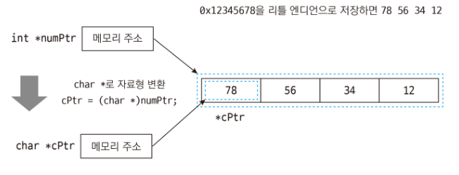
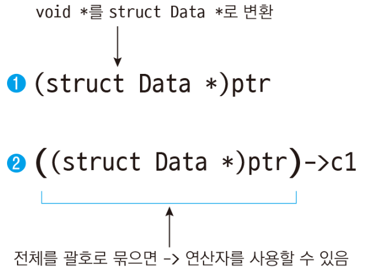

# 포인터 변환하기

(자료형 *)포인터

```c
#include <stdio.h>
#include <stdlib.h>    // malloc, free 함수가 선언된 헤더 파일

int main()
{
    int *numPtr = malloc(sizeof(int));    // 4바이트만큼 메모리 할당
    char *cPtr;

    *numPtr = 0x12345678;

    cPtr = (char *)numPtr;     // int 포인터 numPtr을 char 포인터로 변환. 메모리 주소만 저장됨

    printf("0x%x\n", *cPtr);   // 0x78: 낮은 자릿수 1바이트를 가져오므로 0x78

    free(numPtr);    // 동적 메모리 해제

    return 0;
}

<console>
0x78
```



크기가 작은 메모리 공간을 할당한 뒤 큰 자료형의 포인터로 역참조하면 의도치 않은 값을 가져오게 된다.

```c
#include <stdio.h>
#include <stdlib.h>    // malloc, free 함수가 선언된 헤더 파일

int main()
{
    short *numPtr1 = malloc(sizeof(short));    // 2바이트만큼 메모리 할당
    int *numPtr2;

    *numPtr1 = 0x1234;

    numPtr2 = (int *)numPtr1;    // short 포인터 numPtr1을 int 포인터로 변환. 메모리 주소만 저장됨

    printf("0x%x\n", *numPtr2);    // 0xfdfd1234: 옆의 메모리를 침범하여 값을 가져옴
                                   // 0xfdfd는 상황에 따라서 값이 달라질 수 있음

    free(numPtr1);    // 동적 메모리 해제

    return 0;
}

<console>
0xfdfd1234
```

포인터를 다른 자료형으로 변환하면서 역참조하려면 다음과 같이 괄호 앞에 역참조 연산자*를 붙여주면 된다.
- `*(자료형 *)포인터`


```c
#include <stdio.h>
#include <stdlib.h>    // malloc, free 함수가 선언된 헤더 파일

int main()
{
    int *numPtr = malloc(sizeof(int));    // 4바이트만큼 메모리 할당
    char *cPtr;

    *numPtr = 0x12345678;

    printf("0x%x\n", *(char *)numPtr);    // 0x78: numPtr1을 char 포인터로 변환한 뒤 역참조

    free(numPtr);    // 동적 메모리 해제

    return 0;
}

<console>
0x78
```

# void 포인터

void 포인터를 다른 자료형으로 변환하면 역참조 가능
- `*(자료형 *)void 포인터`

```c
#include <stdio.h>

int main()
{
    int num1 = 10;
    float num2 = 3.5f;
    char c1 = 'a';
    void *ptr;

    ptr = &num1;    // num1의 메모리 주소를 void 포인터 ptr에 저장
    // printf("%d\n", *ptr);         // 컴파일 에러
    printf("%d\n", *(int *)ptr);     // 10: void 포인터를 int 포인터로 변환한 뒤 역참조

    ptr = &num2;    // num2의 메모리 주소를 void 포인터 ptr에 저장
    // printf("%f\n", *ptr);         // 컴파일 에러
    printf("%f\n", *(float *)ptr);   // 3.500000: void 포인터를 float 포인터로 변환한 뒤 역참조

    ptr = &c1;      // c1의 메모리 주소를 void 포인터 ptr에 저장
    // printf("%c\n", *ptr);         // 컴파일 에러
    printf("%c\n", *(char *)ptr);    // a: void 포인터를 char 포인터로 변환한 뒤 역참조

    return 0;
}

<console>
10
3.500000
a
```

# 구조체 포인터 변환하기

자료형 변환을 주로 사용하는 상황은 구조체 포인터를 변환할 때이다.
- `(struct 구조체이름 *)포인터`
- `((struct 구조체이름 *)포인터)->멤버`

```c
#include <stdio.h>
#include <stdlib.h>    // malloc, free 함수가 선언된 헤더 파일

struct Data {
    char c1;
    int num1;
};

int main()
{
    struct Data *d1 = malloc(sizeof(struct Data));    // 포인터에 구조체 크기만큼 메모리 할당
    void *ptr;    // void 포인터 선언

    d1->c1 = 'a';
    d1->num1 = 10;

    ptr = d1;    // void 포인터에 d1 할당. 포인터 자료형이 달라도 컴파일 경고가 발생하지 않음.

    printf("%c\n", ((struct Data *)ptr)->c1);      // 'a' : 구조체 포인터로 변환하여 멤버에 접근
    printf("%d\n", ((struct Data *)ptr)->num1);    // 10  : 구조체 포인터로 변환하여 멤버에 접근

    free(d1);    // 동적 메모리 해제

    return 0;
}

<console>
a
10
```
- ptr은 void 포인터이고 d1은 Data 구조체 포인터이지만, void 포인터는 포인터 타입을 가리지 않고 다 받아들일 수 있으므로 컴파일 경고가 발생하지 않는다.p
- 할당은 그냥 되지만 출력은 그냥 되지 않는다.
  - ptr은 void 포인터라 Data 구조체의 형태를 모르는 상태이므로 멤버에 바로 접근할 수 없다.
  - ptr을 Data 구조체의 포인터로 변환한 뒤 멤버에 접근해야 한다.

```c
(struct Data *)ptr->num1;                // 구조체 멤버에 접근할 수 없음. 컴파일 에러
struct Data *d2 = (struct Data *)ptr;    // 다른 포인터에 메모리 주소를 저장
```


- 멤버에 접근하려면 전체를 괄호로 묶어줘야 한다.


typedef로 구조체 포인터 별칭을 정의하는 방법

```c
typedef struct 구조체이름 {
    자료형 멤버이름;
} 구조체별칭, *구조체포인터별칭;
```

`(구조체별칭 *)포인터`
`((구조체별칭 *)포인터)->멤버`
`(구조체포인터별칭)포인터`
`((구조체포인터별칭)포인터)->멤버`

```c
#include <stdio.h>
#include <stdlib.h>    // malloc, free 함수가 선언된 헤더 파일

typedef struct _Data {
    char c1;
    int num1;
} Data, *PData;     // 구조체 별칭, 구조체 포인터 별칭 정의

int main()
{
    PData d1 = malloc(sizeof(Data));    // 구조체 포인터 별칭으로 포인터 선언
    void *ptr;   // void 포인터 선언

    d1->c1 = 'a';
    d1->num1 = 10;

    ptr = d1;    // void 포인터에 d1 할당. 포인터 자료형이 달라도 컴파일 경고가 발생하지 않음.

    printf("%c\n", ((Data *)ptr)->c1);     // 'a' : 구조체 별칭의 포인터로 변환
    printf("%d\n", ((PData)ptr)->num1);    // 10  : 구조체 포인터 별칭으로 변환

    free(d1);    // 동적 메모리 해제

    return 0;
}
```