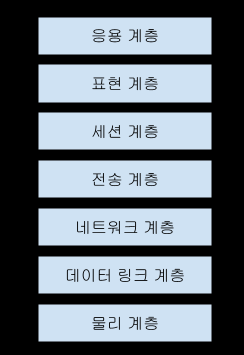

## OSI 7 Layer

OSI(Open System Interconnection Reference Model)
- 국제 표준화기구(ISO)에서 개발한 모델
- 컴퓨터 네트워크 소프트웨어의 개발을 돕기 위해서 7계층으로 나누어 정의한 명세서

## 물리 계층(Physical Layer)

전기적, 기계적, 기능적인 특성을 이용해서 통신 케이블로 데이터를 전송하게 된다.
- 사용되는 통신 단위 : 비트(0 - off, 1 - on)
- 데이터를 전기 신호로 변환하여 전송만 한다.

장비
- 통신케이블(통축케이블, 광섬유)
- 리피터
- 허브
- 모뎀
  
## 데이터 링크 계층(Data Link Layer)

물리 계층을 통해 송수신되는 정보의 오류와 흐름을 관리하여 안전한 정보의 전달을 수행할 수 있도록 도와주는 계충
- 오류를 검출하여 재전송
- 네트워크 장비(NIC 카드)들이 통신하기 위해서는 서로의 물리적 이름(MAC Address)을 알고 있어야 한다.
  - NIC(Network Interface Controller)
    - 컴퓨터를 네트워크에 연결하여 통신하기 위해 사용하는 하드웨어 장치
    - 사용자들이 케이블을 연결하거나 무선으로 연결하여 네트워크에 접속할 수 있게된다.
    - 네트워크 카드, 랜 카드, 물리 네트워크 인터페이스라고 한다.
- NIC는 출시될 떄 MAC Address를 할당하는데, 이 MAC Address를 이용해서 원하는 NIC로 데이터를 전송할 수 있다.
- 전송되는 단위 : 프레임

장비
- 브리지
- 스위치

## 네트워크 계층(Network Layer)

데이터를 목적지까지 가장 안전하고 빠르게 전달할 수 있도록 도와주는 계층(라우팅)
- 여러 개의 노드를 거칠 때마다 경로를 찾아준다.

장비
- 라우터

### IP 계층(IP Layer)

IP 패킷의 전달 및 라우팅을 담당하는 계층
- OSI 7계층 모델의 관점에서 보면 IP 계층은 네트워크 계층에 해당
- 하위계층인 데이터 링크 계층의 하드웨어적인 특성에 관계없이 독립적인 역할을 수행한다.

### IP 프로토콜

패킷 데이터들을 최대한 빨리 목적지까지 전송되게 하는 프로토콜
- 속도는 빠르지만, 에러제어나 흐름제어 기능이 없다.
- IP 패킷 헤더 내 수신 및 발신 주소를 포함하고 있다.
- 신뢰성을 확보하기 위해서는 IP 계층 위의 TCP와 같은 상위 계층에 의존해야 한다.

## 전송 계층(Transport Layer)

통신을 활성하하기 위한 계층
- 주로 TCP 프로토콜 사용
- 포트를 열어서 응용 프로그램들이 전송을 할 수 있게 한다.
- 신뢰성있는 데이터 송수신을 보장한다
  - 패킷들의 전송이 유효한지 확인하고 전송 실패한 패킷들을 재전송한다.
  - 순서가 맞지 않으면 전송 패킷들을 순서에 맞게 재조합한다.

### TCP 프로토콜

신뢰성 있는 연결지향성 서비스를 제공
- OSI 계층모델의 관점에서 전송 계층에 해당
- 연결지향적, 신뢰성 있음

### UDP 프로토콜

신뢰성이 낮은 프로토콜로써 데이터 전송의 완전성을 보장하지 않지만, 유연하며 효율적인 데이터 전송에 사용
- 비연결성, 신뢰성이 없음, 순서화되지 않은 Datagram 서비스 제공
- 실시간 멀티미디어에 적합
- 헤더 단순함

## 세션 계층(Session Layer)

데이터가 통신하기 위한 논리적인 연결을 하는 계층
- 4계층에서도 연결을 맺고 종료할 수 있으므로, 세션 계층은 전송 계층과 무관하게 응용 프로그램 관점에서 봐야 한다.
- 세션 설정, 유지, 종료, 전송 중단시 복구 등의 기능
- TCP/IP 세션을 만들고 없애는 책임을 진다.
- 통신하는 사용자들을 동기화하고 오류복구 명령들을 일괄적으로 다룬다.
- 통신을 하기 위한 세션을 확립/유지/중단(운영체제가 해준다.)

> 세션: 네트워크 상에서 양 종단간의 일회용 논리적 연결

## 표현 계층(Presentation Layer)

데이터 표현이 상이한 응용 프로세스의 독립성을 제공하고, 암호화하는 계층
- 코드 간의 번역을 담당하여 사용자 시스템에서 데이터의 형식상차이를 다루는 부담을 응용 계층으로부터 덜어 준다.
- 해당 데이터가 TEXT인지, 그림인지, GIF인지 등을 구분

## 응용 계층(Application Layer)

응용 프로세스와 직접 관계하여 일반적인 응용 서비스를 수행
- 통신 패킷들은 HTTP, FTP 등의 프로토콜에 의해 모두 처리되며, 일반적인 브라우저나 프로그램들은 프로토콜을 보다 쉽게 사용하게 해주는 응용 프로그램이다.
  - 모든 통신의 양 끝단은 HTTP와 같은 프로토콜이지 응용 프로그램이 아니다.

### HTTP 프로토콜

웹 서버 및 웹 브라우저 간의 데이터 전송을 위한 응욫계층 프로토콜

## 참고

https://ko.wikipedia.org/wiki/%EB%84%A4%ED%8A%B8%EC%9B%8C%ED%81%AC_%EC%9D%B8%ED%84%B0%ED%8E%98%EC%9D%B4%EC%8A%A4_%EC%BB%A8%ED%8A%B8%EB%A1%A4%EB%9F%AC

https://shlee0882.tistory.com/110

http://www.ktword.co.kr/test/view/view.php?m_temp1=465