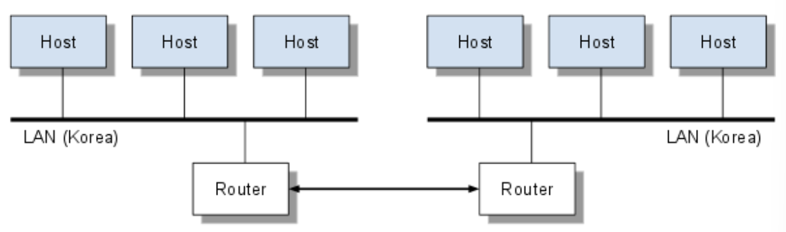

## TCP/IP

통상 IP 프로토콜 위에 TCP 프로토콜이 놓이게 되므로 TCP/IP라고 부른다.

IP

- 패킷 데이터를 최대한 빨리 목적지까지 전달하게 해주는 프로토콜
- 4바이트로 이루어진 주소번호를 사용하여 각각의 node를 구분
- 숫자로된 인터넷 주소를 사람이 식별하는 것은 쉽지 않기 때문에 IP 주소를 인간이 식별하기 쉬운 Domain으로 변환해주는 **DNS**(Domain Name Service)를 사용한다.

TCP

- 서버와 클라이언트간에 데이터를 신뢰성있게 전달하기 위해 만들어진 프로토콜
- 데이터 전달 과정에서 데이터의 유실이나 손실이 있다면 이를 교정하고순서를 재조합할 수 있도록 해준다.
- 기능
  - 패킷이 빠졌을 경우, 재전송을 요청
  - 패킷에 일려번호를 부여하여, 순서가 뒤바뀌면 순서를 재조합하는 기능

## LAN과 WAN

LAN(Loca Area Network)

- 근거리 통신망

WAN(Wide Area Network)

- 원거리 통신망

## UDP와 TCP

UDP(User Datagram Protocol)

- 단순히 데이터를 받거나 던져주기만하는 프로토콜
- 비연결지향
- 오류 처리나 순서 재조합 기능 **없다**.
- 실시간 멀티미디어 정보를 처리하기 위해서 주로 사용
  - 중간에 패킷이 소실되더라도개의치 않고 다음 패킷을 받아들이므로 실시간 메시지 처리가 가능하다.
  - TCP로 실시간 데이터를 전송한다면 중간에 오류가 있을 경우 실시간 데이터를 처음부터 다시 보내거나 종료시켜버릴 수도 있기 때문에, UDP가 더 적절하다.

## TCP/IP를 이용한 컴퓨터간 데이터 통신 방법

각 컴퓨터를 연결해주는 이더넷 카드를 통해 어떻게 TCP/IP 메시지가 전달될까?

- **OSI7**에 대한 이해가 필요
-
