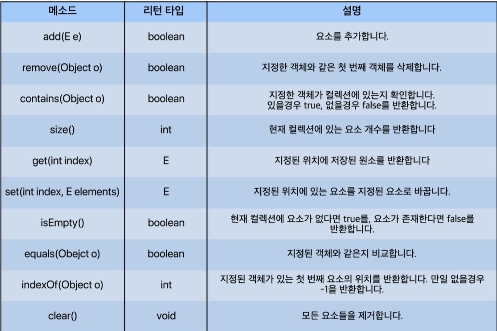

# 배열 vs List

## 공통점, 차이점

공통점

- 동일한 특성의 데이터를 묶는다.
- 반복문 내에 변수를 이용하여 하나의 묶음 데이터들을 모두 접근할 수 있다.

차이점(배열)

- 처음 선언한 배열의 크기는 변경할 수 없다.
  - 정적 할당(static allocation)
- 메모리에 연속적으로 나열되어 할당된다.
- 어떤 index의 데이터를 삭제하면 그 index는 빈공간이 된다.

차이점(리스트)

- 리스트의 길이가 가변적
  - 동적 할당(dynamic allocation)
- 데이터들이 연속적으로 나열된다.
  - 메모리에 연속적으로 나열되지 않고 각 데이터들이 주소(reference)로 연결되어 있다.
- 데이터 사이에  빈 공간이 없다.

## 장단점

배열의 장단점

- 장점
  - 데이터 크기가 정해져 있어서 메모리 관리가 편리하다.
  - 메모리에 연속적으로 나열되어 있어서 index를 통한 색인(검색)이 빠르다.
- 단점
  - 배열의 크기를 변경할 수 없다.
  - 빈 공간을 허용하지 않기 때문에, 중간 요소의 삽입, 삭제가 매우 느리다.

리스트의 장단점

- 장점
  - 데이터의 크기에 따라 메모리를 동적으로 할당하기 때문에 메모리 관리가 편리하다.
  - 빈 공간을 허용하지 않기 때문에 메모리 관리가 편리하다.
  - 데이터의 삽입, 삭제가 편리하다.
    - 주소로 각 데이터들이 연결되어 있기 때문
- 단점
  - 객체로 데이터를 다루기 때문에 적은 양의 데이터의 경우 배열보다 차지하는 메모리가 크다.
  - 기본적으로 주소를 기반으로 구성되어 있고, 메모리에 순차적으로 할당하는 것이 아니기 때문에 색인(검색)능력이 비교적 떨어진다.

## List Interface에 선언된 대표적인 메소드



```java
/*
     자바 List Interface
     이 List Interface는 ArrayList, SinglyLinkedList, DoublyLinkedList에 의해 구현된다.
 */

public interface List<E> {

     boolean add(E value);
     /*
          리스트에 요소를 추가한다.
          @param value - 리스트에 추가할 요소
          @return - 리스트에 중복되는 요소가 있을 경우 false를 반환하고, 없을 경우 true를 반환한다.
      */

     void add(int index, E value);
     /*
          리스트의 index위치에 value를 추가한다.
          특정 위치 및 이후의 요소들은 한 칸씩 뒤로 밀려난다.
          @param index - 리스트의 위치
          @param value - 추가할 데이터
      */

     E remove(int index);
     /*
          리스트의 index 위치에 있는 요소를 삭제한다.
          @param index - 리스트에서 삭제할 요소의 위치
          @return - 삭제된 요소를 반환
      */

     boolean remove(Object value);
     /*
          리스트의 요소 중 value를 삭제한다. 값이 value인 요소가 여러 개일 경우, 가장
          처음 발견한 요소 하나만 삭제한다.
          @param value - 리스트에서 삭제할 요소
          @return - 리스트에서 삭제할 요소가 없거나 삭제에 실패할 경우 false를 반환,
          삭제에 성공헀을 경우 true를 반환한다.
      */

     E get(int index);
     /*
          리스트의 index 위치에 있는 요소를 반환한다.
          @param index - 리스트의 위치
          @return - 리스트의 index 위치에 있는 요소를 반환한다.
      */

     void set(int index, E value);
     /*
          리스트의 index 위치에 있는 값을 value로 대체한다.
          @param index - 리스트의 위치
          @return - 새로 대체한 변수(value)
      */

     boolean contains(Object value);
     /*
          리스트의 요소 중 value가 있는지 확인한다.
          @param value - 리스트에서 찾을 변수
          @return - 리스트의 요소 중 value가 있을 경우 true를 반환, 없을 경우
          false를 반환한다.
      */

     int indexOf(Object value);
     /*
          리스트의 요소 중 값이 value인 요소의 위치를 반환한다.
          @param value - 리스트에서 찾을 변수
          @return - 리스트의 요소 중 값이 value인 요소의 위치를 반환, 요소 중에
          value가 없다면 -1을 반환한다.
      */

     int size();
     /*
          리스트 요소의 개수를 반환한다.
          @return - 리스트의 요소 개수를 반환한다.
      */

     boolean isEmpty();
     /*
          리스트가 비어있는지를 확인한다.
          @return - 리스트에 요소가 없을 경우 true를 반환, 요소가 있을 경우 false를 반환
      */

     public void clear();
     /*
          리스트의 모든 요소를 삭제한다.
      */
}
```