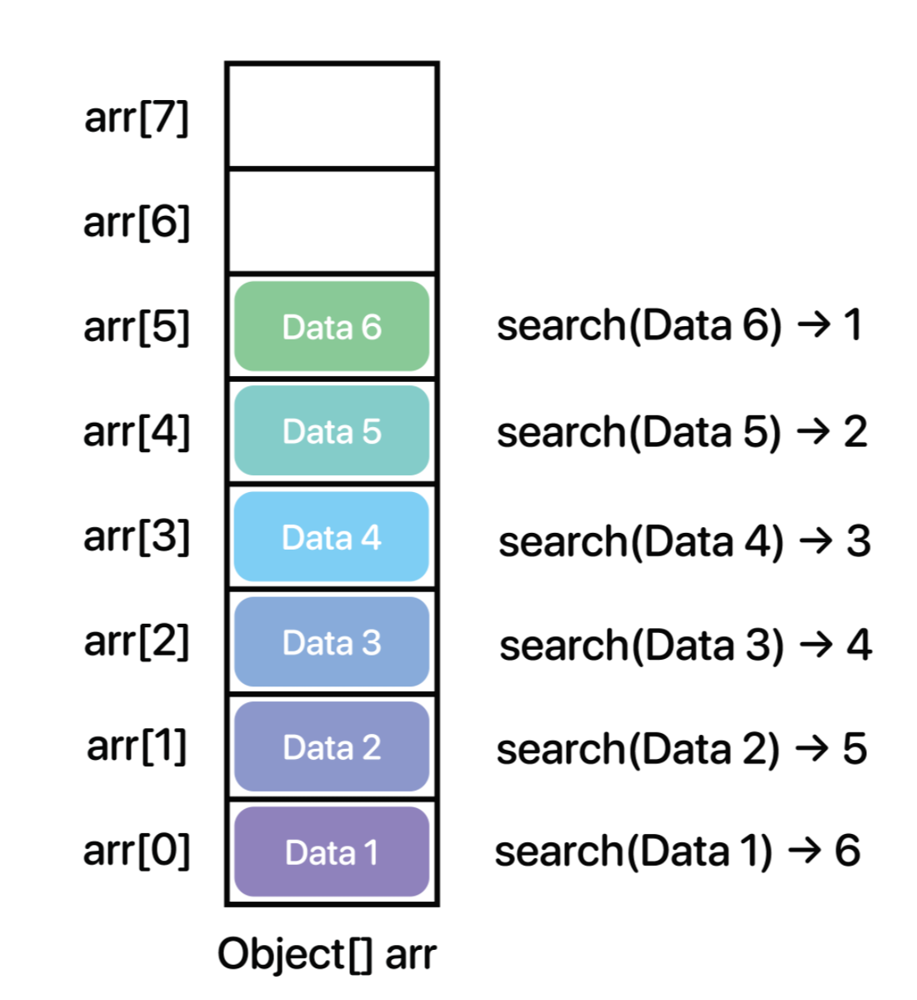

- [Stack](#stack)
- [Stack 클래스 및 생성자 구성하기](#stack-클래스-및-생성자-구성하기)
- [동적할당을 위한 resize 메소드 구현](#동적할당을-위한-resize-메소드-구현)
- [push 메소드 구현](#push-메소드-구현)
- [pop 메소드 구현](#pop-메소드-구현)
- [peek() 메소드 구현](#peek-메소드-구현)
- [search(Object o) 메소드](#searchobject-o-메소드)
- [size() 메소드](#size-메소드)
- [clear() 메소드](#clear-메소드)
- [empty() 메소드](#empty-메소드)
- [clone() 메소드](#clone-메소드)
- [toArray() 메소드](#toarray-메소드)
- [전체 코드](#전체-코드)
- [참고](#참고)

## Stack

자바에서 제공하는 Stack 라이브러리는 Vector 클래스를 상속받아 구현하고 있다.

Stack 클래스는 내부에서 최상위 타입 배열인 Object[] 배열을 사용하여 데이터들을 관리하고 있다.

Stack의 대표적인 변수

- Bottom
  - 가장 밑에 있는 데이터 또는 그 데이터의 인덱스
- Top
  - 가장 위에 있는 데이터 또는 그 데이터의 인덱스
- Capacity
  - 데이터를 담기 위한 용적
- size
  - 데이터의 개수

## Stack 클래스 및 생성자 구성하기

```java
public class MyStack<E> implements MyStackInterface<E>, Cloneable, Iterable<E> {

  private static final int MAX_ARRAY_SIZE = Integer.MAX_VALUE - 8;

  private static final int DEFAULT_CAPACITY = 10; // 최소(기본) 용적 크기
  private static final Object[] EMPTY_ARRAY = {}; // 요소 개수

  private Object[] array; // 요소를 담을 배열
  private int size; // 요소 개수

  public MyStack() {
    this.array = EMPTY_ARRAY;
    this.size = 0;
  }

  public MyStack(int capacity) {
    if (capacity < 0) {
      throw new IllegalArgumentException();
    }
    if (capacity == 0) {
      array = EMPTY_ARRAY;
    } else {
      array = new Object[capacity];
    }
    this.size = 0;
  }
```

- DEFAULT_CAPACITY
  - 배열이 생성될 때의 최초 할당 크기
  - 상수로 쓸 것이기 때문에 static final 키워드를 붙인다.
- EMPTY_ARRAY
  - 아무것도 없는 빈 배열
  - 상수로 쓸 것이기 때문에 static final 키워드를 붙인다.
- array
  - 요소들을 담을 배열
- size
  - 배열에 담긴 요소의 개수
  - **용적의 크기가 아니다**

- 초기 용적의 크기를 할당하고 싶을 때와 하고 싶지 않을 떄를 나눠서 생성자를 구현했다.

## 동적할당을 위한 resize 메소드 구현

들어오는 데이터의 개수에 따라 '최적화'된 용적을 가질 필요가 있다.

- 데이터가 적은데 용적이 크면 메모리 낭비
- 용적은 적은데 데이터가 많으면 메모리 부족
- 이러한 이유 떄문에 적절한 크기로 용적을 계속 변경해줘야 한다.
- 용적은 외부에서 마음대로 접근하면 데이터의 손상을 야기할 수 있기 때문에 private으로 접근을 제한해야 한다.

```java
  private void resize() {
    if (Arrays.equals(array, EMPTY_ARRAY)) {
      array = new Object[DEFAULT_CAPACITY];
      return;
    }

    int arrayCapacity = array.length;

    if (size == arrayCapacity) {
      //default growing 1.5x
      int newSize = hugeRangeCheck(arrayCapacity, arrayCapacity + arrayCapacity << 1);
      array = Arrays.copyOf(array, newSize);
      return;
    }

    if (size < (arrayCapacity / 2)) {
      int newCapacity = (arrayCapacity / 2);
      array = Arrays.copyOf(array, Math.max(DEFAULT_CAPACITY, newCapacity));
      return;
    }
  }

  private int hugeRangeCheck(int oldCapacity, int newCapacity) {
    if (MAX_ARRAY_SIZE - size <= 0) {
      throw new OutOfMemoryError("Required stack size too large");
    }
    if (newCapacity >= 0) {
      if (newCapacity - MAX_ARRAY_SIZE <= 0) {
        return newCapacity;
      }
      return MAX_ARRAY_SIZE;
    } else {
      int fiveFourtheSize = oldCapacity + (oldCapacity >>> 2);
      if (fiveFourtheSize <= 0 || fiveFourtheSize >= MAX_ARRAY_SIZE) {
        return MAX_ARRAY_SIZE;
      }
      return fiveFourtheSize;
    }
  }
```

- 조건문 1: `if (Arrays.equals(array, EMPTY_ARRAY))`
  - 사용자가 생성자에서 용적을 별도로 설정하지 않은 경우 `EMPTY_ARRAY`로 초기화되어 있기 때문에 용적이 0인 상태이므로, 최소 용적인 `DEFAULT_CAPACITY`의 크기만큼 배열을 생성해주고 메소드를 종료한다.
- 조건문 2: `if (size == arrayCapacity)`
  - 데이터가 꽉 찰 경우에는 용적을 늘려줘야 한다.
    - `hugeRangeCheck` 메소드를 사용해서 5/4만큼 늘려준다.
    - 크기를 늘린 다음에 `Arrays.copyOf()`메소드를 활용하여 원래 있던 배열을 복사하고 반환한다.
- 조건문 3: `if (size < (arrayCapacity / 2))`
  - 데이터가 용적의 절반 미만일 경우
  - 용적을 절반으로 줄이고, 배열을 복사해 반환한다.
    - 최소 용적으로 설정한 `DEFAULT_CAPACITY`보다 아래로는 떨어지지 않도록 하기 위해 새로운 용적과 최소 용적 중 큰 것을 새로운 용적으로 설정하도록 한다.

## push 메소드 구현

Stack의 push는 데이터를 최상단에만 추가할 수 있으므로 한 종류밖에 없다.

- push(E item)
- 물론 자바에 내장되어 있는 Stack에서는 Vector를 상속받고 있기 때문에 중간 삽입같은 특정 위치 삽입도 가능하다.

```java
  @Override
  public E push(E item) {
    if (size == array.length) {
      resize();
    }
    array[size] = item;
    size++;

    return item;
  }
```

- 용적이 가득 찼다면 resize()호출

## pop 메소드 구현

pop은 push 메소드 메커니즘을 반대로 구현하면 된다.

- 스택이 비어있는 경우에 pop을 하면 안되므로 EmptyStackException을 던진다.

```java
  @SuppressWarnings("unchecked")
  @Override
  public E pop() {
    if (size == 0) {
      throw new EmptyStackException();
    }
    E obj = (E) array[size - 1];
    array[size - 1] = null;
    size--;
    resize();

    return obj;
  }
```

- `@SuppressWarnings("unchecked")`
  - 이 어노테이션을 붙이지 않으면 type safe(타입 안정성)에 대해 경고를 보낸다.
  - 반환되는 것을 보면 E 타입으로 캐스팅을 하고 있고 그 대상이 되는 것은 Object[] 배열의 Object 데이터다.
    - Object -> E 타입으로의 변환을 하는 과정에서 변환할 수 없는 타입이 있을 가능성이 있다는 경고 메세지를 뜨게 하는 것
    - 하지만 push로 받아들이는 데이터 타입은 E 타입밖에 없으므로 형 안정성이 보장된다.
      - ClassCastException이 뜨지 않으니 경고 메시지를 없애도 되는 것이다.

## peek() 메소드 구현

스택의 가장 상단에 있는 데이터를 확인할 수 있는 메소드이다.

- 스택에 데이터가 없는 경우를 생각하여 예외를 던져준다.

```java
  @SuppressWarnings("unchecked")
  @Override
  public E peek() {
    if (size == 0) {
      throw new EmptyStackException();
    }
    return (E) array[size - 1];
  }
```

- 원소를 반환해야 하는 Object 타입을 E 타입으로 캐스팅해주기 때문에 경고창이 뜬다.
  - `@SuppressWarnings("unchecked")`로 경고를 무시해도 된다.
    - 어차피 push() 메소드로 들어오는 값이 E 타입 뿐이기 때문에 괜찮은 것

## search(Object o) 메소드

찾으려는 데이터가 상단의 데이터로부터 얼마만큼 떨어져 있는지에 대한 상대적 위치 값이다.



- 출처: <https://st-lab.tistory.com/174>
- 수식으로 표현하자면 size - index 값이 되겠다.

```java
@Override
  public int search(Object value) {

    if (value == null) {
      for (int idx = size - 1; idx >= 0; idx--) {
        if (array[idx] == null) {
          return size - idx;
        }
      }
    } else {
      for (int idx = size - 1; idx >= 0; idx--) {
        if (array[idx].equals(value)) {
          return size - idx;
        }
      }
    }
    return -1;
  }
```

## size() 메소드

```java
  @Override
  public int size() {
    return size;
  }
```

- 현재 스택에 있는 요소의 개수를 반환한다.

## clear() 메소드

```java
  @Override
  public void clear() {
    for (int i = 0; i < size; i++) {
      array[i] = null;
    }
    size = 0;
    resize();
  }
```

- 스택에 있는 모든 요소들을 지워버리는 메소드
- 현재 용적량의 기대치에 근접할 가능성이 높기 때문에 일단은 용적량을 일단 절반으로만 줄이는 것
- 모든 배열을 명시적으로 null 처리하는 것이 좋다.

## empty() 메소드

```java
  @Override
  public boolean empty() {
    return size == 0;
  }
```

- 스택이 비어있는지 확인하는 메소드

## clone() 메소드

사용자가 사용하고 있던 Stack을 새로 하나 복제하고 싶을 때 쓰는 메소드

```java
  @Override
  public Object clone() throws CloneNotSupportedException {
    MyStack<?> cloneStack = (MyStack<?>) super.clone();

    cloneStack.array = new Object[size];
    System.arraycopy(array, 0, cloneStack.array, 0, size);
    return cloneStack;
  }
```

- 얕은 복사가 아닌 깊은 복사로 아예 다른 하나의 클론을 만드는 것
  - 얕은 복사는 데이터와 주소까지 같아져버리므로 데이터만 같아지게 하는 깊은 복사를 한다.

## toArray() 메소드

```java
  public Object[] toArray() {
    return Arrays.copyOf(array, size);
  }

  @SuppressWarnings("unchecked")
  public <T> T[] toArray(T[] a) {
    if (a.length < size) {
      return (T[]) Arrays.copyOf(array, size, a.getClass());
    }
    System.arraycopy(array, 0, a, 0, size);
    return a;
  }
```

toArray()는 두 가지가 있다.

- Object[] toArray()
  - 아무런 인자 없이 현재 Stack의 리스트를 객체배열(Object[])로 반환
- T[] toArray(T[] a)
  - 상위 타입으로 들어오는 객체에 대한 데이터를 담을 수 있도록 별도의 제네릭메소드를 구성한 것

## 전체 코드

```java
package _2_Stack;

import java.util.Arrays;
import java.util.Comparator;
import java.util.EmptyStackException;
import java.util.Iterator;
import java.util.NoSuchElementException;
import my_interface.MyStackInterface;

/**
 * @param <E> the type of elements in this Stack
 */
public class MyStack<E> implements MyStackInterface<E>, Cloneable, Iterable<E> {

  /**
   * The maximum length of array to allocate. 확장 가능한 용적의 한계값이다. Java에서 인덱스는 int 정수로 인덱싱한다. 이론적으로는
   * Integer.MAX_VALUE(2^31 -1) 의 인덱스를 갖을 수 있지만, VM에 따라 배열 크기 제한이 상이하며, 제한 값을 초과할 경우 다음과 같은 에러가
   * 발생한다.
   * <p>
   * "java.lang.OutOfMemoryError: Requested array size exceeds VM limit"
   * <p>
   * 위와 같은 이유로 안정성을 위해 이론적으로 가능한 최댓값에 8을 뺀 값으로 지정하고 있습니다.
   */
  private static final int MAX_ARRAY_SIZE = Integer.MAX_VALUE - 8;

  private static final int DEFAULT_CAPACITY = 10; // 최소(기본) 용적 크기
  private static final Object[] EMPTY_ARRAY = {}; // 요소 개수

  private Object[] array; // 요소를 담을 배열
  private int size; // 요소 개수

  public MyStack() {
    this.array = EMPTY_ARRAY;
    this.size = 0;
  }

  public MyStack(int capacity) {
    if (capacity < 0) {
      throw new IllegalArgumentException();
    }
    if (capacity == 0) {
      array = EMPTY_ARRAY;
    } else {
      array = new Object[capacity];
    }
    this.size = 0;
  }

  private void resize() {

    if (Arrays.equals(array, EMPTY_ARRAY)) {
      array = new Object[DEFAULT_CAPACITY];
      return;
    }

    int arrayCapacity = array.length;

    if (size == arrayCapacity) {
      //default growing 1.5x
      int newSize = hugeRangeCheck(arrayCapacity, arrayCapacity + arrayCapacity << 1);
      array = Arrays.copyOf(array, newSize);
      return;
    }

    if (size < (arrayCapacity / 2)) {
      int newCapacity = (arrayCapacity / 2);
      array = Arrays.copyOf(array, Math.max(DEFAULT_CAPACITY, newCapacity));
      return;
    }
  }

  /**
   * resizing할 때 overflow를 방지하기 위한 체크 함수이다. 용적은 MAX_ARRAY_SIZE를 초과할 수 없다.
   *
   * @param oldCapacity resize 하기 전의 용적
   * @param newCapacity resize 하고자 하는 용적
   * @return 최종 크기 반환
   */
  private int hugeRangeCheck(int oldCapacity, int newCapacity) {
    if (MAX_ARRAY_SIZE - size <= 0) {
      throw new OutOfMemoryError("Required stack size too large");
    }
    if (newCapacity >= 0) {
      if (newCapacity - MAX_ARRAY_SIZE <= 0) {
        return newCapacity;
      }
      return MAX_ARRAY_SIZE;
    } else {
      int fiveFourtheSize = oldCapacity + (oldCapacity >>> 2);
      if (fiveFourtheSize <= 0 || fiveFourtheSize >= MAX_ARRAY_SIZE) {
        return MAX_ARRAY_SIZE;
      }
      return fiveFourtheSize;
    }
  }

  @Override
  public E push(E item) {
    if (size == array.length) {
      resize();
    }
    array[size] = item;
    size++;

    return item;
  }

  @SuppressWarnings("unchecked")
  @Override
  public E pop() {
    if (size == 0) {
      throw new EmptyStackException();
    }
    E obj = (E) array[size - 1];
    array[size - 1] = null;
    size--;
    resize();

    return obj;
  }

  @SuppressWarnings("unchecked")
  @Override
  public E peek() {
    if (size == 0) {
      throw new EmptyStackException();
    }
    return (E) array[size - 1];
  }

  @Override
  public int search(Object value) {

    if (value == null) {
      for (int idx = size - 1; idx >= 0; idx--) {
        if (array[idx] == null) {
          return size - idx;
        }
      }
    } else {
      for (int idx = size - 1; idx >= 0; idx--) {
        if (array[idx].equals(value)) {
          return size - idx;
        }
      }
    }
    return -1;
  }

  @Override
  public int size() {
    return size;
  }

  @Override
  public void clear() {
    for (int i = 0; i < size; i++) {
      array[i] = null;
    }
    size = 0;
    resize();
  }

  @Override
  public boolean empty() {
    return size == 0;
  }

  @Override
  public Object clone() throws CloneNotSupportedException {
    MyStack<?> cloneStack = (MyStack<?>) super.clone();

    cloneStack.array = new Object[size];
    System.arraycopy(array, 0, cloneStack.array, 0, size);
    return cloneStack;
  }

  public Object[] toArray() {
    return Arrays.copyOf(array, size);
  }

  @SuppressWarnings("unchecked")
  public <T> T[] toArray(T[] a) {
    if (a.length < size) {
      return (T[]) Arrays.copyOf(array, size, a.getClass());
    }
    System.arraycopy(array, 0, a, 0, size);
    return a;
  }

  public void sort() {
    sort();
  }

  @SuppressWarnings("unchecked")
  public void sort(Comparator<? super E> c) {
    Arrays.sort((E[]) array, 0, size, c);
  }

  @Override
  public Iterator<E> iterator() {
    return new Iter();
  }

  private class Iter implements Iterator<E> {

    private int now = 0;

    @Override
    public boolean hasNext() {
      return now < size;
    }

    @SuppressWarnings("unchecked")
    @Override
    public E next() {
      int cs = now;
      if (cs >= size) {
        throw new NoSuchElementException();
      }
      Object[] data = MyStack.this.array;
      now = cs + 1;
      return (E) data[cs];
    }

    @Override
    public void remove() {
      throw new UnsupportedOperationException();
    }
  }
}
```

## 참고

<https://st-lab.tistory.com/174>
