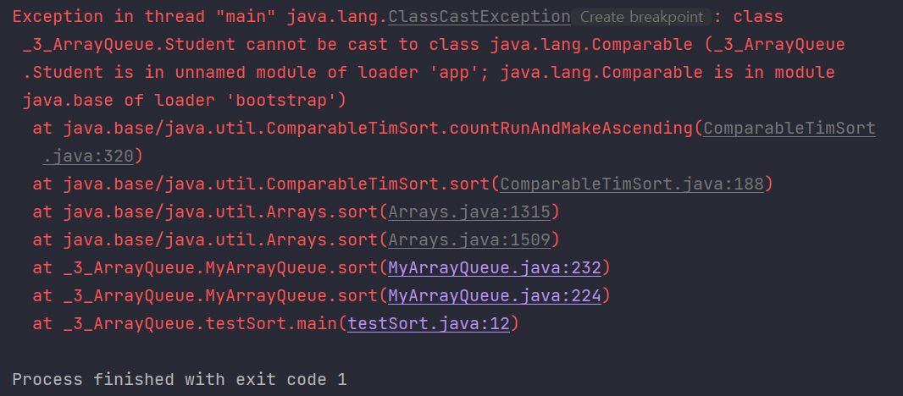
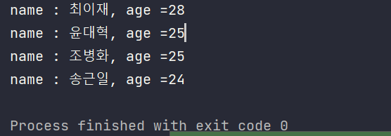

- [Queue](#queue)
- [Array Queue 구현](#array-queue-구현)
  - [Queue 클래스 및 생성자 구성하기](#queue-클래스-및-생성자-구성하기)
  - [동적할당을 위한 resize() 메소드 구현](#동적할당을-위한-resize-메소드-구현)
  - [offer 메소드 구현](#offer-메소드-구현)
  - [poll 메소드 구현](#poll-메소드-구현)
  - [remove() 메소드](#remove-메소드)
  - [peek() 메소드](#peek-메소드)
  - [element() 메소드](#element-메소드)
  - [size() 메소드](#size-메소드)
  - [isEmpty() 메소드](#isempty-메소드)
  - [contains() 메소드](#contains-메소드)
  - [clear() 메소드](#clear-메소드)
  - [toArray() 메소드](#toarray-메소드)
  - [clone() 메소드](#clone-메소드)
  - [sort() 메소드](#sort-메소드)
    - [sort() 메소드 예시](#sort-메소드-예시)

# Queue

Queue

- 대기열
- FIFO
- 인터페이스
  - 구현하는 클래스
    - PriorityQueue
      - 우선순위 큐
    - ArrayDeque
      - 배열 양방향 큐
    - LinkedList
      - 연결리스트

Queue Interface에 선언할 메소드

|메소드|리턴 타입|설명|
|:--:|:--:|:--:|
|offer(E e)|boolean|큐의 마지막에 요소를 추가한다.|
|poll()|E|큐의 첫 번째 요소를 제거하고, 제거된 요소를 반환한다.|
|peek()|E|큐의 첫 번째 요소를 제거하지 않고 반환한다.|

# Array Queue 구현

## Queue 클래스 및 생성자 구성하기

```java
public class MyArrayQueue<E> implements MyQueueInterface<E>, Cloneable, Iterable<E> {

    private static final int MAX_ARRAY_SIZE = Integer.MAX_VALUE - 8;

    private static final int DEFAULT_CAPACITY = 64;

    private Object[] array; // 요소를 담을 배열
    private int size; //요소 개수
    private int front; // 시작 인덱스를 가리키는 변수(빈 공간임)
    private int rear; // 마지막 요소의 인덱스를 가리키는 변수

    // 생성자1 (초기 용적 할당을 안할 경우)
    public MyArrayQueue() {
        this.array = new Object[DEFAULT_CAPACITY];
        this.size = 0;
        this.front = 0;
        this.rear = 0;
    }

    // 생성자2 (초기 용적 할당을 할 경우)
    public MyArrayQueue(int capacity) {
        if (capacity < 0) {
            throw new IllegalArgumentException();
        }
        this.array = new Object[capacity];
        this.size = 0;
        this.front = 0;
        this.rear = 0;
    }
```

- DEFAULT_CAPACITY
  - 배열이 생성될 때의 최초 할당 크기(용적)이자 최소 할당 용적 변수
- array
  - 요소들을 담을 배열
- size
  - 배열에 담긴 요소의 개수
  - 용적 크기가 아니다.
- front
  - 시작 위치를 가리키는 변수
  - 항상 빈 공간을 가리키고 있다.
- rear
  - 마지막 요소의 위치를 가리키는 변수

## 동적할당을 위한 resize() 메소드 구현

최적화된 용적을 위한 메소드이다.

- 용적이 데이터에 비해 너무 크면 줄이고, 작으면 크게 만드는 것

```java
    private void resize(int newCapacity) {
        int arrayCapacity = array.length;
        newCapacity = hugeRangeCheck(arrayCapacity, newCapacity);
        Object[] newArray = new Object[newCapacity];


        for (int i = 1, j = front + 1; i <= size; i++, j++) {
            newArray[i] = array[j % arrayCapacity];
        }

        this.array = newArray;
        this.front = 0;
        this.rear = this.size;
    }

    private int hugeRangeCheck(int oldCapacity, int newCapacity) {
        if (MAX_ARRAY_SIZE - size <= 0) {
            throw new OutOfMemoryError("Required queue length large");
        }

        if (newCapacity >= 0) {
            if (newCapacity - MAX_ARRAY_SIZE <= 0) {
                return newCapacity;
            }
            return MAX_ARRAY_SIZE;
        } else {
            int fiveFourthsSize = oldCapacity + (oldCapacity >>> 2);
            if (fiveFourthsSize <= 0 || fiveFourthsSize >= MAX_ARRAY_SIZE) {
                return MAX_ARRAY_SIZE;
            }
            return fiveFourthsSize;
        }
    }
```

- for문에서 기존 배열의 길이를 나누는 이유는 front가 rear보다 작을 경우를 고려해야 하기 때문이다.
  - 예)
    - rear가 7이고, front가 0이라면 7 + 1 = 8이므로, 0과 같지 않다. 그렇기 때문에 길이(8)로 나눠준 나머지 (7 + 1) & 8 = 0을 해야 정확한 조건 때 용적을 증가시킬 수 있다.
- `hugeRangeCheck`
  - 새로 적용하려는 용적의 크기가 알맞은지 확인하는 메소드

## offer 메소드 구현

Queue의 offer는 항상 후방에 데이터를 추가해야하므로 한 종류밖에 없다.

- 고려해야 할 부분
  - 배열의 마지막 인덱스에 도달했을 경우
  - 배열이 꽉 차있을 경우

```java
    @Override
    public boolean offer(E item) {
        int oldCapacity = array.length;
        if ((rear + 1) % oldCapacity == front) {
            resize(oldCapacity + (oldCapacity << 1));
        }
        rear = (rear + 1) % array.length;

        array[rear] = item;
        size++;

        return true;
    }
```

- 용적 크기를 체크하고 문제가 없다면 rear + 1을 한 부분에 요소를 추가한다.

## poll 메소드 구현

front + 1 위치에 있는 요소를 삭제하면 된다.

- remove()의 경우에는 삭제할 요소가 없으면 NoSuchElementException() 예외를 던진다.
- poll()의 경우는 삭제할 요소가 없다면 null을 반환한다.

```java
@SuppressWarnings("unchecked")
    public E poll() {

        if (size == 0) {
            return null;
        }
        front = (front + 1) % array.length;

        E item = (E) array[front];
        array[front] = null;
        size--;

        if (array.length > DEFAULT_CAPACITY && (size < array.length / 4)) {
            resize(Math.max(DEFAULT_CAPACITY, array.length / 2));
        }
        return item;
    }
```

## remove() 메소드

```java
    public E remove() {

        E item = poll();

        if (item == null) {
            throw new NoSuchElementException();
        }
        return item;
    }
```

- remove() 메소드는 poll()을 호출하여 null일 경우에만 예외를 던지면 된다.

## peek() 메소드

```java
    @Override
    @SuppressWarnings("unchecked")
    public E peek() {
        if (size == 0) {
            return null;
        }

        E item = (E) array[(front + 1) % array.length];
        return item;
    }
```

- peek() 메소드는 반환할 요소가 없다면 null을 반환하고, 있다면 front + 1 위치에 있는 요소를 반환한다.

## element() 메소드

```java
    public E element() {
        E item = peek();
        if (item == null) {
            throw new NoSuchElementException();
        }
        return item;
    }
```

- 이 메소드는 peek()과 같지만, 반환할 요소가 없다면 NoSuchElementException()을 발생시킨다.

## size() 메소드

```java
    public int size() {
        return size;
    }
```

## isEmpty() 메소드

```java
    public boolean isEmpty() {
        return size == 0;
    }
```

- 요소가 없다면 true, 있다면 false를 반환한다.

## contains() 메소드

- 현재 찾고자하는 요소가 큐에 들어가있는지를 알려주는 메소드

```java
    public boolean contains(Object value) {
        if (value == null) {
            return false;
        }
        int start = (front + 1) % array.length;

        for (int i = 0, idx = start; i < size; i++, idx = (idx + 1) % array.length) {
            if (value.equals(array[idx])) {
                return true;
            }
        }
        return false;
    }
```

- 기본적으로 용적 크기에 비해 요소의 개수가 훨씬 적은 경우가 많다.
  - 요소의 개수만큼만 정확히 범위를 짚어서 반복해주는 것이 효율적

## clear() 메소드

Queue의 모든 요소를 지워버린다.

```java
    public void clear() {

        for (int i = 0; i < array.length; i++) {
            array[i] = null;
        }
        front = rear = size = 0;
    }
```

- 모든 공간을 명시적으로 null 처리한다.
- front, rear, size를 모두 0으로 만들어준다.

## toArray() 메소드

`Object[] toArray()`

- 인자 없이 현재 있는 큐의 요소들을 객체배열(Object[])로 반환

```java
public Object[] toArray() {
        return toArray(new Object[size]);
    }
```

`T[] toArray(T[] a)`

- 큐를 이미 생성된 다른 배열에 복사

```java
@SuppressWarnings("unchecked")
    public <T> T[] toArray(T[] a) {
        final T[] res;
        if (a.length < size) {
            if (front <= rear) {
                return (T[]) Arrays.copyOfRange(array, front + 1, rear + 1, a.getClass());
            }
            res = (T[]) Arrays.copyOfRange(array, 0, size, a.getClass());
            int rearLength = array.length - 1 - front;
            if (rearLength > 0) {
                System.arraycopy(array, front + 1, res, 0, rearLength);
            }
            System.arraycopy(array, 0, res, rearLength, rear + 1);
            return res;
        }

        if (front <= rear) {
            System.arraycopy(array, front + 1, a, 0, size);
        } else {
            int rearLength = array.length - 1 - front;
            if (rearLength > 0) {
                System.arraycopy(array, front + 1, a, 0, rearLength);
            }
            System.arraycopy(array, 0, a, rearLength, rear + 1);
        }
        return a;
    }
```

위 두 메소드의 차이

```java
ArrayQueue<Integer> arrayqueue = new ArrayQueue<>();
 
// get ArrayQueue to array (using toArray())
Object[] q1 = arrayqueue.toArray();
 
// get ArrayQueue to array (using toArray(T[] a)
Integer[] q2 = new Integer[10];
q2 = arrayqueue.toArray(q2);
```

## clone() 메소드

깊은 복사로 아예 다른 하나의 클론을 만드는 메소드

```java
    @Override
    public Object clone() {

        try {
            @SuppressWarnings("unchecked")
            MyArrayQueue<E> clone = (MyArrayQueue<E>) super.clone();

            clone.array = Arrays.copyOf(array, array.length);
            return clone;
        } catch (CloneNotSupportedException e) {
            throw new Error(e);
        }
    }
```

## sort() 메소드

자바의 데이터 정렬을 위한 비교기는 크기 두 가지가 있다.

- `Comparable`
  - 해당 객체의 기본 정렬 방법을 설정할 때 사용

```java
public void sort() {
	/**
	 *  Comparator를 넘겨주지 않는 경우 해당 객체의 Comparable에 구현된
	 *  정렬 방식을 사용한다.
	 *  만약 구현되어있지 않으면 cannot be cast to class java.lang.Comparable
	 *  에러가 발생한다.
	 *  만약 구현되어있을 경우 null로 파라미터를 넘기면
	 *  Arrays.sort()가 객체의 compareTo 메소드에 정의된 방식대로 정렬한다.
	 */
	sort(null);
}
```

- `Comparator`
  - 특정한 경우에 임시적으로 쓸 수 있게 정렬을 정의할 때 사용
  - 흔히 쓰는 int[] 배열, String[] 배열, Wrapper 클래스 타입 등 수많은 클래스들은 기본적으로 자체 정렬 방식을 지원하기 때문에 Comparator를 쓰지 않아도 정렬을 할 수 있다.

사용자 정의 클래스는 Comparable이나 Comparator를 구현해줘야 한다.

```java
    @SuppressWarnings("unchecked")
    public void sort(Comparator<? super E> c) {

        // null 접근 방지를 위해 toArray로 요소만 있는 배열을 얻어 이를 정렬한 뒤 덮어씌운다.
        Object[] res = toArray();
        // Arrays.sort(T[] a, int fromIndex, int toIndex, Comparator<? super T> c)
        Arrays.sort((E[]) res, 0, size, c);
        clear();
        // 정렬된 res의 원소를 array에 1부터 채운다.
        // array의 front = 0 인덱스는 비워야 하므로 1번부터 채워야 하는 것이다.
        System.arraycopy(res, 0, array, 1, res.length);
        this.rear = this.size = res.length;
    }
```

- `Comparator<? super E>`
  - 상속관계이면서 부모 클래스에서 정의된 정렬 방식을 따르는 경우도 있기에 `<? super E>`로 한 것이다.
  - 부모 관계를 고려하지 않는다면 그냥 `Comparator<E>`로 써도 된다.
- 이렇게 sort() 안에 Comparator를 파라미터로 넣어주고, 구현부에서 Arrays.sort()를  통해 정렬해주면 되는데, 이때 배열에 null이 있으면 NullPointerException이 발생하기 때문에 toArray() 메소드를 사용해서 요소들로 가득 차있는 임시 배열을 사용하여 정렬한 뒤에 복사해주는 방식을 사용한다.

### sort() 메소드 예시


Student 클래스가 Comparable을 구현하지 않았을 경우

```java
package _3_ArrayQueue;

public class testSort {

    public static void main(String[] args) {
        MyArrayQueue<Student> myQ = new MyArrayQueue<>();

        myQ.offer(new Student("윤대혁", 25));
        myQ.offer(new Student("조병화", 25));
        myQ.offer(new Student("송근일", 24));
        myQ.offer(new Student("최이재", 28));

        myQ.sort();

        for (Object obj : myQ.toArray()) {
            System.out.println(obj);
        }
    }
}

class Student {
    String name;
    int age;


    public Student(String name, int age) {
        this.name = name;
        this.age = age;
    }

    @Override
    public String toString() {
        return "name : " + name +
            ", age =" + age;
    }
}
```



위와 같이 Student 클래스에서 Comparable을 구현하지 않고 있다면 해당 객체의 정렬 방법을 모르기 때문에 에러가 터지게 된다.
- Arrays.sort()에 정렬 방법을 알려주던가, Student 클래스에 정렬 방법을 구현해야 한다.

Comparator의 구현을 통해 명시적으로 Arrays.sort()에 파라미터로 넘기는 방법

```java
package _3_ArrayQueue;

import java.util.Comparator;

public class testSort {

    public static void main(String[] args) {
        MyArrayQueue<Student> myQ = new MyArrayQueue<>();

        myQ.offer(new Student("윤대혁", 25));
        myQ.offer(new Student("조병화", 25));
        myQ.offer(new Student("송근일", 24));
        myQ.offer(new Student("최이재", 28));

        //sort() 메소드의 파라미터로 사용자가 설정한 Comparator를 넘겨준다.
        myQ.sort(customComparator);

        for (Object obj : myQ.toArray()) {
            System.out.println(obj);
        }
    }

    // 사용자 설정 comparator(비교기)
    static Comparator<Student> customComparator = new Comparator<Student>() {
        @Override
        public int compare(Student o1, Student o2) {
            return o2.age - o1.age;
        }
    };
}

class Student {
    String name;
    int age;


    public Student(String name, int age) {
        this.name = name;
        this.age = age;
    }

    @Override
    public String toString() {
        return "name : " + name +
            ", age =" + age;
    }
}
```



Comparable의 구현을 통해 객체의 정렬 방법을 설정하는 방법

- 객체 기본 정렬 방식을 설정하는 Comparable 구현 방법으로도 정렬할 수 있다.

```java
package _3_ArrayQueue;

public class testSortUsingComparable {

    public static void main(String[] args) {
        MyArrayQueue<Student2> myQ = new MyArrayQueue<>();

        myQ.offer(new Student2("윤대혁", 25));
        myQ.offer(new Student2("조병화", 25));
        myQ.offer(new Student2("송근일", 24));
        myQ.offer(new Student2("최이재", 28));

        myQ.sort();

        for (Object obj : myQ.toArray()) {
            System.out.println(obj);
        }
    }
}

class Student2 implements Comparable<Student2> {
    String name;
    int age;


    public Student2(String name, int age) {
        this.name = name;
        this.age = age;
    }

    @Override
    public String toString() {
        return "name : " + name +
            ", age =" + age;
    }

    @Override
    public int compareTo(Student2 o) {
        return o.age - this.age;
    }
}
```

- sort() 내부에서 Comparator가 없으면 해당 클래스의 Comparable에서 compareTo()를 구현한 내용을 찾아 정렬을 진행한다.