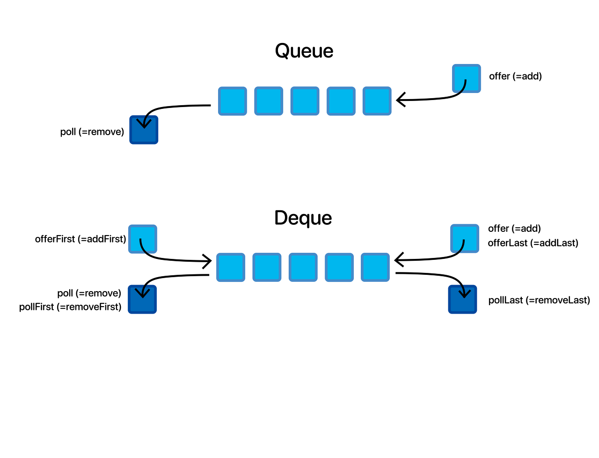
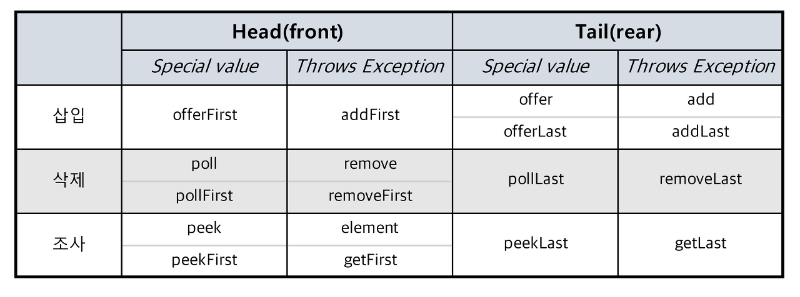

# Double-ended queue

Queue
- 단방향 자료구조
  - 단방향에서만 삽입, 삭제

Deque
- 양방향 자료구조
  - 양방향에서 삽입, 삭제
- 두 개의 종료 지점이 있다.
- 스택과 큐 두 용도로 모두 사용 가능

- offer, poll 계열
  - 삽입, 삭제 과정에서 저장공간이 부족하거나 삭제할 요소가 없다면 특정 값(null, false 등)을 반환
- add, remove 계열
  - 예외를 던진다.

>offer(add) = offerLast(addLast)
>poll(remove) = pollFirst(removeFirst)

