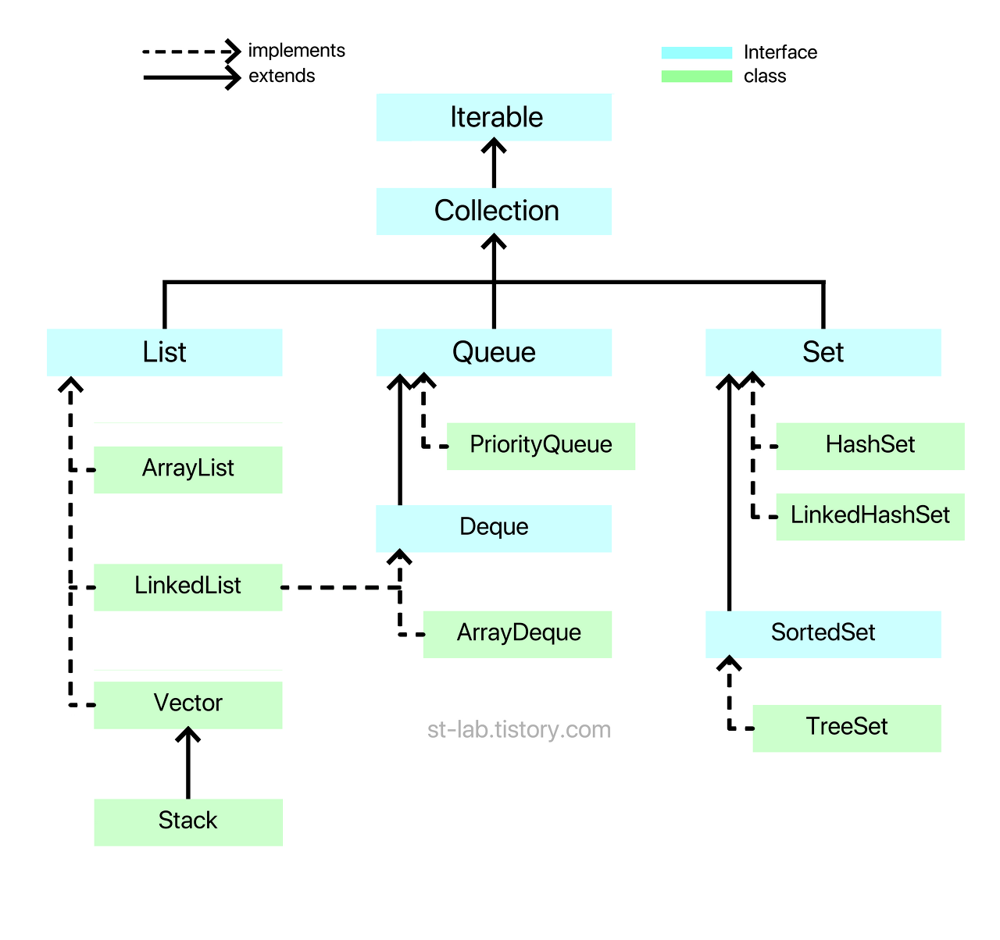
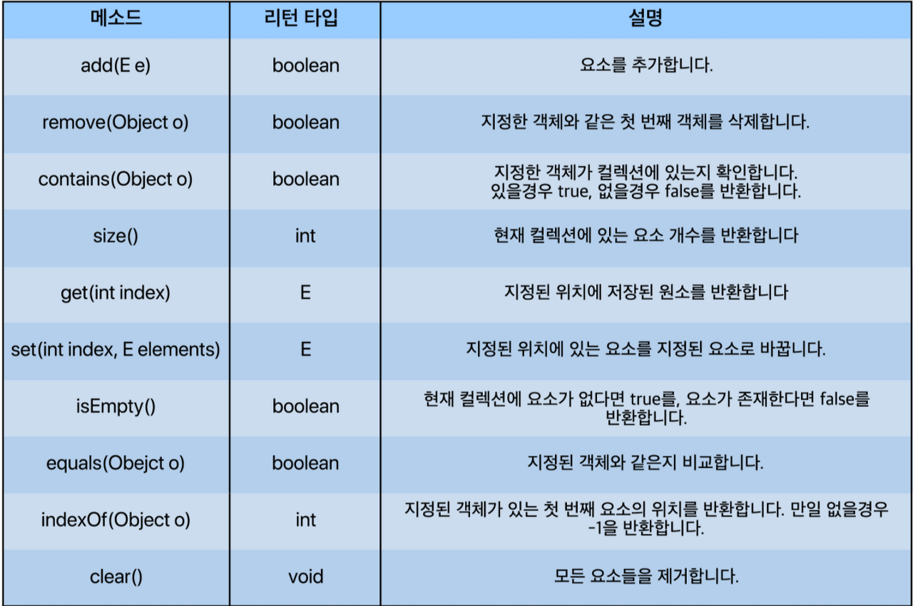
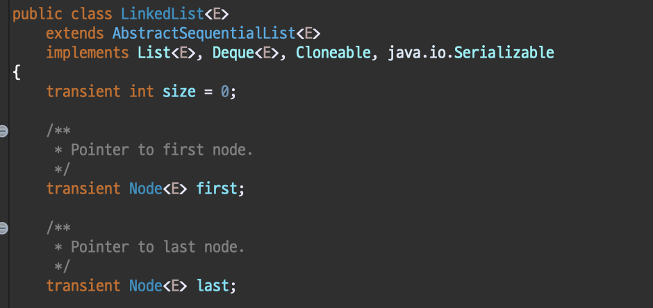
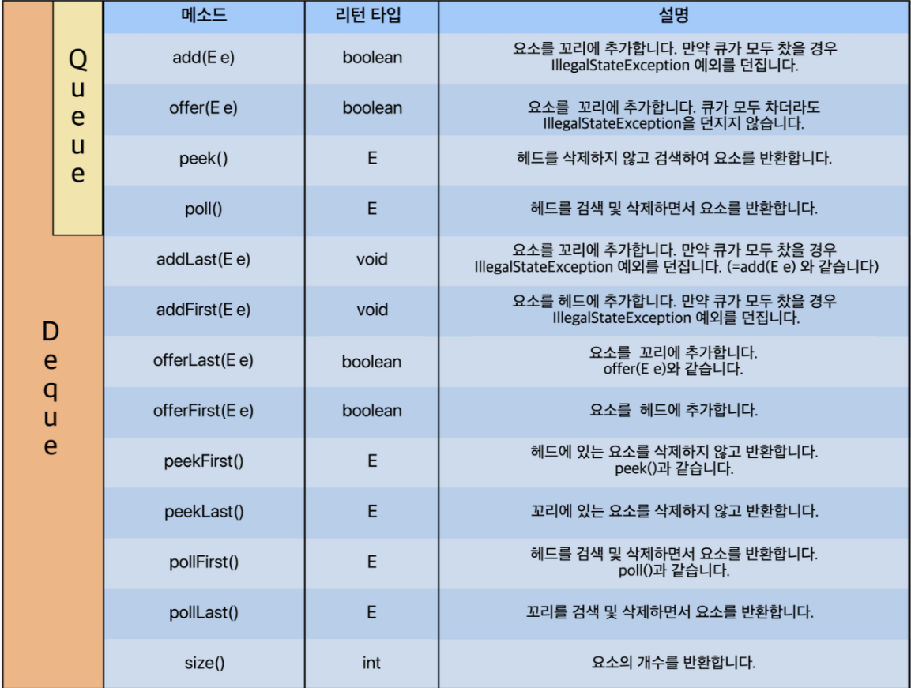
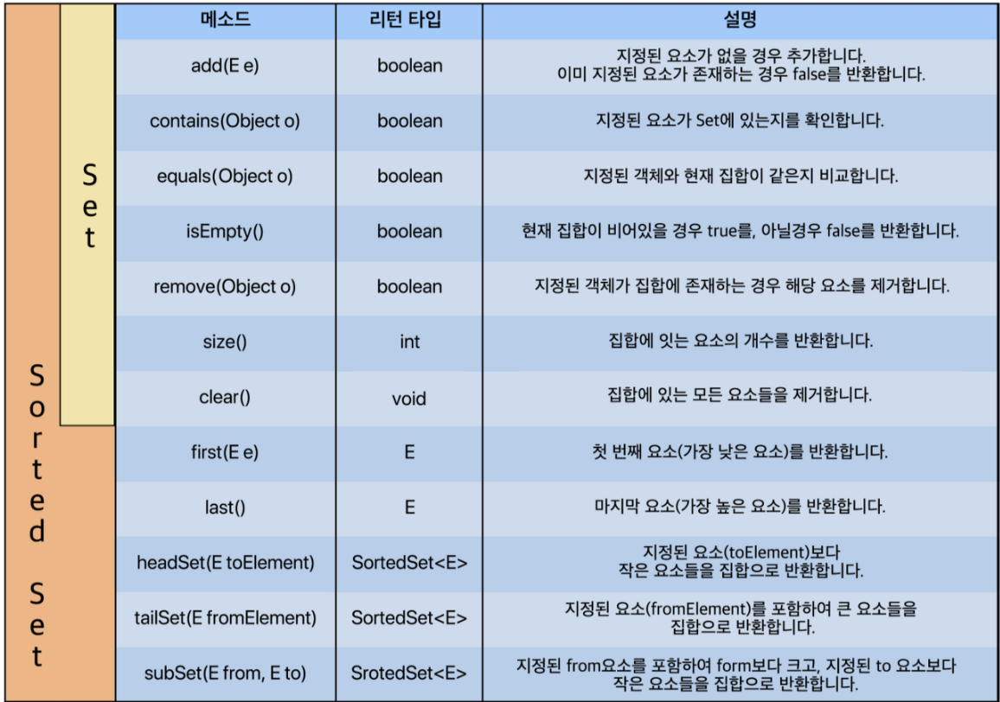
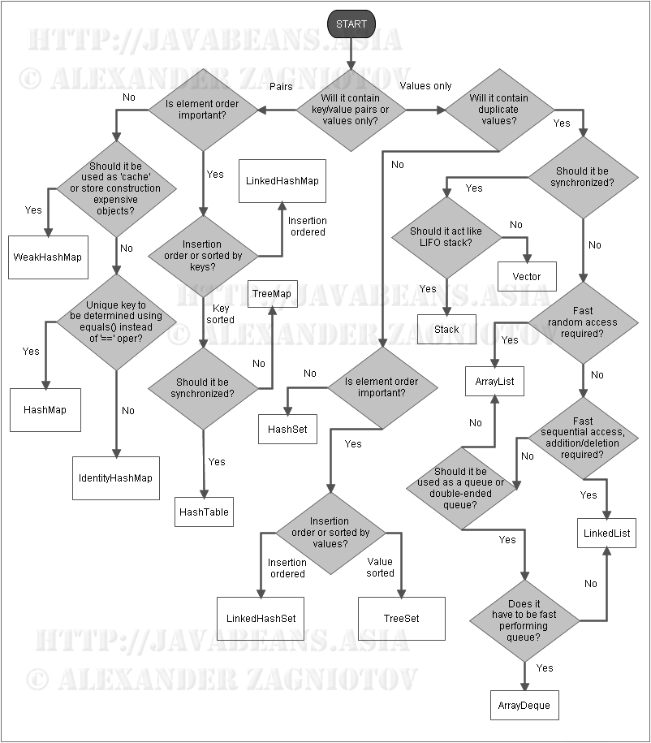

- [자료구조](#자료구조)
- [자료구조의 분류](#자료구조의-분류)
- [Java Collections Framework](#java-collections-framework)
    - [Map을 Java Collections로 보기 힘든 이유](#map을-java-collections로-보기-힘든-이유)
  - [List(리스트)](#list리스트)
    - [List Interface를 구현하는 class](#list-interface를-구현하는-class)
      - [ArrayList](#arraylist)
      - [LinkedList](#linkedlist)
      - [Vector](#vector)
      - [Stack](#stack)
      - [List Interface에 선언된 대표적인 메소드](#list-interface에-선언된-대표적인-메소드)
  - [Queue(큐)](#queue큐)
    - [Queue/Deque Interface를 구현하는 class](#queuedeque-interface를-구현하는-class)
      - [LinkedList](#linkedlist-1)
      - [ArrayList](#arraylist-1)
      - [PriorityQueue](#priorityqueue)
    - [Queue/Deque Interface에 선언된 대표적인 메소드](#queuedeque-interface에-선언된-대표적인-메소드)
  - [Set(집합)](#set집합)
    - [Set/SortedSet Interface를 구현하는 class](#setsortedset-interface를-구현하는-class)
      - [HashSet](#hashset)
      - [LinkedHashSet](#linkedhashset)
      - [TreeSet](#treeset)
    - [Set/SortedSet Interface에 선언된 대표적인 메소드](#setsortedset-interface에-선언된-대표적인-메소드)
- [적절한 자료구조 사용](#적절한-자료구조-사용)
- [출처](#출처)

# 자료구조

Data Structure

- 데이터 구조
- 일련의 일정 타입들의 데이터 모입 또는 관계를 나타낸 구성체
- 알고리즘과의 관계
  - 상호의존관계
  - 어떤 알고리즘 문제를 풀기 위해 문제를 해석한 다음 보통 자료구조를 선택한다.
- 자바의 대표적인 자료구조
  - Collection

# 자료구조의 분류

형태에 따른 자료구조

- 선형 자료구조 vs 비선형 자료구조
  - 선형 자료구조(Linear Data Structure)
    - 데이터가 일렬로 연결된 형태
      - 리스트(List)
      - 큐(Queue)
      - 덱(Deque)
  - 비선형 자료구조(Nonlinear Data Structure)
    - 일렬로 연결된 것이 아닌, 각 요소가 여러 개의 요소와 연결된 형태(like 거미줄)
      - 그래프(Graph)
      - 트리(Tree)

위 두 가지 분류에 해당되지 않는 자료구조

- 집합(Set)
  - table에 가까움
- 파일 자료구조
  - 순차파일
  - 색인파일
  - 직접파일

# Java Collections Framework

일정 타입의 데이터들이 모여 쉽게 가공할 수 있도록 지원하는 자료구조들의 기본구조

- 기본 구조는 Interface 형태
- 자바에서 제공하는 Collection은 크게 3가지 Interface
  - List(리스트)
  - Queue(큐)
  - Set(집합)



- 점선은 구현 관계, 실선은 확장 관계
- Collection을 구현한 클래스 및 인터페이스들은 모두 java.util 패키지에 있다.
- Collection의 형태에 따른 자료구조
  - List, Queue, Set
  - Queue와 Set을 구체화한 Deque와 SortedSet
- 녹색 부분이 '구현된 자료구조'
- Iterable
  - Interface들을 구현한 모든 class들은 모두 객체 형태
    - 모든 데이터들을 모두 순회하면서 출력하려면 순회 방법을 구현하거나 get() 메소드를 통해 데이터들을 하나씩 꺼내서 출력해야 한다.
  - Iterable에서는 for-each 문법을 제공하므로 Interface를 구현한 모든 class에서 편하게 for-each 문법으로 데이터를 출력할 수 있다.

### Map을 Java Collections로 보기 힘든 이유

호환성 문제

- Collection Interface를 보면 이를 상속하여 구현된 클래스들은 모두 **단일 데이터를 처리**
  - Map은 **key와 value**가 쌍을 이루고 이를 처리
  - 굳이 Collection에서 Map을 위한 메소드를 만들고 Map에서 Collection을 상속할 필요가 없다.
- Iterator() 구현 문제
  - Iterable은 for-each 문법으로 단일 데이터를 반복 처리
    - Map은 반복자로 key와 value 중 어느 것으로 반복 처리를 할 것인지 모호하다.

## List(리스트)

- 대표적인 선형 자료구조
- 주로 순서가 있는 데이터를 목록으로 이용할 수 있도록 만들어진 Interface
- array(배열)를 사용하면 배열의 크기만큼만 값을 저장할 수 있다.
  - `int[] array = new int[10];`에서 `int[22] = 1;`을 한다면, IndexOutofBoundsException 발생
  - 이러한 단점을 보완하는 List
- List를 구현한 클래스들을 **동적 크기**를 갖는다.
- 배열의 기능 + 동적 크기

### List Interface를 구현하는 class

ArrayList, LinkedList, Vector

#### ArrayList

Object[] 배열을 사용

- 내부 구현을 통해 동적 관리
- primitive 배열(int[])와 유사
- 요소 접근은 good
- 중간 요소 삽입, 삭제 bad
  - 한 칸씩 모든 요소를 밀거나 당겨야 한다.
  - 비효율적

#### LinkedList

데이터(item)와 주소로 이루어진 클래스를 만들어 서로 연결하는 방식

- 데이터와 주소로 이루어진 클래스 **Node(노드)**
- 각 노드는 이전의 노드와 다음 노드를 연결하는 방식
  - 이중 연결 리스트
  - 객체끼리 연결하는 것
- 요소를 검색할 경우 bad
  - 처음부터 모든 노드를 순회하며 찾아야 한다.
- 노드 삭제, 삽입 good
  - 해당 노드의 링크를 끊거나 연결만 해주면 된다.

#### Vector

Object[] 배열을 사용하며 요소 접근에서 빠른 성능

- ArrayList와 유사
- `동기화` 지원
  - 여러 쓰레드가 동시에 데이터에 접근하려면 **순차적으로 처리하도록** 한다.
  - 멀티 쓰레드에서는 안전
  - 단일 쓰레드는 동기화를 때문에 ArrayList에 비해 느림

#### Stack

LIFO(Last In First Out)

- 짐 쌓기
- 웹 페이지의 뒤로가기 기능
- Stack은 Vector 클래스를 상속받는다.

```java
//그냥 해당 클래스 type으로 객체 생성
ArrayList<T> arraylist = new ArrayList<>();
LinkedList<T> linkedlist = new LinkedList<>();
Vector<T> vector = new Vector<>();
Stack<T> stack = new Stack<>();

//Interface type으로 객체 생성, 이렇게 List type으로 만들면 프로그래밍 중간에 type을 바꿔야 하는 경우 아무 부담없이 바꿀 수 있다.
List<T> arraylist = new ArrayList<>();
List<T> linkedlist = new LinkedList<>();
List<T> vector = new Vector<>();
List<T> stack = new Stack<>();

//Stack은 Vector를 구현한 클래스이므로 다음과 같이도 객체를 생성할 수 있다.
Vector<T> stack = new Stack<>();
```

>T는 객체 타입을 의미하며 기본적으로 Integer, String, Double, Long 같은 Wrapper Class부터 사용자 정의 객체까지 가능하지만 int, long과 같은 primitive type은 불가능하다.

#### List Interface에 선언된 대표적인 메소드



## Queue(큐)

FIFO(First In First In)

- 선형 자료 구조
- head
  - 가장 앞쪽 위치
- tail
  - 가장 뒷쪽 위치

Deque(Double Ended Queue)

- Queue는 한쪽으로만 삽입, 삭제가 가능하지만 Deque는 양쪽에서 삽입, 삭제 가능
  - tail, head 모두 삽입, 삭제 가능
- 양방향 큐

### Queue/Deque Interface를 구현하는 class

#### LinkedList

LinkedList는 List를 구현하기도 하지만, Deque도 구현한다. 그리고 Deque Interface는 Queue Interface를 상속받는다.

즉, LinkedList는 3가지 용도로 쓸 수 있다.

- List
- Deque
- Queue



Deque 또는 Queue를 LinkedList처럼 Node 객체로 연결해서 관리하려면 LinkedList를 사용한다.

#### ArrayList

Deque 또는 Queue를 ArrayList처럼 Object[] 배열로 연결해서 관리하려면 ArrayList를 사용한다.

- 일반적인 큐를 사용하고자 한다면 LinkedList로 생성하는 것이 좋다.

#### PriorityQueue

PriorityQueue

- LinkedList는 큐의 원리가 선입선출이라는 전제 아래 짜여있다.
- 하지만 PriorityQueue는 '데이터 우선순위'에 기반하여 우선순위가 높은 데이터가 먼저 나온다.
  - 따로 정렬하지 않으면 작은 숫자가 높은 우선순위를 갖는다.(오름차순으로 나온다는 뜻)
- 사용자가 정의한 객체를 타입으로 쓸 경우
  - 반드시 Comparator 또는 Comparable을 통해 정렬 방식을 구현해줘야 한다.

```java
ArrayDeque<T> arraydeque = new ArrayDeque<>();
PriorityQueue<T> priorityqueue = new PriorityQueue<>();

Deque<T> arraydeque = new ArrayDeque<>();
Deque<T> linkedlistdeque = new LinkedList<>();

Queue<T> arraydeque = new ArrayDeque<>();
Queue<T> linkedlistdeque = new LinkedList<>();
Queue<T> priorityqueue = new PriorityQueue<>();
```

### Queue/Deque Interface에 선언된 대표적인 메소드



## Set(집합)

Set의 큰 특징

- 데이터를 중복해서 저장할 수 없다.
- 입력 순서대로의 저장 순서를 보장하지 않는다.
  - 입력받은 순서와 상관없이 데이터를 집합시키기 때문에 순서를 보장하지 않는다.
    - 순서를 보장하지 않는다는 점이 불편함이라면, LinkedHashSet을 쓰면 중복없이 순서를 보장할 수 있다.

LinkedHashSet

- 저장 순서 보장
- 데이터 중복 저장 불가

### Set/SortedSet Interface를 구현하는 class

#### HashSet

데이터의 저장 순서를 보장하지 않으며, 중복 또한 불가능하다.

- 닉네임을 만들거나 아이디를 생성할 때 '중복확인'
- Hahs에 의해 데이터의 위치를 특정시켜 해당 데이터를 빠르게 색인(search)할 수 있게 만든 것
  - 삽입, 삭제, 색인이 매우 빠른 컬렉션

#### LinkedHashSet

LinkedList에서는 add() 메소드를 통해 요소들을 넣은 순서대로 연결한다.
- 순서를 보장
- Set의 '중복은 허용하지 않으면서 순서를 보장하지 않는다'가 불편할 경우에 사용
- 중복은 허용하지 않으면서 순서를 보장한다.

#### TreeSet

입력 순서대로의 저장 순서를 보장하지 않으며 중복데이터를 넣지 못한다.
- 가중치에 따른 순서대로 데이터가 정렬된다.
  - Set을 상속한 SortedSet Interface를 구현했다.

```java
HashSet<T> hashset = new HashSet<>();
LinkedHashSet<T> linkedhashset = new LinkedHashSet<>();
TreeSet<T> treeset = new TreeSet<>();

SortedSet<T> treeset = new TreeSet<>();

Set<T> hashset = new HashSet<>();
Set<T> linkedhashset = new LinkedHashSet<>();
Set<T> treeset = new TreeSet<>();
```

### Set/SortedSet Interface에 선언된 대표적인 메소드



# 적절한 자료구조 사용


- 출처: http://javabeans.asia

# 출처

[https://st-lab.tistory.com/142?category=856997](https://st-lab.tistory.com/142?category=856997)