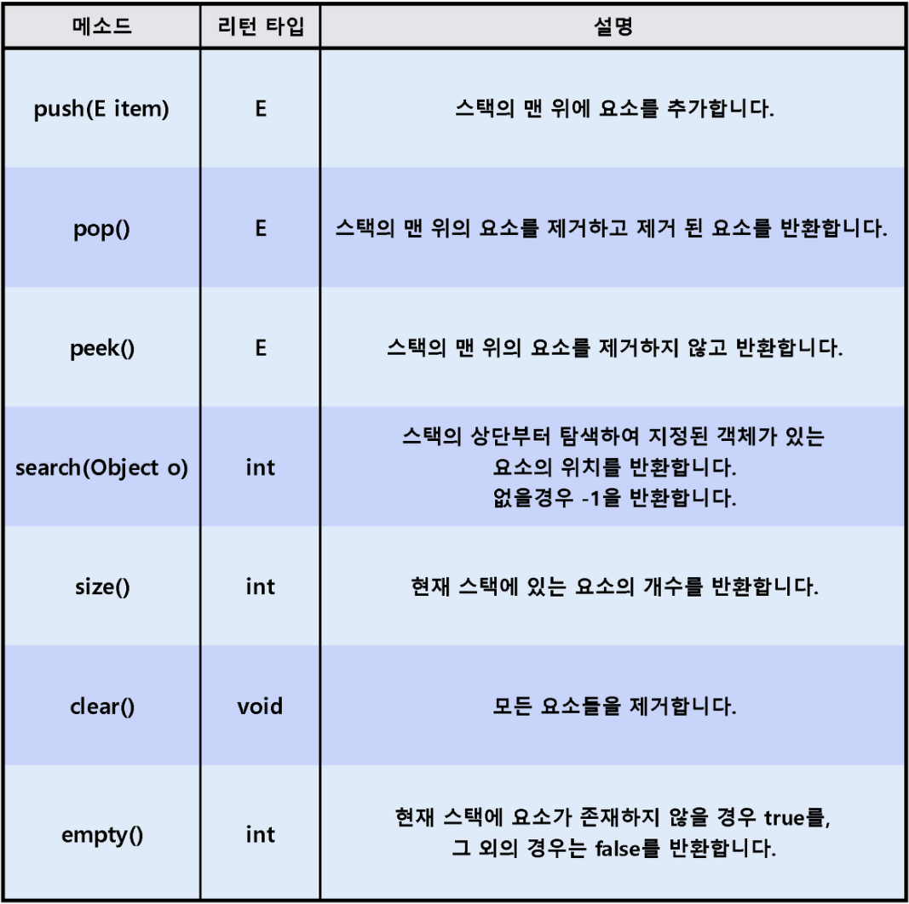

# Stack

Stack

- 쌓다
- LIFO(Last In First Out)
- FILO(First In Last Out)
- 자바에서의 Stack은 Vector 클래스를 상속받아 사용한다.
  - Vector
    - ArrayList와 크게 다르지 않다.
    - ArrayList에서는 동기화를 지원하지 않고, Vector는 동기화를 지원한다.
    - 속도는 ArrayList가 조금 더 빠르지만, Thread safe하지 않다.
- 예) 페이지 뒤로가기, 실행 취소, 수식 괄호 검사

Stack Interface에 선언된 대표적인 메소드



- search()
  - 스택 내부 배열의 인덱스 값이 아닌 스택의 상단으로부터 몇 번째에 위치하는지를 반환한다.

```java
package my_interface;

/*
  @author yback1223
  @param <E> the type of elements in this Stack

  @version 1.0
 */

public interface MyStack<E> {

  E push(E item);
  /*
    스택의 맨 위에 요소를 추가한다.

    @param item 스택에 추가할 요소
    @return 스택에 추가된 요소
   */

  E pop();
  /*
    스택의 맨 위에 있는 요소를 제거하고 제거된 요소를 반환한다.

    @return 제거된 요소
   */

  E peek();
  /*
    스택의 맨 위에 있는 요소를 제거하지 않고 반환한다.

    @return 스택의 맨 위에 있는 요소
   */

  int search(Object value);
  /*
    스택의 상반 부터 특정 요소가 몇 번째 위치에 있는지 반환
    중복되는 요소가 있을 경우 가장 위에 있는 요소의 위치가 반환된다.

    @param value 스택에서 위치를 찾을 요소
    @return 스택의 상단부터 처음으로 요소와 일치하는 위치를 반환한다.
            일치하는 요소가 없을 경우 -1을 반환
   */

  int size();
  /*
    스택의 요소 개수를 반환한다.

    @return 스택에 있는 요소 개수를 반환
   */

  void clear();
  /*
    스택에 있는 모든 요소를 삭제한다.
   */

  boolean empty();
  /*
    스택의 요소가 비어있는지를 반환한다.

    @return 스택에 요소가 없을 경우 true, 있을 경우 false를 반환
   */
}

```

## 참고

https://st-lab.tistory.com/173
