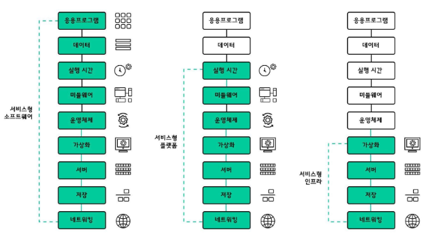
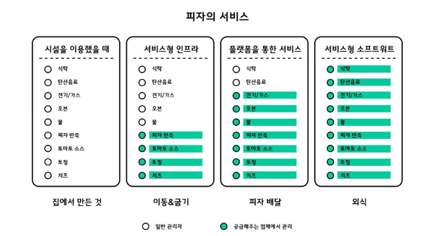

# SaaS

Software as a Service

- 서비스형 소프트웨어
- 공급 업체가 모든 물리적 및 가상 핵심 인프라, 미들웨어, 데이터베이스 관리 시스템, 개발 툴 등을 제공하고 호스팅한다.
- 특정 앱 또는 웹 포털을 통해 액세스하는 서비스
- 예
  - iCloud, Google Drive, MYBOX
  - 기업용 메신저나 이메일
  - 넷플릭스와 같은 OTT(Over-the-Top)서비스
- 쉽게 말해 사용자와 연결된 "패키지 소프트웨어"

호스팅

- 서버 컴퓨터의 일정 공간을 고객이 이용할 수 있도록 임대해주는 서비스
- 웹 호스팅 or 공유 호스팅
  - 개별 홈페이지를 운영하는 사용자를 위해 서버 컴퓨터의 일부 공간을 임대해주는 서비스
  - 여러 대의 웹사이트를 한 서버에 운영하는 방식
- 서버 호스팅
  - 가상 서버 호스팅(VPS, Virtual Private Server)
    - 서버의 일정한 공간을 가상화 기술을 이용하여 한대의 서버처럼 나눠 주는 서비스
    - 오버셀링(Overselling), 즉 서버 자원을 한계 이상으로 파는 행위에 악용되기도 한다.
  - 전용 서버 호스팅
    - 서버 한대를 전부 임대해 주는 서비스
- 메일 호스팅
  - 이메일 혹은 웹메일 계정과 공간을 임대해주는 서비스

# PaaS

Platform as a Service

- 서비스형 플랫폼
- 애플리케이션 및 서비스를 구축할 수 있는 플랫폼을 제공
- 공급 업체가 모든 물리적 및 가상 핵심 인프라를 제공하고 호스팅한다.
  - 여기에 추가로 미들웨어, 데이터베이스 관리 시스템, 개발 툴, 비즈니스 인텔리전스 및 분석 툴 등을 제공하고 관리
    - IaaS와 다른 점
- PaaS를 사용하는 클라이언트 사에서는 개발 중인 애플리케이션과 서비스를 관리하는 역할만 담당한다.
- 예
  - AWS Elastic Beanstalk
  - Windows Azure
  - Google App Engine

# IaaS

Infrastructure as a Service

- 서비스형 인프라
- 비즈니스 운영에 필요한 스토리지, 네트워킹 및 컴퓨팅 리소스를 제공한다.
- 공급업체는 서버, 스토리지 및 네트워킹 하드웨어, 가상화(하이퍼바이저) 계층을 포함하여 애플리케이션과 서비스를 제공하는 데 필요한 물리적 및 가상 핵심 인프라를 제공하고 호스팅한다.
- 구성요소가 가동되고 실행되면 필요한 미들웨어, 애플리케이션 소프트웨어, 데이터베이스 등을 인계받아 설치하고 유지 관리한다.
- 예
  - DigitalOcean
  - Linode
  - Rackspace
  - AWS

# SaaS, PaaS, IaaS 차이점

# Container

Containers encapsulate an application with all its dependencies, including system libraries, binaries, and configuration files.

Containerized Application

- Applications that run in isolated runtime environments called containers.
- makes an application portable by enabling it to behave consistently across different hosts
  - allowing developers to write once and run almost anywhere
