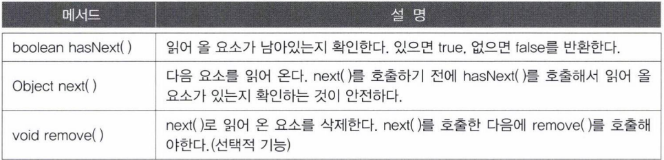
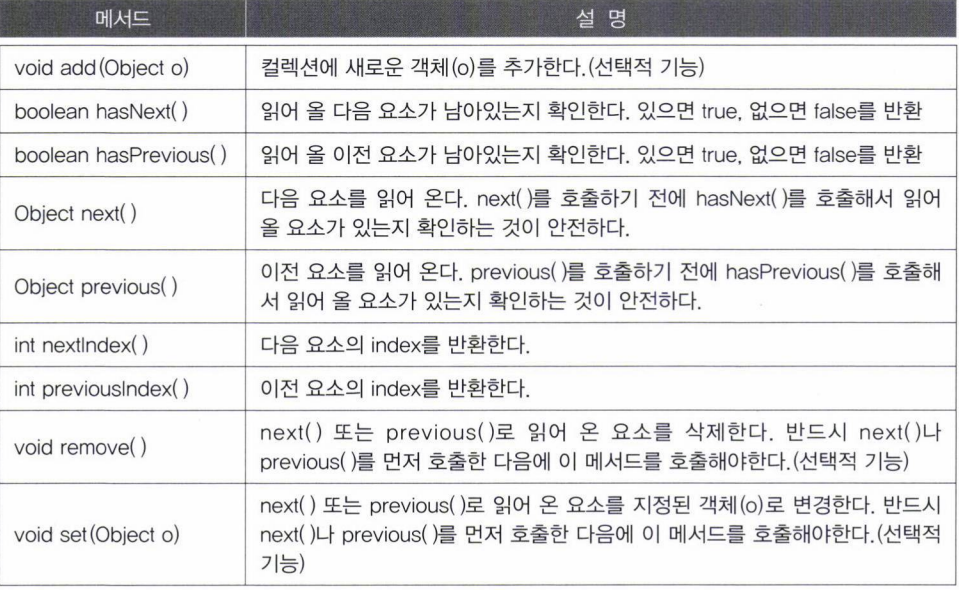
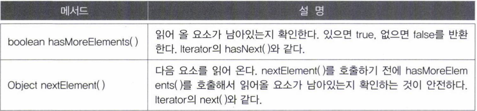
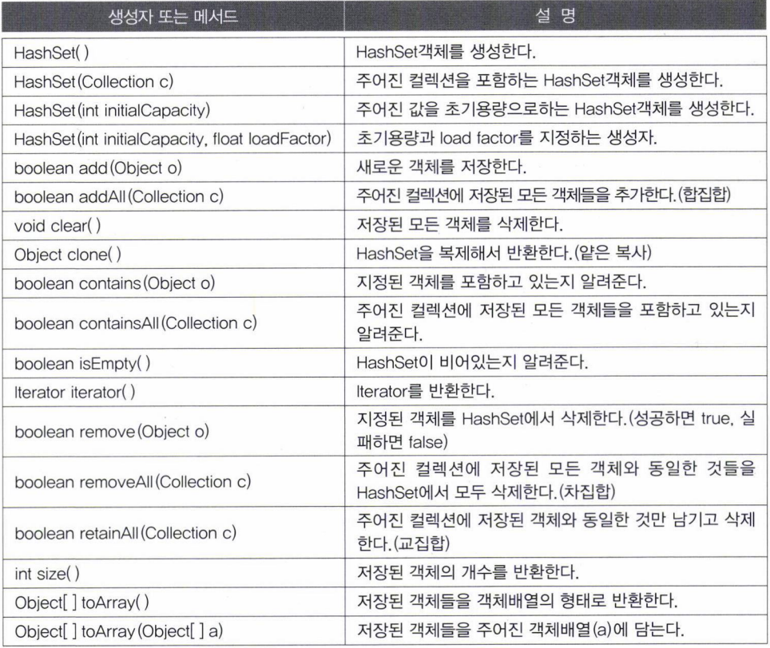
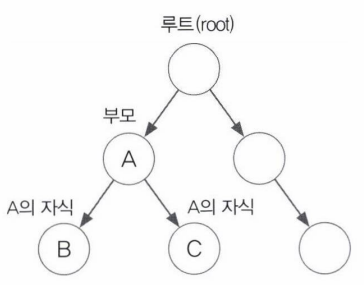
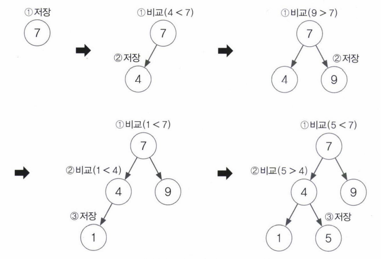
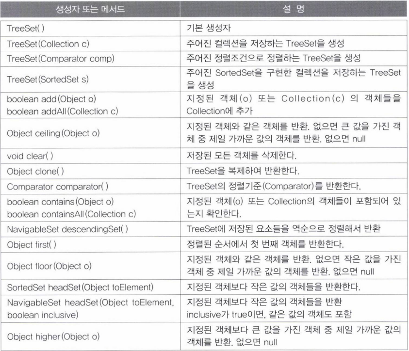
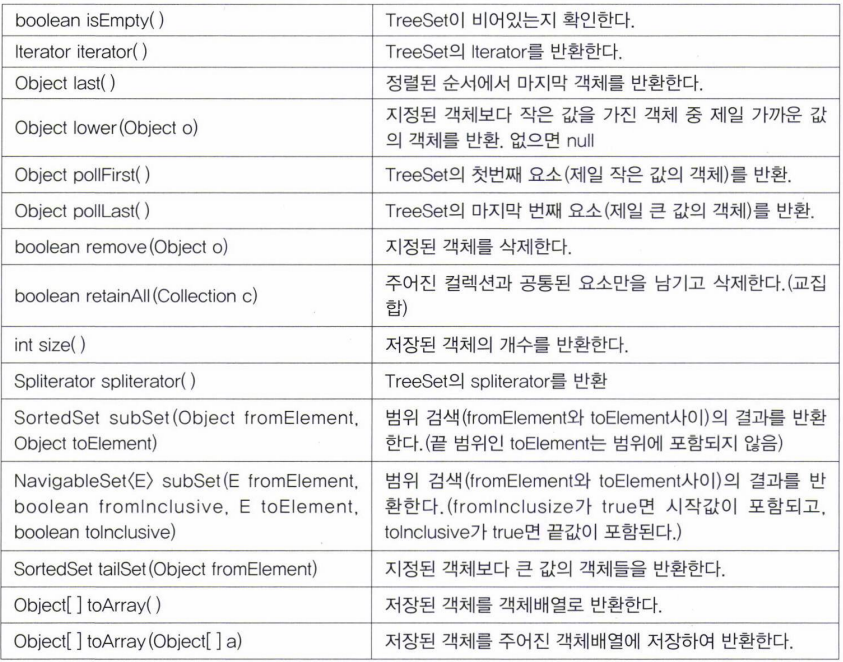
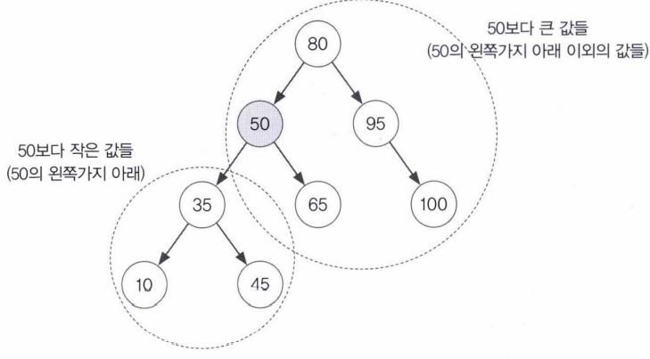

- [Iterator, ListIterator, Enumeration](#iterator-listiterator-enumeration)
	- [Iterator](#iterator)
	- [ListIterator와 Enumeration](#listiterator와-enumeration)
- [Arrays](#arrays)
	- [배열의 복사 - copyOf(), copyOfRange()](#배열의-복사---copyof-copyofrange)
	- [배열 채우기 - fill(), setAll()](#배열-채우기---fill-setall)
	- [배열의 정렬과 검색 - sort(), binarySearch()](#배열의-정렬과-검색---sort-binarysearch)
	- [문자열의 비교와 출력 - equals(), toString()](#문자열의-비교와-출력---equals-tostring)
	- [배열을 List로 변환 - asList(Object... a)](#배열을-list로-변환---aslistobject-a)
	- [parallelXXX(), spliterator(), stream()](#parallelxxx-spliterator-stream)
- [Comparator와 Comparable](#comparator와-comparable)
- [HashSet](#hashset)
- [TreeSet](#treeset)

---

# Iterator, ListIterator, Enumeration

모두 컬렉션에 저장된 요소를 접근하는데 사용된다.

## Iterator

- 컬렉션에 저장된 각 요소에 접근하는 기능
- Collection인터페이스
  - 'Iterator(Iterator를 구현한 클래스의 인스턴스)'를 반환하는 iterator()를 정의
    - List와 Set에도 포함되어 있다.
    - iterator()를 호출하여 Iterator를 얻은 다음 반복문을 사용해서 컬렉션 클래스의 요소를 읽어 온다.



ArrayList에 저장된 요소들을 출력하는 코드

```java
List list = new ArrayList();
Iterator it = list.iterator();

while(it.hasNext()){
    System.out.println(it.next());
}
```

>List로 참조변수를 정의한다면, 나중에 코드를 변경할 때 선언문 하나만 변경하면 되므로 간편하다.

Map인터페이스를 구현한 컬렉션 클래스는 키와 값을 쌍으로 저장하고 있기 때문에 iterator()를 직접 호출할 수 없다.

- keySet()이나 entrySet()으로 각각 따로 Set형태로 얻어 온 후에 iterator()를 호출해야 Iterator를 얻을 수 있다.

```java
Map map = new HashMap();
...
Iterator it = map.entrySet().iterator();
//Set eSet = map.entrySet();
//Iterator it = eSet.iterator(); 위와 같다.
```

```java
package YJ11;

import java.util.ArrayList;
import java.util.Iterator;
import java.util.List;

public class YJ11_13 {

 public static void main(String[] args) {
  List list = new ArrayList();
  list.add("1");
  list.add("2");
  list.add("3");
  list.add("4");
  list.add("5");

  Iterator it = list.iterator();

  while(it.hasNext()) {
   System.out.println(it.next());
  }
 }

}

// <Console>
// 1
// 2
// 3
// 4
// 5
```

- List클래스들은 저장 순서 유지
- Set클래스들은 저장 순서 유지 불가

## ListIterator와 Enumeration

ListIterator

- Iterator에 양방향 조회기능추가
- List를 구현한 경우만 사용가능



Enumeration

- Iterator의 구버전
- 가능하면 Iterator를 사용하자.



- '선택적 기능'이라고 표시된 것들은 반드시 구현하지는 않아도 된다.
  - 그래도 인터페이스로부터 상속받은 메서드는 추상메서드라 메서드의 몸통을 만들어줘야한다.
    - 이 구현부에 구현하지 않은 기능이라는 것을 메서드를 호출하는 쪽에 알리는 것이 좋다.

```java
public void remove(){
    throw new UnsupportedOperationException();
}
```

```java
package YJ11;

import java.util.ArrayList;
import java.util.List;
import java.util.ListIterator;

public class YJ11_14 {

 public static void main(String[] args) {
  List list = new ArrayList();
  list.add("1");
  list.add("2");
  list.add("3");
  list.add("4");
  list.add("5");

  ListIterator it = list.listIterator();

  while(it.hasNext()) {
   System.out.print(it.next());
  }
  System.out.println();

  while(it.hasPrevious()) {
   System.out.print(it.previous());
  }

 }

}

// <Console>
// 12345
// 54321
```

```java
package YJ11;

import java.util.ArrayList;
import java.util.Iterator;

public class YJ11_15 {

 public static void main(String[] args) {
  ArrayList original = new ArrayList(10);
  ArrayList copy1 = new ArrayList(10);
  ArrayList copy2 = new ArrayList(10);

  for(int i = 0; i < 10; i++) {
   original.add(i + "");
  }

  Iterator it = original.iterator();

  while(it.hasNext()) copy1.add(it.next());

  System.out.println(" = Original에서 copy1로 복사(copy) =");
  System.out.println("original: " + original);
  System.out.println("copy1: " + copy1);

  it = original.iterator(); //Iterator는 재사용이 되지 않는 일회용이므로, 다시 얻어와야 한다.

  while(it.hasNext()) copy2.add(it.next());

  System.out.println(" = Original에서 copy2로 복사(copy) =");
  System.out.println("original: " + original);
  System.out.println("copy2: " + copy2);
 } 

}

// <Console>
//  = Original에서 copy1로 복사(copy) =
// original: [0, 1, 2, 3, 4, 5, 6, 7, 8, 9]
// copy1: [0, 1, 2, 3, 4, 5, 6, 7, 8, 9]
//  = Original에서 copy2로 복사(copy) =
// original: [0, 1, 2, 3, 4, 5, 6, 7, 8, 9]
// copy2: [0, 1, 2, 3, 4, 5, 6, 7, 8, 9]
```

# Arrays

- Arrays에 정의된 메서드는 모두 static메서드이다.

## 배열의 복사 - copyOf(), copyOfRange()

copyOf()

- 배열 전체를 복사해서 새로운 배열로 반환

copyOfRange()

- 배열의 일부를 복사해서 새로운 배열로 반환
- 지정된 범위의 끝은 포함되지 않는다.

```java
int[] arr = {0, 1, 2, 3, 4};
int[] arr2 = Arrays.copyOf(arr, arr.length); // arr2 = [0, 1, 2, 3, 4]
int[] arr3 = Arrays.copyOf(arr, 3); // arr3 = [0, 1, 2]
int[] arr4 = Arrays.copyOf(arr, 7); // arr4 = [0, 1, 2, 3, 4, 0, 0]
int[] arr5 = Arrays.copyOfRange(arr, 2, 4); // arr5 = [2, 3]
int[] arr6 = Arrays.copyOfRange(arr, 0, 7); // arr6 = [0, 1, 2, 3, 4, 0, 0]
```

## 배열 채우기 - fill(), setAll()

fill()

- 배열의 모든 요소를 지정된 값으로 채운다.

setAll()

- 배열을 채우는데 사용할 함수형 인터페이스를 매개변수로 받는다.
- 이 메서드를 호출할 때
  - 함수형 인터페이스를 구현한 객체를 매개변수로 지정
  - 람다식을 지정

```java
int[] arr = new int[5];
Arrays.fill(arr, 9); // arr = [9, 9, 9, 9, 9]
Arrays.setAll(arr, () -> (int)(Math.random() * 5) + 1); //arr = [1, 5, 2, 1, 1]
```

## 배열의 정렬과 검색 - sort(), binarySearch()

sort()

- 배열 정렬

binarySearch()

- 배열에 저장된 요소를 검색
- 배열에서 지정된 값이 저장된 위치(index)를 찾아서 반환
  - 배열이 정렬된 상태여야 올바른 결과를 얻는다.
- 배열을 반씩 자르며 탐색한다.

```java
int[] arr = {3, 2, 0, 1, 4};
int idx = Arrays.binaySearch(arr, 2); // idx = -5 잘못된 결과

Arrays.sort(arr); //배열 정렬
System.out.println(Arrays.toString(arr)); //[0, 1, 2, 3, 4]
int idx = Arrays.binarySearch(arr, 2); // idx = 2 올바른 결과
```

## 문자열의 비교와 출력 - equals(), toString()

toString()

- 배열의 모든 요소를 문자열로 편하게 출력
- 다차원 배열
  - deepToString()
    - 배열의 모든 요소를 재귀적으로 접근해서 문자열을 구성

```java
int[] arr = {0, 1, 2, 3, 4};
int[][] arr2D = {{11, 12}, {21, 22}};

System.out.println(Arrays.toString(arr));
//[0, 1, 2, 3, 4]
System.out.println(Arrays.deepToString(arr2D));
//[[11, 12], [21, 22]]
```

equals()

- 두 배열에 저장된 모든 요소를 비교해서 같으면 true 반환
- 1차원 배열에만 사용가능
- 다차원 배열 비교
  - deepEquals()

```java
String[][] str2D = new String[][]{{"aaa", "bbb"}, {"AAA"}, {"BBB"}};
String[][] str2D2 = new String[][]{{"aaa", "bbb"}, {"AAA"}, {"BBB"}};

System.out.println(Array.equals(str2D, str2D2)); //false
System.out.println(Array.deepEquals(str2D, str2D2)); //true
```

>다차원 배열은 배열의 배열이므로 equals()를 사용하면 배열에 저장된 배열의 주소를 비교하게 된다.

## 배열을 List로 변환 - asList(Object... a)

배열을 List에 담아서 반환

- 매개변수 타입이 가변인수라서 배열 생성 없이 저장할 요소들만 나열도 가능

```java
List list = Arrays.asList(new Integer[]{1, 2, 3, 4, 5});
//list = {1, 2, 3, 4, 5}
List list = Arrays.asList(1, 2, 3, 4, 5);
//list = {1, 2, 3, 4, 5}
list.add(6); //예외
```

- asList()가 반환한 List는 크기를 변경할 수 없다.
  - 추가, 삭제 불가능
  - 저장된 내용은 변경 가능
- 크기를 변경할 수 있는 List가 필요하면

```java
List list = new ArrayList(Arrays.asList(1, 2, 3, 4, 5));
```

## parallelXXX(), spliterator(), stream()

parallelxxx()

- 보다 빠른 결과를 얻기 위해 여러 쓰레드가 작업을 나누어 처리(병렬 처리)

spliterator()

- 여러 쓰레드가 처리할 수 있게 하나의 작업을 여러 작업으로 나누는 Spliterator를 반환

stream()

- 컬렉션을 스트림으로 변환

```java
int[] arr = {0, 1, 2, 3, 4};
int[][] arr2D = {{11, 12, 13}, {21, 22, 23}};
```

```java
package YJ11;

import java.util.Arrays;

public class YJ11_18 {

 public static void main(String[] args) {
  int[] arr = {0, 1, 2, 3, 4};
  int[][] arr2D = {{11, 12, 13}, {21, 22, 23}};
  
  System.out.println("arr = " + Arrays.toString(arr));
  System.out.println("arr2D = " + Arrays.deepToString(arr2D));
  
  int[] arr2 = Arrays.copyOf(arr, arr.length);
  int[] arr3 = Arrays.copyOf(arr, 3);
  int[] arr4 = Arrays.copyOf(arr, 7);
  int[] arr5 = Arrays.copyOfRange(arr, 2, 4);
  int[] arr6 = Arrays.copyOfRange(arr, 0, 7);
  
  System.out.println("arr2 = " + Arrays.toString(arr2));
  System.out.println("arr3 = " + Arrays.toString(arr3));
  System.out.println("arr4 = " + Arrays.toString(arr4));
  System.out.println("arr5 = " + Arrays.toString(arr5));
  System.out.println("arr6 = " + Arrays.toString(arr6));
  
  int[] arr7 = new int[5];
  Arrays.fill(arr7, 9);//arr = [9, 9, 9, 9, 9]
  System.out.println("arr7 = " + Arrays.toString(arr7));
  
  Arrays.setAll(arr7, i -> (int)(Math.random()*6)+1);
  System.out.println("arr7 = " + Arrays.toString(arr7));
  
  for(int i : arr7) {
   char[] graph = new char[i];
   Arrays.fill(graph, '*');
   System.out.println(new String(graph) + i);
  }
  
  String[][] str2D = new String[][] {{"aaa", "bbb"}, {"AAA", "BBB"}};
  String[][] str2D2 = new String[][] {{"aaa", "bbb"}, {"AAA", "BBB"}};
  
  System.out.println(Arrays.equals(str2D, str2D2)); //false
  System.out.println(Arrays.deepEquals(str2D, str2D2)); //true
  
  char[] chArr = {'A', 'D', 'C', 'B', 'E'};
  
  System.out.println("chArr = " + Arrays.toString(chArr));
  System.out.println("index of B = " + Arrays.binarySearch(chArr, 'B'));
  System.out.println(" = After sorting = ");
  
  Arrays.sort(chArr);
  System.out.println("chArr = " + Arrays.toString(chArr));
  System.out.println("index of B = " + Arrays.binarySearch(chArr, 'B'));
 }

}

// <Console>
// arr = [0, 1, 2, 3, 4]
// arr2D = [[11, 12, 13], [21, 22, 23]]
// arr2 = [0, 1, 2, 3, 4]
// arr3 = [0, 1, 2]
// arr4 = [0, 1, 2, 3, 4, 0, 0]
// arr5 = [2, 3]
// arr6 = [0, 1, 2, 3, 4, 0, 0]
// arr7 = [9, 9, 9, 9, 9]
// arr7 = [5, 6, 4, 2, 1]
// *****5
// ******6
// ****4
// **2
// *1
// false
// true
// chArr = [A, D, C, B, E]
// index of B = -2
//  = After sorting = 
// chArr = [A, B, C, D, E]
// index of B = 1
```

# Comparator와 Comparable

Comparable

- 기본 정렬기준을 구현하는데 사용
- 구현한 클래스는 정렬이 가능하다는 것을 의미
- compareTo()의 반환값은 int
  - 비교하는 두 객체가 같으면 0
  - 비교하는 값보다 작으면 음수, 크면 양수

Comparator

- 기본 정렬기준 외에 다른 기준으로 정렬하고자할 때 사용
- compare()
  - 객체를 비교해서 음수, 0, 양수 중 하나를 반환

```java
package YJ11;

import java.util.Arrays;
import java.util.Comparator;

public class YJ11_19 {

 public static void main(String[] args) {
  String[] strArr = {"cat", "Dog", "lion", "tiger"};

  Arrays.sort(strArr); //String의 Comparable구현에 의한 정렬
  System.out.println("strArr = " + Arrays.toString(strArr));

  Arrays.sort(strArr, String.CASE_INSENSITIVE_ORDER);//대소문자 구분 안함, Comparator구현에 의한 정렬
  System.out.println("strArr = " + Arrays.toString(strArr));

  Arrays.sort(strArr, new Descending()); //역순 정렬
  System.out.println("strArr = " + Arrays.toString(strArr));
 }
}

class Descending implements Comparator{
 public int compare(Object o1, Object o2) {
  if(o1 instanceof Comparable && o2 instanceof Comparable) {
   Comparable c1 = (Comparable)o1;
   Comparable c2 = (Comparable)o2;//Object타입이니까 형변환이 필요
   return c1.compareTo(c2) * -1; //-1을 곱해서 기본 정렬방식의 역으로 변경한다.
   //또는 c2.compare(c1)와 같이 순서를 바꿔도 된다.
  }
  return -1;
 }
}

// <Console>
// strArr = [Dog, cat, lion, tiger]
// strArr = [cat, Dog, lion, tiger]
// strArr = [tiger, lion, cat, Dog]
```

- String의 기본 정렬을 반대로 하는 것
  - 문자열을 내림차순
  - String에 구현된 compareTo()의 결과에 -1을 곱하면 된다.
  - 또는 객체의 위치를 바꾸서 c2.compareTo(c1)으로 해도 된다.

# HashSet

- Set인터페이스를 구현한 가장 대표적인 컬렉션
- 새로운 요소를 추가할 때는 add나 addAll을 사용
- 중복된 요소를 추가하고자 하면 false반환
- 저장순서 유지 불가
  - 저장순서 유지하고자 한다면 LinkedHashSet



```java
package YJ11;

import java.util.HashSet;
import java.util.Set;

public class YJ11_20 {

 public static void main(String[] args) {
  Object[] objArr = {"1", new Integer(1), "2", "2", "3", "3", "4", "4", "4"};
  Set set = new HashSet();

  for(int i = 0; i < objArr.length; i++) {
   set.add(objArr[i]); //HashSet에 objArr의 요소들을 저장
  }

  //HashSet에 저장된 요소들을 출력
  System.out.println(set);
 }

}

// <Console>
// [1, 1, 2, 3, 4]
```

```java
package YJ11;

import java.util.Collections;
import java.util.HashSet;
import java.util.LinkedList;
import java.util.List;
import java.util.Set;

public class YJ11_21 {

 public static void main(String[] args) {
  Set set = new HashSet();

  for(int i = 0; set.size() < 6; i++) {
   int num = (int)(Math.random()*45) + 1;
   set.add(new Integer(num));
  }

  List list = new LinkedList(set); //LinkedList(Collection c)
  Collections.sort(list); //Collections.sort(List list)
  System.out.println(list);
 }

}

// <Console>
// [3, 13, 16, 27, 32, 42]
```

```java
package YJ11;

import java.util.HashSet;
import java.util.Iterator;
import java.util.LinkedHashSet;
import java.util.Set;

public class YJ11_22 {

 public static void main(String[] args) {
  Set set = new HashSet();
//  Set set = new LinkedHashSet();
  int[][] board = new int[5][5];
  
  for(int i = 0; set.size() < 25; i++) {
   set.add((int)(Math.random() * 50) + 1 + "");
  }
  
  Iterator it = set.iterator();
  
  for(int i = 0; i < board.length; i++) {
   for(int j = 0; j < board[i].length; j++) {
    board[i][j] = Integer.parseInt((String)it.next());
    System.out.printf("%3d", board[i][j]);
   }
   System.out.println();
  }
 }

}

// <Console>
//  22 45 46 24 25
//  26 49 27 28 29
//  50 10 11 34 35
//  14 36 16 38 39
//  19  1  4  5  7
```

```java
package YJ11;

import java.util.HashSet;

public class YJ11_23 {

 public static void main(String[] args) {
  HashSet set = new HashSet();

  set.add("abc");
  set.add("abc");
  set.add(new Person("David", 10));
  set.add(new Person("David", 10));

  System.out.println(set);
 }

}

class Person{
 String name;
 int age;

 Person(String name, int age){
  this.name = name;
  this.age = age;
 }

 public String toString() {
  return name + ":" + age;
 }
}

// <Console>
// [abc, David:10, David:10]
```

>인스턴스 주소가 다르기 때문에 값이 같아도 hashset에서 거르지 않았다.

```java
package YJ11;

import java.util.HashSet;

public class YJ11_24 {

 public static void main(String[] args) {
  HashSet set = new HashSet();
  
  set.add(new String("abc"));
  set.add(new String("abc"));
  set.add(new Person2("David", 10));
  set.add(new Person2("David", 10));
  
  System.out.println(set);
 }
}

class Person2{
 String name;
 int age;
 
 Person2(String name, int age){
  this.name = name;
  this.age = age;
 }
 
 public boolean equals(Object obj) {
  if(obj instanceof Person2) {
   Person2 tmp = (Person2)obj;
   return name.equals(tmp.name) && age == tmp.age;
            //name과 age가 서로 같으면 true를 반환하도록 오버라이딩
  }
  return false;
 }
 
 public int hashCode() {
  return (name + age).hashCode();
        //String클래스의 hashCode()를 이용해서 구현
        //return Objects.hash(name, age);
        //이렇게 쓰는 것을 더 추천
 }
 
 public String toString() {
  return name + ":" + age;
 }
}

// <Console>
// [abc, David:10]
```

- HashSet의 add메서드는 새로운 요소를 추가하기 전에 기존에 저장된 요소와 같은 것인지 판별하기 위해 추가하려는 요소의 equals()와 hashCode()를 호출한다.

오버라이딩을 통해 작성된 hashCode()는 다음의 세 가지 조건을 만족해야 한다.

1. 실행 중인 애플리케이션 내의 동일한 객체에 대해서 여러 번 hashCode()를 호출해도 동일한 int값을 반환해야 한다.
     - 실행시마다 동일한 int값을 반환할 필요는 없다.

```java
Person2 p = new Person2("David", 10);

int hashCode1 = p.hashCode();
int hashCode2 = p.hashCode();

p.age = 20;
int hashCode3 = p.hashCode();
```

- hashCode1의 값과 hashCode2의 값은 항상 일치해야 한다.
  - 실행할 때마다 전과 같은 값일 필요는 없다.
- hashCode3은 age값을 바꿨으므로 hashCode1, hashCode2과는 달라도 된다.

2. equals메서드를 이용한 비교에 의해서 true를 얻은 두 객체에 대해 각각 hashCode()를 호출해서 얻은 결과는 반드시 같아야 한다.

3. equals메서드를 호출했을 때 false를 반환하는 두 객체는 hashCode() 호출에 대해 같은 int값을 반환하는 경우가 있어도 되지만, 해싱(hashing)을 사용하는 컬렉션의 성능을 향상시키기 위해서는 다른 int값을 반환하는 것이 좋다.

- 해시코드값이 중복되는 경우가 많아질수록 성능이 저하된다.

# TreeSet

이진 검색 트리(binary search tree) 자료구조의 형태로 데이터를 저장하는 컬렉션 클래스

- 이진 검색 트리
  - 정렬, 검색, 범위검색(range search)에 높은 성능을 보이는 자료구조
- TreeSet은 이진 검색 트리의 성능을 향상
- Set인터페이스를 구현
  - 데이터 중복 저장 불가
  - 저장 순서 유지 불가
- 각 노드에 최대 2개의 노드 연결
  - 부모 자식 관계
- 루트부터 시작



```java
class TreeNode{
 TreeNode left; //왼쪽 자식노드
 Object element; //객체를 저장하기 위한 참조변수
 TreeNode right; //오른쪽 자식노드
}
```

- 부모노드의 왼쪽
  - 부모노드의 값보다 작은 값
- 부모노드의 오른쪽
  - 부모노드의 값보다 큰 값



- TreeSet에 저장되는 객체가 Comparable을 구현하던가, Comparator를 제공해서 비교 방법을 알려줘야 한다.
- 왼쪽 마지막 값에서부터 오른쪽 값까지 값을 '왼쪽 노드 -> 부모 노드 -> 오른쪽 노드' 순으로 읽어오면 오름차순으로 정렬된 순서를 얻을 수 있다.
  - 정렬된 상태 유지
- 단점
  - 순차적 저장이 아닌 위치를 찾아서 저장해야 한다.
  - 삭제할 경우에도 트리 일부를 재구성 해야 한다.
- 장점
  - 배열이나 링크드 리스트에 비해 검색과 정렬기능이 뛰어나다.





```java
package YJ11;

import java.util.Set;
import java.util.TreeSet;

public class YJ11_26 {

 public static void main(String[] args) {
  Set set = new TreeSet();

  for(int i = 0; set.size() < 6; i++) {
   int num = (int)(Math.random() * 45) + 1;
   set.add(num); //set.add(new Integer(num));
  }

  System.out.println(set);
 }

}

// <Console>
// [2, 4, 16, 28, 35, 41]
```

- TreeSet은 저장할 때 이미 정렬하기 때문에 읽어올 때 정렬할 필요가 없다.

```java
import java.util.TreeSet;

public class YJ11_27 {

 public static void main(String[] args) {
  TreeSet set = new TreeSet();
  
  String from = "b";
  String to = "d";
  
  set.add("abc"); set.add("alien"); set.add("bat");
  set.add("car"); set.add("Car"); set.add("disc");
  set.add("dance"); set.add("dZZZZ"); set.add("dzzzz");
  set.add("elephant"); set.add("elevator"); set.add("fan");
  set.add("flower"); 
  
  System.out.println(set);
  System.out.println("range search: from " + from + " to " + to);
  System.out.println("result1 : " + set.subSet(from, to));
  System.out.println("result2 : " + set.subSet(from, to + "zzz"));
 }

}


// <Console>
// [Car, abc, alien, bat, car, dZZZZ, dance, disc, dzzzz, elephant, elevator, fan, flower]
// range search: from b to d
// result1 : [bat, car]
// result2 : [bat, car, dZZZZ, dance, disc]
```

- subSet()은 시작범위는 포함하고, 끝 범위는 포함하지 않는다.
  - 끝 범위인 d로 시작하는 단어까지 포함시키려면, 그 단어가 포함하고 있는 문자열을 아래와 같이 추가해주면 된다.

```java
System.out.println("result2 : " + set.subSet(from, to + "zzz"));
```

>zzz는 zzzz보다 앞에 정렬되므로 dzzzz는 포함되지 않는다.<br/>
>대문자가 소문자보다 앞에 정렬된다.

```java
package YJ11;

public class YJ11_28 {

 public static void main(String[] args) {
  char ch = ' ';
  
  //공백(' ') 이후의 문자들을 출력한다.
  for(int i = 1; i < 96; i++) {
   System.out.print(ch++);
   if(i%20 == 0) System.out.println();
  }
 }

}

// <Console>
//  !"#$%&'()*+,-./0123
// 456789:;<=>?@ABCDEFG
// HIJKLMNOPQRSTUVWXYZ[
// \]^_`abcdefghijklmno
// pqrstuvwxyz{|}~
```

```java
package YJ11;

import java.util.TreeSet;

public class YJ11_29 {

 public static void main(String[] args) {
  TreeSet set = new TreeSet();
  int[] score = {80, 95, 50, 35, 45, 65, 10, 100};
  
  for(int i = 0; i < score.length; i++) {
   set.add(new Integer(score[i]));
  }
  
  System.out.println("50보다 작은 값 : " + set.headSet(new Integer(50)));
  System.out.println("50보다 큰 값 : " + set.tailSet(new Integer(50)));
 }
}

// <Console>
// 50보다 작은 값 : [10, 35, 45]
// 50보다 큰 값 : [50, 65, 80, 95, 100]
```

- headSet메서드와 tailSet메서드를 이용하면, TreeSet에 저장된 객체 중 지정된 기준 값보다 큰 값의 객체들과 작은 값의 객체들을 얻을 수 있다.


