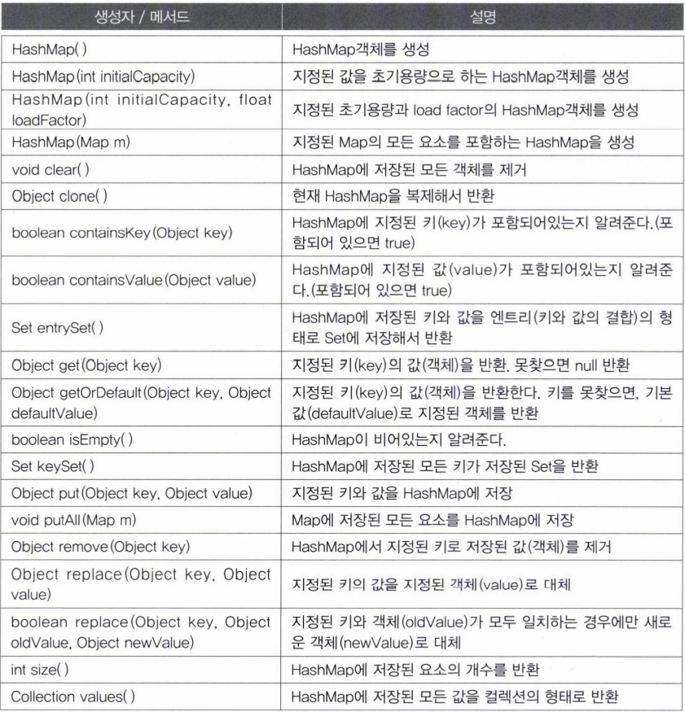
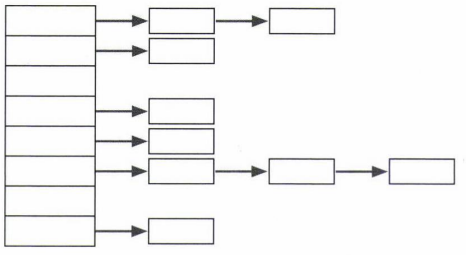
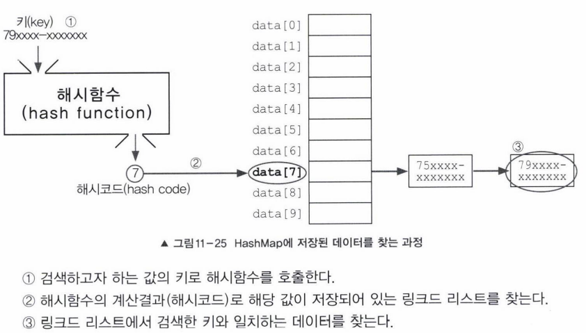
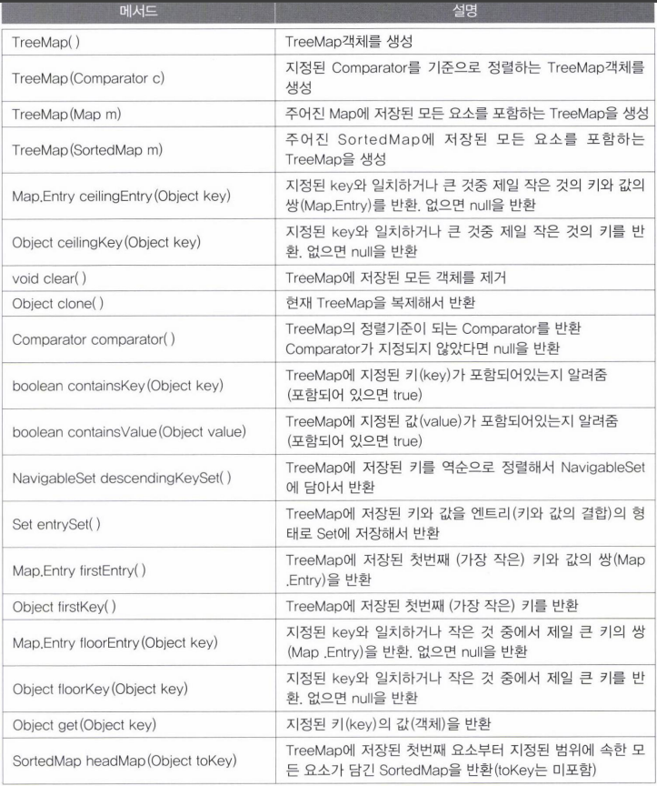
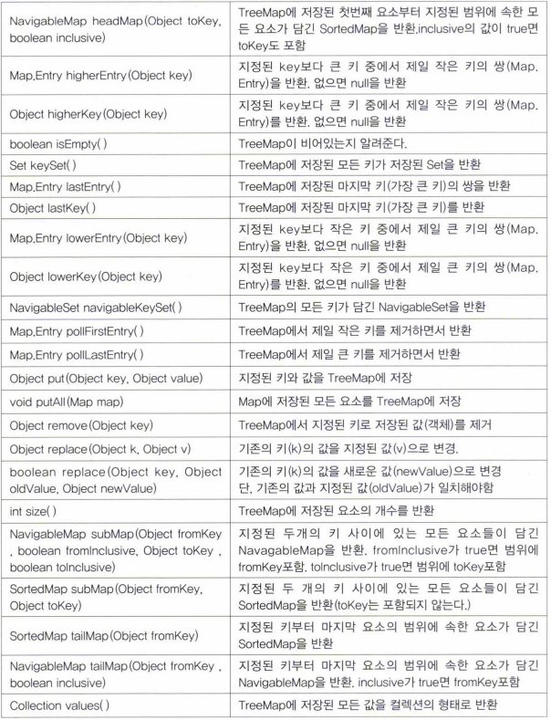
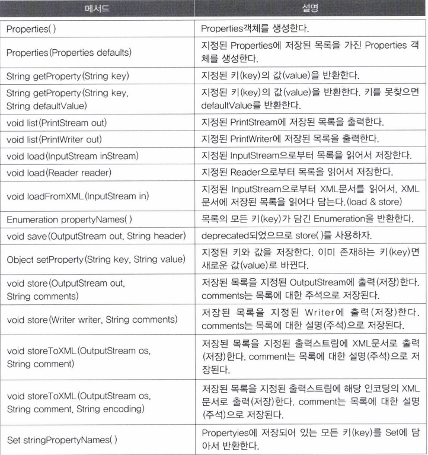
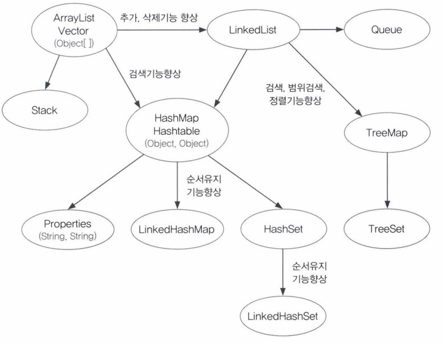
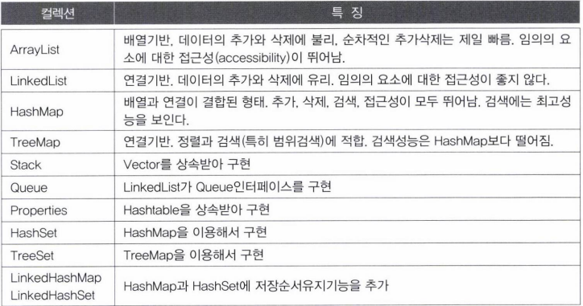

- [HashMap과 Hashtable](#hashmap과-hashtable)
  - [해싱과 해시함수](#해싱과-해시함수)
- [TreeMap](#treemap)
- [Properties](#properties)
- [Collections](#collections)
  - [컬렉션의 동기화](#컬렉션의-동기화)
  - [변경불가 컬렉션 만들기](#변경불가-컬렉션-만들기)
  - [싱글톤 컬렉션 만들기](#싱글톤-컬렉션-만들기)
  - [한 종류의 객체만 저장하는 컬렉션 만들기](#한-종류의-객체만-저장하는-컬렉션-만들기)
- [컬렉션 클래스 정리 & 요약](#컬렉션-클래스-정리--요약)

---

# HashMap과 Hashtable

HashMap

- Hashtable의 신버전, HashMap을 쓰자
- Map을 구현
  - 키와 값을 묶어서 하나의 데이터(entry)로 저장한다.
- 해싱(hashing)을 사용
  - 많은 양의 데이터를 검색하는데 뛰어난 성능
- Entry라는 내부 클래스 정의
  - 키와 값은 관련된 값
- Entry타입의 배열을 선언

| 비객체지향적인 코드              | 객체지향적인 코드                                                                                                                                            |
| :------------------------------- | :----------------------------------------------------------------------------------------------------------------------------------------------------------- |
| Object[] key;<br>Object[] value; | Entry[] table;<br/>class Entry {<br/>&nbsp;&nbsp;&nbsp;&nbsp;&nbsp;&nbsp;&nbsp;Object key;<br/>&nbsp;&nbsp;&nbsp;&nbsp;&nbsp;&nbsp;&nbsp;Object value;<br/>} |

키(key)

- 컬렉션 내의 키 중에서 유일해야 한다.

값(value)

- 키와 달리 데이터의 중복을 허용한다.



```java
package YJ11;

import java.util.Collection;
import java.util.Collections;
import java.util.HashMap;
import java.util.Iterator;
import java.util.Map;
import java.util.Set;

public class YJ11_31 {

 public static void main(String[] args) {
  HashMap map = new HashMap();
  map.put("김자바", new Integer(90));
  map.put("김자바", new Integer(100));
  map.put("이자바", new Integer(100));
  map.put("강자바", new Integer(80));
  map.put("안자바", new Integer(90));

  Set set = map.entrySet(); // entrySet() : HashMap에 저장된 키와 값을 엔트리(키와 값의 결합)의 형태로 Set에 저장해서 반환
  Iterator it = set.iterator();

  while(it.hasNext()) {
   Map.Entry e = (Map.Entry)it.next();
   System.out.println("이름 : " + e.getKey() + ", 점수 : " + e.getValue());
  }

  set = map.keySet(); //keySet() : HashMap에서 저장된 모든 키가 저장된 Set을 반환
  System.out.println("참가자 명단 : " + set);

  Collection values = map.values();//Collection values() : HashMap에 저장된 모든 값을 컬렉션의 형태로 반환
  it = values.iterator();

  int total = 0;

  while(it.hasNext()) {
   Integer i = (Integer)it.next();
   total += i.intValue();
  }

  System.out.println("총점 : " + total);
  System.out.println("평균 : " + (float)total/set.size());
  System.out.println("최고점수 : " + Collections.max(values));
  System.out.println("최저점수 : " + Collections.max(values));
 }

}

// <Console>
// 이름 : 안자바, 점수 : 90
// 이름 : 김자바, 점수 : 100
// 이름 : 강자바, 점수 : 80
// 이름 : 이자바, 점수 : 100
// 참가자 명단 : [안자바, 김자바, 강자바, 이자바]
// 총점 : 370
// 평균 : 92.5
// 최고점수 : 100
// 최저점수 : 100
```

```java
package YJ11;

import java.util.HashMap;
import java.util.Iterator;
import java.util.Map;
import java.util.Set;

public class YJ11_32 {

 static HashMap phoneBook = new HashMap();

 public static void main(String[] args) {
  addPhoneNo("친구", "이자바", "010-111-1111");
  addPhoneNo("친구", "김자바", "010-222-2222");
  addPhoneNo("친구", "김자바", "010-333-3333");
  addPhoneNo("회사", "김대리", "010-444-4444");
  addPhoneNo("회사", "김대리", "010-555-5555");
  addPhoneNo("회사", "박대리", "010-666-6666");
  addPhoneNo("회사", "이과장", "010-777-7777");
  addPhoneNo("세탁", "010-888-8888");

  printList();
 }//main

 //그룹에 전화번호를 추가하는 메서드
 static void addPhoneNo(String groupName, String name, String tel) {
  addGroup(groupName);
  HashMap group = (HashMap)phoneBook.get(groupName);
  group.put(tel, name);//이름은 중복될 수 있으니 tel을 앞에 넣어 key로 설정한다.
 }//addPhonNo

 static void addPhoneNo(String name, String tel) {
  addPhoneNo("기타", name, tel);
 }//addPhoneNo

 //그룹을 추가하는 메서드
 static void addGroup(String groupName) {
  if(!phoneBook.containsKey(groupName))
   phoneBook.put(groupName, new HashMap());
 }//addGroup

 static void printList() {
  Set set = phoneBook.entrySet();
  Iterator it = set.iterator();

  while(it.hasNext()) {
   Map.Entry e = (Map.Entry)it.next();

   Set subSet = ((HashMap)e.getValue()).entrySet();
   Iterator subIt = subSet.iterator();

   System.out.println(" * " + e.getKey() + "[" + subSet.size() + "]");

   while(subIt.hasNext()) {
    Map.Entry subE = (Map.Entry)subIt.next();
    String telNo = (String)subE.getKey();
    String name = (String)subE.getValue();
    System.out.println(name + " " + telNo);
   }
   System.out.println();
  }
 }//printList
}//class

// <Console>
//  * 기타[1]
// 세탁 010-888-8888

//  * 친구[3]
// 이자바 010-111-1111
// 김자바 010-222-2222
// 김자바 010-333-3333

//  * 회사[4]
// 이과장 010-777-7777
// 김대리 010-444-4444
// 김대리 010-555-5555
// 박대리 010-666-6666
```

- HashMap은 데이터를 키와 값 모두 Object타입으로 저장
  - HashMap의 값(value)으로 HashMap을 다시 저장할 수 있다.
  - 이렇게 하면 하나의 키에 다시 복수의 데이터를 저장할 수 있다.
  - 배열의 배열인 이차원 배열을 생각하면 이해하기 쉽다.

```java
package YJ11;

import java.util.HashMap;
import java.util.Iterator;
import java.util.Map;

public class YJ11_33 {

 public static void main(String[] args) {
  String[] data = {"A", "K", "A", "K", "D", "K", "A", "K", "K", "K", "Z", "D"};

  HashMap map = new HashMap();

  for(int i = 0; i < data.length; i++) {
   if(map.containsKey(data[i])) {
    Integer value = (Integer)map.get(data[i]);//get() : 지정된 키의 값(객체)을 반환
    map.put(data[i], new Integer(value.intValue() + 1)); //중복된 문자가 들어오면 +1
   } else {
    map.put(data[i], new Integer(1)); //문자열 배열은 HashMap의 키로 저장, value로는 1 저장
   }
  }

  Iterator it = map.entrySet().iterator(); //entrySet() : HashMap에 저장된 키와 값을 엔트리(키와 값의 결합)의 형태로 Set에 저장해서 반환

  while(it.hasNext()) {
   Map.Entry entry = (Map.Entry)it.next();
   int value = ((Integer)entry.getValue()).intValue();
   System.out.println(entry.getKey() + " : " + printBar('#', value) + " " + value);
  } 
 }//main

 public static String printBar(char ch, int value) {
  char[] bar = new char[value];

  for(int i = 0; i < bar.length; i++) {
   bar[i] = ch;
  }

  return new String(bar); //String(char[] chArr)
 }//printBar

}

// <Console>
//  A : ### 3
// D : ## 2
// Z : # 1
// K : ###### 6
```

>한정된 범위 내에 있는 순차적인 값들의 빈도수는 배열 이용<br/>
>한정되지 않은 범위의 비순처자거인 값들의 빈도수는 HashMap이용

## 해싱과 해시함수

해싱

- 해시함수를 이용해서 데이터를 해시테이블에 저장하고 검색하는 기법
  - 해시함수는 저장된 데이터의 위치를 알려줘서 원하는 데이터를 빠르게 찾는다.
- 해싱에서 사용하는 자료구조
  - 배열과 링크드 리스트의 조합



- 저장할 데이터의 키를 해시함수에 넣으면 배열의 한 요소를 얻는다.
  - 그 요소와 연결되어 있는 링크드 리스트에 저장
    - 실제 데이터는 링크드 리스트에 저장되는 것

- 해싱으로 자료 검색하는 방법



- 링크드 리스트는 검색에 시간이 오래 걸리지만 배열, 링크드 리스트의 조합이면 이 단점을 줄일 수 있다.
- 링크드 리스트에 최소한의 데이터만 저장되려면,
  - HashMap 크기 적절히 지정
  - 해시함수가 서로 다른 키에 대해 중복 해시코드 반환을 최소

>equals()로 비교한 결과가 false이고 해시코드가 같은 경우는 같은 링크드 리스트에 저장된 서로 다른 두 데이터가 된다.

---

# TreeMap

키와 값의 쌍으로 이루어진 데이터를 저장한다.

- 검색과 정렬에 적합한 컬렉션 클래스
  - 검색은 HashMap이 뛰어나다.
  - 범위검색이나 정렬은 TreeMap이 뛰어나다.





```java
package YJ11;

import java.util.ArrayList;
import java.util.Collections;
import java.util.Comparator;
import java.util.Iterator;
import java.util.List;
import java.util.Map;
import java.util.Set;
import java.util.TreeMap;

public class YJ11_34 {
 public static void main(String[] args) {
  String[] data = {"A", "K", "A", "K", "D", "K", "A", "K", "K", "K", "Z", "D"};

  TreeMap map = new TreeMap();

  for(int i = 0; i < data.length; i++) {
   if(map.containsKey(data[i])) {
    Integer value = (Integer)map.get(data[i]);//get() : 지정된 키의 값(객체)을 반환
    map.put(data[i], new Integer(value.intValue() + 1));
   } else {
    map.put(data[i], new Integer(1));
   }
  }

  Iterator it = map.entrySet().iterator(); //entrySet() : HashMap에 저장된 키와 값을 엔트리(키와 값의 결합)의 형태로 Set에 저장해서 반환
  
  System.out.println(" = 기본 정렬 = ");
  while(it.hasNext()) {
   Map.Entry entry = (Map.Entry)it.next();
   int value = ((Integer)entry.getValue()).intValue();
   System.out.println(entry.getKey() + " : " + printBar('#', value) + " " + value);
  }
  System.out.println();
  
  //map을 ArrayList로 변환한 다음 Collections.sort()로 정렬
  Set set = map.entrySet();
  List list = new ArrayList(set); //ArrayList(Collection c)
  
  //static void sort(List list, Comparator c)
  Collections.sort(list, new ValueComparator());
  
  it = list.iterator();
  
  System.out.println(" = 값의 크기가 큰 순서대로 정렬 = ");
  while(it.hasNext()) {
   Map.Entry entry = (Map.Entry)it.next();
   int value = ((Integer)entry.getValue()).intValue();
   System.out.println(entry.getKey() + " : " + printBar('#', value) + " " + value);
  }
 }//main
 
 static class ValueComparator implements Comparator{
  public int compare(Object o1, Object o2) {//내림차순 구현
   if(o1 instanceof Map.Entry && o2 instanceof Map.Entry) {
    Map.Entry e1 = (Map.Entry)o1;
    Map.Entry e2 = (Map.Entry)o2;
    
    int v1 = ((Integer)e1.getValue()).intValue();
    int v2 = ((Integer)e2.getValue()).intValue();
    
    return v2 - v1;
   }//if
   return -1;
  }
 }//ValueComparator
 
 public static String printBar(char ch, int value) {
  char[] bar = new char[value];

  for(int i = 0; i < bar.length; i++) {
   bar[i] = ch;
  }

  return new String(bar); //String(char[] chArr)
 }//printBar
}

// <Console>
//  = 기본 정렬 = 
// A : ### 3
// D : ## 2
// K : ###### 6
// Z : # 1

//  = 값의 크기가 큰 순서대로 정렬 = 
// K : ###### 6
// A : ### 3
// D : ## 2
// Z : # 1
```

---

# Properties

키와 값을 (String, String)의 형태로 저장하는 컬렉션 클래스

- 애플리케이션의 환경설정과 관련된 속성을 저장하는데 사용



```java
package YJ11;

import java.util.Enumeration;
import java.util.Properties;

public class YJ11_35 {
 public static void main(String[] args) {
  Properties prop = new Properties();

  //prop에 키와 값(key, value)을 저장한다.
  prop.setProperty("timeout", "30");
  prop.setProperty("language", "kr");
  prop.setProperty("size", "10");
  prop.setProperty("capacity", "10");

  //prop에 저장된 요소들을 Enumeration을 이용해서 출력
  Enumeration e = prop.propertyNames();

  while(e.hasMoreElements()) {
   String element = (String)e.nextElement();
   System.out.println(element + " = " + prop.getProperty(element));
  }

  System.out.println();
  prop.setProperty("size", "20"); //size의 값을 20으로 변경
  System.out.println("size = " + prop.getProperty("size"));
  System.out.println("capacity = " + prop.getProperty("capacity", "20"));
  System.out.println("loadfactor = " + prop.getProperty("loadfactor", "0.75"));

  System.out.println();

  System.out.println(prop);
  prop.list(System.out);
 }
}

// <Console>
// capacity = 10
// size = 10
// timeout = 30
// language = kr

// size = 20
// capacity = 10
// loadfactor = 0.75 loadfactor라는 키가 없어서 디폴트 값으로 지정한 0.75 출력

// {size=20, language=kr, timeout=30, capacity=10}
// -- listing properties --
// size=20
// language=kr
// timeout=30
// capacity=10
```

- setProperty()
  - 데이터를 저장하는데 사용
  - 단순히 Hashtable의 put메서드를 호출한 것
- getProperty()
  - Properties에 저장된 값을 읽어온다.
  - 읽어오려는 키가 존재하지 않으면 지정된 기본갑(defaultValue)을 반환

```java
String getProperty(String key)
String getProperty(String key, String defaultValue)
```

Properties는 저장순서 유지 불가

- 출력 순서가 다르다는 말과 같다.
- 구버전
  - Iterator가 아닌 Enumeration 사용
- list메서드를 이용하면 Properties에 저장된 모든 데이터를 편하게 출력할 수 있다.

```java
void list(PrintStream out)
void list(PrintWriter out)
```

- System.out
  - 화면과 연결된 표준출력
  - System클래스에 정의된 PrintStream타입의 static변수

```java
package YJ11;

import java.util.Properties;

public class YJ11_38 {

 public static void main(String[] args) {
  Properties sysProp = System.getProperties();
  System.out.println("java.version : " + sysProp.getProperty("java.verion"));
  System.out.println("user.language : " + sysProp.getProperty("user.language"));
  
  sysProp.list(System.out);
 }
}

// <Console>
// java.version : null
// user.language : ko
// -- listing properties --
// java.specification.version=17
// sun.cpu.isalist=amd64
// sun.jnu.encoding=MS949
// java.class.path=D:\study\Codes\YJ\bin
// java.vm.vendor=Eclipse Adoptium
// sun.arch.data.model=64
// user.variant=
// java.vendor.url=https://adoptium.net/
// java.vm.specification.version=17
// os.name=Windows 10
// sun.java.launcher=SUN_STANDARD
// user.country=KR
// sun.boot.library.path=C:\Users\yoyob\.p2\pool\plugins\org.e...
// sun.java.command=YJ11.YJ11_38
// jdk.debug=release
// sun.cpu.endian=little
// user.home=C:\Users\yoyob
// user.language=ko
// java.specification.vendor=Oracle Corporation
// java.version.date=2021-10-19
// java.home=C:\Users\yoyob\.p2\pool\plugins\org.e...
// file.separator=\
// java.vm.compressedOopsMode=32-bit
// line.separator=

// java.vm.specification.vendor=Oracle Corporation
// java.specification.name=Java Platform API Specification
// user.script=
// sun.management.compiler=HotSpot 64-Bit Tiered Compilers
// java.runtime.version=17.0.1+12
// user.name=yoyob
// path.separator=;
// os.version=10.0
// java.runtime.name=OpenJDK Runtime Environment
// file.encoding=MS949
// java.vm.name=OpenJDK 64-Bit Server VM
// java.vendor.version=Temurin-17.0.1+12
// java.vendor.url.bug=https://github.com/adoptium/adoptium-...
// java.io.tmpdir=C:\Users\yoyob\AppData\Local\Temp\
// java.version=17.0.1
// user.dir=D:\study\Codes\YJ
// os.arch=amd64
// java.vm.specification.name=Java Virtual Machine Specification
// sun.os.patch.level=
// native.encoding=MS949
// java.library.path=C:\Users\yoyob\.p2\pool\plugins\org.e...
// java.vm.info=mixed mode
// java.vendor=Eclipse Adoptium
// java.vm.version=17.0.1+12
// sun.io.unicode.encoding=UnicodeLittle
// java.class.version=61.0
```

---

# Collections

## 컬렉션의 동기화

여러 쓰레드가 하나의 객체를 공유하기 때문에 데이터의 일관성을 유지하기 어렵다

- 동기화 필요
  - Vector, Hashtable은 자체적으로 동기화
    - 불필요할 때는 성능을 저하시킨다.
  - ArrayList, HashMap과 같은 컬렉션은 자체적으로 동기화 처리하지 않음
    - 필요한 경우에만 다음과 같이 Collections클래스의 동기화 메서드를 이용

```java
static Collection synchronizedCollection(Collection c)
static List synchronizedList(List list)
static Set synchronizedSet(Set s)
static Map synchronizedMap(Map m)
static SortedSet synchronizedSortedSet(SortedSet s)
static SortedMap synchronizedSortedMap(SortedMap m)
```

```java
List syncList = Collections.synchronizedList(new ArrayList(...));
```

## 변경불가 컬렉션 만들기

읽기 전용으로 만들기

- 여러 쓰레드가 하나의 컬렉션을 공유하다보면 데이터가 손상
- 다음과 같이 메서드를 이용

```java
static Collection unmodifiableCollection(Collection c)
static List unmodifiableList(List list)
static Set unmodifiableSet(Set s)
static Map unmodifiableMap(Map m)
static SortedSet unmodifiableSortedSet(SortedSet s)
static SortedMap unmodifiableSortedMap(SortedMap m)
```

## 싱글톤 컬렉션 만들기

싱글톤 컬렉션

- 단 하나의 객체만을 저장하는 컬렉션

```java
static List singletonList(Object o)
static Set singleton(Object o) //singletonSet아님
static Map singletonMap(Object key, Object value)
```

- 매개변수로 저장할 요소 지정
  - 해당 요소를 저장할 컬렉션 반환
  - 반환된 컬렉션은 변경 불가

## 한 종류의 객체만 저장하는 컬렉션 만들기

```java
static Collection checkedCollection(Collection c, Class type)
static List checkedList(List list, Class type)
static Set checkedSet(Set s, Class type)
static Map checkedeMap(Map m, Class keyType, Class valueType)
static Queue checkedQueue(Queue queue, Class keyType, Class valueType)
static NavigableSet checkedNavigableSet(NavigableSet s, Class type)
static SortedSet checkedSortedSet(SortedSet s, Class keyType)
static NavigableMap checkedNavigableMap(NavigableMap m, Class keyType, Class valueType)
static SortedMap checkedSortedMap(SortedMap m, Class valueType)
```

사용방법

- 두 번째 매개변수에 저장할 객체의 클래스를 지정

```java
List list = new ArrayList();
List checkedList = checkedList(list, String.class); //String만 저장가능
checkedList.add("abc");
checkedList.add(new Integer(3)); //에러
```

---

# 컬렉션 클래스 정리 & 요약




