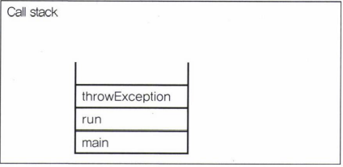

- [프로세스와 쓰레드](#프로세스와-쓰레드)
  - [멀티태스킹과 멀티쓰레딩](#멀티태스킹과-멀티쓰레딩)
  - [멀티쓰레딩의 장단점](#멀티쓰레딩의-장단점)
- [쓰레드의 구현과 실행](#쓰레드의-구현과-실행)
  - [Thread의 실행 - start()](#thread의-실행---start)
- [start()와 run()](#start와-run)
  - [main쓰레드](#main쓰레드)
- [싱글쓰레드와 멀티쓰레드](#싱글쓰레드와-멀티쓰레드)
- [쓰레드의 우선순위](#쓰레드의-우선순위)
- [쓰레드 그룹(Thread group)](#쓰레드-그룹thread-group)
- [데몬 쓰레드(demon thread)](#데몬-쓰레드demon-thread)
- [쓰레드의 실행제어](#쓰레드의-실행제어)
  - [sleep(long millis) - 일정시간동안 쓰레드를 멈추게 한다](#sleeplong-millis---일정시간동안-쓰레드를-멈추게-한다)
  - [interrupt()와 interrupted() - 쓰레드의 작업을 취소한다](#interrupt와-interrupted---쓰레드의-작업을-취소한다)
  - [suspend(), resume(), stop()](#suspend-resume-stop)

---

# 프로세스와 쓰레드

프로세스

- 실행 중인 프로그램
- OS로부터 메모리를 할당받아 프로세스가 된다.
- 쓰레드
  - 자원을 이용해서 실제로 작업을 수행하는 것
  - 둘 이상의 쓰레드
    - 멀티 쓰레드 프로세스

## 멀티태스킹과 멀티쓰레딩

멀티태스킹

- 여러 개의 프로세스가 동시에 실행

멀티쓰레딩

- 하나의 프로세스 내에서 여러 쓰레드가 동시에 작업을 수행

## 멀티쓰레딩의 장단점

장점

- CPU 사용률 향상
- 자원 효율적 사용
- 사용자에 대한 응답성 향상
- 작업 분리, 코드 간결

단점

- 동기화(synchronization)
- 교착상태(deadlock)
  - 두 쓰레드가 자원을 점유한 상태에서 서로 상대편이 점유한 자원을 사용하려고 기다리느라 진행이 멈춰있는 상태

---

# 쓰레드의 구현과 실행

- Thread클래스를 상속
  - 다른 클래스를 상속 받을 수 없다.

```java
class MyThread extend Thread{ 
    public void run(){/*작업 내용*/} //Thread클래스의 run()을 오버라이딩
}

```

- Runnable인터페이스 구현
  - 재사용성이 높다.
  - 코드의 일관성 유지 가능
  - 오로지 run()만 정의되어 있다.

```java
public interface Runnable{
    public abstract void run();
}
```

```java
class MyThread implements Runnable{
    public void run(){/*작업 내용*/} //Runnable인터페이스의 run()을 구현
}
```

- run()의 모통을 만들어주면 된다.

```java
package YJ13;

public class YJ13_1 {

 public static void main(String[] args) {
  YJ13_1_1 t1 = new YJ13_1_1();

  Runnable r = new YJ13_1_2();
  Thread t2 = new Thread(r);//생성자 Thread(Runnable target)
        //Thread t2 = new Thread(new YJ13_1_2()); 로 줄일 수 있다.

  t1.start();
  t2.start();
 }

}

class YJ13_1_1 extends Thread{
 public void run() {
  for(int i = 0; i < 5; i++) {
   System.out.println(getName()); //조상인 Thread의 getName()을 호출
  }
 }
}

class YJ13_1_2 implements Runnable{
 public void run() {
  for(int i = 0; i < 5; i++) {
   //Thread.currentThread() : 현재 실행중인 Thread의 참조를 반환
   System.out.println(Thread.currentThread().getName()); //getName() : 쓰레드의 이름을 반환
  }
 }

}

<Console>
Thread-0
Thread-0
Thread-0
Thread-0
Thread-0
Thread-1
Thread-1
Thread-1
Thread-1
Thread-1
```

- Runnable인터페이스를 구현한 경우, Runnable인터페이스를 구현한 클래스의 인스턴스를 생성하고, 이 인스턴스를 Thread클래스의 생성자의 매개변수로 제공해야 한다.
  - run()을 호출하면 참조변수 r을 통해서 Runnable인터페이스를 구현한 인터페이스의 run()이 호출된다.
    - 오버라이딩 할 필요가 없다.

```java
public class Thread{
    private Runnable r; //Runnable을 구현한 클래스의 인스턴스를 참조하기 위한 변수
    public Thread(Runnable r){
        this.r = r;
    }

    public void run(){
        if(r! = null) r.run(); //Runnable인터페이스를 구현한 인스턴스의 run()을 호출
    }
}
```

- Thread클래스를 상속받으면, 자손 클래스에서 조상인 Thread클래스의 메서드를 직접 호출 가능
- Runnable을 구현하면, Thread클래스의 static메서드인 currentThread()를 호출하여 쓰레드에 대한 참조를 얻어 와야만 호출이 가능하다.
  - Runnable을 구현한 클래스의 멤버는 run() 뿐이기 때문에 Thread클래스의 getName()을 호출하려면
    - Thread.currentThread.getName()을 써야 한다.

생성자나 메서드를 통해 쓰레드의 이름을 변경할 수 있다.

```java
Thread(Runnable target, String name)
Thread(String name)
void setName(String name)
```

## Thread의 실행 - start()

start()를 호출해야만 쓰레드가 실행된다.

- 자신의 차례가 와야 한다.
  - OS의 스케쥴러가 결정

한번 종료된 쓰레드는 다시 실행할 수 없다.

- 더 실행하려면 새로운 쓰레드를 생성하고 start()

```java
ThreadEx1_1 t1 = new ThreadEx1_1();
t1.start();

t1 = new ThreadEx1_1(); //  Thread 다시 생성
t1.start();
```

---

# start()와 run()

run()

- main메서드에서 run()을 호출하는 것은 생성된 쓰레드를 실행시키는 것이 아니라 단순히 클래스에 선언된 메서드를 호출하는 것


start()

- 새로운 쓰레드가 작업을 실행하는데 필요한 호출스택(call stack)을 생성한 다음에 run()을 호출
  - 생성된 호출스택에 run()이 첫 번째로 올라간다.
  - 새로운 쓰레드를 생성하고 실행시킬 때마다 새로운 호출스택이 생성되고 쓰레드가 종료되면 작업에 사용된 호출스택은 소멸


## main쓰레드

main메서드의 작업을 수행하는 쓰레드

- main메서드가 수행을 마쳤더라도 실행 중인 사용자 쓰레드가 하나도 없을 때 프로그램은 종료된다.

```java
package YJ13;

public class YJ13_2 {

 public static void main(String[] args) throws Exception {
  YJ13_2_1 t1 = new YJ13_2_1();
  t1.start();
 }
}

class YJ13_2_1 extends Thread{
 public void run() {
  throwException();
 }

 public void throwException(){
  try {
   throw new Exception();
  } catch (Exception e) {
   e.printStackTrace();
  }
 }
}

<Console>
java.lang.Exception
 at YJ13.YJ13_2_1.throwException(YJ13_2.java:18)
 at YJ13.YJ13_2_1.run(YJ13_2.java:13)
```

- 한 쓰레드가 예외가 발생해서 종료되어도 다른 쓰레드의 실행에는 영향을 미치지 않는다.
- main Thread가 start()를 호출하고, 새로운 호출 스택이 생성되면 거기서 run()메서드가 호출 스택에 올라가고 예외가 발생하는데, 이것에 구애받지 않고 main메서드의 호출스택은 main Thread가 종료되면서 사라진다.


```java
package YJ13;

public class YJ13_3 {

 public static void main(String[] args) {
  MyThread m1 = new MyThread();
  m1.run();
 }

}

class MyThread extends Thread{
 public void run() {
  throwException();
 }

 public void throwException(){
  try {
   throw new Exception();
  } catch (Exception e) {
   e.printStackTrace();
  }
 }
}

<Console>
java.lang.Exception
 at YJ13.MyThread.throwException(YJ13_3.java:19)
 at YJ13.MyThread.run(YJ13_3.java:14)
 at YJ13.YJ13_3.main(YJ13_3.java:7)
```

- 이 예제는 start()가 아닌 run()을 호출했기 때문에 새로운 호출스택이 생성되지 않고, main thread의 호출스택에서 run()이 쌓이는 것이다.



---

# 싱글쓰레드와 멀티쓰레드

싱글쓰레드보다 멀티쓰레드가 시간이 더 걸린다.

- context switching에 시간이 걸리기 때문이다.
  - 작업 전환을 할 때는 현재 진행 중인 작업의 상태를 저장하고 읽어는 시간이 소요되는 것

```java
package YJ13;

public class YJ13_4 {
 public static void main(String[] args) {
  long startTime = System.currentTimeMillis();

  //수행시간을 측정하기 쉽게 "-"대신 'new String()'을 사용해서 수행속도를 늦췄다.
  for(int i = 0; i < 300; i++) System.out.printf("%s", new String("-"));
  System.out.print("소요시간1: " + (System.currentTimeMillis() - startTime));

  for(int i = 0; i < 300; i++) System.out.printf("%s", new String("|"));
  System.out.print("소요시간2: " + (System.currentTimeMillis() - startTime));
 }
}

<Console>
------------------------------------------------------------------------------------------------------------------------------------------------------------------------------------------------------------------------------------------------------------------------------------------------------------소요시간1: 21||||||||||||||||||||||||||||||||||||||||||||||||||||||||||||||||||||||||||||||||||||||||||||||||||||||||||||||||||||||||||||||||||||||||||||||||||||||||||||||||||||||||||||||||||||||||||||||||||||||||||||||||||||||||||||||||||||||||||||||||||||||||||||||||||||||||||||||||||||||||||||||||||||||||||||소요시간2: 32
```

- 싱글쓰레드이기 떄문에 하나의 작업이 끝나고 다음 작업을 실행하는 것을 알 수 있다.

```java
package YJ13;

public class YJ13_5 {
 static long startTime = 0;

 public static void main(String[] args) {
  MyThread1 m1 = new MyThread1();
  m1.start();

  startTime = System.currentTimeMillis();

  //수행시간을 측정하기 쉽게 "-"대신 'new String()'을 사용해서 수행속도를 늦췄다.
  for(int i = 0; i < 300; i++) System.out.printf("%s", new String("-"));
  System.out.print("소요시간1: " + (System.currentTimeMillis() - startTime));
 }
}

class MyThread1 extends Thread{
 public void run() {
  for(int i = 0; i < 300; i++) System.out.printf("%s", new String("|"));
  System.out.print("소요시간2: " + (System.currentTimeMillis() - YJ13_5.startTime));
 }
}

<Console>
-----------------------------------------------------------------------------||||||||||||||||||||||||||||||||||||||||||||||||||||||||||||||||||||||||||||||||||||||||||||||||||||||||||||||||||||||||||||||||||||||||||||||||||||||||------|||||||||||||||||||||||||||||||||||||||||-----|||||||||---------------------------------------------------------------------------|||||||||||||||||------------------------------------------------------------------------------------------------------------|||||||||||||||||||||||||||||||||||||||||||||||||||||||||||||||||||||||||||||||||-----------------------------소요시간1: 32소요시간2: 31
```

- 멀티쓰레드가 소요시간이 더 많이 걸리는 이유
  - 작업 전환 시간
  - 한 쓰레드가 화면에 출력하고 있는 동안 다른 쓰레드는 출력이 끝나기를 기다리면서 걸리는 대기 시간

>병행(concurrent)
>
>- 여러 쓰레드가 여러 작업을 동시에 진해

>병렬(parallel)
>
>- 하나의 작업을 여러 쓰레드가 나눠서 처리

- 멀티쓰레드가 싱글쓰레드보다 유리
  - 두 쓰레드가 서로 다른 자원을 사용하는 작업

```java
package YJ13;

import javax.swing.JOptionPane;

public class YJ13_6 {

 public static void main(String[] args) {
  String input = JOptionPane.showInputDialog("아무 값이나 입력하세요.");
  System.out.println("입력하신 값은 " + input + "입니다.");
  
  for(int i = 10; i > 0; i--) {
   System.out.println(i);
   try {
    Thread.sleep(1000); //1초 지연 지간
   } catch (Exception e) {
    e.printStackTrace();
   }
  }
  System.out.println("종료");
 }

}

<Console>
입력하신 값은 aaa입니다.
10
9
8
7
6
5
4
3
2
1
종료
```

- 하나의 쓰레드 사용
  - 사용자의 입력을 받지 않으면 그 다음 작업은 실행되지 않는다.

```java
package YJ13;

import javax.swing.JOptionPane;

public class YJ13_07 {
 public static void main(String[] args) {
  MyThread2 m2 = new MyThread2();
  m2.start();

  String input = JOptionPane.showInputDialog("아무 값이나 입력하세요.");
  System.out.println("입력하신 값은 " + input + "입니다.");
 }
}

class MyThread2 extends Thread{
 public void run() {
  for(int i = 10; i > 0; i--) {
   System.out.println(i);

   try {
    sleep(1000);
   } catch (Exception e) {
    e.printStackTrace();
   }
  }
 }
}

<Console>
10
9
8
7
입력하신 값은 aaa입니다.
6
5
4
3
2
1
```

- 멀티쓰레드를 사용했으므로, 사용자의 입력과 상관없이 숫자가 출력된다.

---

# 쓰레드의 우선순위

쓰레드가 수행하는 작업의 중요도를 부여해서 특정 쓰레드가 더 많은 작업시간을 갖도록 할 수 있다.

- 우선순위는 1 ~ 10이다.

```java
void setPriority(int newPriority) //쓰레드의 우선순위를 지정한 값으로 변경한다.
int getPriority() //쓰레드의 우선순위를 반환

public static final int MAX_PRIORITY = 10 //최대 우선 순위
public static final int MIN_PRIORITY = 1 //최소 우선 순위
public static final int NORM_PRIORITY = 5 //보통 우선 순위

```java
package YJ13;

public class YJ13_08 {
 public static void main(String[] args) {
  MyThread3 m3 = new MyThread3();
  MyThread4 m4 = new MyThread4();
  
  m3.setPriority(7);
  
  System.out.println("Priority of m3(-) : " + m3.getPriority());
  System.out.println("Priority of m4(|) : " + m4.getPriority());
  
  m3.start();
  m4.start();
 }
}

class MyThread3 extends Thread{
 public void run() {
  for(int i = 0; i < 300; i++) {
   System.out.print("-");
   for(int j = 0; j < 10000000; j++);// 작업을 지연시키는 for문
  }
 }
}

class MyThread4 extends Thread{
 public void run() {
  for(int i = 0; i < 300; i++) {
   System.out.print("|");
   for(int j = 0; j < 10000000; j++);
  }
 }
}

<Console>
Priority of m3(-) : 7
Priority of m4(|) : 5
-||-||||||------------------------------------------------------------------------------------------------|----------------------------------------------------------------------------------------------------------------------------------------------------------------------------------------------------------|||||||||||||||||||||||||||||||||||||||||||||||||||||||||||||||||||||||||||||||||||||||||||||||||||||||||||||||||||||||||||||||||||||||||||||||||||||||||||||||||||||||||||||||||||||||||||||||||||||||||||||||||||||||||||||||||||||||||||||||||||||||||||||||||||||||||||||||||||||||||||||||||||
```

---

# 쓰레드 그룹(Thread group)

서로 관련된 쓰레드를 그룹으로 다루기 위한 것

- 쓰레드 그룹 안에 다른 쓰레드 그룹을 포함 시킬 수 있다.
- 자신이 속한 쓰레드 그룹이나 하위 쓰레드 그룹은 변경할 수 있지만 다른 쓰레드 그룹의 쓰레드를 변경할 수는 없다.


쓰레드를 쓰레드 그룹에 포함시키려면 Thread의 생성자를 이용해야 한다.

```java
Thread(ThreadGroup group, String name)
Thread(ThreadGroup group, Runnable target)
Thread(ThreadGroup group, Runnable target, String name)
Thread(ThreadGroup group, Runnable target, String name, long stackSize)
```

- 모든 쓰레드는 반드시 쓰레드 그룹에 포함되어 있어야 한다.
  - 그룹을 지정하는 생성자를 사용하지 않는 쓰레드는 기본적으로 자신을 생성한 쓰레드와 같은 쓰레드 그룹에 속하게 된다.
- JVM은 main과 system이라는 쓰레드 그룹을 만들고 JVM운영에 필요한 쓰레드들을 생성해서 이 그룹에 포함시킨다.
  - main
    - main메서드를 수행하는 쓰레드가 그룹에 속한다.
  - system
    - 가비지컬렉션을 수행하는 Finalizer쓰레드가 속한다.

```java
ThreadGroup getThreadGroup() 
자신이 속한 쓰레드 그룹을 반환

void uncaughtException(Thread t, Throwable e) 
쓰레드 그룹의 쓰레드가 처리되지 않은 예외에 의해 실행이 종료되었을 때, JVM에 의해 이 메서드가 자동적으로 호출된다.
```

```java
package YJ13;

public class YJ13_09 {
 public static void main(String[] args) {
  ThreadGroup main = Thread.currentThread().getThreadGroup();
  ThreadGroup g1 = new ThreadGroup("Group1");
  ThreadGroup g2 = new ThreadGroup("Group2");

  //ThreadGroup(ThreadGroup parent, String name)
  ThreadGroup sg1 = new ThreadGroup(g1, "SubGroup1");

  g1.setMaxPriority(3); //g1의 최대우선순위를 3으로 변경, 쓰레드가 그룹에 추가되기 이전에 호출되어야 한다.

  Runnable r = new Runnable() {
   public void run() {
    try {
     Thread.sleep(1000); //쓰레드 그룹에 대한 정보를 출력하기도 전에 쓰레드가 종료될 수 있으므로, sleep()을 호출하여 1초간 멈추게 한다.
    } catch(InterruptedException e) {}

   }
  };

  //Thread(ThreadGroup tg, Runnable r, String name)
  new Thread(g1, r, "th1").start();
  new Thread(sg1, r, "th2").start();
  new Thread(g2, r, "th3").start();
        //참조변수 없이 쓰레드를 생성해서 바로 실행, 이 쓰레드가 가비지 컬렉터의 제거대상이 되는 것이 아니고, 이 쓰레드의 참조가 ThreadGroup에 저장되어 있는 것이다.

  System.out.println(">>List of ThreadGroup : " + main.getName()
  + ", Active ThreadGroup: " + main.activeGroupCount()
  + ", Active Thread: " + main.activeCount());

  main.list(); //main쓰레드 그룹의 정보를 출력
 }//main
}//class

<Console>
>>List of ThreadGroup : main, Active ThreadGroup: 3, Active Thread: 4
java.lang.ThreadGroup[name=main,maxpri=10]
    Thread[main,5,main]
    java.lang.ThreadGroup[name=Group1,maxpri=3]
        Thread[th1,3,Group1]
        java.lang.ThreadGroup[name=SubGroup1,maxpri=3]
            Thread[th2,3,SubGroup1]
    java.lang.ThreadGroup[name=Group2,maxpri=10]
        Thread[th3,5,Group2]

```

```java
new Thread(g1, r, "th1").start();

가비지 컬렉터의 제거대상이 아니고 ThreadGroup에 쓰레드의 참조가 저장되어 있는 것이다. 위, 아래 코드는 같다.

Thread th1 = new Thread(g1, r, "th1");
th1.start();
```

---

# 데몬 쓰레드(demon thread)

다른 일반 쓰레드의 작업을 돕는 보조 쓰레드

- 일반 쓰레드가 모두 종료되면 데몬 쓰레드는 강제 종료된다.
- 예)
  - 가비지 컬렉터
  - 워드 프로세서의 자동저장
  - 화면자동갱신
- 데몬 쓰레드를 생성하고 실행하기 전에 setDemon(true)를 호출
- 데몬 쓰레드가 생성한 쓰레드는 자동적으로 데몬 쓰레드

```java
boolean isDemon()
쓰레드가 데몬쓰레드인지 확인

void setDemon(boolean on)
쓰레드를 데몬 쓰레드로 또는 사용자 쓰레드로 변경
매개변수 on값을 true로 지정하면 데몬 쓰레드가 된다.
```

```java
package YJ13;

public class YJ13_10 implements Runnable {
 static boolean autoSave = false;
 
 public static void main(String[] args) {
  Thread t = new Thread(new YJ13_10());
  t.setDaemon(true); //이 부분이 없으면 종료되지 않는다., setDemon메서드는 반드시 start()를 호출하기 전에 실행되어야 한다.
  t.start();
  
  for(int i = 1; i <= 10; i++) {
   try {

    Thread.sleep(1000);

   } catch (InterruptedException e) {}
   
   System.out.println(i);
   if(i == 5) autoSave = true;
   
  }//for
  
  System.out.println("프로그램 종료");
 }//main
 
 public void run() {
  while(true) {
   try {
    Thread.sleep(3000);//3초마다
   } catch (InterruptedException e) {}
   
   //autoSave의 값이 true면 autoSave()를 호출한다.
   if(autoSave) {
    autoSave();
   }
   
  } 
 }//run()
 
 public void autoSave() {
  System.out.println("작업 파일 자동 저장");
 }
}//class

// <Console>
// 1
// 2
// 3
// 4
// 5
// 작업 파일 자동 저장
// 6
// 7
// 8
// 작업 파일 자동 저장
// 9
// 10
// 프로그램 종료
```

t를 setDemon으로 데몬 쓰레드화 하지 않는다면, 프로그램은 끝나지 않는다.

- t의 main메소드는 끝나지만, 다른 호출 스택에 있는 run(), autoSave()메서드는 끝을 내는 방법이 없기 때문이다.
- 그래서 데몬 쓰레드로 지정해서 main이 끝나면 자동으로 종료되게 하는 것

```java
package YJ13;

import java.util.Iterator;
import java.util.Map;

public class YJ13_11 {

 public static void main(String[] args) throws Exception {
  MyThread6 m1 = new MyThread6("Thread1");
  MyThread7 m2 = new MyThread7("Thread2");
  m1.start();
  m2.start();
 }//main
}//class

class MyThread6 extends Thread {
 MyThread6(String name){
  super(name);
 }//생성자

 public void run() {
  try {
   sleep(5000);
  } catch (InterruptedException e) {}
 }//run()
}//class

class MyThread7 extends Thread {

 MyThread7(String name){
  super(name);
 }//생성자

 public void run() {
  Map map = getAllStackTraces(); //실행 중 또는 대기상태, 즉 작업이 완료되지 않은 모든 쓰레드의 호출스택 출력
  Iterator it = map.keySet().iterator();

  int x = 0;
  while(it.hasNext()) {
   Object obj = it.next();
   Thread t = (Thread)obj;
   StackTraceElement[] ste = (StackTraceElement[])(map.get(obj));

   System.out.println( "[" + ++x + "] name : " + t.getName()
   + ", group : " + t.getThreadGroup().getName()
   + ", daemon : " + t.isDaemon());
   for(int i = 0; i < ste.length; i++) {
    System.out.println(ste[i]);
   }

   System.out.println();
  }//while
 }//run()

}//class

<Console>
[1] name : Finalizer, group : system, daemon : true
java.base@17.0.1/java.lang.Object.wait(Native Method)
java.base@17.0.1/java.lang.ref.ReferenceQueue.remove(ReferenceQueue.java:155)
java.base@17.0.1/java.lang.ref.ReferenceQueue.remove(ReferenceQueue.java:176)
java.base@17.0.1/java.lang.ref.Finalizer$FinalizerThread.run(Finalizer.java:172)

[2] name : Signal Dispatcher, group : system, daemon : true

[3] name : Notification Thread, group : system, daemon : true

[4] name : Thread1, group : main, daemon : false
java.base@17.0.1/java.lang.Thread.sleep(Native Method)
app//YJ13.MyThread6.run(YJ13_11.java:23)

[5] name : Thread2, group : main, daemon : false
java.base@17.0.1/java.lang.Thread.dumpThreads(Native Method)
java.base@17.0.1/java.lang.Thread.getAllStackTraces(Thread.java:1662)
app//YJ13.MyThread7.run(YJ13_11.java:35)

[6] name : Reference Handler, group : system, daemon : true
java.base@17.0.1/java.lang.ref.Reference.waitForReferencePendingList(Native Method)
java.base@17.0.1/java.lang.ref.Reference.processPendingReferences(Reference.java:253)
java.base@17.0.1/java.lang.ref.Reference$ReferenceHandler.run(Reference.java:215)

[7] name : Common-Cleaner, group : InnocuousThreadGroup, daemon : true
java.base@17.0.1/java.lang.Object.wait(Native Method)
java.base@17.0.1/java.lang.ref.ReferenceQueue.remove(ReferenceQueue.java:155)
java.base@17.0.1/jdk.internal.ref.CleanerImpl.run(CleanerImpl.java:140)
java.base@17.0.1/java.lang.Thread.run(Thread.java:833)
java.base@17.0.1/jdk.internal.misc.InnocuousThread.run(InnocuousThread.java:162)

[8] name : Attach Listener, group : system, daemon : true
```

>main쓰레드는 이미 종료되었기 때문에 결과에 포함되지 않았다.

- JVM
  - 보조작을 수행하는 데몬 쓰레드들을 자동적으로 생성해서 실행
    - 가비지컬렉션, 이벤트처리, 그래픽처리와 같이 프로그램이 실행되는 데 필요
    - 이 데몬 쓰레드들은 system쓰레드 그룹 또는 main쓰레드 그룹에 속한다.

---

# 쓰레드의 실행제어

쓰레드의 스케쥴링을 잘하기 위해서는 쓰레드의 상태와 관련 메서드를 잘 알아야 한다.

- 쓰레드 스케쥴링과 관련된 메서드


- 쓰레드의 상태


- 쓰레드의 상태 변화 과정


## sleep(long millis) - 일정시간동안 쓰레드를 멈추게 한다

```java
static void sleep(ling millis)
static void sleep(ling millis, int nanos)
```

- sleep()에 의해 일시정지 상태가 된 쓰레드는 지정된 시간이 다 되거나 interrupt()가 호출되면(InterruptedException발생), 실행대기 상태가 된다.
  - 그래서 sleep()을 호출할 때는 항상 try-catch문으로 예외 처리를 해야 한다.

```java
void delay(long millis){
    try {
        Thread.sleep(millis);
    } catch(InterruptedException e){}
}
```

```java
package YJ13;

public class YJ13_12 {
 public static void main(String[] args) {
  MyThread8 m8 = new MyThread8();
  MyThread9 m9 = new MyThread9();
  m8.start();
  m9.start();
 
  try {
   m8.sleep(2000);
  } catch (Exception e) {}
  
  System.out.println("main 종료");
 }//main
}//class

class MyThread8 extends Thread{
 public void run() {
  for(int i = 0; i < 300; i++) System.out.print("-");
 System.out.println("m8 종료");
 }//run
}//class

class MyThread9 extends Thread{
 public void run() {
  for(int i = 0; i < 300; i++) System.out.print("|");
 System.out.println("m9 종료");
 }
}

<Console>
||||||||||||||||||||||||||||||||||||||||||||||||----------------------------------------------------------------------------------------------||||||||||||||||||||||||||||||||||||||||||||||||||||||||||||||||||||||||||||||||||||||||||||||||||||------------------------------------------------------------------------------------------------------------------------------||||||||||||||||||||||--------------------------------------------------------------------------------m8 종료
||||||||||||||||||||||||||||||||||||||||||||||||||||||||||||||||||||||||||||||||||||||||||||||||||||||||||||||||||||||||||||||||||m9 종료
main 종료
```

- m8, m9, main순으로 종료된다.
- sleep()은 static으로 선언되어 있으며 참조변수를 이용해서 호출하기 보다는 Thread.sleep(2000);과 같이 한다.

## interrupt()와 interrupted() - 쓰레드의 작업을 취소한다

interrupt()

- 쓰레드에게 작업을 멈추라고 요청
- 강제로 종료시키지는 못한다.
- 그저 interrupted상태(인스턴스 변수)를 바꾸는 것

interrupted()

- interrupte()가 호출되었는지 알려준다.
- interrupt()가 호출되지 않는다면 false, 호출된다면 true

```java
void interrupt()
쓰레드의 interrupted상태를 false에서 true로 변경

boolean isInterrupted() 
쓰레드의 interrupted상태를 반환

static bollean interrupted()
현재 쓰레드의 interrupted상태를 반환 후, false로 변경
```

```java
package YJ13;

import javax.swing.JOptionPane;

public class YJ13_13 {
 public static void main(String[] args) throws Exception {
  MyThread10 m10 = new MyThread10();
  m10.start();

  String input = JOptionPane.showInputDialog("아무 값이나 입력하세요.");
  System.out.println("입력하신 값은 " + input + "입니다.");
  m10.interrupt(); //interrupt()를 호출하면, interrupted상태가 true가 된다.
  System.out.println("isInterrupted(): " + m10.isInterrupted());
 }//main
}//class

class MyThread10 extends Thread {
 public void run() {
  int i = 10;

  while(i != 0 && !isInterrupted()) {
   System.out.println(i--);
   try {
    Thread.sleep(1000);
   } catch (InterruptedException e) {
    interrupt();
   }
  }//while
  System.out.println("카운트 종료");
 }//run
}//class

<Console>
10
9
8
7
입력하신 값은 111입니다.
isInterrupted(): true
카운트 종료
```

- sleep()에 의해 쓰레드가 잠시 멈췄을 떄, interrupt()를 호출하면 InterruptException이 발생되고 쓰레드의 interrupted상태는 false로 초기화된다.
  - catch블럭에 interrupt()를 추가로 넣어줘서 interrupted의 상태를 다시 true로 바꿔주면 된다.

## suspend(), resume(), stop()

suspend()

- sleep()처럼 쓰레드를 머춤
- 정지된 쓰레드는 resume()으로 다시 실행대기 상태
- 교착상태 일으키기 쉬움
  - deprecated

stop()

- 호출되는 즉시 쓰레드가 종료
- 교착상태 일으키기 쉬움
  - deprecated

```java
package YJ13;

public class YJ13_16 {
 public static void main(String[] args) {
  RunImp r1 = new RunImp();
  RunImp r2 = new RunImp();
  RunImp r3 = new RunImp();

  Thread th1 = new Thread(r1, "*");
  Thread th2 = new Thread(r2, "**");
  Thread th3 = new Thread(r3, "***");

  th1.start();
  th2.start();
  th3.start();

  try {
   Thread.sleep(2000);
   r1.suspend();
   Thread.sleep(2000);
   r2.suspend();
   Thread.sleep(3000);
   r1.resume();
   Thread.sleep(3000);
   r1.stop();
   r2.stop();
   Thread.sleep(2000);
   r3.stop();
  } catch (InterruptedException e) {}
 }//main
}//class

class RunImp implements Runnable {
 volatile boolean suspended = false;
 volatile boolean stopped = false;

 public void run() {
  while(!stopped) {
   if(!suspended) {
    System.out.println(Thread.currentThread().getName());

    try {
     Thread.sleep(1000);
    } catch (InterruptedException e) {}
   }//if
  }//while
  System.out.println(Thread.currentThread().getName() + " - stopped");
 }//run
 public void suspend() {suspended = true;}
 public void stop() { stopped = true;}
 public void resume() {suspended = false;}
}//class

<Console>
**
*
***
**
***
*
***
**
**
***
***
***
***
*
***
*
***
*
***
* - stopped
** - stopped
***
***
*** - stopped

```
