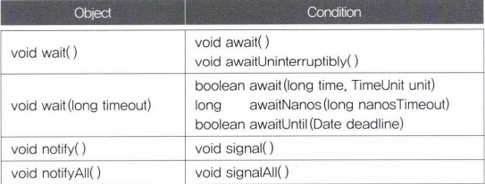
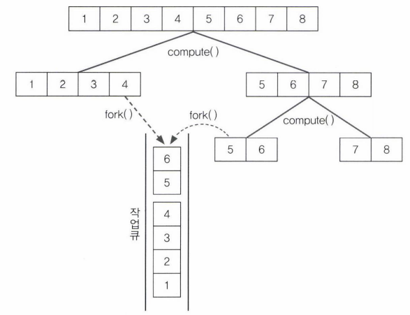
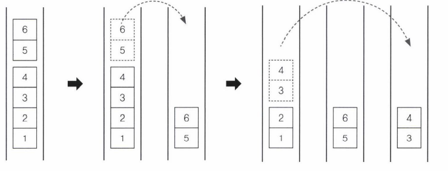

- [쓰레드의 실행제어](#쓰레드의-실행제어)
  - [yield() - 다른 쓰레드에게 양보한다](#yield---다른-쓰레드에게-양보한다)
  - [join() - 다른 쓰레드의 작업을 기다린다](#join---다른-쓰레드의-작업을-기다린다)
- [쓰레드의 동기화](#쓰레드의-동기화)
  - [synchronized를 이용한 동기화](#synchronized를-이용한-동기화)
- [wait()과 notify()](#wait과-notify)
  - [기아 현상과 경쟁 상태](#기아-현상과-경쟁-상태)
- [Lock과 Condition을 이용한 동기화](#lock과-condition을-이용한-동기화)
  - [ReentrantLock의 생성자](#reentrantlock의-생성자)
  - [ReentrantLock과 Condition](#reentrantlock과-condition)
- [volatile](#volatile)
  - [volatile로 long과 double을 원자화](#volatile로-long과-double을-원자화)
- [fork & join 프레임웍](#fork--join-프레임웍)
  - [coumpute()의 구현](#coumpute의-구현)
  - [다른 쓰레드의 작업 훔쳐오기](#다른-쓰레드의-작업-훔쳐오기)
  - [fork()와 join()](#fork와-join)

---

# 쓰레드의 실행제어

## yield() - 다른 쓰레드에게 양보한다

쓰레드 자신에게 주어진 실행시간을 다음 차례의 쓰레드에게 양보한다.

```java
package YJ13;

public class YJ13_18 {
 public static void main(String[] args) {

  MyThread11 th1 = new MyThread11("*");
  MyThread11 th2 = new MyThread11("**");
  MyThread11 th3 = new MyThread11("***");

  th1.start();
  th2.start();
  th3.start();

  try {
   Thread.sleep(2000);
   th1.suspend();
   Thread.sleep(2000);
   th1.suspend();
   Thread.sleep(3000);
   th1.resume();
   Thread.sleep(3000);
   th1.stop();
   th2.stop();
   Thread.sleep(2000);
   th3.stop();
  } catch (InterruptedException e) {}
 }//main
}//class

class MyThread11 implements Runnable {
 boolean suspended = false;
 boolean stopped = false;

 Thread th;
 
 MyThread11(String name){
  th = new Thread(this, name); //Thread(Runnable r, String name)
 }
 
 public void run() {
  String name = th.getName();
  
  while(!stopped) {
   if(!suspended) {
    System.out.println(name);

    try {
     Thread.sleep(1000);
    } catch (InterruptedException e) {
     System.out.println(name + " - interrupted");
    }
   } else {
    Thread.yield();
   }//if
  }//while
  System.out.println(name + " - stopped");
 }//run
 
 public void suspend() {
  suspended = true;
  th.interrupt();
  System.out.println(th.getName() + " - interrupt() by suspend()");
 }//suspend
 
 public void stop() { 
  stopped = true;
  th.interrupt();
  System.out.println(th.getName() + " - interrupt() by stop()");

 }//stop
 
 public void resume() {suspended = false;}
 public void start() {th.start(); }
}//class

<Console>
*
**
***
*
**
***
* - interrupt() by suspend()
* - interrupted
**
***
***
**
* - interrupt() by suspend()
***
**
**
***
**
***
*
* - interrupted
*
**
***
*
**
***
*
**
***
* - interrupt() by stop()
* - interrupted
* - stopped
** - interrupt() by stop()
** - interrupted
** - stopped
***
***
*** - interrupt() by stop()
*** - interrupted
*** - stopped
```

- suspended가 true라면, 즉 잠시 실행을 멈추게 한 상태라면, 쓰레드는 주어진 실행시간을 그저 while문을 의미없이 돌면서 낭비한다.
  - 바쁜 대기 상태(busy-waiting)
    - yield()를 호출해서 다른 쓰레드에게 양보
- suspend와 stop메서드에 interrupt()추가
  - suspend와 stop메서드가 호출되었는데 sleep상태라면 바로 적용되지가 않으므로 interrupt로 sleep상태에서 예외를 일으킨 후에 바로 suspend나 stop이 적용되게 하는 것

## join() - 다른 쓰레드의 작업을 기다린다

쓰레드 자신이 하던 작업을 잠시 멈추가 다른 쓰레드의 작업을 지정된 시간동안 기다린다.

```SQL
void join()
void join(long millis)
void join(long millis, int nanos)
```

- 시간을 지정하지 않으면, 다른 쓰레드가 작업을 마칠 때까지 기다린다.
- 작업 중에 다른 쓰레드의 작업이 먼저 수행되어야 한다면, join을 사용
- join도 sleep처럼 interrupt에 의해 대기상태에서 벗어난다.
  - try-catch문으로 감싸야한다.
  - sleep과 다른 점은 join()은 현재 쓰레드가 아닌 특정 쓰레드에 대해 동작
    - static메서드가 아니다.

```java
package YJ13;

public class YJ13_19 {
 static long startTime = 0;

 public static void main(String[] args) {
  MyThread12 m1 = new MyThread12();
  MyThread13 m2 = new MyThread13();
  m1.start();
  m2.start();

  startTime = System.currentTimeMillis();

  try {
   m1.join(); //main쓰레드가 m1의 작업이 끝날 때까지 기다린다.
   m2.join(); //main쓰레드가 m2의 작업이 끝날 때까지 기다린다.
  } catch (Exception e) {}
  System.out.print("소요시간 : " + (System.currentTimeMillis() - startTime));
 }//main 
}//YJ13_19 class

class MyThread12 extends Thread{
 public void run() {
  for(int i = 0; i < 300; i++) {
   System.out.print(new String("-"));
  }
 }//run
}//MyThread class

class MyThread13 extends Thread{
 public void run() {
  for(int i = 0; i < 300; i++) {
   System.out.print(new String("|"));
  }
 }//run
}

<Console>
|||||||||||||||||||||||||||||||||||||||||||||||||||||||||||||------|---------------------------------------------------------------------------------------------------------------------------------------------------------------------------------------------------------------------------------------------------------------------------------||||||||||||||||||||||||||||||||||||||||||||||||||||||||||||||||||||||||||||||||||||||||||||||||||||||||||||||||||||||||||||||||||||||||||||||||||||||||||||||||||||||||||||||||||||||||||||||||||||||||||||||||||||||||||||||||||||||||||||||---------------------소요시간 : 62
```

- join을 사용하지 않으면 main쓰레드는 바로 종료
  - m1, m2가 끝날 때까지 main이 기다린다.
  - 소요시간이 맨 마지막에 출력된다.

---

# 쓰레드의 동기화

한 쓰레드가 진행 중인 작업을 다른 쓰레드가 간섭하지 못하도록 막는 것을 '쓰레드의 동기화(synchroniztion)'라고 한다.

## synchronized를 이용한 동기화

임계영역을 설정하는데 사용된다.

```java
1. 메서드 전체를 임계 영역으로 지정
메서드가 시작되면 lock을 얻어 작업을 수행, 메서드가 종료되면 lock을 반환

public synchronized void calcSum(){
    //...임계영역
}


2. 특정한 영역을 임계 영역으로 지정
메서드 내의 코드 일부를 블럭{}으로 감싸고 블럭 앞에 키워드를 붙인다.
- 이때 참조변수는 락을 걸고자하는 객체를 참조하는 것
- 블럭을 들어갈때 lock을 얻고, 나갈때 반환

synchronized(객체의 참조변수){
    //...임계영역
}
```

- 두 방법 모두 lock의 획득과 방법이 자동적

```java
package YJ13;

public class YJ13_21 {

 public static void main(String[] args) {
  Runnable r = new MyRunnable();
  new Thread(r).start(); //ThreadGroup에 의해 참조되므로 gc대상이 아니다.
  new Thread(r).start(); //ThreadGroup에 의해 참조되므로 gc대상이 아니다.
 }//main
}//YJ13_21 class

class Account {
 private int balance = 1000;

 public int getBalance() {
  return balance;
 }//getBalance

 public void withdraw(int money) {
  if(balance >= money) {
   try {
    Thread.sleep(1000);
   } catch (InterruptedException e) {}

   balance -= money;
  }
 }//withdraw
}//Account class

class MyRunnable implements Runnable {
 Account acc = new Account();

 public void run() {
  while(acc.getBalance() > 0) {
   //100,200,300 중의 한 값을 임의로 선택해서 출금(withdraw)
   int money = (int)(Math.random() * 3 + 1) * 100;
   acc.withdraw(money);
   System.out.println("balance: " + acc.getBalance());
  }
 }//run
}//MyRunnable class

<Console>
balance: 500
balance: 500
balance: 200
balance: 100
balance: 0
balance: -100
```

- 잔고가 음수값이 나왔다.
  - 두 쓰레드가 같은 if문을 통과하는데, 한 쓰레드 출금하기 직전에 다른 쓰레드가 끼어들어서 먼저 출금했기 때문이다.
    - 그래서 음수가 되었음에도 출금을 하고 작업을 마친 것이다.
  - 이를 해결하기 위해서는 메서드에 synchronized를 추가해준다.

```java
package YJ13;

public class YJ13_22 {

 public static void main(String[] args) {
  Runnable r = new MyRunnable2();
  new Thread(r).start(); //ThreadGroup에 의해 참조되므로 gc대상이 아니다.
  new Thread(r).start(); //ThreadGroup에 의해 참조되므로 gc대상이 아니다.
 }//main
}//YJ13_21 class

class Account2 {
 private int balance = 1000;

 public int getBalance() {
  return balance;
 }//getBalance

 public synchronized void withdraw(int money) {
  if(balance >= money) {
   try {
    Thread.sleep(1000);
   } catch (InterruptedException e) {}

   balance -= money;
  }
 }//withdraw
}//Account class

class MyRunnable2 implements Runnable {
 Account2 acc = new Account2();

 public void run() {
  while(acc.getBalance() > 0) {
   //100,200,300 중의 한 값을 임의로 선택해서 출금(withdraw)
   int money = (int)(Math.random() * 3 + 1) * 100;
   acc.withdraw(money);
   System.out.println("balance: " + acc.getBalance());
  }
 }//run
}//MyRunnable class

<Console>
balance: 700
balance: 600
balance: 300
balance: 200
balance: 200
balance: 100
balance: 0
balance: 0
```

---

# wait()과 notify()

동기화해서 공유 데이터를 보호하는건 좋지만, 너무 오래 점유하고 있으면 좋지 않다.
wait()

- 호출하면 쓰레드가 락을 반납하고 기다리게 한다.
  - 다른 쓰레드가 락을 얻어 해당 객체에 대한 작업 수행
- waiting pool에서 notify()를 기다린다.
- Object클래스

notify()

- 호출하면 작업을 중단했던 쓰레드가 다시 락을 얻어 작업을 진행한다.
  - 재진입
- Object클래스

```java
void wait()
void wait(long timeout) // 자동으로 notify()되는 것이라고 생각
void wait(long timeout, int nanos)
void notify()
void notifyAll()
```

```java
package YJ13;

import java.util.ArrayList;

public class YJ13_23 {

 public static void main(String[] args) throws Exception {
  Table table = new Table(); //여러 쓰레드가 공유하는 객체

  new Thread(new Cook(table), "COOK1").start();
  new Thread(new Customer(table, "donut"), "CUST1").start();
  new Thread(new Customer(table, "burger"), "CUST2").start();

  Thread.sleep(100); //강제 종료 시키기 전 0.1초 지연 시간
  System.exit(0);
 }//main
}//YJ13_23 class

class Customer implements Runnable {
 private Table table;
 private String food;

 Customer(Table table, String food){
  this.table = table;
  this.food = food;
 }//Customer

 public void run() {
  while(true) {
   try {
    Thread.sleep(10);
   } catch (InterruptedException e) {
    e.printStackTrace();
   }

   String name = Thread.currentThread().getName();

   if(eatFood()) System.out.println(name + " ate a " + food);
   else System.out.println(name + " failed to eat. :(");
  }//while
 }//run
 boolean eatFood() {return table.remove(food);}
}//Customer class

class Cook implements Runnable {
 private Table table;

 Cook(Table table) {this.table = table;}

 public void run() {
  while(true) {
   //임의의 요리를 하나 선택해서 table에 추가
   int idx = (int)(Math.random()*table.dishNum());
   table.add(table.dishNames[idx]);

   try {
    Thread.sleep(1);
   } catch (InterruptedException e) {
    e.printStackTrace();
   }
  }//while
 }//run
}//Cook class

class Table {
 String[] dishNames = {"donut", "donut", "burger"};//donut이 더 자주 나온다.
 final int MAX_FOOD = 6; //테이블에 놓을 수 있는 최대 음식의 개수

 private ArrayList<String> dishes = new ArrayList<>();

 public void add(String dish) {
  //테이블에 음식이 가득찼으면, 테이블에 음식을 추가하지 않는다.
  if(dishes.size() >= MAX_FOOD) return;
  dishes.add(dish);
  System.out.println("Dishes: " + dishes.toString());
 }//add

 public boolean remove(String dishName) {
  //지정된 요리와 일치하는 요리를 테이블에서 제거한다.
  for(int i = 0; i < dishes.size(); i++)
   if(dishName.equals(dishes.get(i))){
    dishes.remove(i);
    return true;
   }
  return false;
 }//remove

 public int dishNum() {return dishNames.length;}
}
```

- 두 가지의 예외가 발생할 수 있다.
  - ConcurrentModificationException
    - 요리사 쓰레드가 테이블에 음식을 놓는 도중에, 손님 쓰레드가 음식을 가져가려 했기 때문에 발생
  - IndexOutOfBoundsException
    - 손님 테이블가 마지막 남은 음식을 가져가는 도중에 다른 손님 쓰레드가 먼저 음식을 낚아채버려서 있지도 않은 음식을 제거하려했기 때문에 발생하는 예외

예외 제거 version

```java
package YJ13;

import java.util.ArrayList;

public class YJ13_24 {

 public static void main(String[] args) throws Exception {
  Table2 table = new Table2(); //여러 쓰레드가 공유하는 객체

  new Thread(new Cook2(table), "COOK1").start();
  new Thread(new Customer2(table, "donut"), "CUST1").start();
  new Thread(new Customer2(table, "burger"), "CUST2").start();

  Thread.sleep(5000); //강제 종료 시키기 전 0.1초 지연 시간
  System.exit(0);
 }//main
}//YJ13_23 class

class Customer2 implements Runnable {
 private Table2 table;
 private String food;

 Customer2(Table2 table, String food){
  this.table = table;
  this.food = food;
 }//Customer

 public void run() {
  while(true) {
   try {
    Thread.sleep(10);
   } catch (InterruptedException e) {
    e.printStackTrace();
   }

   String name = Thread.currentThread().getName();

   if(eatFood()) System.out.println(name + " ate a " + food);
   else System.out.println(name + " failed to eat. :(");
  }//while
 }//run
 boolean eatFood() {return table.remove(food);}
}//Customer class

class Cook2 implements Runnable {
 private Table2 table;

 Cook2(Table2 table) {this.table = table;}

 public void run() {
  while(true) {
   //임의의 요리를 하나 선택해서 table에 추가
   int idx = (int)(Math.random()*table.dishNum());
   table.add(table.dishNames[idx]);

   try {
    Thread.sleep(100);
   } catch (InterruptedException e) {
    e.printStackTrace();
   }
  }//while
 }//run
}//Cook class

class Table2 {
 String[] dishNames = {"donut", "donut", "burger"};//donut이 더 자주 나온다.
 final int MAX_FOOD = 6; //테이블에 놓을 수 있는 최대 음식의 개수

 private ArrayList<String> dishes = new ArrayList<>();

 public synchronized void add(String dish) { //synchronized 추가
  //테이블에 음식이 가득찼으면, 테이블에 음식을 추가하지 않는다.
  if(dishes.size() >= MAX_FOOD) return;
  dishes.add(dish);
  System.out.println("Dishes: " + dishes.toString());
 }//add

 public boolean remove(String dishName) {
  synchronized(this) {
   while(dishes.size() == 0) {
    String name = Thread.currentThread().getName();
    System.out.println(name + "is waiting");
    try {
     Thread.sleep(500);
    } catch (InterruptedException e) {}
   }//while

   //지정된 요리와 일치하는 요리를 테이블에서 제거한다.
   for(int i = 0; i < dishes.size(); i++)
    if(dishName.equals(dishes.get(i))){
     dishes.remove(i);
     return true;
    }//for
  }//synchronized
  return false;
 }//remove

 public int dishNum() {return dishNames.length;}
}
```

- 손님 쓰레드가 테이블 객체의 lock을 쥐고 기다리고 있기 때문에 요리사 쓰레드가 음식을 새로 추가하려해도 테이블 객체의 lock을 얻을 수 없어서 요리사 쓰레드가 음식을 추가하지 못한다.
  - 그래서 다른 손님도 계속 기다린다.

기다리기 없애는 version

```java
package YJ13;

import java.util.ArrayList;

public class YJ13_25 {

 public static void main(String[] args) throws Exception {
  Table2 table = new Table2(); //여러 쓰레드가 공유하는 객체

  new Thread(new Cook2(table), "COOK1").start();
  new Thread(new Customer2(table, "donut"), "CUST1").start();
  new Thread(new Customer2(table, "burger"), "CUST2").start();

  Thread.sleep(5000); //강제 종료 시키기 전 0.1초 지연 시간
  System.exit(0);
 }//main
}//YJ13_23 class

class Customer2 implements Runnable {
 private Table2 table;
 private String food;

 Customer2(Table2 table, String food){
  this.table = table;
  this.food = food;
 }//Customer

 public void run() {
  while(true) {
   try {
    Thread.sleep(100);
   } catch (InterruptedException e) {
    e.printStackTrace();
   }

   String name = Thread.currentThread().getName();

   table.remove(food);
   System.out.println(name + " ate a " + food);
  }//while
 }//run
}//Customer class

class Cook2 implements Runnable {
 private Table2 table;

 Cook2(Table2 table) {this.table = table;}

 public void run() {
  while(true) {
   //임의의 요리를 하나 선택해서 table에 추가
   int idx = (int)(Math.random()*table.dishNum());
   table.add(table.dishNames[idx]);

   try {
    Thread.sleep(10);
   } catch (InterruptedException e) {
    e.printStackTrace();
   }
  }//while
 }//run
}//Cook class

class Table2 {
 String[] dishNames = {"donut", "donut", "burger"};//donut이 더 자주 나온다.
 final int MAX_FOOD = 6; //테이블에 놓을 수 있는 최대 음식의 개수

 private ArrayList<String> dishes = new ArrayList<>();

 public synchronized void add(String dish) { //synchronized 추가
  //테이블에 음식이 가득찼으면, 테이블에 음식을 추가하지 않는다.
  while(dishes.size() >= MAX_FOOD) {
   String name = Thread.currentThread().getName();
   System.out.println(name + " is waiting.");
   
   try {
    wait();
    Thread.sleep(500);
   } catch (InterruptedException e) {
    e.printStackTrace();
   }
  }//while
  dishes.add(dish);
  notify(); //기다리고 있는 CUST를 깨운다. 음식이 추가되었기 때문에
  System.out.println("Dishes: " + dishes.toString());
 }//add

 public void remove(String dishName) {
  synchronized(this) {
   String name = Thread.currentThread().getName();
   while(dishes.size() == 0) {

    System.out.println(name + "is waiting");
    try {
     wait(); //CUST를 기다리라고 한다. 음식이 없기 때문에
     Thread.sleep(500);
    } catch (InterruptedException e) {}
   }//while
   
   while(true) {
    //지정된 요리와 일치하는 요리를 테이블에서 제거한다.
    for(int i = 0; i < dishes.size(); i++) {
     if(dishName.equals(dishes.get(i))){
      dishes.remove(i);
      notify();//잠자고 있는 COOK을 깨운다.
      return;
     }//if
   }//for
    
    try {
     System.out.println(name + " is waiting.");
     wait(); //원하는 음식이 없는 CUST쓰레드를 기다리게 한다.
     Thread.sleep(500);
    } catch (InterruptedException e) {
     e.printStackTrace();
    }
   }//while
  }//synchronized
 }//remove

 public int dishNum() {return dishNames.length;}
}
```

- 이 코드는 문제 없이 잘 돌아갈 것 같지만, waiting pool에 요리사 쓰레드와 손님 쓰레드가 같이 들어가는 문제가 발생한다.
  - 같은 waiting pool에 들어가기 때문에 요리사 자리에 손님이 들어갈 수도 있다는 뜻이다.

## 기아 현상과 경쟁 상태

위와 같은 현상에서 운이 나쁘면 요리사 쓰레드는 계속 통지를 받지 못하는 상황이 발생할 수 있다.

- 기아 현상(starvation)
  - notify()대신 notifyAll()을 사용한다.
    - 손님 쓰레드는 다시 모두 waiting pool에 들어가더라도 요리사 쓰레는 결국 lock을 얻어서 작업을 할 수 있다.
    - 하지만 이런 상황에서도 문제가 있다.
      - 경쟁 상태(race condition)
        - 같이 통지를 받아서 한 번에 waiting pool에서 빠져나온다면, 서로 lock을 얻기 위해 경쟁한다.
        - 이를 해결하기 위해서는 요리사 쓰레드와 손님 쓰레드를 구별해서 통지하는 것이 필요
        - Lock, Condition으로 해결

---

# Lock과 Condition을 이용한 동기화

Lock클래스

- ReentrantLock
  - 재진입이 가능한 lock, 가장 일반적인 배타 lock
    - 재진입 가능
      - 특정 조건에서 lock을 풀고 다시 lock을 얻고 임계영역으로 들어와서 작업을 수행하는 일반적인 lock
- ReentrantReadWriteLock
  - 읽기에는 공유적이고, 쓰기에는 배타적인 lock
  - 읽을 때 lock이 걸려있어도 읽기 lock을 중복해서 걸고 읽기를 수행할 수 있다.
    - 읽기 lock이 걸려있는 상태에서 쓰기 lock을 걸지 못한다.
      - 반대 상황도 마찬가지
- StampedLock
  - ReentrantReadWriteLock에 낙관적인 lock의 기능을 추가
    - 낙관적 읽기 lock(optimistic reading lock)
      - 쓰기 lock에 의해 바로 풀린다.
      - 낙관적 읽기에 실패하면, 읽기 lock을 얻어서 다시 읽어 와야 한다.
      - 무조건 읽기 lock을 걸지 않고, 쓰기와 읽기가 충돌할 때만 쓰기가 끝난 후에 읽기 lock을 거는 것이다.
  - lock을 걸거나 해지할 때 '스탬프(long타입의 정수값)'를 사용

```java
int getBalance(){
    long stamp = lock.tryOptimisticRead(); //낙관적 읽기 lock을 건다.

    int curBalance = this.balance; //공유 데이터인 balance를 읽어온다.

    if(!lock.validate(stamp)){ //쓰기 lock에 의해 낙관적 읽기 lock이 풀렸는지 확인
        //lock이 안 걸려있으면 if문에 들어온다.
        stamp = lock.readLock(); //lock이 풀렸으면, 읽기 lock을 얻으려고 기다린다.
        try{
            curBalance = this.balance; //공유 데이터를 다시 읽어온다.
        } finally {
            lock.unlockRead(stamp); //읽기 lock을 푼다.
        }
    }//if

    return curBalance; //낙관적 읽기 lock이 풀리지 않았으면 곧바로 읽어온 값을 반환
}//getBalance
```

## ReentrantLock의 생성자

```java
ReentrantLock()
ReentrantLock(boolean fair)
```

- 생성자의 매개변수를 true로 주면, lock이 풀렸을 때 가장 오래 기다린 쓰레드가 lock을 획득할 수 있게, 즉 공정(fair)하게 처리한다.
  - 시간을 다 확인해야 하므로 성능은 저하
  - 대부분 공정함보다는 성능을 선택

```java
void lock()
잠근다.

void unlock()
해지한다.

boolean isLocked()
lock이 걸려있는지 확인한다.
```

- synchronized블럭은 lock이 자동으로 잠금과 해제가 관리되지만, ReentrantLock과 같은 lock클래스들은 수동으로 lock을 잠그고 해제해야 한다.
  - 메서드 호출 필요

```java
lock.lock();
...//임계영역
lock.unlock();
```

- 임계영역 내에서 예외가 발생하거나 return문으로 빠져나가게 되면 lock이 풀리지 않을 수 있다.
  - try-finally문으로 감싸준다.

```java
lock.lock(); //ReentrantLock lock = new ReentrantLock();
try{
    //임계영역
}finally{
    lock.unlock();
}
```

tryLock()

- 다른 쓰레드에 의해 lock이 걸려 있으면 lock을 얻으려고 기다리지 않거나 지정된 시간만큼만 기다릴 수 있다.
  - lock을 얻지 못하면 다시 작업을 시도할 것인지, 포기할 것인지를 결정한다.
- lock을 얻으면 true 반환
- lock을 얻지 못하면 false 반환

```java
boolean tryLock()
boolean tryLock(long timeout, TimeUnit unit) throws InterruptedException
```

## ReentrantLock과 Condition

쓰레드의 종류에 대해 각각의 Condition을 만들어서 각각의 waiting pool에서 따로 기다리도록 한다.

- Condition은 이미 생성된 lock으로부터 newCondition()을 호출해서 생성

```java
private ReentrantLock lock = ReentrantLock(); //lock을 생성
//lock으로 condition생성
private Condition forCook = lock.newCondition();
private Condition forCust = lock.newCondition();
```

- 이에 대한 wait()와 notify()는 Condition의 await()와 signal()을 사용한다.



```java
package YJ13;

import java.util.ArrayList;
import java.util.concurrent.locks.Condition;
import java.util.concurrent.locks.ReentrantLock;

public class YJ13_26 {

 public static void main(String[] args) throws Exception {
  Table4 table = new Table4(); //여러 쓰레드가 공유하는 객체

  new Thread(new Cook4(table), "COOK1").start();
  new Thread(new Customer4(table, "donut"), "CUST1").start();
  new Thread(new Customer4(table, "burger"), "CUST2").start();

  Thread.sleep(2000); //강제 종료 시키기 전 2초 지연 시간
  System.exit(0);
 }//main
}//YJ13_23 class

class Customer4 implements Runnable {
 private Table4 table;
 private String food;

 Customer4(Table4 table, String food){
  this.table = table;
  this.food = food;
 }//Customer

 public void run() {
  while(true) {
   try {
    Thread.sleep(100);
   } catch (InterruptedException e) {
    e.printStackTrace();
   }

   String name = Thread.currentThread().getName();

   table.remove(food);
   System.out.println(name + " ate a " + food);
  }//while
 }//run
}//Customer class

class Cook4 implements Runnable {
 private Table4 table;

 Cook4(Table4 table) {this.table = table;}

 public void run() {
  while(true) {
   //임의의 요리를 하나 선택해서 table에 추가
   int idx = (int)(Math.random()*table.dishNum());
   table.add(table.dishNames[idx]);

   try {
    Thread.sleep(10);
   } catch (InterruptedException e) {
    e.printStackTrace();
   }
  }//while
 }//run
}//Cook class

class Table4 {
 String[] dishNames = {"donut", "donut", "burger"};//donut이 더 자주 나온다.
 final int MAX_FOOD = 6; //테이블에 놓을 수 있는 최대 음식의 개수
 private ArrayList<String> dishes = new ArrayList<>();

 private ReentrantLock lock = new ReentrantLock();
 private Condition forCook = lock.newCondition();
 private Condition forCust = lock.newCondition();
 
 public void add(String dish) {
  lock.lock();
  try {
   //테이블에 음식이 가득찼으면, 테이블에 음식을 추가하지 않는다.
   while (dishes.size() >= MAX_FOOD) {
    String name = Thread.currentThread().getName();
    System.out.println(name + " is waiting.");

    try {
     forCook.await();
     Thread.sleep(500);
    } catch (InterruptedException e) {
     e.printStackTrace();
    }
   } //while
   dishes.add(dish);
   forCust.signal(); //기다리고 있는 CUST를 깨운다. 음식이 추가되었기 때문에
   System.out.println("Dishes: " + dishes.toString());
  } finally {
   lock.unlock();
  }
 }//add

 public void remove(String dishName) {
  lock.lock();
   String name = Thread.currentThread().getName();
   
   try {
    while (dishes.size() == 0) {

     System.out.println(name + "is waiting");
     try {
      forCust.await(); //CUST를 기다리라고 한다. 음식이 없기 때문에
      Thread.sleep(500);
     } catch (InterruptedException e) {}
    } //while
    while (true) {
     //지정된 요리와 일치하는 요리를 테이블에서 제거한다.
     for (int i = 0; i < dishes.size(); i++) {
      if (dishName.equals(dishes.get(i))) {
       dishes.remove(i);
       forCook.signal();//잠자고 있는 COOK을 깨운다.
       return;
      } //if
     } //for

     try {
      System.out.println(name + " is waiting.");
      forCust.await(); //원하는 음식이 없는 CUST쓰레드를 기다리게 한다.
      Thread.sleep(500);
     } catch (InterruptedException e) {
      e.printStackTrace();
     }
    } //while
   } finally {
    lock.unlock();
   }

 }//remove

 public int dishNum() {return dishNames.length;}
}
```

- 기아현상이나 경쟁상태가 확실히 개선되었다.
  - 하지만 손님 쓰레드를 원하는 음식별로는 구분하지 못했다.

---

# volatile

코어는 메모리에서 읽어온 값을 캐시에 저장하고 캐시에서 값을 읽어서 작업한다.

- 다시 같은 값을 읽어올 때는 캐시에 있는지 먼저 확인하고 없을 때만 메모리에 접근한다.
  - 도중에 메모리에 저장된 변수의 값이 변경되었는데도 캐시에 저장된 값이 갱신되지 않아서 메모리에 저장된 값이 다른 경우가 발생한다.
  - 변수 stopped의 값이 바뀌었는데도 쓰레드가 멈추지 않고 계속 실행되는 것
- volatile을 붙이면, 코어가 변수의 값을 읽어올 때 캐시가 아닌 메모리에서 읽어오기 때문에 캐시와 메모리간의 값의 불일치가 해결된다.
  - 변수에 volatile을 붙이는 대신에 synchronized블럭을 사용해도 같은 효과를 얻을 수 있다.
    - 쓰레드가 블럭을 드나들 때, 캐시와 메모리간의 동기화가 이루어지기 때문에 값의 불일치가 해소되는 것이다.

## volatile로 long과 double을 원자화

JVM은 데이터를 4byte단위로 읽어온다.

- int와 int보다 작은 타입들은 한 번에 읽고 쓴다.
- long과 double은 하나의 명령어로 읽고 쓸 수 없다.
  - 처리하다가 중간에 다른 쓰레드가 끼어들 수 있다.
  - 해결책
    - synchronized로 묶기
    - 변수 타입 앞에 volatile 붙여서 선언하기

```java
volatile long sharedVal;//원자화
volatile double sharedVal;//원자화
```

- 원자화
  - 작업을 더 이상 나눌 수 없게 한다는 의미
  - synchronized블럭도 일종의 원자화
    - 여러 문장을 원자화하면서 동기화 구현
  - volatile은 변수를 원자화할 뿐 동기화하는 것은 아니다.

---

# fork & join 프레임웍

하나의 작업을 작은 단위로 나눠서 여러 쓰레드가 동시에 처리하는 것을 쉽게 만들어 준다.

- 먼저 수행할 작업에 따라 RecursiveAction과 RecursiveTask, 두 클래스 중에서 하나를 상속받아 구현해야 한다.

```java
RecursiveAction
반환값이 없는 작업을 구현할 때 사용

RecursiveTask
반환값이 있는 작업을 구현할 때 사용
```

- 두 클래스 모두 compute()라는 추상 메서드를 가지고 있다.
  - 상속해서 이를 구현
- 쓰레드풀과 수행할 작업을 생성
- invoke()로 작업 시작
  - run()이 아닌 start()로 시작하는 것처럼, compute()가 아닌 invoke()로 시작

```java
ForkJoinPool pool = new ForkJoinPool(); //쓰레드 풀을 생성
SumTask task = new SunTask(from, to) //수행할 메서드 작업을 생성
Long result = pool.invoke(task); //invoke()를 호출해서 작업을 시작
```

- ForkJoinPool
  - 쓰레드 풀
  - 지정된 수의 쓰레드를 미리 만들어 놓고 반복해서 재사용할 수 있게 한다.
    - 장점
      - 쓰레드를 반복해서 생성하지 않아도 된다.
      - 쓰레드 과다 생성으로 인한 성능 저하 방지
  - 쓰레드가 수행해야하는 작업이 담긴 큐 제공
    - 각 쓰레드는 자신의 작업 큐에 담긴 작업을 순서대로 처리한다.
  - 기본적으로 코어의 개수와 동일한 개수의 쓰레드를 생성한다.

## coumpute()의 구현

수행할 작업, 작업을 나누는 방법을 알려줘야 한다.

```java
public Long compute(){
    long size = to - from + 1; // from <= i < to
    if(size <= 5) return sum;
    //더할 숫자가 5개 이하면 숫자의 합을 반환

    long half = (from + to) / 2;

    SumTask leftSum = new SumTask(from, half);
    SumTask rightSum = new SumTask(half + 1, to);

    leftSum.fork(); //작업(leftSum)을 작업 큐에 넣는다.

    return rightSum.compute + leftSum.join();
}
```

>compute()의 구조는 일반적인 재귀호출 메서드와 동일하다.



## 다른 쓰레드의 작업 훔쳐오기

자신의 작업 큐가 비어있는 쓰레드는 다른 쓰레드의 작업 큐에서 작업을 가져와서 수행한다.

- 작업 훔쳐오기(work stealing)
  - 쓰레드 풀에 의해 자동적으로 수행된다.



## fork()와 join()

fork()

- 비동기 메서드
  - 해당 작업을 쓰레드 풀의 작업 큐에 넣는다.
  - 결과를 기다리지 않는다.
- 작업을 쓰레드의 작업 큐에 넣는 것
  - 작업 큐에 들어간 작업은 더 이상 나눌 수 없을 때까지 나뉜다.
- compute()로 나누고 fork()로 작업 큐에 넣는 작업 반복

join()

- 동기 메서드
  - 해당 작업의 수행이 끝날 때까지 기다렸다가, 수행이 끝나면 그 결과를 반환
- 작업의 결과를 호출해서 얻는다.

```java
public Long compute(){
    ...
    SumTask leftSum = new SumTask(from, half);
    SumTask rightSum = new SumTask(half + 1, half);
    leftSum.fork(); //비동기 메서드, 호출 후 결과를 기다리지 않는다.

    return rightSum.compute() + leftSum.join(); // 동기 메서드. 호출 결과를 기다린다.
}
```

- fork()는 결과를 기다리지 않고 return문으로 넘어간다.
  - return문에서 compute()가 재귀호출될 때, join()은 호출되지 않는다.
    - compute()로 인해 더 이상 나눌 수 없을 때, 즉 재귀호출이 끝나고 join()의 결과가 최종적으로 반환된다.

```java
package YJ13;

import java.util.concurrent.ForkJoinPool;
import java.util.concurrent.RecursiveTask;

public class YJ13_27 {
 static final ForkJoinPool pool = new ForkJoinPool(); //쓰레드 풀을 생성

 public static void main(String[] args) {
  long from = 1L, to = 100_000_000L;

  SumTask task = new SumTask(from, to);

  long start = System.currentTimeMillis(); //시작시간 초기화
  Long result = pool.invoke(task);
  System.out.println("Elapsed time(4 core): " + (System.currentTimeMillis()- start));
  System.out.printf("sum of %d ~ %d = %d%n", from, to, result);
  System.out.println();
  
  
  result = 0L;
  start = System.currentTimeMillis();
  for(long i = from; i <=to; i++) {
   result += i;
  }

  System.out.println("Elapsed tim(1 core): " + (System.currentTimeMillis() - start));
  System.out.printf("sum of %d ~ %d = %d%n", from, to, result);
 }//main
}//YJ13_27 class

class SumTask extends RecursiveTask<Long>{
 long from, to;

 SumTask(long from, long to){
  this.from = from;
  this.to = to;
 }//SumTask

 public Long compute() {
  long size = to - from + 1; // from <= i < to
  if(size <= 5) return sum();
  //더할 숫자가 5개 이하면 숫자의 합을 반환

  long half = (from + to) / 2;

  SumTask leftSum = new SumTask(from, half);
  SumTask rightSum = new SumTask(half + 1, to);

  leftSum.fork(); //비동기 메서드, 호출 후 결과를 기다리지 않는다.

  return rightSum.compute() + leftSum.join(); // 동기 메서드. 호출 결과를 기다린다.
 }//compute

 long sum() {
  long tmp = 0L;

  for(long i = from; i <= to; i++)
   tmp += i;

  return tmp;
 }//sum
}//SumTask class

<Console>
 Elapsed time(4 core): 1281
sum of 1 ~ 100000000 = 5000000050000000

Elapsed tim(1 core): 697
sum of 1 ~ 100000000 = 5000000050000000
```

- fork&join보다 for문의 소요시간이 더 적다.
  - 항상 멀티쓰레딩이 빠른 것이 아니다.
