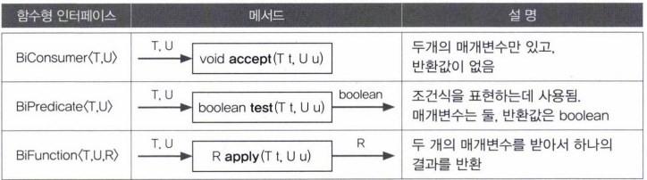

- [람다식](#람다식)
- [람다식 작성하기](#람다식-작성하기)
- [함수형 인터페이스(Functional Interface)](#함수형-인터페이스functional-interface)
  - [함수형 인터페이스 타입의 매개변수와 반환타입](#함수형-인터페이스-타입의-매개변수와-반환타입)
  - [람다식의 타입과 형변환](#람다식의-타입과-형변환)
  - [외부 변수를 참조하는 람다식](#외부-변수를-참조하는-람다식)
- [java.util.function패키지](#javautilfunction패키지)
  - [조건식의 표현에 사용되는 Predicate](#조건식의-표현에-사용되는-predicate)
  - [매개변수가 두 개인 함수형 인터페이스](#매개변수가-두-개인-함수형-인터페이스)
  - [UnaryOperator와 BinaryOperator](#unaryoperator와-binaryoperator)
  - [컬렉션 프레임웍과 함수형 인터페이스](#컬렉션-프레임웍과-함수형-인터페이스)
  - [기본형을 사용하는 함수형 인터페이스](#기본형을-사용하는-함수형-인터페이스)
- [Function의 합성과 Predicate의 결합](#function의-합성과-predicate의-결합)
  - [Function의 합성](#function의-합성)
  - [Predicate의 결합](#predicate의-결합)
- [메서드 참조](#메서드-참조)
  - [생성자의 메서드 참조](#생성자의-메서드-참조)
- [스트림](#스트림)
  - [스트림의 연산](#스트림의-연산)
  - [지연된 연산](#지연된-연산)
  - [Stream```<Integer>```와 IntStream](#streaminteger와-intstream)
  - [병렬 스트림](#병렬-스트림)
- [스트림 만들기](#스트림-만들기)
  - [컬렉션](#컬렉션)
  - [배열](#배열)
  - [특정 범위의 정수](#특정-범위의-정수)
  - [임의의 수](#임의의-수)
  - [람다식 - iterate(), generate()](#람다식---iterate-generate)
  - [빈 스트림](#빈-스트림)
  - [두 스트림의 연결](#두-스트림의-연결)
- [스트림의 중간연산](#스트림의-중간연산)
  - [스트림 자르기 - skip(), limit()](#스트림-자르기---skip-limit)
  - [스트림의 요소 걸러내기 - filter(), distinct()](#스트림의-요소-걸러내기---filter-distinct)
  - [정렬 - sorted()](#정렬---sorted)
  - [변환 - map()](#변환---map)
  - [조회 - peek()](#조회---peek)
  - [mapToInt(), mapToLong(), mapToDouble()](#maptoint-maptolong-maptodouble)
  - [flatMap() - Stream<T[]>를 Stream<T>로 변환](#flatmap---streamt를-streamt로-변환)

---

람다식(Lambda expression)
람다식의 도입으로 인해, 자바는 객체지향언어인 동시에 함수형 언어가 되었다.

---

# 람다식

메서드를 하나의 '식(expression)'으로 표현한 것

- 익명함수라고도 한다.

```java
int[] arr = new int[5];
Arrays.setAll(arr, (i) -> (int)(Math.random() * 5) + 1;

// int method(){
//     return (int)(Math.random() * 5) + 1;
// }
```

---

# 람다식 작성하기

이름과 반환타입을 제거하고 매개변수 선언부와 몸통{} 사이에 '->'를 추가한다.


---

# 함수형 인터페이스(Functional Interface)

람다식을 다루기 위한 인터페이스

- 람다식으로 정의된 익명 객체의 메서드를 어떻게 호출?
  - 익명 객체의 주소를 f라는 참조변수에 저장

```java
타입 f = (int a, int b) -> a > b ? a: b;
참소변수의 타입은 무엇인가?
```

- 참조형이니까 클래스 또는 인터페이스가 가능하다.
- 그 클래스와 인터페이스에는 람다식과 동등한 메서드가 정의되어 있어야 한다.
  - 그래야 참조변수로 익명 객체(람다식)의 메서드를 호출할 수 있다.

```java
@FunctionalInterface
interface MyFunction {
    public abstract int max(int a, int b)
}

MyFunction f = (int a, int b) -> a > b ? a : b;

// MyFunction f = new MyFunction(){
//     public int max(int a, int b){
//         return a > b ? a : b;
//     }
// };

int big = f.max(3, 5); // 익명 객체의 메서드를 호출
```

- 함수형 인터페이스에는 단 하나의 추상 메서드만 정의되어 있어야 한다.
  - 그래야 람다식의 메서드와 1:1로 연결되기 때문이다.
- @FunctionalInterface 어노테이션을 붙이면 컴파일러가 함수형 인터페이스를 알맞게 구현했는지 확인해준다.

```java
List<String> list = Arrays.asList("abc", "aaa", "bbb", "ddd", "aaa");
Collections.sort(list, (s1, s2)) -> s2.compareTo(s1);

// List<String> list = Arrays.asList("abc", "aaa", "bbb", "ddd", "aaa");
// Collections.sort(list, new Comparator<String>()){
//     public int compare(String s1, String s2) {
//         return s2.compareTo(s1);
//     }
// }
같은 코드다.
```

## 함수형 인터페이스 타입의 매개변수와 반환타입

```java
void aMethod(MyFunction f) { //매개변수 타입이 함수형 인터페이스
    f.myMethod(); //MyFunction에 정의된 메서드 호출
}
...
aMethod(() -> System.out.println("myMethod()")); //람다식을 매개변수로 지정 가능

// MyFunction f = () -> System.out.println("myMethod()");
// aMethod(f); 같은 코드
```

메서드의 반환타입이 함수형 인터페이스

- 이 함수형 인터페이스의 추상메서드와 동등한 람다식을 가리키는 참조변수를 반환하거나 람다식을 직접 반환할 수 있다.

```java
MyFunction myMethod(){
    return () -> {};
    
    // MyFunction f = () -> {};
    // return f; 같은 코드
}
```

```java
package YJ14;

@FunctionalInterface
interface MyFunction{
 void run(); //public absract void run();
}

public class YJ14_01 {
 static void execute(MyFunction f) {//매개변수의 타입이 MyFunction인 메서드
  f.run();
 }
 
 static MyFunction getMyFunction() { //반환타입이 MyFunction인 메서드
  MyFunction f = () -> System.out.println("f3.run()");
  return f;
 }
 
 public static void main(String[] args) {
  //람다식으로 MyFunction의 run()을 구현
  MyFunction f1 = () -> System.out.println("f1.run()");
  
  MyFunction f2 = new MyFunction() { //익명클래스로 run() 구현
   public void run() { //public을 반드시 붙여야 한다.
    System.out.println("f2.run()");
   }
  };
  
  MyFunction f3 = getMyFunction();
  
  f1.run();
  f2.run();
  f3.run();
  
  execute(f1); //람다식이 매개변수가 되어서 MyFunction을 구현한 것
  execute(() -> System.out.println("run()")); //바로 위의 코드에서 참조변수가 아닌 그냥 람다식을 대입한 것이다.
 }

}

<Console>
f1.run()
f2.run()
f3.run()
f1.run()
run()
```

## 람다식의 타입과 형변환

람닥식의 타입이 함수형 인터페이스의 타입과 일치하는 것은 아니다.

- 함수형 인터페이스로 람다식을 참조할 수 있는 것일 뿐
- 람다식 = 익명 객체
  - 익명 객체는 타입이 없다.

```java
MyFunction f = (MyFunction)(() -> {});
양변의 타입이 다르므로 형변환이 필요하다.(생략가능)
```

- 람다식은 MyFunction인터페이스를 직접 구현하지 않았다.
  - 하지만 이 인터페이스를 구현한 클래스의 객체와 완전히 동일해서 형변환을 허용한다.
- 람다식은 이름이 없을 뿐 분명히 객체인데도, Object타입으로 형변환 할 수 없다.
  - 오직 함수형 인터페이스로만 형변환이 가능하다.

```java
Object obj = (Object)(() -> {});
에러. 함수형 인터페이스로만 변환 가능하다.
```

## 외부 변수를 참조하는 람다식

```java
package YJ14;

@FunctionalInterface
interface MyFunction2 {
 void myMethod();
}


class Outer {
 int val = 10; //Outer.this.val
 
 class Inner {
  int val = 20; //this.val
  
  void method(int i) { //void method(final int i)
   int val = 30; //final int val = 30;
   
   MyFunction2 f = () -> {
    System.out.println("               i : " + i);
    System.out.println("             val : " + val);
    System.out.println("        this.val : " + ++this.val);
    System.out.println("  Outer.this.val : " + ++Outer.this.val);
   };
   
   f.myMethod();
  }//method
 }//inner
}//outer

public class YJ14_03 {

 public static void main(String[] args) {
  Outer outer = new Outer();
  Outer.Inner inner = outer.new Inner(); //inner의 객체도 생성(형식 주의)
  inner.method(100);
 }

}

<Console>
               i : 100
             val : 30
        this.val : 21
  Outer.this.val : 11
```

- 람다식 내에서 참조하는 지역변수는 final이 붙지 않았어도 상수로 간주된다.

---

# java.util.function패키지

자주 쓰이는 가장 기본적인 함수형 인터페이스


## 조건식의 표현에 사용되는 Predicate

Function의 변형으로, 반환타입이 boolean이다.

- Predicate는 조건식을 람다식으로 표현한다.

```java
Predicate<String> imEmptyStr = s -> s.length() == 0;

String s = "";
if(isEmpty.test(s))
    System.out.println("This is an empty String.");
```

## 매개변수가 두 개인 함수형 인터페이스

이름 앞에 접두사 'Bi'가 붙는다.



- 두 개 이상의 매개변수를 갖는 함수형 인터페이스는 직접 만들어서 써야한다.

## UnaryOperator와 BinaryOperator

매개변수의 타입과 반환타입의 타입이 모두 일치한다.


## 컬렉션 프레임웍과 함수형 인터페이스

컬렉션 프레임웍의 인터페이스에 다수의 디폴트 메서드가 추가되었다.

- 그 중의 일부는 함수형 인터페이스를 사용한다.


```java
package YJ14;

import java.util.ArrayList;
import java.util.HashMap;
import java.util.Map;

public class YJ14_04 {

 public static void main(String[] args) {
  ArrayList<Integer> list = new ArrayList<>();
  for(int i = 0; i < 10; i++) list.add(i);

  //list의 모든 요소 출력
  list.forEach(i -> System.out.print(i + ", "));
  System.out.println();

  //list에서 2 또는 3의 배수를 제거
  list.removeIf(x -> x%2 == 0 || x%3 == 0);
  System.out.println(list);

  //list의 각 요소에 10을 곱한다.
  list.replaceAll(i -> i * 10);
  System.out.println(list);

  Map<String, String> map = new HashMap();
  map.put("1", "1");
  map.put("2", "2");
  map.put("3", "3");
  map.put("4", "4");

  map.forEach((k, v) -> System.out.print("{" + k + ", " + v + "}, "));
  System.out.println();
 }


}

<Console>
0, 1, 2, 3, 4, 5, 6, 7, 8, 9, 
[1, 5, 7]
[10, 50, 70]
{1, 1}, {2, 2}, {3, 3}, {4, 4}, 
```

```java
package YJ14;

import java.util.ArrayList;
import java.util.List;
import java.util.function.Consumer;
import java.util.function.Function;
import java.util.function.Predicate;
import java.util.function.Supplier;

public class YJ14_5 {
 public static void main(String[] args) {
  Supplier<Integer> s = () -> (int)(Math.random() * 100 + 1);
  Consumer<Integer> c = i -> System.out.print(i + ", ");
  Predicate<Integer> p = i -> i%2 == 0;
  Function<Integer, Integer> f = i -> i / 10 * 10;

  List<Integer> list = new ArrayList<>();
  makeRandomList(s, list);
  System.out.println(list);
  printEvenNum(p, c, list);
  List<Integer> newList = doSomething(f, list);
  System.out.println(newList);
 } 

 static <T> List<T> doSomething(Function<T, T> f, List<T> list){
  List<T> newList = new ArrayList<T>(list.size());

  for(T i : list) {
   newList.add(f.apply(i));
  }

  return newList;
 }

 static <T> void printEvenNum(Predicate<T> p, Consumer<T> c, List<T> list) {
  System.out.print("[");
  for(T i : list) {
   if(p.test(i))
    c.accept(i);
  }
  System.out.println("]");
 }

 static <T> void makeRandomList(Supplier<T> s, List<T> list) {
  for(int i = 0; i < 10; i++) {
   list.add(s.get());
  }
 }
}

<Console>
[98, 34, 63, 92, 47, 19, 87, 100, 52, 43]
[98, 34, 92, 100, 52, ]
[90, 30, 60, 90, 40, 10, 80, 100, 50, 40]
```

## 기본형을 사용하는 함수형 인터페이스

지금까지 함수형 인터페이스는 매개변수와 반환값의 타입이 모두 지네릭 타입이었다.

- 기본형 타입의 값을 처리할 때도 래퍼 클래스를 사용해왔다.
  - 비효율적


```java
package YJ14;

import java.util.Arrays;
import java.util.function.IntConsumer;
import java.util.function.IntPredicate;
import java.util.function.IntSupplier;
import java.util.function.IntUnaryOperator;

public class YJ14_06 {
 public static void main(String[] args) {
  IntSupplier s = () -> (int)(Math.random() * 100 + 1);
  IntConsumer c = i -> System.out.print(i + ", ");
  IntPredicate p = i -> i%2 == 0;
  IntUnaryOperator op = i -> i / 10 * 10;

  int[] arr = new int[10];


  makeRandomList(s, arr);
  System.out.println(Arrays.toString(arr));
  printEvenNum(p, c, arr);
  int[] newArr = doSomething(op, arr);
  System.out.println(Arrays.toString(newArr));
 } 

 static void makeRandomList(IntSupplier s, int[] arr) {
  for(int i = 0; i < arr.length; i++) {
   arr[i] = s.getAsInt(); //get()이 아니라 getAsInt()임에 주의
  }
 }

 static void printEvenNum(IntPredicate p, IntConsumer c, int[] arr) {
  System.out.print("[");
  for(int i : arr)
   if(p.test(i))
    c.accept(i);
  System.out.println("]");
 }

 static int[] doSomething(IntUnaryOperator op, int[] arr) {
  int[] newArr = new int[arr.length];

  for(int i = 0; i < newArr.length; i++) {
   newArr[i] = op.applyAsInt(arr[i]); //apply()가 아님에 주의
  }

  return newArr;
 }
}

<Console>
[79, 84, 44, 46, 13, 68, 72, 65, 59, 42]
[84, 44, 46, 68, 72, 42, ]
[70, 80, 40, 40, 10, 60, 70, 60, 50, 40]
```

- 위 예제에서 IntUnaryOperator대신 Function을 사용하면 에러가 난다.

```java
Function f = (a) -> 2 * a;
에러. a의 타입을 알 수 없으므로 연산불가
```

- 매개변수 a와 반환 값의 타입을 추정할 수 없다.
- ```IntFunction<Integer>```를 사용할 수 있지만, IntUnaryOperator가 오토박싱&언박싱의 횟수가 줄어들어 성능이 더 좋다.
  - 매개변수 타입과 반환타입이 일치하면 IntUnaryOperator를 사용하자.

---

# Function의 합성과 Predicate의 결합


## Function의 합성

두 람다식을 합성해서 새로운 람다식을 만들 수 있다.

- 합성은 어느 함수를 먼저 적용하느냐에 따라 값이 달라진다.

```java
f.andThen(g)
f를 먼저 적용하고, g를 적용
```

```java
f.compose(g)
g를 먼저 적용하고, f를 적용
```

```java
Function<String, Integer> f = (s) -> Integer.parseInt(s, 16);
Function<Integer, String> g = (i) -> Integer.toBinaryString(i);
Function<String, String> h = f.andThen(g);

System.out.println(h.apply("FF"));
```

- 입력: "FF"
- 중간: 255
- 출력: "11111111"

```java
Function<String, Integer> f = (s) -> Integer.parseInt(s, 16);
Function<Integer, String> g = (i) -> Integer.toBinaryString(i);
Function<Integer, Integer> h = f.compose(g);

System.out.println(h.apply("FF"));
```

- 입력: 2
- 중간: "10"
- 출력: 16

## Predicate의 결합

```java
Predicate<Integer> p = i -> i < 100;
Predicate<Integer> q = i -> i < 200;
Predicate<Integer> r = i -> i%2 == 0;
Predicate<Integer> notP = p.negate(); // i >= 100

// 100 <= i && (i < 200 || i%2 == 0)
Predicate<Integer> all = notP.and(q.or(r));
//Predicate<Integer> all = notP.and(i -> i < 200).or(i -> i%2 == 0));

System.out.println(all.test(150)); //true
```

isEqual()

- static메서드
- 두 대상을 비교하는 Predicate를 만들 때 사용
- 매개변수로 비교대상을 하나 지정
  - 또 다른 비교대상은 test()의 매개변수로 지정

```java
Predicate<String> p = Predicate.isEqual(str1);
boolean result = p.test(str2);

boolean result = Predicate.isEqual(str1).test(str2);
```

---

# 메서드 참조

람다식이 하나의 메서드만 호출하는 경우 람다식을 더욱 간결하게 표현할 수 있다.

```java
Function<String, Integer> f = (String s) -> Integer.parseInt(s);

↓↓↓↓↓↓↓↓↓↓

Function<String, Integer> f = Integer::parseInt; //메서드 참조
```

- 생략된 부분은 우변의 parseInt메서드의 선언부나 좌변의 Function인터페이스에 지정된 지네릭 타입으로부터 쉽게 알아낼 수 있다.

```java
BiFunction<String, String, Boolean > f = (s1, s2) -> s1.equals(s2);
BiFunction<String, String, Boolean > f = String::equals; //메서드 참조
```

- 메서드 참조 시에 앞부분에는 메서드의 클래스를 적어준다.
- 이미 생성된 객체의 메서드를 람다식에서 사용한 경우에는 클래스 이름 대신 그 객체의 참조변수를 적어준다.

```java
MyClass mc = new MyClass();
Function<String, Boolean> f = (x) -> mc.equals(x); //람다식
Function<String, Boolean> f = mc::equals; //메서드 참조
```


하나의 메서드만 호출하는 람다식

- 클래스이름::메서드이름
- 참조변수::메서드이름

## 생성자의 메서드 참조

생성자를 호출하는 람다식도 메서드 참조 가능

```java
Supplier<MyClass> s = () -> new MyClass(); //람다식
Supplier<MyClass> s = MyClass::new; //메서드 참조
```

매개변수가 있는 생성

- 매개변수가 있는 생성자라면, 매개변수의 개수에 따라 알맞은 함수형 인터페이스를 사용
- 필요하다면 함수형 인터페이스를 새로 정의한다.

```java
Function<Integer, MyClass> f = (i) -> new Class(i); //람다식
Function<Integer, MyClass> f2 = MyClass::new; //메서드 참조
```

```java
BiFinction<Integer, String, MyClass> bf = (i, s) -> new MyClass(i, s) //람다식
BiFinction<Integer, String, MyClass> bf = MyClass::new //람다식
```

- 배열도 가능하다.

```java
Function<Integer, int[]> f = x -> new int[x];
Function<Integer, int[]> f2 = x -> int[x]:new;
```

---

# 스트림

- 데이터 소스를 추상화
  - 데이터 소스가 무엇이던 간에 같은 방식으로 다룰 수 있게된 것
- 데이터를 다루는데 자주 사용되는 메서드들을 정의해 놓았다.

```java
String[] arr = {"aaa", "ddd", "ccc"};
List<String> list = Arrays.asList(strArr);

Stream<String> s1 = Arrays.stream(arr);
Stream<String> s2 = list.stream();

//정렬하고 화면에 출력
s1.sorted().forEach(System.out::println);
s2.sorted().forEach(System.out::println);

Arrays.sort(arr);
Collections.sort(list);

for(String str : arr) System.out.println(str);
for(String str : list) System.out.println(str);
```

스트림은 데이터 소스를 변경하지 않는다.

- 스트림은 데이터를 읽기만 한다.

```java
//정렬된 결과를 새로운 List에 담아서 반환한다.
List<String> sortedList = strStream.sorted().collect(Collectors.toList());
```

스트림은 일회용이다.

- 필요하면 다시 생성해야 한다.

```java
strStream.sorted().forEach(System.out::println);
int numOfStr = strStream.count(); //에러. 스트림이 이미 닫혔다.
```

스트림은 작업을 내부 반복으로 처리한다.

- 내부 반복
  - 반복문을 메서드의 내부에 숨길 수 있다는 것을 의미
  - forEach


## 스트림의 연산

중간 연산

- 연산 결과가 스트림인 연산
- 스트림에 연속해서 중간 연산할 수 있다.

최종 연산

- 연산 결과가 스트림이 아닌 연산
- 스트림의 요소를 소모하므로 단 한번만 가능


```java
String[] arr = {"dd", "aaa", "CC", "cc", "b"};
Stream<String> stream = Stream.of(arr); //문자열 배열이 소스인 스트림
Stream<String> filterStream = stream.filter(); //걸러내기(중간연산)
Stream<String> distinctedStream = stream.distinct(); //중복제거(중간연산)
Stream<String> sortedStream = stream.sort(); //정렬(중간연산)
Stream<String> limitedStream = stream.limit(5); //스트림 자르기(중간연산)
int total = stream.count(); //요소 개수 세기(최종연산)
```

- 스트림의 중간 연산 목록
  - 핵심
    - map()
    - flatMap()


- 스트림의 최종 연산 목록
  - 핵심
    - reduce()
    - collect()


## 지연된 연산

최종연산이 수행되기 전까지는 중간 연산이 수행되지 않는다.

- 최종 연산이 수행되어야 비로소 스트림의 요소들이 중간 연산을 거쳐 최종 연산에서 소모된다.

## Stream```<Integer>```와 IntStream

IntStream, LongStream, DoubleStream

- 오토박싱&언박싱으로 인한 비효율을 줄이기 위해 데이터 소스의 요소를 기본형으로 다룬다.
- ```Stream<Integer>```보다 IntStream을 사용하는 것이 효율적이다.

## 병렬 스트림

병렬 스트림은 내부적으로 이 프레임웍을 이용해서 자동적으로 연산을 병렬로 수행한다.

- 스트림에 parallel()이라는 메서드를 호출
- 병렬 중지하려면 sequential()을 호출
  - 모든 스트림은 기본적으로 병렬 스트림이 아니므로 sequential()을 처음부터 호출할 필요는 없다.

```java
int sum = strStream.parallel()
                   .mapToint(s -> s.length())
                   .sum();
```

# 스트림 만들기

## 컬렉션

Collection에 stream()이 정의되어 있다.

```java
Stream<T> Collection.stream()
```

List로부터 스트림 생성하기

```java
List<Integer> list = Arrays.asList(1,2,3,4,5); //가변 인자
Stream<Intger> intStream = list.stream(); //list를 소스로 하는 컬렉션 저장
```

## 배열

배열을 소스로 하는 스트림을 생성하는 메서드는 다음과 같이 Stream과 Arrays에 static메서드로 정의되어 있다.

```java
Stream<T> Stream.of(T...values) //가변인자
Stream<T> Stream.of(T[]) //가변인자
Stream<T> Arrays.stream(T[])
Stream<T> Arrays.stream(T[] array, int startInclusive, int endExclusive)
```

```java
Stream<String> strStream = Stream.of("a", "b", "c"); //가변인자
Stream<String> strStream = Stream.of(new String[]{"a", "b", "c"}); //가변인자
Stream<String> strStream = Arrays.stream(new String[]{"a", "b", "c"});
Stream<String> strStream = Arrays.stream(new String[]{"a", "b", "c"}, 0, 3);
```

```java
IntStream IntStream.of(int... values) //Stream이 아니라 IntSream
IntStream IntStream.of(int[])
IntStream Arrays.stream(int[])
IntStream Arrays.stream(int[] array, int startInclusive, int endExclusive)
```

## 특정 범위의 정수

IntStream, LongStream은 range()와 rangeClose()로 지정된 범위의 연속된 정수를 스트림으로 생성해서 반환한다.

```java
IntStream Intstream.range(int begin, int end)
IntStream Intstream.rangeClosed(int begin, int end)
```

- range()
  - end가 범위에 포함되지 않음
- rangeClosed()
  - end가 범위에 포함

## 임의의 수

Random클래스에는 다음과 같은 인스턴스 메서드들이 포함되어 있다.

```java
IntStream ints()
LongStream longs()
DoubleStream doubles()
```

- 이 메서드들의 반환값은 무한 스트림이다.
  - limit()로 제한해준다.

```java
IntStream intStream = new Random().ints(); //무한 스트림
inStream.limit(5).forEach(System.out::println);
```

- limit()를 쓰지 않고, 메서드의 매개변수로 스트림의 크기를 지정해서 '유한 스트림'을 생성해서 반환하므로 limit()을 사용하지 않아도 된다.

```java
IntStream ints(long streamSize)
LongStream longs(long streamSize)
DoubleStream doubles(long streamSize)

IntStream intStream = new Random.ints(5);
```

지정된 범위(begin ~ end)의 난수를 발생시키는 스트림을 얻는 메서드

```java
IntStream ints(int begin, int end)
LongStream ints(long begin, long end)
DoubleStream ints(Double begin, Double end)

IntStream ints(long streamSize, int begin, int end)
DoubleStream ints(long streamSize, Double begin, Double end)
LongStream ints(long streamSize, long begin, long end)
```

## 람다식 - iterate(), generate()

Stream클래스의 iterate()와 generate()는 람다식을 매개변수로 받아서, 이 람다식에 의해 계산되는 값들을 요소로 하는 무한 스트림을 생성한다.

```java
static <T> Stream<T> iterate(T seed, UnaryOperator<T> f)
static <T> Stream<T> generate(Supplier<T> s)
```

iterate()

- seed값으로 지정된 값부터 시작해서, 람다식 f에 의해 계산된 결과를 다시 seed값으로 해서 계산을 반복한다.

```java
Stream<Integer> evenStream = Stream.iterate(0, n -> n + 2); //0, 2, 4, 6,...
```

generate()

- 무한 스트림이지만, 이전 결과를 이용해서 다음 요소를 계산하지 않는다.

```java
Stream<Double> randomStream = Stream.generate(Math::random);
Stream<Integer> oneStream = Stream.generate(() -> 1);
```

- generate()에 정의된 매개변수의 타입은 Supplier```<T>```이므로 매개변수가 없는 람다식만 허용된다.

iterate()와 generate()에 의해 생성된 스트림을 아래와 같이 기본형 스트림 타입의 참조변수로 다룰 수 없다.

```java
IntStream evenStream = Stream.iterate(0, n -> n + 2); //에러
DoubleStream randomStream = Stream.generate(Math::random); //에러
```

- 굳이 기본형 스트림 타입의 참조변수로 다루고자 한다면, mapToInt()와 같은 메서드로 변환을 해야 한다.

```java
IntStream evenSteam = Stream.iterate(0, n -> n + 2).mapToInt(Integer::valueOf);
Stream<Integer> stream = evenStream.boxed(); // IntStream -> Stream<Integer>
```

- IntStream타입의 스트림을 Stream```<Inter>```으로 변환하려면, boxed()를 사용해야 한다.

## 빈 스트림

null보다는 빈 스트림을 반환하는 것이 낫다.

```java
Stream emptyStream = Stream.empty(); //empty()는 빈 스트림을 생성해서 반환한다.
long count = emptyStream.count(); // count의 값은 0
```

- count()는 스트림의 요소의 개수를 반환

## 두 스트림의 연결

Stream의 static메서드인 concat()을 사용하면, 두 스트림을 하나로 연결할 수 있다.

- 연결하는 두 스트림의 요소는 같은 타입이어야 한다.

```java
String[] str1 = {"123", "456", "789"};
String[] str2 = {"ABC", "abc", "DEF"};

Stream<String> strs1 = Stream.of(str1);
Stream<String> strs2 = Stream.of(str2);
Stream<String> strs3 = Stream.concat(strs1, strs2); //두 스트림을 하나로 연결
```

---

# 스트림의 중간연산

## 스트림 자르기 - skip(), limit()

```java
Stream<T> skip(long n) //처음 n개의 요소를 건너뛴다.
Stream<T> limit(long maxSize) // 스트림의 요소를 maxSize개로 제한한다.
```

## 스트림의 요소 걸러내기 - filter(), distinct()

distinct()

- 스트림에서 중복된 요소들을 제거

filter()

- 주어진 조건(Predicate)에 맞지 않는 요소를 걸러낸다.

```java
Stream<T> filter(Predicate<? super T> predicate)
Stream<T> distinct()
```

distinct() 사용법

```java
IntStream intStream = IntStream.of(1,2,2,3,3,3,4,5,5,6);
intStream.distinct().forEach(System.out::print); //123456
```

filter() 사용법

```java
IntStream intStream = IntStream.rangeClosed(1, 10); // 1 ~ 10
intStream.filter(i -> i%2 == 0).forEach(System.out::print); //246810
```

- filter()를 다른 조건으로 여러 번 사용 가능하다.

## 정렬 - sorted()

스트림을 정렬

```java
Stream<T> sorted()
Stream<T> sorted(Comparator<? super T> comparator)
```

- sorted()는 지정된 Comparator로 스트림을 정렬
  - 지정하지 않는다면 기본 정렬 기준(Comparable)
  - Comparator대신 int값을 반환하는 람다식을 사용하는 것도 가능

```java
Stream<String> strStream = Stream.of("dd", "aaa", "CC", "cc", "b");
strStream.sorted().forEach(System.out::print); //CCaaabccdd
```


```java
comparing(Function<T, U> keyExtractor)
comparing(Function<T, U> keyExtractor, Comparator<U> keyComparator)
```
- Comparable을 구현한 경우
  - 매개변수 하나짜리를 사용
- Comparator 정렬기준
  - 추가적인 매개변수

비교대상이 기본형인 경우
- comparing()대신 다음의 메서드를 사용하면 오토박싱과 언박싱 과정이 없어서 효율적
- 정렬 조건을 추가할 때는 thenComparing()

```java
comparingInt(ToIntFunction<T> keyExtractor)
comparingLong(ToLongFunction<T> keyExtractor)
comparingDouble(ToDoubleFunction<T> keyExtractor)
```

```java
studentStream.sorted(Comparator.comparing(Student::getBan)
                    .thenComparing(Student::getTotalScore)
			        .thenComparing(Student::getName))
					.forEach(System.out::println);
```

## 변환 - map()
스트림의 요소에 저장된 값 중에서 원하는 필드만 뽑아내거나 특정 형태로 변환할 때 사용
```java
Stream<R> map(Function<? super T, ? extends R> mapper)
```

```java
Stream<File> fileStream = Stream.of(new File("Ex1.java"), new File("Ex1"), new File("Ex1.bak"), new File("Ex1.java"), new File("Ex1.txt"));
```

```java
fileStream.map(File::getName) //Stream<File> -> Stream<String>
          .filter(s -> s.indexOf('.') != -1) //확장자가 없는 것은 제외
          .map(s -> s.substring(s.indexOf('.') + 1)) //Stream<String> -> Stream<String>
          .distinct()
          .forEach(System.out::print); //JAVABACKTXT 
```

## 조회 - peek()
연산과 연산 사이에 올바르게 처리되었는지 확인
- forEach와 달리 스트림의 요소를 소모하지 않는다.

```java
fileStream.map(File::getName) //Stream<File> -> Stream<String>
          .filter(s -> System.out.printf("filename = %s%n", s)) //파일명 출력
          .map(s -> s.substring(s.indexOf('.') + 1)) //확장자만 추출
          .peek(s -> System.out.printf("extension = %s%n", s)) //확장자 출력
          .forEach(System.out::println);
```

## mapToInt(), mapToLong(), mapToDouble()
map()은 연산의 결과로 Stream```<T>```타입의 스트림을 반환한다.
- 스트림의 요소를 기본형 스트림으로 변환하는 것이 더 유용할 수 있다.
  - ```Stream<T>```타입의 스트림을 기본형 스트림으로 변환할 때 사용하는 것이 아래의 메서드이다.

```java
DoubleStream mapToDouble(ToDoubleFunction<? super T> mapper)
IntStream mapToInt(ToIntFunction<? super T> mapper)
LongStream mapToLong(ToLongFunction<? super T> mapper)

Stream<Integer> sss = studentStream.map(Student::getTotalScore);
```
- 그러나 이럴 때는 애초부터 mapToInt()를 사용해서 ```Stream<Integer>```가 아닌 IntStream타입의 스트림을 생성해서 사용하는 것이 효율적이다.

```java
IntStream sss = studentStream.mapToInt(Student::getTotalScore);
int allTotalScore = sss.sum(); // int sum();
```

count()만 지원하는 ```Stream<T>```와 달리 IntStream과 같은 기본형 스트림은 숫자를 다루는데 편리한 메서드들을 제공한다.
```java
int sum() //스트림의 모든 요소의 총합
OptionalDouble average() // sum() / (double)count()
OptionalInt max() //스트리의 요소 중 제일 큰 값
OptionalInt min() //스트림의 요소 중 제일 작은 값
```
- 최종연산이기 때문에 호출 후에 스트림이 닫힌다.
- 여러 번 사용하려면 그때마다 스트림을 생성해야하므로 불편하다.
  - summaryStatistics()메서드로 해결

```java
IntSummaryStatistics stat = scoreStream.summaryStatistics()

long totalCount = stat.getCount();
long totalScore = stat.getSum();
double svgScore = stat.getAverage();
long minScore = stat.getMin();
long maxScore = stat.getMax();
```
- 골라서 쓰면된다.

IntStream -> ```Stream<T>```
- mapToObj()

```java
IntStream intStream = new Random().ints(1, 46);
Stream<String> lottoStream = intStream.distinct().limit(6).sorted().mapToInt(i -> i + ", "); //정수를 문자열(Stream<String>)로 변환
lottoStream.forEach(System.out::print);
```

IntStream -> ```Stream<Integer>```
- boxed()

chars()는 String이나 StringBuffer에 저장된 문자들을 IntStream으로 다룰 수 있게 해준다.
```java
IntStream charStream = "12345".chars(); //default IntStream chars()
int charSum = charStream.map(ch -> ch-'0').sum(); //charSum = 15
```

```Stream<String>``` -> IntStream
- ```mapToInt(Integer::parseInt)```


```Stream<Integer>``` -> IntStream
- ```mapToInt(Integer::intValue)```

```java
package YJ14;

import java.util.Comparator;
import java.util.IntSummaryStatistics;
import java.util.stream.IntStream;
import java.util.stream.Stream;

public class YJ14_10 {

	public static void main(String[] args) {
		Student[] stuArr = {
				new Student("이자바", 3, 300),
				new Student("김자바", 1, 200),
				new Student("안자바", 2, 100),
				new Student("박자바", 2, 150),
				new Student("소자바", 1, 200),
				new Student("나자바", 3, 290),
				new Student("감자바", 3, 180)
		};
		
		Stream<Student> stuStream = Stream.of(stuArr);
		
		stuStream.sorted(Comparator.comparing(Student::getBan)
				.thenComparing(Comparator.naturalOrder()))
				.forEach(System.out::println);
		
		stuStream = Stream.of(stuArr); //스트림을 다시 생성한다.
		IntStream stuScoreStream = stuStream.mapToInt(Student::getTotalScore);
		
		IntSummaryStatistics stat = stuScoreStream.summaryStatistics();
		System.out.println("count = " + stat.getCount());
		System.out.println("sum = " + stat.getSum());
		System.out.printf("average = %.2f%n", stat.getAverage());
		System.out.println("min = " + stat.getMin());
		System.out.println("max = " + stat.getMax());			
	}
}

class Student implements Comparable<Student> {

	String name;
	int ban;
	int totalScore;
	
	public Student(String name, int ban, int totalScore) {
		super();
		this.name = name;
		this.ban = ban;
		this.totalScore = totalScore;
	}
	
	public String toString() {
		return String.format("[%s, %d, %d]", name, ban, totalScore).toString();
	}
	
	String getName() {return name;}
	int getBan() {return ban;}
	int getTotalScore(){return totalScore;}
	
	public int compareTo(Student s) {
		return s.totalScore - this.totalScore;
	}
}

<Console>
[김자바, 1, 200]
[소자바, 1, 200]
[박자바, 2, 150]
[안자바, 2, 100]
[이자바, 3, 300]
[나자바, 3, 290]
[감자바, 3, 180]
count = 7
sum = 1420
average = 202.86
min = 100
max = 300
```

## flatMap() - Stream<T[]>를 Stream<T>로 변환
스트림의 요소가 배열이거나 map()의 연산결과가 배열인 경우, 즉 ```Stream<T[]>```인 경우
- ```Stream<T>```로 다루는 것이 편리할 때가 있다.
  - map()대신 flatMap()사용

```java
Stream<String[]> strArrStrm = Stream.of(
  new String[]{"abc", "def", "ghi"},
  new String[]{"ABC", "DEF", "GHI"}
)
```
- 각 요소의 문자열들을 합쳐서 문자열이 요소인 스트림, 즉 ```Stream<String>```으로 만들려면?
- 스트림의 요소를 반환해야 한다.
  - map()사용
- 배열을 스트림으로 만들어줘야 한다.
  - Arrays.stream(T[])

```java
Stream<Stream<String>> strStrStream = strArrStrm.map(Arrays::stream);
```
- ```Stream<String[]>```을 'map(Arrays::stream)'으로 변환한 결과는 `Stream<String>`이 아닌, `Stream<Stream<String>>`이다.


- 각 요소의 문자열들이 합쳐지지 않고, 스트림의 스트림 형태로 되어버렸다.
- 이 때, map()을 flatMap()으로 바꾸면 원하는 결과를 얻을 수 있다.

```java
Stream<Stream<String>> strStrStream = strArrStrm.map(Arrays::stream);

↓↓↓↓↓↓↓↓

Stream<String> strStrStream = strArrStrm.flatMap(Arrays::stream);
```


```java
String[] lineArr = {
  "Believe or not It is true",
  "Do or do not There is no try"
};

Stream<String> lineStream = Arrays.stream(lineArr);
Stream<Stream<String>> strArrStream = lineStream.map(line -> Stream.of(line.split(" +")));
```
- map()대신 flatMap()으로 원하는 결과를 얻을 수 있다.


```java
Stream<String> strArrStream = lineStream.flatMap(line -> Stream.of(line.split(" +")));
```


```java
package YJ14;

import java.util.Arrays;
import java.util.stream.Stream;

public class YJ14_11 {
	public static void main(String[] args) {
		Stream<String[]> strArrStrm = Stream.of(
				new String[] {"abc", "def", "jkl"},
				new String[] {"ABC", "DRF", "JKL"}
				);

		//		Stream<Stream<String>> strStrmStrm = strArrStrm.map(Arrays::stream);
		Stream<String> strStrm = strArrStrm.flatMap(Arrays::stream);

		strStrm.map(String::toLowerCase)
		.distinct()
		.sorted()
		.forEach(System.out::println);

		System.out.println();

		String[] lineArr = {
				"Believe or not It is true",
				"Do or do not There is no try"
		};

		Stream<String> lineStream = Arrays.stream(lineArr);
		lineStream.flatMap(line -> Stream.of(line.split(" +")))
		.map(String::toLowerCase)
		.distinct()
		.sorted()
		.forEach(System.out::println);
		System.out.println();

		Stream<String> strStrm1 = Stream.of("AAA", "ABC", "bBb", "Dd");
		Stream<String> strStrm2 = Stream.of("bbb", "aaa", "ccc", "dd");

		Stream<Stream<String>> strStrmStrm = Stream.of(strStrm1, strStrm2);
		Stream<String> strStream = strStrmStrm
				.map(s -> s.toArray(String[]::new)) //이미 이중 Stream이 된건 map으로 받은 후에 flatMap 시전
				.flatMap(Arrays::stream);

		strStream.map(String::toLowerCase)
		.distinct()
		.forEach(System.out::println);
	}//main
}//YJ14_11 class

<Console>
abc
def
drf
jkl

believe
do
is
it
no
not
or
there
true
try

aaa
abc
bbb
dd
ccc
```

