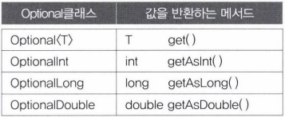
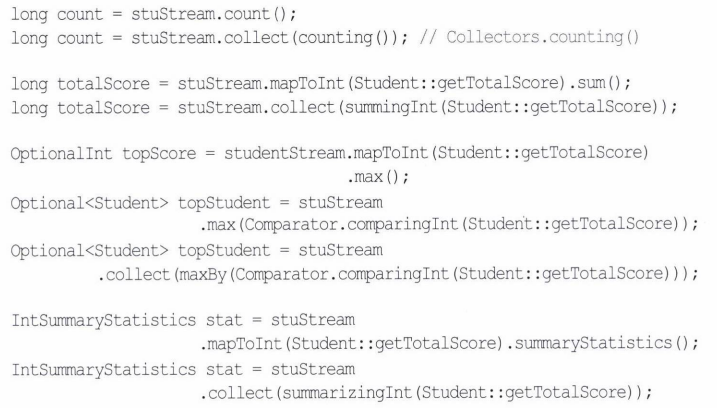
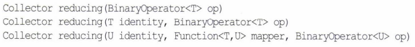

- [Optional<T>와 OptionalInt](#optionalt와-optionalint)
  - [Optional객체 생성하기](#optional객체-생성하기)
  - [Optional객체의 값 가져오기](#optional객체의-값-가져오기)
  - [OptionalInt, OptionalLong, OptionalDouble](#optionalint-optionallong-optionaldouble)
- [스트림의 최종 연산](#스트림의-최종-연산)
  - [forEach()](#foreach)
  - [조건 검사 - allMatch(), anyMatch(), noneMatch(), findFirst(), findAny()](#조건-검사---allmatch-anymatch-nonematch-findfirst-findany)
  - [통계 - count(), sum(), average(), max(), min()](#통계---count-sum-average-max-min)
  - [리듀싱 - reduce()](#리듀싱---reduce)
- [collect()](#collect)
  - [스트림을 컬렉션과 배열로 변환 - toList(), toSet(), toMap(), toCollection(), toArray()](#스트림을-컬렉션과-배열로-변환---tolist-toset-tomap-tocollection-toarray)
  - [통계 - counting(), summitgInt(), averagingInt(), maxBy(), minBy()](#통계---counting-summitgint-averagingint-maxby-minby)
  - [리듀싱 - reducing()](#리듀싱---reducing)
  - [문자열 결합 - joining()](#문자열-결합---joining)
  - [그룹화와 분할 - groupingBy(), partitioningBy()](#그룹화와-분할---groupingby-partitioningby)

---

# Optional<T>와 OptionalInt

Optional`<T>`

- 지네릭 클래스로 'T타입의 객체'를 감싸는 래퍼 클래스이다.
- Optional타입의 객체에는 모든 타입의 참조변수를 담을 수 있다.

```java
public final class Optional<T> {
    private final T value; //T타입의 참조변수
}
```

- 최종 연산의 결과를 그냥 반환하는 것이 아니라 Optional객체에 담아서 반환
  - 이렇게 객체에 담아서 반환하면, 결과가 null인지를 Optional에 정의된 메서드를 통해서 간단히 처리할 수 있다.

## Optional객체 생성하기

of() 또는 ofNullable() 사용

```java
String str = "abc";
Optional<String> optVal = Optional.of(str);
Optional<String> optVal = Optional.of("abc");
Optional<String> optVal = Optional.of(new String("abc"));
```

- 만약 참조변수의 값이 null일 가능성이 있다면, of()대신 ofNullable()을 사용

```java
Optional<String> optVal = Optional.of(null); //NullPointerException 발생
Optional<String> optVal = Optional.ofNullable(null); //ok
```

empty()

- `Optional<T>` 타입의 참조변수를 기본값으로 초기화

```java
Optional<String> optVal = null; //널로 초기화
Optional<String> optVal = Optional.<String>empty(); //빈 객체로 초기화
```

## Optional객체의 값 가져오기

get()

- Optional객체에 저장된 값을 가져온다.
- null일 때는 NoSuchElementException발생
  - orElse()로 대체할 값을 지정할 수 있다.

```java
Optional<String> optVal = Optional.of("abc");
String str1 = optVal.get(); //optVal에 저장된 값을 반환
String str2 = optVal.orElse(""); // optVal에 저장된 값이 null이면, ""를 반환
```

orElseGet()

- null을 대체할 값을 반환하는 람다식을 지정

orElseThrow()

- null일 때 지정된 예외를 발생시킨다.

```java
T orElseGet(Supplier<? extends T> other)
T orElseThrow(Supplier<? extends X> exceptionSupplier)

String str3 = optVal2.orElseGet(String::new) // () -> new String()와 동일
String str4 = optVal2.orElseThrow(NullPointerException::new) // null이면 예외 발생
```

Optional 객체도 map()의 연산결과가 `Optional<Optional<T>>`일 때, flatMap()을 사용하면 `Optional<T>`를 결과로 얻는다.

```java
int result = Optional.of("123")
                     .filter(x -> x.length() > 0)
                     .map(Integer::parseInt).orElse(-1); // result = 123
```

isPresent()

- Optional객체의 값이 null이면 false, 아니면 true

`ifPresent(Consumer<T> block)`

- 값이 있으면 주어진 람다식을 실행, 없으면 아무 일도 하지 않는다.

```java
if(Optional.ofNullable(str).isPresent()){
    System.out.println(str);
}

Optional.ofNullable(str).ifPresent(System.out::println);

// if(str != null){
//     System.out.println(str);
// }
```

Stream클래스에 정의된 메서드 중에서 `Optional<T>`를 반환하는 메서드

```java
Optional<T> findAny()
Optional<T> findFirst()
Optional<T> max(Comparator<? super T> comparator)
Optional<T> min(Comparator<? super T> comparator)
Optional<T> reduce(BinaryOperator<T> accumulator)
```
  
## OptionalInt, OptionalLong, OptionalDouble

```java
OptionalInt findAny()
OptionalInt findFirst()
OptionalInt reduce(IntBinaryOperator op)
OptionalInt max()
OptionalInt min()
OptionalDouble average()
```



```java
OptionalInt opt = OptionalInt.of(0);//OptionalInt에 0을 저장
OptionalInt opt2 = OptionalInt.empty();//OptionalInt에 0을 저장
```

- 구분하는 법
  - isPresent()
    - 저장된 값이 없는 것과 0이 저장된 것을 구분한다.
    - 인스턴스변수의 값을 반복한다.

```java
System.out.println(opt.isPresent()); //true
System.out.println(opt2.isPresent()); //false

System.out.println(opt.getAsInt()); //0
System.out.println(opt2.getAsInt()); //NoSuchElementException예외발생

System.out.println(opt.equals(opt2)); //false
```

그러나 Optional객체의 경우 null을 저장하면 비어있는 것과 동일하게 취급한다.

```java
Optional<String> opt = Optional.ofNullable(null);
Optional<String> opt2 = Optional.empty();

System.out.println(opt.equals(opt2)); //true
```

---

# 스트림의 최종 연산

## forEach()

peek()와 달리 스트림의 요소르르 소모하는 최종연산

- 반환타입 void

```java
void forEach(Consumer<? super T> action)
```

## 조건 검사 - allMatch(), anyMatch(), noneMatch(), findFirst(), findAny()

스트림의 요소에 대해 지정된 조건에 모든 요소가 일치하는지, 일부가 일치하는지 아니면 어떤 요소도 일치하지 않는지 확인

```java
boolean noFailed = stuStream.anyMatch(s -> s.getTotalScore() <= 100)
총점이 낙제점(총점 100 이하)인 학생이 있느닞 확인
```

병렬 스트림인 경우 findFirst()나 findAny()를 사용한다.

```java
Optional<Student> stu = stuStream.filter( s -> s.getTotalScore() <= 100).findFirst();
Optional<Student> stu = parallelStream.filter( s -> s.getTotalScore() <= 100).findAny();
```

- findAny()와 findFirst()의 반환 타입은 `Optional<T>`이다.
  - 스트림 요소가 없을 때는 비어있는 Optional객체를 반환

## 통계 - count(), sum(), average(), max(), min()

기본형 스트림에는 스트림의 요소들에 대한 통계 정보를 얻을 수 있는 메서드들이 있다.

- 그러나 기본형 스트림이 아닌 경우 3개 뿐이다.

```java
long count()
Optional<T> max(Comparator<? super T> comparator)
Optional<T> min(Comparator<? super T> comparator)
```

- 대부분의 경우 위의 메서드를 사용하기보다 기본형 스트림으로 변환하거나, reduce()와 collect()를 사용해서 통계 정보를 얻는다.

## 리듀싱 - reduce()

스트림의 요소를 줄여나가면서 연산을 수향하고 최종결과를 반환

```java
Optional<T> reduece(BinaryFunction<T> accumulator)
```

- 매개변수 타입이 BinaryFunction
  - 처음 두 요소를 가지고 연산한 결과로 그 다음 요소와 연산
    - 요소를 하나씩 소모
    - 모든 요소를 소모하게 되면 결과 반환

연산결과의 초기값(identity)을 갖는 reduce

- 초기값과 스트림의 첫 번째 요소로 연산을 시작
- 스트림의 요소가 없는 경우 반환타입은 `Optional<T>`가 아니라 T다.

```java
T reduce(T identity, BinaryOperator<T> accumulator)
U reduce(U identity, BinaryOperator<U, T, U> accumulator, BinaryOperator<U> combiner)
```

- combiner는 병렬 스트림에 의해 처리된 결과를 합칠 때 사용

최종 연산 count()와 sum() 등은 내부적으로 모두 reduce()를 이용한다.

```java
int count = intStream.reduce(0, (a, b) -> a + 1); // count
int sum = intStream.reduce(0, (a, b) -> a + b)
int max = intStream.reduce(Integer.MAX_VALUE, (a, b) -> a > b ? a : b); //max()
int min = intStream.reduce(Integer.MIN_VALUE, (a, b) -> a < b ? a : b); //min()
```

- max()와 min()의 경우, 초기값이 필요없다.
  - `Optional<T>`를 반환하는 매개변수 하나짜리 reduce()를 사용하는게 낫다.
- inStream의 타입이 IntStream인 경우 OptionalInt를 사용해야 한다.
  - `Stream<T>`와 달리 IntStream에 정의된 reduce()의 반환 타입이 OptionalInt이기 때문이다.

```java
//OptionalInt reduce(IntBinaryOperator accumulator)
OptionalInt max = intStream.reduce((a,b) -> a > b ? a : b); //max()
OptionalInt min = intStream.reduce((a,b) -> a < b ? a : b); //min()

메서드 참조로 바꾸기

OptionalInt max = intStream.reduce(Integer::max);
OptionalInt min = intStream.reduce(Integer::min);
```

OptionalInt에 저장된 값을 꺼내려면,

```java
int maxValue = max.getAsInt();
OptionalInt에 저장된 값을 maxValue에 저장
```

reduce()로 스트림의 모든 요소를 다 더하는 과정

```java
int a = identity; //초기값을 a에 저장

for(int b : stream) a = a + b; //모든 요소의 값을 a에 누적
```

↓↓↓↓↓↓↓↓

```java
T reduce(T identity, BinaryOperator<T> accumulator) {
    T a = identity;

    for(T b : stream) a = accumulator.apply(a, b);

    return a;
}
```

```java
package YJ14;

import java.util.Optional;
import java.util.OptionalInt;
import java.util.stream.IntStream;
import java.util.stream.Stream;

public class YJ14_13 {

 public static void main(String[] args) {
  String[] strArr = {
    "Inheritance", "Java", "Lambda", "stream", 
    "OptionalDouble", "IntStream", "count", "sum"
  };
  
  Stream.of(strArr).forEach(System.out::println);
  
  boolean noEmptyStr = Stream.of(strArr).noneMatch(s -> s.length()==0);
  Optional<String> sWord = Stream.of(strArr)
            .filter(s -> s.charAt(0) == 's').findFirst();
  
  System.out.println("noEmptyStr = " + noEmptyStr);
  System.out.println("sWord = " + sWord.get());
  
  //Stream<String[]>을 IntStream으로 변환
  IntStream intStream1 = Stream.of(strArr).mapToInt(String::length);
  IntStream intStream2 = Stream.of(strArr).mapToInt(String::length);
  IntStream intStream3 = Stream.of(strArr).mapToInt(String::length);
  IntStream intStream4 = Stream.of(strArr).mapToInt(String::length);

  int count = intStream1.reduce(0, (a, b) -> a + 1);
  int sum = intStream2.reduce(0, (a, b) -> a + b);
  
  OptionalInt max = intStream3.reduce(Integer::max);
  OptionalInt min = intStream4.reduce(Integer::min);
  
  System.out.println("count = " + count);
  System.out.println("sum = " + sum);
  System.out.println("max = " + max.getAsInt());
  System.out.println("min = " + min.getAsInt());
 
 }

}

<Console>
Inheritance
Java
Lambda
stream
OptionalDouble
IntStream
count
sum
noEmptyStr = true
sWord = stream
count = 8
sum = 58
max = 14
min = 3
```

---

# collect()

스트림의 요소를 수집하는 최종 연산

- reducing과 비슷
- 수집 방법 정의
  - 컬렉터(collector)
    - Collector인터페이스를 구현한 것
- Collectors클래스는 미리 작성된 다양한 종류의 컬렉터를 반환하는 static메서드를 갖고 있다.

collect()

- 스트림의 최종연산, 매개변수로 컬렉터를 필요로 한다.
  - 매개변수가 Collector를 구현한 클래스의 객체여야 한다.

```java
Object collect(Collector collector) //Collector를 구현한 클래스의 객체를 매개변수로 사용

Object collect(Supplier suplier, BiConsumer accumulator, BiConsumer combiner)
```

Collector
인터페이스, 컬렉터는 이 인터페이스를 구현해야 한다.

Collectors
클래스, static메서드로 미리 작성된 컬렉터를 제공한다.

## 스트림을 컬렉션과 배열로 변환 - toList(), toSet(), toMap(), toCollection(), toArray()

스트림의 모든 요소를 컬렉션에 수집하려면, Collectors클래스의 toList()와 같은 메서드를 사용한다.

- List나 Set이 아닌 특정 컬렉션을 지정하려면, toCollection()에 해당 컬렉션의 생성자 참조를 매개변수로 넣어주면 된다.

```java
List<String> names = stuStream.map(Student::getName)
                        .collect(Collectors.toList());

ArrayList<String> list = names.stream()
        .collect(Collectors.toCollection(ArrayList::new));       
```

Map은 키와 값의 쌍으로 저장

- 어떤 필드를 키로 사용할지와 값으로 사용할지를 지정해줘야 한다.

```java
Map<String, Person> map = personStream
    .collect(Collectors.toMap(p -> p.getRegId(), p -> p));

요소의 타입이 Person인 스트림에서 사람의 주민번호(regId)를 키로 하고, 값으로 Person객체를 그대로 저장한다.
```

스트림에 저장된 요소들을 'T[]'타입의 배열로 변환하려면, toArray()를 사용

- 해당 타입의 생성자 참조를 매개변수로 지정해줘야 한다.
  - 매개변수를 지정하지 않으면 반환되는 배열의 타입은 'Object[]'이다.

```java
Student[] stuNames = studentStream.toArray(Student[]::new);
Student[] stuNames = studentStream.toArray(); //에러
Object[] stuNames = studentStream.toArray();
```

## 통계 - counting(), summitgInt(), averagingInt(), maxBy(), minBy()



## 리듀싱 - reducing()

IntStream에는 매개변수 3개짜리 collect()만 정의되어 있다.

- boxed()를 통해 IntStream을 `Stream<Integer>`로 변환해야 매개변수 1개짜리 collect()를 쓸 수 있다.

```java
IntStream intStream = new Random().ints(1, 46).distinct().limit(6);

OptionalInt max = intStream.reduce(Integer::max);
Optional<Integer> max = intStream.boxed().collect(reducing(Integer::max));

long sum = intStream.reduce(0, (a, b) -> a + b);
long sum = intStream.boxed().collect(reducing(0, (a, b) -> a + b));

int grandTotal = stuStream.map(Student::getTotalScore).reduce(0, Integer::sum);
int grandTotal = stuStream.collect(reducing(0, Student::getTotalScore, Integer::sum));
```



- Collectors.reducing

## 문자열 결합 - joining()

문자열 스트림의 모든 요소를 하나의 문자열로 연결해서 반환

- 구분자 지정 가능
- 접두사와 접미사도 지정 가능
- 스트림의 요소가 문자열이 아닌 경우에는 먼저 map()을 이용해서 스트림의 요소를 문자열로 반환해야 한다.

```java
String studentNames = stuStream.map(Student::getName).collect(joining());
String studentNames = stuStream.map(Student::getName).collect(joining(", "));
String studentNames = stuStream.map(Student::getName).collect(joining(", ", " [", "]"));
```

map()없이 스트림에 바로 joining()하면, 스트림의 요소에 toString()을 호출한 결과를 결합한다.

```java
// Student의 toString()으로 결합
String studentInfo = stuStream.collect(joining(", "));
```

```java
package YJ14;

import java.util.*;
import java.util.stream.*;
import static java.util.stream.Collectors.*;

public class YJ14_14 {

 public static void main(String[] args) {
  Student2[] stuArr = {
    new Student2("이자바", 3, 300),
    new Student2("김자바", 1, 200),
    new Student2("안자바", 2, 100),
    new Student2("박자바", 2, 150),
    new Student2("소자바", 1, 200),
    new Student2("나자바", 3, 290),
    new Student2("감자바", 3, 180)
  };

  //학생 이름만 뽑아서 List<String>에 저장
  List<String> names = Stream.of(stuArr).map(Student2::getName)
    .collect(Collectors.toList());

  System.out.println(names);

  //스트림을 배열로 변환
  Student2[] stuArr2 = Stream.of(stuArr).toArray(Student2[]::new);

  for(Student2 s : stuArr2) System.out.println(s);

  //스트림을 Map<String, Student>로 변환. 학생이름이 key
  Map<String, Student2> stuMap = Stream.of(stuArr)
    .collect(Collectors.toMap(s -> s.getName(), p -> p));

  for(String name : stuMap.keySet())
   System.out.println(name + "-" + stuMap.get(name));

  long count = Stream.of(stuArr).collect(counting());
  long totalScore = Stream.of(stuArr)
    .collect(summingInt(Student2::getTotalScore));

  System.out.println("count = " + count);
  System.out.println("totalScore = " + totalScore);

  totalScore = Stream.of(stuArr)
    .collect(reducing(0, Student2::getTotalScore, Integer::sum));
  System.out.println("totalScore = " + totalScore);

  Optional<Student2> topStudent = Stream.of(stuArr)
    .collect(maxBy(Comparator.comparingInt(Student2::getTotalScore)));
  System.out.println("topStudent = " + topStudent.get());

  IntSummaryStatistics stat = Stream.of(stuArr)
    .collect(summarizingInt(Student2::getTotalScore));

  System.out.println(stat);
  String stuNames = Stream.of(stuArr).map(Student2::getName)
    .collect(joining(", ", "{", "}"));

  System.out.println(stuNames); 
 }

}

class Student2 implements Comparable<Student2> {
 String name;
 int ban;
 int totalScore;

 public Student2(String name, int ban, int totalScore) {
  super();
  this.name = name;
  this.ban = ban;
  this.totalScore = totalScore;
 }

 public String toString() {
  return String.format("[%s, %d, %d]", name, ban, totalScore).toString();
 }

 String getName() {return name;}
 int getBan() {return ban;}
 int getTotalScore(){return totalScore;}

 public int compareTo(Student2 s) {
  return s.totalScore - this.totalScore;
 }
}

<Console>
[이자바, 김자바, 안자바, 박자바, 소자바, 나자바, 감자바]
[이자바, 3, 300]
[김자바, 1, 200]
[안자바, 2, 100]
[박자바, 2, 150]
[소자바, 1, 200]
[나자바, 3, 290]
[감자바, 3, 180]
안자바-[안자바, 2, 100]
김자바-[김자바, 1, 200]
박자바-[박자바, 2, 150]
나자바-[나자바, 3, 290]
감자바-[감자바, 3, 180]
이자바-[이자바, 3, 300]
소자바-[소자바, 1, 200]
count = 7
totalScore = 1420
totalScore = 1420
topStudent = [이자바, 3, 300]
IntSummaryStatistics{count=7, sum=1420, min=100, average=202.857143, max=300}
{이자바, 김자바, 안자바, 박자바, 소자바, 나자바, 감자바}
```

## 그룹화와 분할 - groupingBy(), partitioningBy()

그룹화

- 스트림의 요소를 특정 기준으로 그룹화하는 것을 의미

분할

- 스트림의 요소를 두 가지, 지정된 조건에 일치하는 그룹과 일치하지 않는 그룹으로의 분할을 의미

groupingBy()

- 스트림의 요소를 Function으로 분류

```java
Collector groupingBy(Function classifier)
Collector groupingBy(Function classifier, Collector downStream)
Collector groupingBy(Function classifier, Supplier mapFactory, Collector downstream)
```

partitioningBy()

- 스트림의 요소를 Predicate로 분류
- 두 개의 그룹으로 나눠야 한다면, 이게 더 빠르다.

```java
Collector PartitioningBy(Predicate predicate)
Collector PartitioningBy(Predicate predicate, Collector downstream)
```

- partitioningBy()에 의한 분류

```java
package YJ14;

import static java.util.Comparator.*;
import static java.util.stream.Collectors.counting;
import static java.util.stream.Collectors.maxBy;
import static java.util.stream.Collectors.*;

import java.util.List;
import java.util.Map;
import java.util.Optional;
import java.util.stream.Stream;

class Student3{
 public String getName() {
  return name;
 }

 public boolean isMale() {
  return isMale;
 }

 public int getHak() {
  return hak;
 }

 public int getBan() {
  return ban;
 }

 public int getScore() {
  return score;
 }

 @Override
 public String toString() {
  return String.format("[%s, %s, %d학년 %d반, %3d점]",
    name, isMale ? "남":"여", hak, ban, score);
 }

 //groupingBy()에서 사용할 level
 enum Level { HIGH, MID, LOW } //성적을 상, 중, 하로 나눔

 public Student3(String name, boolean isMale, int hak, int ban, int score) {
  super();
  this.name = name;
  this.isMale = isMale;
  this.hak = hak;
  this.ban = ban;
  this.score = score;
 }

 String name;
 boolean isMale;
 int hak;
 int ban;
 int score;
}

public class YJ14_15 {
 public static void main(String[] args) {
  Student3[] stuArr = {
    new Student3("나자바", true, 1, 1, 300),
    new Student3("김지미", false, 1, 1, 250),
    new Student3("김자바", true, 1, 1, 200),
    new Student3("이지미", false, 1, 2, 150),
    new Student3("남자바", true, 1, 2, 100),
    new Student3("안지미", false, 1, 2, 50),
    new Student3("황지미", false, 1, 3, 100),
    new Student3("강지미", false, 1, 3, 150),
    new Student3("이자바", true, 1, 3, 200),

    new Student3("나자바", true, 2, 1, 300),
    new Student3("김지미", false, 2, 1, 250),
    new Student3("김자바", true, 2, 1, 200),
    new Student3("이지미", false, 2, 2, 150),
    new Student3("남자바", true, 2, 2, 100),
    new Student3("안지미", false, 2, 2, 50),
    new Student3("황지미", false, 2, 3, 100),
    new Student3("강지미", false, 2, 3, 150),
    new Student3("이자바", true, 2, 3, 200)
  };

  System.out.printf("1. 단순분할(성별로 분할) %n");
  Map<Boolean, List<Student3>> stuBySex = Stream.of(stuArr)
    .collect(partitioningBy(Student3::isMale));
  List<Student3> maleStudent = stuBySex.get(true);//key가 true인 map의 값을 가져온다.
  List<Student3> femaleStudent = stuBySex.get(false);//key가 false인 map의 값을 가져온다.

  for(Student3 s : maleStudent) System.out.println(s); //남학생의 0
  for(Student3 s : femaleStudent) System.out.println(s);

  ////////////////////////////////////////////////////////////

  System.out.println("%n2. 단순분할 + 통계(성별 학생 수) %n");
  Map<Boolean, Long> stuNumBySex = Stream.of(stuArr)
    .collect(partitioningBy(Student3::isMale, counting())); //counting()대신 summingLong()을 사용하면, 남학생과 여학생의 총점을 구할 수 있다.

  System.out.println("남학생 수 : " +  stuNumBySex.get(true));
  System.out.println("여학생 수 : " +  stuNumBySex.get(false));

  ////////////////////////////////////////////////////////////

  System.out.printf("%n3. 단순분할 + 통계(성별 1등)%n");
  Map<Boolean, Optional<Student3>> topScoreBySex = Stream.of(stuArr)
    .collect(partitioningBy(Student3::isMale,
      maxBy(comparingInt(Student3::getScore))//maxBy()는 반환타입이 Optional<Student>이다.
      ));
  System.out.println("남학생 1등 : " + topScoreBySex.get(true));
  System.out.println("여학생 1등 : " + topScoreBySex.get(false));

  Map<Boolean, Student3> topScoreBySex2 = Stream.of(stuArr)
    .collect(partitioningBy(Student3::isMale,
      collectingAndThen(
        maxBy(comparingInt(Student3::getScore)), Optional::get)
      ));//Optional<Student>가 아닌 String으로 반환결과를 얻으려면, collectingAndThen()과 Optional::get을 함께 사용해야 한다.

  System.out.println("남학생 1등 : " + topScoreBySex2.get(true));
  System.out.println("여학생 1등 : " + topScoreBySex2.get(false));

  ////////////////////////////////////////////////////////////////

  System.out.printf("%n4. 다중분할(성별 불합격자, 100점 이하)%n");

  Map<Boolean, Map<Boolean, List<Student3>>> failedStuBySex = 
    Stream.of(stuArr).collect(partitioningBy(Student3::isMale,
      partitioningBy(s -> s.getScore() <= 100))//이중 조건으로 분할하려면 partitioningBy()를 두 번 쓰면 된다.
      );

  List<Student3> failedMaleStu = failedStuBySex.get(true).get(true);
  List<Student3> failedFemaleStu = failedStuBySex.get(false).get(true);

  for(Student3 s : failedMaleStu) System.out.println(s);
  for(Student3 s : failedFemaleStu) System.out.println(s);
 }
}

<Console>
1. 단순분할(성별로 분할) 
[나자바, 남, 1학년 1반, 300점]
[김자바, 남, 1학년 1반, 200점]
[남자바, 남, 1학년 2반, 100점]
[이자바, 남, 1학년 3반, 200점]
[나자바, 남, 2학년 1반, 300점]
[김자바, 남, 2학년 1반, 200점]
[남자바, 남, 2학년 2반, 100점]
[이자바, 남, 2학년 3반, 200점]
[김지미, 여, 1학년 1반, 250점]
[이지미, 여, 1학년 2반, 150점]
[안지미, 여, 1학년 2반,  50점]
[황지미, 여, 1학년 3반, 100점]
[강지미, 여, 1학년 3반, 150점]
[김지미, 여, 2학년 1반, 250점]
[이지미, 여, 2학년 2반, 150점]
[안지미, 여, 2학년 2반,  50점]
[황지미, 여, 2학년 3반, 100점]
[강지미, 여, 2학년 3반, 150점]
%n2. 단순분할 + 통계(성별 학생 수) %n
남학생 수 : 8
여학생 수 : 10

3. 단순분할 + 통계(성별 1등)
남학생 1등 : Optional[[나자바, 남, 1학년 1반, 300점]]
여학생 1등 : Optional[[김지미, 여, 1학년 1반, 250점]]
남학생 1등 : [나자바, 남, 1학년 1반, 300점]
여학생 1등 : [김지미, 여, 1학년 1반, 250점]

4. 다중분할(성별 불합격자, 100점 이하)
[남자바, 남, 1학년 2반, 100점]
[남자바, 남, 2학년 2반, 100점]
[안지미, 여, 1학년 2반,  50점]
[황지미, 여, 1학년 3반, 100점]
[안지미, 여, 2학년 2반,  50점]
[황지미, 여, 2학년 3반, 100점]
```

- groupingBy()에 의한 분류

```java
package YJ14;

import static java.util.Comparator.*;
import static java.util.stream.Collectors.*;

import java.util.List;
import java.util.Map;
import java.util.Optional;
import java.util.Set;
import java.util.TreeSet;
import java.util.stream.Stream;

class Student3{
 public String getName() {
  return name;
 }

 public boolean isMale() {
  return isMale;
 }

 public int getHak() {
  return hak;
 }

 public int getBan() {
  return ban;
 }

 public int getScore() {
  return score;
 }

 @Override
 public String toString() {
  return String.format("[%s, %s, %d학년 %d반, %3d점]",
    name, isMale ? "남":"여", hak, ban, score);
 }

 //groupingBy()에서 사용할 level
 enum Level { HIGH, MID, LOW } //성적을 상, 중, 하로 나눔

 public Student3(String name, boolean isMale, int hak, int ban, int score) {
  super();
  this.name = name;
  this.isMale = isMale;
  this.hak = hak;
  this.ban = ban;
  this.score = score;
 }

 String name;
 boolean isMale;
 int hak;
 int ban;
 int score;
}

public class YJ14_16 {
 public static void main(String[] args) {
  Student3[] stuArr = {
    new Student3("나자바", true, 1, 1, 300),
    new Student3("김지미", false, 1, 1, 250),
    new Student3("김자바", true, 1, 1, 200),
    new Student3("이지미", false, 1, 2, 150),
    new Student3("남자바", true, 1, 2, 100),
    new Student3("안지미", false, 1, 2, 50),
    new Student3("황지미", false, 1, 3, 100),
    new Student3("강지미", false, 1, 3, 150),
    new Student3("이자바", true, 1, 3, 200),

    new Student3("나자바", true, 2, 1, 300),
    new Student3("김지미", false, 2, 1, 250),
    new Student3("김자바", true, 2, 1, 200),
    new Student3("이지미", false, 2, 2, 150),
    new Student3("남자바", true, 2, 2, 100),
    new Student3("안지미", false, 2, 2, 50),
    new Student3("황지미", false, 2, 3, 100),
    new Student3("강지미", false, 2, 3, 150),
    new Student3("이자바", true, 2, 3, 200)
  };

  ////////////////////////////////////////////////////////
  
  System.out.printf("1. 단순분할(성별로 분할) %n");
  Map<Integer, List<Student3>> stuByBan = Stream.of(stuArr)
    .collect(groupingBy(Student3::getBan));
  
  for(List<Student3> ban : stuByBan.values()) {
   for(Student3 s : ban) {
    System.out.println(s);
   }
  }

  ////////////////////////////////////////////////////////////

  System.out.println("%n2. 단순분할 + 통계(성별 학생 수) %n");
  Map<Student3.Level, List<Student3>> stuByLevel = Stream.of(stuArr)
    .collect(groupingBy(s -> {
     if(s.getScore() >= 200) return Student3.Level.HIGH;
     else if(s.getScore() >= 100) return Student3.Level.MID;
     else return Student3.Level.LOW;
    }));
  
  TreeSet<Student3.Level> keySet = new TreeSet<>(stuByLevel.keySet());
  
  for(Student3.Level key : keySet) {
   System.out.println("[" + key + "]");
   
   for(Student3 s : stuByLevel.get(key))
    System.out.println(s);
   System.out.println();
  }

  ////////////////////////////////////////////////////////////

  System.out.printf("%n3. 단순분할 + 통계(성별 1등)%n");
  Map<Student3.Level, Long> stuCntByLevel = Stream.of(stuArr)
    .collect(groupingBy(s -> {
     if(s.getScore() >= 200) return Student3.Level.HIGH;
     else if(s.getScore() >= 100) return Student3.Level.MID;
     else return Student3.Level.LOW;
    }, counting()));
      
  for(Student3.Level key : stuCntByLevel.keySet())
   System.out.printf("[%s] - %d명, ", key, stuCntByLevel.get(key));
  System.out.println();
  
/*  
  for(List<Student3> level : stuByLevel.values()){
   System.out.println();
   for(Student s : level) {
    System.out.println(s);
   }
  }
   
*/

  ////////////////////////////////////////////////////////////////

  System.out.printf("%n4. 다중분할(성별 불합격자, 100점 이하)%n");
  
  Map<Integer, Map<Integer, List<Student3>>> stuByHakAndBan = 
    Stream.of(stuArr)
    .collect(groupingBy(Student3::getHak,
      groupingBy(Student3::getBan)
      ));
  
  for(Map<Integer, List<Student3>> hak : stuByHakAndBan.values()) {
   for(List<Student3> ban : hak.values()) {
    System.out.println();
    for(Student3 s : ban) System.out.println(s);
   }
  }
  
  ////////////////////////////////////////////////////////////
  
  System.out.printf("%n5. 다중그룹화 + 통계(학년별, 반별 1등)%n");
 
  Map<Integer, Map<Integer, Student3>> topStuByHakAndBan = 
    Stream.of(stuArr)
    .collect(groupingBy(Student3::getHak,
      groupingBy(Student3::getBan,
        collectingAndThen(
          maxBy(comparingInt(Student3::getScore))
          , Optional::get
          )
        )
      ));

  for(Map<Integer, Student3> ban : topStuByHakAndBan.values())
   for(Student3 s : ban.values())
    System.out.println(s);
 
  ////////////////////////////////////////////////////////////
  
  System.out.printf("%n6. 다중그룹화 + 통계(학년별, 반별 성적그룹)%n");
  
  Map<String, Set<Student3.Level>> stuByScoreGroup = Stream.of(stuArr)
    .collect(groupingBy(s -> s.getHak() + "-" + s.getBan(),
      mapping(s -> {
       if(s.getScore() >= 200) return Student3.Level.HIGH;
       else if(s.getScore() >= 200) return Student3.Level.MID;
       else return Student3.Level.LOW;
      }, toSet())
      
     ));
 
  Set<String> keySet2 = stuByScoreGroup.keySet();
  for(String key : keySet2) {
   System.out.println("[" + key +"]" + stuByScoreGroup.get(key));
  } 
 }
}
package YJ14;

import static java.util.Comparator.*;
import static java.util.stream.Collectors.*;

import java.util.List;
import java.util.Map;
import java.util.Optional;
import java.util.Set;
import java.util.TreeSet;
import java.util.stream.Stream;

class Student3{
 public String getName() {
  return name;
 }

 public boolean isMale() {
  return isMale;
 }

 public int getHak() {
  return hak;
 }

 public int getBan() {
  return ban;
 }

 public int getScore() {
  return score;
 }

 @Override
 public String toString() {
  return String.format("[%s, %s, %d학년 %d반, %3d점]",
    name, isMale ? "남":"여", hak, ban, score);
 }

 //groupingBy()에서 사용할 level
 enum Level { HIGH, MID, LOW } //성적을 상, 중, 하로 나눔

 public Student3(String name, boolean isMale, int hak, int ban, int score) {
  super();
  this.name = name;
  this.isMale = isMale;
  this.hak = hak;
  this.ban = ban;
  this.score = score;
 }

 String name;
 boolean isMale;
 int hak;
 int ban;
 int score;
}

public class YJ14_16 {
 public static void main(String[] args) {
  Student3[] stuArr = {
    new Student3("나자바", true, 1, 1, 300),
    new Student3("김지미", false, 1, 1, 250),
    new Student3("김자바", true, 1, 1, 200),
    new Student3("이지미", false, 1, 2, 150),
    new Student3("남자바", true, 1, 2, 100),
    new Student3("안지미", false, 1, 2, 50),
    new Student3("황지미", false, 1, 3, 100),
    new Student3("강지미", false, 1, 3, 150),
    new Student3("이자바", true, 1, 3, 200),

    new Student3("나자바", true, 2, 1, 300),
    new Student3("김지미", false, 2, 1, 250),
    new Student3("김자바", true, 2, 1, 200),
    new Student3("이지미", false, 2, 2, 150),
    new Student3("남자바", true, 2, 2, 100),
    new Student3("안지미", false, 2, 2, 50),
    new Student3("황지미", false, 2, 3, 100),
    new Student3("강지미", false, 2, 3, 150),
    new Student3("이자바", true, 2, 3, 200)
  };

  ////////////////////////////////////////////////////////
  
  System.out.printf("1. 단순분할(성별로 분할) %n");
  Map<Integer, List<Student3>> stuByBan = Stream.of(stuArr)
    .collect(groupingBy(Student3::getBan));
  
  for(List<Student3> ban : stuByBan.values()) {
   for(Student3 s : ban) {
    System.out.println(s);
   }
  }

  ////////////////////////////////////////////////////////////

  System.out.println("%n2. 단순분할 + 통계(성별 학생 수) %n");
  Map<Student3.Level, List<Student3>> stuByLevel = Stream.of(stuArr)
    .collect(groupingBy(s -> {
     if(s.getScore() >= 200) return Student3.Level.HIGH;
     else if(s.getScore() >= 100) return Student3.Level.MID;
     else return Student3.Level.LOW;
    }));
  
  TreeSet<Student3.Level> keySet = new TreeSet<>(stuByLevel.keySet());
  
  for(Student3.Level key : keySet) {
   System.out.println("[" + key + "]");
   
   for(Student3 s : stuByLevel.get(key))
    System.out.println(s);
   System.out.println();
  }

  ////////////////////////////////////////////////////////////

  System.out.printf("%n3. 단순분할 + 통계(성별 1등)%n");
  Map<Student3.Level, Long> stuCntByLevel = Stream.of(stuArr)
    .collect(groupingBy(s -> {
     if(s.getScore() >= 200) return Student3.Level.HIGH;
     else if(s.getScore() >= 100) return Student3.Level.MID;
     else return Student3.Level.LOW;
    }, counting()));
      
  for(Student3.Level key : stuCntByLevel.keySet())
   System.out.printf("[%s] - %d명, ", key, stuCntByLevel.get(key));
  System.out.println();
  
/*  
  for(List<Student3> level : stuByLevel.values()){
   System.out.println();
   for(Student s : level) {
    System.out.println(s);
   }
  }
   
*/

  ////////////////////////////////////////////////////////////////

  System.out.printf("%n4. 다중분할(성별 불합격자, 100점 이하)%n");
  
  Map<Integer, Map<Integer, List<Student3>>> stuByHakAndBan = 
    Stream.of(stuArr)
    .collect(groupingBy(Student3::getHak,
      groupingBy(Student3::getBan)
      ));
  
  for(Map<Integer, List<Student3>> hak : stuByHakAndBan.values()) {
   for(List<Student3> ban : hak.values()) {
    System.out.println();
    for(Student3 s : ban) System.out.println(s);
   }
  }
  
  ////////////////////////////////////////////////////////////
  
  System.out.printf("%n5. 다중그룹화 + 통계(학년별, 반별 1등)%n");
 
  Map<Integer, Map<Integer, Student3>> topStuByHakAndBan = 
    Stream.of(stuArr)
    .collect(groupingBy(Student3::getHak,
      groupingBy(Student3::getBan,
        collectingAndThen(
          maxBy(comparingInt(Student3::getScore))
          , Optional::get
          )
        )
      ));

  for(Map<Integer, Student3> ban : topStuByHakAndBan.values())
   for(Student3 s : ban.values())
    System.out.println(s);
 
  ////////////////////////////////////////////////////////////
  
  System.out.printf("%n6. 다중그룹화 + 통계(학년별, 반별 성적그룹)%n");
  
  Map<String, Set<Student3.Level>> stuByScoreGroup = Stream.of(stuArr)
    .collect(groupingBy(s -> s.getHak() + "-" + s.getBan(),
      mapping(s -> {
       if(s.getScore() >= 200) return Student3.Level.HIGH;
       else if(s.getScore() >= 200) return Student3.Level.MID;
       else return Student3.Level.LOW;
      }, toSet())
      
     ));
 
  Set<String> keySet2 = stuByScoreGroup.keySet();
  for(String key : keySet2) {
   System.out.println("[" + key +"]" + stuByScoreGroup.get(key));
  } 
 }
}

<Console>
1. 단순분할(성별로 분할) 
[나자바, 남, 1학년 1반, 300점]
[김지미, 여, 1학년 1반, 250점]
[김자바, 남, 1학년 1반, 200점]
[나자바, 남, 2학년 1반, 300점]
[김지미, 여, 2학년 1반, 250점]
[김자바, 남, 2학년 1반, 200점]
[이지미, 여, 1학년 2반, 150점]
[남자바, 남, 1학년 2반, 100점]
[안지미, 여, 1학년 2반,  50점]
[이지미, 여, 2학년 2반, 150점]
[남자바, 남, 2학년 2반, 100점]
[안지미, 여, 2학년 2반,  50점]
[황지미, 여, 1학년 3반, 100점]
[강지미, 여, 1학년 3반, 150점]
[이자바, 남, 1학년 3반, 200점]
[황지미, 여, 2학년 3반, 100점]
[강지미, 여, 2학년 3반, 150점]
[이자바, 남, 2학년 3반, 200점]
%n2. 단순분할 + 통계(성별 학생 수) %n
[HIGH]
[나자바, 남, 1학년 1반, 300점]
[김지미, 여, 1학년 1반, 250점]
[김자바, 남, 1학년 1반, 200점]
[이자바, 남, 1학년 3반, 200점]
[나자바, 남, 2학년 1반, 300점]
[김지미, 여, 2학년 1반, 250점]
[김자바, 남, 2학년 1반, 200점]
[이자바, 남, 2학년 3반, 200점]

[MID]
[이지미, 여, 1학년 2반, 150점]
[남자바, 남, 1학년 2반, 100점]
[황지미, 여, 1학년 3반, 100점]
[강지미, 여, 1학년 3반, 150점]
[이지미, 여, 2학년 2반, 150점]
[남자바, 남, 2학년 2반, 100점]
[황지미, 여, 2학년 3반, 100점]
[강지미, 여, 2학년 3반, 150점]

[LOW]
[안지미, 여, 1학년 2반,  50점]
[안지미, 여, 2학년 2반,  50점]


3. 단순분할 + 통계(성별 1등)
[LOW] - 2명, [MID] - 8명, [HIGH] - 8명, 

4. 다중분할(성별 불합격자, 100점 이하)

[나자바, 남, 1학년 1반, 300점]
[김지미, 여, 1학년 1반, 250점]
[김자바, 남, 1학년 1반, 200점]

[이지미, 여, 1학년 2반, 150점]
[남자바, 남, 1학년 2반, 100점]
[안지미, 여, 1학년 2반,  50점]

[황지미, 여, 1학년 3반, 100점]
[강지미, 여, 1학년 3반, 150점]
[이자바, 남, 1학년 3반, 200점]

[나자바, 남, 2학년 1반, 300점]
[김지미, 여, 2학년 1반, 250점]
[김자바, 남, 2학년 1반, 200점]

[이지미, 여, 2학년 2반, 150점]
[남자바, 남, 2학년 2반, 100점]
[안지미, 여, 2학년 2반,  50점]

[황지미, 여, 2학년 3반, 100점]
[강지미, 여, 2학년 3반, 150점]
[이자바, 남, 2학년 3반, 200점]

5. 다중그룹화 + 통계(학년별, 반별 1등)
[나자바, 남, 1학년 1반, 300점]
[이지미, 여, 1학년 2반, 150점]
[이자바, 남, 1학년 3반, 200점]
[나자바, 남, 2학년 1반, 300점]
[이지미, 여, 2학년 2반, 150점]
[이자바, 남, 2학년 3반, 200점]

6. 다중그룹화 + 통계(학년별, 반별 성적그룹)
[1-1][HIGH]
[2-1][HIGH]
[1-2][LOW]
[2-2][LOW]
[1-3][LOW, HIGH]
[2-3][LOW, HIGH]
```

```java
package YJ14;

import static java.util.Comparator.*;
import static java.util.stream.Collectors.*;

import java.util.List;
import java.util.Map;
import java.util.Optional;
import java.util.Set;
import java.util.TreeSet;
import java.util.stream.Stream;

class Student3{
 public String getName() {
  return name;
 }

 public boolean isMale() {
  return isMale;
 }

 public int getHak() {
  return hak;
 }

 public int getBan() {
  return ban;
 }

 public int getScore() {
  return score;
 }

 @Override
 public String toString() {
  return String.format("[%s, %s, %d학년 %d반, %3d점]",
    name, isMale ? "남":"여", hak, ban, score);
 }

 //groupingBy()에서 사용할 level
 enum Level { HIGH, MID, LOW } //성적을 상, 중, 하로 나눔

 public Student3(String name, boolean isMale, int hak, int ban, int score) {
  super();
  this.name = name;
  this.isMale = isMale;
  this.hak = hak;
  this.ban = ban;
  this.score = score;
 }

 String name;
 boolean isMale;
 int hak;
 int ban;
 int score;
}

public class YJ14_16 {
 public static void main(String[] args) {
  Student3[] stuArr = {
    new Student3("나자바", true, 1, 1, 300),
    new Student3("김지미", false, 1, 1, 250),
    new Student3("김자바", true, 1, 1, 200),
    new Student3("이지미", false, 1, 2, 150),
    new Student3("남자바", true, 1, 2, 100),
    new Student3("안지미", false, 1, 2, 50),
    new Student3("황지미", false, 1, 3, 100),
    new Student3("강지미", false, 1, 3, 150),
    new Student3("이자바", true, 1, 3, 200),

    new Student3("나자바", true, 2, 1, 300),
    new Student3("김지미", false, 2, 1, 250),
    new Student3("김자바", true, 2, 1, 200),
    new Student3("이지미", false, 2, 2, 150),
    new Student3("남자바", true, 2, 2, 100),
    new Student3("안지미", false, 2, 2, 50),
    new Student3("황지미", false, 2, 3, 100),
    new Student3("강지미", false, 2, 3, 150),
    new Student3("이자바", true, 2, 3, 200)
  };

  ////////////////////////////////////////////////////////
  //groupingBy()로 그룹화를 하면 기본적으로 List<T>에 담는다.
  System.out.printf("1. 단순분할(성별로 분할)%n");
  Map<Integer, List<Student3>> stuByBan = Stream.of(stuArr)
    .collect(groupingBy(Student3::getBan)); //getBan뒤에 ,toList()가 생략된 것
  
  for(List<Student3> ban : stuByBan.values()) {
   for(Student3 s : ban) {
    System.out.println(s);
   }
  }

  ////////////////////////////////////////////////////////////

  System.out.println("%n2. 단순분할 + 통계(성별 학생 수) %n");
  Map<Student3.Level, List<Student3>> stuByLevel = Stream.of(stuArr)
    .collect(groupingBy(s -> {
     if(s.getScore() >= 200) return Student3.Level.HIGH;
     else if(s.getScore() >= 100) return Student3.Level.MID;
     else return Student3.Level.LOW;
    }));
  
  TreeSet<Student3.Level> keySet = new TreeSet<>(stuByLevel.keySet());
  
  for(Student3.Level key : keySet) {
   System.out.println("[" + key + "]");
   
   for(Student3 s : stuByLevel.get(key))
    System.out.println(s);
   System.out.println();
  }

  ////////////////////////////////////////////////////////////

  System.out.printf("%n3. 단순분할 + 통계(성별 1등)%n");
  Map<Student3.Level, Long> stuCntByLevel = Stream.of(stuArr)
    .collect(groupingBy(s -> {
     if(s.getScore() >= 200) return Student3.Level.HIGH;
     else if(s.getScore() >= 100) return Student3.Level.MID;
     else return Student3.Level.LOW;
    }, counting()));
      
  for(Student3.Level key : stuCntByLevel.keySet())
   System.out.printf("[%s] - %d명, ", key, stuCntByLevel.get(key));
  System.out.println();
  
/*  
  for(List<Student3> level : stuByLevel.values()){
   System.out.println();
   for(Student s : level) {
    System.out.println(s);
   }
  }
   
*/

  ////////////////////////////////////////////////////////////////

  System.out.printf("%n4. 다중분할(성별 불합격자, 100점 이하)%n");
  
  Map<Integer, Map<Integer, List<Student3>>> stuByHakAndBan = 
    Stream.of(stuArr)
    .collect(groupingBy(Student3::getHak,
      groupingBy(Student3::getBan)
      ));
  
  for(Map<Integer, List<Student3>> hak : stuByHakAndBan.values()) {
   for(List<Student3> ban : hak.values()) {
    System.out.println();
    for(Student3 s : ban) System.out.println(s);
   }
  }
  
  ////////////////////////////////////////////////////////////
  
  System.out.printf("%n5. 다중그룹화 + 통계(학년별, 반별 1등)%n");
 
  Map<Integer, Map<Integer, Student3>> topStuByHakAndBan = 
    Stream.of(stuArr)
    .collect(groupingBy(Student3::getHak,
      groupingBy(Student3::getBan,
        collectingAndThen(
          maxBy(comparingInt(Student3::getScore))
          , Optional::get
          )
        )
      ));//각 반의 1등을 출력하고 싶다면, collectingAndThen()과 maxBy()를 쓰면 된다.

  for(Map<Integer, Student3> ban : topStuByHakAndBan.values())
   for(Student3 s : ban.values())
    System.out.println(s);
 
  ////////////////////////////////////////////////////////////
  
  System.out.printf("%n6. 다중그룹화 + 통계(학년별, 반별 성적그룹)%n");
  
  Map<String, Set<Student3.Level>> stuByScoreGroup = Stream.of(stuArr)
    .collect(groupingBy(s -> s.getHak() + "-" + s.getBan(),
      mapping(s -> {
       if(s.getScore() >= 200) return Student3.Level.HIGH;
       else if(s.getScore() >= 200) return Student3.Level.MID;
       else return Student3.Level.LOW;
      }, toSet())
      
     ));
 
  Set<String> keySet2 = stuByScoreGroup.keySet();
  for(String key : keySet2) {
   System.out.println("[" + key +"]" + stuByScoreGroup.get(key));
  } 
 }
}

<Console>
1. 단순분할(성별로 분할) 
[나자바, 남, 1학년 1반, 300점]
[김지미, 여, 1학년 1반, 250점]
[김자바, 남, 1학년 1반, 200점]
[나자바, 남, 2학년 1반, 300점]
[김지미, 여, 2학년 1반, 250점]
[김자바, 남, 2학년 1반, 200점]
[이지미, 여, 1학년 2반, 150점]
[남자바, 남, 1학년 2반, 100점]
[안지미, 여, 1학년 2반,  50점]
[이지미, 여, 2학년 2반, 150점]
[남자바, 남, 2학년 2반, 100점]
[안지미, 여, 2학년 2반,  50점]
[황지미, 여, 1학년 3반, 100점]
[강지미, 여, 1학년 3반, 150점]
[이자바, 남, 1학년 3반, 200점]
[황지미, 여, 2학년 3반, 100점]
[강지미, 여, 2학년 3반, 150점]
[이자바, 남, 2학년 3반, 200점]
%n2. 단순분할 + 통계(성별 학생 수) %n
[HIGH]
[나자바, 남, 1학년 1반, 300점]
[김지미, 여, 1학년 1반, 250점]
[김자바, 남, 1학년 1반, 200점]
[이자바, 남, 1학년 3반, 200점]
[나자바, 남, 2학년 1반, 300점]
[김지미, 여, 2학년 1반, 250점]
[김자바, 남, 2학년 1반, 200점]
[이자바, 남, 2학년 3반, 200점]

[MID]
[이지미, 여, 1학년 2반, 150점]
[남자바, 남, 1학년 2반, 100점]
[황지미, 여, 1학년 3반, 100점]
[강지미, 여, 1학년 3반, 150점]
[이지미, 여, 2학년 2반, 150점]
[남자바, 남, 2학년 2반, 100점]
[황지미, 여, 2학년 3반, 100점]
[강지미, 여, 2학년 3반, 150점]

[LOW]
[안지미, 여, 1학년 2반,  50점]
[안지미, 여, 2학년 2반,  50점]


3. 단순분할 + 통계(성별 1등)
[LOW] - 2명, [MID] - 8명, [HIGH] - 8명, 

4. 다중분할(성별 불합격자, 100점 이하)

[나자바, 남, 1학년 1반, 300점]
[김지미, 여, 1학년 1반, 250점]
[김자바, 남, 1학년 1반, 200점]

[이지미, 여, 1학년 2반, 150점]
[남자바, 남, 1학년 2반, 100점]
[안지미, 여, 1학년 2반,  50점]

[황지미, 여, 1학년 3반, 100점]
[강지미, 여, 1학년 3반, 150점]
[이자바, 남, 1학년 3반, 200점]

[나자바, 남, 2학년 1반, 300점]
[김지미, 여, 2학년 1반, 250점]
[김자바, 남, 2학년 1반, 200점]

[이지미, 여, 2학년 2반, 150점]
[남자바, 남, 2학년 2반, 100점]
[안지미, 여, 2학년 2반,  50점]

[황지미, 여, 2학년 3반, 100점]
[강지미, 여, 2학년 3반, 150점]
[이자바, 남, 2학년 3반, 200점]

5. 다중그룹화 + 통계(학년별, 반별 1등)
[나자바, 남, 1학년 1반, 300점]
[이지미, 여, 1학년 2반, 150점]
[이자바, 남, 1학년 3반, 200점]
[나자바, 남, 2학년 1반, 300점]
[이지미, 여, 2학년 2반, 150점]
[이자바, 남, 2학년 3반, 200점]

6. 다중그룹화 + 통계(학년별, 반별 성적그룹)
[1-1][HIGH]
[2-1][HIGH]
[1-2][LOW]
[2-2][LOW]
[1-3][LOW, HIGH]
[2-3][LOW, HIGH]
```
