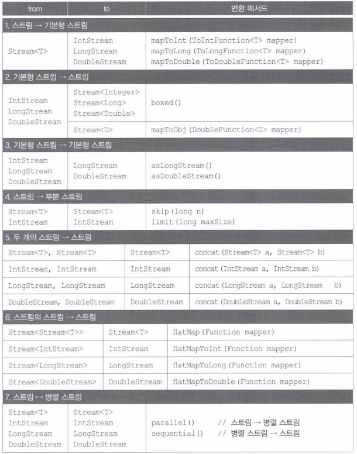
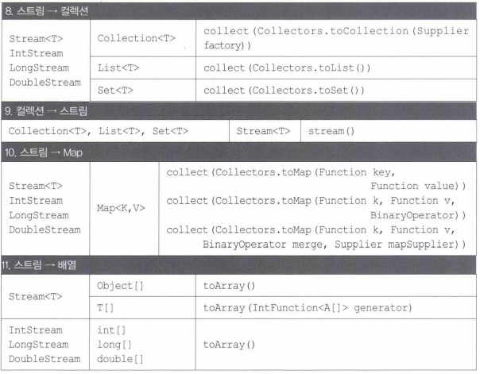

- [Collector 구현하기](#collector-구현하기)
- [스트림의 변환](#스트림의-변환)

---

# Collector 구현하기

Collect인터페이스를 구현하는 것

```java
public interface Collector<T, A, R>{
    Supplier<A> suppier(); //작업결과를 저장할 공간을 제공
    BiConsumer<A, T> accumulator(); //스트림의 요소를 수집(collect)할 방법을 제공
    BinaryOperator<A> combiner(); //두 저장공간을 병합할 방법을 제공(병렬 스트림)
    Function<A, R> finisher(); //결과를 최종적으로 변환할 방법을 제공

    //컬렉터의 특성이 담긴 Set을 반환
    Set<Characteristics> characteristics();
}
```

supplier()

- 수집 결과를 저장할 공간을 제공

accumulator()

- 스트림의 요소를 어떻게 supplier()가 제공한 공간에 누적할 것인지 정의

combiner()

- 병렬 스트림인 경우, 여러 쓰레드에 의해 처리된 결과를 어떻게 합칠 것인가 정의

finisher()

- 작업결과를 변환
- 변환이 필요없다면, 항등 함수인 Function.identity()를 반환

```java
public Function finisher(){
    //항등 함수를 반환.
    return Function.identity(); // return x -> x;
}
```

characteristics()

- 컬렉터가 수행하는 작업의 속성에 대한 정보를 제공

```java
Characteristics.CONCURRENT      병렬로 처리할 수 있는 작업
Characteristics.UNORDERED       스트림의 요소의 순서가 유지될 필요가 없는 작업
Characteristics.IDENTITY_FINISH finisher()가 항등 함수인 작업
```

- 위의 3가지 속성 중에서 해당하는 것을 다음과 같이 Set에 담아서 반환하도록 구현하면 된다.

```java
public Set<Characteristics> characteristics(){
    return Collections.unmodifiableSet(EnumSet.of(
        Collector.Characteristics.CONCURRENT,
        Collector.Charteristics.UNORDERED
    ;))
}
```

- 아무 속성을 지정하지 않으려면,

```JAVA
Set<Characteristics> characteristics(){
    return Collections.emptySet(); //지정할 특성이 없는 경우 비어있는  Set 을 반환
}
```

String배열의 모든 문자열을 하나의 문자열로 합치는 코드

```java
String[] strArr = {"aaa", "bbb", "ccc"};
StringBuffer sb = new StringBuffer(); //저장할 공간 생성, supplier()

for(String tmp : strArr)
    sb.append(tmp); //sb에 요소를 저장, accumulator()

String result = sb.toString(); //StringBuffer를 String으로 변환, finisher()
```

- 이 코드를 컬렉터의 코드로 구현

```java
package YJ14;

import java.util.Arrays;
import java.util.Collections;
import java.util.Set;
import java.util.function.BiConsumer;
import java.util.function.BinaryOperator;
import java.util.function.Function;
import java.util.function.Supplier;
import java.util.stream.Collector;
import java.util.stream.Stream;

public class YJ14_17 {

 public static void main(String[] args) {
  String[] strArr = {"aaa", "bbb", "ccc"};
  Stream<String> strStream = Stream.of(strArr);
  String result = strStream.collect(new ConcatCollector());
  
  System.out.println(Arrays.toString(strArr));
  System.out.println("result = " + result);
 }
}

class ConcatCollector implements Collector<String, StringBuilder, String>{
 public Supplier<StringBuilder> supplier(){
  return () -> new StringBuilder();
//  return StringBuilder::new;
 }
 
 @Override
 public BiConsumer<StringBuilder, String> accumulator(){
  return (sb, s) -> sb.append(s);
//  return StringBuilder::append;
 }
 
 @Override
 public Function<StringBuilder, String> finisher(){
  return sb -> sb.toString();
//  return StringBuilder::toString;
 }
 
 @Override
 public BinaryOperator<StringBuilder> combiner(){
  return (sb, sb2) -> sb.append(sb2);
//  return StringBuilder::append;
 }
 
 @Override
 public Set<Characteristics> characteristics(){
  return Collections.emptySet();
 }
}

<Console>
[aaa, bbb, ccc]
result = aaabbbccc
```

---

# 스트림의 변환




