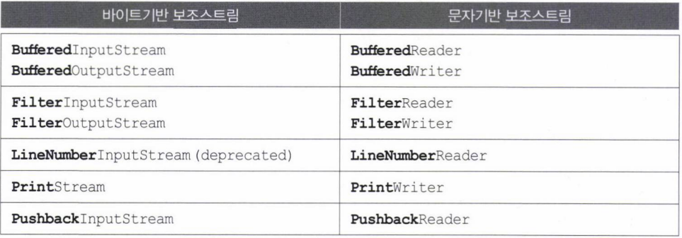
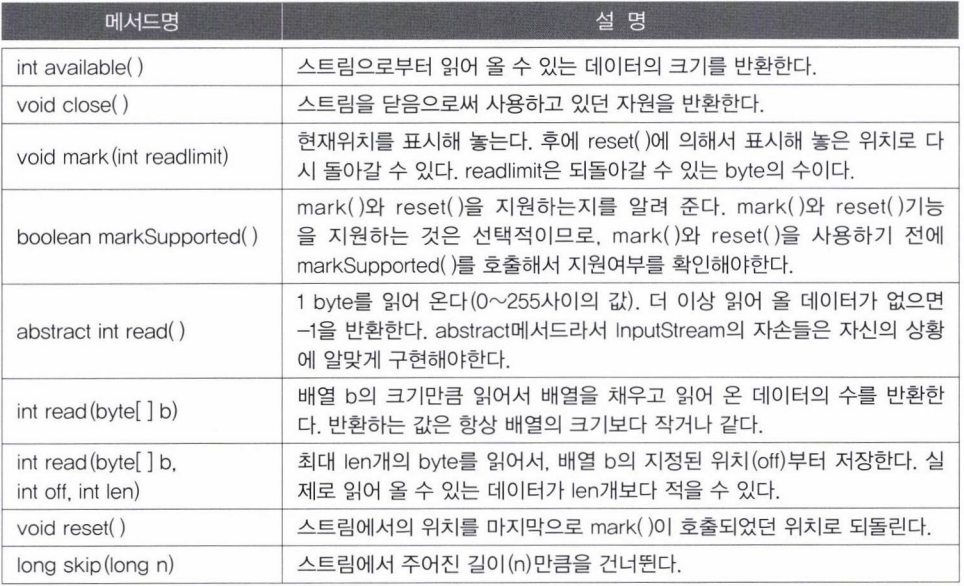
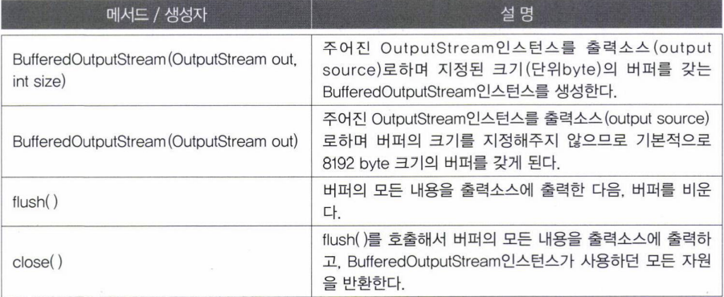
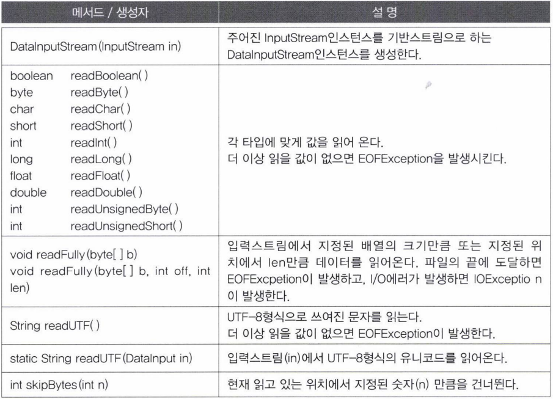
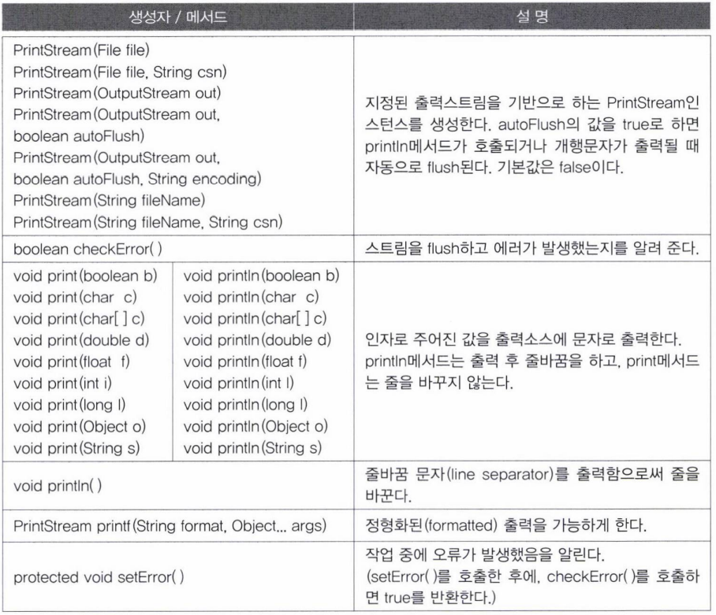
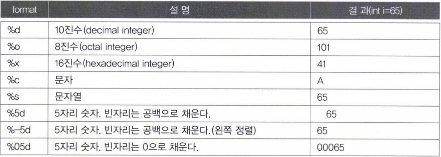
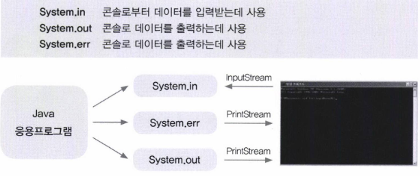
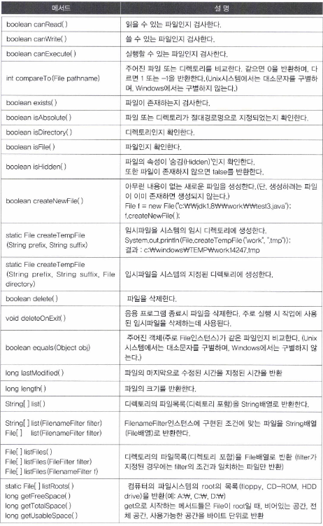
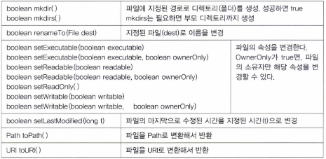

- [입출력](#입출력)
  - [스트림(stream)](#스트림stream)
  - [바이트기반 스트림 - InputStream, OutputStream](#바이트기반-스트림---inputstream-outputstream)
  - [보조 스트림](#보조-스트림)
  - [문자기반 스트림 - Reader, Writer](#문자기반-스트림---reader-writer)
- [바이트기반 스트림](#바이트기반-스트림)
  - [InputStream과 OutputStream](#inputstream과-outputstream)
  - [ByteArrayInputStream과 ByteArrayOutputStream](#bytearrayinputstream과-bytearrayoutputstream)
  - [FileInputStream과 FileOutputStream](#fileinputstream과-fileoutputstream)
- [바이트기반의 보조스트림](#바이트기반의-보조스트림)
  - [FilterInputStream과 FilterOutputStream](#filterinputstream과-filteroutputstream)
  - [BufferedInputStream과 BufferedOutputStream](#bufferedinputstream과-bufferedoutputstream)
  - [DataInputStream과 DataOutputStream](#datainputstream과-dataoutputstream)
  - [SequenceInputStream](#sequenceinputstream)
  - [PrintStream](#printstream)
- [문자기반 스트림](#문자기반-스트림)
  - [Reader와 Writer](#reader와-writer)
  - [FileReader와 FileWriter](#filereader와-filewriter)
  - [PipeReader와 PipeWriter](#pipereader와-pipewriter)
  - [StringReader와 StringWriter](#stringreader와-stringwriter)
- [문자기반의 보조스트림](#문자기반의-보조스트림)
  - [BufferedReader와 BufferedWriter](#bufferedreader와-bufferedwriter)
  - [InputStreamReader와 OutputStreamWriter](#inputstreamreader와-outputstreamwriter)
- [표준입출력과 File](#표준입출력과-file)
  - [표준입출력 - System.in, System.outm System.err](#표준입출력---systemin-systemoutm-systemerr)
  - [표준입출력의 대상변경 - setOut(), setErr(), setIn()](#표준입출력의-대상변경---setout-seterr-setin)
  - [RandomAccessFile](#randomaccessfile)
  - [File](#file)
- [직렬화(Serialization)](#직렬화serialization)
  - [직렬화란?](#직렬화란)
  - [ObjectInputStream, ObjectOutputStream](#objectinputstream-objectoutputstream)
    - [ObjectOutputStream](#objectoutputstream)
    - [ObjectInputStream](#objectinputstream)
  - [직렬화가 가능한 클래스 만들기 - Serializable, transient](#직렬화가-가능한-클래스-만들기---serializable-transient)
  - [직렬화가능한 클래스의 버전관리](#직렬화가능한-클래스의-버전관리)

---

# 입출력

컴퓨터 내부 또는 외부의 장치와 프로그램간의 데이터를 주고받는 것을 말한다.

---

## 스트림(stream)

데이터를 운반하는데 사용되는 연결통로

- 입력과 출력을 동시에 수행하려면 입출력스트림, 모두 2개의 스트림이 필요하다.

---

## 바이트기반 스트림 - InputStream, OutputStream


입출력의 대상이 달라져도 동일한 방법으로 입출력이 가능하다.


- InputStream의 read()와 OutputStream의 write(int b)는 입출력의 대상에 따라 읽고 쓰는 방법이 다를 것이기 때문에 각 상황에 알맞게 구현하라고 추상 메서드로 정의한 것
- read()는 반드시 구현되어야 쓸모가 있다.

---

## 보조 스트림

스트림의 기능을 보완하기 위한 스트림

- 보조스트림은 데이터를 입출력할 수 있는 기능은 없다.
  - 스트림의 기능을 향상시키거나 새로운 기능을 추가할 수 있다.
  - 스트림을 먼저 생성하고 이를 이용해서 보조스트림을 생성해야 한다.

```java
//먼저 기반 스트림 생성
FileInputStream fis = new FileInputStream("test.txt");

//기반 스트림을 생성해서 보조스트림을 생성
BufferedInputStream bis = new BufferedInputStream(fis);

//보조스트림인 bis로부터 데이터를 읽는다.
bis.read();
```

- 코드 상으로는 보조스트림이 입력기능을 수행하는 것처럼 보이지만, 실제 입력기능은 기반 스트림이 수행하고, 보조스트림은 버퍼만 제공하는 것이다.


---

## 문자기반 스트림 - Reader, Writer

문자를 의미하는 char형이 1byte가 아니고 2byte이기 때문에 바이트기반의 스트림으로 2byte인 문자를 처리하는 데는 어려움이 있다.

바이트기반 스트림 vs 문자기반 스트림


바이트기반 스트림 메서드 vs 문자기반 스트림 메서드


바이트기반 보조스트림 vs 문자기반 보조스트림



---

# 바이트기반 스트림

## InputStream과 OutputStream

InputStream의 메서드



- 스트림의 종류에 따라서 mark()와 reset()을 사용하여 이미 읽은 데이터를 되돌려서 다시 읽을 수 있다.

OutputStream의 메서드


- flush()는 버퍼가 있는 출력스트림의 경우에만 의미가 있다.
- 스트림을 이용해서 모든 작업을 마치고 난 후에는 close()를 호출해서 반드시 닫아준다.

---

## ByteArrayInputStream과 ByteArrayOutputStream

메모리, 즉 바이트배열에 데이터를 입출력 하는데 사용되는 스트림

- 주로 다른 곳에 입출력하기 전에 데이터를 임시로 바이트배열에 담아서 변환 등의 작업을 하는데 사용

스트림의 종류가 달라도 읽고 쓰는 방법은 동일

```java
package YJ15;

import java.io.ByteArrayInputStream;
import java.io.ByteArrayOutputStream;
import java.util.Arrays;

public class YJ15_01 {

 public static void main(String[] args) {
  byte[] inSrc = {0,1,2,3,4,5,6,7,8,9};
  byte[] outSrc = null;
  
  ByteArrayInputStream input = null;
  ByteArrayOutputStream output = null;
  
  input = new ByteArrayInputStream(inSrc);
  output = new ByteArrayOutputStream();
  
  int data = 0;
  
  while((data = input.read()) != -1){ //input을 read()한 반환값을 data에 저장한다.
   output.write(data); //void write(int b)
  }
  
  outSrc = output.toByteArray(); //스트림의 내용을 byte배열로 반환
  
  System.out.println("Input Source: " + Arrays.toString(inSrc));
  System.out.println("Output Source: " + Arrays.toString(outSrc));
 }

}

<Console>
Input Source: [0, 1, 2, 3, 4, 5, 6, 7, 8, 9]
Output Source: [0, 1, 2, 3, 4, 5, 6, 7, 8, 9]
```

- 바이트배열은 사용하는 자원이 메모리 밖에 없으므로 가바지컬렉터에 의해 자동적으로 반환된다.
  - close()를 이용해서 스트림을 닫지 않아도 된다.
- read()와 write(int b)를 사용하기 때문에 한 번에 1byte만 읽고 쓰므로 비효율적이다.

```java
package YJ15;

import java.io.ByteArrayInputStream;
import java.io.ByteArrayOutputStream;
import java.util.Arrays;

public class YJ15_02 {

 public static void main(String[] args) {
  byte[] inSrc = {0,1,2,3,4,5,6,7,8,9};
  byte[] outSrc = null;
  byte[] tmp = new byte[10];

  ByteArrayInputStream input = null;
  ByteArrayOutputStream output = null;

  input = new ByteArrayInputStream(inSrc);
  output = new ByteArrayOutputStream();

  input.read(tmp, 0, tmp.length); //input의 데이터를 읽어서 tmp의 0부터 tmp.length, 즉 tmp에 담는다.
  output.write(tmp, 5, 5); //tmp의 5부터 5개의 데이터를 output에 write한다.

  outSrc = output.toByteArray(); //스트림의 내용을 byte배열로 반환

  System.out.println("Input Source: " + Arrays.toString(inSrc));
  System.out.println("tmp:  " + Arrays.toString(tmp));
  System.out.println("Output Source: " + Arrays.toString(outSrc));
 }

}

<Console>
Input Source: [0, 1, 2, 3, 4, 5, 6, 7, 8, 9]
tmp:  [0, 1, 2, 3, 4, 5, 6, 7, 8, 9]
Output Source: [5, 6, 7, 8, 9]
```

- 이전 예제와는 달리 byte배열을 사용해서 한 번에 배열의 크기만큼 읽고 쓸 수 있다.
  - read와 write에 인자가 많은 메서드는 배열을 한 번에 읽고 쓴다.

```java
package YJ15;

import java.io.ByteArrayInputStream;
import java.io.ByteArrayOutputStream;
import java.io.IOException;
import java.util.Arrays;

public class YJ15_03 {

 public static void main(String[] args) {
  byte[] inSrc = {0,1,2,3,4,5,6,7,8,9};
  byte[] outSrc = null;
  byte[] tmp = new byte[4];

  ByteArrayInputStream input = null;
  ByteArrayOutputStream output = null;

  input = new ByteArrayInputStream(inSrc);
  output = new ByteArrayOutputStream();

  System.out.println("Input Source: " + Arrays.toString(inSrc));

  try {
   while(input.available() > 0) {
    input.read(tmp);
    output.write(tmp);

    outSrc = output.toByteArray();
    printArrays(tmp, outSrc);
   }
  } catch (IOException e) {}
 }//main

 static void printArrays(byte[] tmp, byte[] outSrc) {
  System.out.println("tmp:  " + Arrays.toString(tmp));
  System.out.println("Output Source: " + Arrays.toString(outSrc));
 }//printArrays
}//YJ15_03 class

<Console>
Input Source: [0, 1, 2, 3, 4, 5, 6, 7, 8, 9]
tmp:  [0, 1, 2, 3]
Output Source: [0, 1, 2, 3]
tmp:  [4, 5, 6, 7]
Output Source: [0, 1, 2, 3, 4, 5, 6, 7]
tmp:  [8, 9, 6, 7]
Output Source: [0, 1, 2, 3, 4, 5, 6, 7, 8, 9, 6, 7]
```

- read()나 write()이 IOException을 발생시킬 수 있기 때문에 try-catch문으로 감싸준다.
- available()은 블락킹(blocking) 없이 읽어 올 수 있는 바이트의 수를 반환한다.
  - 블락킹(blocking)
    - 데이터를 읽어 올 떄 데이터를 기다리기 위해 멈춰있는 것
    - 사용자가 데이터를 입력하기 전까지 기다리고 있는 것을 블락킹이라고 한다.
- 예상과 다르게 Output의 마지막에 6, 7이 추가되었다.
  - 이는 tmp에서 보다 나은 성능을 위해 tmp의 내용을 지우고 쓰는 것이 아니라 덮어 쓰기 떄문이다.
    - [4, 5, 6, 7]에서 남은 8, 9만 순서대로 덮어 씌운 것이다.
  - 알맞게 수정하려면 while문을 수정해야 한다.

```java
while(input.avilable() > 0{
 int len = input.read(tmp);
 output.write(tmp, 0, len);
})
```

```java
package YJ15;

import java.io.ByteArrayInputStream;
import java.io.ByteArrayOutputStream;
import java.io.IOException;
import java.util.Arrays;

public class YJ15_04 {

 public static void main(String[] args) {
  byte[] inSrc = {0,1,2,3,4,5,6,7,8,9};
  byte[] outSrc = null;
  byte[] tmp = new byte[4];

  ByteArrayInputStream input = null;
  ByteArrayOutputStream output = null;

  input = new ByteArrayInputStream(inSrc);
  output = new ByteArrayOutputStream();

  System.out.println("Input Source: " + Arrays.toString(inSrc));

  try {
   while(input.available() > 0) {
    int len = input.read(tmp);
    output.write(tmp, 0, len);

    outSrc = output.toByteArray();
    printArrays(tmp, outSrc);
   }
  } catch (IOException e) {}
 }//main

 static void printArrays(byte[] tmp, byte[] outSrc) {
  System.out.println("tmp:  " + Arrays.toString(tmp));
  System.out.println("Output Source: " + Arrays.toString(outSrc));
 }//printArrays
}//YJ15_03 class

<Console>
Input Source: [0, 1, 2, 3, 4, 5, 6, 7, 8, 9]
tmp:  [0, 1, 2, 3]
Output Source: [0, 1, 2, 3]
tmp:  [4, 5, 6, 7]
Output Source: [0, 1, 2, 3, 4, 5, 6, 7]
tmp:  [8, 9, 6, 7]
Output Source: [0, 1, 2, 3, 4, 5, 6, 7, 8, 9]
```

- 의도에 맞게 값이 출력된 것을 확인할 수 있다.

-

## FileInputStream과 FileOutputStream

파일에 입출력을 하기 위한 스트림

생성자


```java
package YJ15;

import java.io.*;

public class YJ15_05 {

 public static void main(String[] args){
  FileInputStream fis;
  FileOutputStream fos;
  try {
   fis = new FileInputStream(args[0]);
   fos = new FileOutputStream(args[1]);
   
   int data = 0;
   
   while((data = fis.read()) != -1) {
    fos.write(data);
   }
   
   fis.close();
   fos.close();
  } catch (FileNotFoundException e) {
   e.printStackTrace();
  } catch (IOException e) {
   e.printStackTrace();
  }
 }

}
```

- FileInputStream과 FileOutputStream을 사용해서 FileCopy.java파일의 내용을 그대로 FileCopy.bak로 복사하는 일을 한다.
- FileCopy.java의 파일을 read()로 읽어서, write(int b)로 FileCopy.bak에 출력한다.
  - 텍스트 파일이라면 문자기반 스트림인 FileReader/FileWriter를 사용하는게 좋다.


# 바이트기반의 보조스트림

## FilterInputStream과 FilterOutputStream

- 모든 보조스트림의 조상이다.
- 보조스트림은 자체적으로 입출력이 불가능하기 때문에, 기반 스트림이 필요하다.

생성자

```java
protected FilterInputStream(InputStream in)
public FilterOutputStream(OutputStream out)
```

FilterInputStream과 FilterOutputStream의 모든 메서드는 기반스트림의 메서드를 그대로 호출한다.

- 자체로는 아무것도 못한다.
  - 상속을 통해서 메서드를 오버라이딩 해야한다.

```java
public class FilterInputStream extend InputStream{
 protected volatile InputStream in;

 protected FilterInputStream(InputStream in){
  this.in = in;
 } //protected이기 때문에 인스턴스를 생성해서 사용할 수 없다.
 //상속을 통해서 오버라이딩해야 사용 가능

 public int read() throws Exception{
  return in.read();
 }
}
```

FilterInputStream/FilterOutputStream을 상속받아서 기반스트림에 보조기능을 추가한 보조스트림 클래스의 종류


## BufferedInputStream과 BufferedOutputStream

스트림의 입출력 효율을 높이기 위해 버퍼를 사용하는 보조스트림

- 한 바이트씩 출력하는 것 보다는 버퍼(바이트배열)를 이용해서 한 번에 여러 바이트를 입출력하는 것이 빠르다.

BufferedInputStream의 생성자


프로그램에서 입력소스로부터 데이터를 읽기 위해 처음으로 read메서드를 호출

- BufferedInputStream의 입력소스로부터 버퍼 크기만큼의 데이터를 읽어다 자신의 내부 버퍼에 저장한다.
- 이제 프로그램에서는 BufferedInputStream의 버퍼에 저장된 데이터를 읽으면 된다.
  - 빠르다.

BufferedOutputStream의 생성자


프로그램에 write메서드를 이용한 출력이 BufferedOutputStream의 버퍼에 저장된다.

- 버퍼가 가득 찰때만 버퍼의 모든 내용을 출력소스에 출력한다.
  - 마지막 출력부분이 출력소스에 쓰이지 못하고 BufferedOutputStream의 버퍼에 남아있는 채로 프로그램이 종료될 수도 있다.
  - 그래서 모든 출력작업을 마친 후에 BufferedOutputStream의 버퍼에 남아있는 모든 내용을 close()나 flush()를 호출해서 출력시킨다.
- 버퍼를 비우고 다시 출력을 저장할 준비를 한다.

```java
package YJ15;

import java.io.BufferedOutputStream;
import java.io.FileOutputStream;
import java.io.IOException;

public class YJ15_06 {
    public static void main(String[] args) {
        try {
            FileOutputStream fos = new FileOutputStream("123.txt");


            BufferedOutputStream bos = new BufferedOutputStream(fos, 5);


            for (int i = '1'; i <= '9'; i++) {
                bos.write(i);
            }
            fos.close();

        } catch (IOException e) {
            e.printStackTrace();
        }
    }
}
```

- 크기가 5인 BufferedOutputStream을 이용해서 파일 123.txt에 1부터 9까지 출력해야한다.
  - 하지만 5까지만 출력된다.
    - 6, 7, 8, 9는 4의 크기이기 때문에 버퍼가 다 차지 않아서 출력하지 못하고 프로그램이 종료된 것이다.
- 코드에서는 fos.close()로 스트림을 닫아줬지만, BufferedOutputStream에 있는 내용을 출력하려면 bos.close()를 호출해줘야 한다.
  - 보조스트림의 close()는 기반스트림의 close()를 자동으로 호출한다.
- 보조스트림을 사용한 경우에는 기반스트림의 close()나 flush()를 호출할 필요없이 단순히 보조스트림의 close()를 호출하기만 하면 된다.

## DataInputStream과 DataOutputStream

DataInputStream은 DataInput 인터페이스를, DataOutputStream은 DataOutput 인터페이스를 구현했다.

- 데이터를 읽고 쓰는데 있어서 byte단위가 아닌, 8가지 기본 자료형의 단위로 읽고 쓸 수 있다는 장점이 있다.
- DataOutputStream이 출력하는 형식은 각 기본 자료형 값을 16진수로 표현하여 저장한다.

DataInputStream의 생성자와 메서드



DataOutputStream의 생성자와 메서드


```java
package YJ15;

import java.io.DataOutputStream;
import java.io.FileOutputStream;
import java.io.IOException;

public class YJ15_08 {
    public static void main(String[] args) {
        FileOutputStream fos = null;
        DataOutputStream dos = null;

        try{
            fos = new FileOutputStream("sample.dat");
            dos = new DataOutputStream(fos);
            dos.write(10);
            dos.writeFloat(20.0f);
            dos.writeBoolean(true);

            dos.close();
        } catch (IOException e){
            e.printStackTrace();
        }
    }
}
```

- DataOutputStream은 16진수로 값을 출력하기 때문에 cmd에서 알 수 없는 형식이 출력된다.
  - 파일을 16진수 코드로 볼 수 있는 ByteArrayOutputStream을 사용하면 이진데이터를 확인할 수 있다.

```java
package YJ15;

import java.io.ByteArrayOutputStream;
import java.io.DataOutputStream;
import java.io.IOException;
import java.util.Arrays;

public class YJ15_09 {
    public static void main(String[] args) {
        ByteArrayOutputStream bos = null;
        DataOutputStream dos = null;

        byte[] result = null;
        try{
            bos = new ByteArrayOutputStream();
            dos = new DataOutputStream(bos);
            dos.writeInt(10);
            dos.writeFloat(20.0f);
            dos.writeBoolean(true);

            result = bos.toByteArray();
            String[] hex = new String[result.length];

            for(int i = 0; i < result.length; i++){
                if(result[i] < 0){
                    hex[i] = String.format("%02x", result[i] + 256); //byte의 범위가 -128~127이므로 -1로 인식한다. 256을 더해줘야 0~255가 된다.
                } else {
                    hex[i] = String.format("%02x", result[i]);
                }
            }

            System.out.println("10진수: " + Arrays.toString(result));
            System.out.println("16진수: " + Arrays.toString(hex));
            dos.close();
        } catch (IOException e){
            e.printStackTrace();
        }
    }
}

<Console>
10진수: [0, 0, 0, 10, 65, -96, 0, 0, 1]
16진수: [00, 00, 00, 0a, 41, a0, 00, 00, 01]
```

- 4byte의 값은 writeInt에서, 4byte는 wirteFloat에서, 1byte는 writeBoolean에서 출력된 값이다.
- ByteArrayInputStream과 ByteArrayOutputStream을 사용하면 byte단위의 데이터 변환 및 조작이 가능하다.
- InputStrea의 read()는 반환타입이 int이므로 0~255의 범위여서 256을 더하거나 뺄 필요가 없다.
- read(byte[])와 같이 byte배열을 사용하는 경우 상황에 맞게 0~255로 변환해줘야 한다.

사실 DataoutputStream의 write메서드로 기록한 데이터는 DataOutputStream의 read메서드로 읽으면 된다.

- 읽을 때는 반드시 쓰인 순서대로 읽어야 한다.

```java
package YJ15;

import java.io.DataInputStream;
import java.io.FileInputStream;
import java.io.IOException;

public class YJ15_10 {
    public static void main(String[] args) {
        try{
            FileInputStream fis = new FileInputStream("sample.dat");
            DataInputStream dis = new DataInputStream(fis);

            System.out.println(dis.readInt());
            System.out.println(dis.readFloat());
            System.out.println(dis.readBoolean());
            dis.close();
        } catch (IOException e) {
            e.printStackTrace();
        }
    }
}

<Console>
10
20.0
true
```

- YJ15_08에서 만든 sample.dat을 읽어서 화면에 출력한다.
  - 읽어 올 데이터의 타입에 맞는 메서드를 사용하기만 하면된다.
  - readInt() - writeInt() 등

문자로 데이터로 저장할 때, 만약 "100"과 같은 문자열이라면 이 문자를 숫자로 변환해야한다.

- DataInputStream과 DataOutputStream을 사용하면, 데이터를 변환할 필요도 없고, 자리수를 세어서 따지지 않아도 되므로 편리하고 빠르다.

```java
package YJ15;

import java.io.DataOutputStream;
import java.io.FileOutputStream;
import java.io.IOException;

public class YJ15_11 {
    public static void main(String[] args) {
        int[] score = {100,  90, 95,85, 50};
        try{
            FileOutputStream fos = new FileOutputStream("score.dat");
            DataOutputStream dos = new DataOutputStream(fos);

            for(int i = 0; i < score.length; i++){
                dos.write(score[i]);
            }
            dos.close();
        } catch (IOException e){
            e.printStackTrace();
        }
    }
}
```

- type score.dat 명령을 하면 숫자가 아닌 문자가 나온다.
  - type명령이 파일의 내용을 문자로 변환해서 보여주기 때문이다.

```java
package YJ15;

import java.io.DataInputStream;
import java.io.EOFException;
import java.io.FileInputStream;
import java.io.IOException;

public class YJ15_12 {
    public static void main(String[] args) throws Exception{
        int sum = 0;
        int score = 0;

        FileInputStream fis = null;
        DataInputStream dis = null;

        try{
            fis = new FileInputStream("score.dat");
            dis = new DataInputStream(fis);

                while(true) {
                    score = dis.readInt();
                    System.out.println(score);
                    sum += score;
                }

        } catch (EOFException e){
            System.out.println("점수의 총합은 " + sum + "입니다.");
        } catch (IOException ie){
            ie.printStackTrace();
        } finally {
            try{
                if(dis != null){
                    dis.close();
                }
            } catch (IOException ie){
                ie.printStackTrace();
            }
        }
    }
}

<Console>
100
90
95
85
50
점수의 총합은 420입니다.
```

- 사실 프로그램이 종료될 때, 가바지 컬렉터가 사용하던 자원들을 모두 해제 해주기 때문에 이렇게 간단한 예제에서는 스트림을 닫지 않아도 문제가 되지 않는다.
  - 그래도 스트림을 사용한 직후에 바로 닫아서 자원을 반환하는 것이 좋다.
- try-catch-resource문을 이용해서 close를 직접 호출하지 않아도 자동호출되도록 할 수 있다.

```java
package YJ15;

import java.io.DataInputStream;
import java.io.EOFException;
import java.io.FileInputStream;
import java.io.IOException;

public class YJ15_13 {
    public static void main(String[] args) {
        int sum = 0;
        int score = 0;

  //try문 안에 자원을 넣어준다. try-catch-resource
        try (FileInputStream fis = new FileInputStream("score.dat");
             DataInputStream dis = new DataInputStream(fis)) {

            while (true) {
                score = dis.readInt();
                System.out.println(score);
                sum += score;
            }
        } catch (EOFException e) {
            System.out.println("점수의 총합은 " + sum + "입니다.");
        } catch (IOException ie) {
            ie.printStackTrace();
        }
    }
}

<Console>
100
90
95
85
50
점수의 총합은 420입니다.
```

## SequenceInputStream

여러 개의 입력스트림을 연속적으로 연결해서 하나의 스트림으로부터 데이터를 읽는 것과 같이 처리할 수 있게 해준다.

- 큰 파일을 여러 개의 작은 파일로 나누었다가 하나의 파일로 합치는 것과 같은 작업을 수행할 때 사용하면 좋다.

SequenceInputStream의 생성자


Vector에 연결할 입력스트림들을 저장한 다음 Vector의 Enumeration elements()를 호출해서 생성자의 매개변수로 사용한다.

```java
Vector files = new Vector();
files.add(new FileInputStream("file.001"));
files.add(new FileInputStream("file.002"));
SequenceInputStream in = new SequenceInputStream(files.elements());
```

```java
FileInputStream file1 = new FileInputStream("file.001");
FileInputStream file2 = new FileInputStream("file.002");
SequenceInputStream in = new SequenceInputStream(file1, file2);
```

```java
package YJ15;

import java.io.ByteArrayInputStream;
import java.io.ByteArrayOutputStream;
import java.io.IOException;
import java.io.SequenceInputStream;
import java.util.Arrays;
import java.util.Vector;

public class YJ15_14 {
    public static void main(String[] args) {
        {
            byte[] arr1 = {0, 1, 2};
            byte[] arr2 = {3, 4, 5};
            byte[] arr3 = {6, 7, 8};
            byte[] outSrc = null;

            Vector v = new Vector();
            v.add(new ByteArrayInputStream(arr1));
            v.add(new ByteArrayInputStream(arr2));
            v.add(new ByteArrayInputStream(arr3));

            SequenceInputStream input = new SequenceInputStream(v.elements());
            ByteArrayOutputStream output = new ByteArrayOutputStream();

            int data = 0;

            try{
                while((data = input.read()) != -1){
                    output.write(data); //void write(int b)
                }
            } catch (IOException e){}

            outSrc = output.toByteArray();

            System.out.println("Input Source1: " + Arrays.toString(arr1));
            System.out.println("Input Source2: " + Arrays.toString(arr2));
            System.out.println("Input Source3: " + Arrays.toString(arr3));
            System.out.println("Output Source: " + Arrays.toString(outSrc));
        }
    }
}

<Console>
Input Source1: [0, 1, 2]
Input Source2: [3, 4, 5]
Input Source3: [6, 7, 8]
Output Source: [0, 1, 2, 3, 4, 5, 6, 7, 8]
```

- Vector에 저장된 순서대로 입력되므로 순서에 주의해야 한다.

## PrintStream

데이터를 기반스트림에 다양한 형태로 출력할 수 있는 print, println, printf와 같은 메서드를 오버로딩하여 제공한다.

- 데이터를 적절한 문자로 출력
  - 문자기반 스트림의 역할을 한다.
- PrintWriter가 성능이 더 좋다.
  - 다양한 언어의 문자를 처리하는데 적합하다.
  - 가능하면 PrintWriter를 쓰자.

PrintStream의 생성자와 메서드


>i + ""와 String.valueOf(i)는 같은 결과를 얻지만 String.valueOf(i)가 성능이 더 좋다.

printf() 지시자(정수)


printf() 지시자(문자열)


printf() 지시자(실수)


printf() 지시자(특수문자)


printf() 지시자(날짜와 시간)


---

# 문자기반 스트림

문자데이터를 다루는데 사용된다는 것을 제외하고 바이트기반 스트림과 문자기반 스트림의 사용방법은 거의 같다.

## Reader와 Writer

문자기반의 스트림에서는 Reader/Writer가 조상이다.

Reader의 메서드


Writer의 메서드


- 문자기반 스트림이라는 것은 2byte로 스트림을 처리하는 것 뿐만 아니라 인코딩도 중요하다.
  - 문자기반 스트림, 즉 Reader/Writer 그리고 그 자손들은 여러 종류의 인코딩과 자바에서 사용하는 유니코드(UTP-16)간의 변환을 자동적으로 처리해준다.

## FileReader와 FileWriter

파일로부터 텍스트데이터를 읽고, 파일에 쓰는데 사용된다.

```java
package YJ15;

import java.io.FileInputStream;
import java.io.FileReader;
import java.io.IOException;

public class YJ15_16 {
    public static void main(String[] args) {
        try{
            String fileName = "test.txt";
            FileInputStream fis = new FileInputStream(fileName);
            FileReader fr = new FileReader(fileName);

            int data = 0;
            //FileInputStream을 이용해서 파일내용을 읽어 화면에 출력한다.
            while((data = fis.read()) != -1){
                System.out.println((char)data);
            }
            System.out.println();
            fis.close();

            //FileReader를 이용해서 파일내용을 읽어 화면에 출력한다.
            while((data = fr.read()) != -1){
                System.out.println((char)data);
            }
            System.out.println();
            fr.close();
        } catch (IOException e){
            e.printStackTrace();
        }
    }
}
```

- FileInputStream로 출력한다면 한글이 깨지고, FileReader로 출력하면 한글이 잘 출력이 된다.

## PipeReader와 PipeWriter

쓰레드 간에 데이터를 주고받을 때 사용된다.

- 다른 스트림과 달리 입력과 출력스트림을 하나의 스트림으로 연결해서 데이터를 주고받는다.
- 스트림을 생성한 다음에 어느 한쪽 쓰레드에서 connect()를 호출해서 입력스트림과 출력스트림을 연결한다.
  - 어느 한쪽 스트림만 닫아도 나머지 스트림은 자동으로 닫힌다.

```java
package YJ15;

import java.io.IOException;
import java.io.PipedReader;
import java.io.PipedWriter;
import java.io.StringWriter;

public class YJ15_18 {
    public static void main(String[] args) {
        InputThread inThread = new InputThread("InputThread");
        OutputThread outThread = new OutputThread("OutputThread");

        //PipeReader와 PipeWriter를 연결한다.
        inThread.connect(outThread.getOutput());

        inThread.start();
        outThread.start();
    }//main
}

class InputThread extends Thread{
    PipedReader input = new PipedReader();
    StringWriter sw = new StringWriter();

    InputThread(String name){
        super(name); //Thread(String name)
    }

    public void run(){
        try {
            int data = 0;

            while ((data = input.read()) != -1) {
                sw.write(data);
            }
            System.out.println(getName() + " received: " + sw.toString());
        } catch (IOException e) {}
    }

    public PipedReader getInput(){
        return input;
    }

    public void connect(PipedWriter output){
        try{
            input.connect(output);
        } catch (IOException e) {}
    }
}

class OutputThread extends Thread {
    PipedWriter output = new PipedWriter();

    OutputThread(String name){
        super(name); //Thread(String name)
    }

    public void run(){
        try {
            String msg = "Hello";
            System.out.println(getName() + " sent: " + msg);
            output.write(msg);
            output.close();
        } catch (IOException e) {}
    }

    public PipedWriter getOutput(){
        return output;
    }

    public void connect(PipedReader input){
        try{
            output.connect(input);
        } catch (IOException e) {}
    }
}

<Console>
OutputThread sent: Hello
InputThread received: Hello
```

## StringReader와 StringWriter

CharArrayRedaer/CharArrayWriter와 같이 입출력 대상이 메모리인 스트림이다.

- StringWriter에 출력되는 데이터는 내부의 StringBuffer에 저장된다.
- StringWriter는 다음의 메서드를 이용해 저장된 데이터를 얻는다.


```java
package YJ15;

import java.io.IOException;
import java.io.StringReader;
import java.io.StringWriter;
import java.util.Arrays;

public class YJ15_19 {
    public static void main(String[] args) {
        String inputData = "ABCD";
        StringReader input = new StringReader(inputData);
        StringWriter output = new StringWriter();
        int data = 0;

        try{
            while((data = input.read()) != -1){
                output.write(data); //void write(int b)
            }
        } catch (IOException e){}

        System.out.println("Input Data: " + inputData);
        System.out.println("Output Data: " + output.getBuffer());
        System.out.println("Output Data: " + output.getBuffer().toString());
    }
}

<Console>
Input Data: ABCD
Output Data: ABCD
Output Data: ABCD
```

---

# 문자기반의 보조스트림

## BufferedReader와 BufferedWriter

버퍼를 이용해서 입출력의 효율을 높일 수 있도록 해주는 역할을 한다.

- BufferedReader의 readLine()을 사용하면 데이터를 라인단위로 읽어온다.
- BufferedWriter의 newLine()을 사용하면 줄바꿈 해준다.

```java
package YJ15;

import java.io.BufferedReader;
import java.io.FileReader;
import java.io.IOException;

public class YJ15_20 {
    public static void main(String[] args) {
        try {
            FileReader fr = new FileReader("YJ15_20.java");
            BufferedReader br = new BufferedReader(fr);

            String line = "";
            for(int i = 1; (line = br.readLine()) != null; i++){
                //";"을 포함한 라인을 출력한다.
                if (line.indexOf(";") != -1) {
                    System.out.println(i + ":" + line);
                }
            }
            br.close();

        } catch (IOException e){}
    }
}

<Console>
위의 코드가 그대로 출력된다.
```

## InputStreamReader와 OutputStreamWriter

바이트기반 스트림을 문자기반 스트림으로 연결시켜주는 역할을 한다.

- 바이트기반 스트림의 데이터를 지정된 인코딩의 문자데이터로 변환하는 작업을 수행

InputStreamReader의 생성자와 메서드


OutputStreamWriter의 생성자와 메서드


- 한글 윈도우에서 중국어로 작성된 파일을 읽을 때 InputStreamReader(InputStream in, String encoding)를 이용해서 인코딩이 중국어로 되어있다는 것을 지정해줘야 한다.
- OutputStreamWriter를 이용해서 파일에 텍스트데이터를 저장할 때 생성자 OutputStreamWriter(OutputStream out, String encoding)를 이용해서 인코딩을 지정하지 않으면 OS에서 사용되는 인코딩으로 데이터를 저장할 것이다.

>시스템 속성에서 sun.jnu.encoding의 값을 보면 OS에서 사용되는 인코딩의 종류를 알 수 있다.

```java
Properties prop = System.get.Properties();
System.out.println(prop.get("snu.jun.encoding"));
```

```java
package YJ15;

import java.io.BufferedReader;
import java.io.IOException;
import java.io.InputStreamReader;

public class YJ15_21 {
    public static void main(String[] args) {
        String line = "";

        try{
   //BufferedReader와 InputStream인 System.in을 연결하기 위해 InputStreamReader을 사용
            InputStreamReader isr = new InputStreamReader(System.in);
            BufferedReader br = new BufferedReader(isr);

            System.out.println("사용중인 OS의 인코딩: " + isr.getEncoding());
            do{
                System.out.println("문장을 입력하세요. 마치시려면 q를 입력하세요.");
                line = br.readLine();
                System.out.println("입력하신 문장: " + line);
            } while(!line.equalsIgnoreCase("q"));

//            br.close(); //System.in과 같은 표준입출력은 닫지 않아도 된다.
            System.out.println("프로그램을 종료합니다.");
        } catch (IOException e){}
    }
}
```

# 표준입출력과 File

## 표준입출력 - System.in, System.outm System.err

표준입출력은 콘솔을 통한 데이터 입력과 콘솔로의 데이터 출력을 의미한다.



```java
public final class System{
    public final static InputStream in = nullInputStream();
    public final static InputStream out = nullPrintStream();
    public final static InputStream err = nullPrintStream();
}
```

- 선언 부분을 봐서는 out, err, in의 타입은 InputStream과 PrintStream
  - 실제로는 버퍼를 이용하는 BufferedInputStream과 BufferedOutputStream의 인스턴스를 이용하는 것이다.

```java
import java.io.IOException;

public class YJ1522 {
    public static void main(String[] args) {
        try{
            int input = 0;
            while((input = System.in.read()) != -1){
                System.out.println("input: " + input + ", (char)input: " + (char)input);
            }
        } catch (IOException e){
            e.printStackTrace();
        }
    }
}
```

- 콘솔입력은 버퍼를 가지고 있기 때문에 BackSpace키를 이용해서 편집이 가능하며 한 번에 버퍼의 크기만큼 입력이 가능하다.
- 엔터를 누를 때까지 블락킹 상태에 머무르는 것이다.
- 엔터키를 누르는 것은 두개의 특수문자 '\r'과 'n'이 입력된 것으로 간주
  - \r
    - 케리지 리턴(carriage return)
    - 커서를 현재 라인의 첫 번째 컬럼으로 이동시킨다.
  - \n
    - 커서를 다음 줄로 줄 바꿈
- Ctrl + z를 누르면 프로그램이 종료된다.

## 표준입출력의 대상변경 - setOut(), setErr(), setIn()

입출력을 콘솔 이외에 다른 입출력 대상으로 변경하는 것이 가능하다.


```java
public class YJ15_23 {
    public static void main(String[] args) {
        System.out.println("out: Hello World!");
        System.err.println("err: Hello World");
    }
}

<Console>
out: Hello World!
err: Hello World!
```

- 모두 출력대상이 콘솔이기 때문에 둘 다 같은 결과를 얻는다.

```java
import java.io.FileNotFoundException;
import java.io.FileOutputStream;
import java.io.PrintStream;

public class YJ15_24 {
    public static void main(String[] args) {
        PrintStream ps = null;
        FileOutputStream fos = null;

        try{
            fos = new FileOutputStream("test.txt");
            ps = new PrintStream(fos);
            System.setOut(ps); //System.out의 출력대상을 test.txt로 변경
        } catch (FileNotFoundException e){
            System.out.println("File not found");
        }

        System.out.println("Hello by System.out");
        System.err.println("Hello by System.err");
    }
}

<cmd>
D:\study\Codes\YJ\src\YJ15>javac YJ15_24.java

D:\study\Codes\YJ\src\YJ15>java YJ15_24
Hello by System.err

D:\study\Codes\YJ\src\YJ15>type test.txt
Hello by System.out
```

- System.out의 출력소스를 test.txt파일로 변경하였기 때문에 System.out을 이용한 출력은 모두 test.txt파일에 저장된다.
  - 실행결과는 System.err의 출력만 나타난다.
- setOut()과 같은 메소드를 사용하는 방법 외에도 커맨드라인에서 표준입출력의 대상을 간단히 바꿀 수 있다.

```java
public class YJ15_23 {
    public static void main(String[] args) {
        System.out.println("out: Hello World!");
        System.err.println("err: Hello World");
    }
}

<cmd>
D:\study\Codes\YJ\src\YJ15>javac YJ15_23.java

D:\study\Codes\YJ\src\YJ15>java YJ15_23 > output.txt
err: Hello World!

D:\study\Codes\YJ\src\YJ15>type output.txt
out: Hello World!
```

- YJ15_23의 System.out출력을 콘솔이 아닌 output.txt로 지정한다.
  - System.out의 출력은 output.txt에 저장된다.
    - 기존의 output.txt의 내용을 덮어씌운다.

```java
public class YJ15_23 {
    public static void main(String[] args) {
        System.out.println("out: Hello World!");
        System.err.println("err: Hello World");
    }
}

<cmd>
D:\study\Codes\YJ\src\YJ15>java YJ15_23 >> output.txt
err: Hello World!

D:\study\Codes\YJ\src\YJ15>type output.txt
out: Hello World!
out: Hello World!
```

- '>>'는 기존 내용의 마지막에 새로운 내용이 추가된다.
  - 덮어씌우지 않는 것

## RandomAccessFile

RandomAccessFile만은 하나의 클래스로 파일에 대한 입력과 출력을 모두 할 수 있다.

- DataInput인터페이스와 DataOutput인터페이스를 모두 구현했다.
  - 읽기, 쓰기가 모두 가능
  - 어느 위치에나 가능하다.
    - 내부적으로 파일 포인터를 사용한다.
    - 입출력 시에 작업이 수행되는 곳이 파일 포인터가 위치한 곳
      - 파일 포인터의 위치는 파일의 제일 첫 부분(0부터 시작)
      - 읽기 또는 쓰기를 마치면 다음 위치로 이동
      - 원하는 위치로 파일 포인터를 옮기는 작업이 필요하다.
- getFilePointer()
  - 작업 중인 파일에서 파일 포인터의 위치를 반환
- seek(long pos), skipBytes(int n)
  - 파일 포인터의 위치를 옮긴다.


```java
import java.io.IOException;
import java.io.RandomAccessFile;
import java.util.RandomAccess;

public class YJ15_25 {
    public static void main(String[] args) {
        try {
            RandomAccessFile raf = new RandomAccessFile("test.dat", "rw");
            System.out.println("파일 포인터의 위치: " + raf.getFilePointer());
            raf.writeInt(100);
            System.out.println("파일 포인터의 위치: " + raf.getFilePointer());
            raf.writeLong(100L);
            System.out.println("파일 포인터의 위치: " + raf.getFilePointer());
        } catch (IOException e) {
            e.printStackTrace();
        }
    }
}

<Console>
파일 포인터의 위치: 0
파일 포인터의 위치: 4
파일 포인터의 위치: 12
```

- int는 4byte이기 때문에 writeInt()를 호출한 다음 파일 포인터의 위치가 0에서 4로 바뀌었다.
- long은 8byte이기 때문에 writeLong()을 호출한 후에 포인터의 위치가 4에서 12가 되었다.

```java
import java.io.EOFException;
import java.io.IOException;
import java.io.RandomAccessFile;

public class YJ15_26 {
    public static void main(String[] args) {
        //         국어 영어 수학
        int[] score = {
                1, 100, 90, 90,
                2, 70, 90, 100,
                3, 100, 100, 100,
                4, 70, 60, 80,
                5, 70, 90, 100
        };

        try {
            RandomAccessFile raf = new RandomAccessFile("score2.dat", "rw");
            for (int i = 0; i < score.length; i++) {
                raf.writeInt(score[i]);
            }
            while (true) {
                System.out.println(raf.readInt());
            }
        } catch (EOFException eof) { //readInt()를 호출했을 때 더 이상 읽을 내용이 없으면 EOFException이 발생
            eof.printStackTrace();
        } catch (IOException e) {
            e.printStackTrace();
        }
    }
}

<Console>
java.io.EOFException
 at java.base/java.io.RandomAccessFile.readInt(RandomAccessFile.java:838)
 at YJ15_26.main(YJ15_26.java:21)
```

- 배열이 저장된 score.dat을 readInt()로 읽어서 출력하도록 했지만, 예외가 발생했다.
  - writeInt()를 수행하면서 파일 포인터의 위치가 파일의 마지막으로 이동해서 정작 readInt()의 차례가 왔을 때는 파일 포인터가 마지막에 위치해있기 때문에 아무것도 읽지 못하고 EOFException예외를 발생시킨 것이다.
    - 이럴 때는 seek(long pos)를 이용해서 파일포인터의 위치를 다시 처음으로 이동시킨 다음에 readInt()를 호출해야 한다.

```java
import java.io.EOFException;
import java.io.IOException;
import java.io.RandomAccessFile;

public class YJ15_27 {
    public static void main(String[] args) {
        int sum = 0;

        try {
            RandomAccessFile raf = new RandomAccessFile("score2.dat", "r");
            int i = 4;

            while (true) {
                raf.seek(i);
                sum += raf.readInt();
                i += 16;
            }
        } catch (EOFException eof) {
            System.out.println("sum: " + sum);
        } catch (IOException e) {
            e.printStackTrace();
        }
    }
}

<Console>
sum: 410
```

- 이전 예제에서 데이터를 저장한 score2.dat파일에서 국어 점수들의 합계를 내는 예제이다.
- 한 학생의 데이터가 번호와 3과목의 점수로 4개이다.(4 * 4 = 16byte)
  - i += 16과 같이 파일 포인터의 값을 16씩 증가시키면서 readInt()를 호출한다.

## File

File의 생성자와 경로에 관련된 메서드


경로와 관련된 File의 멤버변수


```java
import java.io.File;
import java.io.IOException;

public class YJ15_28 {
    public static void main(String[] args) throws IOException {
        File f = new File("D:\\study\\Codes\\YJ\\src\\YJ15\\YJ15_28.java");
        String fileName = f.getName();
        int pos = fileName.lastIndexOf(".");

        System.out.println("경로를 제외한 파일이름 - " + f.getPath());
        System.out.println("확장자를 제외한 파일이름 - " + fileName.substring(0, pos));
        System.out.println("확장자 - " + fileName.substring(pos + 1));

        System.out.println("경로를 포함한 파일이름 - " + f.getPath());
        System.out.println("파일의 절대경로 - " + f.getAbsolutePath());
        System.out.println("파일의 정규경로 - " + f.getCanonicalPath());
        System.out.println("파일이 속해 있는 디렉토리 - " + f.getParent());
        System.out.println();
        System.out.println("File.pathSeparator - " + File.pathSeparator);
        System.out.println("File.pathSeparatorChar - " + File.pathSeparatorChar);
        System.out.println("File.separator - " + File.separator);
        System.out.println("File.pathSeparatorChar - " + File.pathSeparatorChar);
        System.out.println();
        System.out.println("user.dir = " + System.getProperty("user.dir"));
        System.out.println("sun.boot.class.path = " + System.getProperty("sun.boot.class.path"));
    }
}

<Console>
경로를 제외한 파일이름 - D:\study\Codes\YJ\src\YJ15\YJ15_28.java
확장자를 제외한 파일이름 - YJ15_28
확장자 - java
경로를 포함한 파일이름 - D:\study\Codes\YJ\src\YJ15\YJ15_28.java
파일의 절대경로 - D:\study\Codes\YJ\src\YJ15\YJ15_28.java
파일의 정규경로 - D:\study\Codes\YJ\src\YJ15\YJ15_28.java
파일이 속해 있는 디렉토리 - D:\study\Codes\YJ\src\YJ15

File.pathSeparator - ;
File.pathSeparatorChar - ;
File.separator - \
File.pathSeparatorChar - ;

user.dir = D:\study
sun.boot.class.path = null
```

- 절대경로(absolute path)
  - 파일시스템의 루트로부터 시작하는 파일의 전체 경로
  - 현재 디렉토리를 의미하는 '.'와 같은 기호나 링크 등을 포함하고 있는 경우
- 정규경로(canonical path)
  - 기호나 링크 등을 포함하지 않는 유일한 경로
- user.dir
  - 현재 프로그램이 실행 중인 디렉토리
- sun.boot.class.path
  - 시스템 속성에 기본적인 classpath가 있어서 기본적인 경로들은 이미 설저되어 있다.
  - 그래서 따로 classpath설정을 해주지 않아도 된다.
    - JDK1.2버전 이전에는 rt.jar와 같은 파일을 classpath에 지정해줘야 했다.


File의 메서드




```java
import java.io.File;

public class YJ15_29 {
    public static void main(String[] args) {
        if (args.length != 1) {
            System.out.println("USAGE:  java YJ15_29 DIRECTORY");
            System.exit(0);
        }

        File f = new File(args[0]);

        if (!f.exists() || !f.isDirectory()) {
            System.out.println("유효하지 않은 디렉토리입니다.");
            System.exit(0);
        }

        File[] files = f.listFiles();

        for (int i = 0; i < files.length; i++) {
            String fileName = files[i].getName();
            System.out.println(files[i].isDirectory() ? "[" + fileName + "]" : fileName);
        }
    }
}

<cmd>
D:\study\Codes\YJ\src\YJ15>javac YJ15_29.java

D:\study\Codes\YJ\src\YJ15>java YJ15_29
USAGE:  java YJ15_29 DIRECTORY

D:\study\Codes\YJ\src\YJ15>java YJ15_29 work
There is no Directory

D:\study\Codes\YJ\src\YJ15>java YJ15_29 d:\
[!@Irj]
[$RECYCLE.BIN]
[employees]
[study]
[System Volume Information]
[거위]
```

# 직렬화(Serialization)

## 직렬화란?

객체를 데이터 스트림으로 만드는 것

- 객체에 저장된 데이터를 스트림에 쓰기 위해 연속적인 데이터로 변환하는 것
- 역직렬화(deserializaiton)
  - 스트림으로부터 데이터를 읽어서 객체를 만드는 것


객체

- 인스턴스변수들의 집합

## ObjectInputStream, ObjectOutputStream

### ObjectOutputStream

- 직렬화(스트림에 객체를 출력)
  - 객체를 생성할 때 스트림을 지정해줘야 한다.
- 보조스트림

```java
FileOutputStream fos = FileOutputStream("objectfile.ser"); //출력할 (기반)스트림 생성
ObjectOutputStream out = new ObjectOutputStream(fos); //보조스트림 생성

out.writeObject(new UserInfo());
```

- objectfile.ser 파일에 UserInfo객체를 직렬화하여 저장한다.
- ObjectOutputStream의 writeObject(Object obj) 사용해서 객체를 출력
  - 객체가 파일에 직렬화되어 저장된다.

### ObjectInputStream

- 역직렬화(스트림으로부터 객체를 입력)
  - 객체를 생성할 때 스트림을 지정해줘야 한다.
- 보조스트림
  
```java
FileInputStream fis = new FileInputStream("objectfile.ser");
ObjectInputStream in = new ObjectInputStream(fis);

UserInfo info = (UserInfo)in.readObject();
```

- writeObject()대신 readObject()를 사용하여 저장된 데이터를 읽기만 하면 객체로 역직렬화된다.
- readObject()
  - 반환타입이 Object이기 때문에 원래의 타입으로 형변환 해줘야 한다.

ObjectInputStream, ObjectOutputStream의 메서드


- defaultReadObject()와 defaultWriteObject()는 자동 직렬화를 수행한다.
- 직렬화/역직렬화하는 작업
  - 객체의 모든 인스턴스변수가 참조하고 있는 모든 객체에 대한 것
    - 시간 오래 걸림
  - readObject()와 writeObject() 시간이 오래 걸린다.
  - 시간을 단축시키려면 다음과 같은 2개의 메서드를 직접 구현해줘야 한다.

```java
private void writeObject(ObjectOutputStream out) throws IOException {
        //write메서드를 사용해서 직렬화 수행
    }

private void readObject(ObjectInputStream out) throws IOException, ClassNotFoundException {
        //read메서드를 사용해서 직렬화 수행
    }
```

## 직렬화가 가능한 클래스 만들기 - Serializable, transient

직렬화하고자 하는 클래스 java.io.Serializable인터페이스를 구현하도록 하면된다.


- Serializable 인터페이스는 빈 인터페이스
  - 하지만 직렬화를 고려하여 작성한 클래스인지를 판단하는 기준이 된다.

```java
public interface Serializable{ }
```

- 조상 클래스에서 이미 Serializable 인터페이스를 구현했다면, 자손 클래스는 구현하지 않아도 된다.

```java
public class SuperUserInfo implements Serializable {
    String name;
    String password;
}

public class UserInfo extends SuperUserInfo {
        int age;
}
```

- UserInfo객체를 직렬화하면 조상인 SuperUserInfo에 정의된 인스턴스변수 name, passwor도 함께 직렬화된다.
- 하지만 다음과 같이 자손클래스에서 Serializable을 구현했다면 조상클래스는 직렬화 대상에서 제외된다.

```java
public class SuperUserInfo {
    String name,
    String password;
}

public class UserInfo extends SuperUserInfo implements Serializable {
    int age;
}
```

Object 클래스는 Serializable을 구현하지 않았기 때문에 직렬화 불가

```java
public class UserInfo implements Serializable {
    String name;
    String password;
    int age
    // Object obj = new Object(); Object객체는 직렬화할 수 없다.
}
```

인스턴스 변수 obj의 타입이 직렬화가 안되는 Objcect이긴 하지만 실제로 저장된 객체가 직렬화가 가능한 클래스의 인스턴스라면 직렬화가 가능하다.

```java
public class UserInfo implements Serializable {
    String name;
    String password;
    int age;
    Object obj = new String("abc"); //String은 직렬화 가능
}
```

직렬화하고자 하는 객체의 클래스에 직렬화 불가능한 객체에 대한 참조를 포함하고 있다면, 제어자 transient를 붙여서 직렬화 대상에서 제외되도록 한다.

- 직렬화하면 안되고 보안이 중요한 값에 transient를 사용할 수 있다.

```java
public class UserInfo implements Serializable {
    String name;
    transient String password; //직렬화 대상에서 제외된다.
    int age;
    transient Object obj = new Object() //직렬화 대상에서 제외된다.
}
```

```java
import java.io.BufferedOutputStream;
import java.io.FileOutputStream;
import java.io.IOException;
import java.io.ObjectOutputStream;
import java.util.ArrayList;

public class YJ15_40 {
    public static void main(String[] args) {
        try {
            String fileName = "YJ15_39.ser";
            //버퍼를 이용한 FileOutputStream을 기반으로 하는 ObjectOutputStream생성
            FileOutputStream fos = new FileOutputStream(fileName);
            BufferedOutputStream bos = new BufferedOutputStream(fos);
            ObjectOutputStream out = new ObjectOutputStream(bos);

            //객체를 생성하여 YJ15_39.ser파일에 저장하려 한다.
            YJ15_39 y1 = new YJ15_39("JavaMan", "1234", 30);
            YJ15_39 y2 = new YJ15_39("JavaWoman", "4321", 26);

            //ArrayList와 같은 객체를 직렬화하면 ArrayList에 저장된 모든 객체들과 각 객체의 인스턴스변수가 참조하고 있는 객체들까지 모두 직렬화된다.
            ArrayList<YJ15_39> list = new ArrayList<>();
            list.add(y1);
            list.add(y2);

            //writeObject()를 이용해서 객체를 ObjectOutputStream에 출력하면 YJ15_39.ser파일에 객체가 직렬화되어 저장된다.
            out.writeObject(y1);
            out.writeObject(y2);
            out.writeObject(list);
            out.close();
            System.out.println("직렬화가 끝났습니다.");
        } catch (IOException e) {
            e.printStackTrace();
        }
    }
}


public class YJ15_39 implements java.io.Serializable{
    String name;
    String password;
    int age;

    public YJ15_39(){
        this("Unknown", "11111", 0);
    }

    public YJ15_39(String name, String password, int age) {
        this.name = name;
        this.password = password;
        this.age = age;
    }

    public String toString() {
        return "(" + name + ", "  + password + ", " + age + ")";
    }
}

<Console>
직렬화가 끝났습니다.
```

```java
import java.io.*;
import java.util.ArrayList;

public class YJ15_41 {
    public static void main(String[] args) {
        try {
            String fileName = "YJ15_39.ser";
            FileInputStream fis = new FileInputStream(fileName);
            BufferedInputStream bis = new BufferedInputStream(fis);

            ObjectInputStream in = new ObjectInputStream(bis);

            //객체를 읽을 때는 직렬화 순서와 일치해야 한다.
            YJ15_39 y1 = (YJ15_39)in.readObject();
            YJ15_39 y2 = (YJ15_39)in.readObject();
            ArrayList list = (ArrayList)in.readObject();

            System.out.println(y1);
            System.out.println(y2);
            System.out.println(list);
            in.close();
        } catch (Exception e) {
            e.printStackTrace();
        }
    }
}

<Console>
(JavaMan, 1234, 30)
(JavaWoman, 4321, 26)
[(JavaMan, 1234, 30), (JavaWoman, 4321, 26)]
```

- 객체를 역직렬화할 때는 직렬화할 때의 순서와 일치해야한다.
  - 그래서 직렬화할 객체가 많을 때는 개별적인 직렬화보다 ArrayList와 같은 컬렉션에 저장해서 직렬화하는 것이 좋다.
  - 역직렬화할 때 ArrayList 하나만 역직렬화 하면 되므로 역직렬화할 객체의 순서를 고려하지 않아도 되기 때문이다.

직렬화되지 않는 조상으로부터 상속받은 인스턴스변수에 대한 직렬화를 구현

```java
import java.io.IOException;
import java.io.ObjectInputStream;
import java.io.ObjectOutputStream;

class SuperYJ15_42 {
    String name;
    String password;

    SuperYJ15_42(){
        this("Unknown", "1111");
    }

    SuperYJ15_42(String name, String password) {
        this.name = name;
        this.password = password;
    }
}

public class YJ15_42 extends SuperYJ15_42 implements java.io.Serializable {
    int age;

    public YJ15_42(){
        this("Unkown", "1111", 0);
    }

    public YJ15_42(String name, String password, int age) {
        super(name, password);
        this.age = age;
    }

    public String toString(){
        return "(" + name + ", " +  password + ", " + age + ")";
    }

    private void writeObject(ObjectOutputStream out) throws IOException{
        out.writeUTF(name);
        out.writeUTF(password);
        out.defaultWriteObject();
    }

    private void readObject(ObjectInputStream in) throws IOException, ClassNotFoundException{
        name = in.readUTF();
        password = in.readUTF();
        in.defaultReadObject();
    }
}
```

- 직렬화될 객체의 클래스에 writeObject()와 readObject()를 추가해서 조상으로부터 상속받은 인스턴스변수인 name과 password가 직접 직렬화되도록 해야 한다.

```java
    private void writeObject(ObjectOutputStream out) throws IOException{
        out.writeUTF(name);
        out.writeUTF(password);
        out.defaultWriteObject();
    }

    private void readObject(ObjectInputStream in) throws IOException, ClassNotFoundException{
        name = in.readUTF();
        password = in.readUTF();
        in.defaultReadObject();
    }
```

- name과 password의 타입이 String이기 때문에 writeUTF()/readUTF()를 사용했다.
  - 각 인스턴스변수의 타입에 맞는 것을 선택해서 사용한다.
- defaultWriteObject()는 YJ15_42클래스 자신에 정의된 인스턴스변수 age의 직렬화를 수행한다.

## 직렬화가능한 클래스의 버전관리

직렬화된 객체를 역직렬화할 때는 직렬화 했을 때와 같은 클래스를 사용해야한다.

- 하지만 같은 클래스라도 내용이 변경되면 역직렬화가 실패하여 예외가 발생한다.


static변수나 상수 또는 transient가 붙은 인스턴스변수가 추가된 경우는 직렬화에 영향을 미치지 않는다.

네트웍으로 객체를 직렬화하여 전송하면, 보내는 쪽과 받는 쪽이 모두 같은 버전의 클래스를 가지고 있어야 한다.

- 클래스의 버전을 수동으로 과리해줄 필요가 있다.

```java
class MyData implements java.io.Serializable{
    static final long serialVersionUID = 3518731767529258119L;
    int value1;
}
```

- 이렇게 클래스 내에 serialVersionUID를 정의해주면, 클래스의 내용이 바뀌어도 클래스의 버전이 자동생성된 값으로 변경되지 않는다.


- serialver.exe 뒤에 serialVersionUID를 얻고자 하는 클래스의 이름만 적어주면 클래스의 serialVersionUID를 알아낼 수 있다.
  - serialVersionUID가 정의되어 있지 않으면 자동 생성한 값을 출력한다.
