- [네트워킹(Networking)](#네트워킹networking)
  - [클라이언트/서버(client/server)](#클라이언트서버clientserver)
  - [IP주소](#ip주소)
  - [InetAddress](#inetaddress)
  - [URL(Uniform Resource Locator)](#urluniform-resource-locator)
  - [URLConnection](#urlconnection)
- [소켓 프로그래밍](#소켓-프로그래밍)
  - [TCP와 UDP](#tcp와-udp)
  - [TCP소켓 프로그래밍](#tcp소켓-프로그래밍)
    - [TCP소켓 프로그래밍 과정](#tcp소켓-프로그래밍-과정)


---

# 네트워킹(Networking)
두 대 이상의 컴퓨터를 케이블로 연결하여 네트워크를 구성하는 것
- 자바에서 제공하는 java.net패키지를 사용하면 네트워크 어플리케이션의 데이터 통신 부분을 쉽게 작성할 수 있다.

## 클라이언트/서버(client/server)
- 컴퓨터간의 관계를 역할로 구분하는 개념이다.
- 일반 PC의 경우 주로 서버에 접속하는 클라이언트 역할을 수행하지만, FTP Serv-U와 같은 FTP서버프로그램이나 Tomcat과 같은 웹서버프로그램을 설치하면 서버역할도 수행가능하다.

서버기반모델(server-based model)
- 네트워크를 구성할 때 전용서버를 두는 것 

P2P(peer-to-peer) 
- 별도의 전용서버없이 각 클라이언트가 서버역할을 동시에 수행하는 것

서버기반 모델과 P2P모델간의 비교

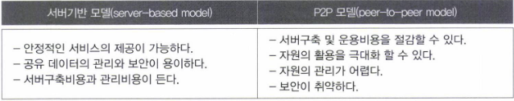

## IP주소
- 컴퓨터(host)를 구별하는데 사용되는 고유한 값
- 인터넷이 연결된 모든 컴퓨터는 IP주소를 갖는다.
- 4byte의 정수
- 4개의 정수가 마침표를 구분자로 'a.b.c.d'의 형식
- 네트워크 주소
  - 서로 다른 두 호스트의 IP주소의 네트워크 주소가 같다는 것은 두 호스트가 같은 네트워크에 포함되어 있는 것
- 호스트 주소

호스트의IP주소 확인
- 콘솔에서 ipconfig.exe를 실행

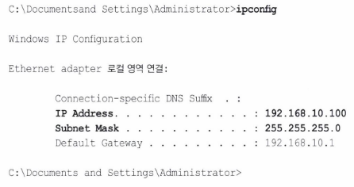

- 위의 결과에서 얻은 IP주소와 서브넷 마스크를 2진수로 표현하면 다음과 같다.

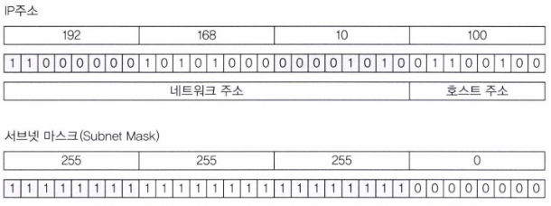

IP주소와 서브넷 마스크를 비트연산자 '&'로 연산하면 IP주소에서 네트워크 주소만을 뽑아낼 수 있다.

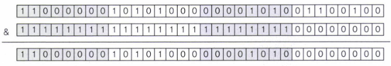

- IP주소 192.168.10.100
  - 네트워크 주소 24bit(192.168.10)
  - 호스트 주소 8bit(100)
- IP주소에서 네트워크 주소가 차지하는 자리수가 많을수록 호스트 주소의 범위가 줄어든다.
  - 네트워크의 규모가 작아진다.
  - 위의 경우 호스트 주소의 자리수가 8자리이기 때문에 256개의 호스트만 네트워크에 포함 가능하다.
- 실제로 네트워크에 포함 가능한 호스트 개수 254개 ( = 256-2)
  - 네트워크 자신
    - 호스트 주소 0
  - 브로드캐스트 주소
    - 호스트 주소 255

## InetAddress
IP주소를 다루기 위한 클래스

InetAddress의 메서드

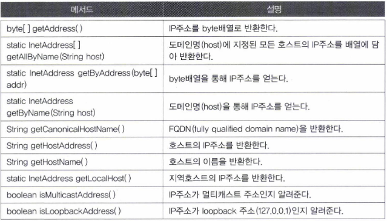

```java
import java.net.InetAddress;
import java.net.UnknownHostException;
import java.util.Arrays;

public class YJ16_01 {
    public static void main(String[] args) {
        InetAddress ip = null;
        InetAddress[] ipArr = null;

        try {
            ip = InetAddress.getByName("www.naver.com");
            System.out.println("getHostName(): " + ip.getHostName());
            System.out.println("getHostAddress(): " + ip.getHostAddress());
            System.out.println("toString: " + ip.toString());

            byte[] ipAddr = ip.getAddress();
            System.out.println("getAddress(): " + Arrays.toString(ipAddr));

            String result = "";
            for (int i = 0; i < ipAddr.length; i++) {
                result += (ipAddr[i] < 0) ? ipAddr[i] + 256 : ipAddr[i];
                result += ".";
            }
            System.out.println("getAddress() + 256: " + result);
            System.out.println();
        } catch (UnknownHostException e) {
            e.printStackTrace();
        }

        try {
            ip = InetAddress.getLocalHost();
            System.out.println("getHostName(): " + ip.getHostName());
            System.out.println("getHostAddress(): " + ip.getHostAddress());
            System.out.println();
        } catch (UnknownHostException e) {
            e.printStackTrace();
        }

        try {
            ipArr = InetAddress.getAllByName("www.naver.com");

            for (int i = 0; i < ipArr.length; i++) {
                System.out.println("ipArr[" + i + "]: " + ipArr[i]);
            }
        } catch (UnknownHostException e) {
            e.printStackTrace();
        }
    }
}

<Console>
getHostName(): www.naver.com
getHostAddress(): 223.130.195.95
toString: www.naver.com/223.130.195.95
getAddress(): [-33, -126, -61, 95]
getAddress() + 256: 223.130.195.95.

getHostName(): DESKTOP-JNS3S7A
getHostAddress(): 192.168.0.12

ipArr[0]: www.naver.com/223.130.195.95
ipArr[1]: www.naver.com/223.130.200.104
```
- 하나의 도메인명(www.naver.com)에 여러 IP주소가 맵핑될 수도 있고 그 반대의 경우도 가능하다.
  - 전자: getAllByName()을 통해 IP주소 얻음
  - 후자: getLocalHost()를 통해 호스트명과 IP주소를 얻음

## URL(Uniform Resource Locator)
인터넷에 존재하는 여러 서버들이 제공하는 자원에 접근할 수 있는 주소를 표현
- '프로토콜://호스트명:포트번호/경로명/파일명?쿼리스트링#참조'

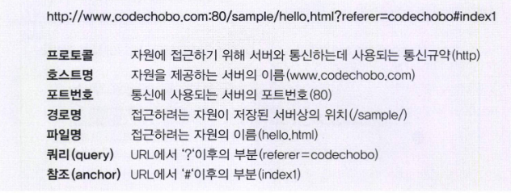

URL의 메서드

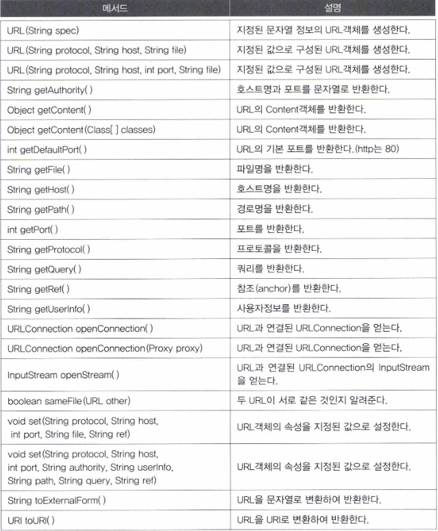

URL 객체 생성 방법

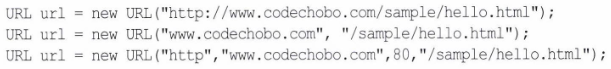

## URLConnection
어플리케이션과 URL간의 통신연결을 나타내는 클래스의 최상위 클래스
- 추상클래스 

URLConnection을 상속받아 구현한 클래스
- URLConnection을 사용해서 연결하고자하는 자원에 접근하고 읽고 쓰기를 할 수 있다.
- HttpURLConnection
  - URL의 프로토콜이 http프로토콜이라면 openConnection()은 HttpURLConnection을 반환
- JarURLConnection

URLConnection의 메서드

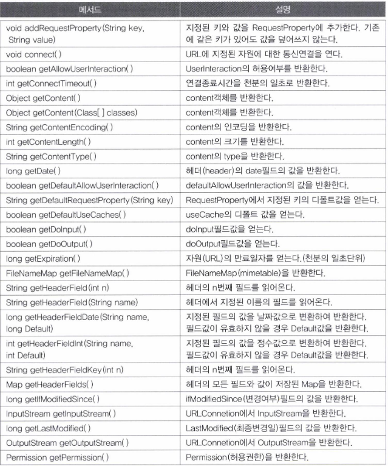

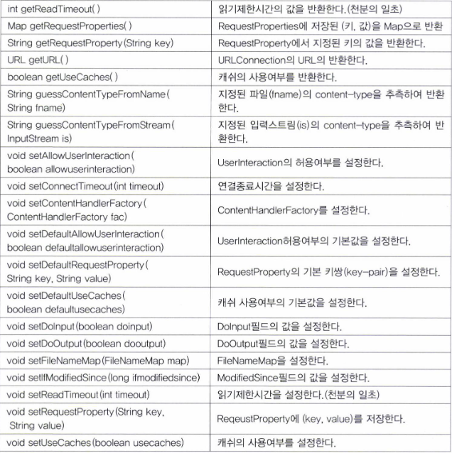

```java
import java.io.BufferedReader;
import java.io.InputStreamReader;
import java.net.URL;

public class YJ16_04 {
    public static void main(String[] args) {
        URL url = null;
        BufferedReader input = null;
        String address = "http://www.google.com";
        String line = "";

        try {
            url = new URL(address);
            input = new BufferedReader(new InputStreamReader(url.openStream()));

            while ((line = input.readLine()) != null) {
                System.out.println(line);
            }

            input.close();
        } catch (Exception e) {
            e.printStackTrace();
        }
    }
}

<Console>
"C:\Program Files\Java\jdk-11.0.14\bin\java.exe" "-javaagent:C:\Program Files\JetBrains\IntelliJ IDEA Community Edition 2021.3.1\lib\idea_rt.jar=50112:C:\Program Files\JetBrains\IntelliJ IDEA Community Edition 2021.3.1\bin" -Dfile.encoding=UTF-8 -classpath D:\study\Codes\YJ\src\YJ15\YJ15_22.java\production\study YJ16_04
<!doctype html><html itemscope="" itemtype="http://schema.org/WebPage" lang="ko"><head><meta content="text/html; charset=UTF-8" http-equiv="Content-Type"><meta content="/images/branding/googleg/1x/googleg_standard_color_128dp.png" itemprop="image"><title>Google</title><script nonce="r9akyTj8GC3L0eh/xuZh+A==">(function(){window.google={kEI:'W3L6YaKVEoLKmAXTnIagAg',kEXPI:'0,18167,1284369,56873,6059,206,2414,2390,2316,383,246,5,1354,4013,1237,1122516,1197727,303235,77529,16114,17444,11240,17572,4859,1361,9290,3029,17580,4020,978,13227,3848,4192,6430,7432,15309,5081,1593,1279,2742,149,1103,840,6297,3514,606,2023,1777,521,14669,3227,2845,7,4773,12677,8101,8219,908,2,941,2614,13142,3,346,230,6459,149,13975,4,1528,2304,6463,576,4684,15625,4764,2658,6701,656,30,13628,2305,18918,5827,2530,4097,4049,3,3541,1,11942,4865,38,6866,18449,2,14016,1931,5589,744,5852,10463,1160,5679,1021,2380,2718,18243,2,6,6717,1055,4568,2578,3675,6729,11905,4790,438,808,17102,601,3106,4332,19,4367,1036,667,1840,2,2,1,2990,2673,1514,3612,403,29,82,423,4,768,3824,275,724,4072,53,986,1351,1463,951,10,1,424,285,401,2,359,5208,1752,86,62,113,2182,337,920,2014,71,945,100,698,1,12,175,2,3382,928,4039,737,262,595,604,1132,1517,539,756,39,969,555,328,19,469,5,237,564,48,709,1,1125,54,598,33,334,1328,2,287,2,1850,1071,5489509,2032,951,157,8796903,882,444,1,2,80,1,1796,1,9,2553,1,748,141,795,563,1,4265,1,1,2,1331,4142,2609,155,17,13,72,139,4,2,20,2,169,13,19,46,5,39,96,548,29,2,2,1,2,1,2,2,7,4,1,2,2,2,2,2,2,353,513,186,1,1,158,3,2,2,2,2,2,4,2,3,3,269,1601,141,204,131,67,13,1,2,7,20,4,5,3,6,4,23952514,4041689,3,2414,1491,9,1435,159,1358,4726,3,925,1737,1898,949,680,1034',kBL:'vOnp'};google.sn='webhp';google.kHL='ko';})();(function(){
var f=this||self;var h,k=[];function l(a){for(var b;a&&(!a.getAttribute||!(b=a.getAttribute("eid")));)a=a.parentNode;return b||h}function m(a){for(var b=null;a&&(!a.getAttribute||!(b=a.getAttribute("leid")));)a=a.parentNode;return b}
function n(a,b,c,d,g){var e="";c||-1!==b.search("&ei=")||(e="&ei="+l(d),-1===b.search("&lei=")&&(d=m(d))&&(e+="&lei="+d));d="";!c&&f._cshid&&-1===b.search("&cshid=")&&"slh"!==a&&(d="&cshid="+f._cshid);c=c||"/"+(g||"gen_204")+"?atyp=i&ct="+a+"&cad="+b+e+"&zx="+Date.now()+d;/^http:/i.test(c)&&"https:"===window.location.protocol&&(google.ml&&google.ml(Error("a"),!1,{src:c,glmm:1}),c="");return c};h=google.kEI;google.getEI=l;google.getLEI=m;google.ml=function(){return null};google.log=function(a,b,c,d,g){if(c=n(a,b,c,d,g)){a=new Image;var e=k.length;k[e]=a;a.onerror=a.onload=a.onabort=function(){delete k[e]};a.src=c}};google.logUrl=n;}).call(this);(function(){
google.y={};google.sy=[];google.x=function(a,b){if(a)var c=a.id;else{do c=Math.random();while(google.y[c])}google.y[c]=[a,b];return!1};google.sx=function(a){google.sy.push(a)};google.lm=[];google.plm=function(a){google.lm.push.apply(google.lm,a)};google.lq=[];google.load=function(a,b,c){google.lq.push([[a],b,c])};google.loadAll=function(a,b){google.lq.push([a,b])};google.bx=!1;google.lx=function(){};}).call(this);google.f={};(function(){
document.documentElement.addEventListener("submit",function(b){var a;if(a=b.target){var c=a.getAttribute("data-submitfalse");a="1"===c||"q"===c&&!a.elements.q.value?!0:!1}else a=!1;a&&(b.preventDefault(),b.stopPropagation())},!0);document.documentElement.addEventListener("click",function(b){var a;a:{for(a=b.target;a&&a!==document.documentElement;a=a.parentElement)if("A"===a.tagName){a="1"===a.getAttribute("data-nohref");break a}a=!1}a&&b.preventDefault()},!0);}).call(this);</script><style>#gbar,#guser{font-size:13px;padding-top:1px !important;}#gbar{height:22px}#guser{padding-bottom:7px !important;text-align:right}.gbh,.gbd{border-top:1px solid #c9d7f1;font-size:1px}.gbh{height:0;position:absolute;top:24px;width:100%}@media all{.gb1{height:22px;margin-right:.5em;vertical-align:top}#gbar{float:left}}a.gb1,a.gb4{text-decoration:underline !important}a.gb1,a.gb4{color:#00c !important}.gbi .gb4{color:#dd8e27 !important}.gbf .gb4{color:#900 !important}
</style><style>body,td,a,p,.h{font-family:&#44404;&#47548;,&#46027;&#50880;,arial,sans-serif}.ko{font-size:9pt}body{margin:0;overflow-y:scroll}#gog{padding:3px 8px 0}td{line-height:.8em}.gac_m td{line-height:17px}form{margin-bottom:20px}.h{color:#1558d6}em{font-weight:bold;font-style:normal}.lst{height:25px;width:496px}.gsfi,.lst{font:18px arial,sans-serif}.gsfs{font:17px arial,sans-serif}.ds{display:inline-box;display:inline-block;margin:3px 0 4px;margin-left:4px}input{font-family:inherit}body{background:#fff;color:#000}a{color:#4b11a8;text-decoration:none}a:hover,a:active{text-decoration:underline}.fl a{color:#1558d6}a:visited{color:#4b11a8}.sblc{padding-top:5px}.sblc a{display:block;margin:2px 0;margin-left:13px;font-size:11px}.lsbb{background:#f8f9fa;border:solid 1px;border-color:#dadce0 #70757a #70757a #dadce0;height:30px}.lsbb{display:block}#WqQANb a{display:inline-block;margin:0 12px}.lsb{background:url(/images/nav_logo229.png) 0 -261px repeat-x;border:none;color:#000;cursor:pointer;height:30px;margin:0;outline:0;font:15px arial,sans-serif;vertical-align:top}.lsb:active{background:#dadce0}.lst:focus{outline:none}.tiah{width:458px}</style><script nonce="r9akyTj8GC3L0eh/xuZh+A==">(function(){window.google.erd={jsr:1,bv:1524,de:true};
var f=this||self;var g,h,k=null!==(g=f.mei)&&void 0!==g?g:1,l=null!==(h=f.sdo)&&void 0!==h?h:!0,p=0,q,r=google.erd,u=r.jsr;google.ml=function(a,b,d,m,c){c=void 0===c?2:c;b&&(q=a&&a.message);if(google.dl)return google.dl(a,c,d),null;if(0>u){window.console&&console.error(a,d);if(-2===u)throw a;b=!1}else b=!a||!a.message||"Error loading script"===a.message||p>=k&&!m?!1:!0;if(!b)return null;p++;d=d||{};var e=c;c=encodeURIComponent;b="/gen_204?atyp=i&ei="+c(google.kEI);google.kEXPI&&(b+="&jexpid="+c(google.kEXPI));b+="&srcpg="+c(google.sn)+"&jsr="+c(r.jsr)+"&bver="+c(r.bv)+("&jsel="+e);e=a.lineNumber;void 0!==e&&(b+="&line="+
e);var n=a.fileName;n&&(b+="&script="+c(n),e&&n===window.location.href&&(e=document.documentElement.outerHTML.split("\n")[e],b+="&cad="+c(e?e.substring(0,300):"No script found.")));for(var t in d)b+="&",b+=c(t),b+="=",b+=c(d[t]);b=b+"&emsg="+c(a.name+": "+a.message);b=b+"&jsst="+c(a.stack||"N/A");12288<=b.length&&(b=b.substr(0,12288));a=b;m||google.log(0,"",a);return a};window.onerror=function(a,b,d,m,c){q!==a&&(a=c instanceof Error?c:Error(a),void 0===d||"lineNumber"in a||(a.lineNumber=d),void 0===b||"fileName"in a||(a.fileName=b),google.ml(a,!1,void 0,!1,"SyntaxError"===a.name||"SyntaxError"===a.message.substring(0,11)?2:0));q=null;l&&p>=k&&(window.onerror=null)};})();</script></head><body bgcolor="#fff"><script nonce="r9akyTj8GC3L0eh/xuZh+A==">(function(){var src='/images/nav_logo229.png';var iesg=false;document.body.onload = function(){window.n && window.n();if (document.images){new Image().src=src;}
if (!iesg){document.f&&document.f.q.focus();document.gbqf&&document.gbqf.q.focus();}
}
})();</script><div id="mngb"><div id=gbar><nobr><b class=gb1>&#44160;&#49353;</b> <a class=gb1 href="http://www.google.co.kr/imghp?hl=ko&tab=wi">&#51060;&#48120;&#51648;</a> <a class=gb1 href="http://maps.google.co.kr/maps?hl=ko&tab=wl">&#51648;&#46020;</a> <a class=gb1 href="https://play.google.com/?hl=ko&tab=w8">Play</a> <a class=gb1 href="http://www.youtube.com/?gl=KR&tab=w1">YouTube</a> <a class=gb1 href="https://news.google.com/?tab=wn">&#45684;&#49828;</a> <a class=gb1 href="https://mail.google.com/mail/?tab=wm">Gmail</a> <a class=gb1 href="https://drive.google.com/?tab=wo">&#46300;&#46972;&#51060;&#48652;</a> <a class=gb1 style="text-decoration:none" href="https://www.google.co.kr/intl/ko/about/products?tab=wh"><u>&#45908;&#48372;&#44592;</u> &raquo;</a></nobr></div><div id=guser width=100%><nobr><span id=gbn class=gbi></span><span id=gbf class=gbf></span><span id=gbe></span><a href="http://www.google.co.kr/history/optout?hl=ko" class=gb4>&#50937; &#44592;&#47197;</a> | <a  href="/preferences?hl=ko" class=gb4>&#49444;&#51221;</a> | <a target=_top id=gb_70 href="https://accounts.google.com/ServiceLogin?hl=ko&passive=true&continue=http://www.google.com/&ec=GAZAAQ" class=gb4>&#47196;&#44536;&#51064;</a></nobr></div><div class=gbh style=left:0></div><div class=gbh style=right:0></div></div><center><br clear="all" id="lgpd"><div id="lga"><br><br></div><form action="/search" name="f"><table cellpadding="0" cellspacing="0"><tr valign="top"><td width="25%">&nbsp;</td><td align="center" nowrap=""><input name="ie" value="ISO-8859-1" type="hidden"><input value="ko" name="hl" type="hidden"><input name="source" type="hidden" value="hp"><input name="biw" type="hidden"><input name="bih" type="hidden"><div class="ds" style="height:32px;margin:4px 0"><div style="position:relative;zoom:1"><input class="lst tiah" style="margin:0;padding:5px 8px 0 6px;vertical-align:top;color:#000;padding-right:38px" autocomplete="off" value="" title="Google &#44160;&#49353;" maxlength="2048" name="q" size="57"><script nonce="r9akyTj8GC3L0eh/xuZh+A==">(function(){var id='tsuid1';document.getElementById(id).onclick = function(){var s = document.createElement('script');s.src = this.getAttribute('data-script-url');(document.getElementById('xjsc')||document.body).appendChild(s);};})();</script></div></div><br style="line-height:0"><span class="ds"><span class="lsbb"><input class="lsb" value="Google &#44160;&#49353;" name="btnG" type="submit"></span></span><span class="ds"><span class="lsbb"><input class="lsb" id="tsuid2" value="I&#8217;m Feeling Lucky" name="btnI" type="submit"><script nonce="r9akyTj8GC3L0eh/xuZh+A==">(function(){var id='tsuid2';document.getElementById(id).onclick = function(){if (this.form.q.value){this.checked = 1;if (this.form.iflsig)this.form.iflsig.disabled = false;}
else top.location='/doodles/';};})();</script><input value="AHkkrS4AAAAAYfqAaxjCz4IDRQmkyDvoda-eHbBxGebF" name="iflsig" type="hidden"></span></span></td><td class="fl sblc" align="left" nowrap="" width="25%"><a href="/advanced_search?hl=ko&amp;authuser=0">&#44256;&#44553;&#44160;&#49353;</a></td></tr></table><input id="gbv" name="gbv" type="hidden" value="1"><script nonce="r9akyTj8GC3L0eh/xuZh+A==">(function(){
var a,b="1";if(document&&document.getElementById)if("undefined"!=typeof XMLHttpRequest)b="2";else if("undefined"!=typeof ActiveXObject){var c,d,e=["MSXML2.XMLHTTP.6.0","MSXML2.XMLHTTP.3.0","MSXML2.XMLHTTP","Microsoft.XMLHTTP"];for(c=0;d=e[c++];)try{new ActiveXObject(d),b="2"}catch(h){}}a=b;if("2"==a&&-1==location.search.indexOf("&gbv=2")){var f=google.gbvu,g=document.getElementById("gbv");g&&(g.value=a);f&&window.setTimeout(function(){location.href=f},0)};}).call(this);</script></form><div id="gac_scont"></div><div style="font-size:83%;min-height:3.5em"><br></div><span id="footer"><div style="font-size:10pt"><div style="margin:19px auto;text-align:center" id="WqQANb"><a href="/intl/ko/ads/">&#44305;&#44256; &#54532;&#47196;&#44536;&#47016;</a><a href="http://www.google.co.kr/intl/ko/services/">&#48708;&#51592;&#45768;&#49828; &#49556;&#47336;&#49496;</a><a href="/intl/ko/about.html">Google &#51221;&#48372;</a><a href="http://www.google.com/setprefdomain?prefdom=KR&amp;prev=http://www.google.co.kr/&amp;sig=K_7ucLK65n2sKohYcHjAly3fmwf7M%3D">Google.co.kr</a></div></div><p style="font-size:8pt;color:#70757a">&copy; 2022 - <a href="/intl/ko/policies/privacy/">&#44060;&#51064;&#51221;&#48372;&#52376;&#47532;&#48169;&#52840;</a> - <a href="/intl/ko/policies/terms/">&#50557;&#44288;</a></p></span></center><script nonce="r9akyTj8GC3L0eh/xuZh+A==">(function(){window.google.cdo={height:757,width:1440};(function(){
var a=window.innerWidth,b=window.innerHeight;if(!a||!b){var c=window.document,d="CSS1Compat"==c.compatMode?c.documentElement:c.body;a=d.clientWidth;b=d.clientHeight}a&&b&&(a!=google.cdo.width||b!=google.cdo.height)&&google.log("","","/client_204?&atyp=i&biw="+a+"&bih="+b+"&ei="+google.kEI);}).call(this);})();</script> <script nonce="r9akyTj8GC3L0eh/xuZh+A==">(function(){google.xjs={ck:'',cs:'',excm:[]};})();</script>  <script nonce="r9akyTj8GC3L0eh/xuZh+A==">(function(){var u='/xjs/_/js/k\x3dxjs.hp.en.S2E8UfJ62EM.O/am\x3dAPAEAEACkA/d\x3d1/ed\x3d1/esmo\x3d1/rs\x3dACT90oFOGL2k3thUlh0YjOU7L9llqg4y4A/m\x3dsb_he,d';
var e=this||self,f=function(a){return a};var g;var l=function(a,b){this.g=b===h?a:""};l.prototype.toString=function(){return this.g+""};var h={};
function m(){var a=u;google.lx=function(){n(a);google.lx=function(){}};google.bx||google.lx()}
function n(a){google.timers&&google.timers.load&&google.tick&&google.tick("load","xjsls");var b=document;var c="SCRIPT";"application/xhtml+xml"===b.contentType&&(c=c.toLowerCase());c=b.createElement(c);if(void 0===g){b=null;var k=e.trustedTypes;if(k&&k.createPolicy){try{b=k.createPolicy("goog#html",{createHTML:f,createScript:f,createScriptURL:f})}catch(p){e.console&&e.console.error(p.message)}g=b}else g=b}a=(b=g)?b.createScriptURL(a):a;a=new l(a,h);c.src=a instanceof l&&a.constructor===l?a.g:"type_error:TrustedResourceUrl";var d;a=(c.ownerDocument&&c.ownerDocument.defaultView||window).document;(d=(b=null===(d=a.querySelector)||void 0===d?void 0:d.call(a,"script[nonce]"))?b.nonce||b.getAttribute("nonce")||"":"")&&c.setAttribute("nonce",d);document.body.appendChild(c);google.psa=!0};google.xjsu=u;setTimeout(function(){m()},0);})();function _DumpException(e){throw e;}
function _F_installCss(c){}
(function(){google.jl={attn:false,blt:'none',chnk:0,dw:false,dwu:true,emtn:0,end:0,ine:false,lls:'default',pdt:0,rep:0,snet:true,strt:0,ubm:false,uwp:true};})();(function(){var pmc='{\x22d\x22:{},\x22sb_he\x22:{\x22agen\x22:true,\x22cgen\x22:true,\x22client\x22:\x22heirloom-hp\x22,\x22dh\x22:true,\x22dhqt\x22:true,\x22ds\x22:\x22\x22,\x22ffql\x22:\x22ko\x22,\x22fl\x22:true,\x22host\x22:\x22google.com\x22,\x22isbh\x22:28,\x22jsonp\x22:true,\x22msgs\x22:{\x22cibl\x22:\x22&#44160;&#49353;&#50612; &#51648;&#50864;&#44592;\x22,\x22dym\x22:\x22&#51060;&#44163;&#51012; &#52286;&#51004;&#49512;&#45208;&#50836;?\x22,\x22lcky\x22:\x22I&#8217;m Feeling Lucky\x22,\x22lml\x22:\x22&#51088;&#49464;&#55176; &#50508;&#50500;&#48372;&#44592;\x22,\x22oskt\x22:\x22&#51077;&#47141; &#46020;&#44396;\x22,\x22psrc\x22:\x22&#44160;&#49353;&#50612;&#44032; \\u003Ca href\x3d\\\x22/history\\\x22\\u003E&#50937; &#44592;&#47197;\\u003C/a\\u003E&#50640;&#49436; &#49325;&#51228;&#46104;&#50632;&#49845;&#45768;&#45796;.\x22,\x22psrl\x22:\x22&#49325;&#51228;\x22,\x22sbit\x22:\x22&#51060;&#48120;&#51648;&#47196; &#44160;&#49353;\x22,\x22srch\x22:\x22Google &#44160;&#49353;\x22},\x22ovr\x22:{},\x22pq\x22:\x22\x22,\x22refpd\x22:true,\x22rfs\x22:[],\x22sbas\x22:\x220 3px 8px 0 rgba(0,0,0,0.2),0 0 0 1px rgba(0,0,0,0.08)\x22,\x22sbpl\x22:16,\x22sbpr\x22:16,\x22scd\x22:10,\x22stok\x22:\x22d_61KlmAavezrqgVowNzOWcbTC8\x22,\x22uhde\x22:false}}';google.pmc=JSON.parse(pmc);})();</script>        </body></html>
```
- URL에 연결하여 그 내용을 읽어왔다.
- 읽어올 데이터가 문자데이터이기 때문에 BufferedReader를 사용했다.
- openStream()을 호출
  - URL의 InputStream을 반환

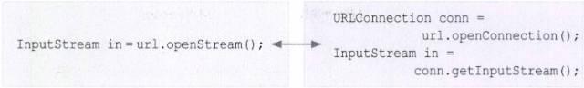

# 소켓 프로그래밍
소켓을 이용한 통신 프로그래밍
- 소켓(socket)
  - 프로세스간의 통신에 사용되는 양쪽 끝단(endpoint)
  - 프로세스간의 통신을 위해서는 소켓이 필요

## TCP와 UDP
둘 다 TCP/IP에 포함, OSI 7계층의 전송계층(transport layer)에 해당하는 프로토콜

- TCP/IP
  - 이기종 시스템간의 통신을 위한 표준 프로토콜
  - 프로토콜의 집합

TCP와 UDP 비교

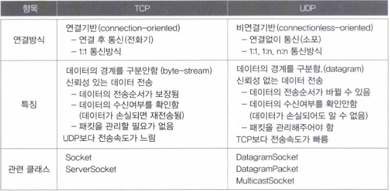

TCP를 이용한 통신은 전화에, UDP를 이용한 통신은 소포에 비유

## TCP소켓 프로그래밍

서버 프로그램과 클라이언트 프로그램간의 통신과정
1. 서버 프로그램에서는 서버소켓을 사용해서 서버 컴퓨터의 특정 포트에서 클라이언트의 연결요청을 처리할 준비를 한다.
2. 클라이언트 프로그램은 접속할 서버의 IP주소와 포트 정보를 가지고 소켓을 생성해서 서버에 연결을 요청한다.
3. 서버소켓은 클라이언트의 연결요청을 받으면 서버에 새로운 소켓을 생성해서 클라이언트의 소켓과 연결되도록 한다.
4. 이제 클라이언트의 소켓과 새로 생성된 서버의 소켓은 서버소켓과 관계없이 일대일 통신을 한다.

서버소켓
- 포트와 결합
  - 포트를 통해 원격 사용자의 연결 요청을 기다린다.
  - 요청이 올 때마다 새로운 소켓 생성
    - 상대편 소켓과 통신을 위해 연결
- 비유
  - 서버소켓
    - 전화교환기
  - 소켓
    - 전화기
  - 전화교환기(서버소켓)는 외부전화기(원격 소켓)로부터 걸려온 전화를 내부의 전화기(소켓)로 연결
  - 실제 통화는 전화기(소켓)와 전화기(원격 소켓)로 이루어지게 한다.
- 서버소켓은 소켓간의 연결만 처리하고 실제 데이터는 소켓들끼리 서로 주고 받는다.

여러 개의 소켓이 하나의 포트 공유 가능
- 서버 소켓은 포트를 독점
  - 두 서버소켓이 다른 프로토콜을 사용하면 같은 포트를 사요할 수 있다.

포트(port)
- 호스트(컴퓨터)가 외부와 통신을 하기 위한 통로
- 하나의 호스트가 65536개의 포트를 가지고 있다.
  - 보통 1023번 이하의 포트
    - FTP나 Telnet과 같은 기존의 다른 통신 프로그램들에 의해서 사용
    - 1023번 이하는 사용하지 않는것이 좋다.

입출력스트림
- 소켓들이 데이터를 주고받는 연결통로
- 소켓은 두 개의 스트림, 입력/출력 스트림을 갖고 있다.
  - 서로의 스트림과 연결 (입력-출력 연결)

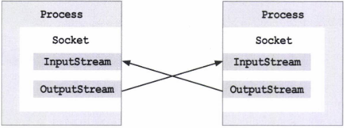

자바에서는 TCP를 이용한 소켓프로그래밍을 위해 Socket과 ServerSocket클래스를 제공한다.

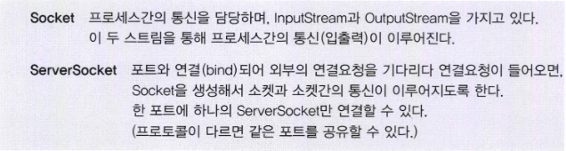

```java
import java.io.DataOutputStream;
import java.io.IOException;
import java.io.OutputStream;
import java.net.ServerSocket;
import java.net.Socket;
import java.text.SimpleDateFormat;
import java.util.Date;

public class YJ16_06 {
    public static void main(String[] args) {
        ServerSocket serverSocket = null;

        try {
            //서버소켓을 생성하여 7777번 포트와 결합(bind)시킨다.
            serverSocket = new ServerSocket(7777);
            System.out.println(getTime() + "server ready.");
        } catch (IOException e) {
            e.printStackTrace();
        }

        while (true) {
            try {
                System.out.println(getTime() + "waiting for connection.");
                //서버소켓은 클라이언트의 연결요청이 올 때까지 실행을 멈추고 계속 기다린다.
                //클라이언트의 연결요청이 오면 클라이언트 소켓과 통신할 새로운 소켓을 생성한다.
                Socket socket = serverSocket.accept();

                System.out.println(getTime() + socket.getInetAddress() + " requested for connection");
                //소켓의 출력스트림을 얻는다.
                OutputStream out = socket.getOutputStream();
                DataOutputStream dos = new DataOutputStream(out);

                //원격 소켓(remote socket)에 데이터를 보낸다.
                dos.writeUTF("[Notice] TestMessage1 from Server.");
                System.out.println(getTime() + " data sent.");

                //스트림과 소켓을 닫아준다.
                dos.close();
                socket.close();
            } catch (IOException e) {
                e.printStackTrace();
            }
        }
    }   
    //현재 시칸을 문자열로 반환하는 함수
    static String getTime(){
        SimpleDateFormat f = new SimpleDateFormat("[hh:mm:ss]");
        return f.format(new Date());

    }
}
```
- 이 예제를 실행하면 서버소켓이 7777번 포트에서 클라이언트 프로그램의 연결요청을 기다린다.

```java
import java.io.DataInputStream;
import java.io.IOException;
import java.io.InputStream;
import java.net.ConnectException;
import java.net.Socket;

public class YJ16_07 {
    public static void main(String[] args) {
        try {
            //연결하고자 하는 서버의 IP와 포트번호를 가지고 소켓 생성
            String serverIP = "127.0.0.1";
            System.out.println("connecting to server. Server IP: " + serverIP);
            //소켓을 생성하여 연결을 요청
            Socket socket = new Socket(serverIP, 7777);

            //서버와 연결되면 소켓의 입력스트림을 얻어서 서버가 전송한 데이터를 읽을 수 있다.
            InputStream in = socket.getInputStream();
            DataInputStream dis = new DataInputStream(in);

            //소켓으로부터 받은 데이터를 출력
            System.out.println("message from server: " + dis.readUTF());
            System.out.println("ending connection");

            //스트림과 소켓을 닫는다.
            dis.close();
            socket.close();
            System.out.println("connection ended");
        } catch (ConnectException connectException) {
            //서버프로그램이 실행되고 있지 않으면 예외 발생
            connectException.printStackTrace();
        } catch (IOException ioException) {
            ioException.printStackTrace();
        } catch (Exception e) {
            e.printStackTrace();
        }
    }
}


<cmd>
D:\study\Codes\YJ\src\YJ16>javac YJ16_07.java

D:\study\Codes\YJ\src\YJ16>java YJ16_07
connecting to server. Server IP: 127.0.0.1
message from server: [Notice] TestMessage1 from Server.
ending connection
connection ended
```
- 이 예제는 이전 예제인 TCP/IP서버와 통신하기 위한 클라이언트 프로그램이다.
- 위의 예제에서는 한 대의 호스트에서 서버 프로그램과 클라이언트 프로그램을 테스트할 수 있도록 서벌 IP를 127.0.0.1로 설정했다.
  - 원래는 서버가 실제로 사용하고 있는 IP를 지정해 주어야 한다.
  - 지금부터의 IP 가정
    - 서버
      - 192.168.10.100
    - 클라이언트
      - 192.168.10.101

### TCP소켓 프로그래밍 과정

1. 서버프로그램을 실행한다.

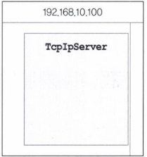

2. 서버 소켓을 생성한다.
   ```java
   serverSocket = new ServerSocket(7777);
   ```

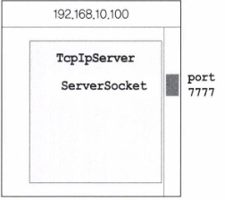

3. 서버소켓이 클라이언트 프로그램의 요청을 처리할 수 있도록 대기상태로 만든다.
   클라이언트 프로그램의 연결요청이 오면 새로운 소켓을 생성해서 클라이언트 프로그램의 소켓과 연결한다.
   ```java
   Socket socket = serverSocket.accept();
   ```

4. 클라이언트 프로그램에서 소켓을 생성하여 서버소켓에 연결을 요청한다.
   ```java
   Socket socket = new Socket("192.168.10.100", 7777);
   ```

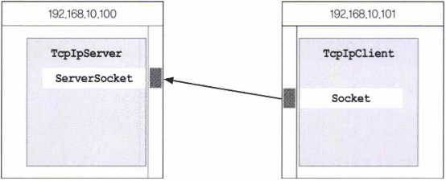

5. 서버소켓은 클라이언트 프로그램의 연결요청을 받아 새로운 소켓을 생성하여 클라이언트 프로그램의 소켓과 연결한다.
   ```java
   Socket socket = serverSocket.accept();
   ```

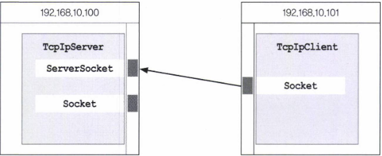

6. 서버소켓은 클라이언트 프로그램의 연결요청을 받아 새로운 소켓을 생성하여 클라이언트 프로그램의 소켓과 연결한다.

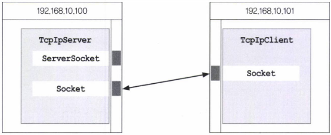