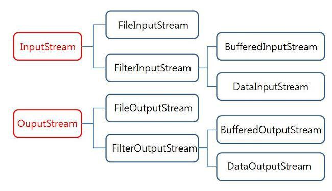

- [Input, Output](#input-output)
  - [InputStream/OutputStream](#inputstreamoutputstream)
    - [InputStream](#inputstream)
    - [OutputStream](#outputstream)
  - [System](#system)
    - [System.in](#systemin)
    - [System.out](#systemout)
    - [System.err](#systemerr)
    - [예제](#예제)
  - [참고](#참고)

# Input, Output

Input

- 메모리로 들어오는 데이터의 흐름

Output

- 메모리에서 빠져나가는 데이터

메모리는 데이터를 byte 단위로처리한다.

- byte 알갱이의 흐름을 Stream이라고 한다.

## InputStream/OutputStream



### InputStream

- 입력받을 수 있는 객체
- 1byte 단위 처리 스트림
  - 영문자, 숫자, 특수자만 처리 가능
  - 한글은 처리 불가능
- System.in
  - 키보드와 연결된 System 클래스의 InputStream 타입의 static final 상수

InputStream에 정의된 메소드

|InputSream에 정의된 메소드|설명|
|:---:|:---:|
|int available() throws IOException|현재 읽을 수 있는 바이트 수를 얻는다.|
|void close() throws IOException|InputStream을 닫는다.|
|void mark(int readLimit)|InputStream에서 현재 위치를 표시한다.|
|boolean markSupported()|해당 InputStream에서 mark()로 지정된 지점이 있는지 확인한다.|
|abstract int read() throws IOException|InputStream에서 한 바이트를 읽어서 int 값으로 반환한다.|
|int read(byte[]) throws IOException|byte[] b 만큼의 데이터를 읽어서 b에 저장하고 읽은 바이트 수를 반환한다.|
|int read(byte[] b, int off, int len) throws IOException|len 만큼을 읽어 byte[] b의 off위치에 저장하고 읽은 바이트 수를 반환한다.|
|void reset()|mark()를 마지막으로 호출한 위치로 이동한다.|
|long skip(long n) throws IOException|InputStream에서 n 바이트 만큼 데이터를 스킵하고 바이트 수를 반환한다.|

- InputStream의 하위 클래스들은 위의 메소드를 사용할 수 있다.
- 일반적으로 available() 메소드를 사용하여 스트림에서 읽을 수 있는 바이트 수를 얻은 후 이를 기준으로 byte[]를 생성하여 한꺼번에 읽을 수 있다.

### OutputStream

- 바이트 단위의 출력을 대표하는 최상위 클래스
- 이 클래스에 정의되어 있는 메소드는 후손 클래스가 상속받아서 그대로 사용하거나 재정의하여 사용한다.

OutputStream에 정의된 메소드

|OutputStream에 정의된 메소드|설명|
|:---:|:---:|
|void close() throws IOException|OutputStream을 닫는다.|
|void flush() throws IOException|버퍼에 남은 출력 스트림을 출력한다.|
|abstract void write(int i) throws IOException|정수 i의 하위 8비트를 출력한다.|
|void write(byte buff[]) throws IOException|buff의 내용을 출력한다.|
|void write(byte buff[], int index, int size) throws IOException|buff의 index 위치부터 size 만큼의 바이트를 출력한다.|

- flush() 메소드를 호출하지 않으면 버퍼로만 출력되기 때문에 실제로 도착 지점에서는 아무런 데이터를 받지 못하는 경우가 발생할 수 있다.
  - 이런 이유로 일반적인 OutputStream에서는 데이터를 출력하고 나면 자동적으로 flush() 메소드를 호출하게 만들 수 있는 기능을 제공하는 경우가 많다.

## System

System 클래스

- JVM을 구서하고 있는 표준 장치
- JVM은 완벽한 하나의 컴퓨터 플랫폼을 가정하고 있기 때문에 독립적으로 동작할 수 있는 구조를 표현하기 위한 표준 입력과 표준 출력을 스스로의 System 클래스에 등록하여 사용한다.

### System.in

- 변수의 타입이 InputStream
  - 최상위 클랫, 추상 클래스
  - 객체를 생성할 수 없는 클래스
- System.in은 실제로 객체가 존재하고 있고, 이를 통해 키보드의 입력을 받을 수 있다.
- 변수의 타입은 선조 클래스, 실제 객체는 후손 객체
  - 형 변환 지원되기 때문에 가능
- System.in을 통해 접근되는 객체는 JVM이 메모리로 올라오면서 미리 생성하는 대표적인 객체이다.
- 자료형이 InputStream이기 때문에 byte 단위로만 입출력이 허용된다.
- System.in을 통해 읽을 경우에는 영문과 한글의 처리를 분리해서 구성해야 제대로 인식한다.
  - 키보드에서 입력하는 자료는 때에 따라서 두 바이트가 합쳐져야 의미를 가지는 경우가 있기 때문

### System.out

- 표준 출력 장치 객체를 가리키는 대표적인 출력 변수
- PrintStream 타입으로 선언되어 있다.
  - PrintStream은 OutputStream 클래스의 후손 클래스
  - Exception을 안전하게 처리한 메소드로만 구성되어 있다.
    - 예외 처리 필요없다.

### System.err

- 표준 에러 출력 장치
- System.out과 마찬가지로 모니터로 지정되는 경우가 많다.
- 일반적인 정상 출력은 System.out으로 나가고, 오류가 발생할 때는 System.err로 내용을 출력한다.
- PrintStream 클래스 타입

### 예제

```java
package silver;

import java.io.IOException;

public class testSys {

     public static void main(String[] args) {
          int a;
          int count = 0;

          try {
               while ((a = System.in.read()) == 0) {
                    count++;
                    System.out.write(a);
               }
          } catch (IOException e) {
               //에러 발생시 에러를 출려한다.
               System.err.println(e);
          }
          System.out.println();
          System.out.println("total bytes = " + count);
     }

}
```

- System.in으로 문자를 1byte씩 입력받아서 출력한 후에, EOF를 만나면 입력된 문자의 총 바이트 수를 출력하는 코드
- System.in.read()는 1byte씩 받지만 한글은 문자당 2byte이기 때문에 한글은 입력받지 못한다.
  - Scanner나 InputStream을 사용해야 한다.

## 참고

<https://xzio.tistory.com/306>
<https://xzio.tistory.com/307>
