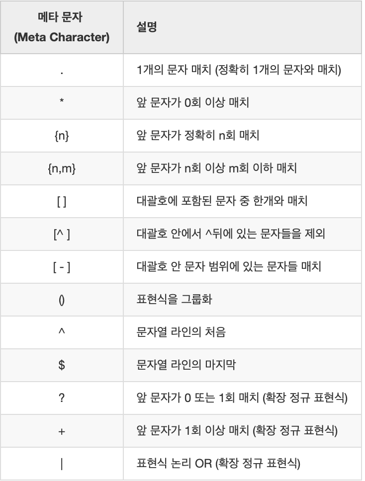
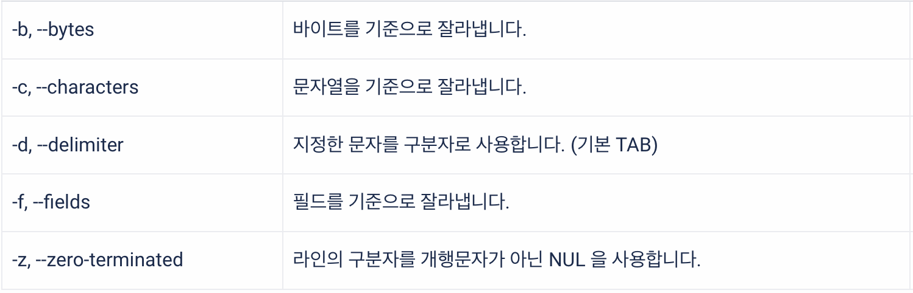

# echo

시스템 환경 변수나 입력 내용을 화면에 출력되도록 하고자 할때 사용하는 명령어

```
echo [옵션] 문자열
```

옵션
- -n
  - 화면상에서 커서를 한 줄 아래로 내리게 하는 개행 문자를 출력하지 않도록 한다.
- -e
  - 문자열에서 백슬래시와 이스케이프를 인용부호로 묶어 문자를 인식하도록 한다.

# perl (Practical Extraction and Report Language)

임의의 텍스트 파일을 스캔하고 해당 텍스트 파일에서 정보를 추출하여 그 정보를 기반으로 결과물을 출력하는데 최적화된 언어

이미 만들어진 vim에서 개행문자 없애기

```
perl -pi -e 's/\n//g' [FileName]
```

옵션 
- -e
  - 프로그램의 한 라인을 입력하기 위해 사용되는 명령어
- -p
  - 명령을 실행
- -i
  - 파일이 편집되도록 지정

# awk

awk 명령은 이름에 그 기능을 의미하는 단어나 약어가 포함되어 있지 않다.
- 파일로부터 레코드(record)를 선택하고, 선택된 레코드에 포함된 값을 조작하거나 데이터화하는 것을 목적으로사용하는 프로그램
  - 입력 데이터를 라인 단위의 레코드로 인식
- awk 명령의 입력으로 지정된 파일로부터 데이터를 분류한 다음, 분류된 텍스트 데이터를 바탕으로 패턴 매칭 여부를 검사하거나 데이터 조작 및 연산 등의 액션을 수행하고, 그 결과를 출력하는 기능

```
awk [Option] [awk program] [argument]
```
- Option
  - -F
    - 필드 구분 문자 지정
  - -f
    - awk program 파일 경로 지정
  - -v
    - awk program에서 사용될 특정 variable값 지정
- awk program
  - -f 옵션이 사용되지 않은 경우, awk가 실행할 awk program 코드 지정
  - awk program의 기본 구조
    - `pattern {action}`

결론적인 구조
```
awk [Option] 'pattern {action}' [argument]
```
- pattern과 action은 모두 생략 가능
  - pattern을 생략할 경우
    - 모든 레코드에 적용
  - action을 생략할 경우
    - print 적용 (기본 action)


# grep

입력으로 전달된 파일의 내용에서 특정 문자열을 찾고자할 때 사용하는 명령어
- 정규 표현식에 의한 패턴 매칭 방식을 사용
  - 정규 표현식 : 특정 규칙을 가진 문자열 집합을 표현하기 위한 형식 언어
- 문자열 검색에 정규 표현식을 적용
  - 문자열이 단순히 같은지 여부가 아니라, 정규 표현식의 규칙에 매칭되는지 여부가 검사되는 것



# cut

file이나 표준 입력에서 받은 문자열을 잘라내서 새로운 문자열을 만드는 명령어



# xargs

xargs는 pipeline 요리를 위한 명령어

default xargs는 세로로 된 출력물을 가로로 전환시켜준다.