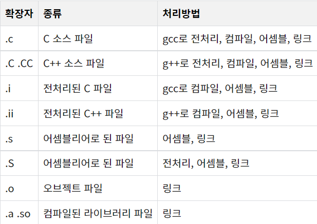
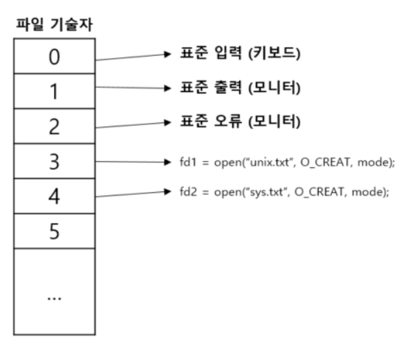

# `#` (전처리기)
컴퓨터 처리에 있어서 중심적인 처리를 수행하는 부분을 위해 사전 준비적인 계산을 행하는 프로그램
- 일반적으로 C언어에서 `#include`와 같은 형태로 가장 많이 사용된다.
- `#include <unistd.h>`를 입력하면 unistd 라이브러리를 가져와서 사용한다는 뜻이 된다.
  - 내부 소스 코드에서 버전 관리, 이미 작성된 다른 라이브러리 가져오기, 함수 정의, 상수 정의 등을 할 수 있다.
- 컴파일 되기 전에 미리 처리하는 문장

# gcc (GNU Compiler Collection)
- C 컴파일러
  - 원래 GNU C Compiler였다.
- 이 외에 다른 언어들도 컴파일 할 수 있다.

```zsh
gcc [파일이름]
```

## gcc 동작 과정

### 전처리 단계

소스 파일(file.c)에 gcc를 동작시키면 가장 먼저 전처리기인 cpp가 동작한다.
- cpp는 소스파일의 #으로 시작되는 전처리기 부분을 처리 한다.
- 이 과정에서 소스파일 file.c가 전처리기를 거치면 file.i라는 이름의 파일이 생성된다.
  - 디스크에는 저장되지 않는다.

### 컴파일 단계

컴파일러가 전처리된 파일(file.i)로부터 어셈블리어로 된 파일(file.s)을 생성한다.
- 일반적으로는 다음 단계인 어셈블 단계가 바로 실행되므로 file.s 파일은 디스크에 저장되지 않는다.
- 어셈블리어 
  - 고급 언어와 기계어 사이에 있는 중간 언어
  - 기계어에서 한 단계 위의 언어이며 기계어와 단 둘 뿐인 저급 언어

### 어셈블 단계

어셈블리어로 된 파일(file.s)을 기계가 직접 이해할 수 있는 기계어로 된 오브젝트 파일(file.o)로 변환한다.

### 링크 단계

라이브러리 함수와 오브젝트 파일들을 연결해 실행 파일을 생성하는 단계

## 파일 확장자에 따른 처리 방법

c
- 전처리기, 컴파일, 어셈블, 링크 과정을 거쳐야 실행 파일이 완성



## gcc 실행하기

```zsh
gcc 소스파일 이름
```

```zsh
./a.out
```
- `a.out`으로만 입력한다면 오류가 뜬다.
  - a.out이 저장된 디렉토리를 path로 설정하지 않았기 때문이다.
  - 프로그램 이름 앞에 현재 디렉토리 위치 정보인 `./`을 추가해줘야 한다.

# unistd.h

유닉스에서 사용하는 C 컴파일러 헤더파일

POSIX 운영체제 API에 대한 액세스를 제공하는 헤더파일
- read 함수
- write 함수

# include

`#include`
- 헤더파일을 포함시킨다.
- 헤더파일을 만들어서 include 하는 이유
  - 자주 쓰는 함수들을 저장해놓고 사용하기 위함
- 방식
  - `#include <헤더파일>`
    - 컴파일러의 라이브러리 폴더에서 헤더파일을 찾는다.
  - `#include "헤더파일"`
    - 현재 디렉토리에서 헤더파일을 찾는다.
    - 없으면 컴파이러의 라이브러리 폴ㄷ에서 헤더파일을 찾는다.
    - 주로 사용자가 헤더파일을 만들었을때 사용한다.

# write 함수

파일 기술자는 쓰기를 수행할 파일을 가리키고, buf는 파일에 기록할 데이터를 저장하고 있는 메모리 영역을 가리킨다.
- buf가 가리키는 메모리 영역에서 n으로 지정한 크기만큼 읽어 파일에 쓰기를 수행한다.

헤더
- unistd.h

형태
- ssize_t write(int fd, const void *buf, size_t n)
  - int fd
    - 데이터 전소 영역을 나타내는 파일 디스크립터
  - void *buf
    - 파일에 쓰기를 할 내용을 담은 버퍼의 포인터
  - size_t n
    - 전송할 데이터의 바이트 수
  - ssize_t
    - int와 같은 형식
  - size_t
    - unsigned int와 같은 형식

# 파일 기술자(file descriptor, fd)

모든 저수준 파일 입출력 함수는 파일 기술자를 사용한다.
- 현재 열려있는 파일을 구분할 목적으로 유닉스가 붙여놓은 번호
- 저수준 파일 입출력에서 열린파일을 참조하는 데 사용하는 지시자 역할
- 0 : 표준 입력
  - 키보드 의미
- 1 : 표준 출력
  - 모니터 의미
- 2 : 표준 오류 출력
  - 모니터 의미

프로세스는 동작하면서 필요에 따라 파일을 열고 닫는다.
- 한 프로세스가 동시에 열 수 있는 파일의 개수에는 제한이 있다.
- 프로세스가 파일을 열 때 파일 기술자는 0부터 시작해 가장 작은번호가 자동으로 할당된다.
  - 0, 1, 2번 파일 기술자는 기본적으로 할당된다.
    - 따라서 프로세스가 파일을 처음 열면 3번 파일 기술자가 할당된다.

