# 리눅스 파일 사용 권한(chmod)

change mode
- 파일의 모드를 변경하는 것
  - 파일의 권한을 변경하는 것

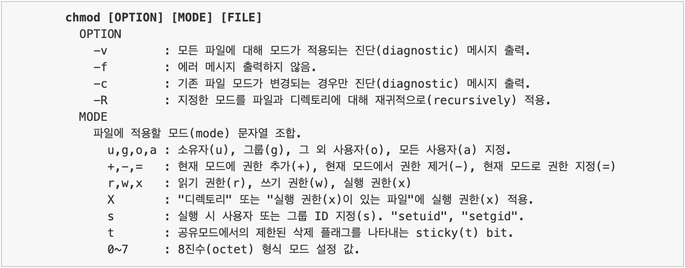

파일 읽기, 파일 쓰기, 파일 실행
- r(read)
  - 디렉토리에 있는 파일 리스트를 확인할 수 있는 권한
  - ls를 사용하려면 읽기 권한이 있어야 한다.
    - 없으면 permission denied 에러 발생
    - 읽기 권한이 있으면 ls가능하고, ls -l은 실행(x) 권한이 있어야 한다.
- w(write)
  - 디렉토리에 파일을 생성하거나, 복사, 이름 변경, 삭제 등의 작업을 하고자 할 때 필요한 권한
  - 쓰기(w) 권한만 있다고 해서 이 모든 작업이 수행되지는 않는다.
    - 실행(x) 권한도 같이 지정되어 있어야 한다.
- x(execute)
  - 디렉토리에 접근하고자 할 때 필요한 권한
    - cd 명령어
    - 디렉토리에 어떤 작업(읽기, 쓰기)을 할 때 디렉토리에 접근하기 위해 실행(x) 권한이 필요하다.
      - 실행 권한 없이는 읽기, 쓰기 권한을 완전히 사용할 수 없다.

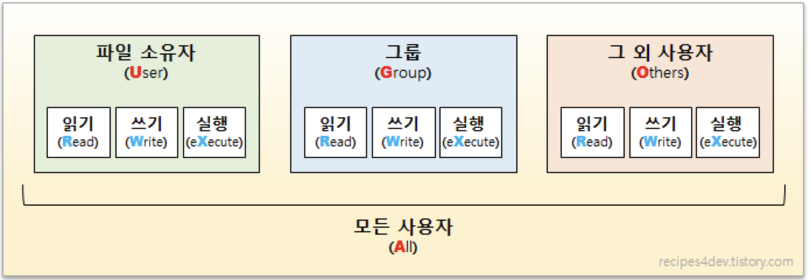

## chmod 명령의 MODE 파라미터

파일을 소유한 사용자에 대해 읽고 쓸 수있는 권한 지정.
- chmod u=rw FILE

파일이 속한 그룹이 실행할 수 있는 권한 추가.
- chmod g+x FILE

시스템의 모든 사용자가 읽을 수만 있는 권한 지정.
- chmod u=r FILE

파일을 소유한 그룹과 그 외 사용자의 모든 권한 제거.
- chmod go-rwx FILE

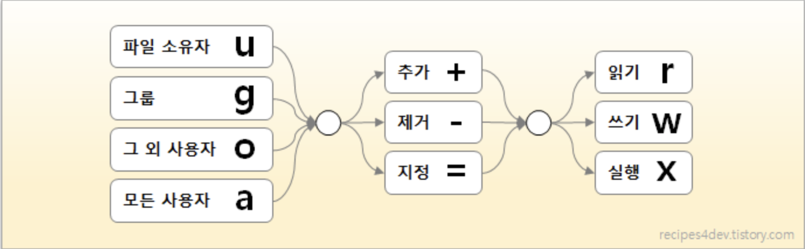

## 파일 또는 디렉토리 권한 확인

리눅스에서 파일 또는 디렉토리에 지정된 권한을 확인하려면 ls -l 명령을 사용한다.
- list long: 현 디렉토리 내 파일 리스트가 하나의 파일 단위로 한줄로 길게 표시

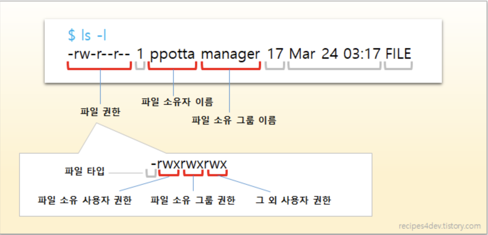

## 8진수 형식으로 파일 모드 지정 방법

MODE 파라미터에 파일 모드(mode)를 표현하는 8진수 값을 사용한다.


- 8진수 값을 사용하는 방법은 각 권한(rwx)을 8진수 형태의 숫자 값으로 변환하여 한 번에 지정하는 방법
  - rwx를 하나의 8진수 값으로 변환한 다음, 이 값을 연속한 세개(사용자, 그룹, 그 외 사용자)로 나열하여 전달한다.
- 값
  - -
    - 권한 없음
    - 0
  - r
    - 읽기 권한
    - 4
  - w
    - 쓰기 권한
    - 2
  - x
    - 실행 권한
    - 1

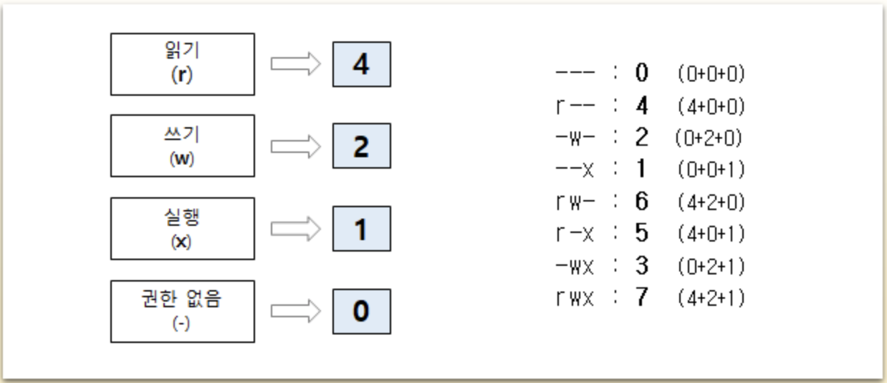

모든 사용자가 읽고 쓰고 실행할 수 없도록 지정

```
chmod 000 FILE
```

모든 사용자가 읽고 쓰고 실행할 수 있는 권한 지정

```
chmod 777 FILE
```

소유자는 모든 권한, 그룹 및 그 외 사용자는 읽기와 실행만 가능

```
chmod 755 FILE
```

소유자 및 그룹은 읽기  가능, 그외 사용자는 권한 없음

```
chmod 440 FILE
```

파일 소유 사용자에게 실행권한 추가

```
chmod u+x FILE
```

파일 소유 사용자에게 쓰기 권한 추가

```
chmod u+w FILE
```

파일 소유 사용자에게 읽기, 쓰기, 실행 권한 지정

```
chmod u=rwx FILE
```

파일 소유 사용자의 실행 권한 제거

```
chmod u-x FILE
```

파일 소유 그룹에 쓰기 권한 추가

```
chmod g+w FILE
```

파일 소유 그룹의 실행 권한 제거

```
chmod g-x FILE
```

파일 소유 사용자 및 그룹을 제외한 사용자는 읽기만 가능

```
chmod o=r FILE
```

현재 디렉토리의 모든 파일에서 모든 사용자의 읽기 권한 제거

```
chmod a-r *
```

파일 소유 사용자는 모든 권한, 그룹은 읽기만 가능

```
chmod u=rwx, g=r FILE
```

파일 소유 사용자와 그룹이 읽기, 쓰기 가능

```
chmod ug=rw FILE
```

파일 소유 그룹은 읽기, 쓰기 가능, 그 외 사용자는 읽기만 가능

```
chmod g=rw, o=r FILE
```

파일 소유 사용자 및 그룹은 읽기, 쓰기 가능, 그외 사용자는 읽기만 가능

```
chmod ug=rw, o=r FILE
```

모든 사용자의 모든 권한 제거

```
chmod 000 FILE
```

사용자(읽기, 쓰기), 그룹(읽기, 쓰기), 그외 사용자(읽기)

```
chmod 664 FILE
```

사용자(읽기, 쓰기, 실행), 그룹(읽기, 실행), 그외 사용자(읽기, 실행)

```
chmod 755 FILE
```

모든 사용자에 모든 권한 추가

```
chmod 777 FILE
```

DIR 디렉토리 하위 모든 파일 및 디렉토리에 그룹 실행(x) 권한 추가

```
chmod -R g+x DIR
```
- -R (recursive)
  - 지정한 모드를 파일과 디렉토리에 대해 재귀적으로 적용

현재 디렉토리의 모든 파일에서 그외 사용자의 쓰기, 실행 권한 제거

```
chmod -R o-wx *
```

현재 디렉토리 기준 모든 파일 읽기 권한 제거, 디렉토리 실행 권한 추가

```
chmod -R a-r, a+x *

chmod -R a-r+x *
```

```
-r--r-xr-x 1 XX XX 40 Jun 1 23:42 testShell00
```
- 첫 XX는 사용자, 그 다음 XX는 그룹을 의미한다.

# Unix 파일 크기

## 크기 확인

### ls -s
- 기본으로 할당된 크기를 나타낸다.

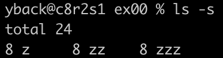
- z라는 파일에 8이 할당되었다.
  - 이 8이 무엇을 의미하는지는 아직 미지수다.

### ls -lh
- 작성한 내용의 크기를 나타낸다.

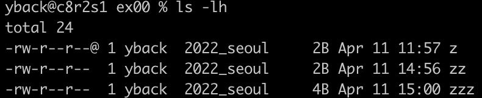

### du [파일 이름]

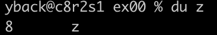
- 파일의 크기

### du [폴더 이름]

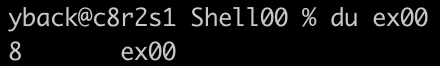
- 해당 디렉토리의 하위 디렉토리들의 크기

### du -s [폴더 이름]

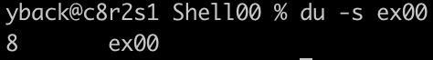
- 디렉토리의 크기를 출력

## 크기 변경

### dd
블럭 단위로 파일을 복사하거나 파일 변환을 할 수 있는 명령어
- 옵션 정리
  - bs
    - Bytes, 한번에 읽고 쓸 최대 바이트 크기를 지정
  - cbs
    - Bytes, 한번에 변환 작업 가능한 바이트 크기를 지정
  - ibs
    - Bytes, 한번에 읽어들이는 입력단위 바이트를 지정
  - count
    - Block, 지정한 블럭 수 만큼 복사
  - if
    - File, 지정한 파일을 입력대상으로 설정
  - obs
    - Bytes, 한번에 작성하는 출력단위 바이트를 지정
  - of
    - File, 지정한 파일을 출력대상으로 설정

dd if=/dev/zero of=(파일명) bs=(바이트크기) count=1
- 파일을 널 문자로 바이트크기만큼 채운다.

# 파일 링크

하드링크
- 하드 링크를 기존 파일의 추가 이름으로 생각
- 단일 파일에 대해 하나 이상의 하드 링크를 만들 수 있다.

소프트링크(심볼릭 링크)
- 소프트 링크는 바로가기 같은 것
- 파일 또는 디렉터리에 대한 간접 포인터

## 파일 링크를 쓰는 이유

1. 경로 단축을 위해 심볼릭 링크를 설정
2. 데이터를 안전하게 보관하고 싶을 경우 사용
   - 사람들과 공유하기 위해 하드링크를 걸면 데이터가 직접 연결되어 있어서 변경 결과가 서로에게 영향을 주게 된다.

## 파일 링크 원리 - I-node

리눅스에서 파일이나 디렉터리를 생성하면 I-node라는 번호가 임의로 부여되고 이 번호를 기준으로 관리된다.

I-node
- 리눅스/유닉스 파일 시스템에서 사용하는 자료구조
- 파일이나 디렉터리의 여러가지 정보가 담겨있다.
- 각 번호들은 ls -i 명령으로 확인 가능하다.
  - 파일명이 다르더라도 이 번호가 같다면 내부적으로는 같은 파일로 인식된다.

소프트 링크 파일

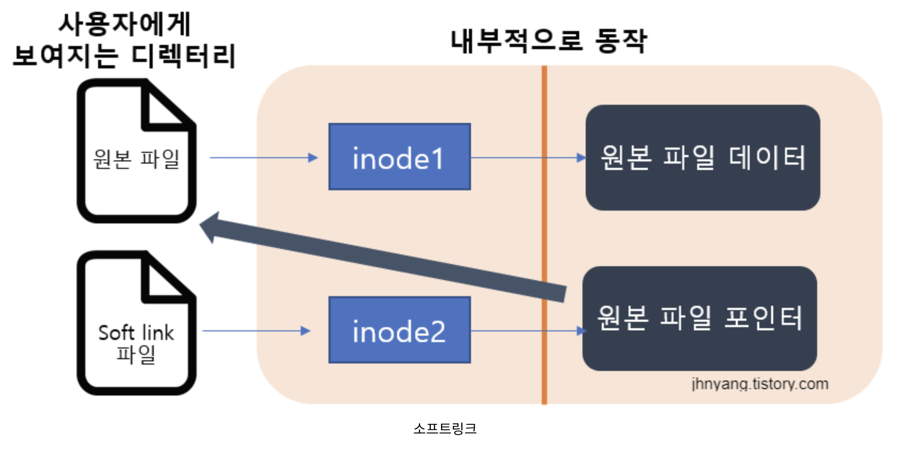

- 원본 파일을 가리키는 파일을 하나 만든다.
  - 원본 파일의 주소를 링크하는 파일
  - 소프트링크 파일은 원본 파일과 다른 아이노드를 갖는다.
- 심볼릭 링크는 하나의 파일을 여러 이름으로 가리키게 하는 것
  - 원본과 생성된 링크 파일은 완전히 다른 파일로 관리된다.
- 파일이나 디렉터리에 모두 사용 가능
  - 일반적으로 디렉터리의 경로 단축이나 변경에 사용
- 원본 파일이 삭제된다면 심볼릭 링크는 아무런 구실을 하지 못하게 된다.

하드 링크 파일

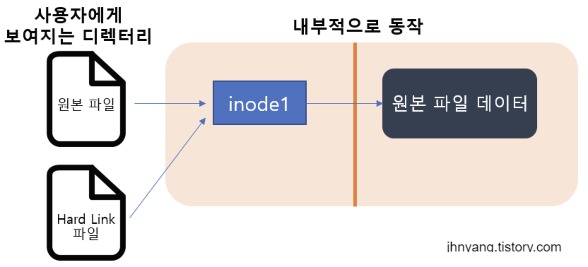

- 원본 파일과 동일한 내용의 다른 파일
  - 같은 아이노드 값을 갖고 있다.
- 원본 파일을 직접적으로 가리키고 있기 때문에 원본 파일을 수정하면 하드 링크 파일도 수정된다.
  - 하드 링크 파일을 수정하면 원본 파일도 수정된다.
- 하드 링크는 원본 파일이나 다른 하드 링크 파일이 삭제되어도 데이터 손실이 일어나지 않는다.


ln 명령어 사용 방법
- 옵션 없이 사용하면 하드 링크가 생성되고, -s 옵션을 사용하면 심볼릭 링크가 생성된다.

```
ln -s [OPTIONS] 원본FILE 대상LINK
```
- FILE로 지정된 파일에서 두 번째 LINK로 지정된 파일에 대한 링크를 생성
- 하나의 파일만 인수로 제공되거나 두 번째 인수가 점(.)인 경우 ln은 현재 작업 디렉토리에 해당 파일에 대한 링크를 만든다.
- 성공하면 0 반환

사용 예시

```
ln test.text t
```
- test.text라는 파일의 하드링크 파일인 t를 현재 디렉터리에 생성한다.

```
ln -s test t
```
- test라는 파일의 심볼릭 링크 파일인 t를 현재 디렉터리에 생성한다.

```
ln -s /etc/xinetd.d x
```
- /etc.xinetd.d의 심볼릭 링크 파일인 x를 현재 디렉터리에 생성한다.

>디렉터리는 링크 수가 처음부터 2이다.
>심볼릭 링크 파일은 touch -h로 수정을 한다.

# Kerberos Protocol

Kerberos
- ticket 기반의 컴퓨터 네트워크 인증 프로토콜이다.
- 보안이 보장되지 않은 네트워크 환경에서 요청을 보내는 유저와 요청을 받는 서버가 서로의 신뢰성을 확보하기 위해 사용된다.
- ticket은 정보 패킷
  - 이 ticket은 ticket을 발급하는 서버의 비밀 키로 암호화된다.

# git

git log --pretty="%H" -5
- 다섯개를 예쁜 형식으로 출력한다.
  - id

git ls-files
- 단순히 파일의 리스트만 뜬다.


-o, --other
- untracked files를 출력

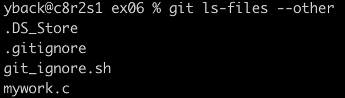

--ignored
- 반대로 뒤집는다.
- ignored된 파일을 가져온다.

--exclude
- 제외한다.

--exclude-standard
- gitignore 파일의 규칙에 따른다.
  - gitignore에 명시된 파일은 표시하지 않는다.

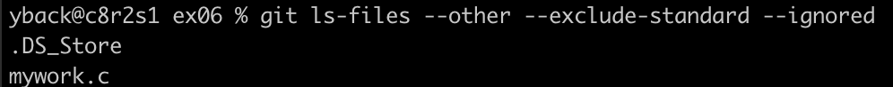

# diff
차이를 비교한 뒤 알려주는 역할

```
diff a b > sw.diff
```
- a와 b의 차이를 구해서 sw.diff 파일을 생성한다.

# patch

```
patch -p0 < sw.diff
```
- -pNum
  - 패치 파일에서 파일 이름 경로를 얼마나 제거해서 적용하는지 나타낸다.
  - Num만큼 /를 빼주는 것으로 경로를 설정하는 것이다.
- -p0
  - 파일 경로를 제거하지 않고 적용한다는 의미
  - diff 명령어로 패치파일이 생성될 때 동일한 위치일 경우 -p0 옵션을 사용하여 패치한다.
- 엔터를 치면 어떤 파일을 패치시킬건지 묻는다.
  - 패치 시킬 파일을 선택하면 그 파일이 sw.diff(패치파일)로 패치된다.

# find
 사용자가 원하는 파일을 찾아주는 명령어

- 형식
  - find <경로> <연산자>
- 경로
  - find가 파일을 찾을 처음 위치를 지정한다.
  - /
    - 루트부터 찾는다.
  - .
    - 현재 디렉터리부터 찾는다.
- find / -name '*.txt'
  - 확장자가 txt인 파일을 루트부터 찾는다.
- find .-perm 666
  - 권한이 666인 파일을 현 디렉토리부터 찾는다.
- type
  - 파일의 타입을 지정하여, 찾고자하는 파일을 찾는다.
    - b : 블록 특수 파일(block device)
    - c : 캐릭터 특수 파일 (character deice)
    - d : 디렉토리(directory)
    - f : 일반파일(file)
    - l : 심볼릭 링크(link)
    - p : 파이프 (pipe)
    - s : 소켓 (socket)
  - find .-type d
    - 현재 디렉토리 하위에 위치한 서브 디렉토리를 모두 찾는다.
- print
  - 찾은 파일들을 표준 출력(stdout)으로 출력한다.

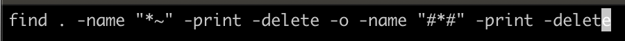
- find의 옵션들을 중복해서 쓰고 싶다면 or를 활용해서 다시 써줘야 한다.


# 윤대혁
# 조병화
# 조성휘
# 장지웅