- [MySQL의 데이터 형식](#mysql의-데이터-형식)
  - [MySQL에서 지원하는 데이터 형식의 종류](#mysql에서-지원하는-데이터-형식의-종류)
    - [숫자 데이터 형식](#숫자-데이터-형식)
    - [문자 데이터 형식](#문자-데이터-형식)
    - [날짜와 시간 데이터 형식](#날짜와-시간-데이터-형식)
    - [기타 데이터 형식](#기타-데이터-형식)
    - [LONGTEXT, LONGBLOB](#longtext-longblob)
  - [변수의 사용](#변수의-사용)
  - [데이터 형식과 형 변환](#데이터-형식과-형-변환)
    - [데이터 형식 변환 함수](#데이터-형식-변환-함수)
    - [암시적인 형 변환](#암시적인-형-변환)
  - [MySQL 내장 함수](#mysql-내장-함수)
    - [제어 흐름 함수](#제어-흐름-함수)
      - [IF(수식, 참, 거짓)](#if수식-참-거짓)
      - [IFNULL(수식1, 수식2)](#ifnull수식1-수식2)
      - [NULLIF(수식1, 수식2)](#nullif수식1-수식2)
      - [CASE~WHEN~ELSE~END](#casewhenelseend)
    - [문자열 함수](#문자열-함수)
      - [ASCII(아스키 코드), CHAR(숫자)](#ascii아스키-코드-char숫자)
      - [BIT_LENGTH(문자열), CHAR_LENGTH(문자열), LENGTH(문자열)](#bit_length문자열-char_length문자열-length문자열)
      - [CONCAT(문자열1, 문자열2, ...), CONCAT_WS(구분자, 문자열1, 문자열2, ...)](#concat문자열1-문자열2--concat_ws구분자-문자열1-문자열2-)
      - [ELT(위치, 문자열1, 문자열2, ...), FIELD(찾을 문자열, 문자열1, 문자열2, ...), FIND_IN_SET(찾을 문자열, 문자열 리스트), INSTR(기준 문자열, 부분 문자열), LOCATE(부분  문자열, 기준 문자열)](#elt위치-문자열1-문자열2--field찾을-문자열-문자열1-문자열2--find_in_set찾을-문자열-문자열-리스트-instr기준-문자열-부분-문자열-locate부분--문자열-기준-문자열)
      - [FORMAT(숫자, 소수점 자릿수)](#format숫자-소수점-자릿수)
      - [BIN(숫자), HEX(숫자), OCT(숫자)](#bin숫자-hex숫자-oct숫자)
      - [INSERT(기준 문자열, 위치, 길이, 삽입할 문자열)](#insert기준-문자열-위치-길이-삽입할-문자열)
      - [LEFT(문자열, 길이), RIGHT(문자열, 길이)](#left문자열-길이-right문자열-길이)
      - [UPPER(문자열), LOWER(문자열)](#upper문자열-lower문자열)
      - [LPAD(문자열, 길이, 채울 문자열), RPAD(문자열, 길이, 채울 문자열)](#lpad문자열-길이-채울-문자열-rpad문자열-길이-채울-문자열)
      - [LTRIM(문자열), RTRIM(문자열)](#ltrim문자열-rtrim문자열)
      - [TRIM(문자열), TRIM(방향 자를_문자열 FROM 문자열)](#trim문자열-trim방향-자를_문자열-from-문자열)
      - [REPAEAT(문자열, 횟수)](#repaeat문자열-횟수)
      - [REPLACE(문자열, 원래 문자열, 바꿀 문자열)](#replace문자열-원래-문자열-바꿀-문자열)
      - [REVERSE(문자열)](#reverse문자열)
      - [SPACE(길이)](#space길이)
      - [SUBSTRING(문자열, 시작위치, 길이) 또는 SUBSTRING(문자열 FROM 시작위치 FOR 길이)](#substring문자열-시작위치-길이-또는-substring문자열-from-시작위치-for-길이)
      - [SUBSTRING_INDEX(문자열, 구분자, 횟수)](#substring_index문자열-구분자-횟수)
    - [수학 함수](#수학-함수)
      - [ABS(숫자)](#abs숫자)
      - [ACOS(숫자), ASIN(숫자), ATAN(숫자), ATAN(숫자1, 숫자2), SIN(숫자), COS(숫자), TAN(숫자)](#acos숫자-asin숫자-atan숫자-atan숫자1-숫자2-sin숫자-cos숫자-tan숫자)
      - [CEILING(숫자), FLOOR(숫자), ROUND(숫자)](#ceiling숫자-floor숫자-round숫자)
      - [CONV(숫자, 원래 진수, 변환할 진수)](#conv숫자-원래-진수-변환할-진수)
      - [DEGREES(숫자), RADIANS(숫자), PI()](#degrees숫자-radians숫자-pi)
      - [EXP(X), LN(숫자), LOG(숫자), LOG(밑수, 숫자), LOG2(숫자), LOG10(숫자)](#expx-ln숫자-log숫자-log밑수-숫자-log2숫자-log10숫자)
      - [MOD(숫자1, 숫자2) 또는 숫자1 % 숫자2 또는 숫자1 MOD 숫자2](#mod숫자1-숫자2-또는-숫자1--숫자2-또는-숫자1-mod-숫자2)
      - [POW(숫자1, 숫자2), SQRT(숫자)](#pow숫자1-숫자2-sqrt숫자)
      - [RAND()](#rand)
      - [SIGN](#sign)
      - [TRUNCATE(숫자, 정수)](#truncate숫자-정수)
    - [날짜 및 시간 함수](#날짜-및-시간-함수)
      - [ADDDATE(날짜, 차이), SUBDATE(날짜, 차이)](#adddate날짜-차이-subdate날짜-차이)
      - [ADDTIME(날짜/시간, 시간), SUBTIIM(날짜/시간, 시간)](#addtime날짜시간-시간-subtiim날짜시간-시간)
      - [CURDATE(), CURTIME(), NOW(), SYSDATE()](#curdate-curtime-now-sysdate)
      - [YEAR(날짜), MONTH(날짜), DAY(날짜), HOUR(시간), MINUTE(시간), SECOND(시간), MICROSECOND(시간)](#year날짜-month날짜-day날짜-hour시간-minute시간-second시간-microsecond시간)
      - [DATE(), TIME()](#date-time)
      - [DATEDIFF(날짜1, 날짜2), TIME(날짜1 또는 시간1, 날짜1 또는 시간2)](#datediff날짜1-날짜2-time날짜1-또는-시간1-날짜1-또는-시간2)
      - [DAYOFWEEK(날짜), MONTHNAME(), DAYOFYEAR(날짜)](#dayofweek날짜-monthname-dayofyear날짜)
      - [LAST_DAY(날짜)](#last_day날짜)
      - [MAKEDATE(연도, 정수)](#makedate연도-정수)
      - [MAKETIME(시, 분, 초)](#maketime시-분-초)
      - [PERIOD_ADD(연월, 개월수), PERIOD_DIFF(연월1, 연월2)](#period_add연월-개월수-period_diff연월1-연월2)
      - [QUARTER(날짜)](#quarter날짜)
      - [TIME_TO_SEC(시간)](#time_to_sec시간)
    - [시스템 정보 함수](#시스템-정보-함수)
      - [USER(), DATABASE()](#user-database)
      - [FOUND_ROWS()](#found_rows)
      - [ROW_COUNT()](#row_count)
      - [VERSION()](#version)
      - [SLEEP(초)](#sleep초)
- [영화사이트 데이터베이스 구축 실습](#영화사이트-데이터베이스-구축-실습)
- [피벗(pivot)의 구현](#피벗pivot의-구현)
- [JSON 데이터](#json-데이터)

---

# MySQL의 데이터 형식

## MySQL에서 지원하는 데이터 형식의 종류

### 숫자 데이터 형식

|   데이터 형식   | 바이트 수 |      숫자 범위      |                         설명                         |
| :-------------: | :-------: | :-----------------: | :--------------------------------------------------: |
|    SMALLINT     |     2     |   -32678 ~ 32767    |                         정수                         |
|       INT       |     4     |    -21억 ~ 21억     |                         정수                         |
|     BIGINT      |     8     |   -900경 ~ 900경    |                         정수                         |
|      FLOAT      |     4     | -3.40E38 ~ 1.17E-38 |              소수점 아래 7자리까지 표현              |
| DECIMAL(m, [d]) |   5~17    |  -1E38+1 ~ 1E38-1   | 전체 자릿수(m)와 소수점 이하 자릿수(d)를 가진 숫자형 |

- DECIMAL
  - 데이터 형식은 정확한 수치를 저장
- FLOAT, DOUBLE
  - 근사치를 저장
  - 상당히 큰 숫자를 저장할 수 있다.

### 문자 데이터 형식

|       데이터 형식       |   바이트 수    |                   설명                    |
| :---------------------: | :------------: | :---------------------------------------: |
|         CHAR(n)         |    1 ~ 255     |  고정길이 문자형. n을 1부터 255까지 지정  |
|       VARCHAR(n)        |   1 ~ 65535    | 가변길이 문자형. n을 1부터 65535까지 지정 |
| LONGTEXT<br/>(TEXT형식) | 1 ~ 4294967295 |      최대 4GB 크기의 TEXT 데이터 값       |
| LONGBLOB<br/>(BLOB형식) | 1 ~ 4294967295 |      최대 4GB 크기의 BLOB 데이터 값       |

- CHAR(n)은 영문, 한글 구분없이 n글자를 입력하는 것
- BINARY, VARBINARY
  - 바이트 단위의 이진 데이터 값 저장
- TEXT, TINYTEXT, MEDIUMTEXT, LONGTEXT
  - 대용량의 글자를 저장하기 위한 형식
- BLOB, TINYBLOB, MEDIUMBLOB, LONGBLOB
  - 사진 파일, 동영상 파일, 문서 파일 등의 대용량의 이진 데이터를 저장하는 데 사용

### 날짜와 시간 데이터 형식

| 데이터 형식 | 바이트 수 | 설명                                                                                                  |
| :---------: | :-------: | :---------------------------------------------------------------------------------------------------- |
|    DATE     |     3     | 1001-01-01 ~ 9999-12-31의 범위까지만 저장<br/>'YYYY-MM-DD'형식으로 사용                               |
|  DATETIME   |     8     | 1001-01-01 00:00:00 ~ 9999-12-31 23:59:59의 범위까지만 저장<br/>'YYYY-MM-DD HH:MM:SS'의 형식으로 사용 |

### 기타 데이터 형식

| 데이터 형식 | 바이트 수 |                                    설명                                     |
| :---------: | :-------: | :-------------------------------------------------------------------------: |
|  GEOMETRY   |    N/A    | 공간 데이터 형식으로 선, 점 및 다각형 같은 공간 데이터 개체를 저장하고 조작 |
|    JSON     |     8     |                JSON(JavaScript Object Notation) 문서를 저장                 |

### LONGTEXT, LONGBLOB

MySQL은 LOB(Large Object: 대량의 데이터)저장하기 위해서 LONGTEXT, LONGBLOB 데이터 형식을 지원한다.

- 지원되는 데이터 크기는 약 4GB 크기의 파일을 하나의 데이터로 저장할 수 있다.

## 변수의 사용

SQL도 변수를 선언하고 사용할 수 있다.

```SQL
SET @변수이름 = 변수의 값; -- 변수 선언 및 값 대입
SELECT @변수이름; -- 변수의 값 출력
```

- 스토어드 프로시저나 함수 안에서의 변수 사용 방법은 DECLARE문으로 선언한 후에 사용하는 것이다.
- 변수는 Workbench를 닫았다가 재시작하면 소멸된다.

```SQL
USE sqldb;

SET @myVar1 = 5; 
SET @myVar2 = 3;
SET @myVar3 = 4.25;
SET @myVar4 = '가수이름 ==>'

SELECT @myVar1;
SELECT @myVar2 + @myVar3;
SELECT @myVar4, Name FROM usertbl WHERE height > 180;
```

LIMIT에는 원칙적으로 변수를 사용할 수 없지만, PREPARE와 EXECUTE문을 활용해서 변수를 사용할 수 있다.

```SQL
SET @myVAar1 = 3;
PREPARE myQuery
    FROM 'SELECT Name, height FROM usertbl ORDER BY height LIMIT ?';
EXECUTE myQuery USING @myVar1;
```

- 'LIMIT @변수'형시긍로 사용하면 오류 발생
- PREPARE 쿼리이름 FROM '쿼리문'
  - 쿼리이름에 '쿼리문'을 준비만 해놓고 실행하지는 않는다.
- EXECUTE 쿼리이름 USING @변수
  - EXECUTE문을 만나면 PREPARE문이 드디어 시작된다.
    - 여기서 USING 뒤에 나오는 @변수가 PREPARE문의 ?에 대입된다.

## 데이터 형식과 형 변환

### 데이터 형식 변환 함수

CAST(), CONVERT()

```SQL
CAST(expression AS 데이터형식[(길이)])
CONVERT(expression AS 데이터형식[(길이)])
```

```SQL
USE sqldb;
SELECT AVG(amount) AS '평균 구매 개수' FROM buytbl;

SELECT CAST(AVG(amount) AS SIGNED INTEGER) AS '평균 구매 개수' FROM buytbl;
-- SELECT CAST(AVG(amount), SIGNED INTEGER) AS '평균 구매 개수' FROM buytbl; //이것도 가능
```

- 쿼리의 결과를 보기 좋도록 처리할 때도 사용된다.

```SQL
SELECT 
    num, 
    CONCAT(CAST(price AS CHAR(10)), 'X', CAST(amount AS CHAR(4)), '=') AS '단가X수량',
    price*amount AS '구매액'
FROM buytbl;
```

### 암시적인 형 변환

암시적 형 변환(Implicit conversion)

- CAST()나 CONVERT() 함수를 사용하지 않고 형이 변환되는 것

```SQL
SELECT '100' + '200'; -- 문자와 문자를 더함(정수로 변환되서 연산됨)
SELECT CONCAT('100', '200'); -- 문자와 문자를 연결(문자로 처리)
SELECT CONCAT(100, '200'); -- 정수와 문자를 연결(정수가 문자로 변환되서 처리)
SELECT 1 > '2mega'; -- 정수인 2로 변환되어서 비교
SELECT 3 > '2MEGA'; -- 정수인 2로 변환되어서 비교
SELECT 0 = 'mega2'; --문자는 0으로 변환됨
```

명시적 형 변환(Explicit conversion)

- CAST()나 CONVERT() 함수를 이용해서 데이터 형식을 변환하는 것

## MySQL 내장 함수

### 제어 흐름 함수

프로그램의 흐름을 제어한다.

#### IF(수식, 참, 거짓)

```SQL
SELECT IF (100>200, '참이다.','거짓이다.'); -- 거짓 출력
```

#### IFNULL(수식1, 수식2)

- 수식1이 NULL이 아니면 수식1이 반환
- 수식1이 NULL이면 수식2가 반환

```SQL
SELECT IFNULL(NULL, '널이군요'), IFNULL(100, '널이군요'); -- '널이군요', 100 출력
```

#### NULLIF(수식1, 수식2)

- 수식1과 수식2가 같으면 NULL반환
- 다르면 수식1 반환

```SQL
SELECT NULLIF(100,100), NULLIF(200,100); -- NULL, 200 출력
```

#### CASE~WHEN~ELSE~END

- CASE는 내장 함수가 아니고 연산자
- 다중 분기에 사용

```SQL
SELECT CASE 10
        WHEN 1 THEN '일'
        WHEN 5 THEN '오'
        WHEN 10 THEN '십'
        ELSE '모름'
END AS 'CASE연습';
```

### 문자열 함수

문자열을 조작

#### ASCII(아스키 코드), CHAR(숫자)

문자의 아스키 코드값을 반환하거나 숫자의 아스키 코드값에 해당하는 문자를 반환한다.

```SQL
SELECT ASCII('A'), CHAR(65); -- 65, A 출력
```

#### BIT_LENGTH(문자열), CHAR_LENGTH(문자열), LENGTH(문자열)

BIT_LENGTH(문자열)

- 할당된 Bit 크기 또는 문자 크기를 반환한다.

CHAR_LENGTH(문자열)

- 문자의 개수를 반환

LENGTH(문자열)

- 할당된 Byte수를 반환한다.

```SQL
SELECT BIT_LENGTH('abc'), CHAR_LENGTH('abc'), LENGTH('abc');
SELECT BIT_LENGTH('가나다'), CHAR_LENGTH('가나다'), LENGTH('가나다');
```

- MySQL은 기본적으로 UTF-8코드
  - 영문은 3byte, 한글은 3x3 = 9byte를 할당

#### CONCAT(문자열1, 문자열2, ...), CONCAT_WS(구분자, 문자열1, 문자열2, ...)

문자열을 이어준다. CONCAT_WS()는 구분자와 함께 문자열을 이어준다.

```SQL
SELECT CONCAT_WS('/', '2025', '01', '01');
-- 2025/01/01 출력
```

#### ELT(위치, 문자열1, 문자열2, ...), FIELD(찾을 문자열, 문자열1, 문자열2, ...), FIND_IN_SET(찾을 문자열, 문자열 리스트), INSTR(기준 문자열, 부분 문자열), LOCATE(부분  문자열, 기준 문자열)

```SQL
SELECT 
    ELS(2, '하나', '둘', '셋'), -- 둘 출력
    FIELD('둘', '하나', '둘', '셋'), -- 2 출력
    FIND_IN_SET('둘', '하나,둘,셋'), -- 2 출력
    INSTR('하나둘셋','둘'), -- 3 출력
    LOCATE('둘', '하나둘셋'); -- 3 출력
```

#### FORMAT(숫자, 소수점 자릿수)

숫자를 소수점 아래 자릿수까지 표현

- 1000단위마다 콤마를 추가해준다.

```SQL
SELECT FORMAT(123456.123456, 4); --123,456.1235 출력
```

#### BIN(숫자), HEX(숫자), OCT(숫자)

2진수, 16진수, 8진수의 값을 반환

```SQL
SELECT BIN(31), HEX(31), OCT(31); -- 11111, 1F, 37 출력
```

#### INSERT(기준 문자열, 위치, 길이, 삽입할 문자열)

기준 문자열의 위치부터 길이만큼을 지우고 삽입할 문자열을 끼워 넣는다.

```SQL
SELECT 
    INSERT('abcdefghi', 3, 4, '@@@@'), -- ab@@@@ghi 출력
    INSERT('abcdefghi', 3, 2, '@@@@'); -- ab@@@@efghi 출력
```

#### LEFT(문자열, 길이), RIGHT(문자열, 길이)

왼쪽 또는 오른쪽에서 문자열의 길이만큼 반환한다.

```SQL
SELECT
    LEFT('abcdefghi', 3), -- abc 출력
    RIGHT('abcdefghi', 3); -- ghi 출력
```

#### UPPER(문자열), LOWER(문자열)

소문자를 대문자로, 대문자를 소문자로 변경

- LCASE(), UCASE()와 동일한 함수

```SQL
SELECT 
    LOWER('ABCDEFGHI'), -- abcdefghi 출력
    UPPER('abcdefghi'); -- ABCDEFGHI 출력
```

#### LPAD(문자열, 길이, 채울 문자열), RPAD(문자열, 길이, 채울 문자열)

문자열의 길이만큼 늘린 후에, 빈 곳을 채울 문자열로 채운다.

```SQL
SELECT 
    LPAD('이것이', 5, '##'), ##이것이 출력
    RPAD('이것이', 5, '##'); 이것이## 출력
```

#### LTRIM(문자열), RTRIM(문자열)

문자열의 왼쪽, 오른쪽 공백을 제거한다.

- 중간의 공백은 제거 불가

```SQL
SELECT 
    LTRIM('   이것이'), -- 이것이 출력
    RTRIM('이것이   '); -- 이것이 출력
```

#### TRIM(문자열), TRIM(방향 자를_문자열 FROM 문자열)

- TRIM(문자열)
  - 문자열의 앞뒤 공백을 모두 없앤다.
- TRIM(방향 자를_문자열 FROM 문자열)
  - 방향
    - LEADING(앞)
    - BOTH(양쪽)
    - TRAILING(뒤)

```SQL
SELECT
    TRIM('   이것이   '), -- 이것이 출력
    TRIM(BOTH 'ㅋ' FROM 'ㅋㅋㅋ재밌다.ㅋㅋㅋ'); -- 재밌다. 출력
```

#### REPAEAT(문자열, 횟수)

문자열을 횟수만큼 반복

```SQL
SELECT REPEAT('이것이', 3); -- 이것이이것이이것이 출력
```

#### REPLACE(문자열, 원래 문자열, 바꿀 문자열)

문자열에서 원래 문자열을 찾아서 바꿀 문자열로 바꿔준다.

```SQL
SELECT
    REPLACE('이것이 MySQL이다.', '이것이', 'This is'); -- This is MySQL이다 출력
```

#### REVERSE(문자열)

문자열의 순서를 거꾸로 만든다.

```SQL
SELECT REVERSE ('MySQL'); -- LQSyM 출력
```

#### SPACE(길이)

길이만큼의 공백을 반환한다.

```SQL
SELECT CONCAT('이것이', SPACE(10), 'MySQL이다'); -- 이것이          MySQL이다 출력
```

#### SUBSTRING(문자열, 시작위치, 길이) 또는 SUBSTRING(문자열 FROM 시작위치 FOR 길이)

시작위치부터 길이만큼 문자를 반환

- 길이가 생략되면 문자열의 끝까지 반환

```SQL
SELECT SUBSTRING('대한민국만세', 3, 2); -- 민국 출력
```

- SUBSTRING(), SUBSTR(), MID() 동일하다.

#### SUBSTRING_INDEX(문자열, 구분자, 횟수)

문자열에서 구분자가 왼쪽부터 횟수 번째 나오면 그 이후의 오른쪽은 버린다.

- 횟수가 음수면 오른쪽부터 세고 왼쪽을 버린다.

```SQL
SELECT 
  SUBSTRING_INDEX('cafe.naver.com', '.', 2), -- cafe.naver 출력
  SUBSTRING_INDEX('cafe.naver.com', '.', -2); -- naver.com 출력
```

### 수학 함수

#### ABS(숫자)

숫자의 절댓값을 계산한다.

```SQL
SELECT ABS(-100);
```

#### ACOS(숫자), ASIN(숫자), ATAN(숫자), ATAN(숫자1, 숫자2), SIN(숫자), COS(숫자), TAN(숫자)

삼각 함수와 관련된 함수를 제공한다.

#### CEILING(숫자), FLOOR(숫자), ROUND(숫자)

올림, 내림, 반올림

```SQL
SELECT 
  CEILING(4.7), -- 5 출력
  FLOOR(4.7), -- 4 출력
  ROUND(4.7); -- 5 출력 
```

>CEILING()과 CEIL()은 동일한 함수

#### CONV(숫자, 원래 진수, 변환할 진수)

숫자를 원래 진수에서 변환할 진수로 계산한다.

```SQL
SELECT 
  CONV('AA', 16, 2), -- 10101010 출력
  CONV(100, 10, 8); -- 144 출력
```

#### DEGREES(숫자), RADIANS(숫자), PI()

DEGREES(숫자)

- 라디안 값을 각도값으로 변환

RADIANS(숫자)

- 각도값을 라디안 값으로 변환

PI()

- 파이값인 3.141592를 반환

```SQL
SELECT
  DEGREES(PI()), -- 180 출력
  RADIANS(180); -- PI 출력
```

#### EXP(X), LN(숫자), LOG(숫자), LOG(밑수, 숫자), LOG2(숫자), LOG10(숫자)

지수, 로그와 관련된 함수

#### MOD(숫자1, 숫자2) 또는 숫자1 % 숫자2 또는 숫자1 MOD 숫자2

숫자1을 숫자2로 나눈 나머지 값

```SQL
SELECT
  MOD(157, 10),
  157 % 10,
  157 MOD 10; -- 7출력
```

#### POW(숫자1, 숫자2), SQRT(숫자)

거듭제곱값 및 제곱근을 구한다.

```SQL
SELECT
  POW(2,3), -- 8 출력
  SQRT(9); -- 3 출력
```

>POW()와 POWER()는 동일한 함수

#### RAND()

RAND()는 0이상 1미만의 실수를 구한다.

```SQL
SELECT 
  RAND(), -- 0~1미만의 실수
  FLOOR(1 + (RAND() * (7 - 1))); // 주사위 숫자 출력
```

#### SIGN

숫자가 양수, 0, 음수 결정

- 결과 1, 0, -1

```SQL
SELECT
  SIGN(100), -- 1 출력
  SIGN(0), -- 0 출력
  SIGN(-100.123); -- -1 출력
```

#### TRUNCATE(숫자, 정수)

숫자를 소수점을 기준으로 정수 위치까지 구하고 나머지는 버린다.

```SQL
SELECT 
  TRUNCATE(12345.12345, 2), -- 12345.12 출력
  TRUNCATE(12345.12345, -2); -- 12300 출력
```

### 날짜 및 시간 함수

#### ADDDATE(날짜, 차이), SUBDATE(날짜, 차이)

날짜를 기준으로 차이를 더하거나 뺀 날짜를 구한다.

```SQL
SELECT 
  ADDDATE('2025-01-01', INTERVAL 31 DAY), -- 2025-02-01 출력
  ADDDATE('2025-01-01', INTERVAL 1 MONTH), -- 2025-02-01 출력
  SUBDATE('2025-01-01', INTERVAL 31 DAY), -- 2024-12-01 출력
  SUBDATE('2025-01-01', INTERVAL 1 MONTH); -- 2024-12-01 출력
```

>ADDDATE()와 DATE_ADD()는 동일함수<BR/>
>SUBDATE()와 DATE_SUB()는 동일함수

#### ADDTIME(날짜/시간, 시간), SUBTIIM(날짜/시간, 시간)

날짜/시간을 기준으로 시간을 더하거나 뺀 결과를 구한다.

```SQL
SELECT
  ADDTIME('2025-01-01 01:01:00', '1:1:1'), -- 2025-01-02 01:01:00 출력
  ADDTIME('15:00:00', '2:10:10'), -- 17:10:10 출력
  SUBTIME('2025-01-01 01:01:00', '1:1:1'), -- 2025-01-01 22:58:58 출력
  SUBTIME('15:00:00', '2:10:10'); -- 12:49:50 출력
```

#### CURDATE(), CURTIME(), NOW(), SYSDATE()

CURDATE()

- 현재 연-월-일

CURTIME()

- 현재 시:분:초

NOW(), SYSDATE()

- 현재 연-월-일 시:분:초

>CURDATE() = CURRENT_DATE() = CURRENT_DATE<BR/>
>CURTIME() = CURRENT_TIME() = CURRENT_TIME<BR/>
>NOW() = LOCALTIME = LOCALTIME() = LOCALTIMESTAMP() = LOCALTIMESTAMP

#### YEAR(날짜), MONTH(날짜), DAY(날짜), HOUR(시간), MINUTE(시간), SECOND(시간), MICROSECOND(시간)

날짜 또는 시간에서 연, 월, 일, 시, 분, 초, 밀리초를 구한다.

```SQL
SELECT 
  YEAR(CURDATE()),
  MONTH(CURDATE()),
  DAYOFMONTH(CURDATE()),
  HOUR(CURDATE()),
  MINUTE(CURDATE()),
  SECOND(CURDATE()),
  MICROSECOND(CURDATE());
  -- 현재 연, 월, 일, 시, 분, 초, 밀리초 출력
```

#### DATE(), TIME()

```SQL
SELECT
  DATE(NOW()), -- 현재 연-월-일 출력
  TIME(NOW()); -- 현재 시:분:초 출력
```

#### DATEDIFF(날짜1, 날짜2), TIME(날짜1 또는 시간1, 날짜1 또는 시간2)

DATEDIFF()

- 날짜1 - 날짜2의 결과값

TIMEDIFF()

- 시간1 - 시간2의 결과값

```SQL
SELECT
  DATEDIFF('2025-01-01', NOW()),
  TIMEDIFF('23:59:59', '12:11:10'); -- 11:12:49 출력
```

#### DAYOFWEEK(날짜), MONTHNAME(), DAYOFYEAR(날짜)

요일(1: 일, 2: 월, ... 7: 토) 및 1년 중 몇 번째 날짜인지를 구한다.

```SQL
SELECT
  DAYOFWEEK(CURDATE()), -- 현재 요일 출력
  MONTHNAME(CURDATE()), -- 월 이름 출력
  DAYOFYEAR(CURDATE()); -- 일년 중 몇 번째 날짜인지 출력
```

#### LAST_DAY(날짜)

주어진 날짜의 마지막 날짜를 구한다.

```SQL
SELECT LAST_DAY('2025-02-01'); -- 2025-02-29 출력
```

#### MAKEDATE(연도, 정수)

연도에서 정수만큼 지난 날짜를 구한다.

```SQL
SELECT MAKEDATE(2025, 32); -- 205-02-01 출력
```

#### MAKETIME(시, 분, 초)

'시:분:초'의 TIME 형식을 만든다.

```SQL
SELECT MAKETIME(12, 11, 10);
```

#### PERIOD_ADD(연월, 개월수), PERIOD_DIFF(연월1, 연월2)

PERIOD_ADD()

- 연월에서 개월수 만큼의 개월이 지난 연월을 구한다.
  - 연월 형식
    - YYYY
    - YYYYMM

PERIOD_DIFF()

- 연월1 - 연월2 결과값의 개월수
  - 연월 형식
    - YYYY
    - YYYYMM

```SQL
SELECT
  PERIOD_ADD(202501, 11), -- 202512 출력
  PERIOD_DIFF(202501, 202312); -- 13개월 출력
```

#### QUARTER(날짜)

날짜가 4분기 중에서 몇 분기인지를 구한다.

```SQL
SELECT QUARTER('2025-7-07'); -- 3분기 출력
```

#### TIME_TO_SEC(시간)

시간의 초 단위로 구한다.

```SQL
SELECT TIME_TO_SEC('12:11:10'); -- 43870초 출력
```

### 시스템 정보 함수

#### USER(), DATABASE()

현재 사용자 및 현재 선택된 데이터베이스를 구한다.

```SQL
SELECT
  CURRENT_USER(), -- 현재 사용자 출력
  DATABASE(); -- 현재 선택된 데이터베이스 출력
```

>USER() = SESSION_USER() = CURRENT_USER()<BR/>
>DATABASE() = SCHEMA()

#### FOUND_ROWS()

바로 앞의 SELECT문에서 조회된 행의 개수를 구한다.

```SQL
USE sqldb;
SELECT * FROM usertbl;
SELECT FOUND_ROWS();
```

#### ROW_COUNT()

- 바로 앞의 INSERT, UPDATE, DELETE문에서 입력, 수정, 삭제된 행의 개수를 구한다.
- CREATE, DROP문은 0을 반환
- SELECT문은 -1 반환

```SQL
USE sqldb;
UPDATE buytbl SET price = price * 2;
SELECT ROW_COUNT();
```

#### VERSION()

현재 MySQL의 버전을 구한다.

#### SLEEP(초)

쿼리의 실행을 잠깐 멈춘다.

```SQL
SELECT SLEEP(5);
SELECT '5초 후에 이게 보여요'; -- 5초 후에 출력
```

---

# 영화사이트 데이터베이스 구축 실습

[https://cafe.naver.com/thisisMySQL](https://cafe.naver.com/thisisMySQL)

- 위사이트 교재 자료실에서 7장 파일을 다운 받는다.

```SQL
CREATE DATABASE moviedb;
USE moviedb;
CREATE TABLE movietbl
(
 movie_id INT,
    movie_title VARCHAR(30),
    movie_director VARCHAR(20),
    movie_star VARCHAR(20),
    movie_script LONGTEXT,
    movie_film LONGBLOB
)
DEFAULT CHARSET = utf8mb4; -- 한글 처리를 문제 없이 하기 위해서 기본 문자세트 utf8mb4로 지정
```

```sql
-- 파일을 데이터로 입력하려면 LOAD_FILE() 함수를 사용
INSERT INTO movietbl VALUES (1, '쉰들러 리스트', '스필버그', '리암 니슨',
 LOAD_FILE('C:/SQL/Movies/0001.txt'),
    LOAD_FILE('C:/SQL/Movies/0001.mp4')
    );
```

- 영화 대본과 영화 동영상이 입력되었는지 확인해보면, 아무것도 입력되지 않은 것을 볼 수 있다.

```sql
SELECT * FROM movietbl;
```

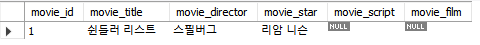

이유 두가지

- 최대 패킷 크기(=최대 파일 크기)가 충분하지 않다.

```sql
SHOW variables LIKE 'max_allowed_packet';
```

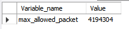

최대 파일 크기 추가 방법

- 파일을 업로드/다운로드할 폴더 경로를 별도로 허용해줘야 한다.
  - 시스템 변수인 secure_file_priv값을 조회하고, 이 경로도 수정해야 한다.

```sql
SHOW variables LIKE 'secure_file_priv';
```

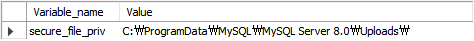

Workbench를 종료하고 명령 프롬프트를 관리자 모드로 연다.

- 다음 명령어로 my.ini 파일 확인
  - CD %PROGRAMDATA%
  - CD MySQL
  - CD "MySQL Server 8.0"
  - DIR

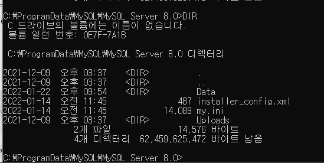

- NOTEPAD my.ini 명령으로 파일 열고 Ctrl+F를 눌러서 max_all검색
  - max_allowed_packet 값을 1G(1024M)로 변경하고 저장한다.

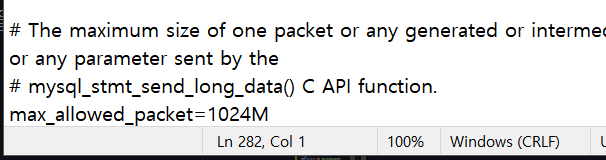

- NOTEPAD my.ini 명령으로 파일 열고 Ctrl+F를 눌러서 secure-file검색
  - secure-file-priv='파일경로' 추가

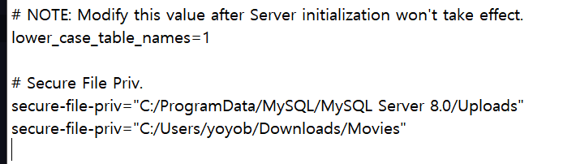

변경한 것들이 MySQL 서버의 설정을 변경하는 것이므로 MySQL 서비스를 재시작 해야한다.

- 서비스를 열어서 MYSQL을 찾아서 우클릭한 후에 재시작해준다.

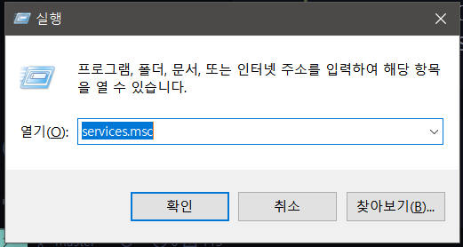

이제 다시 실습을 시도해보자.

- 기존의 데이터를 모두 지우고 다시 SQL을 입력한다.
- 이번에는 다른 파일들도 입력한다.
  - 텍스트 파일의 인코딩을 변경하는 것을 잊지말자.

```sql
USE moviedb;
TRUNCATE movietbl;
INSERT INTO movietbl VALUES (1, '쉰들러 리스트', '스필버그', '리암 니슨',
 LOAD_FILE('C:/SQL/Movies/0001.txt'),
    LOAD_FILE('C:/SQL/Movies/0001.mp4')
    );
INSERT INTO movietbl VALUES (2, '쇼생크 탈출', '프랭크 다라본트', '팀 로빈스',
LOAD_FILE('C:/SQL/Movies/0002.txt'),
LOAD_FILE('C:/SQL/Movies/0002.mp4')
);
INSERT INTO movietbl VALUES (3, '라스트 모히칸', '마이클 만', '다니엘 데이 루이스',
LOAD_FILE('C:/SQL/Movies/0003.txt'),
LOAD_FILE('C:/SQL/Movies/0003.mp4')
);

SELECT * FROM movietbl;
```

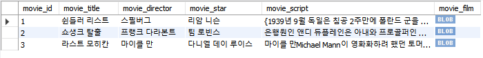

- 영화 동영상(movie_film)의 경우에는 보일 수 없으므로 BLOB으로 나온다.

입력된 데이터를 파일로 내려받기

- LONGTEXT 형식인 영화 대본(movie_script)은 INTO OUTFILE문을 사용하면 텍스트 파일로 내려받을 수 있다.

```sql
SELECT movie_script FROM movietbl WHERE movie_id=1
  INTO OUTFILE 'C:/SQL/Movies/0001_out.txt'
  LINES TERMINATED BY '\\n';
```

>LINES TERMINATED BY '\\n'은 줄 바꿈 문자도 그대로 저장하기 위한 옵션이다.

- 새로운 0001_out.txt가 생긴 것을 확인할 수 있다.

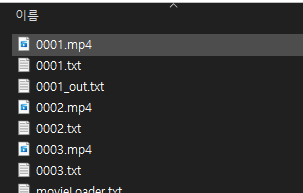

LONGBLOB 형식인 영화 동영상(movie_film)은 INTO DUMPFILE문을 사용하면 바이너리 파일로 내려받을 수 있다.

```sql
SELECT movie_film FROM movietbl WHERE movie_id=3
  INTO DUMPFILE 'C:/SQL/Movies/0003_out.mp4';
```


# 피벗(pivot)의 구현

피벗

- 한 열에 포함된 여러 값을 출력
  - 이를 여러 열로 변환하여 테이블 반환 식을 회전한다.
  - 필요하면 집계까지 수행

```sql
USE sqldb;
CREATE TABLE pivotTest
(
  uName CHAR(3),
  season CHAR(2),
  amount INT
);
```

```sql
INSERT INTO pivotTest VALUES
('김범수', '겨울', 10), ('윤종신', '여름', 15), ('김범수', '가을', 25), ('김범수', '봄', 3), ('김범수', '봄', 37), ('운종신', '겨울', 40), ('김범수', '여름', 14), ('김범수', '겨울', 22), ('윤종신', '여름', 64);

SELECT * FROM pivotTest;
```

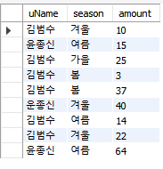

SUM()과 IF() 함수, 그리고 GROUP BY를 활용

```SQL
SELECT uName,
  SUM(IF(season='봄', amount, 0)) AS '봄',
  SUM(IF(season='여름', amount, 0)) AS '여름',
  SUM(IF(season='가을', amount, 0)) AS '가을',
  SUM(IF(season='겨울', amount, 0)) AS '겨울',
  SUM(amount) AS '합계' FROM pivotTest GROUP BY uName;
```

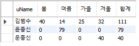

```SQL
SELECT season,
  SUM(IF(uName='김범수', amount, 0)) AS '김범수',
  SUM(IF(uName='윤종신', amount, 0)) AS '윤종신',
  SUM(amount) AS '합계' FROM pivotTest GROUP BY season;
```

# JSON 데이터

JSON(JavaScript Object Notation)

- 현대의 웹과 모바일 응용 프로그램 등과 데이터를 교환하기 위한 개방형 표준 포맷
- 속성(key)과 값(value)으로 쌍을 이루며 구성되어 있다.

```sql
USE sqldb;
SELECT JSON_OBJECT('name', name, 'height', height) AS 'JSON 값'
  FROM usertbl
  WHERE height >= 180;
```

- MySQL 테이블을 JSON 데이터로 변환할 때는 JSON_OBJECT()나 JSON_ARRAY() 함수를 이용
