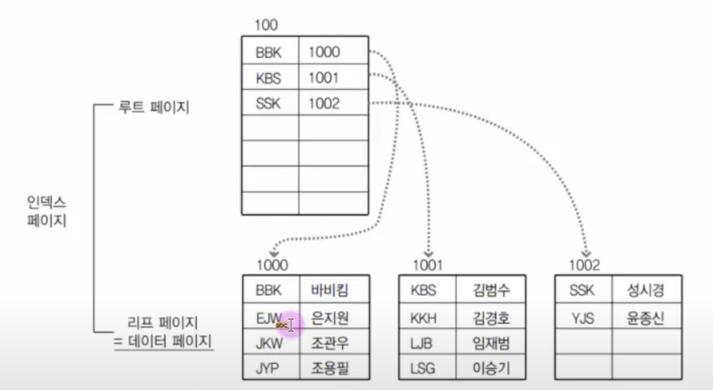
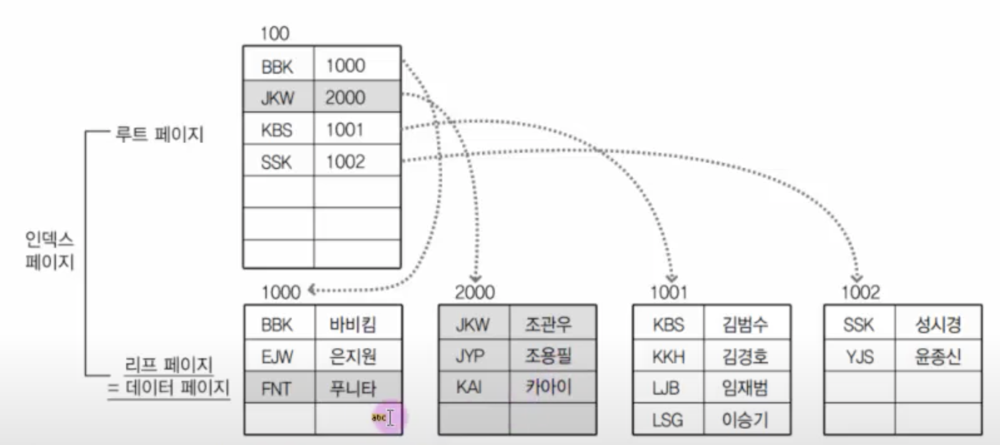
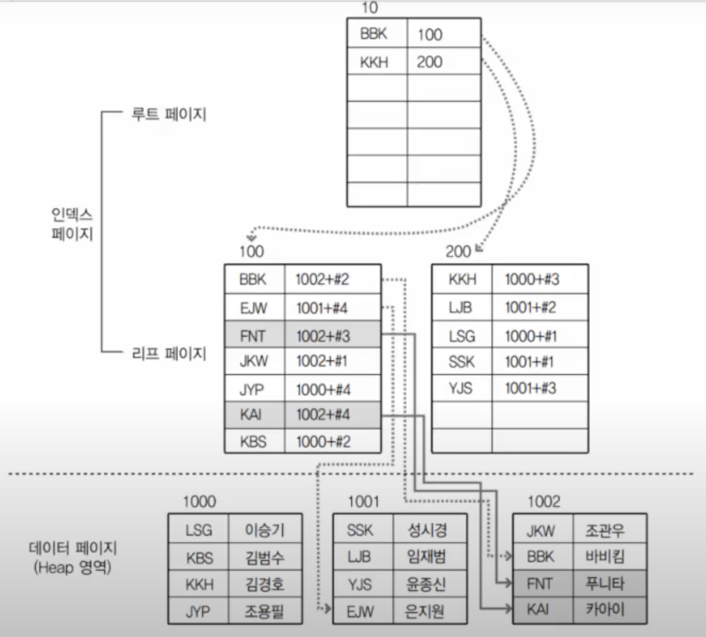

- [인덱스의 개념](#인덱스의-개념)
- [인덱스의 종류와 자동 생성](#인덱스의-종류와-자동-생성)
  - [인덱스의 종류](#인덱스의-종류)
  - [자동으로 생성되는 인덱스](#자동으로-생성되는-인덱스)
- [인덱스의 내부 작동](#인덱스의-내부-작동)
  - [B-REE(Balanced Tree, 균형 트리)](#b-reebalanced-tree-균형-트리)
  - [페이지 분할](#페이지-분할)
  - [클러스터형 인덱스와 보조 인덱스의 구조](#클러스터형-인덱스와-보조-인덱스의-구조)
  - [클러스터형 인덱스와 보조 인덱스가 혼합되어 있을 경우](#클러스터형-인덱스와-보조-인덱스가-혼합되어-있을-경우)
- [인덱스 생성/변경/삭제](#인덱스-생성변경삭제)
  - [인덱스 생성](#인덱스-생성)
  - [인덱스 제거](#인덱스-제거)
- [인덱스의 성능 비교](#인덱스의-성능-비교)
- [인덱스를 생성해야하는 경우와 그렇지 않은 경우](#인덱스를-생성해야하는-경우와-그렇지-않은-경우)

---

# 인덱스의 개념

데이터를 좀 더 빠르게 찾을 수 있도록 해주는 도구

- 튜닝(tuning)에 즉각적인 효과
  - 인덱스를 생성하고 사용하는 SQL을 만들어 사용하면 기존보다 빠르다.
  - 전체적인 성능 향상

---

# 인덱스의 종류와 자동 생성

## 인덱스의 종류

- 클러스터형 인덱스(clustered index)
  - 영어 사전
    - 사전처럼 책의 내용 자체가 순서대로 정렬
  - 테이블을 한 개만 생성 가능
  - 행 데이터를 자신의 열을 기준으로 정렬한다.(오름차순)
  - 보조 인덱스보다 검색 속도가 더 빠르다.

- 보조 인덱스(secondary index)
  - <찾아보기>가 있는 일반 책
    - 해당 페이지로 가야 내용이 있다.
  - 여러 테이블 생성 가능

## 자동으로 생성되는 인덱스

인덱스는 테이블의 열(컬럼) 단위에 생성된다.

- 예를 들어, 테이블에 8개의 열이 있다면 8개 인덱스를 생성할 수 있다.

```sql
CREATE TABLE usertbl
(
    userID char(8) NOT NULL PRIMARY KEY,
    name varchar(10) NOT NULL,
    birthYear int NOT NULL,
    ...
)
```

- 이렇게 PRIMARY KEY로 지정하면 자동으로 userID열에 클러스터형 인덱스가 생성된다.
  - '클러스터형 인덱스'와 'Primary key 인덱스'는 거의 동일한 용어
  - 한 테이블에 하나만 생성 가능
- 테이블 생성 시에 제약 조건 Primary Key 또는 Unique를 사용하면 자동으로 인덱스가 생성된다.

클러스터형 인덱스 생성

```sql
CREATE TABLE tbl1
(
    a INT PRIMARY KEY,
    b INT,
    c INT
)
```

보조 인덱스 생성

```sql
CREATE TABLE tbl2
(
    a INT PRIMARY KEY,
    b INT UNIQUE,
    c INT UNIQUE,
    d INT
)
```

보조 인덱스를 클러스터형 인덱스로 변경

- UNIQUE에 NOT NULL을 추가하면 된다.

```sql
CREATE TABLE tbl3
(
    a INT UNIQUE NOT NULL, -- 보조 인덱스 -> 클러스터형 인덱스
    b INT UNIQUE,
    c INT UNIQUE,
    d INT
)
```

보조 인덱스에 NOT NULL을 추가해도 PRIMARY KEY가 있는 열이 클러스터형 인덱스가 된다.

```sql
CREATE TABLE tbl4
(
    a INT UNIQUE NOT NULL, -- 클러스터형 인덱스 -> 보조 인덱스
    b INT UNIQUE,
    c INT UNIQUE,
    d INT PRIMARY KEY -- 클러스터형 인덱스
)
```

---

# 인덱스의 내부 작동

## B-REE(Balanced Tree, 균형 트리)

주로 인덱스를 표현할 때 사용한다.

- 데이터 검색에 높은 성능

노드(Node)

- 트리 구조에서 데이터가 존재하는 공간
- 루트 노드
  - 가장 상위 노드
- 리드 노드
  - 제일 마지막에 존재하는 노드
- 중간 수준 노드
  - 루트 노드와 리드 노드 중간에 끼인 노드들
- 페이지(page) = 노드
  - 16Kbyte 크기의 최소한의 저장 단위
  - 작은 데이터 하나라도 한 페이지를 차지하게 된다.
- 인덱스를 구현할 때 기본적으로 B-Tree 구조를 사용

## 페이지 분할

인덱스를 구성하면 SELECT의 속도가 급격히 향상된다.

하지만 인덱스를 구성하면 데이터의 변경 작업(INSERT, UPDATE, DELETE) 시에 성능이 나빠진다.

- 페이지 분할 때문
  - 데이터를 계속 입력해서 루트 페이지와 리프 페이지의 용량이 부족한 경우가 생긴다.
    - 이럴 경우에 새로운 페이지를 만들어낸다.(페이지 분할)
    - 페이지가 계속 분할되면서 늘어나면 작업 속도가 느려진다.

>MySQL의 페이지 크기 확인<br/>
>SHOW VARIABLES LIKE 'innodb_page_size'

## 클러스터형 인덱스와 보조 인덱스의 구조

클러스터형 인덱스

- 클러스터형 인덱스를 구성하기 위해서 행 데이터를 해당 열로 정렬한 후에 루트 페이지를 만든다.
- 루트 페이지와 인덱스 페이지로 인덱스가 구성
  - 리프 페이지 = 데이터 페이지



- 클러스터 인덱스에 새로운 데이터 입력
  - 리프 페이지가 페이지 분할이 일어난다.
  - 루트 페이지 순서가 약간 변경



보조 인덱스

- 데이터 페이지를 건드리지 않고, 별도의 장소에 인덱스 페이지를 생성한다.
- 인덱스 페이지의 리프 페이지에 인덱스로 구성한 열을 정렬한다.
- 데이터 위치 포인터 생성
  - 주소값(페이지 번호 + #오프셋)이 기록되어 바로 데이터의 위치를 가리킨다.
  - 데이터가 위치한 고유한 값



- 보조 인덱스에 새로운 데이터 입력
  - 보조 인덱스는 데이터 페이지를 정렬하지 않는다.
  - 테이터 페이지 뒤쪽 빈 부분에 삽입
  - 리프 페이지에도 약간의 위치 조정
  - 페이지 분할은 일어나지 않는다.
  - 클러스터 인덱스보다 데이터 입력에서는 성능에 주는 부하가 더 적었다.

보통 검색 속도는 클러스터형 인덱스가 보조 인덱스보다 빠르다.

- 클러스터형 인덱스는 루트 페이지와 리프 페이지 2개만 읽는다.
  - 보조 인덱스는 루트, 리프 페이지, 데이터 페이지를 읽어 총 3개를 읽는다.

|      인덱스       | 특징                                                                                                                                                                                                                                                                                                                                                                |
| :---------------: | :------------------------------------------------------------------------------------------------------------------------------------------------------------------------------------------------------------------------------------------------------------------------------------------------------------------------------------------------------------------ |
| 클러스터형 인덱스 | 클러스터형 인덱스의 생성 시에는 데이터 페이지 전체가 다시 정렬된다.<br/>인덱스 자체의 리프 페이지가 곧 데이터이므로, 인덱스 자체에 데이터가 포함되어 있다고 볼 수 있다.<br/>보조 인덱스보다 검색속도는 빠르지만, 데이터의 입력/수정/삭제는 느리다.<br/>테이블에 한 개만 생성할 수 있고, 어느 열에 클러스터형 인덱스를 생성하는지에 따라서 시스템의 성능이 달라진다. |
|    보조 인덱스    | 보조 인덱스의 생성 시에는 별도의 페이지에 인덱스를 구성한다.<br/>인덱스 자체의 리프 페이지는 데이터가 아니라 테이터가 위치하는 주소값(RID)이다.<br/>클러스터형보다 검색 속도는 느리지만, 데이터의 입력/수정/삭제는 빠르다.<br/>보조 인덱스는 여러 개 생성 가능하지만, 남용할 경우에는 오히려 시스템의 성능을 저하시킨다.                                            |

## 클러스터형 인덱스와 보조 인덱스가 혼합되어 있을 경우

독립되어 있는 것보다 혼합되어 있는 경우가 더 많다.

- 클러스터형 인덱스를 생성하고, 보조 인덱스를 생성할 경우
  - 보조 인덱스의 루트 페이지와 리프 페이지의 키 값이 이름으로 구성되어 있다면 일단 이름으로 정렬된다.
  - 보조 인덱스의 리프 페이지
    - 원래는 '데이터 페이지의 주소값'으로 구성되어 있다.
      - 혼합 상태에서는 클러스터형 인덱스의 키 값을 가지게 된다.
  - 만약 보조 인덱스에서 검색을 한다면, 어차피 모두 다시 클러스터형 인덱스의 루트 페이지부터 검색한다.

보조 인덱스와 혼합되어 사용되는 경우에는 되도록이면 클러스터형 인덱스로 설정할 열은 적은 자릿수의 열을 선택하는 것이 바람직하다.

인덱스를 검색하기 위한 일차 조건은 WHERE절에 해당 인덱스를 생성한 열의 이름이 나와야 한다.

---

# 인덱스 생성/변경/삭제

## 인덱스 생성

CREATE INDEX로 생성되는 인덱스는 보조 인덱스이다.

- UNIQUE로 지정된 인덱스는 동일한 데이터 값이 입력될 수 없다.
  - 데이터 중복 불가
- UNIQUE로 지정되지 않았다면, '단순' 보조 인덱스
  - 중복을 허용한다는 의미
- 데이터의 '종류'가 적은 열에는 인덱스를 생성하지 않는 것이 좋다.

```SQL
CREATE INDEX 인덱스이름 ON 테이블이름;
```

```sql
ALTER TABLE 테이블이름 ADD INDEX(열 이름);
ALTER TABLE 테이블이름 ADD PRIMARY KEY(열 이름);
```

- 생성한 인덱스를 실제 적용 시키려면 먼저 테이블을 분석/처리해줘야 한다.

```sql
ANALYZE TABLE 테이블이름;
SHOW TABLE STATUS LIKE '테이블이름';
```

## 인덱스 제거

```SQL
DROP INDEX 인덱스이름 ON 테이블이름(열 이름);
```

```SQL
ALTER TABLE 테이블이름 DROP INDEX 인덱스이름;

프라이머리 키는 ALTER TABLE 문으로만 삭제할 수 있다.
ALTER TABLE PRIMARY KEY;
```

- 기본 키로 설정된 클러스터형 인덱스의 이름은 항상 PRIMARY로 되어 있다.
  - 인덱스 부분에 PRIMARY 써주면 된다.
- ALTER TABLE문으로 기본 키를 제거해도 클러스터형 인덱스가 제거된다.
- 인덱스를 제거할 때는 되도록 보조 인덱스부터 제거
  - 클러스터형을 먼저 삭제하면, 클러스터형의 루트 페이지가 없어진다.
  - 그리고 보조 인덱스는 가리키던 클러스터형 인덱스가 없어졌으니 원래의 리프페이지에 데이터 페이지에 대한 '페이지 번호 + #오프셋'으로 재구성해야 한다.
    - 만약 이 작업을 다 한 다음에 삭제를 하면 쓸모 없는 작업을 한 것
  - 하지만 보조 인덱스를 먼저 제거한다면, 추가적인 작업이 필요없다. 클러스터형 인덱스는 위에 있는 보조 인덱스가 없어졌으니 원래의 루트 페이지 상태로 돌아오면 되기 때문이다.
- 인덱스의 활용도가 떨어진다면 과감하게 삭제

PRIMARY KEY를 제거하는데 외래 키 관계 때문에 오류가 날 수 있다.

- 이럴 때는 외래 키 제약 조건의 이름을 알아내고,

```SQL
SELECT table_name, constraint_name
  FROM information_schema.referential_constraints
  WHERE constraint_schema = 'sqldb';
```

- 확인된 외래 키(constraint_name)를 먼저 제거하고, 기본 키를 제거한다.

```SQL
ALTER TABLE 외래키테이블 DROP FOREIGN KEY constraint_name;
ALTER TABLE 프라이머리키테이블 DROP PRIMARY KEY;
```

---

# 인덱스의 성능 비교

인덱스 힌트(HINT)

```SQL
USE INDEX(인덱스이름)
인덱스를 강제로 사용

IGNORE INDEX(인덱스이름)
인덱스를 강제로 사용하지 못하게 함
```

- 전체 데이터를 조회하는 것은 인덱스를 쓰나 안쓰나 성능이 비슷하다.
  - 하지만 너무 큰 데이터를 읽어와야 할때는 MySQL이 알아서 인덱스를 쓰지 않고 그냥 처음부터 데이터를 찾아 읽는다.
    - 모든 페이지를 찾기 위해 인덱스의 루트 페이지와 리프 페이지를 와리가리 하는것이 더 많은 작업이 요구되기 때문이다.
    - 기존에 생성한 보조 인덱스 중에서 전체 데이터의 약 15%이상을 스캔하는 경우 MySQL은 인덱스를 사용하지 않고 테이블을 검색한다.
      - 인덱스가 있어도 사용하지 않음
  - 적정량의 데이터라면 MySQL이 알아서 인덱스를 사용한다.
- 만약 응용 프로그램이 주로 전체 데이터의 15% 이상의 범위의 데이터를 검색하는 경우에는 차라리 인덱스를 만들지 않는 것이 시스템 성능에 도움이 된다.

데이터의 중복도

- Cardinality(원소 개수)가 낮을 수록 데이터의 중복도가 높다.
- 데이터의 종류가 얼마나 분포되어 있는가를 말한다.
- Cardinality가 높은 데이터는 데이터의 종류가 상당히 넓게 분포되어 있는 것이다.
- PRIMARY KEY나 UNIQUE는 데이터가 중복되지 않아서 Cardinality가 높게 나올 수밖에 없다.

---

# 인덱스를 생성해야하는 경우와 그렇지 않은 경우

- 인덱스는 열 단위에 생성된다.
- WHERE절에서 사용되는 열에 인덱스를 만들어야 한다.
- WHERE절에 사용되더라도 자주 사용해야 가치가 있다.
  - 만약 자주 사용되지도 않는데 클러스터형 인덱스라면 인덱스에서 데이터가 입력되는 과정에서 페이지 분할이 지속적으로 일어나 대용량의 데이터일 경우에 시스템 성능 저하를 일으킬 수 있다.
    - 보조 인덱스도 데이터 페이지 분할이 종종일어나므로 주의해야 한다.
- 데이터 중복도가 높은 열은 인덱스를 만들어도 별 효과가 없다.
  - 거의 같은 데이터가 있는 열은 보조 인덱스를 만들어도 MySQL이 사용하지 않거나 사용해도 별로 효과가 없다.
  - 중복도가 높은 열은 인덱스 생성에 신중해야 한다.
- 외래 키를 지정한 열에는 자동으로 외래 키 인덱스가 생성된다.
- JOIN에 자주 사용되는 열에는 인덱스를 생성해주는 것이 좋다.
- INSERT/UPDATE/DELETE가 얼마나 자주 일어나는지 고려해야 한다.
  - 인덱스는 단지 읽기에서만 성능을 향상시키고, 데이터의 변경에서는 오히려 부담을 준다.
- 클러스터형 인덱스는 테이블당 하나만 생성할 수 있다.
  - 클러스터형 인덱스를 생성한 열은 범위(BETWEEN, <, > 등의 조건)로 사용하거나 집계 함수를 사용하는 경우에는 아주 적절하다.
  - 클러스터형 인덱스는 데이터 페이지를 읽는 수가 최소화 되어서 성능이 아주 우수
    - 가장 많이 사용되는 열에 생성하는 것이 바람직하다.
  - ORDER BY절에 자주 나오는 열도 클러스터형 인덱스가 유리
    - 이미 데이터 페이지가 정렬되어있기 때문
- 대용량의 데이터가 계속 입력되는 시스템이라면, 클러스터형 인덱스는 좋지 않다.
  - PRIMARY KEY 보다는 UNIQUE를 사용하자.
  - UNIQUE 키에 NOT NULL을 함께 지정하면 클러스터형 인덱스가 생성된다.
- 사용하지 않는 인덱스는 제거하자.
- 주기적인 OPTIMIZE TABLE 구문이나 ANALYZE TABLE 구문으로 인덱스를 재구성해서 조각화를 최소화해야만 시스템의 성능을 최상으로 유지시킬 수 있다.
