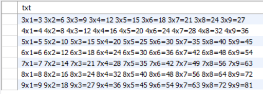
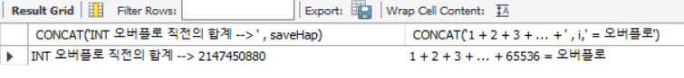
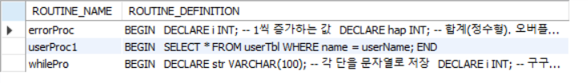
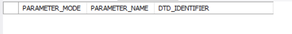
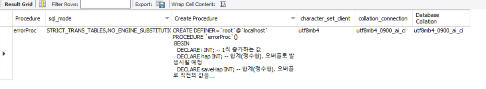

- [스토어드 프로시저(Stored Procedure)](#스토어드-프로시저stored-procedure)
  - [스토어드 프로시저의 개요](#스토어드-프로시저의-개요)
    - [스토어드 프로시저의 수정과 삭제](#스토어드-프로시저의-수정과-삭제)
    - [매개변수의 사용](#매개변수의-사용)
    - [스토어드 프로시저 내의 오류 처리](#스토어드-프로시저-내의-오류-처리)
    - [실습](#실습)
  - [스토어드 프로시저의 특징](#스토어드-프로시저의-특징)
- [스토어드 함수](#스토어드-함수)
  - [스토어드 함수의 개요](#스토어드-함수의-개요)
    - [스토어드 함수 실습](#스토어드-함수-실습)
- [커서(Cursor)](#커서cursor)
  - [커서의 개요](#커서의-개요)
  - [커서의 처리 순서](#커서의-처리-순서)
- [트리거](#트리거)
  - [트리거의 개요](#트리거의-개요)
  - [트리거의 종류](#트리거의-종류)
    - [AFTER 트리거](#after-트리거)
    - [BEFORE 트리거](#before-트리거)
  - [트리거의 사용](#트리거의-사용)
    - [AFTER 트리거의 사용](#after-트리거의-사용)
    - [트리거가 생성하는 임시 테이블](#트리거가-생성하는-임시-테이블)
    - [BEFORE 트리거의 사용](#before-트리거의-사용)
  - [기타 트리거에 관한 내용](#기타-트리거에-관한-내용)
    - [다중 트리거(Multiple Triggers)](#다중-트리거multiple-triggers)
    - [중첩 트리거(Nested Triggers)](#중첩-트리거nested-triggers)
    - [트리거의 작동 순서](#트리거의-작동-순서)

# 스토어드 프로시저(Stored Procedure)

MySQL에서 제공되는 프로그래밍 기능

## 스토어드 프로시저의 개요

쿼리문의 집합으로 어떠한 동작을 일괄 처리하기 위한 용도로 사용

형식

```SQL
DELIMITER $$
CREATE PROCEDURE 스토어드 프로시저이름(IN 또는 OUT 파라미터)
BEGIN
    ...SQL 프로그래밍 코딩...
END $$
DELIMITER ;

CALL 스토어드 프로시저이름();
```

### 스토어드 프로시저의 수정과 삭제

ALTER PROCEDURE

- 수정

DROP PROCEDURE

- 삭제

### 매개변수의 사용

입력 매개변수를 지정할 수 있다.

- 스토어드 프로시저 내부에서 다양한 용도로 사용

```SQL
IN 입력_매개변수_이름 데이터_형식
```

입력 매개 변수가 있는 스토어드 프로시저 실행

```SQL
CALL 프로시저_이름(전달 값);
```

출력 매개변수

- 스토어드 프로시저에서 처리된 결과를 출력 매개 변수를 통해서 얻을 수 있다.

```SQL
OUT 출력_매개변수_이름 데이터_형식
```

출력 매개 변수에 값을 대입하기 위해서는 주로 SELECT ... INTO문을 사용한다.

출력 매개 변수가 있는 스토어드 프로시저 실행

```SQL
CALL 프로시저_이름(@변수명)
SELECT @변수명
```

### 스토어드 프로시저 내의 오류 처리

```SQL
DECLARE 액션 HANDLER FOR 오류조건 처리할_문장
```

### 실습

```SQL
USE slqDB;
DROP PROCEDURE IF EXISTS userProc1;
DELIMITER $$
CREATE PROCEDURE userProc1(IN userName VARCHAR(10)) -- 입력 매개 변수 1개 선언
BEGIN
  SELECT * FROM userTbl WHERE name = userName;
END $$
DELIMITER ;

CALL userProc('조관우'); -- 입력 매개 변수 1개
```

2개의 입력 매개 변수가 있는 스토어드 프로시저

```sql
DROP PROCEDURE IF EXISTS userProc2;
DELIMITER $$
CREATE PROCEDURE userProc2( -- 입력 매개 변수 2개 선언
  IN userBirth INT,
  IN userHeight INT
)
BEGIN
  SELECT * FROM userTbl
    WHERE birthyear > userBirth AND height > userHeight;
END $$
DELIMITER ;

CALL userProc2(1970, 178); -- 입력 매개 변수 2개
```

출력 매개 변수가 있는 스토어드 프로시저

```sql
DROP PROCEDURE IF EXISTS userProc3;
DELIMITER $$
CREATE PROCEDURE userProc3(
  IN txtValue CHAR(10),
  OUT outValue INT
)
BEGIN
  INSERT INTO testTbl VALUES(NULL, txtValue);
  SELECT MAX(id) INTO outValue FROM testTbl; -- 출력 매개 변수를 대입하기 위한 SELECT ... INTO 구문
                                            -- PROCEDURE 생성 시점에 테이블이 없어도 되지만, 호출할 때는 있어야 한다.
END $$
DELIMITER ;

CREATE TABLE IF NOT EXISTS testTbl(
  id INT AUTO_INCREMENT PRIMARY KEY,
  txt CHAR(10)
);

CALL userProc3('테스트값', @myValue);
SELECT CONCAT('현재 입력된 ID 값 ==>', @myValue);
```

구구단 만들기

```sql
DROP TABLE IF EXISTS guguTbl;
CREATE TABLE guguTBL (txt VARCHAR(100)) -- 구구단 저장용 테이블

DROP PROCEDURE IF EXISTS whileProc;
DELIMITER $$
CREATE PROCEDURE whilePro()
BEGIN
  DECLARE str VARCHAR(100); -- 각 단을 문자열로 저장
  DECLARE i INT; -- 구구단 앞자리
  DECLARE K INT; -- 구구단 뒷자리
  SET i = 2; -- 2단부터 시작

  WHILE(i < 10) DO
    SET str = '';
    SET k = 1;
    WHILE(k < 10) DO
      SET str = CONCAT(str,' ', i, 'x', k, '=', i*k);
      SET k = k + 1;
    END WHILE;
    SET i = i + 1;
    INSERT INTO guguTBL VALUES(str);
  END WHILE;
END $$
DELIMITER ;

CALL whileProc();
SELECT * FROM guguTBL;
```



DECLARE ~~ HANDLER를 이용한 오류 처리

```SQL
DROP PROCEDURE IF EXISTS errorProc;
DELIMITER $$
CREATE PROCEDURE errorProc();
BEGIN
  DECLARE i INT; -- 1씩 증가하는 값
  DECLARE hap INT; -- 합계(정수형). 오버플로 발생시킬 예정
  DECLARE saveHap INT; -- 합계(정수형). 오버플로 직전의 값을 저장

  DECLARE EXIT HANDLER FOR 1264 -- INT형 오버플로가 발생하면 이 부분이 수행된다.
  BEGIN
    SELECT CONCAT('INT 오버플로 직전의 합계 --> ', saveHap), CONCAT('1 + 2 + 3 + ... + ', i,' = 오버플로');
  END;

  SET i = 1; -- 1부터 증가
  SET hap = 0; -- 합계를 누적

  WHILE (TRUE) DO -- 무한 루프
    SET saveHap = hap; -- 오버플로 직전의 합계를 저장
    SET hap = hap + i; -- 오버플로가 나면 오류 처리 구문을 실행
    SET i = i + 1;
  END WHILE;
END $$
DELIMITER ;

CALL errorProc();
```



INFORMATION_SCHEMA 데이터베이스의 ROUTINES 테이블을 조회하면 내용을 확인할 수 있다.

```SQL
SELECT routine_name, routine_definition FROM INFORMATION_SCHEMA.ROUTINES
  WHERE routine_schema = 'sqldb' AND routine_type = 'PROCEDURE';
```



- 파라미터의 내용은 보이지 않는다.

파라미터의 내용 확인

```SQL
SELECT parameter_mode, parameter_name, dtd_identifier
  FROM INFORMATION_SCHEMA.PARAMETERS
  WHERE specific_name = 'errorProc';
```



- 위의 프로그램은 파라미터가 없으므로 아무것도 나오지 않았다.

프로시저의 내용을 확인

```SQL
SHOW CREATE PROCEDURE sqldb.errorProc;
```



테이블이름을 파라미터로 전달하는 방법

```sql
DROP PROCEDURE IF EXISTS nameProc;
DELIMITER $$
CREATE PROCEDURE nameProc(
  IN tblName VARCHAR(20)
)
BEGIN
  SELECT * FROM tblName;
END $$
DELIMITER ;

CALL nameProc('userTBL')
```


- 'sqldb.tblname'이라는 테이블을 알 수 없다는 오류 발생
  - MySQL에서는 직접 테이블 이름을 파라미터로 사용할 수 없다.

동적 SQL을 활용해보자

```sql
DROP PROCEDURE IF EXISTS nameProc;
DELIMITER $$
CREATE PROCEDURE nameProc(
  IN tblName VARCHAR(20)
)
BEGIN
  SET @sqlQuery = CONCAT('SELECT * FROM ', tblName);
  PREPARE myQuery FROM @sqlQuery;
  EXECUTE myQuery;
  DEALLOCATE PREPARE myQuery;
END $$
DELIMITER ;

CALL nameProc('userTBL');
```

- 넘겨받은 테이블 이름을 @sqlQuery 변수에 SELECT문으로 문자열을 생성해 놓았다.
  - 그 다음에 SELECT 문자열을 준비하고 실행
- 결과가 잘 나올 것이다.

스토어드 프로시저의 삭제

```sql
DROP PROCEDURE 프로시저이름
```

- 프로시저의 내용은 ALTER PROCEDURE나 ALTER FUNCTION으로 바꿀 수 없다.
- DROP 시킨 후에 다시 CREATE 해야한다.

## 스토어드 프로시저의 특징

- MySQL의 성능을 향상시킬 수 있다.
- 유지관리가 간편하다.
- 모듈식 프로그래밍이 가능하다.
- 보안을 강화할 수 있다.
  - 사용자 별로 테이블에 접근 권한을 주지 않고, 스토어드 프로시저에만 접근 권한을 줌으로써 보안을 강화할 수 있다.

---

# 스토어드 함수

## 스토어드 함수의 개요

형식

```sql
DELIMITER $$
CREATE FUNCTION 스토어드_함수이름(파라미터)
  RETURNS 반환형식
BEGIN
  ...프로그래밍 코딩...
  RETURN 반환값;
END $$
DELIMITER ;

SELECT 스토어드_함수이름();
```

스토어드 함수는 스토어드 프로시저와 매우 비슷하지만 차이점이 있다.

- 스토어드 함수의 파라미터는 모두 입력 파라미터이다.
- 스토어드 함수는 RETURNS문으로 반환할 값의 데이터 형식을 지정하고, 본문 안에서는 RETURN문으로 하나의 값을 반환한다.
- 스토어드 프로시저는 CALL로 호출하지만, 스토어드 함수는 SELECT로 호출한다.
- 스토어드 프로시저 안에는 SELECT문을 사용할 수 있지만, 스토어드 함수 안에서는 집합 결과를 반환하는 SELECT문을 사용할 수 없다.
  - SELECT ... INTO는 집합결과를 반환하는 것이 아니므로 스토어드 함수 안에서 쓰일 수 있다.

스토어드 함수를 사용하려면 스토어드 함수 생성 권한을 허용해야 한다.

```SQL
SET GLOBAL log_bin_trust_function_creators = 1;
```

```sql
USE sqlDB;
DROP FUNCTION IF EXISTS userFunc;
DELIMITER $$
CREATE FUNCTION userFunc(value1 INT, value2 INT)
  RETURNS INT
BEGIN
  RETURN value1 + value2;
END $$
DELIMITER ;

SELECT userFunc(100, 200);
```

### 스토어드 함수 실습

```sql
USE sqlDB;
DROP FUNCTION IF EXISTS getAgeFunc;
DELIMITER $$
CREATE FUNCTION getAgeFunc(bYear INT)
  RETURNS INT
BEGIN
  DECLARE age INT;
  SET age = YEAR(CURDATE()) - bYear;
  RETURN age;
END $$
DELIMITER ;

SELECT getAgeFunc(1979) INTO @age1979;
SELECT getAgeFunc(1997) INTO @age1997;
SELECT CONCAT('1997년과 1979년의 나이차 ==> ', (@age1979 - @age1997));
```

현재 저장된 스토어드 함수의 이름 및 내용 확인

```sql
SHOW CREATE FUNCTION getAgeFunc;
```

스토어드 함수 삭제

```sql
DROP FUNCTION getAgeFunc;
```

# 커서(Cursor)

## 커서의 개요

커서는 테이블에서 여러 개의 행을 쿼리한 후에, 쿼리의 결과인 행 집합을 한 행씩 처리하기 위한 방식이다.

## 커서의 처리 순서

- 커서의 선언

  ```SQL
  DECLARE CURSOR
  ```

- 반복 조건 선언

  ```SQL
  DECLARE CONTINUE HANDLER
  ```

  - 더 이상 읽을 행이 없을 경우에 실행할 내용을 설정
- `LOOP ~ END LOOP`문으로 반복 구간 지정
  - 커서 열기

    ```SQL
    OPEN
    ```

  - 커서에서 데이터 가져오기

    ```SQL
    FETCH
    ```

- 데이터 처리
- 커서 닫기

  ```SQL
  CLOSE
  ```

```sql
USE sqlDB;
DROP PROCEDURE IF EXISTS cursorProc;
DELIMITER $$
CREATE PROCEDURE cursorProc()
BEGIN
  DECLARE userHeight INT;
  DECLARE cnt INT DEFAULT 0; -- 고객 인원수(= 읽은 행의 수)
  DECLARE totalHeight INT DEFAULT 0; -- 키의 합계

  DECLARE endOfRow BOOLEAN DEFAULT FALSE; -- 행의 끝 여부(기본을 FALSE)

  DECLARE userCursor CURSOR FOR -- 커서 선언
    SELECT height FROM userTbl;
  
  DECLARE CONTINUE HANDLER -- 행의 끝이면 endOfRow 변수에 TRUE를 대입
    FOR NOT FOUND SET endOfRow = TRUE;
  
  OPEN userCursor; -- 커서 열기

  cursor_loop: Loop
    FETCH userCursor INTO userHeight; -- 고객 키 1개를 대입

    IF endOfRow THEN -- 더이상 읽을 행이 없으면 Loop를 종료
      LEAVE cursor_loop;
    END IF;

    SET cnt = cnt + 1;
    SET totalHeight = totalHeight + userHeight;
  END LOOP cursor_loop;

  -- 고객 키의 평균을 출력한다.
  SELECT CONCAT('고객 키의 평균 ==> ', (totalHeight/cnt));
  CLOSE userCursor; -- 커서 닫기
END $$
DELIMITER ;
```

# 트리거

테이블에 무슨 일이 일어나면 자동으로 실행된다.

- 테이블에 삽입, 수정, 삭제 등의 작업(이벤트)이 발생 시에 자동으로 작동되는 개체

## 트리거의 개요

- MySQL은 View에 트리거를 부착할 수 없다.
- 직접 실행할 수는 없다.

```sql
CREATE DATABASE IF NOT EXISTS testDB;
USE testDB;
CREATE TABLE IF NOT EXISTS testTbl (id INT, txt VARCHAR(10));
INSERT INTO testTbl VALUES(1, '레드벨벳');
INSERT INTO testTbl VALUES(2, '잇지');
INSERT INTO testTbl VALUES(3,) '블랙핑크';

-- 트리거 부착

DROP TRIGGER IF EXISTS testTrg;
DELIMITER //
CREATE TRIGGER testTrg -- 트리거 이름
  AFTER DELETE -- 삭제 후에 작동하도록 지정
  ON testTbl -- 트리거를 부착할 테이블
  FOR EACH ROW -- 각 행마다 적용시킴
BEGIN
  SET @msg = '가수 그룹이 삭제됨'; -- 트리거 실행 시 작동되는 코드들
END //
DELIMITER ;
```

## 트리거의 종류

### AFTER 트리거

테이블에 INSERT, UPDATE, DELETE 등의 작업이 일어났을 때 작동하는 트리거

### BEFORE 트리거

테이블에 INSERT, UPDATE, DELETE 등의 작업이 일어나기 전에 작동하는 트리거

## 트리거의 사용

- AFTER TRIGGER문은 사용 불가

### AFTER 트리거의 사용

```SQL
USE sqlDB;
DROP TABLE buyTbl
CREATE TABLE backup_userTbl
(
  userID CHAR(8) NOT NULL PRIMARY KEY,
  name VARCHAR(10) NOT NULL,
  birthYear INT NOT NULL,
  addr CHAR(2) NOT NULL,
  mobile1 CHAR(3),
  mobile2 CHAR(8),
  height SMALLINT,
  mDate DATE,
  modType CHAR(2), -- 변경된 타입. '수정' 또는 '삭제'
  modDate DATE, -- 변경된 날짜
  modUser VARCHAR(256) -- 변경한 사용자
);
```

변경과 삭제가 발생할 때 작동하는 트리거를 부착

```sql
DROP TRIGGER IF EXISTS backUserTbl_UpdateTrg;
DELIMITER //
CREATE TRIGGER backUserTbl_UpdateTrg -- 트리거 생성
  AFTER UPDATE -- 변경 후에 작동하도록 지정
  ON userTBL -- 트리거를 부착할 테이블
  FOR EACH ROW
BEGIN
  INSERT INTO backup_useTbl VALUES(OLD.userID, OLD.naem, OLD.birthYear, OLD.addr, OLD.mobile1, OLD.mobile2, OLD.height, OLD.mDate, '수정', CURDATE(), CURRENT_USER());
END //
DELIMITER ;
```

- OLD테이블은 UPDATE 또는 DELETE가 수행되기 전의 데이터가 잠깐 저장되어 있는 임시 테이블이다.

삭제가 발생했을 때 작동하는 트리거 생성

```SQL
DROP TRIGGER IF EXISTS backUserTbl_DeleteTrg;
DELIMITER //
CREATE TRIGGER backUserTbl_DeleteTrg -- 트리거 생성
  AFTER DELETE -- 삭제 후에 작동하도록 지정
  ON userTBL -- 트리거를 부착할 테이블
  FOR EACH ROW
BEGIN
  INSERT INTO backup_useTbl VALUES(OLD.userID, OLD.naem, OLD.birthYear, OLD.addr, OLD.mobile1, OLD.mobile2, OLD.height, OLD.mDate, '삭제', CURDATE(), CURRENT_USER());
END //
DELIMITER ;
```

절대 새로운 데이터가 입력되지 못하도록 설정하고 만약 누군가가 수정이나 삭제를 시도했다면, 시도한 사람에게 경고를 보이게 만들기

- INSERT 트리거

```SQL
DROP TRIGGER IF EXISTS userTbl_InsertTrg;
DELIMITER //
CREATE TRIGGER userTbl_InsertTrg -- 트리거 이름
  AFTER INSERT -- 입력 후에 작동하도록 지정
  ON userTBL -- 트리거를 부착할 테이블
  FOR EACH ROW
BEGIN
  SIGNAL SQLSTATE '45000' -- 사용자에게 오류를 강제로 발생시키는 함수
    SET MESSAGE_TEXT = '데이터의 입력을 시도했습니다. 귀하의 정보가 서버에 기록되었습니다.';
END //
DELIMITER ;
```

### 트리거가 생성하는 임시 테이블

트리거에서 INSERT, UPDATE, DELETE 작업이 수행되면 임시로 사용되는 시스템 테이블이 두개가 있다.

- NEW
  - INSERT와 UPDATE작업 시에 변경할 새로운 데이터를 잠깐 저장해 놓는다.
  - 잠시 저장해둔 NEW 테이블의 값을 테이블에 입력/변경한다.

- OLD
  - DELETE와 UPDATE 작업이 수행되면, 삭제 또는 변경되기 전의 값이 저장된다.

### BEFORE 트리거의 사용

테이블에 변경이 가해지기 전에 작동되는 트리거

- 좋은 예
  - BEFORE INSERT 트리거를 부착해 놓으면 입력될 데이터 값을 미리 확인해서 문제가 있을 경우에 다른 값으로 변경시킬 수 있다.

```SQL
USE sqlDB;
DROP TRIGGER IF EXISTS userTbl_BeforeInsertTrg;
DELIMITER //
CREATE TRIGGER userTbl_BeforeInsertTrg -- 트리거 이름
  BEFORE INSERT -- 입력 전에 작동하도록 지정
  ON userTBL -- 트리거를 부착할 테이블
  FOR EACH ROW
BEGIN
  IF NEW.birthYear < 1900 THEN
    SET NEW.birthYear = 0;
  ELSEIF NEW.birthYear > YEAR(CURDATE()) THEN
    SET NEW.birthYear = YEAR(CURDATE());
  END IF;
END //
DELIMITER ;
```

데이터베이스 생성된 트리거 확인

```SQL
SHOW TRIGGERS FROM sqlDB;
```

트리거 삭제

```SQL
DROP TRIGGER userTbl_BeforeInsertTrg;
```

---

## 기타 트리거에 관한 내용

### 다중 트리거(Multiple Triggers)

하나의 테이블에 동일한 트리거가 여러 개 부착되어 있는 것

### 중첩 트리거(Nested Triggers)

트리거가 또 다른 트리거를 작동하는 것

- 중첩 트리거 중에 한 트리거가 작업에 실패한다면 그 앞의 모든 작업은 자동으로 ROLLBACK된다.

### 트리거의 작동 순서

하나의 테이블에 여러 개의 트리거가 부착되어 있다면, 트리거의 작동 순서를 지정할 수 있다.

```sql
{FOLLOWS | PRECEDES} other_trigger_name
```

- FOLLOWS 트리거이름
  - 지정한 트리거 다음에 현재 트리거가 작동
- PRECEDES 트리거이름
  - 지정한 트리거가 작동하기 이전에 현재 트리거가 작동
