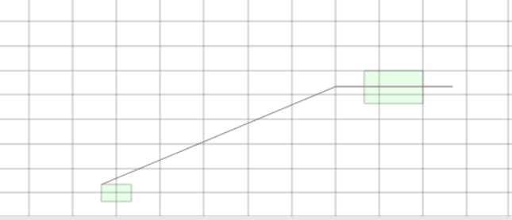

- [지리정보 시스템(Geographical Information System, GIS)의 개념](#지리정보-시스템geographical-information-system-gis의-개념)
  - [공간 데이터의 기본 개념](#공간-데이터의-기본-개념)
- [MySQL에서 공간 데이터의 저장](#mysql에서-공간-데이터의-저장)
  - [기존의 공간 데이터의 관리 방식](#기존의-공간-데이터의-관리-방식)
    - [지도 파일을 LONGBLOB열에 통째로 저장](#지도-파일을-longblob열에-통째로-저장)
    - [MySQL 공간 데이터의 관리 방식](#mysql-공간-데이터의-관리-방식)
  - [실습](#실습)
  - [공간 데이터 형식의 함수](#공간-데이터-형식의-함수)
- [실습](#실습-1)

# 지리정보 시스템(Geographical Information System, GIS)의 개념

지도와 그에 따른 텍스트(속성) 정보를 컴퓨터에 입력한 후에, 그 입력된 전자지도를 교통, 환경, 농업, 생활, 시설물 관리 등의 다양한 곳에 응용하는 분야

- GIS 구축에 필요한 데이터
  - 속성데이터(기존의 텍스트 기반의 데이터)
  - 공간 데이터(지도에 표현되는 데이터)

## 공간 데이터의 기본 개념

지구상에 존재하는 지형정보를 표현한 데이터

공간 데이터 구성

|형식|내부 구조|지도의 개체 예|MySQL의 공간<br>데이터 개체|
|:--:|:--:|:--:|:--:|
|점(Point)|1개의 x, y좌표|가로수, 논 심볼, 텍스트 등|POINT|
|선(Line)|여러 개의 x, y좌표|도호, 하천 등|LINESTRING|
|면(Polygon)|여러 개의 x, y좌표<br>첫 점 = 끝점|건물 등|POLYGON|

공간 데이터 형식

- Geometry
  - MySQL에서 사용하는 공간 데이터 형식
  - 저장할 수 있는 인스턴스
    - Point
    - LineString
    - Polygon

# MySQL에서 공간 데이터의 저장

## 기존의 공간 데이터의 관리 방식

LONGBLOB

- 지도 파일 단위로 저장
- 지도 파일뿐 아니라 이미지/동영상 등 모든 파일이 저장된다.

Geometry

- 개체(Entity) 단위로 저장 지원
- 공간 데이터 전용

### 지도 파일을 LONGBLOB열에 통째로 저장

수치지도의 파일을 하나의 데이터로 취급하여 테이블의 열에 저장하는 방식

- 장점
  - 관리의 이중성을 없앤다.
  - 수치지도와 속성정보와 수치지도 데이터 파일 자체를 통합
    - 관리 효율 향상
- 단점
  - 수치지도의 파일 크기 만큼 테이블 자체의 크기가 너무 커져서 입력/조회 등에서의 응답 속도가 상당히 느려진다.

### MySQL 공간 데이터의 관리 방식

Geometry

- GIS에서 사용되는 공간 데이터의 저장관리를 위한 데이터 타입
- 데이터 개체를 행 데이터로 취급해 테이블에 저장하는 방식
- 공간 데이터를 GEOMETRY와 같은 데이터 형식의 열로 생성하고 그 내부에는 개체를 입력

공간 데이터 형식

```sql
CREATE TABLE StreamTbl
(
    MapNumber CHAR(10), -- 지도 일련 번호
    StreamName CHAR(20), -- 하천 이름
    Stream GEOMETRY -- 공간 데이터(하천 개체)
);

INSERT INTO StreamTbl VALUES
(
    '330000001',
    '한류천',
     ST_GeomFromText('LINESTRING (-10 30, -50 70, 50 70)', 0)
    --  실제 하천이라면 더 복잡한 좌표 값들일 것이다.
);
```

MySQL에서 공간 데이터 개체가 데이터 형식으로 저장

- 공간 쿼리(Spatial Query) 가능

```sql
SELECT 학생이름 FROM 하천테이블 WHERE 하천길이 > 10KM
```

## 실습

```SQL
DROP IF EXISTS DATABASE GisDB;
CREATE DATABASE GisDB;

USE GisDB;

-- 하천테이블
CREATE TABLE StreamTbl
(
    MapNumber CHAR(10), -- 지도 일련 번호
    StreamName CHAR(20), -- 하천 이름
    Stream GEOMETRY -- 공간 데이터(하천 개체)
);

-- 3개의 하천 입력
INSERT INTO StreamTbl VALUES
(
    '330000001',
    '한류천',
     ST_GeomFromText('LINESTRING (-10 30, -50 70, 50 70)')
);
INSERT INTO StreamTbl VALUES
(
    '330000001',
    '안양천',
     ST_GeomFromText('LINESTRING (-50 -70, 30 -10, 70 -10)')
);
INSERT INTO StreamTbl VALUES
(
    '330000002',
    '일산천',
     ST_GeomFromText('LINESTRING (-70 50, -30 -30, 30 -60)')
);

-- 건물 테이블
CREATE TABLE BuildingTbl
(
    MapNumber CHAR(10), -- 지도 일련 번호
    BuildingName CHAR(20), -- 건물 이름
    Building GEOMETRY -- 공간 데이터(건물개체)
);

-- 건물 3개 입력
INSERT INTO BuildingTbl VALUES
(
    '330000005',
    '하나은행',
     ST_GeomFromText('POLYGON ((-10 50, 10 30, -10 10, -30 30, -10 50))')
);
INSERT INTO BuildingTbl VALUES
(
    '330000001',
    '우리빌딩',
     ST_GeomFromText('POLYGON ((-50 -70, -40 -70, -40 -80, -50 -80, -50 -70))')
);
INSERT INTO BuildingTbl VALUES
(
    '330000005',
    '하나은행',
     ST_GeomFromText('POLYGON ((40 0, 60 0, 60 -20, 40 -20, 40 0))')
);
```

입력한 데이터 조회

```sql
SELECT * FROM StreamTbl;
```


```sql
SELECT * FROM BuildingTbl;
```


공간 함수 사용

```sql
SELECT * FROM StreamTbl WHERE ST_Length(Stream) > 140;
-- 하천의 길이가 140m 이상인 것만 조회
```


- 주의
  - StreamTbl에는 하천의 길이에 대한 열이 없다.
  - 공간 데이터인 Stream열에 공간 함수인 ST_Length()를 사용해서 실시간으로 하천의 길이를 구한 것

```sql
SELECT BuildingName, ST_AREA(Building) FROM BuildingTbl
    WHERE ST_AREA(Building) < 500;
-- 면적이 500제곱미터 미만인 건물의 이름과 면적
```


- [Spatial View] 탭이 보이지 않는다.
  - 쿼리의 결과 중에서 공간 데이터 형식(Building열)에 해당하는 열이 없기 때문이다.
  - Stream에서는 Stream열이 있었다.


하천과 빌딩을 동시에 표시(UNION ALL)


```sql
SELECT * FROM StreamTbl
UNION ALL
SELECT * FROM BuildingTbl;
```

안양천 하천에 걸치는 건물을 추출

```sql
SELECT StreamName, BuildingName, Building, Stream
FROM BuildingTbl, StreamTbl
    WHERE ST_Intersects(Building, Stream) = 1 AND StreamName = '안양천';
```


- 데이터 입력을 모르고 두 번을 했다.



하천의 폭을 5m로 표현

```sql
SELECT ST_Buffer(Stream, 5) FROM StreamTbl;
```


## 공간 데이터 형식의 함수

[함수 모음집](https://dev.mysql.com/doc/refman/8.0/en/spatial-function-reference.html)

이 책에서 주로 쓰이는 함수

|함수명|설명|비고|
|:---|:---|:---|
|ST_GeomFromText()|문자열을 Geometry형식으로 변환한다.|Point, LineString, Polygon 등|
|ST_AsText()|Geometry 형식을 문자열 형식으로 변환한다.|Point, LineString, Polygon 등|
|ST_Length()|LineString의 길이를 구한다.||
|ST_Area()|Polygon의 면적을 구한다.||
|ST_Intersects()|두 도형의 교차 여부를 확인한다.|0: 교차 안함, 1: 교차함|
|ST_Buffer()|도형에서부터 주어진 거리만큼 떨어진 좌표 집합을 구한다.||
|ST_Contains()|한 도형 안에 다른 도형이 들어 있는지 확인한다.|0: 포함 안함, 1: 포함함|
|ST_Distance()|두 도형 사이의 거리를 구한다.||
|ST_Union()|두 도형을 합한 결과 좌표 집합을 구한다.||
|ST_Intersection()|두 도형이 교차하는 좌표 집합을 구한다.||

# 실습

```sql
/* 14장 */

-- <실습 1> --

DROP DATABASE IF EXISTS GisDB;
CREATE DATABASE GisDB;

USE GisDB;
CREATE TABLE StreamTbl (
   MapNumber CHAR(10),  -- 지도일련번호
   StreamName CHAR(20),  -- 하천이름
   Stream GEOMETRY ); -- 공간데이터(하천개체)

INSERT INTO StreamTbl VALUES ( '330000001' ,  '한류천', 
 ST_GeomFromText('LINESTRING (-10 30, -50 70, 50 70)'));
INSERT INTO StreamTbl VALUES ( '330000001' ,  '안양천', 
 ST_GeomFromText('LINESTRING (-50 -70, 30 -10, 70 -10)'));
INSERT INTO StreamTbl VALUES ('330000002' ,  '일산천', 
 ST_GeomFromText('LINESTRING (-70 50, -30 -30, 30 -60)'));

CREATE TABLE BuildingTbl (
   MapNumber CHAR(10),  -- 지도일련번호
   BuildingName CHAR(20),  -- 건물이름
   Building GEOMETRY ); -- 공간데이터(건물개체)
   
INSERT INTO BuildingTbl VALUES ('330000005' ,  '하나은행', 
 ST_GeomFromText('POLYGON ((-10 50, 10 30, -10 10, -30 30, -10 50))'));
INSERT INTO BuildingTbl VALUES ( '330000001' ,  '우리빌딩', 
 ST_GeomFromText('POLYGON ((-50 -70, -40 -70, -40 -80, -50 -80, -50 -70))'));
INSERT INTO BuildingTbl VALUES ( '330000002' ,  '디티오피스텔', 
 ST_GeomFromText('POLYGON ((40 0, 60 0, 60 -20, 40 -20, 40 0))'));

SELECT * FROM StreamTbl;

SELECT * FROM BuildingTbl;

SELECT * FROM StreamTbl WHERE ST_Length(Stream) > 140 ;

SELECT BuildingName, ST_AREA(Building) FROM BuildingTbl 
 WHERE ST_AREA(Building) < 500;
    
SELECT * FROM StreamTbl
UNION ALL
SELECT * FROM BuildingTbl;

-- </실습 1> --

SELECT StreamName, BuildingName, Building, Stream
   FROM BuildingTbl , StreamTbl 
   WHERE ST_Intersects(Building, Stream) = 1   AND StreamName = '안양천';

SELECT ST_Buffer(Stream,5) FROM StreamTbl;

-- <실습 2> --


-- </실습 2> --

-- <실습 3> --

DROP DATABASE IF EXISTS KingHotDB;
CREATE DATABASE KingHotDB;

USE KingHotDB;
-- [왕매워 짬뽕] 체인점 테이블 (총 매출액 포함)
CREATE TABLE Restaurant
(restID int auto_increment PRIMARY KEY,  -- 체이점 ID
 restName varchar(50),         -- 체인점 이름
 restAddr varchar(50),         -- 체인점 주소
 restPhone varchar(15),         -- 체인점 전화번호
 totSales  BIGINT,          -- 총 매출액   
 restLocation geometry ) ;         -- 체인점 위치

-- [왕매워 짬뽕] 1호점~9호점 입력
INSERT INTO Restaurant VALUES
 (NULL, '왕매워 짬뽕 1호점', '서울 강서구 방화동', '02-111-1111', 1000, ST_GeomFromText('POINT(-80 -30)')),
 (NULL, '왕매워 짬뽕 2호점', '서울 은평구 증산동', '02-222-2222', 2000, ST_GeomFromText('POINT(-50 70)')),
 (NULL, '왕매워 짬뽕 3호점', '서울 중랑구 면목동', '02-333-3333', 9000, ST_GeomFromText('POINT(70 50)')),
 (NULL, '왕매워 짬뽕 4호점', '서울 광진구 구의동', '02-444-4444', 250, ST_GeomFromText('POINT(80 -10)')),
 (NULL, '왕매워 짬뽕 5호점', '서울 서대문구 북가좌동', '02-555-5555', 1200, ST_GeomFromText('POINT(-10 50)')),
 (NULL, '왕매워 짬뽕 6호점', '서울 강남구 논현동', '02-666-6666', 4000, ST_GeomFromText('POINT(40 -30)')),
 (NULL, '왕매워 짬뽕 7호점', '서울 서초구 서초동', '02-777-7777', 1000, ST_GeomFromText('POINT(30 -70)')),
 (NULL, '왕매워 짬뽕 8호점', '서울 영등포구 당산동', '02-888-8888', 200, ST_GeomFromText('POINT(-40 -50)')),
 (NULL, '왕매워 짬뽕 9호점', '서울 송파구 가락동', '02-999-9999', 600, ST_GeomFromText('POINT(60 -50)'));

-- 점이 너무 작아서 안보일 수 있기 때문에 ST_Buffer로 3거리 만큼의 주변 집합을 표시
SELECT restName, ST_Buffer(restLocation, 3) as '체인점' FROM Restaurant;

-- 지역 관리자 테이블
CREATE TABLE Manager
 (ManagerID int auto_increment PRIMARY KEY,   -- 지역관리자 id
  ManagerName varchar(5),               -- 지역관리자 이름
  MobilePhone varchar(15),               -- 지역관리자 전화번호
  Email varchar(40),                      -- 지역관리자 이메일
  AreaName varchar(15),                 -- 담당지역명
  Area geometry SRID 0) ;                       -- 담당지역 폴리곤

INSERT INTO Manager VALUES
 (NULL, '존밴이', '011-123-4567', 'johnbann@kinghot.com',  '서울 동/북부지역',
   ST_GeomFromText('POLYGON((-90 0, -90 90, 90 90, 90 -90, 0 -90, 0  0, -90 0))')) ,
 (NULL, '당탕이', '019-321-7654', 'dangtang@kinghot.com', '서울 서부지역',
   ST_GeomFromText('POLYGON((-90 -90, -90 90, 0 90, 0 -90, -90 -90))'));

SELECT ManagerName, Area as '당탕이' FROM Manager WHERE ManagerName = '당탕이';
SELECT ManagerName, Area as '존밴이' FROM Manager WHERE ManagerName = '존밴이';

-- 서울시의 도로 테이블
CREATE TABLE Road
 (RoadID int auto_increment PRIMARY KEY,  -- 도로 ID
  RoadName varchar(20),           -- 도로 이름
  RoadLine geometry );              -- 도로 선

INSERT INTO Road VALUES
 (NULL, '강변북로',
   ST_GeomFromText('LINESTRING(-70 -70 , -50 -20 , 30 30,  50 70)'));

SELECT RoadName, ST_BUFFER(RoadLine,1) as '강변북로' FROM Road;

SELECT ManagerName, Area as '당탕이' FROM Manager WHERE ManagerName = '당탕이';
SELECT ManagerName, Area as '존밴이' FROM Manager WHERE ManagerName = '존밴이';
SELECT restName, ST_Buffer(restLocation, 3) as '체인점' FROM Restaurant;
SELECT RoadName, ST_BUFFER(RoadLine,1) as '강변북로' FROM Road;

-- Manager 테이블에는 면적에 대한 정보가 없으며, 단지 공간 데이터(폴리곤)만 있다.
-- 이 공간 데이터에서 면적을 구하는 공간 함수 ST_Area()를 이용해서 필요한 정보를 계산한 것
SELECT ManagerName, AreaName, ST_Area(Area) as "면적 m2" FROM Manager;

SELECT M.ManagerName,
       R.restName,
       R.restAddr,
       M.AreaName 
FROM Restaurant R, Manager M
WHERE ST_Contains(M.AREA, R.restLocation) = 1 
ORDER BY M.ManagerName;

-- 1호점의 주문이 밀리면 1호점과 가까운 지점에서 주문을 받기 위해 1호점에서 거리가 가까운 순으로 지점을 출력
SELECT R2.restName,
       R2.restAddr,
       R2.restPhone, 
       ST_Distance(R1.restLocation, R2.restLocation) AS "1호점에서 거리"
FROM Restaurant R1, Restaurant R2
WHERE R1.restName='왕매워 짬뽕 1호점'
ORDER BY ST_Distance(R1.restLocation, R2.restLocation) ;

SELECT Area INTO @eastNorthSeoul FROM Manager WHERE AreaName = '서울 동/북부지역';
SELECT Area INTO @westSeoul FROM Manager WHERE AreaName = '서울 서부지역';
SELECT ST_Union(@eastNorthSeoul, @westSeoul) AS  "모든 관리지역을 합친 범위" ;

-- 존밴이와 당탕이가 중복되어 관리되는 지점의 이름을 조회
SELECT  Area INTO @eastNorthSeoul FROM Manager WHERE ManagerName = '존밴이';
SELECT  Area INTO @westSeoul FROM Manager WHERE ManagerName = '당탕이';
SELECT  ST_Intersection(@eastNorthSeoul, @westSeoul) INTO @crossArea ;
SELECT DISTINCT R.restName AS "중복 관리 지점"
    FROM Restaurant R, Manager M
    WHERE ST_Contains(@crossArea, R.restLocation) = 1;

-- 강변북로에서 30m 이내에 있는 짬뽕집 조회
SELECT  ST_Buffer(RoadLine, 30) INTO @roadBuffer FROM Road;
SELECT R.restName AS "강변북로 30M 이내 지점"
   FROM Restaurant R
   WHERE ST_Contains(@roadBuffer,R.restLocation) = 1;

-- 강변북로에서 30m 이내에 있는 짬뽕집을 지도로 출력
SELECT  ST_Buffer(RoadLine, 30) INTO @roadBuffer FROM Road;
SELECT  ST_Buffer(RoadLine, 30) as '강변북로 30m' FROM Road;
SELECT  ST_Buffer(R.restLocation, 5) as '체인점' -- 지점을 약간 크게 출력
   FROM Restaurant R
   WHERE ST_Contains(@roadBuffer, R.restLocation) = 1;
SELECT RoadLine as '강변북로' FROM Road;

-- </실습 3> --
```
