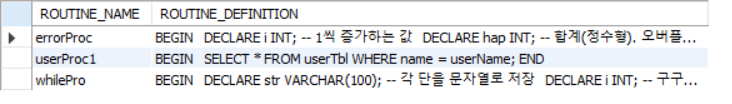
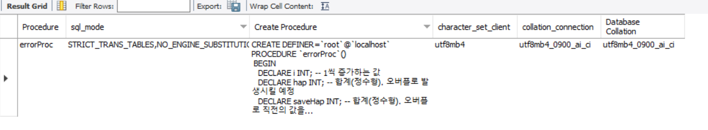

- [스토어드 프로시저(Stored Procedure)](#스토어드-프로시저stored-procedure)
  - [스토어드 프로시저의 개요](#스토어드-프로시저의-개요)
    - [스토어드 프로시저의 수정과 삭제](#스토어드-프로시저의-수정과-삭제)
    - [매개변수의 사용](#매개변수의-사용)
    - [스토어드 프로시저 내의 오류 처리](#스토어드-프로시저-내의-오류-처리)
    - [실습](#실습)
  - [스토어드 프로시저의 특징](#스토어드-프로시저의-특징)
- [스토어드 함수](#스토어드-함수)
  - [스토어드 함수의 개요](#스토어드-함수의-개요)

# 스토어드 프로시저(Stored Procedure)

MySQL에서 제공되는 프로그래밍 기능

## 스토어드 프로시저의 개요

쿼리문의 집합으로 어떠한 동작을 일괄 처리하기 위한 용도로 사용

형식
```SQL
DELIMITER $$
CREATE PROCEDURE 스토어드 프로시저이름(IN 또는 OUT 파라미터)
BEGIN
    ...SQL 프로그래밍 코딩...
END $$
DELIMITER ;

CALL 스토어드 프로시저이름();
```

### 스토어드 프로시저의 수정과 삭제
ALTER PROCEDURE
- 수정

DROP PROCEDURE
- 삭제

### 매개변수의 사용
입력 매개변수를 지정할 수 있다.
- 스토어드 프로시저 내부에서 다양한 용도로 사용

```SQL
IN 입력_매개변수_이름 데이터_형식
```

입력 매개 변수가 있는 스토어드 프로시저 실행
```SQL
CALL 프로시저_이름(전달 값);
```

출력 매개변수
- 스토어드 프로시저에서 처리된 결과를 출력 매개 변수를 통해서 얻을 수 있다.

```SQL
OUT 출력_매개변수_이름 데이터_형식
```
출력 매개 변수에 값을 대입하기 위해서는 주로 SELECT ... INTO문을 사용한다.

출력 매개 변수가 있는 스토어드 프로시저 실행
```SQL
CALL 프로시저_이름(@변수명)
SELECT @변수명
```

### 스토어드 프로시저 내의 오류 처리
```SQL
DECLARE 액션 HANDLER FOR 오류조건 처리할_문장
```

### 실습
```SQL
USE slqDB;
DROP PROCEDURE IF EXISTS userProc1;
DELIMITER $$
CREATE PROCEDURE userProc1(IN userName VARCHAR(10)) -- 입력 매개 변수 1개 선언
BEGIN
  SELECT * FROM userTbl WHERE name = userName;
END $$
DELIMITER ;

CALL userProc('조관우'); -- 입력 매개 변수 1개
```

2개의 입력 매개 변수가 있는 스토어드 프로시저

```sql
DROP PROCEDURE IF EXISTS userProc2;
DELIMITER $$
CREATE PROCEDURE userProc2( -- 입력 매개 변수 2개 선언
  IN userBirth INT,
  IN userHeight INT
)
BEGIN
  SELECT * FROM userTbl
    WHERE birthyear > userBirth AND height > userHeight;
END $$
DELIMITER ;

CALL userProc2(1970, 178); -- 입력 매개 변수 2개
```

출력 매개 변수가 있는 스토어드 프로시저
```sql
DROP PROCEDURE IF EXISTS userProc3;
DELIMITER $$
CREATE PROCEDURE userProc3(
  IN txtValue CHAR(10),
  OUT outValue INT
)
BEGIN
  INSERT INTO testTbl VALUES(NULL, txtValue);
  SELECT MAX(id) INTO outValue FROM testTbl; -- 출력 매개 변수를 대입하기 위한 SELECT ... INTO 구문
                                            -- PROCEDURE 생성 시점에 테이블이 없어도 되지만, 호출할 때는 있어야 한다.
END $$
DELIMITER ;

CREATE TABLE IF NOT EXISTS testTbl(
  id INT AUTO_INCREMENT PRIMARY KEY,
  txt CHAR(10)
);

CALL userProc3('테스트값', @myValue);
SELECT CONCAT('현재 입력된 ID 값 ==>', @myValue);
```

구구단 만들기
```sql
DROP TABLE IF EXISTS guguTbl;
CREATE TABLE guguTBL (txt VARCHAR(100)) -- 구구단 저장용 테이블

DROP PROCEDURE IF EXISTS whileProc;
DELIMITER $$
CREATE PROCEDURE whilePro()
BEGIN
  DECLARE str VARCHAR(100); -- 각 단을 문자열로 저장
  DECLARE i INT; -- 구구단 앞자리
  DECLARE K INT; -- 구구단 뒷자리
  SET i = 2; -- 2단부터 시작

  WHILE(i < 10) DO
    SET str = '';
    SET k = 1;
    WHILE(k < 10) DO
      SET str = CONCAT(str,' ', i, 'x', k, '=', i*k);
      SET k = k + 1;
    END WHILE;
    SET i = i + 1;
    INSERT INTO guguTBL VALUES(str);
  END WHILE;
END $$
DELIMITER ;

CALL whileProc();
SELECT * FROM guguTBL;
```


DECLARE ~~ HANDLER를 이용한 오류 처리

```SQL
DROP PROCEDURE IF EXISTS errorProc;
DELIMITER $$
CREATE PROCEDURE errorProc();
BEGIN
  DECLARE i INT; -- 1씩 증가하는 값
  DECLARE hap INT; -- 합계(정수형). 오버플로 발생시킬 예정
  DECLARE saveHap INT; -- 합계(정수형). 오버플로 직전의 값을 저장

  DECLARE EXIT HANDLER FOR 1264 -- INT형 오버플로가 발생하면 이 부분이 수행된다.
  BEGIN
    SELECT CONCAT('INT 오버플로 직전의 합계 --> ', saveHap), CONCAT('1 + 2 + 3 + ... + ', i,' = 오버플로');
  END;

  SET i = 1; -- 1부터 증가
  SET hap = 0; -- 합계를 누적

  WHILE (TRUE) DO -- 무한 루프
    SET saveHap = hap; -- 오버플로 직전의 합계를 저장
    SET hap = hap + i; -- 오버플로가 나면 오류 처리 구문을 실행
    SET i = i + 1;
  END WHILE;
END $$
DELIMITER ;

CALL errorProc();
```


INFORMATION_SCHEMA 데이터베이스의 ROUTINES 테이블을 조회하면 내용을 확인할 수 있다.
```SQL
SELECT routine_name, routine_definition FROM INFORMATION_SCHEMA.ROUTINES
  WHERE routine_schema = 'sqldb' AND routine_type = 'PROCEDURE';
```

- 파라미터의 내용은 보이지 않는다.

파라미터의 내용 확인
```SQL
SELECT parameter_mode, parameter_name, dtd_identifier
  FROM INFORMATION_SCHEMA.PARAMETERS
  WHERE specific_name = 'errorProc';
```

- 위의 프로그램은 파라미터가 없으므로 아무것도 나오지 않았다.

프로시저의 내용을 확인
```SQL
SHOW CREATE PROCEDURE sqldb.errorProc;
```


테이블이름을 파라미터로 전달하는 방법

```sql
DROP PROCEDURE IF EXISTS nameProc;
DELIMITER $$
CREATE PROCEDURE nameProc(
  IN tblName VARCHAR(20)
)
BEGIN
  SELECT * FROM tblName;
END $$
DELIMITER ;

CALL nameProc('userTBL')
```

- 'sqldb.tblname'이라는 테이블을 알 수 없다는 오류 발생
  - MySQL에서는 직접 테이블 이름을 파라미터로 사용할 수 없다.

동적 SQL을 활용해보자

```sql
DROP PROCEDURE IF EXISTS nameProc;
DELIMITER $$
CREATE PROCEDURE nameProc(
  IN tblName VARCHAR(20)
)
BEGIN
  SET @sqlQuery = CONCAT('SELECT * FROM ', tblName);
  PREPARE myQuery FROM @sqlQuery;
  EXECUTE myQuery;
  DEALLOCATE PREPARE myQuery;
END $$
DELIMITER ;

CALL nameProc('userTBL');
```
- 넘겨받은 테이블 이름을 @sqlQuery 변수에 SELECT문으로 문자열을 생성해 놓았다.
  - 그 다음에 SELECT 문자열을 준비하고 실행
- 결과가 잘 나올 것이다.

스토어드 프로시저의 삭제
```sql
DROP PROCEDURE 프로시저이름
```
- 프로시저의 내용은 ALTER PROCEDURE나 ALTER FUNCTION으로 바꿀 수 없다.
- DROP 시킨 후에 다시 CREATE 해야한다.

## 스토어드 프로시저의 특징
- MySQL의 성능을 향상시킬 수 있다.
- 유지관리가 간편하다.
- 모듈식 프로그래밍이 가능하다.
- 보안을 강화할 수 있다.
  - 사용자 별로 테이블에 접근 권한을 주지 않고, 스토어드 프로시저에만 접근 권한을 줌으로써 보안을 강화할 수 있다.

---

# 스토어드 함수

## 스토어드 함수의 개요

형식

```sql
DELIMITER $$
CREATE FUNCTION 스토어드_함수이름(파라미터)
  RETURNS 반환형식
BEGIN
  ...프로그래밍 코딩...
  RETURN 반환값;
END $$
DELIMITER ;

SELECT 스토어드_함수이름();
```


스토어드 함수는 스토어드 프로시저와 매우 비슷하지만 차이점이 있다.

