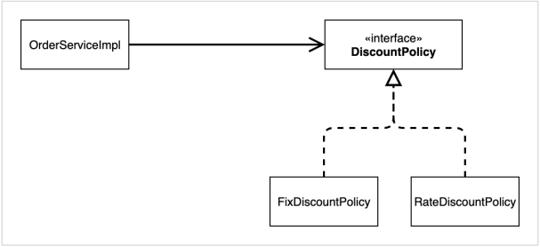
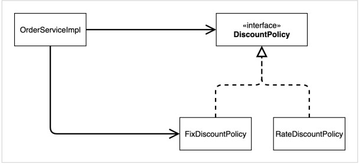

# 구체화에 의존

```java
private final MemberRepository memberRepository=new MemoryMemberRepository();
```

- `MemberRepository interface` 타입의 변수 `memberRepository`에 구현 객체를 할당했다.
    - 할당하지 않으면 nullpointerexception 발생

# 추상화에 의존

```java
public class MemberServiceImpl implements MemberService {
}
```

- interface를 구현하는 것을 추상화에 의존한다고 표현한다.

# 의존관계가 인터페이스 뿐만 아니라 구현까지 모두 의존하는 문제점 발생

```java
public class MemberServiceImpl implements MemberService {
     private final MemberRepository memberRepository = new MemoryMemberRepository();
  ...
}
```

- 구체화와 추상화 모두에 의존한다.

```java
public class OrderServiceImpl implements OrderService {
     private final MemberRepository memberRepository = new MemoryMemberRepository();
     private final DiscountPolicy discountPolicy = new FixDiscountPolicy();
  ...
}
```

- OrderServiceImpl에서 객체 생성과 변수 할당까지 해주고 있다.
    - 배우가 상대 배우를 캐스팅 하는 것과 같다.
    - 추상과 구체에 모두 의존

관계도가 다음과 같이 되어야 한다.



하지만 위의 코드의 관계도는 다음과 같다.



문제점

- 클라이언트 코드인 OrderServiceImpl은 DiscountPolicy의 인터페이스 뿐만 아니라 구체 클래스도 함께 의존한다.
    - DIP 위반, 추상에만 의존하도록 해야 한다.

# 인터페이스에만 의존하도록 코드 변경

```java
public class OrderServiceImpl implements OrderService {
     //private final DiscountPolicy discountPolicy = new RateDiscountPolicy();
     private DiscountPolicy discountPolicy;
}
```

- 인터페이스에만 의존
- 구현체가 없으므로 nullpointerexception 발생
    - 누군가가 OrderServiceImpl에 DiscountPolicy의 구현 객체를 대신 생성하고 주입해줘야 한다.

# AppConfig

구현 객체를 생성하고, 연결

```java
public class AppConfig {
     public MemberService memberService() {
          return new MemberServiceImpl(new MemoryMemberRepository());
     }

     public OrderService orderService() {
          return new OrderServiceImpl(
                  new MemoryMemberRepository(),
                  new FixDiscountPolicy());
     }
}
```

- AppConfig는 애플리케이션의 실제 동작에 필요한 구현 객체를 생성
    - MemberServiceImpl
    - MemoryMemberRepository
    - OrderServiceImpl
    - FixDiscountPolicy
- AppConfig는 생성한 객체 인스턴스의 레퍼런스를 생성자를 통해서 주입(연결)해준다.
    - MemberServiceImpl -> MemoryMemberRepository
    - OrderServiceImpl -> MemoryMemberRepository, FixDiscountPolicy
- MemberServiceImpl과 OrderServiceImpl은 의존관계에 대한 고민은 외부에 맡기고 기능 실행에만 집중하면 된다.

# 사용 클래스 - MemberApp, OrderApp

MemberApp

```java
package hello.core;

import hello.core.member.Grade;
import hello.core.member.Member;
import hello.core.member.MemberService;

public class MemberApp {
     public static void main(String[] args) {
          AppConfig appConfig = new AppConfig();
          MemberService memberService = appConfig.memberService();
          Member member = new Member(1L, "memberA", Grade.VIP);
          memberService.join(member);
          Member findMember = memberService.findMember(1L);
          System.out.println("new member = " + member.getName());
          System.out.println("find Member = " + findMember.getName());
     }
}
```

OrderApp

```java
package hello.core;

import hello.core.member.Grade;
import hello.core.member.Member;
import hello.core.member.MemberService;
import hello.core.order.Order;
import hello.core.order.OrderService;

public class OrderApp {
     public static void main(String[] args) {
          AppConfig appConfig = new AppConfig();
          MemberService memberService = appConfig.memberService();
          OrderService orderService = appConfig.orderService();
          long memberId = 1L;
          Member member = new Member(memberId, "memberA", Grade.VIP);
          memberService.join(member);
          Order order = orderService.createOrder(memberId, "itemA", 10000);
          System.out.println("order = " + order);
     }
}
```

## 테스트 코드

MemberServiceTest

```java
class MemberServiceTest {
     MemberService memberService;

     @BeforeEach //각 테스트를 실행하기 전에 호출
     public void beforeEach() {
          AppConfig appConfig = new AppConfig();
          memberService = appConfig.memberService();
     }
}
```

OrderServiceTest

```java
class OrderServiceTest {
     MemberService memberService;
     OrderService orderService;

     @BeforeEach
     public void beforeEach() {
          AppConfig appConfig = new AppConfig();
          memberService = appConfig.memberService();
          orderService = appConfig.orderService();
     }
}
```

AppConfig를 리펙토링한다.

```java
public class AppConfig {
     public MemberService memberService() {
          return new MemberServiceImpl(memberRepository());
     }

     public OrderService orderService() {
          return new OrderServiceImpl(
                  memberRepository(),
                  discountPolicy());
     }

     public MemberRepository memberRepository() {
          return new MemoryMemberRepository();
     }

     public DiscountPolicy discountPolicy() {
          return new FixDiscountPolicy();
     }
}
```

- new 부분을 빼내서 메서드로 만들었다.
- AppConfig에서 할인 정책 역할을 담당하는 구현을 FixDiscountPolicy -> RateDiscountPolicy 객체로 변경한다.
    - AppConfig가 의존관계를 변경해서 클라이언트 코드에 주입하므로 클라이언트 코드는 변경하지 않아도 된다.
    - 소프트웨어 요소를 새롭게 확장해도 사용 영역의 변경은 닫혀 있는 것이다. (OCP)

# 제어의 역전 IoC(Inversion of Control)

프로그램에 대한 제어 흐름의 권한을 모두 AppConfig가 가지고 있다.

- 외부(AppConfig)가 프로그램의 제어 흐름을 관리하는 것을 제어의 역전이라고 한다.

# DI 의존관계 주입

애플리케이션 실행 시점(런타임)에 외부에서 실제 구현 객체를 생성하고 클라이언트에 전달해서 클라이언트와 서버의 실제 의존관계가 연결 되는 것
- 객체 인스턴스를 생성하고, 그 참조값을 전달해서 연결

# IoC 컨테이너, DI 컨테이너
- AppConfig처럼 객체를 생성하고 관리하면서 의존관계를 연결해주는 것