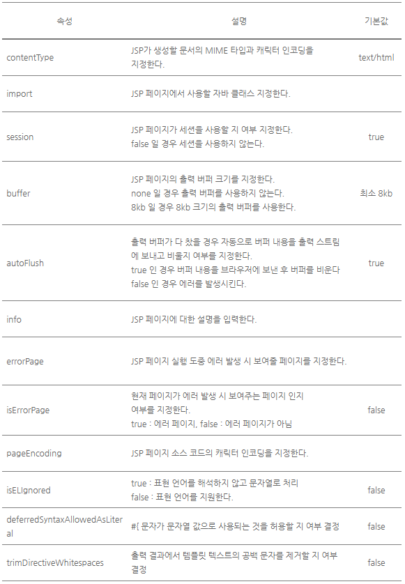
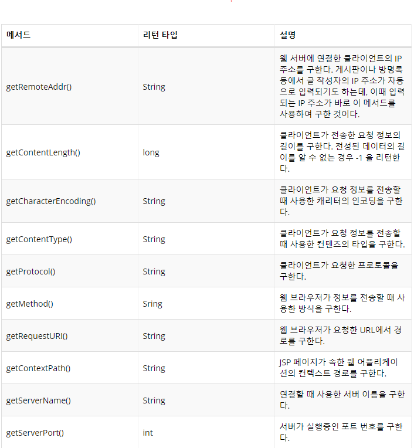
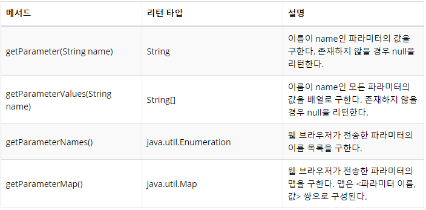
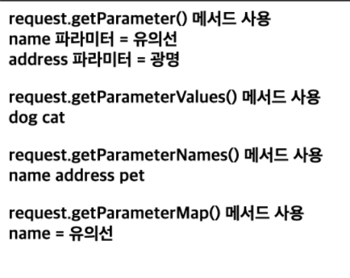
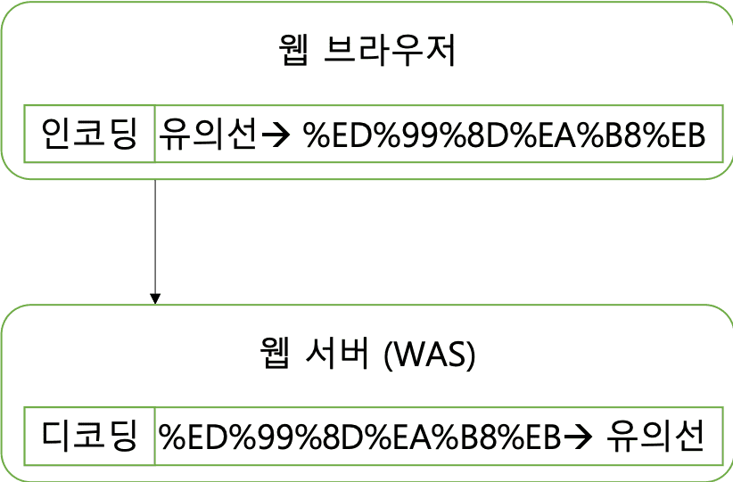
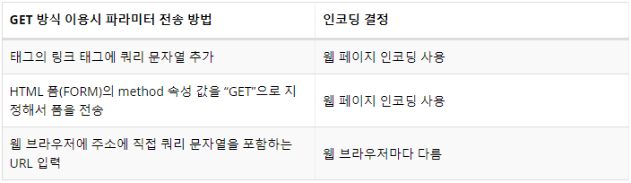
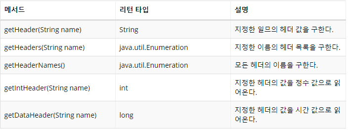
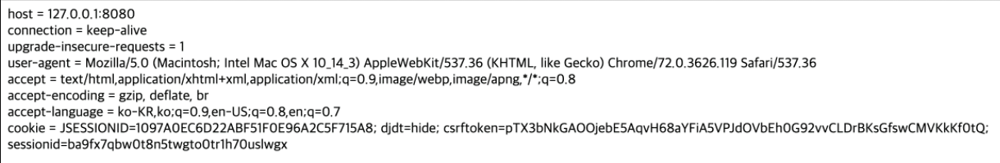
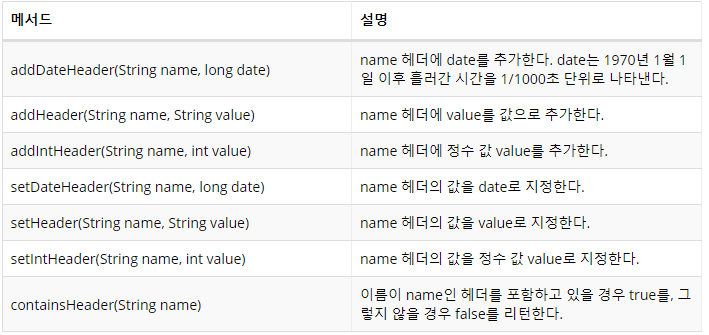
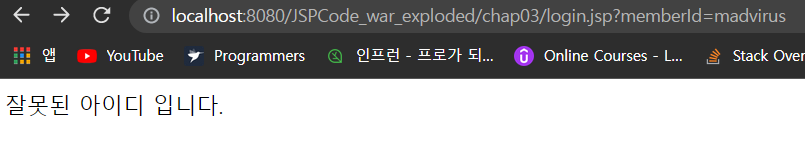

- [JSP 에서 HTML 문서를 생성하는 기본 코드 구조](#jsp-에서-html-문서를-생성하는-기본-코드-구조)
- [JSP 페이지의 구성 요소](#jsp-페이지의-구성-요소)
  - [디렉티브(Directive)](#디렉티브directive)
  - [스크립트 요소](#스크립트-요소)
  - [기본 객체(Implicit Object)](#기본-객체implicit-object)
  - [표현 언어](#표현-언어)
  - [표준 액션 태그와 태그 라이브러리](#표준-액션-태그와-태그-라이브러리)
- [page 디렉티브](#page-디렉티브)
  - [contentType 속성과 캐릭터 셋](#contenttype-속성과-캐릭터-셋)
  - [import 속성](#import-속성)
  - [trimDirectiveWhitespaces 속성을 이용한 공백 처리](#trimdirectivewhitespaces-속성을-이용한-공백-처리)
- [스크립트 요소](#스크립트-요소-1)
  - [스크립트릿(Scriptlet)](#스크립트릿scriptlet)
  - [표현식(Expression)](#표현식expression)
  - [선언부(declaration)](#선언부declaration)
- [request 기본 객체](#request-기본-객체)
  - [클라이언트 정보 및 서버 정보 읽기](#클라이언트-정보-및-서버-정보-읽기)
  - [요청 파라미터 처리](#요청-파라미터-처리)
    - [HTML 폼과 요청 파라미터](#html-폼과-요청-파라미터)
    - [request 기본 객체의 요청 파라미터 관련 메서드](#request-기본-객체의-요청-파라미터-관련-메서드)
    - [GET 방식 전송과 POST 방식 전송](#get-방식-전송과-post-방식-전송)
    - [요청 파라미터 인코딩](#요청-파라미터-인코딩)
    - [톰캣에서 GET 방식 파라미터를 위한 인코딩 처리하기](#톰캣에서-get-방식-파라미터를-위한-인코딩-처리하기)
  - [요청 헤더 정보의 처리](#요청-헤더-정보의-처리)
- [response 기본 객체](#response-기본-객체)
  - [웹 브라우저에 헤더 정보 전송하기](#웹-브라우저에-헤더-정보-전송하기)
  - [웹 브라우저 캐시 제어를 위한 응답 헤더 입력](#웹-브라우저-캐시-제어를-위한-응답-헤더-입력)
  - [리다이렉트를 이용해서 페이지 이동하기](#리다이렉트를-이용해서-페이지-이동하기)
  - [JSP 주석](#jsp-주석)

# JSP 에서 HTML 문서를 생성하는 기본 코드 구조

HTML 문서를 생성하는 JSP 코드는 크게 설정 부분과 응답 생성 부분으로 구성된다.

```html
<!--1행 설정부분: JSP페이지에 대한 설정 정보, 여기서는 문서의 타입만 지정하고 있다.-->
<%@ page contentType = "text/html; charset=utf-8" %>
<html>
<head>
    <title>HTML 문서의 제목</title>
</head>
<body>
<%
String bookTitle = "JSP 프로그래밍";
String author = "최범균";
%>
<b><%= bookTitle %></b>(<%= author %>)입니다.
</body>
</html>
<!--2 ~ 13행 생성부분: HTML 코드 및 JSP 스크립트-->
```

- 설정부분
  - JSP 페이지가 생성하는 문서의 타입(종류)
  - JSP 페이지에서 사용할 커스텀 태그
  - JSP 페이지에서 사용할 자바 클래스 지정

<%@ page ... %>

- page 디렉티브
- JSP 페이지에 대한 정보를 설정할 때 사용

- 생성부분
  - 문서를 생성하는 데 필요한 스크립트 코드, 생성할 문서의 데이터

# JSP 페이지의 구성 요소

- 디렉티브(Directive)
- 스크립트(Script): 스크립트릿(Scriptlet), 표현식(Expression), 선언부(Declaration)
- 표현 언어(Expression Language)
- 기본 객체(Implicit Object)
- 정적인 데이터
- 표준 액션 태그(Action Tag)
- 커스텀 태그(Custom Tag)와 표준 태그 라이브러리(JSTL)

## 디렉티브(Directive)

JSP 페이지에 대한 설정 정보를 지정할 때 사용

```html
<%@ 디렉티브이름 속성1="값1" 속성2="값2"...%>
```

JSP가 제공하는 디렉티브 |디렉티브|설명| |:--|:--| |page|JSP 페이지에 대한 정보를 지정| |taglib|JSP 페이지에서 사용할 태그 라이브러리 지정| |include|JSP 페이지의 특정 영역에
다른 문서를 포함|

## 스크립트 요소

JSP에서 문서의 내용을 동적으로 생성하기 위해 사용되는 것

- 스크립트 요소를 사용
  - 사용자가 폼에 입력한 정보를 데이터 베이스에 저장할 수 있다.
  - 데이터베이스로부터 게시글 목록을 읽어와 출력할 수 있다.

스크립트 요소

- 표현식(Expression)
  - 값을 출력한다.
- 스크립트릿(Scriptlet)
  - 자바 코드를 실행한다.
- 선언부(Declaration)
  - 자바 메서드(함수)를 만든다.

## 기본 객체(Implicit Object)

웹 어플리케이션 프로그래밍을 하는 데 필요한 기능을 제공

- 주로 사용하는 기본 객체
  - request: 요청 파라미터 읽어오기
  - session: 세션 처리하기
  - response: 응답 결과 전송하기

## 표현 언어

JSP의 스크립트 요소는 자바 문법을 그대로 사용할 수 있지만, JSP 코드가 다소 복잡해질 수도 있다.

```html
<%
int a = Integer.parseInt(request.getParameter("a"));
int b = Integer.parseInt(request.getParameter("b"));
%>
a * b = <%= a * b %>
```

위의 코드를 표현 언어로 작성하면 간다해진다.

```html
a * b = ${param.a * param.b}
```

## 표준 액션 태그와 태그 라이브러리

액션 태그는 JSP 페이지에서 특별한 기능을 제공한다.

- <jsp:액션태그이름>의 형태를 띠며 액션 태그 종류에 따라서 서로 다른 속성과 값을 갖는다.

```html
<%@ page contentType = "text/html; charset=utf-8" %>
<html>
...
<jsp:include page="header.jsp" flush="true"/>
...
</html>
```

- <jsp:include> 액션 태그는 특정한 페이지의 실행 결과를 현재 위치에 포함시킬 때 사용된다.

커스텀 태그

- JSP를 확장시켜주는 기능
- 태그 형태로 기능을 제공
- 개발자가 직접 개발
- 일반적으로 JSP 코드에서 중복되는 것을 모듈화하거나 스크립트 코드를 사용할 떄 발생하는 소스코드의 복잡함을 없애기 위해 사용
- JSTL(JavaServer Pages Standard Tag Library)
  - 자주 사용하는 커스텀 태그 라이브러리

# page 디렉티브

JSP 페이지에 대한 정보를 입력하기 위해서 사용

- 어떤 문서를 생성하는지
- 어떤 자바 클래스를 사용하는지
- 세션에 참여하는지
- 출력 버퍼의 존재 여부



## contentType 속성과 캐릭터 셋

JSP 페이지가 생성할 문서의 타입을 지정

- 구성

```html
TYPE
또는
TYPE;charset=캐릭터 셋
```

- JSP에서 주로 사용하는 MIME 타입은 "text/html"
  - 설정하지 않을 경우 기본값

```html
<%@ page contentType = "text/html" %>
```

- contentType 속성의 값 중에서 "; charset=캐릭터 셋" 부분은 생략 가능
  - 생략할 경우 기본 캐릭터 셋 ISO-8859-1 사용
  - 우리나라는 EUC-KR이나 UTF-8을 사용 -> 대소문자 구분 안해도 된다.

```html
<%@ page contentType = "text/html; charset=UTF-8" %>

또는

<%@ page contentType = "text/html; charset=utf-8" %>
```

## import 속성

JSP 코드에서 클래스의 단순 이름을 사용가능하게 한다.

```html
<%@ page import = "java.util.Calendar" %>
<%@ page import = "java.util.Date" %>

또는

<%@ page import = "java.util.Date,java.util.Calendar" %>

또는

<%@ page import = "java.util.*" %>
```

```html
<%@ page contentType = "text/html; charset=UTF-8" %>
<%@ page import = "java.util.Calendar" %>
<html>
<head>
    <title>Calendar클래스 사용</title>
</head>
<body>
<%
Calendar cal = Calendar.getInstance();
<!--java.util.Calendar을 Calendar로만 사용 가능-->
%>
오늘은
<%= cal.get(Calendar.YEAR) %>년
<%= cal.get(Calendar.MONTH) + 1 %>월
<%= cal.get(Calendar.DATE) %>일
입니다.
</body>
</html>
```

## trimDirectiveWhitespaces 속성을 이용한 공백 처리

불필요하게 생성되는 줄바꿈 공백 문자를 제거

- trimDirectiveWhitespaces 속성의 값을 true로 지정하면 디렉티브나 스크립트 코드 위치에서 발생하는 줄바꿈 공백 문자를 제거해준다.

```html
<%@ page contentType="text/html"; charset=utf-8 %>
<%@ page trimDriectiveWhitespaces="true" %>
<html>
<head>
  <title>현재 시간</title>
</head>
<body>
현재 시각: <%= new java.util.Date() %>
</body>
</html>
```

# 스크립트 요소

JSP 프로그래밍에서 로직을 수행하는 데 필요하다.

## 스크립트릿(Scriptlet)

JSP 페이지에서 자바 코드를 실행할 때 사용하는 코드 블록

```html
<%
    자바코드...
>%
```

- <%%> 사이에 자바코드가 위치한다.

```html
<%@ page contentType = "text/html; charset=UTF-8" %>
<html>
<head><title>합 구하기</title></head>
<body>
<%
    int sum = 0;
    for(int i = 1; i <= 10; i++){
        sum = sum + i;
    }
%>
1 부터 10까지의 합은 <%= sum %> 입니다.

<br>

<%
    int sum2 = 0;
    for(int i = 11; i <= 20; i++){
        sum2 = sum2 + i;
    }
%>
11부터 20까지의 합은 <%= sum2 %> 입니다.
</body>
</html>
```

## 표현식(Expression)

어떤 값을 출력 결과에 포함시키고자 할 때 사용

```html
<%= 값 %>
```

```html
<%@ page contentType = "text/html; charset=UTF-8" %>
<html>
<head><title>1-10까지의 합: 표현식만 사용</title></head>
<body>
1부터 10까지의 합은 
<%= 1+2+3+4+5+6+7+8+9+10 %>
입니다.
</body>
</html>
```

## 선언부(declaration)

JSP 페이지의 스크립트릿이나 표현식에서 사용할 수 있는 메서드를 작성할 때에는 선언부를 사용한다.

```html
<%!
    public 리턴타입 메서드이름(파라미터목록){
        자바코...
        return 값;
    }
%>
```

```html
<%@ page contentType = "text/html; charset=UTF-8" %>
<%!
    public int multiply(int a, int b){
        int c = a * b;
        return c;
    }
%>
<html>
<head><title>선언부를 사용한 정수값의 곱</title></head>
<body>
10 * 25 = <%= multiply(10, 25) %>
</body>
</html>
```

# request 기본 객체

웹 브라우저의 요청과 관련이 있다.

- 웹 브라우저에 웹 사이트의 주소를 입력하면, 웹 브라우저는 해당 웹 서버에 연결한 후 요청 정보를 전송
  - 이 요청 정보를 제공하는 것이 request 객체

## 클라이언트 정보 및 서버 정보 읽기



```html
<%@ page contentType = "text/html; charset=utf-8" %>
<html>
    <head>
        <title>클라이언트 및 서버 정보</title>
    </head>
    <body>
        클라이언트IP = <%= request.getRemoteAddr() %><br>
        요청정보길이 = <%= request.getContentLength() %><br>
        요청정보 인코딩 = <%= request.getCharacterEncoding() %><br>
        요청정보 컨텐츠타입 = <%= request.getContentType() %><br>
        요청정보 프로토콜 = <%= request.getProtocol() %><br>
        요청정보 전송방식 = <%= request.getMethod() %><br>
        요청 URI = <%= request.getRequestURI() %><br>
        컨텍스트 경로 = <%= request.getContextPath() %><br>
        서버이름 = <%= request.getServerName() %><br>
        서버포트 = <%= request.getServerPort() %><br>
    </body>
</html>
```


## 요청 파라미터 처리

### HTML 폼과 요청 파라미터

```html
<form action="/chap03/viewParamemter.jsp" method="post">
  이름: <input type="text" name="name" size="10"><br>
  주소: <input type="text" name="address" size="30"><br>
  좋아하는 동물:
        <input type="checkbox" name="pet" size="dog">강아지
        <input type="checkbox" name="pet" size="cat">고양이
        <input type="checkbox" name="pet" size="pig">돼지
  <br>
  <input type="submit" value="전송">
</form>
```

- name 속성의 값이 입력 요소의 이름이 된다.
  - 입력 요소의 이름은 웹 브라우저가 서버에 전송하는 요청 파라미터의 이름으로 사용된다.

### request 기본 객체의 요청 파라미터 관련 메서드



```html
<%@ page contentType = "text/html; charset=utf-8" %>
<html>
   <head>
       <title>폼 생성</title>
   </head>
   <body>
       <form action="/chap03/viewParameter.jsp" method="post">  
           이름: <input type="text" name ="name" size="10"><br>
           주소: <input type="text" name ="address" size="30"><br>
           좋아하는 동물:
               <input type="checkbox" name="pet" value="dog">강아지
               <input type="checkbox" name="pet" value="cat">고양이
               <input type="checkbox" name="pet" value="pig">돼지
               <br>
           <input type="submit" value="전송">
       </form>
   </body>
</html>
```

- 이 폼에 데이터를 입력한 뒤 [전송] 버튼을 클릭하면, 웹 브라우저는 폼에 입력한 데이터를 '/chap03/viewParameter.jsp'로 전송한다.
  - 입력한 데이터는 요청 파라미터로 전송된다.

```html
<%@ page contentType="text/html; charset=utf-8" %>
<%@ page import = "java.util.Enumeration" %>
<%@ page import = "java.util.Map" %>
<%
   request.setCharacterEncoding("utf-8");
%>
<html>
   <head>
       <title>요청 파라미터 출력</title>
   </head>
   <b>
       <b>request.getParameter() 메서드 사용</b><br>
       name 파라미터 = <%= request.getParameter("name") %><br>
       address 파라미터 = <%= request.getParameter("address") %><br>
       <p>
       <b>request.getParameterValues() 메서드 사용</b><br>
       <%
           String[] values = request.getParameterValues("pet");
           if(values != null){
               for(int i = 0; i < values.length; i++){
       %>
       <%= values[i] %>
       <%
               }
           }
       %>
       <p>
       <b>request.getParameterNames() 메서드 사용</b><br>
       <%
           Enumeration paramEnum = request.getParameterNames();
           while(paramEnum.hasMoreElements()){
               String name = (String)paramEnum.nextElement();
       %>
           <%= name %>
       <%
           }
       %>
       <p>
       <b>request.getParameterMap() 메서드 사용</b><br>
       <%
           Map parameterMap = request.getParameterMap();
           String[] nameParam = (String[])parameterMap.get("name");
           if(nameParam != null){
       %>
       name = <%= nameParam[0] %>
       <%
           }
       %>
   </body>
</html>
```

- request.getParameterValues() 메서드를 사용하여 pet 파라미터의 값을 String 배열로 읽어온다.
  - request.getParameter() 메서드는 한 개의 값만 읽어올 수 있다.
- 같은 name 값을 갖는 <input>이 존재하면, 같은 이름의 파라미터로 전송된다.



- 체크박스와 라디오버튼은 선택하지 않으면 파라미터 자체가 전송되지 않는다.
- 텍스트를 위한 입력 요소들은 값을 입력하지 않더라도 빈 문자열("")이 파라미터 값으로 전달된다.

### GET 방식 전송과 POST 방식 전송

웹 브라우저는 GET, POST 방식 중 한 가지를 이용해서 파라미터를 전송한다.

GET

- 요청 URL에 파라미터를 붙여서 전송한다.
- URL의 경로 뒤에 물음표와 함께 파라미터를 붙여 전송한다.
  - 이를 쿼리 문자열이라고 한다.

```html
http://localhost:8080/chap03/viewParameter.jsp?name=유의선&address=광명
```

```html
이름1=값1&이름2=값2& ...
```

- 각각의 파라미터는 앰퍼샌드(&) 기호로 구분
- GET 방식은 URL의 쿼리 문자열로 전송되기 때문에, 폼을 사용하지 않아도 파라미터를 전송할 수 있다.

```html
http://localhost:8080/chap03/viewParameter.jsp?name=유의선&address=광명
```

- 웹 브라우저에서 웹 서버로 전달되는 데이터는 위와 같은 형식을 갖는다.
- 웹 브라우저, 웹 서버 또는 웹 컨테이너에 따라 전송할 수 있는 파라미터 값의 길이에 제한이 있을 수 있다.

POST

- 데이터 영역을 이용해서 데이터를 전송하기 때문에 웹 브라우저나 웹 서버 등에 상관없이 전송할 수 있는 파라미터의 길이에 제한이 없다.

### 요청 파라미터 인코딩

웹 브라우저는 웹 서버에 파라미터를 전송할 때 알맞은 캐릭터 셋을 이용해서 파라미터 값을 인코딩한다.

- 반대로 웹 서버는 알맞은 캐릭터 셋을 이용해서 웹 브라우저가 전송한 파라미터 데이터를 디코딩한다.



- 어떤 캐릭터 셋을 사용할지의 여부는 두 전송 방식(GET, POST)에 따라 달라진다.

POST

- 입력 폼을 보여주는 응답 화면이 사용하는 캐릭터 셋을 사용
  - 응답 결과에서 사용한 캐릭터 셋이 UTF-8이면 UTF-8 캐릭터 셋을 이용해서 파라미터 값을 인코딩한다.
- JSP는 파라미터 값을 디코딩할 때 사용할 캐릭터 셋을 지정할 수 있다.
  - request 기본 객체의 setCharacterEncoding() 메서드 사용

```html
<%
 <!-- 디코딩할 때 사용할 캐릭터셋을 utf-8로 지정 -->
 request.setCharacterEncoding("utf-8");
%>
...
<!-- name 파라미터 값을 utf-8로 디코딩해서 가져옴 -->
<%= request.getParameter("name") %>
```

- request.setCharacterEncoding() 메서드는 파라미터 값을 사용하기 전에 실행해줘야 한다.

GET

- GET 방식으로 파라미터 전송 시 인코딩 결정 규칙



- GET 방식으로 파라미터를 전송하는 방법
  - `<a>` 태그의 링크에 쿼리 문자열 이용

```html
<a href="viewParameter.jsp?name=홍길동&address=아차곡">링크</a>

```

- 웹 페이지의 인코딩이 UTF-8이면 UTF-8 캐릭터 셋을 이용해서 파라미터 값을 인코딩하는 식이다.
- HTML 폼을 GET 방식으로 전송하는 경우에도 웹 페이지의 인코딩을 이용해서 파라미터 값을 인코딩한다.
- WAS마다 GET 방식의 파라미터 값을 읽어올 때 사용하는 기본 캐릭터 셋이 다르다.
- GET 방식으로 전송된 파라미터에 대해서는 request.setCharacterEncodin() 메서드를 쓸 수 없다.

### 톰캣에서 GET 방식 파라미터를 위한 인코딩 처리하기

톰캣 8 버전에서의 기본 캐릭터 셋은 UTF-8이다.

GET 방식으로 전달된 파라미터 값을 읽어올 때 request.setCharacterEncoding() 메서드로 지정한 캐릭터 셋을 사용하는 방법

- server.xml 파일에서 <Connector>의 useBodyEncodingForURI 속성의 값을 true로 지정

```html
<%
<!--    server.xml에서 useBodyEncodingForURL 속성을 true로 설정하면,-->
<!--    GET 방식 파라미터에도 request.setCharacterEncoding() 메서드로 지정한-->
<!--    캐릭터 셋이 적용된다.-->
    request.setCharacterEncoding("utf-8");
    String name = request.getParameter("name");
%>
```

- useBodyEncodingForURI 속성 대신 URIEncoding 속성을 사용할 수도 있다.
  - URIEncoding 속성은 URI 값을 구할 때 사용할 캐릭터 셋을 지정

## 요청 헤더 정보의 처리

HTTP 프로토콜은 헤더 정보에 부가적인 정보를 담도록 하고 있다.

request 기본 객체는 이러한 헤더 정보를 읽어올 수 있는 기능을 제공한다.



```html
<%@ page contentType="text/html; charset=utf-8" %>
<%@ page import = "java.util.Enumeration" %>
<html>
    <head>
        <title>헤더 목록 출력</title>
    </head>
    <body>
        <%
            Enumeration headerEnum = request.getHeaderNames();
            while(headerEnum.hasMoreElements()){
                String headerName = (String)headerEnum.nextElement();
                String headerValue = request.getHeader(headerName);
        %>
        <%= headerName %> = <%= headerValue %><br>
        <%
            }   
        %>
    </body>
</html>
```



# response 기본 객체

웹 브라우저에 보내는 응답 정보를 담는다.

- 헤더 정보 입력
- 리다이렉트 하기

## 웹 브라우저에 헤더 정보 전송하기

response 기본 객체가 제공하는 헤더 추가 메서드



- add로 시작하는 메서드
  - 기존의 헤더에 새로운 값을 추가
- set으로 시작하는 메서드
  - 헤더의 값을 새로 지정

## 웹 브라우저 캐시 제어를 위한 응답 헤더 입력

>캐시에 보관된 데이터를 사용하는 경우, WAS에 접근하지 않기 때문에 빠르게 응답 결과를 웹 브라우저에 출력할 수 있다.

- 게시판처럼 내용이 자주 변경되는 사이트는 웹 브라우저 캐시가 적용되면 사용자는 변경된 내용을 확인할 수 없게 된다.

HTTP는 특수한 응답 헤더를 통해서 웹 브라우저가 응답 결과를 캐시 할 것인지에 대한 여부를 설정할 수 있다.

response 기본 객체가 제공하는 헤더 추가 메서드


```html
<%
 response.setHeader("Cache-Control", "no-cache");
 response.addHeader("Cache-Control", "no-store");
 response.setHeader("Pragma", "No-cache");
 response.setDateHeader("Expires", 1L);
%>
```

- 1L 값은 만료일을 1970년 1월 1일 0시 0분 0.001초로 설정하는 것이므로 HTTP 1.0을 지원하는 웹 브라우저는 응답 결과를 캐시하지 않는다.

## 리다이렉트를 이용해서 페이지 이동하기

웹 서버가 웹 브라우저에게 다른 특정 페이지로 이동하라고 응답하는 기능

```html
<%@ page import="java.sql.*" %>

...
<%
    //JSP 페이지에서 필요한 코드를 실행한다.
    response.sendRedirect("이동할 페이지");
%>
```

```html
<%@ page contentType="text/html; charset=utf-8" %>
<%
    String id = request.getParameter("memberId");
    if(id != null && id.equals("yoogle")){
        response.sendRedirect("/chap03/index.jsp");
    }else{
%>
<html>
    <head>
        <title>로그인에 실패</title>
    <head>
    <body>
        잘못된 아이디 입니다.
    <body>
</html>
<%
    }
%>
```



- 위의 코드는 같은 서버 주소에 위치한 페이지로 리다이렉트했는데, 다른 서벌 주소에 위치한 페이지로 이동하도록 지정할 수도 있다.

```html
<%@ page contentType="text/html; charset=utf-8" %>
<%
    String id = request.getParameter("memberId");
    if(id != null && id.equals("yoogle")){
        response.sendRedirect("https://google.com");
    }else{
%>
<html>
    <head>
        <title>로그인에 실패</title>
    <head>
    <body>
        잘못된 아이디 입니다.
    <body>
</html>
<%
    }
%>
```

```html
<%@ page contentType="text/html; charset=utf-8" %>
<%
    String value = "자바";
    String encodedValue = URLEncoder.encode(value, "utf-8");
    response.sendRedirect("/chap03/index.jsp?name=" + encodedValue); 
%>

```

- 웹 서버에 전송할 파라미터 값은 알맞게 인코딩해야 한다.
- 몇몇 기호를 제외한 나머지 글자들을 URL에 포함시키려면 인코딩 필수
- response.sendRedirect()도 인코딩한 쿼리 문자열을 사용해야 한다.
- URLEncoder.encode() 메서드

## JSP 주석

스크립트릿과 선언부의 코드 블럭은 자바 코드이므로 자바의 주석을 사용할 수 있다.
