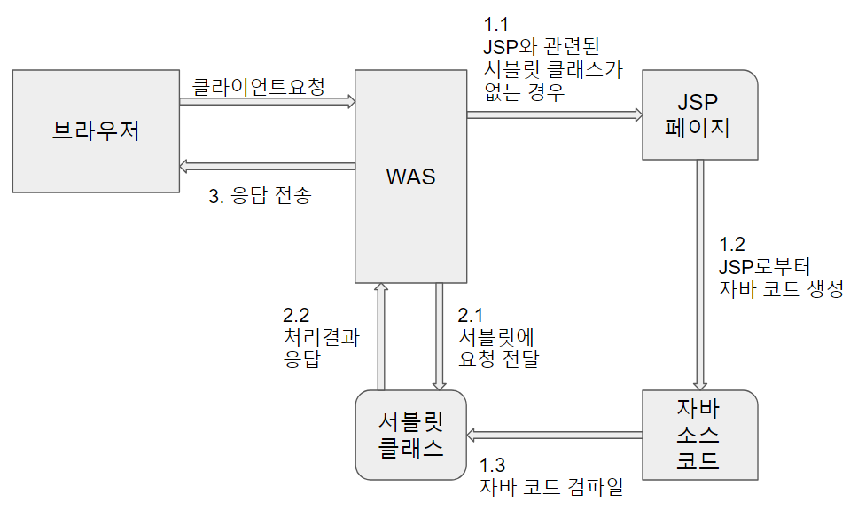
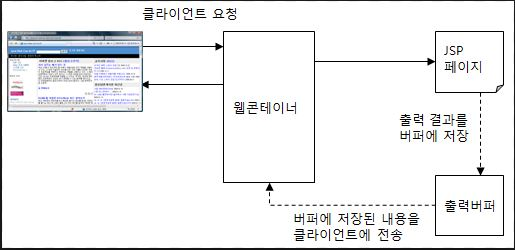
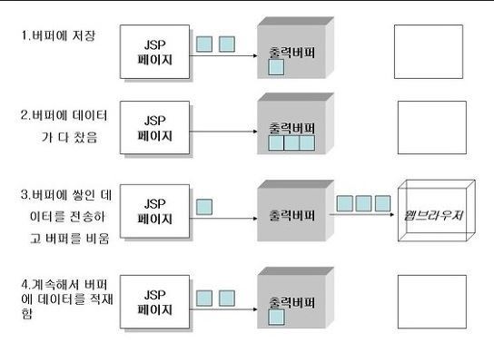
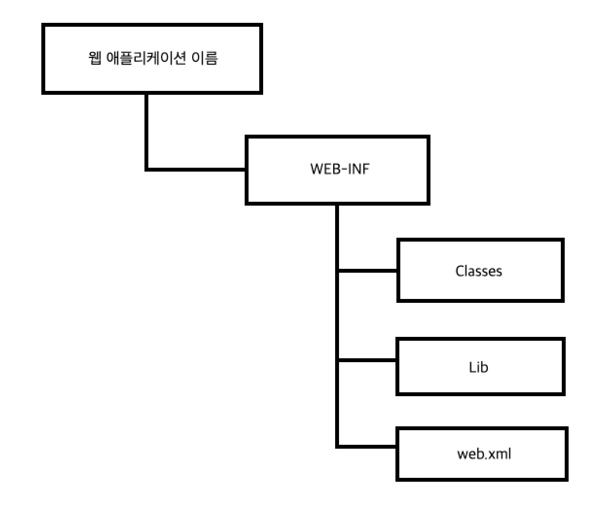

- [JSP 처리 과정](#jsp-처리-과정)
- [출력 버퍼와 응답](#출력-버퍼와-응답)
  - [page 디렉티브에서 버퍼 설정하기 - buffer 속성과 autoFalush속성](#page-디렉티브에서-버퍼-설정하기---buffer-속성과-autofalush속성)
- [웹 어플리케이션 폴더 구성과 URL 매핑](#웹-어플리케이션-폴더-구성과-url-매핑)
  - [웹 어플리케이션 폴더와 URL의 관계](#웹-어플리케이션-폴더와-url의-관계)
  - [웹 어플리케이션 폴더 내에서의 하위 폴더 사용](#웹-어플리케이션-폴더-내에서의-하위-폴더-사용)
- [웹 어플리케이션 배포](#웹-어플리케이션-배포)
  - [톰켓에 war 파일 배포하기(사용이 드물다.)](#톰켓에-war-파일-배포하기사용이-드물다)


---

# JSP 처리 과정



- JSP에 해당하는 서블릿이 존재하지 않을 경우(과정 1.1)
  - JSP 페이지로부터 자바 코드를 생성(과정 1.2)
  - 자바 코드를 컴파일해서 서블릿 클래스를 생성(과정 1.3)
  - 서블릿에 클라이언트 요청을 전달(과정 2.1)
  - 서블릿이 요청을 처리한 결과를 응답으로 생성(과정 2.2)
  - 응답을 웹 브라우저에 전송(과정 3)
- JSP에 해당하는 서블릿이 존재하는 경우
  - 서블릿에 클라이언트 요청을 전달(과정 2.1)
  - 서블릿이 요청을 처리한 결과를 응답으로 생성(과정 2.2)
  - 응답을 웹 브라우저에 전송(과정 3)

톰캣은 work 폴더에 JSP를 변환한 자바 소스 코드와 서블릿 클래스를 생성한다.

>JSP를 실행한다는 말은 JSP 페이지를 컴파일한 결과인 서블릿 클래스를 실행한다는 의미

---

# 출력 버퍼와 응답

JSP 페이지는 응답 결과를 곧바로 웹 브라우저에 전송하지 않는다.

- 출력 버퍼라고 불리는 곳에 임시로 응답 결과를 저장했다가 한 번에 브라우저에 전송한다.



JSP 페이지가 생성하는 출력 내용을 버퍼에 저장했다가 한꺼번에 웹 브라우저에 전송할 때 생기는 장점

- 데이터 전송 성능 향상
  - 작은 단위로 여러 번 보내는 것보다 한 번에 묶어서 보내는 것이 더 성능이 좋다.
- JSP 실행 도중에 버퍼를 비우고 새로운 내용 전송 가능
  - JSP 실행 과정에서 에러가 발생하면, 지금까지 생성한 내용을 버퍼에서 지우고 에러 화면을 출력할 수 있다.
- 버퍼가 다 차기 전까지 헤더 변경 가능
  - HTTP 프로토콜 구조상 응답 상태 코드와 함께 헤더 정보를 가장 먼저 웹 브라우저에 전송해야 한다.
    - WAS는 처음 버퍼의 내용을 웹 브라우저로 전송하기 전에 헤더 정보를 전송한다.
    - 첫 번째로 버퍼의 내용을 웹 브라우저에 전송하기 전까지는 헤더 정보를 얼마든지 변경할 수 있다.

## page 디렉티브에서 버퍼 설정하기 - buffer 속성과 autoFalush속성

buffer 속성

- JSP 페이지가 사용할 버퍼를 설정할 수 있다.
  - 버퍼의 크기 지정

```html
<%@ page buffer = "4kb" %>
```

- kb를 붙이지 않으면 JSP 페이지를 자바 코드로 변환하는 과정에서 에러 발생
- JSP 규약은 buffer 속성을 지정하지 않으면 최소한 8KB 이상의 크기를 갖는 버퍼를 사용하도록 규정하고 있다.

```html
<%@ page buffer="none" %>
```

- 버퍼를 사용하고 싶지 않다면 buffer 속성의 값을 none으로 지정한다.
  - none으로 지정한다면
    - `<jsp:forward>` 기능을 사용할 수 없다.
    - 곧바로 전송되기 때문에 출력한 내용을 취소할 수 없다.



- 3번 과정에서 버퍼에 보관된 응답 데이터를 전송하기 전에 응답 상태 코드와 응답 헤더를 먼저 전송한다.
  - 이후에는 응답 헤더 값 변경 불가

page 디렉티브는 autoFlush 속성을 제공한다.

- autoFlush값
  - true: 버퍼가 다 차면 버퍼를 플러시하고 계속해서 작업을 진행한다.
  - false: 버퍼가 다 차면 익셉션을 발생시키고 작업을 중지한다.

```html
<%@ page language="java" contentType="text/html; charset=UTF-8"
    pageEncoding="UTF-8"%>
 <%@ page autoFlush="true" buffer="1kb" errorPage="error.jsp"  %>
 <h2> 현재 autoFlush =<%= out.isAutoFlush() %></h2>
 
 <%
  for (int i=1 ; i < 25 ; i++ ) {
   out.println("남은 출력 버퍼의 크기 (out.getRemaining()) = "
                +out.getRemaining()+"<br>");
   // autoFlush = false 이면 사용자가 처리해 주어야한다.
  
   if (out.getRemaining() < 50) {
    out.println("<br>");
    out.flush();
   }
  }
 %>
 <hr size="5" color="red">
 초기 출력 버퍼의 크기 : <%= out.getBufferSize() %> byte<br>
 남은 출력 버퍼의 크기 : <%= out.getRemaining() %> byte<br>
 
</body>
</html>
```

---

# 웹 어플리케이션 폴더 구성과 URL 매핑

서블릿/JSP 규약은 웹 어플리케이션이 특정 폴더 구조를 따르도록 제한하고 있다.



- 웹 어플리케이션 폴더는 WEB-INF 폴더와 그 하위 폴더를 포함한다.
  - WEB-INF: 웹 어플리케이션 설정 정보를 담고 있는 web.xml 파일이 위치
  - WEB-INF\classes: 웹 어플리케이션에서 사용하는 클래스 파일이 위치
  - WEB-INF\lib: 웹 어플리케이션에서 사용하는 jar 파일이 위치

>서블릿 2.4/JSP 2.0 규약은 web.xml 파일을 반드시 포함해야한다.

>서블릿 2.5/JSP 2.1 규약은 이 제한이 없다.

- 다음의 경우에는 web.xml 파일을 작성해줘야 한다.
  - 서블릿을 직접 설정하는 경우
  - 리스너(Listener)를 직접 설정하는 경우
  - 특정 URL에 속하는 JSP들에 대해 공통 속성값을 설정하는 경우

## 웹 어플리케이션 폴더와 URL의 관계

톰켓에서 웹 어플리케이션은 [톰캣]\webapps 폴더에 위치한다.

- 각 폴더의 이름은 웹 어플리케이션을 실행할 때 사용되는 URL과 관련이 있다.

```
webapps\chap02 -> http://localhost:8080/chap02
webapps\chap03 -> http://localhost:8080/chap03
webapps\chap04 -> http://localhost:8080/chap04
```

`http://localhost:8080/chap04`에서 웹 어플리케이션 경로에 해당하는 "/chap04"를 컨텍스트 경로(context path)라고 한다.

- 루트 웹 어플리케이션의 경우 컨텍스트 경로는 빈 문자열이다.

request 기본 객체는 컨텍스트 경로를 제공하는 메서드를 정의하고 있다.

```java
request.getContextPath()
```

## 웹 어플리케이션 폴더 내에서의 하위 폴더 사용

하위 폴더를 사용하면 JSP 페이지를 알맞게 기능별로 분류할 수 있으므로, 웹 어플리케이션을 구현할 때에는 하위 폴더를 적극적으로 사용하는 것이 개발 과정이나 유지보수에 이롭다.

---

# 웹 어플리케이션 배포

웹 어플리케이션을 WAS에 배포하는 방법

- 대상 폴더에 파일을 직접 복사
- war 파일로 묶어서 배포

이제까지 webapps/chap03과 같은 폴더에 직접 JSP 파일을 저장했는데, 이는 톰캣 서버의 특정 폴더에 파일을 직접 복사하는 방식을 사용한 것이다.

- 로컬 PC가 아닌 다른 컴퓨터의 폴더에 복사할 경우 FTP와 같은 파일 전송 기능을 이용해서 배포한다.

## 톰켓에 war 파일 배포하기(사용이 드물다.)

웹 어플리케이션을 war파일로 묶어서 배포한다.

- war(Web Application Archive)
  - 웹 어플리케이션의 구성 요소를 하나로 묶어 놓은 파일
  - war 파일로 묶으려면 JDK의 jar 명령어 사용

cvf 옵션을 사용해서 jar 명령어를 실행하면 war 파일을 생성할 수 있다.

- c: 새로운 파일을 생성ㅎ마
- v: 세부 정보를 콘솔에 표시함
- f: 생성할 파일의 이름을 지정함

```powershell
C:\apache-tomcat-8.0.21\webapps\chap04\jar cvf chap04.war *
Manifest를 추가함
추가하는 중 : autoFlshFalse.jsp(입력 = 248)(출력 = 198)(20%를 감소함)
추가하는 중 : autoFlushTrue.jsp(입력 = 246)(출력 = 192)(21%를 감소함)
추가하는 중 : contextPath.jsp(입력 = 231)(출력 = 197)(17%를 감소함)
```

chap04.war *

- 생성할 파일 이름
- 파일 확장자로 "war"를 사용해서 war 파일임을 알 수 있도록 했다.
- 마지막의 "*"은 현재 폴더의 모든 파일과 하위 폴더가 대상임을 의미
- 즉, chap04 폴더에 포함된 모든 파일과 폴더를 묶어서 chap04.war 파일을 만든다.
