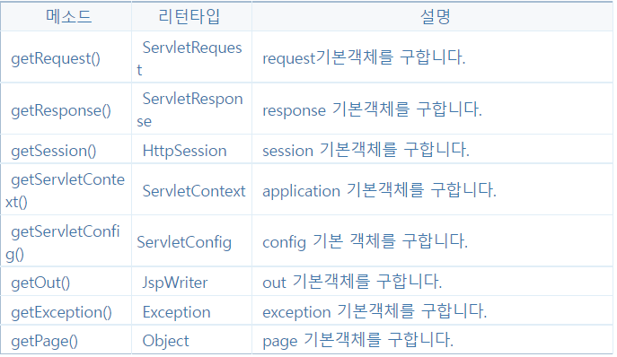

- [기본 객체](#기본-객체)
- [out 기본 객체](#out-기본-객체)
  - [out 기본 객체의 출력 메서드](#out-기본-객체의-출력-메서드)
  - [out 기본 객체와 버퍼의 관계](#out-기본-객체와-버퍼의-관계)
- [pageContext 기본 객체](#pagecontext-기본-객체)
  - [기본 객체 접근 메서드](#기본-객체-접근-메서드)
- [application 기본 객체](#application-기본-객체)
  - [웹 어플리케이션 초기화 파라미터 읽어오기](#웹-어플리케이션-초기화-파라미터-읽어오기)
  - [서버 정보 읽어오기](#서버-정보-읽어오기)
  - [로그 메시지 기록하기](#로그-메시지-기록하기)
  - [웹 어플리케이션의 자원 구하기](#웹-어플리케이션의-자원-구하기)
- [JSP 기본 객체와 영역](#jsp-기본-객체와-영역)
- [JSP 기본 객체의 속성(Attribute) 사용하기](#jsp-기본-객체의-속성attribute-사용하기)
  - [속성의 값 타입](#속성의-값-타입)
  - [속성의 활용](#속성의-활용)

---

# 기본 객체


- exception 기본 객체는 에러 페이지에서만 사용 가능

>page 기본 객체는 JSP를 변환한 자바 클래스의 인스턴스를 나타낸다.

---

# out 기본 객체

JSP 페이지가 생성하는 모든 내용은 out 기본 객체를 통해 전송한다.


```html
<%@ page language="java" contentType="text/html; charset=UTF-8"
    pageEncoding="UTF-8"%>
<!DOCTYPE html>
<html>
<head>
<meta charset="UTF-8">
<title>기본객체 사용</title>
</head>
<body>
<% 
  out.println("안녕하세요?");
%>
<br>
out 기본 객체를 사용하여
<%
   out.println("출력한 결과 입니다.");
%>
</body>
</html>
```

- out 기본 객체는 스크립트릿 코드 블록을 사용하는 코드가 늘어나므로 거의 쓰지 않는다.

## out 기본 객체의 출력 메서드

out 기본객체는 응답 생성을 위해 세 가지 메서드를 제공한다.

- print(): 데이터를 출력
- println(): 데이터를 출력하고, 줄바꿈 문자를 출력
- newLine(): 줄바꿈 문자를 출력

## out 기본 객체와 버퍼의 관계

JSP 페이지가 사용하는 버퍼는 실제로 out 기본 객체가 내부적으로 사용하고 있는 버퍼이다.

out기본 객체의 버퍼 관련 메서드


- isAutoFlush() 메서드의 리턴값을 결정하는 것은 page 디렉티브의 autoFlush 속성이다.
  - autoFlush가 false면 isAutoFlush()도 false를 반환한다.

```html
<%@ page language="java" contentType="text/html; charset=UTF-8"
    pageEncoding="UTF-8"%>
<%@ page buffer="8kb" autoFlush="false" %>
<!DOCTYPE html>
<html>
<head>
<meta charset="UTF-8">
<title>버퍼 정보</title>
</head>
<body>
 
버퍼 크기 : <%= out.getBufferSize() %><br>
남은 크기 : <%= out.getRemaining() %><br>
auto flush : <%= out.isAutoFlush() %><br>
 
</body>
</html>
```


```html
<%@ page language="java" contentType="text/html; charset=UTF-8"
    pageEncoding="UTF-8"%>
<!DOCTYPE html>
<html>
<head>
<meta charset="UTF-8">
<title>pageContext Test</title>
</head>
<body>
<h2> pageContext</h2>
 
<%pageContext.getOut().println("include.html을 추가"); %><br>
<% out.println("include.html 2222을 추가"); %><br>
<%= "include.html 333을 추가" %>
 
<hr size="5" color="green">
 
  <% pageContext.include("include.html"); %>
 
 
<hr size="5" color="red">
 
</body>
</html>
```

```html
<font color="cyan">
다른 화일을 삽입하는 include(), 제어권을 넘기는 forward()메소드 제공
</font>
```


---

# pageContext 기본 객체

pageContext 기본 객체는 JSP 페이지와 일대일로 연결된 객체

- 직접 사용하는 경우는 드물다.

기능

- 기본 객체 구하기
- 속성 처리하기
- 페이지의 흐름 제어하기
- 에러 데이터 구하기

## 기본 객체 접근 메서드



- getException() 메서드는 JSP 페이지가 에러 페이지인 경우에만 의미가 있다.
- getRequest()이 리턴하는 객체의 타입
  - HttpServletRequest
- getResponse()이 리턴하는 객체의 타입
  - HttpServletResponse

```html
<%@ page language="java" contentType="text/html; charset=UTF-8"
    pageEncoding="UTF-8"%>
<!DOCTYPE html>
<html>
<head>
<meta charset="UTF-8">
<title>pageContext 기본객체</title>
</head>
<body>
<%
   HttpServletRequest httpRequest =
          (HttpServletRequest)pageContext.getRequest();
%>
 
request 기본객체와 pageContext.getRequest()의 동일여부 :
 
<%= request == httpRequest %>
 
<br>
 
pageContext.getout() 메소드를 사용한 데이터 출력 :
 
<% pageContext.getOut().println("안녕하세요!"); %>
 
</body>
</html>
```


---

# application 기본 객체

## 웹 어플리케이션 초기화 파라미터 읽어오기

웹 어플리케이션에서 사용할 수 있는 초기화 파라미터는 WEB-INF\web.xml 파일에 `<context-param>` 태그를 사용하여 추가한다.

```
<context-param>
   <description>파라미터 설명 (필수 아님)</description>
   <param-name>파라미터이름</param-name>
   <param-value>파라미터 값</param-value>
</context-param>
```

- web.xml 파일에 초기화 파라미터를 추가하면, JSP는 application 기본 객체가 제공하는 메서드를 사용해서 초기화 파라미터를 사용할 수 있다.


- 위 메서드를 실제로 사용하려면 초기화 파라미터를 web.xml 파일에 추가해야 한다.
  - 톰켓은 web.xml 파일이 변경되면 웹 어플리케이션을 재시작한다.


```html
<%@ page contentType="text/html; charset=UTF-8" %>
<%@ page import="java.util.Enumeration" %>
<html>
<head>
  <title>초기화 파라미터 읽어오기</title>
</head>
<body>

초기화 파라미터 목록:
<ul>
  <%
    Enumeration<String> initParamEnum = application.getInitParameterNames();
    while (initParamEnum.hasMoreElements()) {
      String initParamName = initParamEnum.nextElement();
  %>
  <li>
    <%= initParamName %> =
    <%= application.getInitParameter(initParamName) %>
<%}%>
</ul>
</body>
</html>
```


- web.xml 파일에서 설정한 웹 어플리케이션 초기화 파라미터의 이름과 같이 출력되는 것을 확인 가능

## 서버 정보 읽어오기

application 기본 객체가 제공하는 서버 정보 관련 메서드


- 위 메서드를 사용하면 현재 서버 정보 및 지원하는 서블릿 API버전을 출력할 수 있다.

```html
<%@ page contentType="text/html; charset=UTF-8"%>
<html>
<head>
<title>서버정보 출력</title>
</head>
<body>
 
서버 정보 : <%= application.getServerInfo() %> <br>
서블릿 규약 메이저 버전 : <%=application.getMajorVersion() %> <br>
서블릿 규약 마이너 버전 : <%=application.getMinorVersion() %> <br>
 
</body>
</html>
```


## 로그 메시지 기록하기

application 기본 객체는 웹 컨테이너가 사용하는 로그 파일에 로그 메시지를 기록할 수 있도록 메서드를 제공한다.


```html
<%@ page contentType="text/html; charset=UTF-8"%>

<html>
<head><title>메시지 기록</title></head>
<body>
<%
  application.log("로그메시지 기록");
%>

<%
  log("로그 메세지 기록2");
%>

</body>
</html>
```

## 웹 어플리케이션의 자원 구하기

JSP 페이지에서 웹 어플리케이션 폴더에 위치한 파일을 사용해야 할 때가 있다.

```html
<%@ page contentType="text/html; charset=UTF-8"%>
<%@ page import="java.io.*"%>
<html>
<head><title>절대 경로 사용하여 자원 읽기</title></head>
<body>
<%
  char[] buff = new char[128];
  int len = -1;

  String filePath = "C:\\Program Files\\Apache Software Foundation\\Tomcat 9.0\\webapps\\chap05\\message\\notice.txt";
  try (InputStreamReader fr = new InputStreamReader(new FileInputStream(filePath), "UTF-8")) {
    while ((len = fr.read(buff)) != -1) {
      out.print(new String(buff, 0, len));
    }
  } catch (IOException ex) {
    out.println("익셉션 발생: " + ex.getMessage());
  }
%>
</body>
</html>
```


- 출력이 잘 되지만, 위의 코드처럼 절대 경로를 사용한다면 나중에 유지보수에 문제가 생길 수 있다.

이 문제를 해결하기 위해서 application 기본 객체는 웹 어플리케이션의 파일에 접근할 수 있는 메서드를 제공한다.


```html
<%@ page language="java" contentType="text/html; charset=UTF-8"
    pageEncoding="UTF-8"%>
<%@ page import = "java.io.*" %>
<!DOCTYPE html>
<html>
<head>
<meta charset="UTF-8">
<title>application 기본객체 사용하여 지원 읽기</title>
</head>
<body>
<%
   String resourcePath="/message/notice.txt";
%>
 
자원의 실제 경로 :<br>
<%= application.getRealPath(resourcePath) %>
<br>
-----<br>
<%=resourcePath %>의 내용<br>
-----<br>
<%
   BufferedReader br = null;
   char[] buff= new char[512];
   int len = -1;
   
   try {
       br= new BufferedReader(
               new InputStreamReader(
                   application.getResourceAsStream(resourcePath)));
       while ( (len=br.read(buff))!= -1)
       {
           out.print(new String(buff,0,len));
       }
     } catch(IOException ex)
   {
         out.println("익셉션 발생: " + ex.getMessage());
   }finally
   {
       if(br != null) try{br.close();}
       catch(IOException ex) {}
   }
%>
 
 
</body>
</html>
```

URL 객체를 리턴하는 applicatin.getResource() 메서드를 사용해서 같은 결과를 출력할 수 있는데 위의 소스에서 다음의 두 가지를 수정해 주면 됩니다.

▶ <%@ page import="java.net.URL"%> 추가

▶ Line 27 를 다음과 같이 수정
　 URL url = application.getResource(resourcePath);
　 br = new BufferedReader(new InputStreamReader(url.openStream()));

- 웹 어플리케이션의 디렉터리 경로가 변경되더라도 application 기본 객체를 사용하면 웹 어플리케이션 내에서의 경로를 변경할 필요가 없습니다.

---

# JSP 기본 객체와 영역

웹 어플리케이션은 네 가지 영역(scope)으로 구성된다.

- PAGE 영역
- REQUEST 영역
- SESSION 영역
- APPLICATION 영역

PAGE 영역(하나의 JSP 페이지를 처리할 때 사용되는 영역)

- 한 번의 클라이언트 요청에 대해서 하나의 JSP 페이지를 범위로 갖는다.
- 웹 브라우저의 요청이 들어오면 JSP 페이지를 실행하는데, 이때 JSP 페이지를 실행하는 범위가 하나의 PAGE 영역이 된다.

REQUEST 영역(하나의 HTTP 요청을 처리할 때 사용되는 영역)

- 웹 브라우저의 주소에 URL을 입력하거나 링크를 클릭해서 페이지를 이동할 때, 웹 브라우저가 웹 서버에 전송하는 요청이 하나의 REQUEST 영역이 된다.
- 웹 브라우저가 요청을 보낼 때마다 새로운 REQUEST 영역이 생성된다.
- REQUEST 영역은 하나의 요청을 처리하는 데 사용되는 모든 JSP 페이지를 포함한다.

SESSION 영역(하나의 웹 브라우저와 관련된 영역)

- 세션이 생성되면 하나의 웹 브라우저와 관련된 모든 요청은 하나의 SESSION 영역에 포함된다.

APPLICATION 영역(하나의 웹 어플리케이션과 관련된 영역)

- 웹 어플리케이션을 사용하는 모든 요청 그리고 브라우저의 세션은 모두 하나의 APPLICATION 영역에 속한다.

각각의 영역은 관련된 기본 객체를 갖고 있다.

- PAGE 영역
  - pageContext 기본 객체
- REQUEST 영역
  - request 기본 객체
- SESSION 영역
  - session 기본 객체
- APPLICATION 영역
  - application 기본 객체


- 웹 브라우저의 요청을 처리하는 JSP 페이지는 새로운 PAGE 영역에 속하고, 그에 해당하는 pageContext 기본 객체를 갖는다.
- 웹 브라우저에서 하나의 요청은 하나의 request 기본 객체와 관련된다.
  - 웹 브라우저가 결과를 받으면 그 요청과 관련된 request 기본 객체는 사라진다.
  - 즉, 웹 브라우저가 요청할 때마다 새로운 request 기본 객체가 생성된다.
    - 매번 새로운 REQUEST 영역이 생성되는 것
- 하나의 요청을 처리하는 데 두 개 이상의 JSP가 사용될 경우
  - 같은 request 기본 객체를 공유한다.
- 하나의 웹 브라우저는 하나의 세션과 관련된다.
  - 서로 다른 두 개의 웹 브라우저가 같은 JSP 페이지를 사용해도 두 웹 브라우저는 서로 다른 SESSION 영역에 포함되며, 서로 다른 session 기본 객체를 사용한다.
- 모든 JSP는 한 개의 application 기본 객체를 공유하며, application 기본 객체는 APPLICATION 영역에 포함된다.

---

# JSP 기본 객체의 속성(Attribute) 사용하기

네 개의 기본객체 pageContext, request, session, application은 속성을 갖는다.

- 각 기본 객체가 존재하는 동안 속성 사용 가능
- 속성
  - JSP 페이지 사이에서 정보를 주고받거나 공유하기 위한 목적으로 사용
  - <속성이름, 값> 형태
- 다음의 메서를 사용해서 속성을 추가, 값 변경, 삭제할 수 있다.


```html
<%@ page language="java" contentType="text/html; charset=UTF-8"
    pageEncoding="UTF-8"%>
    
 <% 
    String name = request.getParameter("name");
    String value = request.getParameter("value");
    
    if(name!=null &&value !=null)
    {
        application.setAttribute(name,value);
    }
 %>
<!DOCTYPE html>
<html>
<head>
<meta charset="UTF-8">
<title>application 속성 지정</title>
</head>
<body>
<%
 if(name != null && value !=null) {
%>
application 기본객체의 속성을 설정 :
 
<%= name %> = <%= value %>
<%
 } else {
%>
application 기본 객체의 속성 설정 안함
<%
 }
%>
 
</body>
</html>
```


## 속성의 값 타입

속성의 이름은 String 타입이지만, 값은 모든 클래스 타입이 올 수 있다.

기본 객체의 속성값을 지정하고 읽어오는 메서드

```java
public void setAttribute(String name, Object value)
public Object getAttribute(String name)
```

- 파라미터 타입과 리턴타입이 Object
  - 모든 클래스 타입을 속성의 값으로 사용할 수 있다는 것을 뜻한다.

```java
session.setAttribute("session_start",new java.util.Date());
session.setAttribute("memberid","madvirus");
application.setAttribute("application_temp",new File("c:\\temp"));
```

- 위의 코드는 각각 Date, String, File 타입의 객체를 속성값으로 사용하고 있다.
  - 다양한 타입의 값을 속성값으로 지정했으므로 getAttribute() 메서드로 속성값을 읽을 때에는 알맞게 다시 변환해줘야 한다.

```java
Date date = (Date)session.getAttribute("session_start");
String memberID = (String)session.getAttribute("memberid");
File tempDir = (File)application.getAttribute("application_temp");
```

```java
//int의 래퍼 타입인 Integer를 이용해서 값을 설정
request.setAttribute("age", new Integer(20));
Integer ageAttr = (Integer)request.getAttribute("age");
int ageValue=ageAttr.intValue();
```

- 기본 데이터 타입의 값은 래퍼 타입을 대신 사용해야 한다.
- 자바는 오토 박싱/언박싱이 가능하므로 기본 타입으로 사용해도 된다.

```java
//int 값 20이 자동으로 Integer로 변환되어 속성 값으로 저장
request.setAttribute("age",20);
//Integer 타입의 값이 자동으로 int타입으로 변환됨
int age= (Integer)request.getAttribute("age");
```

## 속성의 활용

속성은 기본 객체에 따라 쓰임새가 다르다.


속성을 저장하기 위해 가장 많이 사용하는 기본 객체

- request
  - MVC(Model-View-Controller) 패턴에 기반해서 웹 어플리케이션을 개발할 때 주로 사용
- session
  - 로그인, 로그아웃과 같이 사용자의 인증정보를 저장할 때 사용
