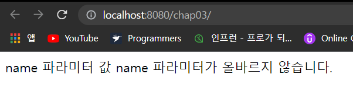
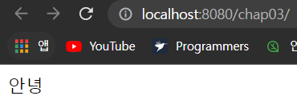
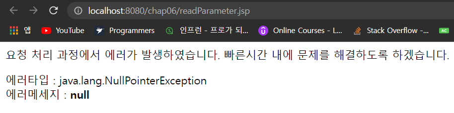
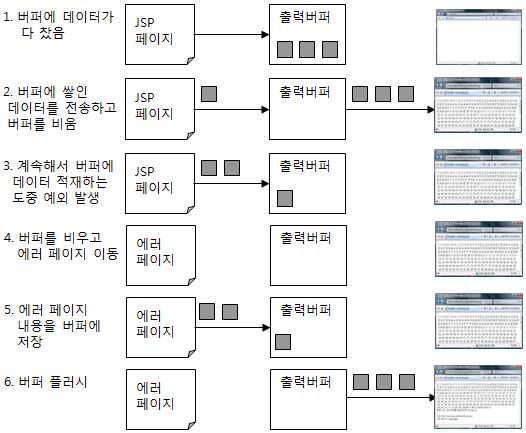
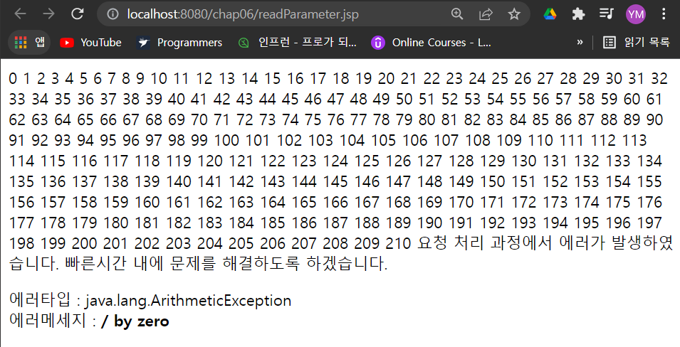

- [익셉션 직접 처리하기](#익셉션-직접-처리하기)
- [에러 페이지 지정하기](#에러-페이지-지정하기)
- [에러 페이지 작성하기](#에러-페이지-작성하기)
- [응답 상태 코드별로 에러 페이지 지정하기](#응답-상태-코드별로-에러-페이지-지정하기)
- [익셉션 타입별로 에러 페이지 지정하기](#익셉션-타입별로-에러-페이지-지정하기)
- [에러 페이지의 우선순위와 에러 페이지 지정 형태](#에러-페이지의-우선순위와-에러-페이지-지정-형태)
- [버퍼와 에러 페이지의 관계](#버퍼와-에러-페이지의-관계)


---

# 익셉션 직접 처리하기

try-catch를 이용해서 익셉션이 발생할 때 알맞은 응답을 생성할 수 있다.

```html
<%@ page language="java" contentType="text/html; charset=UTF-8"
         pageEncoding="UTF-8"%>
<%@ page errorPage="viewErrorMessage.jsp" %>
<!DOCTYPE html>
<html>
<head>
    <meta charset="UTF-8">
    <title>파라미터 출력</title>
</head>
<body>
name 파라미터 값

<% try{ %>
<%=request.getParameter("name").toUpperCase() %>
<% } catch (Exception e){ %>
name 파라미터가 올바르지 않습니다.
<%}%>
</body>
</html>
```



---

# 에러 페이지 지정하기

JSP는 실행 도중 익셉션이 발생할 때 에러 화면 대신 지정한 JSP 페이지를 보여줄 수 있는 기능을 제공하고 있다.

- 익셉션이 발생하면 보여줄 JSP 페이지는 page 디렉티브의 errorPage 속성을 사용해서 지정한다.

```html
<%@ page contentType="text/html; charset=UTF-8" %>
<%@ page errorPage="error/viewErrorMessage.jsp" %>
<html>
<head>
    <title>에러 발생</title>
</head>
<body>

name 파라미터 값: <%= request.getParameter("name").toUpperCase()%>

</body>
</html>
```



---

# 에러 페이지 작성하기

page 디렉티브의 errorPage 속성을 사용해서 에러 페이지를 지정하면, 에러가 발생할 때 지정한 에러 페이지를 사용하게 된다.

- 에러 페이지에 해당하는 JSP 페이지는 page 디렉티브의 isErrorPage 속성의 값을 "true"로 지정해야 한다.

```html
<%@ page  contentType="text/html; charset=UTF-8" %>
<%@ page isErrorPage="true" %>
<html>
<head>
    <title>에러 발생</title>
</head>
<body>

요청 처리 과정에서 에러가 발생하였습니다.
빠른시간 내에 문제를 해결하도록 하겠습니다.
<p>
에러타입 : <%= exception.getClass().getName() %><br>
에러메세지 : <b><%=exception.getMessage() %></b>

</body>
</html>
```

- page 디렉티브의 isErrorPage 속성값을 "true"로 지정하면, JSP 페이지는 에러 페이지가 된다.
  - 에러 페이지로 지정된 JSP는 exception 기본 객체를 사용할 수 있다.
    - exception 기본 객체는 JSP 실행 과정에서 발생한 익셉션 객체에 해당한다.



IE에서는 서버에서 전송한 응답 화면이 아닌 자체적으로 제공하는 오류 메시지 화면을 출력한다.

- 응답의 상태 코드가 400, 404, 500 등의 에러코드
- 전체 응답 결과 데이터의 길이가 512바이트보다 작을 때

따라서 IE에서도 에러 페이지의 내용이 올바르게 출력되기 ㄹ원하면, 에러 페이지가 생성하는 응답 데이터가 512바이트보다 커야한다.

```html
<%@ page language="java" contentType="text/html; charset=UTF-8"
    pageEncoding="UTF-8"%>
<%@ page isErrorPage = "true"%>
<html>
...
...
</html>
<!--
막약 에러 페이지의 길이가 513바이트보다 작다면,
인터넷 익스플로러는 이페이지가 출력하는 출력하는 에러페이지를 출력하지 않고
자체적으로 제공하는 'HTTP오류메세지' 화면을 출력할 것입니다.
만약 에러 페이지의 길이가 513 바이트보다 작은데
에러페이지의 내용의 인터넷 익스플로러에서도 올바르게 출력되길 원한다면,
응답 결과에 이 주석과 같은 내용을 포함시켜서
에러 페이지으 길이가 513 바이트 이상이 되도록 해주어야 합니다.
-->
```

- 주석을 늘려서 데이터를 크게하면 IE에서도 에러 페이지가 출력된다.

---

# 응답 상태 코드별로 에러 페이지 지정하기

JSP/서블릿은 에러 코드별로 사용할 에러 페이지를 web.xml 파일에 추가하여 지정할 수 있다.

```xml
<?xml version="1.0" encoding="UTF-8"?>
 
<web-app ...>
  ..
  <error-page>
    <error-code>에러코드</error-code>
    <location>에러페이지의 URI</location>
  </error-page>
  ..
</web-app>
```

- `</error-page>` 태그는 한 개의 에러 페이지를 지정
- `<error-code>` 태그는 에러 상태 코드를 지정
- `<location>` 태그는 에러 페이지로 사용할 JSP 파일의 경로를 지정

```xml
<?xml version="1.0" encoding="euc-kr"?>
 
<web-app xmlns="http://java.sun.com/xml/ns/javaee"
     xmlns:xsi="http://www.w3.org/2001/XMLSchema-instance"
     xsi:schemaLocation="http://java.sun.com/xml/ns/javaee
                         http://java.sun.com/xml/ns/javaee/web-app_3_0.xsd"
     version="3.0">
 
    <error-page>
       <error-code>404</error-code>
       <location>/error/error404.jsp</location>
    </error-page>
 
    <error-page>
       <error-code>500</error-code>
       <location>/error/error500.jsp</location>
    </error-page>
```

```html
<%@ page language="java" contentType="text/html; charset=UTF-8"
         pageEncoding="UTF-8"%>
<!DOCTYPE html>
<html>
<head>
    <meta charset="UTF-8">
    <title>404 에러발생</title>
</head>
<body>

<strong>요청한 페이지는 존재하지 않습니다 :</strong>
<br><br>
주소를 올바르게 입력했는지 확인해보시기 바랍니다.

</body>
</html>
<!--
만약 에러 페이지의 길이가 513바이트보다 작다면,
...
-->
```

응답 상태 코드

- 200 - 요청이 정상저으로 처리됨
- 307 - 임시로 페이지가 리다이렉트 됨
- 400 - 클라이언트의 요청이 잘못된 구문으로 구성됨
- 401 - 접근이 혀용되지 않음
- 404 - 지정된 URL을 처리하기 위한 자원이 존재하지 않음
- 405 - 요청된 메소드는 허용되지 않음
- 500 - 서버 내부 에러, 예를 들어 JSP에서 익셉션이 발생하는 경우이 해당
- 503 - 서버가 일시적으로 서비스를 제공할수 없음 극격하게 부하가 몰리거나 서버가 임시 보수중인 경우에 해당

---

# 익셉션 타입별로 에러 페이지 지정하기

JSP 페이지에서 발생하는 익셉션 종류별로 에러 페이지를 지정할 수 있다.

- <error-code>태그 대신에 <exception-type>태그를 사용하면 된다.

```xml
<error-page>
  <exception-type>java.lang.NullPointerException</exception-type>
  <location>error/errorNullPointer.jsp</location>
</error-page>
```

---

# 에러 페이지의 우선순위와 에러 페이지 지정 형태

이런 우선 순위 관계가 있기 때문에 에러페이지를 지정하는것이 일반적

- 별도의 에러 페이지가 필요한 경우 page 디렉티브의 errorPage속성을 사용해서 에러 페이지를 지정

- 범용적인 에러코드(404,500 등) 에 대해 web.xml에 에러페이지를 지정

- 별도로 처리해주어야 하는 익셉션 타입(심각함을 나타내는 익셉션)의 대해서는 web.xml에 <exception-type> 태그를 추가해서 별로 에러페이지를 보여줌

---

# 버퍼와 에러 페이지의 관계

버퍼를 최초로 플러시할 때까지 에러가 발생하지 않으면 웹 브라우저에 200 응답 상태 코드가 전송된다.

- 이런 이유로 에러 응답 코드와 에러 페이지의 내용을 웹 브라우저에 완전하게 전송하려면 버퍼가 플러시되면 안된다.
  - 그렇지 않으면 에러나 익셉션이 발생해도 웹 브라우저는 정상적으로 응답이 도착했다고 판단한다.



```html
<%@ page contentType="text/html; charset=UTF-8"%>
<%@ page buffer="1kb" %>
<%@ page errorPage = "error/viewErrorMessage.jsp"%>
<html>
<head>
    <title>버퍼 플러시 이후 에러 발생 결과</title>
</head>
<body>

<%
    for(int i=0; i<300 ; i++) {

     out.println(i);}
%>

<%= 1/0 %>

</body>
</html>
```

- 위의 코드를 실행하면 일부 내용이 플러시 되어 웹 브라우저에 전송되며, 그 뒤에 익셉션이 발생된다.



- 플러시 된 후에 익셉션이 발생하면 에러페이지가 원하는 형태로 출력되지 않는다.
  - 따라서, 익셉션이 발생하기 전에 버퍼가 플러시 될 가능성이 있다면 버퍼 크기를 늘려서 에러가 발생하기 전에 버퍼가 플러시 되지 않도로 해야 한다.
