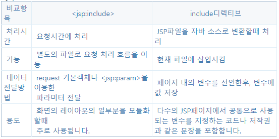

- [`<jsp:include>` 액션 태그를 이용한 공통 영역 작성](#jspinclude-액션-태그를-이용한-공통-영역-작성)
  - [`<jsp:include>` 액션 태그 사용법](#jspinclude-액션-태그-사용법)
  - [`<jsp:include>` 액션 태그를 이용한 중복 영역 처리](#jspinclude-액션-태그를-이용한-중복-영역-처리)
  - [`<jsp:param>`으로 포함할 페이지에 파라미터 추가하기](#jspparam으로-포함할-페이지에-파라미터-추가하기)
  - [`<jsp:param>`액션 태그와 캐릭터 인코딩](#jspparam액션-태그와-캐릭터-인코딩)
- [include 디렉티브를 이용한 중복된 코드 삽입](#include-디렉티브를-이용한-중복된-코드-삽입)
  - [include 디렉티브의 처리 방식과 사용법](#include-디렉티브의-처리-방식과-사용법)
  - [include 디렉티브의 활용](#include-디렉티브의-활용)
  - [코드 조각 자동 포함 기능](#코드-조각-자동-포함-기능)
  - [`<jsp:include>` 액션태그와 include 디렉티브의 비교](#jspinclude-액션태그와-include-디렉티브의-비교)
- [`<jsp:forward>` 액션 태그를 이용한 JSP 페이지 이동](#jspforward-액션-태그를-이용한-jsp-페이지-이동)
  - [`<jsp:forward>` 액션태그의 사용법](#jspforward-액션태그의-사용법)
  - [`<jsp:forward>` 액션태그와 출력 버퍼와의 관계](#jspforward-액션태그와-출력-버퍼와의-관계)
  - [`<jsp:forward>` 액션 태그의 활용](#jspforward-액션-태그의-활용)
  - [`<jsp:forward>` 액션태그를 이용해서 이동할 페이지에 파라미터 추가하기](#jspforward-액션태그를-이용해서-이동할-페이지에-파라미터-추가하기)
- [기본 객체의 속성을 이용해서 값 전달하기](#기본-객체의-속성을-이용해서-값-전달하기)

---

# `<jsp:include>` 액션 태그를 이용한 공통 영역 작성

화면 구성 요소의 코드 중복 문제를 없앨 떄 사용할 수 있는 것이 바로 `<jsp:include>`

- `<jsp:include>` 액션 태그는 위치한 부분에 지정한 페이지를 포함


- 처리 순서
  - main.jsp가 웹 브라우저의 요청을 받는다.
  - [출력내용A]를 출력 버퍼에 저장한다.
  - `<jsp:include>`가 실행되면 요청 흐름을 sub.jsp로 이동한다.
  - [출력내용B]를 출력 버퍼에 저장한다.
  - sub.jsp의 실행이 끝나면 요청 흐름이 다시 main.jsp의 `<jsp:include>`로 돌아온다.
  - `<jsp:include>` 이후 부분인 [출력내용C]를 출력 버퍼에 저장한다.
  - 출력 버퍼의 내용을 응답 데이터로 전송한다.

## `<jsp:include>` 액션 태그 사용법

```html
<jsp:include page="포함할페이지" flush="true"/>
```

- page: 포함할 JSP 페이지의 경로를 지정한다.
- flush: 지정한 JSP 페이지를 실행하기 전에 출력 버퍼를 플러시할지 여부를 지정한다.
  - true: 출력 버퍼를 플러시
  - false: 출력 버퍼를 플러시 하지 않음(기본값)
  - 플러시
    - `<jsp:include>`액션 태그를 실행하는 시점에 출력 버퍼에 저장된 [출력내용A]를 플러시한 뒤에 sub.jsp 페이지로 흐름이 이동한다는 것

main.jsp

```html
<%@ page language="java" contentType="text/html; charset=UTF-8"
         pageEncoding="UTF-8"%>
<!DOCTYPE html>
<html>
<head>
    <meta charset="UTF-8">
    <title>main</title>
</head>
<body>

main.jsp에서 생성한 내용.

<jsp:include page="sub.jsp" flush="false"/>

include 이후의 내용

</body>
</html>
```

sub.jsp

```html
<%@ page language="java" contentType="text/html; charset=UTF-8"
         pageEncoding="UTF-8"%>

<p>
    sub.jsp에서 생성한 내용.
</p>
```

main.jsp에서는 `<jsp:include>` 액션 태그를 사용하여 sub.jsp를 포함시킨다.


- main과 sub에서 생성한 결과가 처리 순서에 따라서 출력

## `<jsp:include>` 액션 태그를 이용한 중복 영역 처리

공통 영역을 별도의 JSP로 작성한다.

- 이 JSP 페이지는 `<jsp:include>` 액션 태그를 사용해서 공통 영역을 포함할 수 있다.


layout.jsp

```html
<%@ page language="java" contentType="text/html; charset=UTF-8"
    pageEncoding="UTF-8"%>
<!DOCTYPE html>
<html>
<head>
<meta charset="UTF-8">
<title>layout</title>
</head>
<body>
 
<table width="400" border="1" cellpadding="0" cellspacing="0">
<tr>
  <td colspan="2">
      <jsp:include page="top.jsp" flush="false"/>
   </td>
</tr>
 
<tr>
  <td width="100" valign="top">
      <jsp:include page="left.jsp" flush="false"/>
   </td>
   <td width="300" valign="top">
       <!--  내용 부분 : 시작 -->
       레이아웃 1
       <br><br><br>    
       <!-- 내용 부분: 끝 -->
       </td>
</tr>
 
<tr>
  <td colspan="2">
    <jsp:include page="bottom.jsp" flush="false"/>
  </td>
</tr>
</table>
 
</body>
</html>
```

top.jsp

```html
<%@ page language="java" contentType="text/html; charset=UTF-8"
    pageEncoding="UTF-8"%>
 
    상단 메뉴 : <u>HOME INFO</u>
```

left.jsp

```html
<%@ page language="java" contentType="text/html; charset=UTF-8"
    pageEncoding="UTF-8"%>
좌측메뉴:
```

bottom.jsp

```html
<%@ page language="java" contentType="text/html; charset=UTF-8"
    pageEncoding="UTF-8"%>
 
하단메뉴 : 소개 | 도움말 | 약관 | 사이트맵
```

- 상단, 좌측, 하단 영역의 코드를 직접 생성하지 않고 `<jsp:include>` 액션 태그를 사용하여 관련 영역을 생성하고 있다.


## `<jsp:param>`으로 포함할 페이지에 파라미터 추가하기

`<jsp:include>` 액션 태그는 `<jsp:param>` 태그를 이용해서 포함할 JSP 페이지에 파라미터를 추가할 수 있다.

```html
<jsp:include page="top.jsp" flush="false">
  <jsp:param name="param1" value="value1"/>
  <jsp:param name="param2" value="value2"/>
</jsp:include>
```

- `<jsp:param>`은 `<jsp:include>`의 자식 태그로 추가한다.
- `<jsp:param>`의 name속성과 value속성은 이름과 값을 의미
  - value 속성에는 값을 직접 지정하거나 표현식을 이용해서 값을 지정한다.

```html
<% String type="typeA";%>
<jsp:include page="..."/>
  <jsp:param name="name" value="홍길동"/>
  <!-- value에 값을 직접 입력 -->
  <jsp:param name="type" value=<%=type %>/> <!--표현식으로 값 입력 -->
</jsp:include>    
```

info.jsp

```html
<%@ page language="java" contentType="text/html; charset=UTF-8"
    pageEncoding="UTF-8"%>
<!DOCTYPE html>
<html>
<head>
<meta charset="UTF-8">
<title>Info</title>
</head>
<body>
 
<table width="100%" border="1" cellpadding="0" cellspacing="0">
<tr>
  <td>제품번호</td> <td>XXXX</td>
</tr>
 
<tr>
  <td>가격</td><td>10,000원</td>
</tr>
</table>
 
<jsp:include page="infoSub.jsp" flush="false">
  <jsp:param name="type" value="A"/>
</jsp:include>
</body>
</html>
```

infoSub.jsp

```html
<%@ page language="java" contentType="text/html; charset=UTF-8"
    pageEncoding="UTF-8"%>
<%
  String type=request.getParameter("type");
  if(type != null) {
%>    
<br>
<table width="100%" border="1" cellpadding="0" cellspacing="0">
<tr>
  <td>타입</td>
  <td><b><%= type%></b></td>
</tr>
<tr>
  <td>특징</td>
  <td>
<%  if(type.equals("A")) { %>
강한 내구성
<% }else if(type.equals("B")){ %>
뛰어난 대처 능력
<% } %>
</td>
</tr>
</table>
<%}%>

```


`<jsp:param>`

- 이미 동일한 이름의 파라미터가 존재하면 기존 파라미터 값을 유지하면서 새로운 값을 추가한다.


- body_main.jsp에서 기존에 사용되는 파라미터인 "cbk"를 유지하면서 `<jsp:param>`으로 "최범균" 파라미터를 추가하는 것이다.
- body_sub.jsp에서 request.getParameter("name")메소드를 실행하면 추가된 "최범균" 파라미터 값을 사용한다.
- body_sub.jsp에서 request.getParameterValues("name")메소드를 실행하면 `<jsp:param>`을 통해 추가된 파라미터 값과 이미 존재하는 파라미터 값을 모두 리턴한다.

body_main.jsp

```html
<%@ page language="java" contentType="text/html; charset=UTF-8"
    pageEncoding="UTF-8"%>
<%
   request.setCharacterEncoding("utf-8");
%>
<!DOCTYPE html>
<html>
<head>
<meta charset="UTF-8">
<title>info</title>
</head>
<body>
 
include 전 name 파라미터 값 : <%= request.getParameter("name") %>
<hr>
 
<jsp:include page="body_sub.jsp" flush="false">
  <jsp:param name="name" value="홍길동"/>
</jsp:include>
 
</hr>
 
include후 name 파라미터 값 : <%= request.getParameter("name")%>
 
 
</body>
</html>
```

body_sub.jsp

```html
<%@ page language="java" contentType="text/html; charset=UTF-8"
    pageEncoding="UTF-8"%>
<!DOCTYPE html>
<html>
<head>
<meta charset="UTF-8">
<title>info</title>
</head>
<body>
 
body_sub에서 name 파라미터 값 : <%= request.getParameter("name") %>
<br>
name 파라미터 값 목록:
<ul>>
<%
   String[] names = request.getParameterValues("name");
   for(String name : names) {
%>
 <li> <%=name %> </li>
<%
   }
%>
</ul>
</body>
</html>
```

`http://localhost:8088/chap07/body_main.jsp?name=cbk`를 입력해서 초기 파라미터를 설정한다.


## `<jsp:param>`액션 태그와 캐릭터 인코딩

```html
<%
   request.setCharacterEncoding("utf-8");
%>
```

- `​<jsp:param>` 액션 태그는 request.setCharacterEncoding() 메소드를 통해서 설정한 케릭터 셋을 사용해서 포함될 페이지에 전달할 요청 파라미터의 값을 인코딩한다.
  - 따라서 request.setCharacterEncoding() 메소드로 알맞은 캐릭터 셋을 지정해 주지 않으면 `<jsp:param>`으로 설정한 값이 올바르게 전달되지 않는다.

---

# include 디렉티브를 이용한 중복된 코드 삽입

​include 디렉티브도 `<jsp:include>` 와 마찬가지로 지정한 페이지를 현재 위치에 포함시켜주는 기능을 제공한다. 하지만 `<jsp:include>`와 달리 include디렉티브는 포함되는 방식에 있어서 큰 차이를 보인다.

- `<jsp:include>`
  - 다른 JSP로 흐름을 이동시켜 그 결과물을 현재 위치에 포함시키는 방식
- include 디렉티브
  - 다른 파일의 내용을 현재 위치에 삽입한 후에 JSP​파일을 자바 파일로 변환하고 컴파일하는 방식

## include 디렉티브의 처리 방식과 사용법

```html
<%@ include file ="포함파일" %>
```

- 여기서 file 속성은 include 디렉티브를 사용하여 포함할 파일의 경로이다.
- include디렉티브를 사용하면 JSP파일을 자바 파일로 변환하기 전에 include디렉티브에서 지정한 파일의 내용을 해당 위치에 삽입하고 그 결과로 생긴 자바 파일을 컴파일 하게 된다.


>include 디렉티브를 통해 다른 JSP에 포함되는 JSP 파일의 경우 일반 JSP파일과 구분하기 위해 확장자로 jspf를 사용하는 편이다.

---

## include 디렉티브의 활용

include 디렉티브는 코드 차원에서 다른 JSP를 포함하기 때문에 `<jsp:include>`액션 태그와는 다른 용도로 사용한다.

- 모든 JSP체이지에서 사용되는 변수 지정
- 저작권 표시와 같은 간단하면서도 모든 페이지에서 중복되는 문장

include 디렉티브를 사용하면 편리하게 공용 변수를 선언할수 있다.

- 예를 들어 구축하려는 웹 어플리케이션을 구성하는 대다수의 JSP페이지가 application 기본객체나 session 기본객체에 저장된 속성값을 읽어와 사용한다고 가정해본다면 이경우 JSP페이지들은 앞부분에서 속성값을 읽어와 변수에 저장하는 코드를 추가 할 것이다.

```html
<%
  String memberID = (String)session.getAttribute("MEMBERID");
  File tmpFolder = (File)application.getAttribute("TMPFOLDER");
%>
...
<%= memberID %>
...
<%
  fw=new FileWriter(tempFolder,"name.tmp");
  ....
%>
...
```

하지만, 기본객체로부터 특정 값을 읽어와 변수에 저장한 후 그 변수를 사용하는 JSP페이지가 많다면, 다음과 같이 변수를 지정하는 부분을 별도의 파일에 작성한후 그파일을 include디렉티브로 포함시키는 것도 좋은 방법이다.

```html
포함되는 파일 : 변수의 선언
<%
    String memberID = (String)session.getAttribute("MEMBERID")
    File tempFolder = (File)application.getAttribute("TEMPTOLDER");
%>
 
포함되는 파일 : include 디렉티브로 변수 선언 코드 삽입
<%@ include file="commonVariable.jspf"%>
...
<%= memberId%>
..
<%
  fw = new FileWriter(tempFolder,"name.tml");
  ..
%>
...
```

다음과 같이 간단한 저작권 문장을 포함하고 있는 파일도 include 디렉티브로 읽어와도 좋다.

```html
<%@ page language="java" contentType="text/html; charset=UTF-8" %>
이 사이트의 모든 저작물의 저작권은 홍길동에게 있습니다.
```

## 코드 조각 자동 포함 기능

JSP는 include 디렉티브를 사용하지 않고 JSP의 앞,뒤에 지정한 파일을 삽입하는 기능을 제공하고 있다.

예를 들어 모든 JSP페이지가 소스 코드의 위.아래에 include 디렉티브를 사용하여 공통 코드를 사입한다고 가정해보면, 다수의 JSP페이지에서 앞,뒤로 같은 파일을 include 디렉티브를 사용해서 삽입할 경우 여러 JSP에서 중복된 코드를 작성해야 한다.

- 중복되는 코드가 많다면 web.xml 파일에 설정정보를 추가해줌으로써 코드 중복을 방지할 수 있다.

web.xml

```xml
<jsp-config>
  <jsp-property-group>
    <url-pattern>/view/*</url-pattern>
    <include-prelude>/common/variable.jspf</include-prelude>
    <include-coda>/common/footer.jspf</include-coda>
  </jsp-property-group>
</jsp-confing>

```

​- `<jsp-property-group>` : JSP의 프로퍼티를 저장함을 나타낸다.

- `<url-pattern>` : 프로퍼티를 적용할  JSP파일에 해당하는 URL 패턴을 지정한다.
- `<include-prelude>` : url-pattern 태그에서 지정한 패턴에 해당되는JSP파일의 앞에 자동으로 삽입될 파일을 지정한다.
- `<include-coda>` :url-pattern 태그에서 지정한 패턴에 해당되는 JSP파일의 뒤에 자동으로 삽입될 파일을 지정합니다.

두 개 이상의 `<jsp-property-group>`태그를 이용해서 자동으로 삽입될 파일을 지정한 경우에는 입력한 순서대로 적용된다.

web.xml

```xml
<jsp-config>  
   <jsp-property-group>    
     <url-pattern>/view/*</url-pattern>    
     <include-prelude>/common/variable.jspf</include-prelude>    
     <include-coda>/common/footer.jspf</include-coda>  
   </jsp-property-group>
 
   <jsp-property-group>    
     <url-pattern>*.jsp</url-pattern>    
     <include-prelude>/common/variable2.jspf</include-prelude>    
     <include-coda>/common/footer2.jspf</include-coda>  
   </jsp-property-group>
</jsp-confing>
```

## `<jsp:include>` 액션태그와 include 디렉티브의 비교



---

# `<jsp:forward>` 액션 태그를 이용한 JSP 페이지 이동

`​<jsp:forward>` 액션태그는 하나의 JSP 페이지에서 다른 JSP페이지로 요청 처리를 전달할때 사용한다.


- 웹 브라우저의 요청이 from.jsp에 전달된다.
- from.jsp는 `<jsp:forward>` 액션태그를 실행
- `<jsp:forward>` 액션태그가 실행되면 요청 흐름이 to.jsp로 이동
- 요청 흐름이 이동할 때 from.jsp에서 사용한 request 기본 객체와 response 기본 객체가 to.jsp로 전달된다.
- to.jsp가 응답 결과를 생성한다.
- to.jsp가 생성한 결과가 웹 브라우저에 전달된다.

중요한 점

- from.jsp가 아닌 to.jsp가 생성한 응답 결과가 웹 브라우저에 전달된다.
- from.jsp에서 사용한 request.response 기본객체가 to.jsp에 그래로 전달된다.

## `<jsp:forward>` 액션태그의 사용법

```html
<jsp:forward page="이동할페이지"/>
```

- 이동할 페이지는 웹 어플리케이션 내에서의 경로를 나타내며 직접 값을 지정하거나 표현식의 결과를 값으로 지정할수 있다.

from.jsp

```html
<%@ page language="java" contentType="text/html; charset=UTF-8"
    pageEncoding="UTF-8"%>
    
<%--
   <jsp:foward> 액션태그를 실행하면 생성했던 출력 결과는 모두제거 됩니다.
--%>
<!DOCTYPE html>
<html>
<head>
<meta charset="UTF-8">
<title>from.jsp</title>
</head>
<body>
 
이페이지는 from.jsp가 생성한 것입니다.
 
<jsp:forward page="to.jsp"/>
 
 
</body>
</html>
```

to.jsp

```html
<%@ page language="java" contentType="text/html; charset=UTF-8"
    pageEncoding="UTF-8"%>
<!DOCTYPE html>
<html>
<head>
<meta charset="UTF-8">
<title>to.jsp</title>
</head>
<body>
 이페이지는 to.jsp가 생성한 것입니다.
</body>
</html>
```


- from.jsp에서 <jsp:forward>를 사용해서 이동한 to.jsp가 생성한 결과가 웹 브라우저에 출력된다.
- 웹브라우저의 주소는 from.jsp로 최로로 요청을 받은 jsp의 주소이다.

## `<jsp:forward>` 액션태그와 출력 버퍼와의 관계

이렇게 `<jsp:forward>` 액션 태그를 사용하는 jsp페이지의 출력 결과가 웹 브라우저에 선송되지 않은 이유는  출력 버퍼때문이다.


- 출력 버퍼를 비우고 새로운 내용을 버퍼에 삽입하기 때문에 `<jsp:forward>`를 실행하기 이전에 출력 버퍼에 저장됐던 내용은 웹 브라우저에 전송되지 않는다. 또한 `<jsp:forward>`액션 태그 뒤에 위치한 코드는 실행 조차 되지 않는다.
- `<jsp:forward>` 액션 태그가 올바르게 동작하기 위해서는 `<jsp:forward>` 액션 태그가 실행 되기전에 웹 브라우저에 데이터가 전송되면 안된다.

## `<jsp:forward>` 액션 태그의 활용

가장 일반적인 사용법

```html
<%@ page language="java" contentType="text/html; charset=UTF-8"
    pageEncoding="UTF-8"%>
<%
  String gorwardPage= null;
 
  //조건에 따라 이동할 페이지를 지정
  if(조건판단1)
  {
    forwardPage="페이지URL1";
  }
  else if(조건판단2)
  {
    forwardPage="페이지URL2";
  }
  else if(조건판단3)
  {
    forwardPage="페이지URL3";
  }
%>
 <jsp:forward page="<%=forwardPage%>"/>
```

```html
<%@ page language="java" contentType="text/html; charset=UTF-8"
    pageEncoding="UTF-8"%>
<%
  String option = request.getParameter("option");
 
  //조건에 따라 이동할 페이지를 지정
  if(option.equals("A"))
  {
%>
  ...내용
<%
  }else if(option.equals("B")) {
%>
  ...내용
<%
  }else if(option.equals("C")) {
%>
  ...내용
<%
  }
%>
```

- 내용 부분에 HTML 코드와 스크립트 코드가 섞이는 것까지 생각하면 너무 복잡해진다.
- `<jsp:forwqard>` 액션 태그를 사용하면 간결하게 코드를 작성할 수 있다.

```html
<%@ page language="java" contentType="text/html; charset=UTF-8"
    pageEncoding="UTF-8"%>
 
<%
   String forwardPage = null;
 
   //조건에 따라 이동할 페이지를 지정
   if(option.equals("A"))
   {
    forwardPage ="typeA.jsp";
   } else if(option.equals("B")) {
    forwardPage="typeB.jsp";
   } else if(option.equals("C")) {
    forwardPage ="typeC.jsp";
   }
%>
<jsp:forward page="<%= forwardPage %>"/>
```

예시

select.jsp

```html
<%@ page language="java" contentType="text/html; charset=UTF-8"
    pageEncoding="UTF-8"%>
<!DOCTYPE html>
<html>
<head>
<meta charset="UTF-8">
<title>옵션 선택화면</title>
</head>
<body>
<form action="view.jsp">
 
보고싶은 페이지 선택 :
  <select name="code">   
      <option value="A">A 페이지</option>
      <option value="B">B 페이지</option>
      <option value="C">C 페이지</option>
  </select>
  
  <input type="submit" value="value">
</form>
 
 
</body>
</html>
```

view.jsp

```html
<%@ page language="java" contentType="text/html; charset=UTF-8"
    pageEncoding="UTF-8"%>
<%
  String code = request.getParameter("code");
  String viewPageURI = null;
  
  if(code.equals("A")){
      viewPageURI="a.jsp";
  }else if(code.equals("B")){
      viewPageURI="b.jsp";
  } else if(code.equals("C")){
      viewPageURI="c.jsp";
  }
  %>
  <jsp:forward page="<%=viewPageURI %>"/>
```

a.jsp

```html
<%@ page language="java" contentType="text/html; charset=UTF-8"
    pageEncoding="UTF-8"%>
<!DOCTYPE html>
<html>
<head>
<meta charset="UTF-8">
<title>A 페이지</title>
</head>
<body>
 
이페이지는 <b><font size="5">A</font></b>입니다.
 
</body>
</html>
```


## `<jsp:forward>` 액션태그를 이용해서 이동할 페이지에 파라미터 추가하기

`<jsp:include>` 액션태그와 동일하게 `<jsp:param>`태그를 사용하면 이동할 페이지에 파라미터를 추가할 수 있다.

```html
<jsp:forward page="moveTo.jsp">
  <jsp:param name="first" value="BK"/>
  <jsp:param name="last" value="Choi"/>
</jsp:forward>
```

---

# 기본 객체의 속성을 이용해서 값 전달하기

`<jsp:include>`, `<jsp:forward>` 액션 태그는 `<jsp:param>` 액션 태그를 사용해서 파라미터를 추가로 전달하지만 String 타입의 값만 전달할 수 있다는 제약이 있다.

- 기본 객체의 속성을 이용하면 이런 변환 과정이 필요 없기 때문에 `<jsp:param>` 액션 태그를 사용할 필요가 없어진다.
  - request 기본 객체의 속성을 이용해서 필요한 값을 전달 가능하다.


makeTime.jsp

```html
<%@ page language="java" contentType="text/html; charset=UTF-8"
    pageEncoding="UTF-8"%>
<%@ page import = "java.util.Calendar" %>
<%
   Calendar cal=Calendar.getInstance();
   request.setAttribute("time",cal);
%>
<jsp:forward page="viewTime.jsp"/>
```

viewTemp.jsp

```html
<%@page import="java.util.Calendar"%>
<%@ page language="java" contentType="text/html; charset=UTF-8"
    pageEncoding="UTF-8"%>
<!DOCTYPE html>
<html>
<head>
<meta charset="UTF-8">
<title>현재시간</title>
</head>
<body>
 
<%
   Calendar cal =(Calendar)request.getAttribute("time");
%>
현재시간은 <%=cal.get(Calendar.HOUR)%>시
         <%=cal.get(Calendar.MINUTE)%>분
         <%=cal.get(Calendar.SECOND)%>초입니다.
 
</body>
</html>

```


