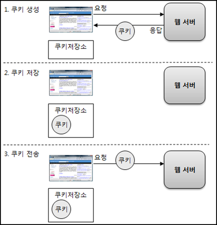
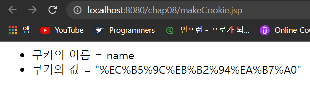
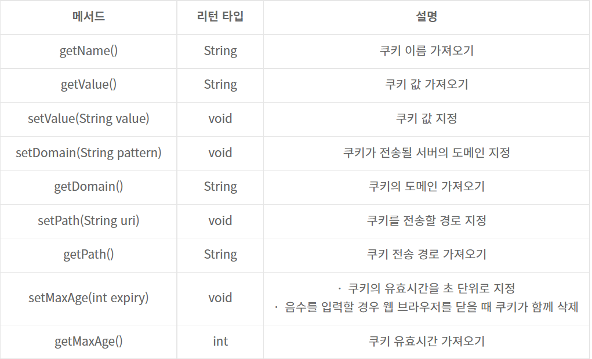
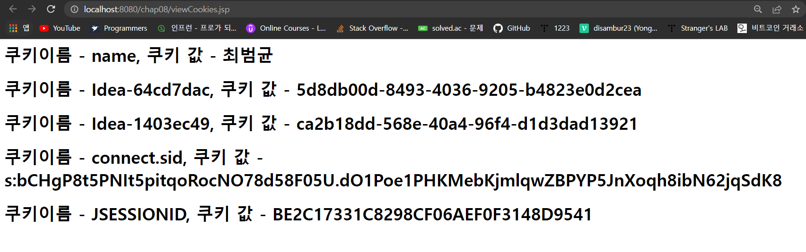
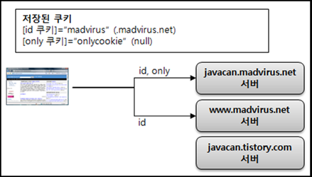
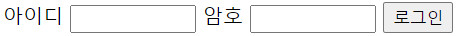
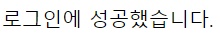
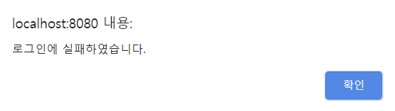

- [쿠키 사용하기](#쿠키-사용하기)
  - [쿠키의 구성](#쿠키의-구성)
  - [쿠키 생성하기](#쿠키-생성하기)
  - [쿠키 값 읽어오기](#쿠키-값-읽어오기)
  - [쿠키 값 변경 및 쿠키 삭제하기](#쿠키-값-변경-및-쿠키-삭제하기)
  - [쿠키의 도메인](#쿠키의-도메인)
  - [쿠키의 경로](#쿠키의-경로)
  - [쿠키의 유효시간](#쿠키의-유효시간)
  - [쿠키와 헤더](#쿠키와-헤더)
- [쿠키 처리를 위한 유틸리티 클래스](#쿠키-처리를-위한-유틸리티-클래스)
  - [Cookies 클래스를 이용한 쿠키 생성](#cookies-클래스를-이용한-쿠키-생성)
  - [Cookies 클래스를 이용한 쿠키 읽기](#cookies-클래스를-이용한-쿠키-읽기)
- [쿠키를 사용한 로그인 상태 유지](#쿠키를-사용한-로그인-상태-유지)
  - [로그인 처리](#로그인-처리)
  - [로그인 여부 판단](#로그인-여부-판단)
  - [로그아웃 처리](#로그아웃-처리)

---

# 쿠키 사용하기

쿠키

- 웹 브라우저가 보관하는 데이터
- 웹 브라우저는 웹 서버에 요청을 보낼 때 쿠키를 함께 전송
- 웹 서버와 웹 브라우저 양쪽에서 생성 가능
  - JSP에서 생성하는 쿠키는 웹 서버에서 생성하는 쿠키



- 쿠키 생성
  - JSP 프로그래밍에서 쿠키는 웹 서버 측에서 생성,
  - 생성한 쿠키를 응답 데이터 헤더에 저장해서 웹 브라우저에 전송
- 쿠키 저장
  - 웹 브라우저는 응답 데이터에 포함된 쿠키를 쿠키 저장소에 보관
  - 쿠키의 종류에 따라 메모리나 파일에 저장
- 쿠키 전송
  - 웹 브라우저는 저장한 쿠키를 요청이 있을 때마다 웹 서버에 전송
  - 웹 서버는 해당 쿠키를 사용해서 필요한 작업 수행

웹 브라우저에 쿠키가 저장되면, 웹 브라우저는 쿠키가 삭제되기 전까지 웹 서버에 쿠키를 전송한다.

- 웹 어플리케이션을 사용하는 동안 지속적으로 유지해야 하는 정보는 쿠키를 사용해서 저장

## 쿠키의 구성

쿠키의 핵심요소는 이름과 값

- 이름
  - 각각의 쿠키를 구별하는 데 사용되는 이름
  - 웹 브라우저는 여러 개의 쿠키를 가질 수 있는데, 각 쿠키를 구분할 때 이름을 사용
  - 보통 알파벳과 숫자만 이용한다.
- 값
  - 쿠키의 이름과 관련된 값
  - 각 쿠키는 값을 가지며 서버는 이 값을 사용해서 원하는 작업을 수행
- 유효시간
  - 쿠키의 유지 시간
  - 유효시간을 사용하면 웹 브라우저가 쿠키를 얼마 동안 보관할지를 지정할 수 있다.
    - 지정하지 않으면 웹 브라우저를 종료할 때 쿠키를 함께 삭제한다.
- 도메인
  - 쿠키를 전송할 도메인
  - 지정한 도메인으로만 쿠키를 전송하도록 제한할 수 있다.
- 경로
  - 쿠키를 전송할 요청 경로
  - 지정한 경로로만 쿠키를 전송하도록 제한할 수 있다.

## 쿠키 생성하기

JSP에서 쿠키를 생성할 때 Cookie 클래스를 사용한다.

```html
<%
    Cookie cookie = new Cookie("cookieName", "cookieValue");
    response.addCookie(cookie);
%>
```

- Cookie 클래스 생성자의 인자는 쿠키의 이름, 쿠키의 값을 지정한다.
- Cookie 객체를 생성한 후에 response 기본 객체의 addCookie() 메서드를 사용하여 쿠키를 추가한다.
  - response 기본 객체는 웹 브라우저에 쿠키 정보를 전송한다.

makeCookie.jsp

```html
<%@ page language="java" contentType="text/html; charset=UTF-8" %>
<%@ page import = "java.net.URLEncoder"%>

<%
Cookie cookie = new Cookie("name", URLEncoder.encode("최범균", "utf-8"));
response.addCookie(cookie);
%>
<html>
<head>
<title>쿠키 생성</title>
</head>
<body>

<ul>

<li>쿠키의 이름 = <%= cookie.getName() %></li> 
<li>쿠키의 값 = "<%=cookie.getValue() %>"</li>

</ul>
</body>
</html>
```



Cookie 클래스가 제공하는 메서드


## 쿠키 값 읽어오기

웹 브라우저는 요청 헤더에 쿠키를 저장해서 보낸다.

- JSP는 다음 코드를 사용해서 쿠키 값을 읽어올 수 있다.

```java
Cookie[] cookies = request.getCookies();
```

- 읽어올 쿠키가 없으면 null을 리턴한다.

viewCookies.jsp

```html
<%@ page contentType = "text/html; charset=utf-8" %>
<%@page import="java.net.URLDecoder"%>
<html>
    <head>
    </head>
    <body>
        <%
        Cookie[] cookies = request.getCookies();
        
        if(cookies != null && cookies.length > 0)
            for(Cookie cookie : cookies){
                String cookieName = cookie.getName();
                String cookieValue = URLDecoder.decode(cookie.getValue(), "UTF-8");
                %>
                <h1>쿠키이름 - <%= cookieName %>, 쿠키 값 - <%= cookieValue %> </h1>
                <%
            }
        %>
    </body>
</html
```



- null 여부를 확인하지 않고 쿠키를 사용하면 NullPointerException이 발생할 수 있으므로, request.getCookies()메서드가 리턴한 값이 null인지의 여부를 확인해야 한다.

## 쿠키 값 변경 및 쿠키 삭제하기

쿠키 값을 변경하려면 같은 이름의 쿠키를 새로 생성해서 응답 데이터로 보내면 된다.

- 쿠키의 값을 변경한다는 것은 기존에 존재하는 쿠키의 값을 변경한다는 것이다.
- 쿠키 값을 변경하려면 쿠키가 존재하는지 먼저 확인한다.

```java
Cookie[] cookies = request.getCookies();
if(cookies != null && cokies.length > 0{
    for(int i = 0; i < cookies.length; i++){
        if(cookies[i].getName().equals("name")){
            Cookie cookie = new Cookie("name", URLEncoder.encode("변경할값", " utf-8"));
            response.addCookie(cookie);
        }
    }
}
```

쿠키를 삭제하려면 다음과 같이 Cookie 클래스의 setMaxAge() 메서드를 호출할 때 인자 값으로 0을 주면 된다.

```java
Cookie cookie = new Cookie(name, value);
cookie.setMaxAge(0);
response.addCookie(cookie);
```

- Cookie 클래스는 쿠키를 삭제하는 기능을 별도로 제공하지 않는다.
  - 유효시간을 0으로 지정해준 후 응답 헤더에 추가하면, 웹 브라우저가 관련 쿠키를 삭제하는 것과 같은 것이다.

deleteCookie.jsp

```html
<%@ page language="java" contentType="text/html; charset=UTF-8" pageEncoding="UTF-8"%>
<%@ page import = "java.net.URLEncoder" %>

<%
Cookie[] cookies = request.getCookies();

if(cookies !=null && cookies.length > 0) { 
 for (Cookie cookie : cookies) {
  if(cookie.getName().equals("name")) {
   Cookie cookie1 = new Cookie("name", "");
   cookie1.setMaxAge(0); // 유효시간 0으로 지정되어 해당 name 쿠키 삭제됨.
  response.addCookie(cookie1);
  }  
 }
}
%>    

<html>
<head>

<title>쿠키 삭제</title>

</head>
<body>
name 쿠키를 삭제한다.
</body>
</html>
```

## 쿠키의 도메인

기본적으로 쿠키는 그 쿠키를 생성한 서버에만 전송된다.

- 같은 도메인을 사용하는 모든 서버에 쿠키를 보내야 할 때가 있다.
  - setDomain() 메서드 사용
    - 생성한 쿠키를 전송할 수 있는 도메인을 지정

```
.somehost.com
점으로 시작하는 경우 관련 도메인에 모든 쿠키를 전송한다.

www.somehost.com
특정 도메인에 대해서만 쿠키를 전송한다.
```

- setDomain()의 값으로 현재 서버의 도메인 및 상위 도메인만 전달할 수 있다.
  - JSP 페이지가 실행되는 서버의 주소가 mail.somehost.com이라고 한다면 setDomain() 메서드에 줄 수 있는 값은
    - mail.somehost.com
    - .somehost.com
  - www.somehost.com과 같은 다른 주소를 값은 다른 주소를 값으로 주는 경우 쿠키는 생성되지 않는다.

makeCookieWithDomain.jsp

```html
<%@ page language="java" contentType="text/html; charset=UTF-8"
    pageEncoding="UTF-8"%>
<%
Cookie cookie1 = new Cookie("id", "madvirus");
cookie1.setDomain(".somehost.com");  // .somehost.com이라는 도메인에 해당 쿠키를 전송 
response.addCookie(cookie1);

Cookie cookie2 = new Cookie("only", "onlycookie");
response.addCookie(cookie2);  // 도메인을 지정하지 않음

Cookie cookie3 = new Cookie("invalid", "invalidcookie");
cookie3.setDomain("javacan.tistory.com");
// javacon.tistory.com이라는 도메인에 해당 쿠키를 전송하지만 내 서버가 아니므로 무용지물.
response.addCookie(cookie3);
%>
<!DOCTYPE html>
<html>
<head>
<meta charset="UTF-8">
<title>쿠키 생성</title>
</head>
<body>
<%= cookie1.getName() %> = <%= cookie1.getValue() %>
[<%= cookie1.getDomain() %>]
<br />
<%= cookie2.getName() %> = <%= cookie2.getValue() %>
[<%= cookie2.getDomain() %>]
<br />
<%= cookie3.getName() %> = <%= cookie3.getValue() %>
[<%= cookie3.getDomain() %>]
</body>
</html>
```

웹 서버는 웹 서버의 도메인인 somehost.com과 관련 없는 쿠키는 저장하지 않는다.

- setDomain()을 사용하지 않은 쿠키는 그 쿠키를 생성한 서버로 전달이 된다.



## 쿠키의 경로

도메인이 쿠키를 공유할 도메인 범위를 지정한다면, 경로는 쿠키를 공유할 기준 경로를 지정한다.

- 쿠키의 경로를 지정할 때에는 Cookie 클래스의 setPath() 메서드를 사용한다.
  - 경로는 URL에서 도메인 이후의 부분에 해당

```java
Cookie cookie = new Cookie("name", "value");
cookie.setPath("/chap09");
```

- 쿠키 경로를 "/chap09"로 지정

setCookiePath.jsp

```html
<%@ page contentType = "text/html; charset=utf-8" %>
<%@ page import = "java.net.URLEncoder" %>
<%
 Cookie cookie1 = new Cookie("path1", 
   URLEncoder.encode("경로:/chap09/path1", "utf-8"));
 cookie1.setPath("/chap09/path1"); // path1 경로로 쿠키 전송
 response.addCookie(cookie1);
 
 Cookie cookie2 = new Cookie("path2", 
   URLEncoder.encode("경로:", "utf-8"));
 response.addCookie(cookie2);  // 경로 지정을 안하면 실행한 경로 안에서 쿠키 전송
 
 Cookie cookie3 = new Cookie("path3",
   URLEncoder.encode("경로:/", "utf-8"));
 cookie3.setPath("/");  // 프로젝트의 모든 경로로 쿠키 전송
 response.addCookie(cookie3);

 Cookie cookie4 = new Cookie("path4",
   URLEncoder.encode("경로:/chap09/path2", "utf-8"));
 cookie4.setPath("/chap09/path2"); // path2 경로로 쿠키 전송
 response.addCookie(cookie4);
%>
<html>
<head><title>쿠키 경로 지정</title></head>
<body>
다음과 같이 쿠키를 생성했습니다.<br>
<%= cookie1.getName() %>=<%= cookie1.getValue() %>
[<%= cookie1.getPath() %>]
<br>
<%= cookie2.getName() %>=<%= cookie2.getValue() %>
[<%= cookie2.getPath() %>]
<br>
<%= cookie3.getName() %>=<%= cookie3.getValue() %>
[<%= cookie3.getPath() %>]
<br>
<%= cookie4.getName() %>=<%= cookie4.getValue() %>
[<%= cookie4.getPath() %>]
</body>
</html>
```

|쿠키 이름|경로|
|:--|:--|
|path1|/chap09/path1|
|path2|지정하지 않았음|
|path3|/|
|path4|/chap09/path2|

setCookieWithPath.jsp를 실행하면 위 표와 같은 쿠키 목록이 웹 브라우저에 전달된다.

- 웹 브라우저는 지정한 경로에 따라 쿠키를 전송한다.
- 쿠키에 경로를 지정하지 않으면, 실행한 URL의 경로 부분을 사용한다.

일반적으로 쿠키는 웹 어플리케이션에 포함된 다수의 JSP와 서블릿에서 사용하기 때문에, 쿠키 경로를 "/"로 지정한다.

## 쿠키의 유효시간

쿠키의 유효시간을 지정하지 않으면 웹 브라우저를 종료할 때 쿠키를 함께 삭제 한다.

- 쿠키의 유효시간을 지정해 놓으면 웹 브라우저를 종료해도 유효시간 동안은 삭제되지 않는다.

setMaxAge()

- 유효시간 지정 메서드
- 초 단위로 지정

```java
Cookie cookie = new Cookie(name, value);
cookie.setMaxAge(60*60); //60초 * 60 = 1시간
response.addCookie(cookie);
```

## 쿠키와 헤더

response.addCookie()로 쿠키를 추가하면 실제로 Set-Cookie 헤더를 통해서 전달된다.

- Set-Cookie헤더는 한 개의 쿠키 값을 전달한다.

```java
쿠키이름=쿠키값; Domain=도메인값; Path=경로값; Expires=GMT형식의만료일시
```

쿠키는 출력 버퍼를 플러시하기 전에 추가해야 한다.

---

# 쿠키 처리를 위한 유틸리티 클래스

```java
package util;

import jakarta.servlet.http.Cookie;
import jakarta.servlet.http.HttpServletRequest;

import java.io.IOException;
import java.net.URLDecoder;
import java.net.URLEncoder;
import java.util.Map;

public class Cookies {

    private Map<String, Cookie> cookieMap = new java.util.HashMap<String, Cookie>();
        
        public Cookies(HttpServletRequest request){
            Cookie[] cookies = request.getCookies();
            if(cookies != null){
                for(int i = 0; i < cookies.length; i++){
                    cookieMap.put(cookies[i].getName(), cookies[i]);
                }
            }
        }
        
        public Cookie getCookie(String name){
            return cookieMap.get(name);
        }
        
        public String getValue(String name) throws IOException{
            Cookie cookie = cookieMap.get(name);
            if(cookie == null){
                return null;
            }
            return URLDecoder.decode(cookie.getValue(), "euc-kr");
        }
        
        public boolean exists(String name){
            return cookieMap.get(name) != null;
        }
        
        public static Cookie createCookie(String name, String value) throws IOException{
            return new Cookie(name, URLEncoder.encode(value, "utf-8"));
        }
        
        public static Cookie createCookie(String name, String value, String path, int maxAge) throws IOException{
            Cookie cookie = new Cookie(name, URLEncoder.encode(value, "utf-8"));
            cookie.setPath(path);
            cookie.setMaxAge(maxAge);
            return cookie;
        }
        
        public static Cookie createCookie(String name, String value, String domain, String path, int maxAge) throws IOException{
            Cookie cookie = new Cookie(name, URLEncoder.encode(value, "utf-8"));
            cookie.setDomain(domain);
            cookie.setPath(path);
            cookie.setMaxAge(maxAge);
            return cookie;
        }
}
```

- Cookie 클래스를 사용하려면 먼저 Cookie.java를 컴파일해서 Cookie.class를 생성해야 한다.

## Cookies 클래스를 이용한 쿠키 생성

```java
Cookie cookie1 = Cookies.createCookie("name", "최범균");
Cookie cookie2 = Cookies.createCookie("name2", "최범균", "/path1", -1);
Cookie cookie3 = Cookies.createCookie("id", "jsp", ".madvirus.net", "/", 60);
```

- Cookie 클래스를 직접 사용하면 다음과 같이 입력할 코드가 길어진다.

```java
Cookie cookie = new Cookie("id", URLEncoder.encode(value, "utf-8"));
cookie.setDomain(".madvirus.net");
cookie.setPath("/");
cookie.setMaxAge(60);
```

makeCookieUsingCookies.jsp

```html
<%@ page contentType="text/html;charset=UTF-8" language="java" %>
<%@ page import="util.Cookies" %>
<%
    response.addCookie(Cookies.createCookie("name", "최범균"));
    response.addCookie(Cookies.createCookie("id", "madvirus", "/chap09", -1));
%>
<html>
<head>
    <title>사용 예</title>
</head>
<body>

Cookies를 사용하여 쿠키 생성

</body>
</html>
```

## Cookies 클래스를 이용한 쿠키 읽기

웹 브라우저가 전송한 쿠키를 읽으려면 다음과 같이 Cookies 객체를 생성한 후 getCookie(), getValue(), exists() 등의 메서드를 사용하면 된다.

```java
// request 기본 객체로부터 쿠키 정보를 읽어온다.
Cookies cookies = new Cookies(request);

// 쿠키가 존재하는지 확인
if(cookies.exists("name")){
    // Cookie 클래스로 사용할 경우 getCookie() 메서드 사용
    Cookie cookie = cookies.getCookie("name");
    ...
}

if(cookies.exists("id")){
    // 값만 사용할 경우 getValue() 메서드 사용
    Cookie cookie = cookies.getValue("name");
    ...
}
```

- Cookies 클래스를 사용함으로써 쿠키를 사용하는 코드가 간결해지고 가독성이 향상된 것을 확인할 수 있다.

readCookieUsingCookies.jsp

```html
<%@ page contentType="text/html;charset=UTF-8" language="java" %>
<%@ page import="util.Cookies" %>
<%
    Cookies cookies = new Cookies(request);
%>
<html>
<head>
    <title>Cookies 사용</title>
</head>
<body>

name 쿠키 = <%=cookies.getValue("name")%><br>
<% if(cookies.exists("id")){ %>
id 쿠키 = <%=cookies.getValue("id")%> <br>
<% } %>
</body>
</html>
```

---

# 쿠키를 사용한 로그인 상태 유지

로그인 상태를 확인할 때 가장 많이 사용하는 방법이 바로 쿠키를 이용하는 것이다.

- 로그인에 성공하면 특정 이름("AUTH")을 갖는 쿠키를 생성한다.
- 해당 쿠키가 존재하면 로그인한 상태라고 판단한다.
- 로그아웃하면 해당 쿠키를 삭제한다.

## 로그인 처리

loginForm.jsp

```html
<%@ page contentType="text/html;charset=UTF-8" language="java" %>
<html>
<head>
    <title>로그인폼</title>
</head>
<body>

<form action="<%=request.getContextPath()%>/member/login.jsp" method="post">
아이디 <input type="text" name="id" size="10">
암호 <input type="password" name="password" size="10">
<input type="submit" value="로그인">
</form>

</body>
</html>
```



login.jsp

```html
<%@ page contentType="text/html;charset=UTF-8" language="java" %>
<%@ page import="util.Cookies" %>
<%
    String id = request.getParameter("id");
    String password = request.getParameter("password");

    if(id.equals(password)){
        // ID와 암호가 같으면 로그인에 성공한 것으로 판단
        response.addCookie(Cookies.createCookie("AUTH", id, "/", -1));
%>
<html>
<head>
    <title>로그인 성공</title>
</head>
<body>

로그인에 성공했습니다.

</body>
</html>
<%
    }else { // 로그인 실패시
%>
<script>
alert("로그인에 실패하였습니다.");
history.go(-1);
</script>
<%
    }
%>
```

- 로그인 성공하면



- 로그인 실패하면



## 로그인 여부 판단

로그인에 성공했음을 나타내는 쿠키를 생성한 이후, 웹 브라우저는 요청을 보낼 때마다 쿠키를 전송한다.

- 쿠키의 존재를 확인하면 로그인 상태 여부를 확인할 수 있다.

```java
Cookies cookie = new Cookies(request);
String id = cookies.getValue("AUTH");
if(id != null){
    // 로그인 한 경우의 처리
    ...
}else{
    // 로그인 하지 않은 경우의 처리
    ...
}
```

loginCheck.jsp

```html
<%@ page contentType="text/html;charset=UTF-8" language="java" %>
<%@ page import="util.Cookies" %>
<%
    Cookies cookies = new Cookies(request);
%>
<html>
<head>
    <title>로그인여부 검사</title>
</head>
<body>
<%
    if(cookies.exists("AUTH")) {
%>
아이디 "<%=cookies.getValue("AUTH")%>"로 로그인 한 상태
<%
    } else {
%>
로그인 하지 않은 상태
<%
    }
%>
</body>
</html>
```

## 로그아웃 처리

쿠키를 삭제하면 된다.

```html
<%@ page contentType="text/html;charset=UTF-8" language="java" %>
<%@ page import="util.Cookies" %>
<%
    response.addCookie(Cookies.createCookie("AUTH", "", "/", 0));
%>
<html>
<head>
    <title>로그아웃</title>
</head>
<body>

로그아웃하였습니다.

</body>
</html>
```
