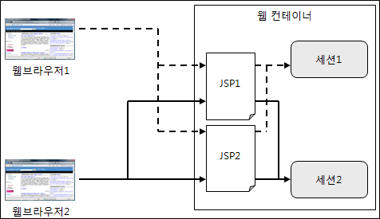
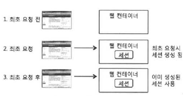
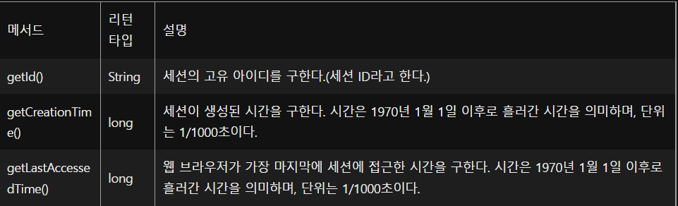
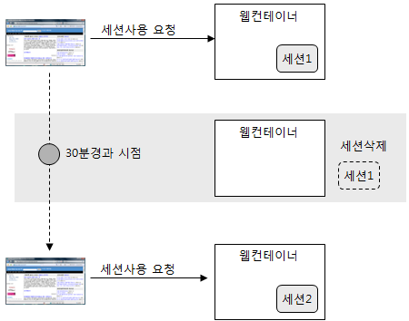

- [세션 사용하기: session 기본 객체](#세션-사용하기-session-기본-객체)
  - [세션 생성하기](#세션-생성하기)
  - [session 기본 객체](#session-기본-객체)
  - [기본 객체의 속성 사용](#기본-객체의-속성-사용)
  - [세션 종료](#세션-종료)
  - [세션 유효 시간](#세션-유효-시간)
  - [request.getSession()을 이용한 세션 생성](#requestgetsession을-이용한-세션-생성)
- [세션을 사용한 로그인 상태 유지](#세션을-사용한-로그인-상태-유지)
  - [인증된 사용자 정보 session 기본 객체에 저장하기](#인증된-사용자-정보-session-기본-객체에-저장하기)
  - [인증 여부 판단](#인증-여부-판단)
  - [로그아웃 처림](#로그아웃-처림)
- [연관된 정보 저장을 위한 클래스 작성](#연관된-정보-저장을-위한-클래스-작성)
- [서블릿 컨텍스트와 세션](#서블릿-컨텍스트와-세션)

---

# 세션 사용하기: session 기본 객체

웹 브라우저에 정보를 보관할 때 쿠키를 사용한다면, 세션은 웹 컨테이너에 정보를 보관할 때 사용한다.

- 세션은 오직 서버에서만 생성



웹 컨테이너는 기본적으로 한 웹 브라우저마다 한 세션을 생성한다.

- 같은 JSP 페이지라도 웹 브라우저에 따라 서로 다른 세션을 사용한다.
- 웹 브라우저마다 세션이 따로 존재하므로, 세션은 웹 브라우저와 관련된 정보를 저장하기에 알맞은 장소이다.
  - 쿠키
    - 클라이언트 측의 데이터 보관소
  - 세션
    - 서버 측의 데이터 보관소

## 세션 생성하기

JSP에서 세션을 생성하려면 page 디렉티브의 session 속성을 "true"로 지정하면 된다.

- page 디렉티브의 session 속성은 기본값이 true
  - false로 변경하지 않으면 세션이 생성되는 것

```html
<%@ page contentType = ... %>
<%@ page session = "true" %>
<%
    ...
    session.setAttribute("userInfo", userInfo);
    ...
%>
```



## session 기본 객체

세션을 사용한다는 것은 session 기본 객체를 사용한다는 것

- setAttribute(), getAttribute() 등의 메서드를 사용하여 속성값을 저장하거나 읽어올 수 있다.

세션은 세션만의 고유 정보를 제공하며, 이들 정보를 구할 때 사용하는 메서드는 다음과 같다.



세션 ID

- 웹 브라우저마다 별도의 세션을 갖기 때문에, 각 세션을 구분하기 위해 세션마다 할당하는 ID
- 웹 브라우저는 웹 서버에 연결할 때마다 매번 세션 ID를 보내서 웹 서버가 어떤 세션을 사용할지 판단할 수 있게 한다.
  - 웹 서버는 세션 ID를 공유해서 웹 브라우저를 위한 세션을 찾기 때문에, 웹 서버와 웹 브라우저는 세션 ID를 공유하는 방법이 필요
    - 이를 위한 것이 쿠키이다.
    - JSESSIONID
      - 세션 ID를 공유할 때 사용하는 쿠키

sessionInfo.jsp

```html
<%@ page contentType="text/html;charset=UTF-8" language="java" %>
<%@ page session="true" %>
<%@ page import="java.util.Date" %>
<%@ page import="java.text.SimpleDateFormat" %>

<%
    Date time = new Date();
    SimpleDateFormat formatter = new SimpleDateFormat("yyyy-MM-dd HH:mm:ss");
%>
<html>
<head>
    <title>세션정보</title>
</head>
<body>
세션ID: <%=session.getId()%> <br>
<%
    time.setTime(session.getCreationTime());
%>
세션생성시간: <%=formatter.format(time)%><br>
<%
    time.setTime(session.getLastAccessedTime());
%>
최근접근시간: <%=formatter.format(time)%>
</body>
</html>
```

## 기본 객체의 속성 사용

웹 어플리케이션을 실행하는 동안 지속적으로 사용해야 하는 데이터의 저장소로 세션이 적당하다.

- request 기본객체가 하나의 요청을 처리하는 데 사용되는 JSP 페이지 사이에서 공유된다면, session 기본 객체는 웹 브라우저의 여러 요청을 처리하는 JSP 페이지 사이에서 공유된다.
- setAttribute()
  - 속성에 값 저장
- getAttribute()
  - 속성값을 읽는다.

setMemberInfo.jsp

```html
<%@ page contentType="text/html;charset=UTF-8" language="java" %>
<%
    session.setAttribute("MEMBERID", "madvirus");
    session.setAttribute("NAME", "최범균");
%>
<html>
<head>
    <title>세션에 정보 저장</title>
</head>
<body>

세션에 정보를 저장하였습니다.

</body>
</html>
```

- session 기본 객체에 속성을 설정하면 세션이 종료되기 전까지는 속성값을 사용할 수 있다.

```html
<%
    String name = (String)session.getAttribute("NAME");
%>
회원명 : <%= name %>
```

쿠키 대신 세션을 사용하는 이유

- 보안에 앞선다.
  - 쿠키
    - 이름이나 데이터가 네트워크를 통해 전달되기 때문에 HTTP 프로토콜을 사용하는 경우 중간에 누군가 쿠키의 값을 읽어올 수 있다.
  - 세션
    - 세션의 값은 오직 서버에만 저장되기 때문에 중요한 데이터를 저장하기 알맞다.
- 쿠키를 사용할 수 없는 웹 브라우저가 있다.
  - 서블릿/JSP는 쿠키를 사용할 수 없는 경우, URL 재작성 방식을 사용해서 세션 ID를 웹 브라우저와 웹 서버가 공유할 수 있다.

세션보다 쿠키를 사용하는 이유

- 세션은 여러 서버에서 공유 불가하다.
  - 예) www.daum.net의 세션과 mail.daum.net의 세션이 다르다.
- 쿠키는 도메인을 이용해서 쿠키를 여러 도메인 주소에 공유할 수 있으므로 이럴 때는 쿠키를 사용한다.

## 세션 종료

session.invalidate()

- session 기본 객체를 삭제하고 session 기본 객체에 저장햇던 속성 목록도 함께 삭제한다.

closeSession.jsp

```html
<%@ page contentType="text/html;charset=UTF-8" language="java" %>
<%
    session.invalidate();
%>
<html>
<head>
    <title>세션 종료</title>
</head>
<body>

세션을 종료하였습니다.

</body>
</html>
```

## 세션 유효 시간

session 기본 객체를 사용할 때마다 세션의 최근 접근 시간은 갱신된다.

```java
session.getLastAccessedTime()
```

- 최근에 session 기본 객체에 접근한 시간을 나타낸다.
- JSP 페이지가 session 기본 객체를 사용하도록 설정했다면, 웹 브라우저가 JSP 페이지를 실행할 때마다 session 기본 객체에 접근한다.
  - 접근할 때마다 세션의 최근 접근 시간을 갱신한다.

세션은 마지막 접근 이후 일정 시간 이내에 다시 세션에 접근하지 않는 경우 자동으로 세션을 종료하는 기능을 갖고 있다.



세션 유효 시간 설정 방법

- WEB-INF\web.xml 파일 편집

web.xml

```xml
<?xml version="1.0" encoding="UTF-8"?>
<web-app xmlns="http://xmlns.jcp.org/xml/ns/javaee"
         xmlns:xsi="http://www.w3.org/2001/XMLSchema-instance"
         xsi:schemaLocation="http://xmlns.jcp.org/xml/ns/javaee http://xmlns.jcp.org/xml/ns/javaee/web-app_4_0.xsd"
         version="4.0">
<session-config>
  <session-timeout>50</session-timeout>
  <!-- 세션 타임아웃 시간을 50분으로 지정(분단위) -->
</session-config>
</web-app>
```

- session 기본 객체가 제공하는 setMaxInactiveInterval() 메서드 사용

```html
<%
    session.setMaxInactiveInterval(60 * 60);
    // 세션의 유효 시간을 60분으로 지정(초단위)
%>
```

제거되지 않는 세션 객체로 인해 메모리가 부족해지는 현상을 방지하려면, 반드시 세션 타임아웃 시간을 지정해줘야 한다.

## request.getSession()을 이용한 세션 생성

request.getSession() 메서드는 현재 요청과 관련된 session 객체를 리턴한다.

- request.getSession()을 이용해서 세션을 구하므로, page 디렉티브의 session 속성값은 false로 지정한다.

```html
<%@ page session = "false" %>
<%
    HttpSession httpSession = request.getSession();
    List list = (List)httpSession.getAttribute("list");
    list.add(productId);
%>
```

- request.getSession() 메서드는 session이 존재하면 해당 session을 리턴하고 존재하지 않으면 새롭게 session을 생성해서 리턴한다.
- request.getSession(false)를 실행하면 세션이 존재하는 경우에만 session 객체를 리턴하고 세션이 존재하지 않으면 null을 리턴한다.

```html
<%@ page session = "false" %>
<%
    HttpSession httpSession = request.getSession();
    List list = null;
    if(httpSession != null){
        list = (List)httpSession.getAttribute("list");
    }else{
     list = Collections.emptyList();
    }
%>
```

---

# 세션을 사용한 로그인 상태 유지

- 로그인에 성공하면 session 기본 객체의 특정 속성에 데이터를 기록한다.
- 이후로 session 기본 객체의 특정 속성이 존재하면 로그인한 것으로 간주한다.
- 로그아웃할 경우 session.invalidate() 메서드를 호출하여 세션을 종료한다.

## 인증된 사용자 정보 session 기본 객체에 저장하기

세션을 사용해서 로그인 상태를 유지하려면 session 기본 객체의 속성에 로그인 성공 정보를 저장하면 된다.

sessionLogin.jsp

```html
<%@ page contentType="text/html;charset=UTF-8" language="java" %>
<%
    String id = request.getParameter("id");
    String password = request.getParameter("password");

    if(id.equals(password)){
        session.setAttribute("MEMBERID", id);
%>
<html>
<head>
    <title>로그인 성공</title>
</head>
<body>

로그인에 성공했습니다.

</body>
</html>
<%
    }else { // 로그인 실패 시
%>
<script>
    alert("로그인에 실패하였습니다.")
    history.go(-1);
</script>
<%
    }
%>
```

sessionLoginForm.jsp

```html
<%@ page contentType="text/html;charset=UTF-8" language="java" %>
<html>
<head>
    <title>로그인폼</title>
</head>
<body>

<form actio="<%=request.getContextPath()%>/chap10/member/sessionLogin.jsp" method="post">
아이디 <input type="text" name="id" size="10">
암호 <input type="password" name="password" size="10">
<input type="submit" value="로그인">
</form>

</body>
</html>
```

## 인증 여부 판단

session 기본 객체에 로그인 상태를 위한 속성의 존재 여부에 따라 로그인 상태를 판단할 수 있다.

sessionLoginCheck.jsp

```html
<%@ page contentType="text/html;charset=UTF-8" language="java" %>
<%
    String memberId = (String)session.getAttribute("MEMBERID");
    boolean login = memberId == null ? false : true;
%>
<html>
<head>
    <title>로그인 여부 검사</title>
</head>
<body>

<%
    if(login){
%>
아이디 "<%=memberId%>"로 로그인 한 상태
<%
    }else{
%>
로그인하지 않은 상태
<%
    }
%>
</body>
</html>
```

## 로그아웃 처림

로그아웃을 처리할 때에는 session.invalidate() 메서드를 사용하여 세션을 종료한다.

sessionLogout.jsp

```html
<%@ page contentType="text/html;charset=UTF-8" language="java" %>
<%
    session.invalidate();
%>
<html>
<head>
    <title>로그아웃</title>
</head>
<body>

로그아웃하였습니다.

</body>
</html>
```

---

# 연관된 정보 저장을 위한 클래스 작성

만약 세션에 저장할 값의 개수가 많다면 세션에서 값을 읽어오는 코드는 다음과 같이 길어질 것이다.

```html
<%
    String memberId = (String)session.getAttribute("memberId");
    String name = (String)sessin.getAttribute("name");
    String email = (String)session.getAttribute("email");
    boolean mail = (Boolean)session.getAttribute("male");
    int age = (Integer)session.getAttribute("age");
%>
...
<%
    if(age < 18){
        ...
    }
%>
```

- 세션에 여러 속성을 사용해서 연관 정보들을 저장할 때 발생할 수 있는 오류들을 줄이기 위해 클래스를 사용한다.

```java
public class MemberInfo{
    private String id;
    private String name;
    private String email;
    private boolean male;
    private int age;
    
    // get 메서드
}
```

- 한 개의 속성으로 이용해서 저장할 수 있다.

```html
<%
    MemberInfo memberInfo = new MemberInfo(id, name);
    session.setAttribute("memberInfo", memberInfo);
%>
```

```html
<%
    MemberInfo member = (MemberInfo)session.getAttribute("memberInfo");
%>
...
<%= memberInfo.getEmail().toLowerCase() %>
```

---

# 서블릿 컨텍스트와 세션

서로 다른 두 웹 어플리케이션이 다른 세션 ID를 사용하고 다른 JSESSIONID 쿠키를 사용한다는 것은, 다시 말하면, 서로 다른 웹 어플리케이션이 세션을 공유하지 않음을 의미한다.
