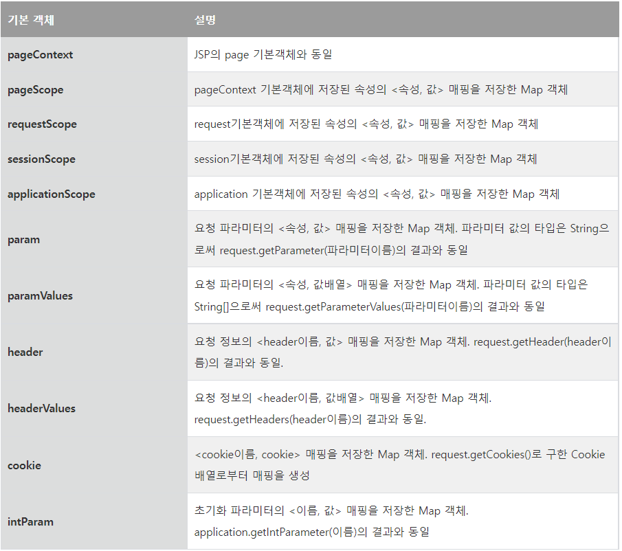
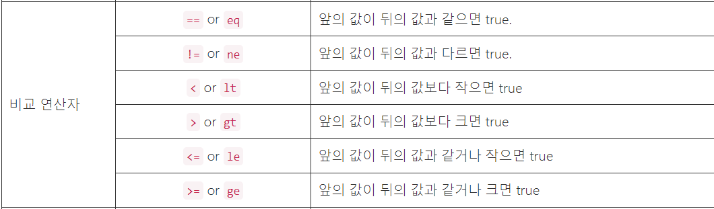
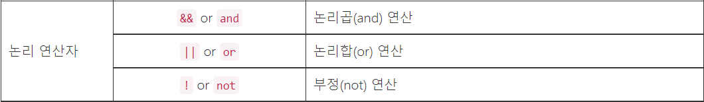
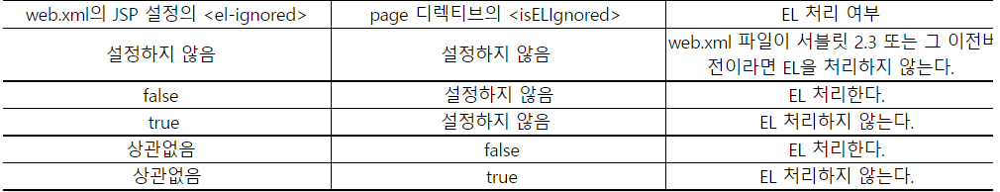

- [표현 언어(Expression Language, EL)](#표현-언어expression-language-el)
  - [EL의 구성](#el의-구성)
- [{} 형식은 실제로 값이 사용될 때 값을 계산한다](#-형식은-실제로-값이-사용될-때-값을-계산한다)
- [EL의 기초](#el의-기초)
  - [EL의 데이터 타입과 리터럴](#el의-데이터-타입과-리터럴)
  - [EL의 기본 객체](#el의-기본-객체)
  - [객체 접근](#객체-접근)
  - [객체 탐색](#객체-탐색)
  - [수치 연산자](#수치-연산자)
  - [비교 연산자](#비교-연산자)
  - [논리 연산자](#논리-연산자)
  - [empty 연산자](#empty-연산자)
  - [비교 선택 연산자](#비교-선택-연산자)
  - [문자열 연결](#문자열-연결)
  - [컬렉션](#컬렉션)
  - [세미콜론 연산자](#세미콜론-연산자)
  - [할당 연산자](#할당-연산자)
  - [특수 문자 처리하기](#특수-문자-처리하기)
- [EL에서 객체의 메서드 호출](#el에서-객체의-메서드-호출)
- [EL에서 정적 메서드 호출하기](#el에서-정적-메서드-호출하기)
  - [예제에서 사용할 클래스 작성](#예제에서-사용할-클래스-작성)
  - [함수를 정의한 TLD 파일 작성](#함수를-정의한-tld-파일-작성)
  - [web.xml 파일에 TLD 내용 추가하기](#webxml-파일에-tld-내용-추가하기)
  - [EL에서 함수 사용하기](#el에서-함수-사용하기)
- [EL에서 정적 메서드 호출하기2](#el에서-정적-메서드-호출하기2)
- [람다식 사용하기](#람다식-사용하기)
- [스트림 API 사용하기](#스트림-api-사용하기)
  - [스트림 API 기본](#스트림-api-기본)
  - [stream()을 이용한 스트림 생성](#stream을-이용한-스트림-생성)
  - [filter()를 이용한 걸러내기](#filter를-이용한-걸러내기)
  - [map()을 이용한 변환](#map을-이용한-변환)
  - [sorted()를 이용한 정렬](#sorted를-이용한-정렬)
  - [limit()을 이용한 개수 제한](#limit을-이용한-개수-제한)
  - [toList()와 toArray()를 이용한 결과 생성](#tolist와-toarray를-이용한-결과-생성)
  - [count()를 이용한 개수 확인](#count를-이용한-개수-확인)
  - [Optional 타입](#optional-타입)
  - [sum()과 average()를 이용한 수치 연산 결과 생성](#sum과-average를-이용한-수치-연산-결과-생성)
  - [min()과 max()를 이용한 최소/최대 구하기](#min과-max를-이용한-최소최대-구하기)
  - [anyMatch(), allMatch(), noneMatch()를 이용한 존재 여부 확인](#anymatch-allmatch-nonematch를-이용한-존재-여부-확인)
- [표현 언어 비활성화 방법](#표현-언어-비활성화-방법)
  - [web.xml 파일에 EL 비활성화 옵션 추가하기](#webxml-파일에-el-비활성화-옵션-추가하기)
  - [JSP 페이지에서 EL 비활성화 시키기](#jsp-페이지에서-el-비활성화-시키기)
  - [web.xml 파일의 버전에 따른 EL처리](#webxml-파일의-버전에-따른-el처리)

---

# 표현 언어(Expression Language, EL)

값을 표현하는 데 사용하는 스크립트 언어, JSP의 스크립트 요소를 보완하는 역할

- JSP의 네 가지 기본 객체가 제공하는 영역의 속성 사용
- 수치 연산, 관계 연산, 논리 연산자 제공
- 자바 클래스 메서드 호출 기능 제공
- 쿠키, 기본 객체의 속성 등 JSP를 위한 표현 언어의 기본 객체 제공
- 람다식을 이용한 함수 정의와 실행
- 스트림 API를 통한 컬렉션 처리
- 정적 메서드 실행

표현 언어를 사용하면 JSP 표현식을 사용하는 것보다 간결한 코드를 사용해서 값을 출력할 수 있다.

```html
<!-- 표현식 -->
<%= member.getAddress().getZipcode() %>

<!-- 표현 언어 -->
${member.address.zipcode}
```

## EL의 구성

EL은 다음과 같이 $와 괄호{} 그리고 표현식을 사용하여 값을 표현한다.

```html
${expr}
```

- expr부분에는 표현 언어가 정의한 문법에 따라 값을 표현하는 식

EL은 액션태그나 JSTL의 속성값으로 사용할 수 있다.

```jsp
<jsp:include page="/module/${skin.id}/header.jsp" flush="true"/>
```

액션태그나 커스텀 태그뿐만 아니라 비스크립트 요소 부분에서도 값을 출력하기 위해 사용할 수 있다.

```jsp
<b>${sessionScope.member.id}</b>님 환영합니다.
```

EL은 JSP의 스크립트 요소(스크립트릿, 표현식, 선언부)를 제외한 나머지 부분에서 사용될 수 있다.

JSP 2.1 부터는 ${} 형식뿐만 아니라 #{} 구문을 새롭게 지원한다.

- 차이점
  - EL의 값을 언제 생성하느냐

${} 형식의 EL은 ${} 구문을 분석할 때 곧바로 값을 계산한다.

```jsp
<%
    Mem m = new Mem();
    m.setName("이름1");
%>
<c:set var="m" value="<%= m %>"/>
<c:set var="name" value="${m.name}"/> <%--이 시점에서 바로 값 계산--%>
<% m.setName("이름2"); %>
${name} <%--name의 값은 "이름1"--%>
```

# {} 형식은 실제로 값이 사용될 때 값을 계산한다

```jsp
<%
    Mem m = new Mem();
    m.setName("이름1");
%>
<c:set var="m" value="<%= m %>"/>
<c:set var="name" value="#{m.name}"/> <%--이 시점에는 값 생성하지 않음--%>
<% m.setName("이름2"); %>
${name} <%--name의 값은 "이름2"--%>
<% m.setName("이름3"); %>
${name} <%--name의 값은 "이름3"--%>
```

- 이렇게 #{} 형식의 EL은 실제로 값이 필요할 때 계산을 수행하기 때문에 Deferred Expression이라고 부른다.
- #{}은 곧바로 값이 생성되는 것이 아니기 때문에 JSP의 템플릿 텍스트에서는 사용할 수 없다.
  - 사용이 드물다.

---

# EL의 기초

## EL의 데이터 타입과 리터럴

불리언(booean) 타입

- true, false

정수 타입

- 음수의 경우 -가 붙는다.
- EL에서 정수 타입은 java.lang.Long 타입이다.

실수 타입

- 소수점을 사용 가능
- 지수형으로 표현 가능
- EL에서 실수 타입은 java.lang.Double 타입이다.

문자열 타입

- 따옴표로 둘러싼 문자열
- 만약 작은 따옴표(')를 사용해서 표현하는 경우 값에 포함된 작은따옴표는 (\')와 같이 \기호와 함께 사용해야 한다.
  - \기호는 `\\`로 표시한다.

널 타입

- null

```jsp
${10}은 정수, ${10.0}은 실수
```

## EL의 기본 객체

JSP는 EL에서 사용할 수 있는 기본 객체도 제공하고 있다.

- 이 객체를 이용해서 파라미터나 세션 속성값 등을 표현 언어에서 사용 가능하다.

EL에서 사용할 수 있는 기본 객체



useELObject.jsp

```jsp
<%@ page contentType="text/html; charset=utf-8" %>
<%
    request.setAttribute("name", "최범균");
%>
<html>
<head><title>EL Object</title></head>
<body>

요청 URI: ${pageContext.request.requestURI}<br>
request의 name 속성: ${requestScope.name}<br>
code 파라미터: ${param.code}

</body>
</html>
```

- 실행해보면 code 파라미터 값이 존재하지 않지만, null이 출력되지 않았다.
  - EL은 값이 존재하지 않는 경우 아무것도 출력하지 않는다.

예를 들어, 이름이 "ID"인 쿠키의 값을 출력하고 싶다면 다음과 같은 표현 언어를 사용하면 된다.

```jsp
${cookie.ID.value}
```

- 여기서 표현 언어의 cookie 기본 객체는 <쿠키 이름, Cookie 객체> 맵이기 때문에 cookie.ID는 이름이 ID인 Cookie 객체를 리턴한다.
  - cookie.ID.value가 출력하는 값은 이름이 ID인 Cookie 객체의 getValue() 메서드가 리턴한 값이 된다.

## 객체 접근

```jsp
${cookie.ID.value}
```

- EL에서 cookie 기본 객체는 <쿠키 이름, Cookie 객체>의 매핑 정보를 담고 있는 객체이다.
  - 어떻게 cookie.ID를 처리하는가?
  - cookie.ID 결과 타입은 Cookie 객체인데 어떻게 cookie.ID.value를 처리하는가?

EL 언어는 객체에 저장된 값에 접근할 때 점(.)이나 대괄호([])를 사용한다.

- 두 연산자는 동일한 연산자
  - cookie.name = cookie['name']

```jsp
<표현1>.<표현2>

또는

<표현1>[<표현2>]
```

<표현1>.<표현2> 과정

1. <표현1>을 <값1>로 변환한다.
2. <값1>이 null이면 null을 리턴한다.
3. <값1>이 null 아니면 <표현2>를 <값2>로 변환한다.
     - <값2>도 null이면 null을 리턴한다.
4. <값1>이 Map, List 배열인 경우
     - <값1>이 Map이라면
       - <값1>.containsKey(<값2>)가 false이면 null을 리턴한다.
       - true라면 <값1>.get(<값2>)를 리턴한다.
     - <값1>이 List나 배열이면
       - <값2>가 정수값인지 검사한다.(정수값이 아니면 에러발생)
       - <값1>.get(<값2>) 또는 Array.get(<값1>, <값2>)를 리턴한다.
       - 위 코드가 익셉션을 발생시키면 에러가 발생한다.
5. <값1>이 다른 객체이면
       - <값2>를 문자열로 변환한다.
       - <값1> 객체가 <값2>를 이름으로 갖는 읽기 가능한 프로퍼티를 포함하고 있다면 프로퍼티의 값을 리턴한다.
       - 그렇지 않을 경우 에러를 발생한다.

위의 과정에 맞춰서 ${cookie.ID.value} EL 표현식을 분석해보자.

1. cookie는 EL이 제공하는 기본 객체로 타입은 Map이다.(과정 중 4-A)
2. cookie.ID의 값을 구할 때에는 cookie.containsKey("ID")의 존재 여부를 확인한 후, 존재할 경우 cookie.get("ID")를 리턴한다.(과정 중 4-A-2)
3. cookie.get("ID")가 리턴하는 객체는 Cookie 객체이므로 cookie.ID.value는 위의 과정에서 5에 해당한다. value를 문자열로 변환한 후, cookie.ID 객체에 읽기 가능한 value 프로퍼티가 있는지 조사한다.(5-B 과정)
4. cookie.ID는 Cookie 클래스의 객체이고 Cookie 클래스는 getValue() 메서드를 제공하므로 읽기 가능한 value 프로퍼티가 존재한다. 따라서 결과적으로 cookie.ID.value는 이름이 ID인 쿠키의 값을 리턴한다.

## 객체 탐색

EL에서 PAGE, REQUEST, SESSION, APPLICATION 영역에 저장된 속성에 접근할 때에는 pageScope, requestScope, sessionScope, applicationScope 기본 객체를 사용한다.

예를 들어, 다음의 코드는 PAGE 영역에 저장되어 있는 NAME이라는 속성값을 참고한다.

```jsp
${pageScope.NAME}
```

영역을 나타내는 EL 기본 객체를 사용하지 않고 이름만 지정하는 경우 EL은 네 개의 영역을 차례대로 검색해서 속성이 존재하는지 확인한다.

```JSP
${name}
```

- 이 EL 요소는 PAGE, REQUEST, SESSION, APPLICATION 영역을 차례대로 검사해서 이름이 name인 속성이 존재하는지 확인하고 존재하는 경우 그 속성의 값을 사용한다.

## 수치 연산자

연산자는 자바 연산자와 완전히 동일하며 나눗셈과 나머지를 구하는 연산자의 경우 div와 mod를 각각 추가로 사용할 수 있다.

수치 연산자는 정수 타입과 실수 타입에 대해서만 작동한다.

- 숫자 타입과 객체를 수치 연산자와 함께 사용하는 경우 해당 객체를 숫자로 변환한 후에 연산을 수행한다.

```jsp
${"10" + 1} 
<!-- 결과는 11 -->
```

- EL에서 + 연산자는 수치 연산자이므로 "10"을 숫자로 먼저 변환하고 그 다음에 연산을 수행한다.

만약 다음과 같이 숫자로 변환할 수 없는 객체와 수치 연산자를 함께 사용하면 에러가 발생한다.

```jsp
${"일" + 10}
```

- EL에서는 "일"을 숫자로 변환할 수 없기에 에러가 발생한다.

수치 연산자에서 사용되는 피연산자가 null이면 0으로 처리한다.

```jsp
${null + 1}
```

## 비교 연산자



문자열을 비교할 경우

- String.compareTo()

```jsp
${someValue == '2004'}
<!-- someValue.compareTo("2004") == 0 -->
```

## 논리 연산자



## empty 연산자

empty 연산자는 검사할 객체가 텅 빈 객체인지를 검사하기 위해 사용한다.

```jsp
empty <값>
```

## 비교 선택 연산자

```jsp
<수식> ? <값1> : <값2>
```

## 문자열 연결

EL에서 "문자" + "문자"의 결과는 에러이다.

- `+` 연산자는 피연산자를 숫자로 변환한 뒤에 연산을 수행하기 때문이다.
- EL3.0부터는 문자열 연결을 위한 `+=` 연산자 추가

```jsp
<%@ request.setAttribute("title", "JSP 프로그래밍"); %>

${"문자" += "열" += "연결"}
<!-- "문자열연결" -->

${"제목: " += title}
<!-- "제목: JSP 프로그래밍 -->
```

## 컬렉션

EL 2.2 버전은 컬렉션을 위한 표현 방식을 지원하지 않았다.

- List 객체를 생성해서 EL에서 사용하려면  스크립트릿을 이용해서 List 객체를 생성해야 했다.

```jsp
<%
    List<Long> values = Arrays.asList(1L, 2L, 5L, 10L);
    request.setAttribute("vals", values);
%>
${myfunc:sum(vals)}
```

EL 3.0 버전부터 EL 식에서 직접 List, Map, Set 타입의 객체를 생성할 수 있게 되었다.

```jsp
<c:set var="vals" values="${[1, 2, 5, 10]}"/>
${myfunc:sum(vals)}
```

EL 변수 vals가 필요 없다면 다음과 같이 더 간단하게 표현할 수도 있다.

```jsp
${myfunc:sum(1, 2, 5, 10)}
```

EL에서 List 타입의 객체를 생성할 때는 다음 구문을 사용한다.

```jsp
[원소1, 원소2, 원3]
```

- 대괄호 사이에 List의 각 원소를 콤마로 구분해서 입력
- List의 각 항목에 접근할 때는 변수명[인덱스] 형식을 사용한다.

```jsp
<c:set var="vals" values="${[1, 2, 5, 10]}"/>
${vals[2]}
<!-- 5 -->
```

Map 타입의 컬렉션 객체를 생성할 때에는 다음 구문을 사용한다.

```jsp
['name':'홍길동', 'age':20]
```

- 중괄호 사이에 (키, 값) 쌍을 콤마로 구분해서 지정하고, 키와 값은 콜론(:)으로 구분한다.
- 생성한 Map 객체는 EL에서 다음과 같이 사용할 수 있다.

```jsp
<c:set var="me" value="${${'name':'홍길동', 'age':20}}"/>
${mem.name}, ${mem.age}
```

Set 타입의 EL 객체를 생성할 때는 {원소1, 원소2, 원소3} 구문을 사용한다.

```jsp
<c:set var="hangul" value="${{가, 나, 다}}"/>
${hangul}
```

Map과 List를 혼합해서 생성할 수도 있다.

```jsp
<c:set var="codes" value="${[{'code':'001', 'label':'1번'}, {'code':'001', 'label':'1번'}]}"/>
${codes[0].code} / ${codes[0].label}
```

## 세미콜론 연산자

```jsp
${A; B}
A 값은 출력되지 않고, B값만 출력된다.
```

## 할당 연산자

```jsp
<% request.setAttribute("var1", 10L); %>

또는

<c:set var="var1" value="${10}"/>
```

EL 3.0 버전은 할당 연산자 제공

- 이 연산자를 사용하면 다음과 같은 코드를 사용해서 EL 변수를 생성할 수 있다.

```jsp
${var1 = 10}
```

할당 연산자 사용시 주의할 점

- 할당 연산자 자체도 출력 결과를 생성한다.

```jsp
${var1 = 10} ${var1}
<!-- 10 10 -->
```

- 세미콜론 연산자를 함께 사용하면 할당 연산자의 결과 대신 비빈문자열을 결과로 출력할 수 있다.

```jsp
${hangul = ['가', '나', '다'];"} <!-- 응답 결과에 빈 문자열(") 출력 -->
${hangul[0]} <!-- hangul 변수 값 사용 -->
```

## 특수 문자 처리하기

역슬래시(`\`) 뒤에 ${}나 #{} 문자를 위치시킨다.

```jsp
표현식 기본 문법: \${expr} 또는 \#{expr}
```

---

# EL에서 객체의 메서드 호출

JSP2.2/EL 2.2 버전부터 객체의 메서드를 직접 호출할 수 있다.

```jsp
${m.getName()}
```

Thermometer.java

```java
package thermometer;

import java.util.HashMap;
import java.util.Map;

public class Thermometer {
    private Map<String, Double> locationCelsiusMap = new HashMap<>();

    public void setCelsius(String location, Double value) {
        locationCelsiusMap.put(location, value);
    }

    public Double getCelsius(String location) {
        return locationCelsiusMap.get(location);
    }

    public Double getFahrenheit(String location) {
        Double celsius = getCelsius(location);
        if(celsius == null) {
            return null;
        }
        return celsius*1.8+32.0;
    }

    public String getInfo() {
        return "온도계 변환기 1.1";
    }
}
```

- 일단 Thermometer.java 파일을 컴파일하여 Thermometer.class 파일을 생성한다.
- JSP2.2 버전부터는 리턴 타입이 void이거나 파라미터 개수가 한 개 이상 존재하는 메서드를 EL에서 호출할 수 있다.

Thermometer.jsp

```jsp
<%@ page contentType="text/html; charset=utf-8" %>
<%@ page import="chap11.Thermometer" %>

<%
    Thermometer thermometer = new Thermometer();
    request.setAttribute("t", thermometer);
%>

<!DOCTYPE html>
<html>
<head>
    <title>온도계 변환 예제</title>
</head>
<body>
    <p>${t.setCelsius("서울", 27.3)}</p>
    <p>${t.getCelsius("서울")}도 / ${t.getFahrenheit("서울")}화</p>

    <br/>
    정보: ${t.info}
    <!-- t.info는 getInfo() 메서드의 결과를 값으로 출력한다. -->
</body>
</html>
```

---

# EL에서 정적 메서드 호출하기

JSP의 표현식은 자바의 클래스를 마음대로 사용할 수 있다.

```jsp
<%
    SimpleDateFormat format = new SimpleDateFormat("yyyy-mm-dd");
    Date date = new Date();
%>
...
오늘은 <%= formatter.format(date) %>입니다.
```

EL은 직접 자바 코드를 사용할 수 없기 때문에 값을 처리하는 방식에 한계가 있다.

- EL이 자바 클래스의 정적 메서드를 호출할 수 있는 두 가지 방법
  - EL의 함수로 지정하는 방식

## 예제에서 사용할 클래스 작성

FormatUtil.java

```java
package util;

import java.text.DecimalFormat;

public class FormatUtil {
    public static String number(long number, String pattern) {
        DecimalFormat format = new DecimalFormat(pattern);
        return format.format(number);
    }
}
```

- EL에서 클래스의 메서드를 사용하기 위해서는 클래스의 메서드를 static으로 정의해야 한다.

## 함수를 정의한 TLD 파일 작성

클래스 파일을 작성했다면 TLD 파일을 작성한다.

TLD(Tag Library Descriptor)

- 태그 라이브러리에 대한 설정 정보를 담고 있다.
- WEB-INF\tlds 폴더나 WEB-INF\jsp 폴더와 같은 곳에 위치시킨다.

el-functions.tld

```tld
<?xml version="1.0" encoding="utf-8" ?>

<taglib xmlns="http://java.sun.com/xml/ns/javaee" 
    xmlns:xsi="http://www.w3.org/2001/XMLSchema-instance"
    xsi:schemaLocation="http://java.sun.com/xml/ns/javaee
        http://java.sun.com/xml/ns/javaee/web-jsptaglibrary_2_1.xsd"
    version="2.1">

    <description>EL에서 함수실행</description>
    <tlib-version>1.0</tlib-version>
    <short-name>ELfunctions</short-name>

    <function>
        <description>숫자 포맷팅</description>
        <name>formatNumber</name>
        <function-class>util.FormatUtil</function-class>
        <function-signature>
            java.lang.String number(long, java.lang.String)
        </function-signature>
    </function>

</taglib>
```

- `<function>` 태그를 이용해서 EL에서 사용할 함수를 정의
  - 한 개의 함수마다 한 개의 `<function>` 태그를 정의
- `<name>` 태그는 EL에서 사용할 함수의 이름을 정의
- `<function-class>` 태그는 함수 기능을 제공할 클래스의 완전한 이름을 지정
- `<function-signature>` 태그는 함수 기능을 실행할 메서드를 지정
  - 리턴 타입과 파라미터 타입은 완전한 클래스 이름을 적는다.
  - 파라미터의 경우 이름은 적지 않으며 타입 이름만 적는다.

## web.xml 파일에 TLD 내용 추가하기

TLD 파일을 작성한 다음에 web.xml 파일에 TLD 파일 설정을 추가해야 한다.

web.xml

```xml
...
<jsp-config>
    ...
    <taglib>
        <taglib-uri>
            /WEB-INF/tlds/el-functions.tld
        </taglib-uri>
        <taglib-location>
            /WEB-INF/tlds/el-functions.tld
        </taglib-location>
    </taglib>
    ...
</jsp-config>
...
```

- `<taglib>` 태그는 사용할 태그 라이브러리를 지정
- `<taglib-url>` 태그는 JSP에서 해당 태그 라이브러리를 참조할 때 사용하는 식별자
- `<taglib-location>` 태그는 태그 라이브러리를 기술한 TLD 파일의 위치를 명시

## EL에서 함수 사용하기

```jsp
<%@ taglib prefix="pre" uri="..." %>
...
${pre:functionName(arg1, arg2, ...)}
...
```

- taglib 디렉티브
  - web.xml 파일에서 설정한 태그 라이브러리를 JSP 페이지에서 사용한다는 것을 명시
- prefix
  - 태그 라이브러리를 구분할 때 사용할 접두어
- 함수를 사용하려면 위 코드처럼 다음의 코드 형식을 따르면 된다.

```jsp
${태그라이브럴리접두어:함수이름(인자, 인자, ...)}
```

- 함수이름은 TLD 파일에서 `<function>` 태그의 자식 태그인 `<name>` 태그에서 지정한 이름과 동일하다.

viewNumber.jsp

```jsp
<%@ page contentType="text/html; charset=utf-8" %>
<%@ taglib prefix="elfunc" uri="WEB-INF/tlds/el-functions.tld" %>

<%
    request.setAttribute("price", 12345);
%>

<!DOCTYPE html>
<html>
<head>
    <title>EL함수 호출</title>
</head>
<body>
    <p>
        오늘은 <b>${elfunc:formatNumber(price, "#,##0")}</b> 입니다.
    </p>
</body>
</html>
```

---

# EL에서 정적 메서드 호출하기2

EL 3.0 버전은 앞의 복잡한 과정이 없이 정적 메서드를 호출할 수 있는 기능을 추가했다.

viewPrice2.jsp

```jsp
<%@ page contentType="text/html; charset=utf-8" %>
<%@ page import="util.FormatUtil" %>

<%
    request.setAttribute("price", 12345);
%>

<!DOCTYPE html>
<html>
<head>
    <title>EL 함수 호출 2</title>
</head>
<body>
    <p>
        오늘은 <b>${FormatUtil.number(price, "#,##0")}</b> 입니다.
    </p>
</body>
</html>
```

- page 디렉티브의 import 속성을 이용해서 임포트한 클래스의 정적 메서드를 EL에서 호출한다.

---

# 람다식 사용하기

```
(파라미터1, 파라미터2) -> EL식
```

```jsp
${greaterThan = (a, b) -> a > b ? true : false;"}
```

- 람다식은 일종의 함수이기 때문에, 람다식을 할당한 greaterThan을 함수처럼 호출할 수 있다.

```jsp
${greaterThan(1, 3)}
<!-- false -->
```

람다식은 재귀호출도 가능하다.

```jsp
${factorial = (n) -> n ==1 ? 1 : n * factorial(n - 1);"}
${factorial(5)}
```

---

# 스트림 API 사용하기

## 스트림 API 기본

스트림 API 기본 형태

```java
collection.stream()         콜렉션에서 스트림 생성
          .map(x -> x * x)  중간 연산(스트림 변환)
          .toList()         최종 연산(결과 생성)
```

```jsp
${lst.stream().filter(x -> x % 2 == 0).map(x -> x * x).toList()}
```

- 이 코드는 filter()를 이용해서 짝수인 원소만 제공하는 새로운 스트림을 생성한다.

```java
lst.stream().sum()
```

- 모든 요소의 합을 구한다.
- 스트림 생성 후에 바로 최종연산

## stream()을 이용한 스트림 생성

java.util.Collection 타입의 객체에 대해 stream() 메서드를 실행하면 EL 스트림 객체를 생성한다.

```jsp
${lst = [1,2,3,4,5];"}
${lst.stream().sum()}
```

- 스트림을 생성하면 스트림 객체를 이용해서 중간 변환과 최종 연산을 통해 새로운 결과를 생성할 수 있다.

EL은 Map 타입의 값에 대해 stream()을 지원하지 않는다.

- Map에 stream()을 사용하고 싶다면 다음과 같이 Map.entrySet()과 같이 Map에 컬렉션 타입 객체를 생성한 다음에 그 객체의 stream() 메서드를 사용하면 된다.

```
<%
    java.util.Map<String, String> map = new java.util.HashMap<>();
    map.put("code1", "코드1")
    map.put("code2", "코드2")
    request.setAttribute("map", map);
%>

${map.entrySet().stream().map(entry -> entry.value).toList()}
```

- Map의 entrySet()은 java.util.Entry의 집합을 리턴하므로, EL의 stream() 메서드가 생성하는 스트림 객체의 원소 타입은 Entry가 된다.

## filter()를 이용한 걸러내기

filter()는 값을 걸러낼 때 사용한다.

- filter() 메서드는 람다식을 파라미터로 갖는다.
  - 람다식이 true인 원소를 제공하는 새로운 스트림을 생성한다.

## map()을 이용한 변환

map()은 원소를 변환한 새로운 스트림을 생성한다.

- 람다식을 파라미터로 갖는다.
- 람다식을 실행하고 람다식의 결과로 구성된 새로운 스트림을 생성한다.
- 컬렉션에 포함된 원소에서 특정 값을 추출하는 용도에 적합하다.

## sorted()를 이용한 정렬

sorted()를 사용하면 스트림을 정렬할 수 있다.

- sorted() 메서드는 원소를 정렬할 때 Comparable 인터페이스에 정의된 기능을 사용하기 때문에, 이 인터페이스를 구현하지 않은 타입의 원소는 정렬할 수 없다.
  - Integer, Long, String과 같은 타입은 이미 오름차순에 맞게 Comparable을 구현하고 있기 때문에 sorted()를 실행하면 오름차순으로 정렬된 결과를 구할 수 있는 것이다.
- Comparable 인터페이스를 구현하고 있지 않은 원소를 정렬해야 하거나, 오름차순이 아닌 다른 순서로 정렬하고 싶은 경우에는 sorted() 메서드에 값을 비교할 때 사용할 람다식을 전달하면 된다.

예)

```jsp
${vals = [20, 17, 30, 2, 9, 23];
    sortedVals = vals.stream().sorted((x1, x2) -> x1 < x2 ? 1 : -1).toList()}
```

- sorted()의 람다식은 두 개의 파라미터를 갖는다.
  - 두 파라미터를 비교하여 정렬
    - 위의 코드는 내림차순으로 정렬해야 하므로 x1이 x2보다 작으면 1을 출력하게 했다.
      - 이렇게 되면 x2가 x1 보다 왼쪽에 위치하게 된다.
    - -1이 나온다면  x1, x2 순서로 정렬

```jsp
<%
    List<Member> memberList = Arrays.asList(
        new Member("홍길동", 20), new Member("이순신", 54),
        new Member("유관순", 19), new Member("왕건", 42)
    );
    request.setAttribute("members", memberList);
%>

${sortedMem = members.stream()
                     .sorted((m1, m2) -> m1.age.compareTo(m2, age))
                     .toList();"
                     }
```

## limit()을 이용한 개수 제한

limit()은 지정한 개수를 갖는 새로운 스트림을 생성한다.

```jsp
${nums.stream().limit(3).toList}
```

## toList()와 toArray()를 이용한 결과 생성

EL 스트림은 toList()와 toArray()의 두 가지 결과 생성 방법을 제공한다.

- toList()
  - 자바 리스트 객체 생성
- toArray()
  - 자바 배열 객체 생성

```jsp
${lst = members.stream().map(m -> m.name).toList();"}
${arr = members.stream().map(m -> m.name).toArray();"}
```

- EL에서 ${리스트타입값}과 ${배열타입값}은 서로 다르게 출력된다.
  - 리스트 타입
    - 각 원소의 값을 문자열로 변환해서 출력
  - 배열 타입
    - 배열 객체의 문자열 표현을 출력한다.

## count()를 이용한 개수 확인

스트림의 원소 개수를 리턴한다.

- 결과값의 타입은 Long

```jsp
${members.stream().count()}
```

## Optional 타입

결과값이 존재하거나 존재하지 않는 경우가 있을 때 사용하는 타입

- get()
  - 값이 존재할 경우 값을 리턴한다.
  - 값이 존재하지 않으면 ELException을 발생한다.
- orElse(other)
  - 값이 존재하면 해당 값을 리턴한다.
  - 값이 존재하지 않으면 other를 리턴한다.
- orElseGet((() -> T) other)
  - 값이 존재하면 해당 값을 리턴한다.
  - 값이 존재하지 않으면 람다식 other를 실행한 결과를 리턴한다.
- ifPresent(((x) -> void) consumer)
  - 값이 존재하면 람다식 consumer를 실행한다.
    - 존재하는 값을 람다식의 파라미터로 전달한다.

```jsp
${[1,2,3].stream().max().get()}
<!-- max()의 결과는 Optional이므로 get()은 3을 리턴 -->
```

- max()는 Optional을 결과로 리턴하므로 결과값을 구할 때는 get()을 사용한다.

```jsp
${[].stream().min().get()}
<!-- 빈 스트림에 대한 min()의 결과는 값이 없는 Optional이므로 ELException 발생 -->
```

값이 존재하지 않을 수도 있다면, get() 대신 orElse()를 활용해서 다른 값을 사용해야 한다.

```jsp
${[].stream().min().orElse('없음')}
<!-- 값이 없으므로 '없음' 결과 출력 -->

${[1,2,3].stream().min().orElse('없음')}
<!-- 값이 있으므로 결과값 1 출력 -->
```

orElse() 대신 orElseGet()을 사용해도 된다.

- 값 대신 값을 생성하는 람다식을 사용한다.

```jsp
${[].stream().min().orElseGet(() -> -1)}
값이 없으므로 -1 출력
```

## sum()과 average()를 이용한 수치 연산 결과 생성

스트림이 숫자로 구성된 경우 sum()을 이용해서 합을 구할 수 있다.

```jsp
${[1, 2, 3, 4, 5].stream().sum()}
<!-- 15 출력 -->
```

average()는 평균

- sum()과 차이점
  - average()는 Optional 타입을 리턴한다.
  - 이 Optional은 Double 타입의 값이다.

```jsp
${[1, 2, 3, 4].stream().average().get()}
<!-- 2.5 출력 -->
```

## min()과 max()를 이용한 최소/최대 구하기

스트림 원소가 Long이나 String과 같이 Comparable을 구현하고 있다면 다음과 같은 코드로 min(), max() 값을 구할 수 있다.

```jsp
${someLongVals.stream().min().get()}
```

- min(), max()는 Optional 타입을 리턴한다.
  - 실제 값을 구할 때는 get()이나 orElse() 등을 이용해서 구한다.

## anyMatch(), allMatch(), noneMatch()를 이용한 존재 여부 확인

anyMatch()

- 스트림에 조건을 충족하는 요소가 존재하는지 검사할 때 사용한다.
- (S) -> Boolean 타입 람다식을 사용한다.

```jsp
${lst = [1, 2, 3, 4, 5];"}

<!-- 4보다 큰 원소가 존재하는지 확인 -->
${matchOpt = lst.stream().anyMatch(v -> v > 4);"}
${matchOpt.get()}
<!-- true 출력 -->
```

- anyMatch() 메서드는 Optional 객체를 리턴한다.

allMatch()

- 스트림에서 한 원소라도 조건을 충족할 때 true를 값으로 갖는 Optional을 리턴한다.

```jsp
${lst = [1, 2, 3, 4, 5];" lst.stream().allMatch(x -> x > 5).get()}
<!-- false 출력 -->
```

noneMatch()

- 조건을 충족하는 원소가 한 개도 존재하지 않을 때 true를 갖는 Optional을 리턴한다.

```jsp
${lst = [1, 2, 3, 4, 5];" lst.stream().noneMatch(x -> x > 5).get()}
<!-- true 출력 -->
```

allMath()와 noneMatch() 모두 빈 스트림에 대해 값이 없는 Optional을 리턴한다.

- 값이 없을 가능성이 있다면 get() 대신 orElse()나 ifPresent() 등을 사용해야 에러를 방지할 수 있다.

---

# 표현 언어 비활성화 방법

- web.xml 파일에 비활성화 옵션 지정하기
- JSP 페이지에 비활성화 옵션 지정하기
- web.xml 파일을 서블릿 2.3 또는 2.4 버전에 맞게 작성하기

## web.xml 파일에 EL 비활성화 옵션 추가하기

${expr}과 #{expr} 모두 비활성화 시키는 경우

web.xml

```xml
<web-app>
    <jsp-config>
        <jsp-property-group>
            <url-pattern>/oldversion/*</url-pattern>
            <el-ignored>true</el-ignored>
        </jsp-property-group>
    </jsp-config>
</web-app>
```

- <jsp-property-group> 태그의 <el-ignored> 태그의 값으로 true를 설정하면 <url-pattern> 태그로 명시한 URL 패턴에해당하는 JSP는 ${expr}과 #{expr} 모두 일반 문자로 처리한다.

${expr}은 활성화하고, #{expr}만 비활성화 시키는 경우

web.xml

```xml
<web-app>
    <jsp-config>
        <jsp-property-group>
            <url-pattern>/oldversion/*</url-pattern>
            <el-ignored>true</el-ignored>
        </jsp-property-group>

        <jsp-property-group>
            <url-pattern>/oldversion2_4/*</url-pattern>
            <deferred-sytax-allowed-as-literal>
                true
            </deferred-syntax-allowed-as-literal>
        </jsp-property-group>
    </jsp-config>
</web-app>
```

/oldversion/ 경로에 있는 JSP를 한번 실행한 뒤에 web.xml 파일에 EL 비활성화 옵션을 추가한 뒤 다시 /oldversion/ 경로에 있는 JSP를 실행하면 EL이 비활성화되지 않을 수 있다.

- 그 이유는 EL이 활성화 된 상태에서 JSP를 실행하면 EL이 적용된 JSP가 서블릿으로 변환되고 그 이후에는 JSP가 수정되기 전까지 다시 서블릿을 생성하지 않고 이미 생성된 서블릿을 사용하기 때문이다.

## JSP 페이지에서 EL 비활성화 시키기

web.xml 파일에서 EL을 비활성화 했는지 여부에 상관없이 JSP 페이지의 page 디렉티브를 이용해서 EL을 활성화 시키거나 비활성화 시킬 수 있다.

- isELIgnored
  - 이 값이 true일 경우 EL을 일반 문자열로 처리한다.
- deferredSyntaxAllowedAsLiteral
  - 이 값이 true일 경우 #{expr} 형식의 EL을 문자열로 처리한다.

```jsp
% EL을 비활성화 시키는 경우
<%@ page isELIgnored="true" %>

% #{expr} 형식의 EL을 비활성화 시키는 경우
<%@ page defferredSyntaxAllowedAsLiteral="true" %>
```



## web.xml 파일의 버전에 따른 EL처리

web.xml 파일이 따르는 서블릿 버전에 따라서 EL 지원 여부도 결정된다.

- 서블릿 2.3 버전의 web.xml : EL을 지원하지 않는다.
- 서블릿 2.4 버전의 web.xml : #{expr}을 지원하지 않는다.
- 서블릿 2.5 버전의 web.xml : ${expr} 및 #{expr}을 지원한다.
